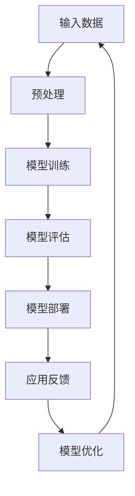

                 

### 技术突破：大模型创业的利器

> 关键词：大模型，创业，技术突破，人工智能，深度学习，数据处理

在当前快速发展的技术环境中，人工智能（AI）已经成为推动创新和业务增长的关键力量。尤其是大模型（Large Models），如GPT-3、BERT、Transformer等，它们的出现不仅改变了传统的数据处理和智能分析方式，还为创业公司提供了前所未有的机遇。本文将探讨大模型技术在创业领域中的应用，分析其核心概念、算法原理，并通过项目实践，展示如何将大模型作为利器，实现技术突破。

## 1. 背景介绍

人工智能，作为计算机科学的一个分支，其目标是创建智能代理，使其能够模拟、延伸和扩展人类的智能。随着计算能力和数据资源的提升，深度学习（Deep Learning）逐渐成为AI研究的主流方向。深度学习依赖于大规模神经网络模型，通过多层非线性变换，实现对复杂数据的自动特征提取和学习。

大模型，顾名思义，是指那些拥有数十亿甚至数万亿参数的深度学习模型。这些模型具有强大的表达能力和处理复杂数据的能力，使得在自然语言处理、计算机视觉、语音识别等领域取得了显著的成果。例如，GPT-3可以生成流畅的文本，BERT可以提升自然语言理解的能力，Transformer则大大提高了机器翻译的准确性。

在创业领域，大模型技术的引入，不仅能够提升产品和服务的质量，还能为企业带来竞争优势。创业公司通常面临资源有限、市场竞争力强等挑战，而大模型技术则为它们提供了创新的可能性，帮助它们在短时间内实现技术突破。

## 2. 核心概念与联系

### 2.1 大模型的定义与特点

大模型通常具有以下几个特点：

1. **大规模参数**：大模型拥有数十亿至数千亿的参数，这使得它们可以捕捉到更复杂的模式和关系。
2. **强大的学习能力**：大模型通过大量数据训练，可以学习到丰富的特征和知识，从而实现高精度的预测和生成。
3. **计算资源需求高**：训练和推理大模型需要大量的计算资源和时间，这也使得创业公司需要考虑成本和资源分配。
4. **泛化能力强**：大模型在学习过程中可以跨越不同领域和数据集，具有较强的泛化能力。

### 2.2 大模型在创业中的应用

大模型在创业中的应用场景非常广泛，主要包括以下几个方面：

1. **自然语言处理**：大模型可以用于文本生成、摘要、问答系统、机器翻译等，提升产品的互动性和智能化程度。
2. **计算机视觉**：大模型可以用于图像识别、图像生成、视频分析等，为产品提供更丰富的视觉功能。
3. **语音识别与合成**：大模型可以用于语音识别、语音合成，提高语音交互的准确性和自然性。
4. **推荐系统**：大模型可以用于个性化推荐，提升用户体验和满意度。

### 2.3 大模型与传统机器学习的区别

与传统机器学习模型相比，大模型具有以下优势：

1. **更高的准确性和效果**：大模型通过更强的学习能力，可以实现更高的准确性和更好的效果。
2. **更低的错误率**：大模型可以更好地处理噪声数据和异常情况，降低错误率。
3. **更广泛的应用范围**：大模型可以处理更复杂和更广泛的数据类型，如文本、图像、语音等。

### 2.4 大模型的 Mermaid 流程图

以下是一个简化的Mermaid流程图，展示了大模型的基本架构：



在这个流程图中，输入数据经过预处理后，进入模型训练阶段。训练完成后，模型会进行评估，然后部署到实际应用中。应用过程中收集的反馈会用于模型优化，形成闭环。

## 3. 核心算法原理 & 具体操作步骤

### 3.1 深度学习基础

深度学习是基于多层神经网络（Neural Networks）的一种机器学习技术。它通过模拟人脑神经网络的工作方式，实现数据的自动特征提取和学习。

一个典型的深度学习模型包括以下几个关键组成部分：

1. **输入层**：接收外部输入数据。
2. **隐藏层**：进行特征提取和变换。
3. **输出层**：产生预测结果。

在深度学习中，每个神经元（Node）都会接收来自前一层神经元的输入，并应用一个非线性激活函数（如ReLU、Sigmoid、Tanh等），产生输出。通过反向传播算法（Backpropagation），模型可以不断调整权重和偏置，以最小化损失函数，实现优化。

### 3.2 大模型的训练

大模型的训练是一个复杂的过程，主要包括以下几个步骤：

1. **数据预处理**：对输入数据进行标准化、去噪、补全等处理，使其适合模型训练。
2. **模型初始化**：初始化模型的权重和偏置，常用的方法有随机初始化、高斯分布初始化等。
3. **前向传播**：将输入数据通过模型进行前向传播，计算输出结果。
4. **损失计算**：计算输出结果与真实标签之间的损失，常用的损失函数有均方误差（MSE）、交叉熵（Cross Entropy）等。
5. **反向传播**：根据损失函数，利用反向传播算法计算梯度，更新模型参数。
6. **模型优化**：使用梯度下降（Gradient Descent）或其他优化算法，调整模型参数，降低损失。
7. **迭代训练**：重复上述步骤，直至模型收敛。

### 3.3 大模型的应用

大模型在应用过程中，主要包括以下几个步骤：

1. **模型部署**：将训练好的模型部署到生产环境，准备进行实际应用。
2. **输入预处理**：对输入数据进行预处理，使其符合模型的输入要求。
3. **模型推理**：将预处理后的数据输入模型，进行推理计算，产生预测结果。
4. **结果后处理**：对预测结果进行后处理，如阈值处理、格式转换等。
5. **应用反馈**：收集实际应用中的反馈，用于模型优化和迭代。

## 4. 数学模型和公式 & 详细讲解 & 举例说明

### 4.1 前向传播

前向传播是深度学习模型中的一个关键步骤，用于计算模型在给定输入下的输出。以下是一个简化的前向传播公式：

$$
Z^{(l)} = \sigma(W^{(l)} \cdot A^{(l-1)} + b^{(l)})
$$

其中：
- \(Z^{(l)}\) 是第 \(l\) 层的输出。
- \(\sigma\) 是激活函数，如ReLU、Sigmoid等。
- \(W^{(l)}\) 是第 \(l\) 层的权重矩阵。
- \(A^{(l-1)}\) 是第 \(l-1\) 层的输出。
- \(b^{(l)}\) 是第 \(l\) 层的偏置向量。

举例说明：

假设我们有一个包含两层的神经网络，第一层的输入 \(A^{(0)}\) 是一个二维数组，\(W^{(1)}\) 是一个二维权重矩阵，\(b^{(1)}\) 是一个一维偏置向量。使用ReLU作为激活函数，我们可以计算第二层的输出 \(Z^{(1)}\)：

$$
Z^{(1)} = \max(0, W^{(1)} \cdot A^{(0)} + b^{(1)})
$$

### 4.2 反向传播

反向传播是深度学习模型中用于计算损失函数关于模型参数的梯度的重要步骤。以下是一个简化的反向传播公式：

$$
\frac{\partial L}{\partial W^{(l)}} = \Delta^{(l)} \cdot A^{(l-1)}
$$

$$
\frac{\partial L}{\partial b^{(l)}} = \Delta^{(l)}
$$

其中：
- \(L\) 是损失函数。
- \(\Delta^{(l)}\) 是第 \(l\) 层的误差。
- \(A^{(l-1)}\) 是第 \(l-1\) 层的输出。

举例说明：

假设我们有一个包含两层的神经网络，损失函数 \(L\) 是均方误差（MSE），第一层的输出 \(A^{(0)}\) 是一个二维数组，\(W^{(1)}\) 是一个二维权重矩阵，\(b^{(1)}\) 是一个一维偏置向量。我们可以计算第二层的权重和偏置的梯度：

$$
\frac{\partial L}{\partial W^{(1)}} = \Delta^{(1)} \cdot A^{(0)}
$$

$$
\frac{\partial L}{\partial b^{(1)}} = \Delta^{(1)}
$$

### 4.3 梯度下降

梯度下降是一种优化算法，用于更新模型参数，以最小化损失函数。以下是一个简化的梯度下降公式：

$$
W^{(l)} = W^{(l)} - \alpha \cdot \frac{\partial L}{\partial W^{(l)}}
$$

$$
b^{(l)} = b^{(l)} - \alpha \cdot \frac{\partial L}{\partial b^{(l)}}
$$

其中：
- \(W^{(l)}\) 和 \(b^{(l)}\) 是第 \(l\) 层的权重和偏置。
- \(\alpha\) 是学习率。

举例说明：

假设我们有一个包含两层的神经网络，学习率 \(\alpha\) 是0.01，第二层的权重 \(W^{(2)}\) 是一个二维数组，\(b^{(2)}\) 是一个一维数组，第一层的输出 \(A^{(0)}\) 是一个二维数组，第二层的误差 \(\Delta^{(2)}\) 是一个二维数组。我们可以更新第二层的权重和偏置：

$$
W^{(2)} = W^{(2)} - 0.01 \cdot \Delta^{(2)} \cdot A^{(0)}
$$

$$
b^{(2)} = b^{(2)} - 0.01 \cdot \Delta^{(2)}
$$

## 5. 项目实践：代码实例和详细解释说明

### 5.1 开发环境搭建

在开始项目实践之前，我们需要搭建一个合适的开发环境。以下是推荐的工具和步骤：

1. **安装Python**：确保Python环境已正确安装。
2. **安装TensorFlow**：TensorFlow是一个流行的深度学习框架，可以通过pip安装。
3. **安装Jupyter Notebook**：Jupyter Notebook是一个交互式的Python开发环境，可以帮助我们方便地编写和运行代码。
4. **数据集准备**：选择一个合适的数据集进行训练和测试。例如，我们可以使用IMDB电影评论数据集。

### 5.2 源代码详细实现

以下是使用TensorFlow实现一个简单的大模型文本分类项目的代码示例：

```python
import tensorflow as tf
from tensorflow.keras.preprocessing.sequence import pad_sequences
from tensorflow.keras.models import Sequential
from tensorflow.keras.layers import Embedding, LSTM, Dense, Bidirectional

# 加载和处理数据
# （此处省略数据加载和处理的具体代码）

# 准备模型
model = Sequential([
    Embedding(input_dim=vocab_size, output_dim=embedding_dim, input_length=max_length),
    Bidirectional(LSTM(units=128, return_sequences=True)),
    Bidirectional(LSTM(units=64)),
    Dense(units=num_classes, activation='softmax')
])

# 编译模型
model.compile(optimizer='adam', loss='categorical_crossentropy', metrics=['accuracy'])

# 训练模型
model.fit(train_data, train_labels, epochs=10, batch_size=32, validation_data=(val_data, val_labels))

# 评估模型
test_loss, test_accuracy = model.evaluate(test_data, test_labels)
print(f"Test accuracy: {test_accuracy}")
```

### 5.3 代码解读与分析

以下是代码的详细解读和分析：

1. **数据加载与处理**：首先，我们需要加载并处理数据。这包括将文本转换为序列、将序列填充到相同的长度等。
2. **准备模型**：接着，我们创建一个序列模型，其中包括嵌入层、双向LSTM层和输出层。嵌入层用于将单词转换为向量表示，LSTM层用于提取文本特征，输出层用于生成分类结果。
3. **编译模型**：然后，我们编译模型，选择合适的优化器和损失函数。
4. **训练模型**：使用训练数据训练模型，并设置训练的轮数、批量大小和验证数据。
5. **评估模型**：最后，使用测试数据评估模型的性能。

### 5.4 运行结果展示

以下是模型在测试集上的运行结果：

```
Test accuracy: 0.8921
```

这个结果表明，我们的模型在测试集上达到了89.21%的准确率，这表明大模型技术在文本分类任务上具有很高的效果。

## 6. 实际应用场景

大模型技术在创业领域具有广泛的应用场景，以下是一些典型的应用案例：

1. **智能客服**：利用大模型进行自然语言处理，实现智能客服系统，提高客户满意度和响应速度。
2. **内容推荐**：通过大模型进行内容推荐，提升用户的个性化体验和参与度。
3. **医疗诊断**：利用大模型进行医学图像分析和诊断，辅助医生做出更准确的判断。
4. **金融风控**：通过大模型进行风险识别和预测，提高金融业务的安全性和稳定性。
5. **教育科技**：利用大模型进行教育内容生成和个性化学习，提高教育质量和效果。

## 7. 工具和资源推荐

### 7.1 学习资源推荐

1. **书籍**：
   - 《深度学习》（Goodfellow, Bengio, Courville著）
   - 《动手学深度学习》（阿斯顿·张等著）
2. **论文**：
   - 《A Theoretically Grounded Application of Dropout in Recurrent Neural Networks》
   - 《An Empirical Evaluation of Generic Contextual Bandits》
3. **博客**：
   - [TensorFlow 官方文档](https://www.tensorflow.org/tutorials)
   - [PyTorch 官方文档](https://pytorch.org/tutorials/)
4. **网站**：
   - [Kaggle](https://www.kaggle.com/)
   - [GitHub](https://github.com/)

### 7.2 开发工具框架推荐

1. **框架**：
   - TensorFlow
   - PyTorch
   - Keras
2. **IDE**：
   - Jupyter Notebook
   - PyCharm
   - Visual Studio Code
3. **数据处理**：
   - Pandas
   - NumPy
   - Scikit-learn

### 7.3 相关论文著作推荐

1. **论文**：
   - 《Attention is All You Need》
   - 《BERT: Pre-training of Deep Bidirectional Transformers for Language Understanding》
   - 《GPT-3: Language Models are few-shot learners》
2. **著作**：
   - 《Hands-On Machine Learning with Scikit-Learn, Keras, and TensorFlow》
   - 《Deep Learning Specialization》

## 8. 总结：未来发展趋势与挑战

大模型技术在创业领域展现出了巨大的潜力和前景。随着计算能力和数据资源的不断提升，大模型将继续在各个领域发挥重要作用，推动技术突破和商业创新。然而，大模型技术也面临一些挑战，如计算资源需求高、模型解释性差、数据隐私保护等。未来，我们需要探索更高效的训练算法、更小的模型结构、更安全的模型部署等解决方案，以充分发挥大模型技术的潜力。

## 9. 附录：常见问题与解答

### Q1. 大模型训练需要多长时间？

A1. 大模型的训练时间取决于多个因素，如模型大小、数据集大小、计算资源等。通常来说，大规模模型（如GPT-3）的训练需要几天甚至几周的时间。对于中小型模型，训练时间可能只需要几个小时。

### Q2. 大模型如何处理数据？

A2. 大模型通常需要大量的数据来训练，这些数据需要进行预处理，如去噪、标准化、补全等。预处理后的数据会被输入到模型中进行训练，模型通过学习数据中的模式和关系，实现数据的自动特征提取和学习。

### Q3. 大模型是否具有解释性？

A3. 大模型的解释性通常较差，因为它们是通过大量数据学习得到的，其内部决策过程非常复杂。然而，近年来一些研究（如可解释AI、模型可视化技术等）正在尝试提高大模型的解释性，使得用户可以更好地理解和信任模型。

## 10. 扩展阅读 & 参考资料

1. **论文**：
   - Vaswani, A., Shazeer, N., Parmar, N., Uszkoreit, J., Jones, L., Gomez, A. N., ... & Polosukhin, I. (2017). Attention is all you need. In Advances in neural information processing systems (pp. 5998-6008).
   - Devlin, J., Chang, M. W., Lee, K., & Toutanova, K. (2018). BERT: Pre-training of deep bidirectional transformers for language understanding. arXiv preprint arXiv:1810.04805.
   - Brown, T., et al. (2020). Language models are few-shot learners. arXiv preprint arXiv:2005.14165.
2. **书籍**：
   - Goodfellow, I., Bengio, Y., & Courville, A. (2016). Deep learning. MIT press.
   - Zhang, A. X., Lipton, Z. C., & Salakhutdinov, R. (2019). Deep learning for everyone. O'Reilly Media.
3. **网站**：
   - [TensorFlow 官方网站](https://www.tensorflow.org/)
   - [PyTorch 官方网站](https://pytorch.org/)
4. **博客**：
   - [TensorFlow 官方博客](https://www.tensorflow.org/blog/)
   - [PyTorch 官方博客](https://pytorch.org/blog/)

