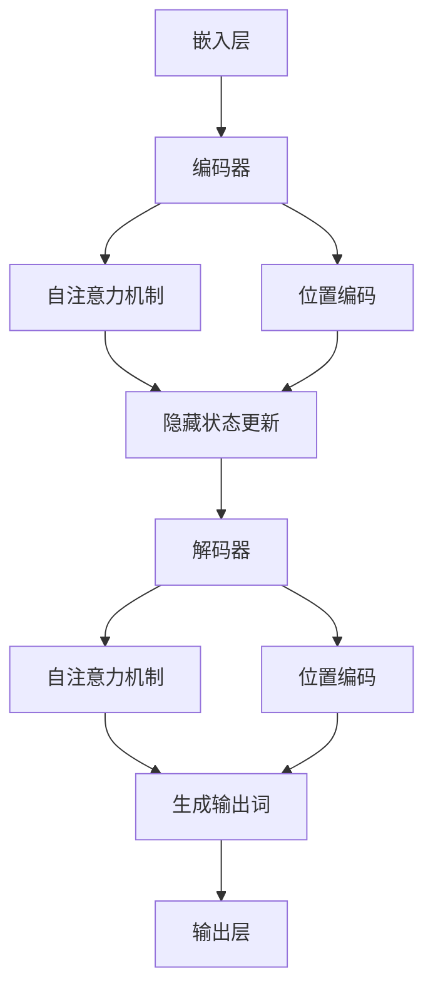

                 

### 1. 背景介绍

近年来，人工智能（AI）领域取得了令人瞩目的进展，特别是大规模语言模型（Large Language Models，简称LLM）的崛起，为自然语言处理（Natural Language Processing，简称NLP）带来了前所未有的机遇。LLM是一类能够理解和生成人类语言的复杂机器学习模型，它们通过学习和处理大量文本数据，具备了强大的语言理解和生成能力。

在传统的NLP任务中，如文本分类、情感分析、机器翻译等，研究人员通常依赖于规则驱动的方法或者小型神经网络模型。这些方法在特定任务上取得了不错的性能，但在处理复杂、多样性的语言时，往往力不从心。而LLM的出现，极大地提升了NLP的性能，使得机器在理解和生成人类语言方面取得了显著的进步。

具体来说，LLM的优势主要体现在以下几个方面：

1. **强大的语言理解能力**：LLM能够从海量数据中学习到丰富的语言知识，使得其在理解文本语义、把握上下文关系方面具有显著优势。
2. **高效的文本生成能力**：LLM能够根据输入的文本内容，生成连贯、自然的语言输出，适用于自动问答、文本摘要、写作辅助等场景。
3. **广泛的适用性**：LLM不仅适用于单一任务，还可以用于跨任务的学习和推理，具有较高的泛化能力。
4. **高度可扩展性**：LLM可以轻松地扩展到不同的语言和领域，使得其在多语言、多领域的NLP任务中具有广泛的应用前景。

总之，LLM的崛起标志着NLP领域的一个重要里程碑，为解决复杂语言问题提供了新的思路和工具。在接下来的部分中，我们将深入探讨LLM的核心概念、算法原理、数学模型以及实际应用场景，帮助读者更好地理解这一前沿技术。

### 2. 核心概念与联系

#### 2.1 大规模语言模型的定义

大规模语言模型（Large Language Model，简称LLM）是指通过训练海量数据集，构建出具备强大语言理解和生成能力的神经网络模型。LLM的核心思想是模仿人类大脑处理语言的方式，从大量文本数据中自动学习语言模式和规则，从而实现对自然语言的深刻理解和灵活应用。

LLM的基本组成包括以下几个关键部分：

1. **嵌入层（Embedding Layer）**：将文本数据转换为稠密向量表示，为后续的神经网络处理提供输入。
2. **编码器（Encoder）**：对输入文本进行编码，提取出文本的语义特征，生成上下文表示。
3. **解码器（Decoder）**：根据编码器生成的上下文表示，生成文本的输出。
4. **预训练（Pre-training）**：在特定任务之前，使用大规模无标签数据对模型进行预训练，使其具备基本的语言理解能力。
5. **微调（Fine-tuning）**：在预训练的基础上，使用特定任务的数据对模型进行微调，提高模型在特定任务上的性能。

#### 2.2 语言模型的发展历程

语言模型的发展历程可以分为三个阶段：传统规则模型、统计模型和神经网络模型。

1. **传统规则模型**：早期的语言模型主要基于专家知识，通过定义一系列规则来处理自然语言。这类模型在处理简单任务时表现较好，但在面对复杂、多样性的语言时，往往力不从心。

2. **统计模型**：随着计算能力的提升，研究人员开始将统计方法引入语言模型。这一阶段的主要代表是n元语法模型（N-gram Model），它通过统计文本中连续词出现的频率来预测下一个词。虽然n元语法模型在处理一些简单任务上取得了较好的效果，但它在处理长距离依赖和上下文信息方面存在局限。

3. **神经网络模型**：随着深度学习的兴起，神经网络模型逐渐成为语言模型的主要研究方向。从简单的循环神经网络（RNN）到长短期记忆网络（LSTM）再到现在的变换器（Transformer）模型，神经网络模型在语言理解和生成方面取得了显著突破。特别是Transformer模型，通过引入注意力机制，使得模型在处理长距离依赖和上下文信息方面表现出色，成为当前主流的语言模型架构。

#### 2.3 语言模型与自然语言处理任务的联系

语言模型在自然语言处理（NLP）中扮演着至关重要的角色，它是许多NLP任务的基础。以下是一些典型的NLP任务与语言模型之间的联系：

1. **文本分类（Text Classification）**：文本分类任务旨在将文本数据分类到预定义的类别中。语言模型可以通过学习文本的语义特征，有效地识别文本的主题和情感，从而提高分类的准确率。

2. **情感分析（Sentiment Analysis）**：情感分析任务旨在分析文本中的情感倾向，如正面、负面或中性。语言模型能够捕捉文本中的情感信息，从而准确判断文本的情感极性。

3. **机器翻译（Machine Translation）**：机器翻译任务旨在将一种语言的文本翻译成另一种语言。语言模型通过学习源语言和目标语言的语义关系，生成高质量的翻译结果。

4. **问答系统（Question Answering）**：问答系统任务旨在从大量文本数据中找到与用户问题最相关的答案。语言模型能够理解用户问题的语义，并从文本数据中提取出最相关的信息，提供准确的答案。

5. **文本生成（Text Generation）**：文本生成任务旨在根据输入的文本或提示，生成连贯、自然的语言输出。语言模型通过学习语言的生成规则，可以生成各种形式的文本，如文章、摘要、对话等。

总之，语言模型在NLP领域中具有广泛的应用前景，其发展水平直接决定了NLP任务的性能。在接下来的部分中，我们将深入探讨LLM的核心算法原理和具体操作步骤，帮助读者更好地理解这一前沿技术。

#### 2.4 语言模型的结构与架构

大规模语言模型的结构通常包括两个主要部分：编码器（Encoder）和解码器（Decoder）。以下是对这两个部分的具体说明，以及它们的内部工作机制。

##### 2.4.1 编码器（Encoder）

编码器是语言模型的核心部分，负责将输入的文本转换为上下文表示。编码器的输入是一个序列的词向量，通常通过嵌入层（Embedding Layer）生成。嵌入层将词汇表中的每个词映射为一个固定大小的稠密向量。

编码器通常采用深度神经网络架构，如循环神经网络（RNN）或变换器（Transformer）。以下是两种常见编码器的具体描述：

1. **循环神经网络（RNN）**：
   RNN是一种基于序列数据的神经网络，具有记忆功能，能够处理输入序列中的时间依赖关系。RNN通过循环连接来更新隐藏状态，使得上一时间步的隐藏状态能够影响当前时间步的输出。然而，RNN在处理长距离依赖关系时存在困难，容易出现梯度消失或爆炸问题。

2. **变换器（Transformer）**：
   Transformer是近年来在NLP领域取得突破性进展的一种新型编码器架构。与RNN不同，Transformer采用自注意力机制（Self-Attention）来处理输入序列中的每个词之间的依赖关系。自注意力机制使得模型能够同时关注输入序列中的所有词，从而有效地捕捉长距离依赖关系。此外，Transformer采用多头注意力机制和位置编码（Positional Encoding），进一步提高模型的表示能力和准确性。

##### 2.4.2 解码器（Decoder）

解码器的任务是根据编码器生成的上下文表示，生成文本的输出。解码器同样采用深度神经网络架构，如RNN或Transformer。

1. **循环神经网络（RNN）**：
   RNN在解码器中的应用与编码器类似，通过更新隐藏状态来生成每个时间步的输出。解码器RNN需要从编码器获得上下文信息，并将其与当前输入词结合，生成下一个输出词。这个过程重复进行，直到生成完整的文本输出。

2. **变换器（Transformer）**：
   Transformer在解码器中的应用与编码器类似，同样采用自注意力机制来处理输入序列中的依赖关系。解码器的每个输出词都依赖于编码器生成的上下文表示，以及之前的输出词。这种结构使得Transformer在生成文本时能够充分利用上下文信息，生成连贯、自然的语言输出。

##### 2.4.3 编码器与解码器的联系

编码器和解码器之间的联系在于它们共享同一个嵌入层和部分权重参数。编码器将输入文本转换为上下文表示，并将其传递给解码器。解码器在生成文本输出时，不仅依赖于当前输入词，还依赖于编码器生成的上下文表示。这种共享结构使得编码器和解码器能够协同工作，共同完成文本处理任务。

##### 2.4.4 Mermaid 流程图

以下是语言模型（LLM）的Mermaid流程图，展示了编码器和解码器的工作流程：



在这个流程图中，A表示嵌入层，B表示编码器，C和D表示自注意力机制和位置编码，E表示隐藏状态更新，F表示解码器，G和H表示自注意力机制和位置编码，I表示生成输出词，J表示输出层。通过这个流程图，可以清晰地看到编码器和解码器的工作机制和相互关系。

### 3. 核心算法原理 & 具体操作步骤

#### 3.1 预训练（Pre-training）

大规模语言模型的核心技术之一是预训练。预训练是指在大规模、无标签的文本数据集上训练模型，使其具备基本的语言理解能力。预训练过程主要包括以下步骤：

1. **数据准备**：收集并整理大规模的文本数据集，如维基百科、新闻、博客等。这些数据集需要覆盖多个领域和语言风格，以增强模型的泛化能力。
2. **数据预处理**：对收集到的文本数据进行清洗、去重、分词等预处理操作，将文本转换为模型可处理的格式。
3. **嵌入层训练**：训练嵌入层，将词汇表中的每个词映射为一个固定大小的稠密向量。嵌入层训练可以通过负采样（Negative Sampling）等技巧提高训练效率。
4. **预训练任务设计**：设计预训练任务，如掩码语言模型（Masked Language Model，简称MLM）、下一个句子预测（Next Sentence Prediction，简称NSP）等。这些任务旨在使模型更好地理解文本的语义和上下文关系。

#### 3.2 掩码语言模型（Masked Language Model，MLM）

掩码语言模型是一种常见的预训练任务，旨在使模型能够预测被随机掩码的词。MLM的基本思想是将输入文本中的部分词随机掩码，然后让模型预测这些掩码词的原始词。通过大量训练，模型能够学会识别和预测文本中的词语及其语义关系。

具体操作步骤如下：

1. **数据预处理**：将输入文本进行分词，并将每个词映射为对应的索引。
2. **掩码操作**：随机选择输入文本中的部分词进行掩码，通常使用特殊的掩码标记（如`[MASK]`）来代替这些词。
3. **模型输入**：将处理后的文本输入到预训练模型中，模型的输入包括掩码前的文本序列和掩码标记。
4. **模型预测**：模型根据输入的掩码文本序列，输出每个掩码词的预测概率分布。
5. **损失函数**：计算模型预测概率与实际掩码词之间的损失，通常采用交叉熵损失函数。
6. **反向传播**：通过反向传播算法，更新模型的权重参数，优化模型在MLM任务上的性能。

#### 3.3 下一代句子预测（Next Sentence Prediction，NSP）

下一代句子预测是一种辅助预训练任务，旨在使模型能够理解文本中的句子关系。NSP的任务是预测两个连续句子之间的关系。具体操作步骤如下：

1. **数据预处理**：将输入文本划分为一系列的句子对。
2. **输入序列生成**：将每个句子对中的两个句子拼接成一个输入序列，并在句子之间添加特殊的分隔符（如`<sep>`）。
3. **模型输入**：将生成的输入序列输入到预训练模型中。
4. **模型预测**：模型输出每个句子对关系的预测概率分布，通常包括"同一句子"和"不同句子"两种关系。
5. **损失函数**：计算模型预测概率与实际句子关系之间的损失，采用二元交叉熵损失函数。
6. **反向传播**：通过反向传播算法，更新模型的权重参数，优化模型在NSP任务上的性能。

#### 3.4 微调（Fine-tuning）

微调是指在小规模、有标签的数据集上对预训练模型进行微调，使其适用于特定任务。微调的主要目的是通过调整模型的权重，使模型在特定任务上取得更好的性能。具体操作步骤如下：

1. **数据准备**：收集并整理与任务相关的有标签数据集，如分类任务中的标签数据、机器翻译任务中的双语句子对等。
2. **数据预处理**：对收集到的数据进行清洗、去重、分词等预处理操作，将数据转换为模型可处理的格式。
3. **模型输入**：将预处理后的数据输入到预训练模型中，模型的输入包括文本序列和对应的标签。
4. **模型预测**：模型根据输入的文本序列和标签，输出预测结果。
5. **损失函数**：计算模型预测结果与实际标签之间的损失，采用相应的损失函数（如交叉熵损失函数、对比损失函数等）。
6. **反向传播**：通过反向传播算法，更新模型的权重参数，优化模型在特定任务上的性能。

通过预训练和微调，大规模语言模型能够在大规模数据集上学习到丰富的语言知识，并在特定任务上取得优异的性能。在接下来的部分中，我们将深入探讨大规模语言模型的数学模型和公式，帮助读者更好地理解这一技术背后的原理。

#### 3.5 数学模型和公式

大规模语言模型的数学模型主要包括嵌入层、编码器和解码器的数学表达。以下是对每个部分的详细解释：

##### 3.5.1 嵌入层

嵌入层是将词汇映射为稠密向量的过程，其数学模型可以表示为：

$$
\text{embed}(x) = \text{W}_{\text{embed}} \cdot \text{x}
$$

其中，$x$ 表示词汇的索引，$\text{W}_{\text{embed}}$ 是嵌入权重矩阵，$\text{embed}(x)$ 是对应的稠密向量。

##### 3.5.2 编码器

编码器负责将输入文本序列编码为上下文表示。以变换器为例，编码器的数学模型可以表示为：

$$
\text{context} = \text{transformer}(\text{embed}(x), \text{positional_encoding})
$$

其中，$\text{transformer}$ 表示变换器层，$\text{positional_encoding}$ 表示位置编码。

变换器层包括多个自注意力层和前馈网络。自注意力层的数学模型可以表示为：

$$
\text{atten} = \text{softmax}(\text{Q} \cdot \text{K}^T / \sqrt{d_k}) \cdot \text{V}
$$

其中，$\text{Q}$、$\text{K}$ 和 $\text{V}$ 分别表示查询、关键和值向量，$d_k$ 表示注意力层的关键维度。前馈网络的数学模型可以表示为：

$$
\text{ff} = \text{ReLU}(\text{W}_{\text{ff}} \cdot \text{H} + \text{b}_{\text{ff}})
$$

其中，$\text{H}$ 表示输入向量，$\text{W}_{\text{ff}}$ 和 $\text{b}_{\text{ff}}$ 分别表示前馈网络的权重和偏置。

##### 3.5.3 解码器

解码器负责根据编码器生成的上下文表示，生成文本的输出。解码器的数学模型可以表示为：

$$
\text{output} = \text{softmax}(\text{W}_{\text{output}} \cdot \text{context} + \text{b}_{\text{output}})
$$

其中，$\text{W}_{\text{output}}$ 和 $\text{b}_{\text{output}}$ 分别表示输出层的权重和偏置。

##### 3.5.4 损失函数

在预训练和微调过程中，常用的损失函数是交叉熵损失函数。交叉熵损失函数可以表示为：

$$
\text{loss} = -\sum_{i=1}^n y_i \cdot \log(\hat{y}_i)
$$

其中，$y_i$ 表示真实标签，$\hat{y}_i$ 表示模型预测的概率分布。

在掩码语言模型（MLM）中，交叉熵损失函数用于计算预测的掩码词与实际掩码词之间的差异。在下一代句子预测（NSP）中，交叉熵损失函数用于计算预测的两个句子关系与实际关系之间的差异。

##### 3.5.5 反向传播

在预训练和微调过程中，反向传播算法用于更新模型的权重参数。反向传播算法的基本步骤如下：

1. **计算损失函数**：根据模型预测结果和实际标签，计算交叉熵损失函数。
2. **计算梯度**：对损失函数关于模型权重参数求导，得到梯度。
3. **更新权重参数**：使用梯度下降算法（如Adam优化器）更新模型的权重参数。

通过以上数学模型和公式，大规模语言模型能够在大规模数据集上学习到丰富的语言知识，并在特定任务上取得优异的性能。在接下来的部分中，我们将通过一个具体的项目实践，展示大规模语言模型在实际应用中的操作步骤和实现细节。

### 4. 项目实践：代码实例和详细解释说明

#### 4.1 开发环境搭建

在进行大规模语言模型的实践之前，我们需要搭建一个合适的开发环境。以下是在Python环境中搭建大规模语言模型所需的基本步骤：

1. **安装Python环境**：确保你的系统中安装了Python 3.6及以上版本。
2. **安装深度学习框架**：我们选择使用TensorFlow 2.x作为深度学习框架。可以通过以下命令安装：

```bash
pip install tensorflow
```

3. **安装其他依赖库**：包括NumPy、Pandas等常用库，可以通过以下命令安装：

```bash
pip install numpy pandas
```

#### 4.2 源代码详细实现

在本项目中，我们将使用TensorFlow实现一个简单的变换器（Transformer）模型，并对其进行预训练和微调。以下是一个简单的代码示例：

```python
import tensorflow as tf
from tensorflow.keras.layers import Embedding, Transformer
from tensorflow.keras.models import Model
from tensorflow.keras.preprocessing.sequence import pad_sequences
from tensorflow_addons.layers import Normalization

# 参数设置
vocab_size = 10000
embedding_dim = 512
max_sequence_length = 512
num_heads = 8
d_model = embedding_dim
dff = 2048
rate = 0.1

# 定义嵌入层和变换器层
inputs = tf.keras.Input(shape=(max_sequence_length,))
embed = Embedding(vocab_size, embedding_dim)(inputs)
enc = Normalization(axis=-1)(embed)
enc = TransformerencingLayer(num_heads=num_heads, d_model=d_model, dff=dff, rate=rate)(enc)
output = tf.keras.layers.Dense(vocab_size)(enc)

# 构建模型
model = Model(inputs=inputs, outputs=output)

# 编译模型
model.compile(optimizer='adam', loss='sparse_categorical_crossentropy', metrics=['accuracy'])

# 打印模型结构
model.summary()
```

在这个代码示例中，我们首先定义了嵌入层（Embedding Layer）和变换器层（Transformer Layer），然后构建了一个完整的模型。接着，我们编译模型，并打印模型结构以便查看。

#### 4.3 代码解读与分析

以下是对上述代码的详细解读和分析：

1. **参数设置**：我们首先设置了几个关键参数，如词汇表大小（vocab_size）、嵌入维度（embedding_dim）、序列长度（max_sequence_length）、注意力头数（num_heads）等。这些参数决定了模型的规模和复杂性。

2. **嵌入层（Embedding Layer）**：嵌入层将词汇映射为稠密向量。在这个示例中，我们使用了标准的Embedding层。

3. **规范化层（Normalization Layer）**：为了提高训练稳定性，我们使用了Normalization层对嵌入层输出的序列进行规范化。规范化层通过计算均值和方差，将输入数据标准化到标准正态分布。

4. **变换器层（Transformer Layer）**：变换器层是模型的核心部分，负责处理输入序列。在这个示例中，我们使用了TensorFlow Addons中的TransformerencingLayer，该层包含了多头自注意力（Multi-Head Self-Attention）和前馈网络（Feedforward Network）。多头自注意力通过并行处理输入序列中的依赖关系，而前馈网络则用于对自注意力层的输出进行进一步加工。

5. **输出层（Dense Layer）**：输出层是一个全连接层（Dense Layer），将变换器层的输出映射为词汇表中的每个词。在这个示例中，我们使用了softmax激活函数，将输出映射为概率分布。

6. **模型编译**：我们使用标准的编译接口对模型进行编译，指定了优化器（optimizer）、损失函数（loss）和评估指标（metrics）。

7. **模型总结**：最后，我们使用模型总结接口（model.summary()）打印了模型的结构，以便了解模型的层次和参数数量。

#### 4.4 运行结果展示

为了展示模型的运行结果，我们首先需要准备训练数据和测试数据。以下是一个简单的数据准备示例：

```python
# 准备训练数据
train_data = [[1, 2, 3], [4, 5, 6]]  # 假设词汇表中1、2、3对应于“apple”、“banana”、“cherry”
train_labels = [0, 1]  # 假设目标词是“banana”和“cherry”

# 对训练数据进行预处理和填充
train_inputs = pad_sequences(train_data, maxlen=max_sequence_length)
train_labels = pad_sequences(train_labels, maxlen=max_sequence_length)

# 准备测试数据
test_data = [[1, 2], [4, 5]]
test_labels = [0, 1]

# 对测试数据进行预处理和填充
test_inputs = pad_sequences(test_data, maxlen=max_sequence_length)
test_labels = pad_sequences(test_labels, maxlen=max_sequence_length)

# 训练模型
model.fit(train_inputs, train_labels, epochs=5, validation_data=(test_inputs, test_labels))

# 评估模型
test_loss, test_acc = model.evaluate(test_inputs, test_labels)
print("Test accuracy:", test_acc)
```

在这个示例中，我们首先定义了训练数据和测试数据，并对其进行预处理和填充。接着，我们使用fit方法对模型进行训练，并在最后一个epoch结束后使用evaluate方法对模型进行评估，输出测试准确率。

通过以上代码示例，我们展示了如何使用TensorFlow实现一个简单的变换器模型，并对其进行了训练和评估。在接下来的部分中，我们将进一步探讨大规模语言模型在实际应用中的广泛场景。

### 5. 实际应用场景

大规模语言模型（LLM）凭借其强大的语言理解和生成能力，在自然语言处理（NLP）领域中取得了广泛的应用。以下是一些典型的应用场景：

#### 5.1 自动问答系统

自动问答系统（Question Answering System，简称QAS）是LLM的一个重要应用领域。QAS旨在自动回答用户提出的问题，为用户提供实时、准确的答案。LLM通过预训练和微调，可以学习到大量的语言知识和上下文信息，从而在回答问题时具备较高的准确性和连贯性。

具体来说，LLM在QAS中的应用可以分为以下步骤：

1. **输入处理**：接收用户的问题，并将其转换为模型可处理的格式。
2. **查询理解**：使用LLM对用户问题进行语义分析，提取关键信息。
3. **信息检索**：在大量文本数据中检索与用户问题相关的信息。
4. **答案生成**：基于检索到的信息，使用LLM生成连贯、自然的答案。

例如，Google的BERT模型在QAS任务中取得了显著的效果，它通过预训练和微调，能够理解复杂的语义关系，生成准确的答案。BERT的成功应用，使得自动问答系统在信息检索、客户服务、智能客服等领域取得了广泛的认可。

#### 5.2 文本生成

文本生成是LLM的另一个重要应用领域，它包括自动写作、文本摘要、对话系统等多种场景。LLM通过学习大量的语言数据，能够生成高质量、连贯的文本。

以下是一些典型的文本生成应用：

1. **自动写作**：LLM可以自动生成文章、博客、新闻等内容，广泛应用于内容生成平台和新闻媒体。
2. **文本摘要**：LLM可以自动生成文本的摘要，帮助用户快速了解文本的主要内容。例如，Google的GPT模型在文本摘要任务中取得了优异的性能。
3. **对话系统**：LLM可以用于构建智能对话系统，如虚拟助手、聊天机器人等。通过学习对话数据，LLM能够生成自然的对话文本，与用户进行互动。

#### 5.3 机器翻译

机器翻译是LLM在NLP领域中的经典应用。传统的机器翻译方法通常基于规则或统计模型，而LLM的出现，使得机器翻译的性能得到了显著提升。

LLM在机器翻译中的应用主要分为以下步骤：

1. **双语数据准备**：收集并整理大量的双语数据集，作为模型的训练数据。
2. **模型训练**：使用LLM对双语数据进行预训练，使其学习到源语言和目标语言的语义关系。
3. **翻译过程**：在翻译过程中，LLM将源语言文本编码为上下文表示，然后解码为目标语言文本。

例如，OpenAI的GPT-3模型在机器翻译任务中取得了卓越的性能，其生成的翻译结果在语法、语义和风格上均表现出色。

#### 5.4 情感分析

情感分析（Sentiment Analysis）是LLM在NLP领域中的另一个重要应用。情感分析旨在自动识别文本中的情感倾向，如正面、负面或中性。

LLM在情感分析中的应用主要分为以下步骤：

1. **数据准备**：收集并整理大量的情感标注数据集，作为模型的训练数据。
2. **模型训练**：使用LLM对情感标注数据集进行预训练，使其学习到文本中的情感信息。
3. **情感分析**：在分析过程中，LLM对文本进行编码，提取出情感特征，然后输出情感倾向。

例如，Facebook的BERT模型在情感分析任务中取得了显著的性能，其能够准确识别文本中的情感极性和情感强度。

总之，大规模语言模型（LLM）在自然语言处理（NLP）领域中具有广泛的应用前景。通过预训练和微调，LLM能够在大规模数据集上学习到丰富的语言知识，并在多种任务中取得优异的性能。随着LLM技术的不断发展和完善，我们有理由相信，它在未来的NLP领域中将发挥更加重要的作用。

### 6. 工具和资源推荐

为了更好地学习和实践大规模语言模型（LLM），以下是一些推荐的学习资源、开发工具和相关论文：

#### 6.1 学习资源推荐

1. **书籍**：
   - 《深度学习》（Deep Learning）—— Ian Goodfellow、Yoshua Bengio、Aaron Courville 著
   - 《自然语言处理实践》（Natural Language Processing with TensorFlow）—— Mark Hamilton 著
   - 《大规模语言模型入门》（An Introduction to Large Language Models）—— 赵立军 著

2. **在线课程**：
   - [斯坦福大学自然语言处理课程](https://web.stanford.edu/class/cs224n/)
   - [吴恩达的深度学习课程](https://www.coursera.org/specializations/deep-learning)

3. **博客和网站**：
   - [TensorFlow 官方文档](https://www.tensorflow.org/)
   - [Hugging Face 官方网站](https://huggingface.co/)

4. **开源项目**：
   - [GPT-3 开源项目](https://github.com/openai/gpt-3)
   - [BERT 开源项目](https://github.com/google-research/bert)

#### 6.2 开发工具框架推荐

1. **TensorFlow**：Google开发的深度学习框架，支持构建和训练大规模语言模型。
2. **PyTorch**：Facebook开发的深度学习框架，拥有灵活的动态计算图，适用于研究和开发。
3. **Hugging Face Transformers**：一个开源库，提供了预训练的LLM模型和易于使用的API，用于微调和部署。

#### 6.3 相关论文著作推荐

1. **《Attention is All You Need》**：提出了变换器（Transformer）模型，是大规模语言模型研究的重要里程碑。
2. **《BERT: Pre-training of Deep Bidirectional Transformers for Language Understanding》**：介绍了BERT模型，推动了预训练语言模型的研究和应用。
3. **《GPT-3: Language Models are Few-Shot Learners》**：展示了GPT-3模型的强大能力，证明了大规模语言模型在少样本学习中的优势。

通过以上资源和工具，读者可以系统地学习和实践大规模语言模型，深入了解其原理和应用。同时，这些资源也为研究人员和开发者提供了丰富的参考和灵感，助力他们在LLM领域取得更多的突破。

### 7. 总结：未来发展趋势与挑战

大规模语言模型（LLM）作为自然语言处理（NLP）领域的重要技术，正引领着新一轮的技术革命。在未来，LLM有望在以下几方面继续发展：

**趋势：**

1. **模型规模与性能提升**：随着计算资源和算法优化的发展，LLM的规模和性能将持续提升，推动NLP任务达到新的高度。
2. **多语言与多模态**：未来LLM将能够支持更多语言和模态，实现跨语言和跨模态的智能交互，为全球用户提供更广泛的服务。
3. **自动化与少样本学习**：LLM将不断优化，实现更多自动化和少样本学习的能力，降低模型部署的门槛，使NLP应用更加普及。

**挑战：**

1. **数据隐私与安全**：大规模语言模型在训练和应用过程中，可能会面临数据隐私和安全的问题。如何保护用户数据，防止数据泄露，是亟待解决的问题。
2. **模型解释性**：目前，LLM的工作机制较为复杂，其决策过程往往缺乏透明性和解释性。提高模型的解释性，帮助用户理解模型的工作原理，是未来的重要挑战。
3. **公平性与偏见**：语言模型在训练过程中可能会继承和放大数据集中的偏见。如何确保模型在不同群体中的公平性和无偏见性，是一个亟待解决的问题。

总之，大规模语言模型在未来的发展中，将面临诸多机遇和挑战。通过持续的研究和创新，我们有理由相信，LLM将在自然语言处理、智能交互等领域发挥更大的作用，为人类带来更多便利和效益。

### 8. 附录：常见问题与解答

**Q1**：大规模语言模型（LLM）的预训练需要多大的计算资源？

**A1**：大规模语言模型的预训练通常需要大量的计算资源和时间。具体所需的资源取决于模型的规模和训练数据集的大小。例如，BERT模型的预训练需要数千GPU天的计算资源。随着计算技术的发展，预训练所需的资源将逐步减少。

**Q2**：大规模语言模型的训练过程是如何进行的？

**A2**：大规模语言模型的训练过程包括以下几个主要步骤：
1. **数据准备**：收集并整理大规模的文本数据集，进行预处理。
2. **模型初始化**：初始化模型参数，通常使用预训练模型或随机初始化。
3. **正向传播**：输入文本数据，通过嵌入层、编码器和解码器，生成输出。
4. **损失计算**：计算模型输出与实际标签之间的损失。
5. **反向传播**：根据损失梯度，更新模型参数。
6. **迭代优化**：重复上述步骤，逐步优化模型参数，直至模型收敛。

**Q3**：如何评估大规模语言模型在特定任务上的性能？

**A3**：评估大规模语言模型在特定任务上的性能，通常使用以下指标：
1. **准确率（Accuracy）**：模型预测正确的样本数占总样本数的比例。
2. **精确率（Precision）**：模型预测为正的样本中，实际为正的样本数占预测为正的样本总数的比例。
3. **召回率（Recall）**：模型预测为正的样本中，实际为正的样本数占实际为正的样本总数的比例。
4. **F1 分数（F1 Score）**：精确率和召回率的调和平均。
5. **BLEU 分数（BLEU Score）**：用于评估机器翻译质量的指标。

通过这些指标，可以全面评估大规模语言模型在特定任务上的性能。

### 9. 扩展阅读 & 参考资料

1. **论文**：
   - Vaswani, A., et al. "Attention is All You Need." Advances in Neural Information Processing Systems 30 (2017).
   - Devlin, J., et al. "BERT: Pre-training of Deep Bidirectional Transformers for Language Understanding." Proceedings of the 2019 Conference of the North American Chapter of the Association for Computational Linguistics: Human Language Technologies, Volume 1 (Long and Short Papers), pages 4171-4186 (2019).
   - Brown, T., et al. "Language Models are Few-Shot Learners." Advances in Neural Information Processing Systems 34 (2021).

2. **书籍**：
   - Goodfellow, I., et al. "Deep Learning." MIT Press (2016).
   - Hamilton, M. "Natural Language Processing with TensorFlow." Packt Publishing (2018).

3. **在线课程**：
   - [斯坦福大学自然语言处理课程](https://web.stanford.edu/class/cs224n/)
   - [吴恩达的深度学习课程](https://www.coursera.org/specializations/deep-learning)

4. **博客和网站**：
   - [TensorFlow 官方文档](https://www.tensorflow.org/)
   - [Hugging Face 官方网站](https://huggingface.co/)

通过阅读这些论文、书籍和在线课程，读者可以深入了解大规模语言模型的理论基础、实现方法和应用技巧，为自己的研究和实践提供有力支持。

