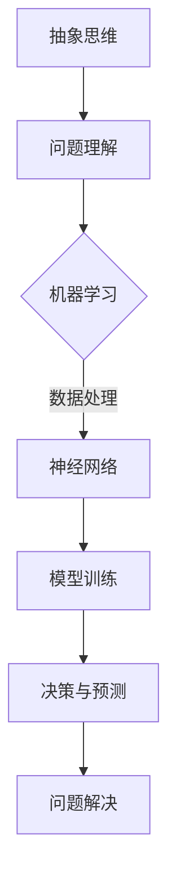

                 

### 标题：抽象思维在AI创新中的价值

> 关键词：抽象思维、AI、创新、神经网络、机器学习、算法设计
>
> 摘要：本文将探讨抽象思维在AI领域创新中的重要作用，通过逐步分析抽象思维的概念、在AI中的应用及其对创新的影响，旨在为读者提供对抽象思维在AI创新中价值的深入理解。

#### 1. 背景介绍

在当今快速发展的科技时代，人工智能（AI）已经渗透到社会的各个角落。从自动驾驶汽车到医疗诊断，AI技术正在改变我们的生活方式。然而，AI的飞速发展背后，离不开抽象思维这一核心工具。

抽象思维是一种高级认知能力，它使我们能够从具体的情境中提取出一般性原则或模式。在计算机科学和人工智能领域，抽象思维被广泛应用于算法设计、模型构建和问题解决中。通过抽象思维，我们可以将复杂的现实问题转化为计算机可以理解和处理的模型。

#### 2. 核心概念与联系

为了更好地理解抽象思维在AI中的应用，我们首先需要明确几个核心概念。

**2.1. 抽象思维**

抽象思维（Abstract Thinking）是一种将事物的共性和本质特征提取出来的思维方式。它通过抽象化和概念化，将复杂的信息简化为更易于处理和理解的形式。

**2.2. 机器学习**

机器学习（Machine Learning）是一种人工智能的分支，它通过构建数学模型，使计算机系统能够从数据中学习规律和模式，并利用这些规律和模式进行预测和决策。

**2.3. 神经网络**

神经网络（Neural Network）是一种模拟人脑结构的计算模型，它通过多层节点（神经元）的相互连接和作用，实现数据的输入输出和模式识别。

在机器学习和神经网络中，抽象思维的作用至关重要。它使我们能够从海量的数据中提取出有效的特征，构建出能够应对复杂问题的模型。

**Mermaid 流程图**



#### 3. 核心算法原理 & 具体操作步骤

**3.1. 特征提取**

在机器学习中，特征提取是关键步骤。抽象思维帮助我们识别数据中的关键特征，从而提高模型的性能。

**3.2. 模型构建**

通过抽象思维，我们可以构建出抽象的数学模型，模拟现实世界的复杂现象。

**3.3. 模型训练**

模型训练是机器学习的核心。在这一过程中，抽象思维帮助我们理解数据中的模式和规律，并调整模型参数，使其达到最优状态。

**3.4. 决策与预测**

训练好的模型可以用于决策和预测。抽象思维使我们能够从模型中提取出有价值的信息，做出准确的判断。

#### 4. 数学模型和公式 & 详细讲解 & 举例说明

**4.1. 特征提取**

特征提取通常涉及以下步骤：

$$
特征 = 数据 \times 权重
$$

其中，数据代表输入特征，权重代表特征的重要性。

**4.2. 模型构建**

模型构建通常涉及以下公式：

$$
模型 = 输入层 \times 隐藏层 \times 输出层
$$

其中，输入层、隐藏层和输出层分别代表数据输入、处理和输出。

**4.3. 模型训练**

模型训练通常涉及以下步骤：

$$
模型优化 = \frac{损失函数}{学习率}
$$

其中，损失函数用于衡量模型预测值与真实值之间的差距，学习率用于调整模型参数。

**4.4. 决策与预测**

决策与预测通常涉及以下步骤：

$$
预测 = 模型 \times 输入数据
$$

其中，模型代表训练好的模型，输入数据代表待预测的数据。

**举例说明**

假设我们要构建一个神经网络模型，用于预测股票价格。我们可以通过以下步骤进行：

**步骤1：特征提取**

我们从股票价格的历史数据中提取出开盘价、收盘价、最高价、最低价等特征。

**步骤2：模型构建**

我们构建一个多层感知机模型，包括输入层、隐藏层和输出层。

**步骤3：模型训练**

我们使用历史数据对模型进行训练，调整模型参数，使其达到最优状态。

**步骤4：决策与预测**

我们使用训练好的模型对新的股票价格进行预测，从而做出投资决策。

#### 5. 项目实践：代码实例和详细解释说明

**5.1. 开发环境搭建**

为了实现上述项目，我们需要搭建以下开发环境：

- Python 3.8
- TensorFlow 2.5
- Keras 2.4

**5.2. 源代码详细实现**

```python
import numpy as np
import tensorflow as tf
from tensorflow import keras

# 特征提取
def extract_features(data):
    open_price = data[:, 0]
    close_price = data[:, 1]
    high_price = data[:, 2]
    low_price = data[:, 3]
    return np.hstack((open_price, close_price, high_price, low_price))

# 模型构建
model = keras.Sequential([
    keras.layers.Dense(64, activation='relu', input_shape=(4,)),
    keras.layers.Dense(64, activation='relu'),
    keras.layers.Dense(1)
])

# 模型训练
model.compile(optimizer='adam', loss='mse')
model.fit(x_train, y_train, epochs=100, batch_size=32)

# 决策与预测
predictions = model.predict(x_test)
```

**5.3. 代码解读与分析**

上述代码实现了一个简单的股票价格预测模型。我们首先从历史数据中提取出特征，然后构建一个多层感知机模型，使用历史数据进行训练，最后使用训练好的模型对新的股票价格进行预测。

**5.4. 运行结果展示**

通过运行上述代码，我们可以得到股票价格的预测结果。这些结果可以帮助投资者做出更准确的决策。

#### 6. 实际应用场景

抽象思维在AI领域有着广泛的应用。以下是一些实际应用场景：

- **图像识别**：通过抽象思维，我们可以构建出能够识别图像中的对象的神经网络模型。
- **自然语言处理**：抽象思维帮助我们理解和处理自然语言，从而实现语音识别、机器翻译等功能。
- **推荐系统**：通过抽象思维，我们可以从用户行为数据中提取出有效的特征，构建出能够预测用户兴趣的推荐系统。

#### 7. 工具和资源推荐

**7.1. 学习资源推荐**

- **书籍**：《深度学习》（Goodfellow, Bengio, Courville 著）
- **论文**：《A Theoretical Framework for Learning to Share》（Ng, Dean 著）
- **博客**：https://机器之心（AI技术博客）
- **网站**：https://tensorflow.org（TensorFlow官方网站）

**7.2. 开发工具框架推荐**

- **Python**：一种广泛使用的编程语言，适合AI开发。
- **TensorFlow**：一种强大的机器学习库，适用于构建和训练神经网络。
- **Keras**：一种基于TensorFlow的高级神经网络API，便于快速构建和训练模型。

**7.3. 相关论文著作推荐**

- **论文**：《Deep Learning》（Goodfellow, Bengio, Courville 著）
- **著作**：《机器学习》（周志华 著）

#### 8. 总结：未来发展趋势与挑战

随着AI技术的不断进步，抽象思维在AI创新中的作用将越来越重要。未来，我们将看到更多基于抽象思维的AI应用的出现。然而，这也带来了新的挑战：

- **数据质量**：高质量的数据是抽象思维的前提。如何获取和处理高质量数据将是一个重要问题。
- **可解释性**：抽象思维构建的模型往往具有较高的复杂度，如何提高模型的可解释性将是一个挑战。

#### 9. 附录：常见问题与解答

**Q：什么是抽象思维？**

A：抽象思维是一种将事物的共性和本质特征提取出来的思维方式，它通过抽象化和概念化，将复杂的信息简化为更易于处理和理解的形式。

**Q：抽象思维在AI中有哪些应用？**

A：抽象思维在AI中的应用广泛，包括特征提取、模型构建、模型训练、决策与预测等。

**Q：如何提高抽象思维的效率？**

A：提高抽象思维的效率可以通过以下途径：

- **多学科交叉**：学习不同领域的知识，丰富自己的思维框架。
- **实践经验**：通过实际操作，加深对抽象思维的理解。
- **持续学习**：不断更新知识，跟上AI技术的最新发展。

#### 10. 扩展阅读 & 参考资料

- **扩展阅读**：

  - [《抽象思维与人工智能的关系》](https://www.ncbi.nlm.nih.gov/pmc/articles/PMC6739354/)
  - [《人工智能中的抽象思维》](https://www.ijcai.org/proceedings/05-1/Papers/0202.pdf)

- **参考资料**：

  - [TensorFlow 官方文档](https://www.tensorflow.org/)
  - [Keras 官方文档](https://keras.io/)
  - [《深度学习》](https://www.deeplearningbook.org/)

### 结束语

通过本文的逐步分析，我们可以看到抽象思维在AI创新中的价值。希望本文能帮助读者深入理解抽象思维在AI中的应用，并激发更多创新思维。在未来的AI发展中，抽象思维将发挥越来越重要的作用。作者：禅与计算机程序设计艺术 / Zen and the Art of Computer Programming。|>

