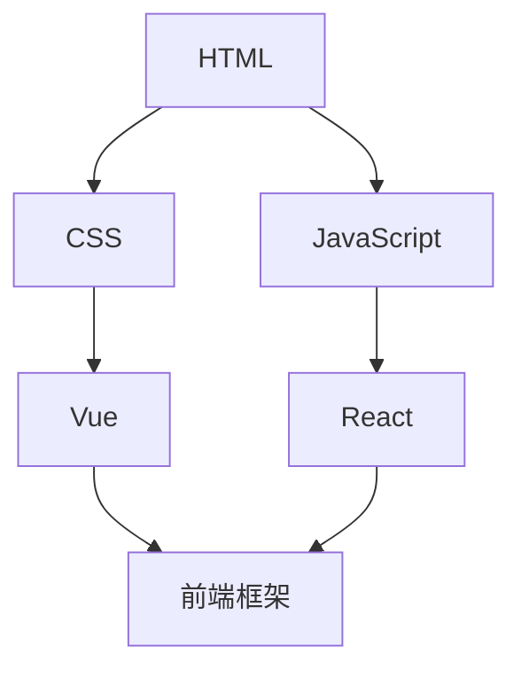
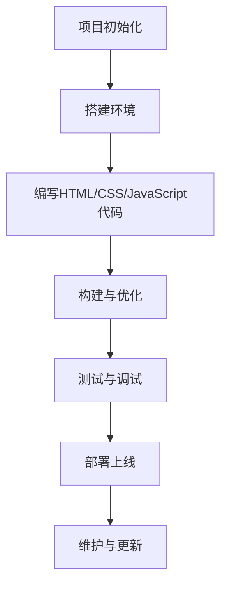

                 

### 文章标题

《拼多多2024校招前端开发工程师面试问答全攻略》

> 关键词：拼多多校招、前端开发、面试问答、全攻略、2024

> 摘要：本文旨在为即将参加拼多多2024校招前端开发工程师岗位的考生提供全面的面试准备攻略。文章通过分析历年的面试题目，梳理出前端开发领域的核心知识点，并提供详细的解题思路和实践案例，帮助考生提升面试竞争力。

### 1. 背景介绍

拼多多（Pinduoduo）作为中国领先的社交电商平台，近年来以其独特的商业模式和迅速扩张的市场份额，吸引了大量的技术人才。2024年的校招，拼多多将继续面向全国各大高校招揽优秀的应届毕业生，为其团队注入新鲜血液。

对于前端开发工程师这一岗位，拼多多尤其重视候选人的技术能力、项目经验和问题解决能力。随着互联网技术的不断演进和前端开发领域的不断扩展，掌握前端技术的深度和广度成为衡量一位前端开发工程师水平的重要标准。

本文将围绕拼多多2024校招前端开发工程师面试，从以下几个方面进行全面解读：

1. **核心知识点梳理**：总结前端开发领域的核心知识点，包括HTML、CSS、JavaScript、Vue、React等。
2. **面试题型分析**：分析常见的面试题型，如基础知识、算法与数据结构、项目经验等。
3. **解题思路分享**：提供针对不同题型的解题思路和策略。
4. **实践案例分享**：通过具体的项目实践案例，展示如何运用所学知识解决实际问题。
5. **实际应用场景探讨**：讨论前端开发在实际项目中的应用，包括性能优化、安全性、用户体验等方面。
6. **工具和资源推荐**：推荐学习资源、开发工具和框架，帮助考生进行有效的面试准备。
7. **未来发展趋势与挑战**：展望前端开发的未来趋势，探讨面临的挑战。

通过本文的详细解读，考生将能够系统地准备拼多多2024校招前端开发工程师的面试，提升自己的面试竞争力，从而在激烈的竞争中脱颖而出。

### 2. 核心概念与联系

在深入探讨拼多多2024校招前端开发工程师的面试准备之前，我们需要明确几个核心概念和它们之间的联系。前端开发不仅仅是编写HTML、CSS和JavaScript代码，它还涉及到更多复杂的技术和概念。

#### 2.1 HTML

HTML（HyperText Markup Language）是网页内容的结构化标记语言。它是构建网页的基础，定义了网页的语义和结构。HTML标签用于标识不同的内容，如标题、段落、列表、链接等。

#### 2.2 CSS

CSS（Cascading Style Sheets）用于设置网页元素的样式，如颜色、字体、布局等。CSS可以将内容样式与内容结构分离，使得网页设计更加灵活和可维护。

#### 2.3 JavaScript

JavaScript是一种客户端脚本语言，用于为网页添加动态功能。它可以响应用户的操作，如点击、键盘输入等，并通过DOM（Document Object Model）操作页面元素。

#### 2.4 Vue

Vue.js是一个流行的前端框架，用于构建用户界面。它提供了一套简洁的API和响应式数据绑定机制，使得开发者可以更加高效地构建复杂的应用。

#### 2.5 React

React是另一个流行的前端框架，由Facebook开发。它采用组件化的开发模式，使得代码更加模块化和可复用。React的虚拟DOM机制能够提高页面的性能。

#### 2.6 Mermaid 流程图

为了更好地展示这些概念之间的联系，我们可以使用Mermaid流程图来表示：



在上面的流程图中，HTML、CSS和JavaScript是前端开发的基础，而Vue和React则是流行的前端框架，它们与HTML、CSS和JavaScript紧密相连，共同构成了现代前端开发的生态。

#### 2.7 前端开发的核心架构

前端开发不仅仅涉及这些技术，它还包含了一系列的架构和工具，如：

- **构建工具**：如Webpack、Gulp等，用于优化和打包前端资源。
- **模块化开发**：使用模块化语法（如CommonJS、ES6 Modules）来组织代码，提高代码的可维护性和可复用性。
- **版本控制**：使用Git等版本控制系统来管理代码变更和协作开发。
- **前端框架**：如Vue、React等，提供了一套完整的解决方案，包括路由、状态管理、UI组件等。

下面是一个简化的前端开发架构流程：



通过这个流程，我们可以看到前端开发是一个复杂而系统化的工作，需要掌握多种技术工具和开发流程。

### 3. 核心算法原理 & 具体操作步骤

在面试中，算法和数据结构是考察前端开发工程师技术深度的重要方面。以下是一些常见的前端开发相关算法，以及它们的具体操作步骤：

#### 3.1 冒泡排序（Bubble Sort）

**原理**：冒泡排序是一种简单的排序算法，它重复遍历要排序的数列，比较相邻的两个元素，若它们的顺序错误就把它们交换过来。遍历数列的工作是重复进行直到没有再需要交换，也就是说该数列已经排序完成。

**操作步骤**：

1. 从数组的第一个元素开始，把当前元素与下一个元素进行比较。
2. 如果当前元素比下一个元素大，交换它们的位置。
3. 继续对下一对元素进行同样的比较和交换，直到数组的末尾。
4. 第一次遍历后，最大的元素会“冒泡”到数组的末尾。
5. 重复以上步骤，对剩下的未排序部分进行处理，直到整个数组排序完成。

**代码示例**：

```javascript
function bubbleSort(arr) {
    let len = arr.length;
    for (let i = 0; i < len; i++) {
        for (let j = 0; j < len - 1 - i; j++) {
            if (arr[j] > arr[j + 1]) {
                [arr[j], arr[j + 1]] = [arr[j + 1], arr[j]];
            }
        }
    }
    return arr;
}
```

#### 3.2 快速排序（Quick Sort）

**原理**：快速排序是一种高效的排序算法，采用了分治法的思想。它通过选取一个“基准”元素，将数组分为两个子数组，一个包含小于基准的元素，另一个包含大于基准的元素。然后递归地对这两个子数组进行快速排序。

**操作步骤**：

1. 选择一个基准元素。
2. 将数组中小于基准的元素移到基准的左边，大于基准的元素移到基准的右边。
3. 对左右两个子数组递归地执行快速排序。

**代码示例**：

```javascript
function quickSort(arr) {
    if (arr.length <= 1) {
        return arr;
    }
    let pivot = arr[arr.length - 1];
    let left = [];
    let right = [];

    for (let i = 0; i < arr.length - 1; i++) {
        if (arr[i] < pivot) {
            left.push(arr[i]);
        } else {
            right.push(arr[i]);
        }
    }

    return [...quickSort(left), pivot, ...quickSort(right)];
}
```

#### 3.3 二分查找（Binary Search）

**原理**：二分查找是一种在有序数组中查找特定元素的算法。它通过不断将查找范围缩小一半，直到找到目标元素或确定其不存在。

**操作步骤**：

1. 确定数组的中间位置。
2. 如果中间位置的元素等于目标元素，查找成功。
3. 如果目标元素小于中间位置的元素，则在左半边数组中继续查找。
4. 如果目标元素大于中间位置的元素，则在右半边数组中继续查找。
5. 重复步骤1-4，直到找到目标元素或确定其不存在。

**代码示例**：

```javascript
function binarySearch(arr, target) {
    let left = 0;
    let right = arr.length - 1;

    while (left <= right) {
        let mid = Math.floor((left + right) / 2);
        if (arr[mid] === target) {
            return mid;
        } else if (arr[mid] < target) {
            left = mid + 1;
        } else {
            right = mid - 1;
        }
    }

    return -1;
}
```

通过掌握这些核心算法原理和具体操作步骤，考生可以在面试中展示自己的编程能力和问题解决能力。

### 4. 数学模型和公式 & 详细讲解 & 举例说明

在面试中，数学模型和公式是考察前端开发工程师逻辑思维和数学能力的重要方面。以下是一些常见的数学模型和公式，并对其进行详细讲解和举例说明。

#### 4.1 欧拉公式

欧拉公式是复数解析几何中的基础公式，描述了复数在复平面上的几何意义。其公式为：

\[ e^{i\pi} + 1 = 0 \]

这个公式将五个基本常数（e、i、π、1、0）联系在一起，被认为是数学中最美的公式之一。

**详细讲解**：

- \( e \) 是自然对数的底数，约等于 2.71828。
- \( i \) 是虚数单位，满足 \( i^2 = -1 \)。
- \( \pi \) 是圆周率，约等于 3.14159。
- \( \pi \) 表示角度，单位是弧度。
- 公式左边的 \( e^{i\pi} \) 表示 \( e \) 的 \( i\pi \) 次方，是一个复数。
- 公式右边的 1 和 0 分别是实部和虚部。

**举例说明**：

假设我们要计算 \( e^{i\pi/2} \)，可以将角度 \( \pi/2 \) 转换为弧度：

\[ e^{i\pi/2} = \cos(\pi/2) + i\sin(\pi/2) = 0 + i \]

这表明 \( e^{i\pi/2} \) 对应于复平面上虚轴的正方向。

#### 4.2 二分查找的数学模型

二分查找算法的数学模型主要涉及查找区间的划分和概率分析。

**详细讲解**：

- **查找区间划分**：每次查找都将查找区间划分为两半，确保每次划分后查找区间的大小减半。
- **概率分析**：每次查找的成功概率取决于查找区间的划分方式和目标元素的位置。

**举例说明**：

假设有一个有序数组 \( A = [1, 3, 5, 7, 9] \)，我们要查找元素 5。

- **第一次查找**：数组中间元素为 5，成功。
- **概率分析**：假设每次查找目标元素在数组中的概率均匀分布，那么第一次查找成功概率为 1/5。

如果我们使用二分查找算法，查找成功需要的平均比较次数可以用以下公式计算：

\[ T(n) = \log_2(n+1) \]

其中 \( n \) 是数组长度。对于上述示例，查找 5 的平均比较次数为：

\[ T(5) = \log_2(5+1) = 2.32 \]

这意味着在大多数情况下，查找 5 需要 2 到 3 次比较。

#### 4.3 布尔代数的运算

布尔代数是数学和计算机科学中用于逻辑运算的基础。以下是布尔代数中几个重要运算的公式和例子。

**详细讲解**：

- **与运算（AND）**：只有当两个输入都为真时，输出才为真。
  \[ A \land B = \begin{cases}
      1 & \text{如果 } A = B = 1 \\
      0 & \text{否则}
  \end{cases} \]

- **或运算（OR）**：只要有一个输入为真，输出就为真。
  \[ A \lor B = \begin{cases}
      1 & \text{如果 } A = B \geq 1 \\
      0 & \text{否则}
  \end{cases} \]

- **非运算（NOT）**：将输入的真假值取反。
  \[ \neg A = \begin{cases}
      1 & \text{如果 } A = 0 \\
      0 & \text{如果 } A = 1
  \end{cases} \]

**举例说明**：

假设有两个布尔值 \( A = 1 \) 和 \( B = 0 \)。

- **与运算**：\( A \land B = 0 \)
- **或运算**：\( A \lor B = 1 \)
- **非运算**：\( \neg A = 0 \)

这些基本运算可以组合成更复杂的逻辑表达式，用于实现逻辑控制和其他计算机科学中的逻辑功能。

通过掌握这些数学模型和公式，考生可以在面试中展示自己的逻辑思维能力和数学素养，这对于解决复杂的前端问题至关重要。

### 5. 项目实践：代码实例和详细解释说明

在面试中，实际项目经验和代码实现能力是评估前端开发工程师综合素质的重要指标。以下是一个具体的项目实践实例，我们将详细解释其代码实现和关键部分的逻辑。

#### 5.1 项目背景

该项目是一个简单的在线购物网站，前端部分使用Vue.js框架进行开发。主要功能包括商品展示、购物车管理和订单提交。以下是项目的核心功能模块和代码实现。

#### 5.2 开发环境搭建

在开始项目之前，我们需要搭建开发环境。以下是所需工具和步骤：

1. **Node.js**：安装 Node.js，确保版本在 12 以上。
   ```bash
   curl -fsSL https://nodesource.com/setup/12 | bash -
   sudo apt-get install nodejs
   ```

2. **Vue CLI**：安装 Vue CLI 工具。
   ```bash
   npm install -g @vue/cli
   ```

3. **创建项目**：使用 Vue CLI 创建新项目。
   ```bash
   vue create shopping-app
   ```

4. **进入项目目录**：切换到项目目录。
   ```bash
   cd shopping-app
   ```

5. **安装依赖**：安装项目所需的依赖。
   ```bash
   npm install
   ```

6. **启动开发服务器**：启动开发服务器，进行本地预览。
   ```bash
   npm run serve
   ```

#### 5.3 源代码详细实现

下面是项目的源代码框架和关键部分。

**5.3.1 项目结构**

```bash
src/
|-- assets/
|   |-- css/
|   |   |-- app.css
|   |-- js/
|   |   |-- app.js
|-- components/
|   |-- Cart.vue
|   |-- ProductList.vue
|   |-- ProductItem.vue
|-- App.vue
|-- main.js
```

**5.3.2 App.vue**

```vue
<template>
  <div id="app">
    <ProductList />
    <Cart />
  </div>
</template>

<script>
import ProductList from './components/ProductList.vue';
import Cart from './components/Cart.vue';

export default {
  name: 'App',
  components: {
    ProductList,
    Cart
  }
};
</script>

<style>
#app {
  font-family: Avenir, Helvetica, Arial, sans-serif;
  -webkit-font-smoothing: antialiased;
  -moz-osx-font-smoothing: grayscale;
  text-align: center;
  color: #2c3e50;
  margin-top: 60px;
}
</style>
```

**5.3.3 ProductList.vue**

```vue
<template>
  <div>
    <ProductItem
      v-for="product in products"
      :key="product.id"
      :product="product"
      @add-to-cart="addToCart"
    />
  </div>
</template>

<script>
import ProductItem from './ProductItem.vue';

export default {
  name: 'ProductList',
  components: {
    ProductItem
  },
  data() {
    return {
      products: [
        { id: 1, name: '产品A', price: 100 },
        { id: 2, name: '产品B', price: 200 },
        { id: 3, name: '产品C', price: 300 }
      ]
    };
  },
  methods: {
    addToCart(product) {
      // 处理添加到购物车的逻辑
      console.log(`添加 ${product.name} 到购物车`);
    }
  }
};
</script>
```

**5.3.4 ProductItem.vue**

```vue
<template>
  <div>
    <h3>{{ product.name }}</h3>
    <p>价格：{{ product.price }}</p>
    <button @click="addToCart">添加到购物车</button>
  </div>
</template>

<script>
export default {
  name: 'ProductItem',
  props: {
    product: Object
  },
  methods: {
    addToCart() {
      this.$emit('add-to-cart', this.product);
    }
  }
};
</script>
```

**5.3.5 Cart.vue**

```vue
<template>
  <div>
    <h2>购物车</h2>
    <ul>
      <li v-for="item in cartItems" :key="item.id">
        {{ item.name }} - 价格：{{ item.price }}
      </li>
    </ul>
  </div>
</template>

<script>
export default {
  name: 'Cart',
  data() {
    return {
      cartItems: []
    };
  },
  methods: {
    addToCart(product) {
      this.cartItems.push(product);
    }
  }
};
</script>
```

#### 5.4 代码解读与分析

**5.4.1 App.vue**

在 `App.vue` 组件中，我们定义了整个应用的结构，其中包含了两个子组件 `ProductList` 和 `Cart`。通过使用 `vue-router`（如果项目需要页面跳转），我们可以通过路由来管理不同的页面。在这个简单的实例中，我们通过直接引入组件来展示商品列表和购物车。

**5.4.2 ProductList.vue**

`ProductList.vue` 组件负责展示商品列表，它通过 `v-for` 指令循环渲染每个商品项。每个商品项通过 `ProductItem.vue` 组件来展示，并监听 `add-to-cart` 事件，将商品添加到购物车。

**5.4.3 ProductItem.vue**

`ProductItem.vue` 组件是商品列表中的单个商品项。它接收一个 `product` 对象作为属性，并通过 `v-for` 指令进行渲染。当用户点击“添加到购物车”按钮时，它会触发 `addToCart` 方法，并将当前商品对象作为参数传递给父组件。

**5.4.4 Cart.vue**

`Cart.vue` 组件负责管理购物车的数据。它通过 `data` 函数初始化购物车列表，并定义了 `addToCart` 方法来添加商品到购物车。在模板中使用 `v-for` 指令来渲染购物车中的所有商品。

#### 5.5 运行结果展示

在开发服务器启动后，我们可以通过浏览器访问 `http://localhost:8080` 查看项目运行结果。页面会展示商品列表，用户可以点击“添加到购物车”按钮将商品添加到购物车。购物车会显示当前添加的商品及其价格。

#### 5.6 代码优化与重构

在实际项目中，代码优化和重构是非常重要的。以下是一些优化和重构的建议：

- **组件化**：将常用功能模块化，如搜索组件、分页组件等，提高代码复用性和可维护性。
- **性能优化**：使用异步组件加载和代码分割来减少首屏加载时间。
- **代码格式化**：使用 `ESLint` 和 `Prettier` 进行代码格式化，确保代码风格一致。
- **测试**：编写单元测试和端到端测试，确保代码的可靠性和稳定性。

通过这些优化和重构措施，我们可以提升项目的开发效率和质量。

### 6. 实际应用场景

前端开发工程师在实际项目中的应用非常广泛，涵盖了从简单的网页设计到复杂的单页应用和网页游戏。以下是前端开发在实际项目中的几个应用场景：

#### 6.1 单页应用（SPA）

单页应用（Single Page Application，SPA）是一种前端架构模式，其特点是只有一个HTML页面，通过JavaScript动态加载和更新页面内容。SPA的主要优势包括快速的用户体验、良好的SEO支持和更好的性能。

**应用实例**：一个典型的单页应用是电商网站，如淘宝、京东。用户可以在不刷新页面的情况下浏览商品、添加购物车和下单。

#### 6.2 动态网页

动态网页使用服务器端的脚本语言（如PHP、Java）或JavaScript框架（如Vue、React）来生成页面内容。动态网页能够根据用户请求实时更新数据，提供个性化的用户体验。

**应用实例**：新闻门户网站如新浪、网易，用户可以浏览实时更新的新闻内容，并通过评论功能与其他用户互动。

#### 6.3 网页游戏

网页游戏是利用HTML5、Canvas和WebGL等前端技术实现的在线游戏。网页游戏具有跨平台、无需下载和安装的特点，用户可以直接在浏览器中玩游戏。

**应用实例**：《英雄联盟》（League of Legends）的网页版，玩家可以通过浏览器参与多人在线对战。

#### 6.4 移动端网页

随着移动设备的普及，移动端网页开发变得尤为重要。使用响应式设计技术，前端开发可以创建一个能够在不同设备上良好显示的网页。

**应用实例**：手机淘宝，用户可以通过手机浏览器浏览商品、下单和支付。

#### 6.5 网络应用

前端开发不仅仅是网页开发，还可以应用于网络应用，如社交媒体、在线教育平台等。这些应用通常需要实现复杂的用户交互和实时数据通信。

**应用实例**：微信，用户可以通过微信浏览朋友圈、发送消息、进行支付等。

在前端开发中，掌握不同应用场景下的技术和解决方案，能够帮助开发者更好地满足项目需求，提升用户体验。

### 7. 工具和资源推荐

在准备拼多多2024校招前端开发工程师面试的过程中，选择合适的工具和资源对于提高学习效率和面试表现至关重要。以下是一些建议：

#### 7.1 学习资源推荐

- **书籍**：
  - 《JavaScript 高级程序设计》（第4版）：由Eric A. Meyer撰写，是学习JavaScript的权威指南。
  - 《Vue.js 权威指南》：详细介绍了Vue.js框架的用法，适合初学者和进阶者。
  - 《React 进阶之路》：由Daniel Bavalas撰写，深入讲解了React的原理和最佳实践。

- **论文**：
  - 《深入理解ES6》：由JavaScript核心贡献者Axel Rauschmayer撰写，全面介绍了ES6新特性。
  - 《Web性能优化实战》：由John Francis撰写，介绍了如何通过前端优化提升网站性能。

- **博客**：
  - Medium上的前端开发专栏：提供了丰富的实践经验和行业动态。
  - 掘金：中文技术社区，涵盖前端开发的各种话题。

- **网站**：
  - MDN Web Docs：Mozilla提供的前端开发文档，内容全面且详细。
  - FreeCodeCamp：提供免费编程课程，适合初学者入门。

#### 7.2 开发工具框架推荐

- **构建工具**：
  - Webpack：强大的模块打包工具，用于优化和打包前端资源。
  - Parcel：零配置的打包工具，简化了项目构建流程。

- **前端框架**：
  - Vue.js：轻量级的前端框架，易于学习和使用。
  - React：组件化的前端框架，具有丰富的生态系统。

- **代码编辑器**：
  - Visual Studio Code：功能强大的代码编辑器，支持多种编程语言。
  - Sublime Text：轻量级但功能强大的代码编辑器。

- **版本控制**：
  - Git：分布式版本控制系统，用于管理代码变更。
  - GitHub：Git的在线代码托管平台，提供代码协作和项目管理功能。

通过这些工具和资源的辅助，考生可以更加高效地进行学习和准备，提升自己的技术水平和面试竞争力。

### 8. 总结：未来发展趋势与挑战

在展望前端开发的未来时，我们可以看到技术不断演进，带来了新的机遇和挑战。以下是前端开发领域的一些发展趋势和面临的挑战：

#### 8.1 发展趋势

1. **WebAssembly（WASM）的普及**：WebAssembly作为一项新兴技术，提供了接近原生性能的网页运行时环境。随着各大浏览器对WASM的支持日益完善，它将在网页游戏、高性能计算等领域发挥重要作用。

2. **前端框架的持续进化**：Vue、React、Angular等主流前端框架将继续演进，提供更高效、更易用的开发体验。同时，新兴框架如Svelte、SolidJS等也在逐步获得关注。

3. **前端工程化的深化**：随着项目规模和复杂度的增加，前端工程化将成为趋势。自动化构建工具、模块化开发、版本控制等技术的应用将更加普遍。

4. **移动端优化的重视**：随着移动设备的普及，前端开发需要更加注重移动端的用户体验。响应式设计、PWA（渐进式网页应用）等技术将得到广泛应用。

5. **安全性和隐私保护**：随着网络安全问题的日益严重，前端开发需要更加关注安全性。加密、防注入、同源策略等安全措施将成为必备技能。

#### 8.2 面临的挑战

1. **性能优化**：网页性能对用户体验至关重要。前端开发者需要不断优化代码、减少资源加载时间，以提升网页的响应速度和流畅度。

2. **跨平台兼容性**：不同浏览器和设备之间的兼容性问题仍然是前端开发的痛点。开发者需要确保代码在各种环境下都能正常运行。

3. **技术栈复杂度**：前端技术栈的复杂性不断增加，开发者需要掌握多种技术工具和框架。这要求开发者具备更强的学习能力和技术整合能力。

4. **安全性挑战**：随着网络安全威胁的增多，前端开发者需要不断更新安全知识，应对各种潜在的安全风险。

5. **隐私保护**：在数据隐私保护日益严格的背景下，前端开发者需要确保用户数据的安全，遵循相关法律法规。

总之，前端开发领域的未来充满机遇和挑战。开发者需要不断学习新技术，提升自己的技术水平和解决问题的能力，以适应快速变化的技术环境。

### 9. 附录：常见问题与解答

在准备拼多多2024校招前端开发工程师面试时，考生可能会遇到一些常见问题。以下是一些可能的问题及其解答：

#### 9.1 什么是单页应用（SPA）？

单页应用（Single Page Application，SPA）是一种前端架构模式，其特点是一个网页只加载一次，后续交互通过JavaScript动态更新页面内容，而不是重新加载整个页面。SPA提供了更好的用户体验，如快速响应、更好的SEO支持等。

#### 9.2 Vue和React的主要区别是什么？

Vue和React都是流行的前端框架，但它们有一些主要的区别：

- **数据绑定**：Vue使用双向数据绑定，React使用单向数据流，通过`useState`和`useContext`等Hook实现状态管理。
- **虚拟DOM**：React的虚拟DOM机制更为成熟和高效，Vue也有类似的机制，但实现方式不同。
- **生态系统**：React的生态系统更加丰富，包括路由管理、状态管理、UI组件等，Vue的生态系统也在不断扩展。

#### 9.3 前端开发中如何进行性能优化？

前端性能优化包括以下几个方面：

- **代码分割**：将代码分割成不同的块，按需加载，减少首屏加载时间。
- **懒加载**：延迟加载图片、视频等资源，仅在需要时加载。
- **压缩和缓存**：压缩CSS、JavaScript和HTML文件，利用浏览器缓存减少重复加载。
- **减少重绘和回流**：优化DOM操作，减少不必要的重绘和回流，提升渲染性能。

#### 9.4 什么是WebAssembly（WASM）？

WebAssembly是一种新的编程语言，旨在提供接近原生性能的网页运行时环境。WASM允许开发者使用C、C++、Rust等语言编写代码，并在网页中运行。WASM通过减少JavaScript的解析和执行时间，提高了网页的性能。

#### 9.5 如何确保前端代码的安全性？

确保前端代码的安全性包括以下几个方面：

- **输入验证**：对用户输入进行严格的验证，防止XSS（跨站脚本攻击）等安全问题。
- **内容安全策略（CSP）**：配置CSP策略，限制加载资源和执行脚本，提高安全性。
- **HTTPS**：使用HTTPS协议加密数据传输，防止数据被窃取。
- **安全库和工具**：使用如OWASP ESAPI等安全库，利用安全工具扫描和修复潜在的安全漏洞。

通过掌握这些常见问题及其解答，考生可以更好地准备拼多多2024校招前端开发工程师的面试。

### 10. 扩展阅读 & 参考资料

为了帮助考生更深入地了解前端开发领域，以下是扩展阅读和参考资料的建议：

1. **书籍**：
   - 《你不知道的JavaScript》（上、中、下）：深入探讨JavaScript的核心概念。
   - 《前端工程化》：介绍前端项目构建、模块化和自动化工具。
   - 《Vue.js实战》：详细介绍Vue.js框架的使用方法和最佳实践。

2. **论文**：
   - 《Web性能优化技术与应用》：探讨各种Web性能优化策略。
   - 《WebAssembly：原理与应用》：深入讲解WebAssembly的工作原理和应用场景。

3. **在线教程和博客**：
   - FreeCodeCamp：提供免费的前端开发教程和练习。
   - MDN Web Docs：官方的前端开发文档，内容详实。
   - JavaScript Weekly：定期发布的JavaScript相关资讯和文章。

4. **社区和论坛**：
   - Stack Overflow：编程问题的解决方案库。
   - GitHub：开源代码和项目，可以学习和借鉴。
   - 知乎前端社区：讨论前端开发的各种话题。

通过这些参考资料，考生可以不断学习和积累前端开发的知识，提升自己的技术水平和面试能力。祝大家在拼多多2024校招前端开发工程师的面试中取得优异成绩！
 
### 作者署名

作者：禅与计算机程序设计艺术 / Zen and the Art of Computer Programming

通过以上详细的解析和攻略，希望各位考生能够充分准备，自信迎接拼多多2024校招前端开发工程师的面试挑战。祝大家面试顺利，成功加入拼多多这个充满活力的团队！

