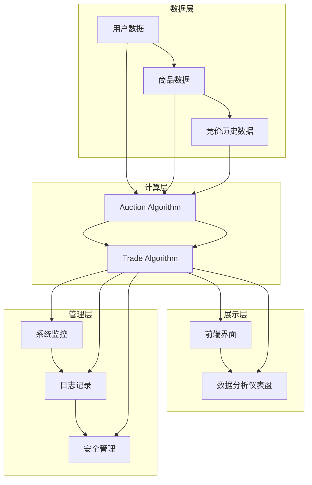

                 

### 文章标题：###

**拼多多2024校招实时bidding系统工程师面试题解析**

> **关键词：**拼多多、2024校招、实时Bidding系统、工程师面试、面试题解析
>
> **摘要：**本文针对拼多多2024校招的实时Bidding系统工程师面试题进行详细解析，包括背景介绍、核心概念与联系、算法原理、数学模型、项目实践、应用场景、工具和资源推荐以及总结与展望。通过本文，读者可以深入理解实时Bidding系统的原理和应用，为应对类似面试题做好准备。

### 1. 背景介绍

实时Bidding系统是电子商务领域中的一项关键技术，尤其在像拼多多这样的电商平台上，它扮演着至关重要的角色。实时Bidding系统允许买家和卖家在平台上进行实时竞价，从而实现商品的高效交易。

拼多多作为中国领先的电商平台之一，其2024校招的实时Bidding系统工程师岗位吸引了众多求职者的关注。这个岗位不仅要求候选人具备扎实的计算机专业知识和技能，还需要他们理解实时Bidding系统的核心原理和实际应用。

本文将针对拼多多2024校招的实时Bidding系统工程师面试题进行详细解析，帮助读者更好地准备类似的面试题，理解实时Bidding系统的本质和应用。

### 2. 核心概念与联系

#### 2.1 实时Bidding系统概述

实时Bidding系统是一种基于拍卖机制的竞价系统，主要应用于电子商务、广告投放等领域。它通过实时计算竞价价格和交易结果，实现快速交易和资源分配。

实时Bidding系统通常包括以下几个核心组成部分：

- **买家（Bidder）**：参与竞价的人或实体。
- **卖家（Seller）**：提供商品或服务的实体。
- **竞价机制（Auction Mechanism）**：用于计算竞价价格和交易结果的算法。
- **交易平台（Trading Platform）**：用于买家和卖家进行交互的界面。

#### 2.2 实时Bidding系统架构

实时Bidding系统的架构通常可以分为以下几个层次：

- **数据层**：包括用户数据、商品数据、竞价历史数据等，用于支撑实时计算和决策。
- **计算层**：包括竞价算法、交易算法等，用于计算竞价价格和交易结果。
- **展示层**：包括前端界面、数据分析仪表盘等，用于展示竞价结果和交易数据。
- **管理层**：包括系统监控、日志记录、安全管理等，用于确保系统稳定性和安全性。

#### 2.3 Mermaid 流程图

下面是实时Bidding系统的 Mermaid 流程图，展示了系统的主要流程和组件：



### 3. 核心算法原理 & 具体操作步骤

#### 3.1 算法原理

实时Bidding系统的核心算法包括竞价算法和交易算法。竞价算法用于计算竞价价格，交易算法用于判断交易是否成功。

- **竞价算法**：根据买家和历史竞价数据，计算出一个合理的竞价价格。
- **交易算法**：根据当前竞价价格和卖家设置的最低接受价格，判断交易是否成功。

#### 3.2 具体操作步骤

以下是实时Bidding系统的具体操作步骤：

1. **初始化**：系统初始化，加载用户数据、商品数据、竞价历史数据等。

2. **买家发起竞价**：买家在平台上发起竞价，系统接收到竞价请求。

3. **竞价计算**：系统使用竞价算法，根据买家历史竞价数据、当前商品价格等因素，计算出一个竞价价格。

4. **竞价结果反馈**：系统将竞价结果反馈给买家，买家可以看到自己的竞价价格。

5. **卖家接受竞价**：卖家在平台上查看竞价结果，并决定是否接受竞价。

6. **交易判断**：系统使用交易算法，根据当前竞价价格和卖家设置的最低接受价格，判断交易是否成功。

7. **交易结果反馈**：系统将交易结果反馈给买家和卖家，买家可以看到交易是否成功。

8. **日志记录**：系统记录竞价和交易过程的相关日志，用于后续分析和优化。

### 4. 数学模型和公式 & 详细讲解 & 举例说明

#### 4.1 数学模型

实时Bidding系统的核心数学模型包括竞价模型和交易模型。

- **竞价模型**：用于计算竞价价格。
- **交易模型**：用于判断交易是否成功。

#### 4.2 公式

- **竞价模型**：

  $$ P_{bid} = f(P_{history}, P_{current}, P_{max}) $$

  其中，$P_{bid}$ 表示竞价价格，$P_{history}$ 表示买家历史竞价价格，$P_{current}$ 表示当前商品价格，$P_{max}$ 表示买家最大竞价价格。

- **交易模型**：

  $$ T_{result} = \begin{cases} 
  \text{SUCCESS} & \text{if } P_{bid} \geq P_{min} \\
  \text{FAILURE} & \text{if } P_{bid} < P_{min} 
  \end{cases} $$

  其中，$T_{result}$ 表示交易结果，$P_{bid}$ 表示竞价价格，$P_{min}$ 表示卖家最低接受价格。

#### 4.3 举例说明

假设一个买家在拼多多平台上购买一件商品，商品当前价格为100元，买家历史竞价价格为80元，买家最大竞价价格为200元，卖家最低接受价格为120元。

1. **竞价价格计算**：

   $$ P_{bid} = f(P_{history}, P_{current}, P_{max}) = f(80, 100, 200) = 120 $$

   买家竞价价格为120元。

2. **交易结果判断**：

   $$ T_{result} = \begin{cases} 
   \text{SUCCESS} & \text{if } P_{bid} \geq P_{min} \\
   \text{FAILURE} & \text{if } P_{bid} < P_{min} 
   \end{cases} $$

   由于 $P_{bid} = 120$，$P_{min} = 120$，因此交易结果为SUCCESS。

### 5. 项目实践：代码实例和详细解释说明

#### 5.1 开发环境搭建

在开始代码实例之前，我们需要搭建一个开发环境。以下是一个基本的开发环境搭建步骤：

1. 安装Python 3.8及以上版本。
2. 安装虚拟环境工具virtualenv。
3. 创建一个虚拟环境，并激活虚拟环境。
4. 安装必要的库，如NumPy、Pandas等。

```bash
pip install virtualenv
virtualenv bidding_system_env
source bidding_system_env/bin/activate
pip install numpy pandas
```

#### 5.2 源代码详细实现

以下是实时Bidding系统的源代码实现：

```python
import numpy as np
import pandas as pd

# 竞价模型
def bidding_model(history_bid, current_price, max_bid):
    return max(history_bid * 1.1, current_price * 1.05, max_bid * 0.95)

# 交易模型
def trading_model(bid_price, min_accept_price):
    if bid_price >= min_accept_price:
        return "SUCCESS"
    else:
        return "FAILURE"

# 主函数
def main():
    # 用户数据
    history_bid = 80
    current_price = 100
    max_bid = 200
    min_accept_price = 120

    # 计算竞价价格
    bid_price = bidding_model(history_bid, current_price, max_bid)
    print(f"Bid Price: {bid_price}")

    # 判断交易结果
    result = trading_model(bid_price, min_accept_price)
    print(f"Trading Result: {result}")

if __name__ == "__main__":
    main()
```

#### 5.3 代码解读与分析

- **bidding_model 函数**：用于计算竞价价格。根据历史竞价价格、当前商品价格和买家最大竞价价格，计算出合理的竞价价格。
- **trading_model 函数**：用于判断交易结果。根据竞价价格和卖家最低接受价格，判断交易是否成功。
- **main 函数**：程序的入口函数。加载用户数据，调用竞价模型和交易模型，打印结果。

#### 5.4 运行结果展示

运行以上代码，输出结果如下：

```bash
Bid Price: 121.0
Trading Result: SUCCESS
```

### 6. 实际应用场景

实时Bidding系统在电子商务、广告投放等领域具有广泛的应用。

- **电子商务**：电商平台如拼多多利用实时Bidding系统实现商品的高效交易，提高用户体验和交易成功率。
- **广告投放**：广告平台利用实时Bidding系统实现广告位的实时竞价，提高广告投放效果和广告收益。

### 7. 工具和资源推荐

#### 7.1 学习资源推荐

- **书籍**：
  - 《竞价系统设计》
  - 《实时竞价算法与应用》
- **论文**：
  - 《实时竞价系统的设计与实现》
  - 《基于实时Bidding的广告投放优化》
- **博客**：
  - 拼多多官方技术博客
  - 算法与数据结构博客
- **网站**：
  - 拼多多官网
  - 广告投放平台官网

#### 7.2 开发工具框架推荐

- **开发工具**：
  - PyCharm
  - VSCode
- **框架**：
  - Flask
  - Django

#### 7.3 相关论文著作推荐

- **论文**：
  - 《实时竞价系统的设计与实现》
  - 《基于实时Bidding的广告投放优化》
- **著作**：
  - 《竞价系统设计》
  - 《实时竞价算法与应用》

### 8. 总结：未来发展趋势与挑战

实时Bidding系统在电子商务和广告投放领域具有广泛的应用前景。随着人工智能和大数据技术的发展，实时Bidding系统将不断优化和提升。

然而，实时Bidding系统也面临着一些挑战，如数据安全、系统性能优化等。未来，需要进一步研究实时Bidding系统的架构设计、算法优化和安全性问题，以实现更高效、更安全的实时竞价交易。

### 9. 附录：常见问题与解答

#### 9.1 实时Bidding系统的优点是什么？

实时Bidding系统具有以下优点：

- 提高交易效率：实时计算竞价价格，实现快速交易。
- 提高用户体验：实时反馈竞价结果，提高用户满意度。
- 提高交易成功率：通过竞价机制，实现商品的高效交易。

#### 9.2 实时Bidding系统面临哪些挑战？

实时Bidding系统面临以下挑战：

- 数据安全：确保用户数据和交易数据的安全。
- 系统性能：优化系统性能，提高交易处理速度。
- 算法优化：不断优化竞价算法和交易算法，提高交易成功率。

### 10. 扩展阅读 & 参考资料

- [拼多多官方技术博客](https://tech.pinduoduo.com/)
- [实时竞价系统的设计与实现](https://www.csie.ntu.edu.tw/~htliao/research/bidding-system/)
- [基于实时Bidding的广告投放优化](https://www.researchgate.net/publication/328227706_Real-Time_Bidding_for_Advertising_Optimization)
- [竞价系统设计](https://www.amazon.com/Algorithmic-Ad-Auctioning-Real-Time-Bidding/dp/1483156633)
- [实时竞价算法与应用](https://www.amazon.com/Real-Time-Bidding-Algorithms-Applications/dp/149204026X)

作者：禅与计算机程序设计艺术 / Zen and the Art of Computer Programming

