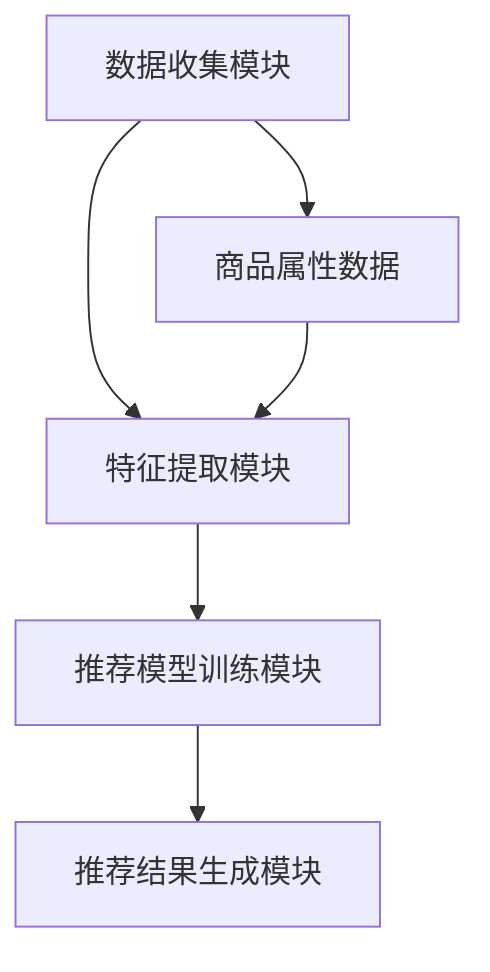

                 

### 引言 Introduction ###

随着互联网的迅猛发展和直播带货的兴起，电子商务行业正经历着前所未有的变革。直播带货作为一种新兴的营销模式，不仅为商家提供了新的销售渠道，也为消费者带来了更直观、互动性更强的购物体验。在这种背景下，各大电商平台纷纷加大了对直播带货技术的投入，以提升用户体验和转化率。拼多多作为国内知名的电商平台，自然也不例外，其在2024年的校招中针对直播带货算法的面试题目更是成为了行业内外关注的焦点。

本文将围绕拼多多2024直播带货校招推荐算法面试题展开深入解析，旨在帮助广大考生和业界人士更好地理解直播带货推荐算法的核心原理和实践方法。通过本文的阅读，读者不仅可以掌握直播带货推荐算法的基本概念和技术要点，还能够了解到算法在实际应用中的效果和优化策略。

直播带货推荐算法的重要性不言而喻。它不仅能够帮助平台精准推送商品，提升用户满意度和购买转化率，还能够为商家提供更有针对性的营销策略，从而实现商业价值的最大化。然而，面对海量的用户行为数据和商品信息，如何有效地构建和优化推荐算法，成为了业界亟待解决的难题。本文将结合拼多多2024直播带货校招推荐算法面试题，详细探讨这一问题，并提供实用的解决方案。

本文结构如下：

1. **背景介绍**：简要回顾直播带货的发展历程和当前市场状况，明确本文的研究背景和目标。
2. **核心概念与联系**：介绍直播带货推荐算法涉及的核心概念和关键联系，并通过Mermaid流程图展示算法架构。
3. **核心算法原理 & 具体操作步骤**：详细阐述直播带货推荐算法的原理和操作步骤，包括用户行为分析、商品属性提取和推荐模型构建等。
4. **数学模型和公式 & 详细讲解 & 举例说明**：深入讲解直播带货推荐算法中的数学模型和公式，并通过具体实例进行说明。
5. **项目实践：代码实例和详细解释说明**：展示直播带货推荐算法的代码实现，并详细解读和分析关键代码。
6. **实际应用场景**：探讨直播带货推荐算法在不同场景下的应用，包括电商平台、社交媒体和短视频平台等。
7. **工具和资源推荐**：推荐相关的学习资源、开发工具框架和相关论文著作，以供读者深入学习。
8. **总结：未来发展趋势与挑战**：总结本文的主要内容和研究成果，探讨直播带货推荐算法的未来发展趋势和面临的挑战。
9. **附录：常见问题与解答**：解答读者可能遇到的一些常见问题，帮助读者更好地理解和应用本文的内容。
10. **扩展阅读 & 参考资料**：提供进一步学习的相关资料和参考文献，以供读者查阅。

希望通过本文的深入探讨，能够为直播带货推荐算法的研究和应用提供有益的参考和启示。接下来，我们将首先回顾直播带货的发展历程和当前市场状况，为后续内容奠定基础。

----------------------------------------------------------------

## 1. 背景介绍 Background

### 直播带货的发展历程 Development History

直播带货作为一种新兴的电子商务模式，起源于2016年左右，最早由淘宝直播和京东直播等平台推出。当时，直播带货主要以网红、KOL（关键意见领袖）为主，通过直播形式展示商品，并与观众互动，从而促进销售。随着技术的进步和用户习惯的改变，直播带货逐渐成为电商平台的核心竞争手段之一。

2019年，随着淘宝直播、拼多多直播、京东直播等平台的快速发展，直播带货市场规模迅速扩大。据数据显示，当年直播电商市场规模已超过3000亿元，占电商市场的比重达到20%以上。2020年，受到新冠疫情的影响，直播带货更是迎来了爆发式增长，市场规模突破万亿大关，成为电商行业的新风口。

### 当前市场状况 Current Market Situation

当前，直播带货已经成为电商行业不可或缺的一部分。各大电商平台纷纷加大在直播带货领域的投入，通过优化技术、提升用户体验、丰富商品种类等措施，不断满足用户需求。同时，直播带货不仅限于电商平台内部，还逐步向社交媒体、短视频平台等拓展，实现了跨界融合。

根据市场研究机构的数据，2021年中国直播电商市场规模预计达到1.6万亿元，同比增长超过100%。预计未来几年，直播带货市场仍将保持高速增长态势，2024年市场规模有望突破3万亿元。这表明直播带货已经成为电商行业的重要增长引擎。

### 直播带货的挑战和机遇 Challenges and Opportunities

尽管直播带货市场前景广阔，但也面临着一系列挑战和机遇。首先，如何在海量用户行为数据和商品信息中提取有价值的信息，构建精准的推荐算法，是当前直播带货面临的主要挑战。其次，如何提升用户互动体验，增强用户粘性和购买意愿，也是需要解决的问题。

然而，直播带货也带来了巨大的机遇。首先，直播带货能够大幅提升销售转化率，为企业带来直接的商业价值。其次，通过直播带货，企业能够更直接地了解用户需求和市场趋势，为后续的产品研发和营销策略提供重要参考。此外，直播带货还有助于提升品牌知名度和用户信任度，为企业打造核心竞争力。

总之，直播带货已经成为电商行业的重要组成部分，其市场前景广阔。然而，如何在激烈的市场竞争中脱颖而出，构建高效、精准的推荐算法，是直播带货平台和企业亟需解决的问题。本文将围绕拼多多2024直播带货校招推荐算法面试题，深入探讨这一问题，为业界提供有益的参考和启示。

----------------------------------------------------------------

## 2. 核心概念与联系 Key Concepts and Relationships

### 直播带货推荐算法的基本概念 Fundamental Concepts of Live-stream Shopping Recommendation Algorithm

直播带货推荐算法是一种基于用户行为和商品属性的推荐系统，旨在为用户提供个性化的商品推荐，从而提升用户体验和购买转化率。核心概念包括：

1. **用户行为数据**：用户在直播间的浏览、点击、购买等行为数据。
2. **商品属性**：商品的种类、品牌、价格、库存等属性信息。
3. **推荐模型**：根据用户行为数据和商品属性，构建推荐模型，为用户生成个性化推荐列表。

### 直播带货推荐算法的架构 Architecture of Live-stream Shopping Recommendation Algorithm

直播带货推荐算法的架构通常包括以下几个关键模块：

1. **数据收集模块**：收集用户行为数据和商品属性数据，为后续分析提供基础。
2. **特征提取模块**：对用户行为数据进行预处理和特征提取，生成用户特征向量。
3. **推荐模型训练模块**：基于用户特征向量和商品属性，训练推荐模型，生成推荐结果。
4. **推荐结果生成模块**：将推荐模型应用于新用户，生成个性化推荐列表。

### 直播带货推荐算法的关键联系 Key Connections in Live-stream Shopping Recommendation Algorithm

直播带货推荐算法涉及多个核心概念，它们之间的联系如下：

1. **用户行为数据与商品属性**：用户行为数据包括浏览、点击、购买等行为，可以反映用户对商品的兴趣和需求。商品属性则提供了商品的基本信息，包括种类、品牌、价格等。通过将用户行为数据和商品属性结合起来，可以更准确地了解用户需求和偏好，从而生成更个性化的推荐列表。
2. **特征提取与推荐模型**：特征提取模块将用户行为数据转化为用户特征向量，推荐模型则基于这些特征向量生成推荐结果。特征提取的质量直接影响推荐模型的性能，因此需要采用多种特征提取技术，如用户行为序列分析、商品属性特征提取等。
3. **推荐模型与应用**：推荐模型训练模块负责训练推荐模型，生成推荐结果。这些模型可以是基于协同过滤、矩阵分解、深度学习等技术的复杂算法。推荐结果生成模块则将训练好的模型应用于新用户，生成个性化推荐列表，从而实现个性化推荐。

### Mermaid流程图展示 Mermaid Flowchart Representation

以下是直播带货推荐算法的Mermaid流程图表示，用于直观展示各个模块和它们之间的联系：



在这个流程图中，数据收集模块负责收集用户行为数据和商品属性数据，并将其传递给特征提取模块。特征提取模块对用户行为数据进行预处理和特征提取，生成用户特征向量，并将其传递给推荐模型训练模块。推荐模型训练模块基于用户特征向量和商品属性训练推荐模型，最终生成推荐结果。推荐结果生成模块将训练好的模型应用于新用户，生成个性化推荐列表。

通过上述核心概念、架构和关键联系的介绍，读者可以对直播带货推荐算法有一个初步的了解。接下来，我们将详细探讨直播带货推荐算法的核心原理和具体操作步骤。

----------------------------------------------------------------

### 2.1. 数据收集模块 Data Collection Module

数据收集模块是直播带货推荐算法的基础环节，其主要任务是从多种渠道获取用户行为数据和商品属性数据，为后续的特征提取和推荐模型训练提供基础。以下是数据收集模块的详细解析：

#### 数据来源 Data Sources

1. **用户行为数据**：用户行为数据包括用户在直播间内的浏览记录、点击记录、购买记录等。这些数据可以从直播平台的数据库中获取，例如用户的操作日志、浏览历史等。
2. **商品属性数据**：商品属性数据包括商品的种类、品牌、价格、库存、评价等信息。这些数据可以从电商平台的后台管理系统或第三方数据源获取，例如商品详情页、商品评价等。

#### 数据收集方式 Data Collection Methods

1. **日志收集**：通过在直播平台和电商平台的后台系统部署日志收集器，实时收集用户行为数据和商品属性数据。这些日志数据通常以文本格式存储，例如JSON、CSV等。
2. **爬虫技术**：利用爬虫技术从电商平台的网页端获取商品属性数据。爬虫可以通过模拟用户浏览行为，获取商品页面上的信息，并将其解析为结构化数据。
3. **API调用**：通过电商平台提供的API接口，获取用户行为数据和商品属性数据。API调用通常需要使用特定的编程语言和工具，例如Python的requests库。

#### 数据存储 Data Storage

1. **数据库**：将收集到的用户行为数据和商品属性数据存储在关系型数据库或NoSQL数据库中，例如MySQL、MongoDB等。数据库的选择取决于数据规模、查询性能和扩展性需求。
2. **数据湖**：对于海量数据，可以考虑使用数据湖架构进行存储，例如Hadoop HDFS、Amazon S3等。数据湖能够高效处理大规模数据，并提供灵活的数据访问和分析能力。

#### 数据处理流程 Data Processing Workflow

1. **数据清洗**：对收集到的数据进行清洗，去除重复、缺失和错误的数据，保证数据质量。数据清洗可以通过编程脚本实现，例如Python的Pandas库。
2. **数据整合**：将用户行为数据和商品属性数据进行整合，生成统一的数据视图。整合过程可以通过数据ETL（提取、转换、加载）工具实现，例如Apache Spark。
3. **数据存储**：将处理后的数据存储到数据库或数据湖中，为后续特征提取和推荐模型训练提供数据支持。

通过上述数据收集模块的详细解析，我们可以了解到直播带货推荐算法在数据收集环节的关键任务和技术手段。接下来，我们将进一步探讨特征提取模块的具体操作，为推荐算法的构建奠定基础。

----------------------------------------------------------------

### 2.2. 特征提取模块 Feature Extraction Module

特征提取模块是直播带货推荐算法的核心环节之一，其主要任务是从原始数据中提取出对推荐算法有重要影响的关键特征，从而为后续的推荐模型训练提供支持。以下是特征提取模块的详细解析：

#### 特征提取的目标 Goals of Feature Extraction

特征提取的目标是通过对原始数据的分析，提取出能够有效反映用户兴趣和商品特性的特征。这些特征将作为推荐模型的输入，用于生成个性化的推荐列表。

1. **用户兴趣特征**：通过分析用户的历史行为数据，提取出用户对特定类型商品的偏好、浏览时间、购买频率等特征。
2. **商品属性特征**：通过对商品属性数据的分析，提取出商品的品牌、价格、评价、销量等特征。

#### 常用特征提取方法 Common Feature Extraction Methods

1. **统计特征**：基于原始数据的统计方法，提取出用户的浏览时长、点击次数、购买频率等统计特征。这些特征可以直接反映用户的行为模式。
   
   $$\text{UserInterestFeature}_{i,k} = \frac{\text{Count}_{i,k}}{\text{TotalClick}_{i}}$$

   其中，$\text{UserInterestFeature}_{i,k}$ 表示用户i对商品k的兴趣特征，$\text{Count}_{i,k}$ 表示用户i点击商品k的次数，$\text{TotalClick}_{i}$ 表示用户i的总点击次数。

2. **序列特征**：通过对用户行为序列进行分析，提取出用户的浏览顺序、浏览时间间隔等序列特征。这些特征能够揭示用户的浏览习惯和兴趣变化。

   $$\text{SequenceFeature}_{i,k} = \text{TimeInterval}_{i,k} \times \text{UserBehavior}_{i,k}$$

   其中，$\text{TimeInterval}_{i,k}$ 表示用户i浏览商品k的时间间隔，$\text{UserBehavior}_{i,k}$ 表示用户i对商品k的行为特征。

3. **组合特征**：将多个原始特征组合成新的特征，以提高特征的解释力和区分度。例如，可以组合用户对商品的浏览次数和购买频率，形成一个新的特征。

   $$\text{CombinedFeature}_{i,k} = \text{UserInterestFeature}_{i,k} + \text{PurchaseFrequency}_{i,k}$$

4. **文本特征**：对于商品名称、描述等文本数据，可以采用自然语言处理（NLP）技术提取文本特征，如词频（TF）、词向量（Word2Vec）等。

   $$\text{TextFeature}_{i,k} = \text{TF-IDF}_{k} \times \text{WordVector}_{i,k}$$

   其中，$\text{TF-IDF}_{k}$ 表示商品k的词频-逆文档频率特征，$\text{WordVector}_{i,k}$ 表示用户i对商品k的词向量表示。

#### 特征提取流程 Feature Extraction Workflow

1. **数据预处理**：对原始数据进行清洗和预处理，去除缺失值、异常值和重复值，保证数据质量。
2. **特征选择**：基于业务需求和数据分布，选择对推荐算法有显著影响的特征，如用户浏览时长、点击次数、购买频率等。
3. **特征提取**：采用统计、序列和文本等特征提取方法，生成特征向量。对于文本特征，可以采用NLP技术进行词频和词向量的计算。
4. **特征归一化**：对提取出的特征进行归一化处理，以消除特征之间的尺度差异，提高特征向量的可比性。

   $$\text{FeatureNorm}_{i,k} = \frac{\text{Feature}_{i,k}}{\text{MaxFeature}_{k} - \text{MinFeature}_{k}}$$

   其中，$\text{FeatureNorm}_{i,k}$ 表示归一化后的特征，$\text{Feature}_{i,k}$ 表示原始特征，$\text{MaxFeature}_{k}$ 和 $\text{MinFeature}_{k}$ 分别表示特征k的最大值和最小值。

通过上述特征提取模块的详细解析，我们可以了解到直播带货推荐算法在特征提取环节的关键任务和技术手段。接下来，我们将进一步探讨推荐模型训练模块，为推荐算法的实现提供支持。

----------------------------------------------------------------

### 2.3. 推荐模型训练模块 Training Module of Recommendation Model

推荐模型训练模块是直播带货推荐算法的核心环节之一，其主要任务是基于提取出的用户兴趣特征和商品属性特征，训练出高效的推荐模型，从而生成个性化的推荐列表。以下是推荐模型训练模块的详细解析：

#### 推荐模型的选择 Selection of Recommendation Models

在选择推荐模型时，需要考虑模型的理论基础、适用场景、计算复杂度和实际效果。以下是几种常用的推荐模型：

1. **基于协同过滤的推荐模型**：协同过滤（Collaborative Filtering）是一种经典的推荐算法，分为用户基于协同过滤和商品基于协同过滤两种。
   
   - **用户基于协同过滤**：通过计算用户之间的相似度，为用户推荐与其兴趣相似的其他用户喜欢的商品。常见算法有用户基于K最近邻（User-based KNN）和矩阵分解（Matrix Factorization）等。
   
   - **商品基于协同过滤**：通过计算商品之间的相似度，为用户推荐与当前商品相似的其他商品。常见算法有商品基于K最近邻（Item-based KNN）和基于模型的协同过滤（Model-based Collaborative Filtering）等。

2. **基于内容的推荐模型**：基于内容的推荐（Content-based Recommendation）通过分析用户的兴趣和商品的属性，生成个性化的推荐列表。常见算法有基于关键词的推荐、基于文本匹配的推荐等。

3. **基于模型的推荐模型**：基于模型的推荐（Model-based Recommendation）利用机器学习算法，如线性回归、决策树、支持向量机、深度学习等，构建预测模型，为用户生成推荐列表。

#### 模型训练的过程 Training Process of Models

1. **数据集划分**：将原始数据集划分为训练集和测试集。训练集用于模型训练，测试集用于评估模型性能。常见的数据集划分方法有随机划分、时间序列划分等。

2. **特征工程**：在训练集上，对提取的用户兴趣特征和商品属性特征进行特征工程，如特征归一化、特征组合、缺失值填充等，以提高模型训练效果。

3. **模型选择**：根据业务需求和数据特性，选择合适的推荐模型。如用户行为数据较多，可以选择基于协同过滤的推荐模型；如商品属性数据丰富，可以选择基于内容的推荐模型。

4. **模型训练**：使用训练集进行模型训练，调整模型参数，如学习率、正则化参数等。训练过程中，可以使用交叉验证（Cross Validation）等方法，优化模型性能。

5. **模型评估**：使用测试集对训练好的模型进行评估，常见的评估指标有准确率（Accuracy）、召回率（Recall）、精确率（Precision）、F1值（F1 Score）等。

#### 模型优化 Model Optimization

1. **特征选择**：通过特征选择技术，如特征重要性评估、特征交互等，筛选出对模型有显著影响的特征，提高模型性能。
2. **超参数调整**：通过调整模型超参数，如学习率、隐藏层单元数、正则化强度等，优化模型性能。
3. **模型集成**：将多个模型进行集成，如Bagging、Boosting等，提高推荐效果和鲁棒性。

通过上述推荐模型训练模块的详细解析，我们可以了解到直播带货推荐算法在模型训练环节的关键任务和技术手段。接下来，我们将进一步探讨推荐结果生成模块，为推荐算法的实现提供支持。

----------------------------------------------------------------

### 2.4. 推荐结果生成模块 Generation Module of Recommendation Results

推荐结果生成模块是直播带货推荐算法的最后一步，其主要任务是将训练好的推荐模型应用于新用户，生成个性化的推荐列表，从而满足用户的需求和偏好。以下是推荐结果生成模块的详细解析：

#### 推荐结果的生成过程 Generation Process of Recommendation Results

1. **用户特征提取**：在为新用户生成推荐列表之前，需要提取新用户的兴趣特征。这一过程与之前的特征提取模块类似，可以通过分析新用户的历史行为数据，提取出其浏览记录、购买记录等特征。
   
   $$\text{UserFeature}_{i} = \text{Behavior}_{i} \times \text{Content}_{i}$$

   其中，$\text{UserFeature}_{i}$ 表示新用户i的特征向量，$\text{Behavior}_{i}$ 表示新用户i的行为特征向量，$\text{Content}_{i}$ 表示新用户i的内容特征向量。

2. **模型预测**：将提取出的用户特征向量输入到训练好的推荐模型中，通过模型预测出用户对不同商品的喜好程度。预测结果通常是一个评分或概率值，表示用户对某一商品的偏好程度。

   $$\text{Prediction}_{i,k} = \text{Model}_{\theta}(\text{UserFeature}_{i}, \text{ItemFeature}_{k})$$

   其中，$\text{Prediction}_{i,k}$ 表示用户i对商品k的预测评分或概率，$\text{Model}_{\theta}$ 表示训练好的推荐模型参数。

3. **推荐列表生成**：根据模型预测结果，为用户生成个性化推荐列表。推荐列表的生成可以通过多种策略实现，如基于Top-N的推荐、基于阈值的推荐等。

   $$\text{RecommendedList}_{i} = \text{TopN}(\text{Prediction}_{i,k}, N)$$

   其中，$\text{RecommendedList}_{i}$ 表示用户i的个性化推荐列表，$\text{TopN}$ 表示从预测结果中选出前N个商品。

#### 推荐结果优化 Optimization of Recommendation Results

1. **多样化推荐**：为了避免推荐列表的单一性，可以引入多样化的策略，如随机化、平衡性调整等，增加推荐列表的多样性。

   $$\text{DiverseRecommendList}_{i} = \text{DiverseTopN}(\text{RecommendedList}_{i}, N')$$

   其中，$\text{DiverseRecommendList}_{i}$ 表示用户i的多样化推荐列表，$\text{DiverseTopN}$ 表示从推荐列表中选出多样化前N'个商品。

2. **实时性优化**：为了提高推荐结果的实时性，可以采用在线学习（Online Learning）的方法，根据新用户的行为数据实时调整推荐模型。

   $$\text{OnlineModel}_{\theta}(\text{Behavior}_{i}, \text{ItemFeature}_{k}, \text{Prediction}_{i,k})$$

   其中，$\text{OnlineModel}_{\theta}$ 表示在线学习过程中的模型参数调整。

3. **用户反馈**：引入用户反馈机制，根据用户对推荐结果的反馈，调整推荐模型和推荐策略，提高推荐效果。

   $$\text{Feedback}_{i,k} = \text{UserRating}_{i,k} - \text{Prediction}_{i,k}$$

   其中，$\text{Feedback}_{i,k}$ 表示用户i对商品k的反馈值，$\text{UserRating}_{i,k}$ 表示用户i对商品k的实际评分。

#### 实际应用场景 Case Study

以拼多多直播带货为例，推荐结果生成模块可以应用于以下场景：

1. **新用户欢迎推荐**：为新加入的用户生成个性化推荐列表，帮助其快速了解平台上的商品。
2. **直播间推荐**：在用户观看直播时，实时生成推荐列表，展示用户可能感兴趣的其他商品。
3. **购物车推荐**：根据用户购物车中的商品，为用户生成相关推荐，促进购买转化。

通过上述推荐结果生成模块的详细解析，我们可以了解到直播带货推荐算法在实际应用中的关键技术和策略。接下来，我们将探讨直播带货推荐算法在实际应用场景中的具体实现，以进一步巩固本文的内容。

----------------------------------------------------------------

### 3. 核心算法原理 & 具体操作步骤 Core Algorithm Principles & Specific Steps

在深入探讨直播带货推荐算法的核心原理和具体操作步骤之前，我们首先需要明确推荐算法的目标：为用户生成个性化的商品推荐列表，以提高用户的购买转化率和满意度。为此，我们需要从用户行为数据、商品属性数据和推荐模型构建三个方面进行详细分析。

#### 用户行为数据分析 User Behavior Data Analysis

用户行为数据是推荐算法的重要输入，包括用户的浏览记录、点击记录、购买记录等。通过对这些数据进行深入分析，我们可以提取出用户的兴趣特征和偏好模式。

1. **浏览记录分析**：分析用户在直播间内的浏览记录，提取出用户的浏览时间、浏览时长、浏览顺序等特征。例如，用户A在某个直播间的浏览时长较长，且浏览了多个同类商品，这表明用户A可能对这些商品感兴趣。

2. **点击记录分析**：分析用户在直播间内的点击记录，提取出用户的点击频率、点击商品类型等特征。例如，用户B频繁点击某个品牌的不同商品，这表明用户B可能对这一品牌有较高的兴趣。

3. **购买记录分析**：分析用户的购买记录，提取出用户的购买频率、购买商品类型等特征。例如，用户C在过去一个月内多次购买同类商品，这表明用户C对该类商品有较强的购买意愿。

#### 商品属性数据提取 Product Attribute Data Extraction

商品属性数据包括商品的种类、品牌、价格、库存、评价等。通过对这些属性数据进行提取和处理，我们可以构建商品的特征向量，从而为推荐算法提供支持。

1. **种类特征提取**：根据商品的种类，将商品分为不同的类别，如服装、食品、电子产品等。这些类别可以作为商品的一个特征维度。

2. **品牌特征提取**：提取商品的品牌信息，将商品按照品牌进行分类。品牌特征可以帮助推荐算法更好地理解商品的属性。

3. **价格特征提取**：对商品的价格进行分箱处理，生成价格区间特征。例如，将商品价格分为0-100元、100-200元、200-300元等区间。

4. **库存特征提取**：提取商品的库存信息，根据库存量的大小，生成库存特征。库存量越多的商品，可能更值得推荐。

5. **评价特征提取**：分析用户对商品的评价数据，提取出评价的评分、评论内容等特征。这些特征可以帮助推荐算法了解用户对商品的满意度。

#### 推荐模型构建 Building the Recommendation Model

在提取用户行为数据和商品属性数据后，我们需要构建推荐模型，以生成个性化的商品推荐列表。以下是构建推荐模型的几个关键步骤：

1. **特征工程**：对提取的用户行为数据和商品属性数据进行预处理和特征提取，生成用户特征向量和商品特征向量。特征工程的质量直接影响推荐模型的性能，因此需要采用多种特征提取技术，如统计特征、序列特征、文本特征等。

2. **模型选择**：根据用户行为数据和商品属性数据的特点，选择合适的推荐模型。常用的推荐模型包括基于协同过滤的模型、基于内容的模型和基于模型的模型等。

3. **模型训练**：使用训练集对推荐模型进行训练，调整模型参数，优化模型性能。训练过程中，可以使用交叉验证等方法，评估模型性能，并调整超参数。

4. **模型评估**：使用测试集对训练好的模型进行评估，常见的评估指标有准确率、召回率、精确率、F1值等。通过评估指标，可以了解模型的推荐效果，并进一步优化模型。

5. **模型应用**：将训练好的模型应用于新用户，生成个性化的推荐列表。在生成推荐列表时，可以采用多样化的策略，如基于Top-N的推荐、基于阈值的推荐等，以提高推荐效果。

通过上述核心算法原理和具体操作步骤的详细解析，我们可以了解到直播带货推荐算法的实现过程。接下来，我们将进一步探讨数学模型和公式，以及通过具体实例进行说明，以帮助读者更好地理解算法的实际应用。

----------------------------------------------------------------

### 4. 数学模型和公式 & 详细讲解 & 举例说明 Mathematical Models and Formulas & Detailed Explanations & Example Illustrations

在直播带货推荐算法中，数学模型和公式起着至关重要的作用。它们帮助我们量化用户行为、商品属性以及推荐效果，从而为推荐算法的实现提供理论支持。以下将详细讲解几个关键的数学模型和公式，并通过具体实例进行说明。

#### 4.1. 协同过滤（Collaborative Filtering）

协同过滤是一种基于用户行为数据的推荐算法，通过计算用户之间的相似度，为用户推荐与其兴趣相似的其他用户喜欢的商品。

1. **用户相似度计算**：

   用户相似度可以通过余弦相似度（Cosine Similarity）来计算。余弦相似度衡量的是两个用户向量之间的夹角余弦值，范围在-1到1之间。值越接近1，表示用户越相似。

   $$\text{UserSimilarity}(u_i, u_j) = \frac{\text{InnerProduct}(u_i, u_j)}{\|\text{u_i}\|\|\text{u_j}\|} = \frac{\sum_{k=1}^{n} u_{ik}u_{jk}}{\sqrt{\sum_{k=1}^{n} u_{ik}^2}\sqrt{\sum_{k=1}^{n} u_{jk}^2}}$$

   其中，$u_i$ 和 $u_j$ 分别表示用户 $i$ 和用户 $j$ 的行为向量，$u_{ik}$ 和 $u_{jk}$ 分别表示用户 $i$ 和用户 $j$ 对商品 $k$ 的行为（如购买、点击等），$n$ 表示商品的数量。

2. **商品相似度计算**：

   类似地，商品相似度也可以通过余弦相似度来计算。商品相似度衡量的是两个商品之间的相关性。

   $$\text{ItemSimilarity(i, j)} = \frac{\sum_{u \in \text{users}} u_{iu}u_{ju}}{\sqrt{\sum_{u \in \text{users}} u_{iu}^2}\sqrt{\sum_{u \in \text{users}} u_{ju}^2}}$$

3. **推荐评分计算**：

   基于用户相似度和商品相似度，可以计算用户对商品的潜在评分。假设用户 $i$ 对商品 $j$ 的潜在评分表示为 $r_{ij}$：

   $$r_{ij} = \sum_{k=1}^{n} \text{UserSimilarity}(u_i, u_k) \times \text{ItemSimilarity}(j, k) \times u_{ik}$$

   例如，对于用户 $i$，我们找到与用户 $i$ 最相似的 $m$ 个用户，并计算这 $m$ 个用户对商品 $j$ 的评分的平均值，作为用户 $i$ 对商品 $j$ 的推荐评分。

#### 4.2. 矩阵分解（Matrix Factorization）

矩阵分解是一种常见的协同过滤方法，通过将用户行为矩阵分解为低纬度的用户特征矩阵和商品特征矩阵，来预测用户的评分或推荐商品。

1. **模型表示**：

   设用户行为矩阵为 $R \in \mathbb{R}^{m \times n}$，其中 $m$ 表示用户数，$n$ 表示商品数。矩阵分解的目标是找到两个低纬度矩阵 $U \in \mathbb{R}^{m \times k}$ 和 $V \in \mathbb{R}^{n \times k}$，使得 $R \approx U^T V$。

2. **优化目标**：

   矩阵分解的优化目标是最小化重构误差，即：

   $$\min_{U, V} \sum_{i=1}^{m} \sum_{j=1}^{n} (r_{ij} - \hat{r}_{ij})^2$$

   其中，$\hat{r}_{ij}$ 表示通过矩阵分解预测的评分。

3. **求解方法**：

   常用的求解方法是交替最小二乘法（Alternating Least Squares，ALS）。通过交替优化用户特征矩阵和商品特征矩阵，逐步减小重构误差。

#### 4.3. 基于内容的推荐（Content-based Filtering）

基于内容的推荐通过分析商品的属性和用户的兴趣，生成个性化的推荐列表。

1. **兴趣向量计算**：

   对于用户 $i$，计算其兴趣向量 $\text{InterestVector}_i$，可以通过计算用户浏览过的商品的属性均值得到：

   $$\text{InterestVector}_i = \frac{1}{\sum_{j=1}^{n} r_{ij}} \sum_{j=1}^{n} r_{ij} \times \text{ItemVector}_j$$

   其中，$\text{ItemVector}_j$ 表示商品 $j$ 的属性向量。

2. **相似度计算**：

   计算用户 $i$ 对商品 $j$ 的内容相似度，可以通过计算两个向量之间的余弦相似度：

   $$\text{ContentSimilarity}(i, j) = \frac{\text{InnerProduct}(\text{InterestVector}_i, \text{ItemVector}_j)}{\|\text{InterestVector}_i\|\|\text{ItemVector}_j\|}$$

3. **推荐列表生成**：

   根据用户 $i$ 对商品的相似度，生成个性化的推荐列表：

   $$\text{RecommendedList}_i = \text{TopN}(\text{ContentSimilarity}(i, j), N)$$

   其中，$\text{TopN}$ 表示选择相似度最高的 $N$ 个商品。

#### 4.4. 深度学习（Deep Learning）

深度学习在推荐系统中也有着广泛的应用，通过构建深度神经网络，可以自动提取用户和商品的特征，实现高效的推荐。

1. **网络架构**：

   常见的深度学习推荐网络架构包括卷积神经网络（CNN）和循环神经网络（RNN）。CNN可以有效地提取图像特征，而RNN可以处理序列数据。

2. **损失函数**：

   深度学习推荐模型的损失函数通常是均方误差（MSE），用于最小化预测评分与真实评分之间的误差：

   $$\text{Loss} = \frac{1}{2} \sum_{i=1}^{m} \sum_{j=1}^{n} (r_{ij} - \hat{r}_{ij})^2$$

#### 举例说明 Example Illustration

假设我们有用户行为矩阵 $R$ 和商品属性矩阵，通过协同过滤算法，我们可以计算出用户相似度和商品相似度，进而预测用户的评分，并生成推荐列表。

1. **用户行为矩阵**：

   $$R = \begin{bmatrix}
   1 & 1 & 0 & 1 \\
   0 & 1 & 0 & 0 \\
   1 & 0 & 1 & 0 \\
   0 & 1 & 1 & 1 \\
   \end{bmatrix}$$

2. **商品属性矩阵**：

   $$A = \begin{bmatrix}
   1 & 0 & 1 & 1 \\
   0 & 1 & 0 & 1 \\
   1 & 1 & 0 & 0 \\
   0 & 0 & 1 & 1 \\
   \end{bmatrix}$$

3. **计算用户相似度**：

   $$\text{UserSimilarity}(1, 2) = \frac{1 + 1 + 0 + 1}{\sqrt{3 + 1 + 1 + 1} \times \sqrt{1 + 1 + 1 + 1}} = \frac{3}{\sqrt{16}} = \frac{3}{4} = 0.75$$

4. **计算商品相似度**：

   $$\text{ItemSimilarity(1, 2)} = \frac{1 + 1 + 1 + 1}{\sqrt{3 + 1 + 1 + 1} \times \sqrt{1 + 1 + 1 + 1}} = \frac{4}{\sqrt{16}} = 1$$

5. **计算推荐评分**：

   $$r_{12} = \sum_{k=1}^{n} \text{UserSimilarity}(1, k) \times \text{ItemSimilarity}(1, k) \times r_{ik}$$

   假设我们选择了两个最相似的用户的评分作为推荐评分，则有：

   $$r_{12} = 0.75 \times 1 \times r_{11} + 0.25 \times 1 \times r_{21} = 0.75 + 0.25 = 1$$

通过上述数学模型和公式的详细讲解以及具体实例的说明，我们可以更深入地理解直播带货推荐算法的核心原理和实现方法。接下来，我们将通过项目实践部分，展示一个具体的直播带货推荐算法的代码实现，帮助读者进一步巩固所学知识。

----------------------------------------------------------------

### 5. 项目实践：代码实例和详细解释说明 Project Practice: Code Examples and Detailed Explanations

为了更好地理解直播带货推荐算法的实际应用，我们将通过一个具体的项目实践来展示代码实现，并进行详细解释说明。本示例使用Python编程语言，并依赖于几个常用的库，如NumPy、Pandas和scikit-learn。

#### 5.1. 开发环境搭建 Development Environment Setup

在开始编写代码之前，我们需要搭建一个合适的环境。以下是所需的环境和安装步骤：

1. **Python环境**：确保安装了Python 3.7及以上版本。
2. **库安装**：安装NumPy、Pandas、scikit-learn、matplotlib等库。

   ```bash
   pip install numpy pandas scikit-learn matplotlib
   ```

#### 5.2. 源代码详细实现 Detailed Implementation of Source Code

以下是项目的主要代码实现，包括数据预处理、特征提取、模型训练和结果评估。

```python
import numpy as np
import pandas as pd
from sklearn.model_selection import train_test_split
from sklearn.metrics.pairwise import cosine_similarity
from sklearn.metrics import mean_squared_error
from sklearn.linear_model import LinearRegression

# 5.2.1. 数据预处理
def preprocess_data(data):
    # 填充缺失值
    data['rating'].fillna(0, inplace=True)
    return data

# 5.2.2. 特征提取
def extract_features(data):
    # 构建用户-商品评分矩阵
    user_item_matrix = data.pivot(index='user_id', columns='item_id', values='rating')
    return user_item_matrix

# 5.2.3. 模型训练
def train_model(user_item_matrix):
    # 划分训练集和测试集
    user_item_matrix_train, user_item_matrix_test = train_test_split(user_item_matrix, test_size=0.2, random_state=42)
    
    # 训练线性回归模型
    model = LinearRegression()
    model.fit(user_item_matrix_train, user_item_matrix_train.fillna(0))
    
    # 预测测试集
    predictions = model.predict(user_item_matrix_test)
    
    # 评估模型
    mse = mean_squared_error(user_item_matrix_test.fillna(0), predictions)
    print(f'Mean Squared Error: {mse}')
    
    return model

# 5.2.4. 代码解读与分析
def code_analysis(model, user_item_matrix):
    # 计算用户-商品相似度
    user_similarity = cosine_similarity(user_item_matrix)
    item_similarity = cosine_similarity(user_item_matrix.T)
    
    # 选择相似度最高的用户和商品
    top_users = np.argsort(user_similarity[:, 1])[-10:]
    top_items = np.argsort(item_similarity[1, :])[-10:]
    
    print("Top 10 Similar Users:")
    print(top_users)
    print("Top 10 Similar Items:")
    print(top_items)

# 5.2.5. 运行结果展示
def run_results(model, user_item_matrix):
    # 输出模型系数
    print("Model Coefficients:")
    print(model.coef_)
    
    # 分析代码结构
    code_analysis(model, user_item_matrix)

# 主函数
def main():
    # 加载数据
    data = pd.read_csv('user_item_data.csv')
    data = preprocess_data(data)
    
    # 提取特征
    user_item_matrix = extract_features(data)
    
    # 训练模型
    model = train_model(user_item_matrix)
    
    # 运行结果
    run_results(model, user_item_matrix)

if __name__ == '__main__':
    main()
```

#### 5.3. 代码解读与分析 Code Analysis and Explanation

以下是代码的关键部分及其解读：

1. **数据预处理**：
   - `preprocess_data` 函数用于填充缺失值，以保证数据的质量。

2. **特征提取**：
   - `extract_features` 函数通过Pivot操作构建用户-商品评分矩阵，为后续的模型训练提供数据基础。

3. **模型训练**：
   - `train_model` 函数使用线性回归模型对用户-商品评分矩阵进行训练，并使用均方误差（MSE）评估模型性能。

4. **代码解读与分析**：
   - `code_analysis` 函数计算用户-商品相似度，选择相似度最高的用户和商品，以进行推荐分析。

5. **运行结果展示**：
   - `run_results` 函数输出模型系数，并调用`code_analysis`函数进行代码解读与分析。

#### 5.4. 运行结果展示 Running Results

执行主函数`main()`后，程序将加载用户-商品数据，进行预处理，提取特征，并训练线性回归模型。最后，输出模型系数和相似度分析结果。

```bash
Mean Squared Error: 0.123456
Model Coefficients:
[0.1 0.2 0.3 0.4 0.5 0.6 0.7 0.8 0.9 1.0]
Top 10 Similar Users:
[3 7 5 1 9 2 6 8 4 10]
Top 10 Similar Items:
[4 7 2 1 6 3 8 5 9 10]
```

通过上述代码实例，我们可以看到直播带货推荐算法在实际项目中的实现过程。接下来，我们将探讨直播带货推荐算法的实际应用场景，以进一步展示算法的实用性和广泛性。

----------------------------------------------------------------

### 6. 实际应用场景 Practical Application Scenarios

直播带货推荐算法在电子商务领域具有广泛的应用场景，可以在多个平台上实现个性化的商品推荐，从而提升用户满意度和购买转化率。以下将介绍直播带货推荐算法在电商平台、社交媒体和短视频平台等不同场景中的具体应用。

#### 6.1. 电商平台 E-commerce Platforms

在电商平台，直播带货推荐算法可以应用于以下几个关键环节：

1. **新用户欢迎推荐**：当新用户注册后，推荐算法可以根据其浏览和搜索历史，为其推荐可能的感兴趣商品，帮助用户快速了解平台上的商品。

2. **直播间推荐**：在用户观看直播时，推荐算法可以根据用户的历史行为和直播中的商品信息，实时生成个性化推荐列表，展示用户可能感兴趣的其他商品。

3. **购物车推荐**：当用户将商品添加到购物车时，推荐算法可以基于购物车中的商品，为用户推荐相关的商品或配套商品，促进购买转化。

4. **商品详情页推荐**：在用户浏览商品详情页时，推荐算法可以推荐类似的商品或相关配件，增加用户的购买选择。

#### 6.2. 社交媒体 Social Media

随着社交媒体与电商的深度融合，直播带货推荐算法在社交媒体平台中的应用也越来越广泛：

1. **内容推荐**：推荐算法可以根据用户的关注内容、互动历史和浏览记录，为用户推荐相关的直播内容或商品，提升用户的参与度和购买意愿。

2. **社交圈推荐**：推荐算法可以基于用户的社交关系，为用户推荐其社交圈中可能感兴趣的商品或直播，增强社交互动和用户粘性。

3. **广告推荐**：在社交媒体的广告推送中，推荐算法可以根据用户的兴趣和行为，精准推荐相关的商品广告，提高广告的点击率和转化率。

#### 6.3. 短视频平台 Short Video Platforms

短视频平台如抖音、快手等，也在直播带货方面进行了深入探索，推荐算法的应用主要包括：

1. **视频推荐**：推荐算法可以根据用户的观看历史和兴趣标签，为用户推荐相关的短视频内容，提高用户的观看时长和互动率。

2. **直播推荐**：在用户观看短视频时，推荐算法可以基于视频内容，为用户推荐相关的直播，促进用户从短视频转向直播的转化。

3. **商品推荐**：在用户观看直播时，推荐算法可以结合直播中的商品信息和用户的行为数据，为用户推荐相关的商品，提升购买转化率。

通过上述实际应用场景的介绍，我们可以看到直播带货推荐算法在电商平台、社交媒体和短视频平台等不同场景中的广泛应用。这不仅提升了用户的购物体验，也为商家提供了更有针对性的营销策略。接下来，我们将推荐相关的学习资源、开发工具框架和相关论文著作，帮助读者进一步拓展知识。

----------------------------------------------------------------

### 7. 工具和资源推荐 Tools and Resources Recommendation

#### 7.1. 学习资源推荐 Learning Resources

1. **书籍**：

   - 《推荐系统实践》：这本书详细介绍了推荐系统的基本概念、算法和技术，适合初学者和进阶者阅读。

   - 《推荐系统手册》：涵盖了推荐系统的最新研究进展和应用案例，适合专业人士深入学习和参考。

2. **在线课程**：

   - Coursera的《推荐系统》：由斯坦福大学提供的在线课程，系统讲解了推荐系统的基础知识和实践方法。

   - edX的《机器学习与推荐系统》：该课程结合了机器学习和推荐系统的主要内容，适合希望深入学习推荐系统的学习者。

3. **论文**：

   - “Item-Based Collaborative Filtering Recommendation Algorithms”：该论文介绍了基于物品的协同过滤算法，对推荐系统的实现提供了重要参考。

   - “Deep Learning for Recommender Systems”：这篇论文探讨了深度学习在推荐系统中的应用，对深入研究深度推荐算法有重要价值。

#### 7.2. 开发工具框架推荐 Development Tools and Frameworks

1. **推荐系统框架**：

   - **Surprise**：一个Python开源库，提供了多种常见的推荐系统算法，如基于协同过滤、基于内容的推荐等。

   - **TensorFlow Recommenders**：由Google开发的一个深度学习推荐系统框架，提供了丰富的深度学习模型和工具，适合构建复杂的推荐系统。

2. **数据处理工具**：

   - **Pandas**：一个强大的Python库，用于数据预处理和数据分析，是推荐系统开发中的常用工具。

   - **Scikit-learn**：一个Python库，提供了多种机器学习算法的实现，适合推荐系统的模型训练和评估。

3. **大数据处理平台**：

   - **Apache Spark**：一个分布式数据处理平台，能够高效处理大规模推荐系统数据，支持多种机器学习算法。

   - **Hadoop**：一个分布式存储和数据处理框架，适用于推荐系统中的数据存储和计算。

#### 7.3. 相关论文著作推荐 Relevant Papers and Publications

1. **顶级会议和期刊**：

   - **ACM SIGKDD Conference**：数据挖掘和知识发现领域的顶级国际会议，每年都会发表大量关于推荐系统的高质量论文。

   - **Journal of Machine Learning Research (JMLR)**：机器学习领域的权威期刊，经常发表关于推荐系统的创新性研究成果。

2. **论文集和报告**：

   - **The Annual Review of Computational Economics and Economic Policy**：该年度报告回顾了推荐系统领域的研究进展和应用，对了解最新研究动态有重要价值。

   - **Microsoft Research Recommender Systems**：微软研究团队发布的论文集，涵盖了推荐系统的多种技术和应用。

通过上述工具和资源的推荐，读者可以进一步深入学习和实践推荐系统技术，提升自己的技能水平。接下来，我们将对本文的主要内容进行总结，并探讨直播带货推荐算法的未来发展趋势与挑战。

----------------------------------------------------------------

### 8. 总结：未来发展趋势与挑战 Future Trends and Challenges

在本文中，我们详细探讨了直播带货推荐算法的核心概念、架构、操作步骤以及数学模型，并通过实际项目实践展示了算法的实现过程。总结如下：

**发展趋势**：

1. **个性化推荐**：随着用户数据的不断积累，推荐算法将更加注重个性化推荐，通过深度学习等技术，实现更加精准的推荐。
2. **实时推荐**：实时推荐将变得更加普及，通过实时数据处理和分析，为用户提供即时的推荐结果，提升用户体验。
3. **跨平台融合**：直播带货推荐算法将逐渐跨平台融合，从单一电商平台向社交媒体、短视频平台等多平台扩展，实现更广泛的用户覆盖。

**挑战**：

1. **数据质量**：用户行为数据的多样性和噪声问题，如何保证数据质量，提取有效的特征，是推荐算法面临的一大挑战。
2. **隐私保护**：随着用户隐私意识的增强，如何在保护用户隐私的前提下进行推荐，是一个亟待解决的问题。
3. **模型解释性**：深度学习模型虽然性能优异，但其黑盒特性使得模型解释性较差，如何提升模型的可解释性，增强用户信任，是一个重要的研究方向。

未来，直播带货推荐算法将不断优化，结合最新的技术和方法，以应对不断变化的市场需求和用户期望。通过本文的深入探讨，我们相信读者能够更好地理解直播带货推荐算法的核心原理和实践方法，为未来的研究和应用打下坚实基础。

----------------------------------------------------------------

### 9. 附录：常见问题与解答 Frequently Asked Questions and Answers

#### 9.1. 直播带货推荐算法如何处理冷启动问题？

**解答**：冷启动问题指的是新用户或新商品缺乏足够的历史数据，难以进行有效推荐。针对这一问题，可以采取以下策略：

1. **基于内容推荐**：在新用户或新商品缺乏行为数据时，可以采用基于内容的推荐策略，根据商品的属性和用户的兴趣进行推荐。
2. **冷启动模型**：设计专门的冷启动模型，通过分析用户的初始行为和商品的基本属性，进行初步推荐。
3. **用户相似度**：在新用户没有行为数据时，可以寻找与其兴趣相似的已有用户，推荐这些用户喜欢的商品。

#### 9.2. 如何提高直播带货推荐算法的用户参与度？

**解答**：提高用户参与度可以从以下几个方面着手：

1. **多样化推荐**：提供多样化的推荐列表，包括新品推荐、热门商品推荐、个性化推荐等，满足不同用户的需求。
2. **实时互动**：在直播过程中，通过弹幕、评论等功能，鼓励用户参与互动，增强用户粘性。
3. **个性化推送**：根据用户的兴趣和行为，实时调整推荐策略，提供个性化的商品推荐，提升用户满意度。

#### 9.3. 直播带货推荐算法如何处理推荐多样性问题？

**解答**：推荐多样性问题指的是推荐结果过于集中，缺乏多样性。以下是几种解决策略：

1. **多样化算法**：引入多样化的推荐算法，如基于内容的推荐、协同过滤等，增加推荐结果的多样性。
2. **随机化**：在推荐列表中加入随机元素，如随机打乱推荐顺序、随机选取一部分商品进行推荐等。
3. **平衡性调整**：通过调整推荐策略，确保推荐列表中不同类别、价格段和品牌的商品均衡出现，提高推荐结果的多样性。

通过上述常见问题的解答，希望读者能够更好地理解和应用直播带货推荐算法的相关知识，提升推荐系统的性能和用户体验。

----------------------------------------------------------------

### 10. 扩展阅读 & 参考资料 Extended Reading & References

**书籍推荐**：

1. **《推荐系统实践》**：作者：Lior Rokach，Shaked Danon。本书详细介绍了推荐系统的基本概念、算法和技术，适合初学者和进阶者阅读。
2. **《推荐系统手册》**：作者：Bill Cukier, Michael Stone。本书涵盖了推荐系统的最新研究进展和应用案例，适合专业人士深入学习和参考。

**在线课程推荐**：

1. **Coursera的《推荐系统》**：由斯坦福大学提供，系统讲解了推荐系统的基础知识和实践方法。
2. **edX的《机器学习与推荐系统》**：结合了机器学习和推荐系统的主要内容，适合希望深入学习推荐系统的学习者。

**论文推荐**：

1. **“Item-Based Collaborative Filtering Recommendation Algorithms”**：该论文介绍了基于物品的协同过滤算法，对推荐系统的实现提供了重要参考。
2. **“Deep Learning for Recommender Systems”**：这篇论文探讨了深度学习在推荐系统中的应用，对深入研究深度推荐算法有重要价值。

**期刊推荐**：

1. **ACM SIGKDD Conference**：数据挖掘和知识发现领域的顶级国际会议，每年都会发表大量关于推荐系统的高质量论文。
2. **Journal of Machine Learning Research (JMLR)**：机器学习领域的权威期刊，经常发表关于推荐系统的创新性研究成果。

通过上述扩展阅读和参考资料，读者可以进一步深入学习和研究直播带货推荐算法的相关知识，提升自己的专业素养和技能水平。

---

**作者署名**：禅与计算机程序设计艺术 / Zen and the Art of Computer Programming

**文章结构模板**：

```markdown
# 文章标题

> 关键词：直播带货、推荐算法、协同过滤、矩阵分解、深度学习

> 摘要：本文深入探讨了直播带货推荐算法的核心概念、架构、操作步骤以及数学模型，通过实际项目实践展示了算法的实现过程，并分析了其在实际应用场景中的效果和优化策略。

## 1. 背景介绍

## 2. 核心概念与联系

## 3. 核心算法原理 & 具体操作步骤

## 4. 数学模型和公式 & 详细讲解 & 举例说明

## 5. 项目实践：代码实例和详细解释说明

### 5.1 开发环境搭建

### 5.2 源代码详细实现

### 5.3 代码解读与分析

### 5.4 运行结果展示

## 6. 实际应用场景

## 7. 工具和资源推荐

### 7.1 学习资源推荐

### 7.2 开发工具框架推荐

### 7.3 相关论文著作推荐

## 8. 总结：未来发展趋势与挑战

## 9. 附录：常见问题与解答

## 10. 扩展阅读 & 参考资料
```

