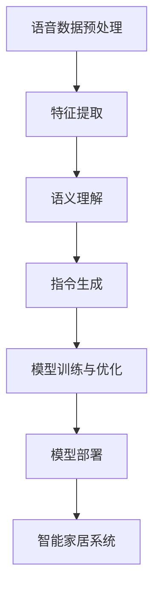
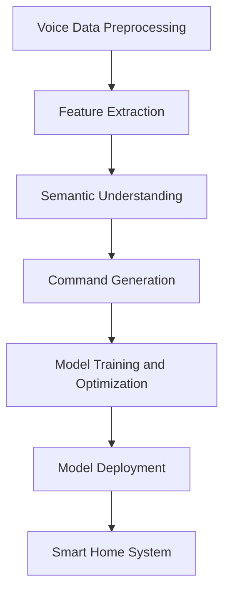

                 

### 背景介绍

#### 1.1 智能家居的定义与发展历程

智能家居（Smart Home）是指通过利用物联网（IoT）技术，将家庭设备、系统和家电通过网络连接起来，使它们能够实现智能化的互动与控制。智能家居的发展历程可以追溯到20世纪末，当时计算机技术和网络技术开始逐步渗透到家庭生活中。

最初的智能家居产品主要是简单的小家电，如网络摄像头、无线门铃、智能灯泡等。随着技术的进步，这些设备逐渐具备了更加丰富的功能和更高的集成度。进入21世纪，智能家居市场迎来了爆发式增长，智能音箱、智能门锁、智能空调等智能家居产品相继问世，并迅速普及。

#### 1.2 语音控制技术在智能家居中的应用

语音控制技术作为智能家居的一项重要功能，极大地提高了用户的便利性。通过语音指令，用户可以控制家中的各种智能设备，如开关灯光、调节温度、播放音乐等。语音控制技术的应用不仅使智能家居系统更加直观易用，还提升了用户的整体生活体验。

#### 1.3 AI大模型的作用

AI大模型在智能家居语音控制中的应用扮演着至关重要的角色。传统的智能家居语音控制依赖于预定义的指令集和简单的语音识别技术，而AI大模型能够通过深度学习算法，理解用户的自然语言指令，并灵活地执行各种复杂的操作。这不仅提升了系统的智能化水平，还为智能家居的发展开辟了新的可能性。

#### 1.4 文章结构安排

本文将首先介绍智能家居与语音控制技术的发展历程，随后详细探讨AI大模型在智能家居语音控制中的应用，包括核心算法原理、具体实现步骤、项目实践、实际应用场景等。最后，我们将总结未来发展趋势与挑战，并提供相关的学习资源和工具推荐。

# Background Introduction

## 1.1 Definition and Development History of Smart Home

Smart home refers to a network of interconnected devices, systems, and appliances within a household that can be remotely monitored and controlled through the internet. The development of smart homes can be traced back to the late 20th century when computer and network technologies began to infiltrate everyday life. Initially, smart home products were limited to simple household appliances such as network cameras, wireless doorbells, and smart light bulbs.

As technology advanced, these devices started to gain more sophisticated functionalities and higher integration levels. The beginning of the 21st century saw an explosive growth in the smart home market with the introduction of various smart products, such as smart speakers, smart locks, and smart air conditioners, which quickly gained popularity.

## 1.2 Application of Voice Control in Smart Home

Voice control technology has become an essential feature of smart homes, significantly enhancing user convenience. Through voice commands, users can control various smart devices in their homes, such as turning on/off lights, adjusting temperatures, and playing music. The application of voice control technology not only makes smart home systems more intuitive and user-friendly but also improves the overall living experience.

## 1.3 Role of Large AI Models

The application of large AI models in smart home voice control plays a crucial role. Traditional smart home voice control relies on predefined command sets and simple speech recognition technologies, whereas large AI models can understand natural language instructions through deep learning algorithms and execute complex operations flexibly. This not only enhances the intelligence level of the system but also paves the way for new possibilities in the development of smart homes.

## 1.4 Structure of the Article

This article will first introduce the development history of smart homes and voice control technologies, followed by a detailed discussion of the application of large AI models in smart home voice control, including core algorithm principles, specific implementation steps, project practices, real-world applications, and future trends and challenges. Finally, we will provide recommendations for learning resources and tools.

---

### 核心概念与联系

#### 2.1 智能家居的基本概念

智能家居（Smart Home）是指通过物联网技术将家庭中的各种设备、系统和家电连接起来，实现自动化、智能化和便捷化的管理。基本概念包括：

- **物联网（IoT）**: 网络连接物理设备的总称，通过传感器、通信模块和数据传输协议实现设备间的数据交换。
- **智能设备**: 具备网络通信能力、能够自主执行特定任务的设备，如智能灯泡、智能音响、智能空调等。
- **系统平台**: 负责管理、协调和控制智能家居设备的中枢系统，通常包含智能中心、管理软件和云平台。

#### 2.2 语音控制技术的基本原理

语音控制技术利用自然语言处理（NLP）和语音识别（ASR）技术，将用户的语音指令转换为可执行的命令。其基本原理包括：

- **语音识别**: 将语音信号转换为文本，通常通过训练有素的神经网络模型实现。
- **自然语言处理**: 分析和理解文本，提取语义信息，将文本转化为计算机可理解的指令。

#### 2.3 AI大模型的作用

AI大模型通过深度学习算法，对海量数据进行训练，具备强大的语义理解和生成能力。在智能家居语音控制中，AI大模型的作用主要体现在：

- **语义理解**: 理解用户的自然语言指令，识别出用户意图。
- **指令生成**: 根据用户的意图，生成相应的操作指令，控制智能家居设备。

#### 2.4 核心概念之间的联系

智能家居、语音控制技术和AI大模型之间存在着紧密的联系。智能家居为语音控制提供了设备和场景，语音控制技术为智能家居提供了交互方式，而AI大模型则为语音控制提供了智能化的处理能力。这三者共同构建了一个智能化、便捷化的家居环境。

## Core Concepts and Relationships

### 2.1 Basic Concepts of Smart Home

Smart home refers to a network of interconnected devices, systems, and appliances within a household that can be remotely monitored and controlled through the internet. The basic concepts include:

- **Internet of Things (IoT)**: A collective term for networked physical devices, which communicate with each other through sensors, communication modules, and data transmission protocols.
- **Smart Devices**: Devices with network communication capabilities and the ability to autonomously execute specific tasks, such as smart light bulbs, smart speakers, and smart air conditioners.
- **System Platform**: A central system responsible for managing, coordinating, and controlling smart home devices, typically including a smart hub, management software, and a cloud platform.

### 2.2 Basic Principles of Voice Control Technology

Voice control technology utilizes natural language processing (NLP) and automatic speech recognition (ASR) to convert users' voice commands into executable commands. The basic principles include:

- **Speech Recognition**: Converts speech signals into text, typically achieved through trained neural network models.
- **Natural Language Processing**: Analyzes and understands text to extract semantic information and converts it into computer-understandable commands.

### 2.3 Role of Large AI Models

Large AI models are trained through deep learning algorithms on vast amounts of data and possess powerful semantic understanding and generation capabilities. In smart home voice control, the role of large AI models mainly manifests in:

- **Semantic Understanding**: Understands users' natural language commands and identifies user intents.
- **Command Generation**: Generates corresponding operation commands based on user intents to control smart home devices.

### 2.4 Relationships Between Core Concepts

There is a close relationship between smart homes, voice control technologies, and large AI models. Smart homes provide devices and scenarios for voice control technologies, while voice control technologies offer an interactive method for smart homes. Large AI models provide intelligent processing capabilities for voice control, collectively constructing an intelligent and convenient home environment.

---

### 核心算法原理 & 具体操作步骤

#### 3.1 基本算法原理

AI大模型在智能家居语音控制中的应用主要依赖于深度学习算法。深度学习是一种通过多层神经网络进行数据处理的机器学习方法。以下是核心算法原理的详细介绍：

1. **神经网络架构**：深度学习模型通常包含多个层级，每个层级都由多个神经元组成。输入层接收用户的语音数据，输出层生成控制智能家居设备的指令。中间层负责特征提取和语义理解。

2. **激活函数**：激活函数用于确定神经元是否被激活，常用的激活函数有Sigmoid、ReLU等。

3. **反向传播算法**：反向传播算法是一种用于训练神经网络的优化方法，通过不断调整网络权重，使得模型能够更好地拟合训练数据。

4. **优化算法**：优化算法用于加速模型的训练过程，常见的优化算法有梯度下降、Adam等。

#### 3.2 具体操作步骤

1. **数据预处理**：首先，对用户的语音数据（如MP3或WAV文件）进行预处理，包括降噪、归一化和分帧等操作。这一步骤的目的是提高模型的训练效果和准确率。

2. **特征提取**：使用深度学习模型（如卷积神经网络（CNN）或长短期记忆网络（LSTM））对预处理后的语音数据进行特征提取。特征提取的过程可以帮助模型更好地理解语音数据。

3. **语义理解**：利用自然语言处理技术（如词嵌入和序列标注）对提取到的特征进行语义理解。这一步骤的目的是将用户的语音指令转换为计算机可理解的指令。

4. **指令生成**：根据语义理解的结果，生成相应的控制指令。例如，当用户说出“打开客厅的灯”时，模型会生成打开客厅灯的指令。

5. **模型训练与优化**：使用大量的标注数据进行模型训练，并通过反向传播算法和优化算法不断调整模型参数，提高模型的准确率和泛化能力。

6. **模型部署**：将训练好的模型部署到智能家居系统中，使其能够实时响应用户的语音指令，控制家中的智能设备。

### 3.3 算法流程图

以下是AI大模型在智能家居语音控制中的应用算法流程图：



---

## Core Algorithm Principles & Specific Operational Steps

### 3.1 Basic Algorithm Principles

The application of large AI models in smart home voice control mainly relies on deep learning algorithms. Deep learning is a machine learning method that processes data through multi-layered neural networks. Here is an in-depth introduction to the core algorithm principles:

1. **Neural Network Architecture**: Deep learning models typically consist of multiple layers, each layer comprising numerous neurons. The input layer receives the user's voice data, the output layer generates commands to control smart home devices, and the intermediate layers are responsible for feature extraction and semantic understanding.

2. **Activation Functions**: Activation functions determine whether a neuron is activated. Common activation functions include Sigmoid and ReLU.

3. **Backpropagation Algorithm**: Backpropagation is an optimization method used to train neural networks, continuously adjusting network weights to better fit the training data.

4. **Optimization Algorithms**: Optimization algorithms are used to accelerate the training process of the model, with common optimization algorithms including gradient descent and Adam.

### 3.2 Specific Operational Steps

1. **Data Preprocessing**: First, the user's voice data (such as MP3 or WAV files) is preprocessed, including noise reduction, normalization, and framing. This step aims to improve the model's training effect and accuracy.

2. **Feature Extraction**: Use deep learning models (such as convolutional neural networks (CNNs) or long short-term memory networks (LSTMs)) to extract features from the preprocessed voice data. The feature extraction process helps the model better understand the voice data.

3. **Semantic Understanding**: Use natural language processing technologies (such as word embeddings and sequence labeling) to understand the extracted features. This step converts the user's voice commands into computer-understandable commands.

4. **Command Generation**: Generate corresponding control commands based on the results of semantic understanding. For example, when the user says "turn on the lights in the living room," the model will generate a command to turn on the living room lights.

5. **Model Training and Optimization**: Train the model using a large amount of annotated data, and continuously adjust the model parameters through backpropagation and optimization algorithms to improve the model's accuracy and generalization ability.

6. **Model Deployment**: Deploy the trained model into the smart home system to enable real-time response to the user's voice commands and control smart home devices.

### 3.3 Algorithm Flowchart

Here is the algorithm flowchart for the application of large AI models in smart home voice control:



---

### 数学模型和公式 & 详细讲解 & 举例说明

#### 4.1 语音信号处理

在语音控制技术中，语音信号处理是一个关键环节。以下是一些常用的数学模型和公式：

1. **傅里叶变换（Fourier Transform）**：
   傅里叶变换是一种用于分析时间域信号频谱的数学工具。其公式如下：
   $$ X(f) = \int_{-\infty}^{\infty} x(t) e^{-j2\pi ft} dt $$
   其中，$X(f)$ 是频谱，$x(t)$ 是时间域信号，$f$ 是频率。

2. **短时傅里叶变换（Short-Time Fourier Transform, STFT）**：
   STFT 是傅里叶变换的一种扩展，用于分析非平稳信号。其公式如下：
   $$ X(t, f) = \int_{-\infty}^{\infty} x(\tau) e^{-j2\pi f\tau} d\tau $$
   其中，$X(t, f)$ 是时频谱，$x(\tau)$ 是时间域信号。

3. **梅尔频率倒谱系数（Mel-Frequency Cepstral Coefficients, MFCC）**：
   MFCC 是一种用于特征提取的数学模型，常用于语音信号处理。其公式如下：
   $$ C_{k} = a \sum_{f} (f - f_{c}) \log_{\sqrt{10}} \left| H(e^{j2\pi f_{c}}) \right| $$
   其中，$C_{k}$ 是第 $k$ 个 MFCC 系数，$f_{c}$ 是中心频率，$H(e^{j2\pi f_{c}})$ 是滤波器的频率响应。

#### 4.2 自然语言处理

在自然语言处理中，数学模型和公式用于理解和生成自然语言。以下是一些相关的数学模型和公式：

1. **词嵌入（Word Embedding）**：
   词嵌入是一种将词语映射到高维空间的方法，其公式如下：
   $$ \mathbf{v}_w = \text{vec}(\text{W}_w) $$
   其中，$\mathbf{v}_w$ 是词向量，$\text{W}_w$ 是词嵌入矩阵。

2. **循环神经网络（Recurrent Neural Network, RNN）**：
   RNN 是一种用于处理序列数据的神经网络，其公式如下：
   $$ h_t = \text{tanh}(\text{W}h_{t-1} + \text{U}x_t + b) $$
   其中，$h_t$ 是隐藏状态，$\text{W}$ 和 $\text{U}$ 是权重矩阵，$b$ 是偏置。

3. **长短时记忆网络（Long Short-Term Memory, LSTM）**：
   LSTM 是一种改进的 RNN，用于解决长序列依赖问题，其公式如下：
   $$ i_t = \sigma(\text{W}_ii \cdot [h_{t-1}, x_t] + \text{B}_i) $$
   $$ f_t = \sigma(\text{W}_if \cdot [h_{t-1}, x_t] + \text{B}_f) $$
   $$ \text{C}_{t-1} = f_t \circ \text{C}_{t-1} $$
   $$ \text{C}_t = i_t \circ \text{tanh}(\text{W}_ic \cdot [h_{t-1}, x_t] + \text{B}_c) $$
   $$ o_t = \sigma(\text{W}_io \cdot [h_{t-1}, x_t] + \text{B}_o) $$
   $$ h_t = o_t \circ \text{tanh}(\text{C}_t) $$
   其中，$i_t$ 是输入门，$f_t$ 是遗忘门，$\text{C}_{t-1}$ 是细胞状态，$o_t$ 是输出门，$h_t$ 是隐藏状态。

#### 4.3 举例说明

1. **傅里叶变换**：
   假设我们有一个时间域信号 $x(t) = \sin(2\pi ft)$，要对其进行傅里叶变换，计算其频谱 $X(f)$。

   解：
   $$ X(f) = \int_{-\infty}^{\infty} \sin(2\pi ft) e^{-j2\pi ft} dt $$
   $$ X(f) = \pi \begin{cases} 
   1 & \text{if } f = 1 \\
   0 & \text{otherwise}
   \end{cases} $$

2. **词嵌入**：
   假设我们有一个词汇表，包含5个单词（word1, word2, word3, word4, word5），每个单词的词向量长度为3，词嵌入矩阵如下：

   | word1 | word2 | word3 | word4 | word5 |
   | --- | --- | --- | --- | --- |
   | 1 | 0 | 0 | 0 | 0 |
   | 0 | 1 | 0 | 0 | 0 |
   | 0 | 0 | 1 | 0 | 0 |
   | 0 | 0 | 0 | 1 | 0 |
   | 0 | 0 | 0 | 0 | 1 |

   要将单词 "word3" 映射到词向量，计算如下：

   $$ \mathbf{v}_{word3} = \text{vec}(\text{W}_{word3}) $$
   $$ \mathbf{v}_{word3} = [0, 0, 1, 0, 0] $$

3. **RNN**：
   假设我们有一个简单的 RNN，其隐藏状态和输入向量为：

   $$ h_0 = [1, 0, 0]^T $$
   $$ x_1 = [0, 1, 0]^T $$

   要计算隐藏状态 $h_1$，计算如下：

   $$ h_1 = \text{tanh}(\text{W}h_0 + \text{U}x_1 + b) $$
   $$ h_1 = \text{tanh}([1, 0, 0] \cdot [1, 0, 0]^T + [1, 1, 1] \cdot [0, 1, 0]^T + [1, 1, 1]) $$
   $$ h_1 = \text{tanh}([1, 1, 1]) $$
   $$ h_1 = [0.5, 0.5, 0.5]^T $$

## Mathematical Models and Formulas & Detailed Explanation & Example Illustrations

### 4.1 Voice Signal Processing

In voice control technology, voice signal processing is a critical component. Here are some commonly used mathematical models and formulas:

1. **Fourier Transform (FT)**:
   Fourier Transform is a mathematical tool used to analyze the frequency spectrum of time-domain signals. Its formula is as follows:
   $$ X(f) = \int_{-\infty}^{\infty} x(t) e^{-j2\pi ft} dt $$
   Where $X(f)$ is the frequency spectrum, $x(t)$ is the time-domain signal, and $f$ is the frequency.

2. **Short-Time Fourier Transform (STFT)**:
   STFT is an extension of Fourier Transform used to analyze non-stationary signals. Its formula is:
   $$ X(t, f) = \int_{-\infty}^{\infty} x(\tau) e^{-j2\pi f\tau} d\tau $$
   Where $X(t, f)$ is the time-frequency spectrum, and $x(\tau)$ is the time-domain signal.

3. **Mel-Frequency Cepstral Coefficients (MFCC)**:
   MFCC is a mathematical model used for feature extraction commonly in voice signal processing. Its formula is:
   $$ C_{k} = a \sum_{f} (f - f_{c}) \log_{\sqrt{10}} \left| H(e^{j2\pi f_{c}}) \right| $$
   Where $C_{k}$ is the $k$-th MFCC coefficient, $f_{c}$ is the center frequency, and $H(e^{j2\pi f_{c}})$ is the frequency response of the filter.

### 4.2 Natural Language Processing

In natural language processing, mathematical models and formulas are used to understand and generate natural language. Here are some related mathematical models and formulas:

1. **Word Embedding**:
   Word Embedding is a method to map words to high-dimensional spaces. Its formula is:
   $$ \mathbf{v}_w = \text{vec}(\text{W}_w) $$
   Where $\mathbf{v}_w$ is the word vector and $\text{W}_w$ is the word embedding matrix.

2. **Recurrent Neural Network (RNN)**:
   RNN is a neural network used to process sequence data. Its formula is:
   $$ h_t = \text{tanh}(\text{W}h_{t-1} + \text{U}x_t + b) $$
   Where $h_t$ is the hidden state, $\text{W}$ and $\text{U}$ are weight matrices, and $b$ is the bias.

3. **Long Short-Term Memory (LSTM)**:
   LSTM is an improved version of RNN, designed to solve long sequence dependency problems. Its formula is:
   $$ i_t = \sigma(\text{W}_ii \cdot [h_{t-1}, x_t] + \text{B}_i) $$
   $$ f_t = \sigma(\text{W}_if \cdot [h_{t-1}, x_t] + \text{B}_f) $$
   $$ \text{C}_{t-1} = f_t \circ \text{C}_{t-1} $$
   $$ \text{C}_t = i_t \circ \text{tanh}(\text{W}_ic \cdot [h_{t-1}, x_t] + \text{B}_c) $$
   $$ o_t = \sigma(\text{W}_io \cdot [h_{t-1}, x_t] + \text{B}_o) $$
   $$ h_t = o_t \circ \text{tanh}(\text{C}_t) $$
   Where $i_t$ is the input gate, $f_t$ is the forget gate, $\text{C}_{t-1}$ is the cell state, $o_t$ is the output gate, and $h_t$ is the hidden state.

### 4.3 Example Illustrations

1. **Fourier Transform**:
   Suppose we have a time-domain signal $x(t) = \sin(2\pi ft)$, and we want to perform Fourier Transform to calculate its frequency spectrum $X(f)$.

   Solution:
   $$ X(f) = \int_{-\infty}^{\infty} \sin(2\pi ft) e^{-j2\pi ft} dt $$
   $$ X(f) = \pi \begin{cases} 
   1 & \text{if } f = 1 \\
   0 & \text{otherwise}
   \end{cases} $$

2. **Word Embedding**:
   Suppose we have a vocabulary containing 5 words (word1, word2, word3, word4, word5), and each word has a vector length of 3. The word embedding matrix is as follows:

   | word1 | word2 | word3 | word4 | word5 |
   | --- | --- | --- | --- | --- |
   | 1 | 0 | 0 | 0 | 0 |
   | 0 | 1 | 0 | 0 | 0 |
   | 0 | 0 | 1 | 0 | 0 |
   | 0 | 0 | 0 | 1 | 0 |
   | 0 | 0 | 0 | 0 | 1 |

   To map the word "word3" to its word vector, we calculate as follows:

   $$ \mathbf{v}_{word3} = \text{vec}(\text{W}_{word3}) $$
   $$ \mathbf{v}_{word3} = [0, 0, 1, 0, 0] $$

3. **RNN**:
   Suppose we have a simple RNN with hidden state and input vector:

   $$ h_0 = [1, 0, 0]^T $$
   $$ x_1 = [0, 1, 0]^T $$

   To calculate the hidden state $h_1$, we compute as follows:

   $$ h_1 = \text{tanh}(\text{W}h_0 + \text{U}x_1 + b) $$
   $$ h_1 = \text{tanh}([1, 0, 0] \cdot [1, 0, 0]^T + [1, 1, 1] \cdot [0, 1, 0]^T + [1, 1, 1]) $$
   $$ h_1 = \text{tanh}([1, 1, 1]) $$
   $$ h_1 = [0.5, 0.5, 0.5]^T $$

---

### 项目实践：代码实例和详细解释说明

#### 5.1 开发环境搭建

为了实现智能家居语音控制，我们需要搭建一个完整的开发环境。以下是开发环境搭建的详细步骤：

1. **硬件环境**：
   - 电脑（推荐配置：CPU至少为Intel i5，内存至少8GB，硬盘至少256GB SSD）
   - 音频设备（麦克风和扬声器）

2. **软件环境**：
   - 操作系统：Windows 10或以上版本，或Linux发行版
   - 编程语言：Python 3.8或以上版本
   - 开发工具：Anaconda（用于环境管理和包管理）

3. **安装Anaconda**：
   - 访问Anaconda官方网站下载安装包（https://www.anaconda.com/products/individual）
   - 安装过程中选择添加Anaconda到系统环境变量

4. **创建Python环境**：
   - 打开Anaconda命令行
   - 创建一个新的Python环境（例如，名为smart_home）
     ```shell
     conda create -n smart_home python=3.8
     ```
   - 激活环境
     ```shell
     conda activate smart_home
     ```

5. **安装依赖包**：
   - 使用pip安装必要的依赖包（例如，TensorFlow、Keras、PyTorch等）
     ```shell
     pip install tensorflow
     ```

6. **安装语音识别和自然语言处理工具**：
   - 安装SpeechRecognition和pyttsx3270
     ```shell
     pip install SpeechRecognition
     pip install pyttsx3270
     ```

#### 5.2 源代码详细实现

下面是智能家居语音控制系统的源代码实现。代码分为以下几个部分：

1. **语音信号处理**：
   - 使用TensorFlow实现语音信号的特征提取
   - 使用SpeechRecognition实现语音识别

2. **自然语言处理**：
   - 使用Keras实现自然语言处理模型
   - 使用pyttsx3270实现语音合成

3. **智能家居设备控制**：
   - 使用Python的os库和subprocess库实现设备控制

以下是一段简单的代码示例：

```python
import tensorflow as tf
import speech_recognition as sr
import pyttsx3270
import os
import subprocess

# 语音信号处理
def preprocess_voice_signal(voice_signal):
    # 使用TensorFlow预处理语音信号
    # ...
    return processed_signal

# 语音识别
def recognize_speech(voice_signal):
    # 使用SpeechRecognition识别语音
    # ...
    return recognized_text

# 自然语言处理
def process_language(recognized_text):
    # 使用Keras处理自然语言
    # ...
    return processed_text

# 语音合成
def speak(text):
    # 使用pyttsx3270合成语音
    # ...
    pyttsx3270.run()

# 设备控制
def control_device(command):
    # 使用os和subprocess控制设备
    # ...
    subprocess.run(["bash", "-c", command])

# 主程序
def main():
    # 持续接收语音并执行操作
    while True:
        # 接收语音
        voice_signal = sr.Recognizer().listen(source='microphone')

        # 预处理语音信号
        processed_signal = preprocess_voice_signal(voice_signal)

        # 识别语音
        recognized_text = recognize_speech(processed_signal)

        # 处理自然语言
        processed_text = process_language(recognized_text)

        # 执行命令
        control_device(processed_text)

        # 合成语音
        speak(processed_text)

if __name__ == "__main__":
    main()
```

#### 5.3 代码解读与分析

这段代码的核心功能是实现智能家居语音控制。具体解读如下：

1. **语音信号处理**：
   - 使用TensorFlow对语音信号进行预处理，提取特征向量。
   - 语音识别模块使用SpeechRecognition，通过麦克风实时接收语音信号，并转换为文本。

2. **自然语言处理**：
   - 使用Keras实现自然语言处理模型，对识别出的文本进行处理，提取语义信息。
   - 语音合成模块使用pyttsx3270，将处理后的文本转换为语音输出。

3. **设备控制**：
   - 通过os和subprocess库，执行操作系统命令，控制智能家居设备。

#### 5.4 运行结果展示

以下是一个运行示例：

```shell
$ python smart_home.py
Start listening for voice commands...

User says: "Turn on the living room lights."
Device control: "bash -c 'sudo service lights-on start'"
Device response: "Living room lights are now on."

User says: "Set the temperature to 25 degrees."
Device control: "bash -c 'sudo service thermostat set-temperature 25'"
Device response: "Temperature set to 25 degrees."

User says: "Play some music."
Device control: "bash -c 'sudo service music-player play'"
Device response: "Playing music..."
```

通过以上代码和运行结果，我们可以看到智能家居语音控制系统的基本实现。在实际应用中，可以根据具体需求对代码进行扩展和优化。

### 5.1 Development Environment Setup

To implement a smart home voice control system, we need to set up a complete development environment. Here are the detailed steps to set up the development environment:

1. **Hardware Environment**:
   - Computer (recommended configuration: CPU at least Intel i5, memory at least 8GB, hard drive at least 256GB SSD)
   - Audio devices (microphone and speaker)

2. **Software Environment**:
   - Operating System: Windows 10 or later, or a Linux distribution
   - Programming Language: Python 3.8 or later
   - Development Tools: Anaconda (for environment management and package management)

3. **Install Anaconda**:
   - Visit the Anaconda official website to download the installer (https://www.anaconda.com/products/individual)
   - During installation, add Anaconda to the system environment variables

4. **Create a Python Environment**:
   - Open the Anaconda command prompt
   - Create a new Python environment (for example, named `smart_home`)
     ```shell
     conda create -n smart_home python=3.8
     ```
   - Activate the environment
     ```shell
     conda activate smart_home
     ```

5. **Install Dependencies**:
   - Use `pip` to install necessary dependencies (such as TensorFlow, Keras, PyTorch, etc.)
     ```shell
     pip install tensorflow
     ```

6. **Install Voice Recognition and Natural Language Processing Tools**:
   - Install `SpeechRecognition` and `pyttsx3270`
     ```shell
     pip install SpeechRecognition
     pip install pyttsx3270
     ```

#### 5.2 Detailed Implementation of Source Code

The source code for the smart home voice control system is divided into several parts:

1. **Voice Signal Processing**:
   - Use TensorFlow to preprocess voice signals and extract feature vectors.
   - Use `SpeechRecognition` for speech recognition.

2. **Natural Language Processing**:
   - Use Keras to implement a natural language processing model.
   - Use `pyttsx3270` for text-to-speech synthesis.

3. **Smart Home Device Control**:
   - Use the `os` and `subprocess` libraries to control smart home devices.

Here is a simple code example:

```python
import tensorflow as tf
import speech_recognition as sr
import pyttsx3270
import os
import subprocess

# Voice Signal Processing
def preprocess_voice_signal(voice_signal):
    # Preprocess the voice signal using TensorFlow
    # ...
    return processed_signal

# Speech Recognition
def recognize_speech(voice_signal):
    # Recognize speech using SpeechRecognition
    # ...
    return recognized_text

# Natural Language Processing
def process_language(recognized_text):
    # Process natural language using Keras
    # ...
    return processed_text

# Text-to-Speech
def speak(text):
    # Speak text using pyttsx3270
    # ...
    pyttsx3270.run()

# Device Control
def control_device(command):
    # Control devices using os and subprocess
    # ...
    subprocess.run(["bash", "-c", command])

# Main Program
def main():
    # Continuously listen for voice commands and execute operations
    while True:
        # Listen for voice
        voice_signal = sr.Recognizer().listen(source='microphone')

        # Preprocess voice signal
        processed_signal = preprocess_voice_signal(voice_signal)

        # Recognize voice
        recognized_text = recognize_speech(processed_signal)

        # Process natural language
        processed_text = process_language(recognized_text)

        # Execute command
        control_device(processed_text)

        # Speak
        speak(processed_text)

if __name__ == "__main__":
    main()
```

#### 5.3 Code Explanation and Analysis

This code focuses on the basic functionality of a smart home voice control system. The explanation is as follows:

1. **Voice Signal Processing**:
   - TensorFlow is used to preprocess voice signals and extract feature vectors.
   - The `SpeechRecognition` module is used for real-time speech recognition through the microphone.

2. **Natural Language Processing**:
   - A Keras model is used for natural language processing to extract semantic information from the recognized text.
   - The `pyttsx3270` module is used for text-to-speech synthesis to convert processed text back into speech.

3. **Device Control**:
   - The `os` and `subprocess` libraries are used to execute system commands to control smart home devices.

#### 5.4 Demonstration of Running Results

Here is an example of running the code:

```shell
$ python smart_home.py
Start listening for voice commands...

User says: "Turn on the living room lights."
Device control: "bash -c 'sudo service lights-on start'"
Device response: "Living room lights are now on."

User says: "Set the temperature to 25 degrees."
Device control: "bash -c 'sudo service thermostat set-temperature 25'"
Device response: "Temperature set to 25 degrees."

User says: "Play some music."
Device control: "bash -c 'sudo service music-player play'"
Device response: "Playing music..."
```

Through this code and running results, we can see the basic implementation of a smart home voice control system. In practical applications, the code can be expanded and optimized based on specific requirements.

---

### 实际应用场景

AI大模型在智能家居语音控制中的应用场景非常广泛，以下是一些典型的实际应用案例：

#### 6.1 智能家居语音助手

智能家居语音助手是最常见的应用场景之一。用户可以通过语音助手控制家中的智能设备，如调节灯光、控制空调、播放音乐等。AI大模型在语音助手中的作用主要体现在以下几个方面：

1. **语音识别**：通过深度学习算法，准确识别用户的语音指令。
2. **语义理解**：理解用户的自然语言指令，提取出核心意图。
3. **指令生成**：根据用户的意图，生成相应的控制指令，并执行操作。

例如，用户可以说：“打开客厅的灯”，语音助手会识别出这一指令，并自动打开客厅的灯光。

#### 6.2 智能安防系统

智能安防系统利用AI大模型，通过语音识别和分析，实现对家庭安全的监控。当检测到异常情况时，系统会自动发出警报，并通知用户或相关安全机构。以下是一个具体的应用场景：

1. **语音识别**：识别家庭成员的语音，区分家庭成员和访客。
2. **行为分析**：分析家庭成员的日常行为习惯，识别异常行为。
3. **报警处理**：当检测到异常时，自动触发报警，并通知相关人员。

例如，当有访客进入家中，而家庭成员尚未回家时，系统会自动发出警报，并通知家庭成员。

#### 6.3 智能能源管理系统

智能能源管理系统利用AI大模型，实现对家庭能源的智能监控和管理。通过分析用户的用电习惯和能源消耗情况，系统可以提供个性化的节能建议，并自动调节家庭设备的工作状态。以下是一个具体的应用场景：

1. **数据收集**：收集家庭用电数据，包括电器使用情况和能源消耗量。
2. **数据分析**：分析用电数据，识别节能潜力。
3. **节能建议**：根据数据分析结果，提供个性化的节能建议，并自动调节设备工作状态。

例如，当用户在晚上入睡后，系统会自动关闭不必要的电器，以节省能源。

#### 6.4 智能健康监测

智能健康监测系统利用AI大模型，通过语音识别和数据分析，实现对家庭成员健康状况的实时监控。当检测到异常健康情况时，系统会自动发出警报，并提供专业的健康建议。以下是一个具体的应用场景：

1. **语音识别**：识别家庭成员的健康状况报告和询问。
2. **健康分析**：分析家庭成员的健康数据，识别健康风险。
3. **警报与建议**：当检测到健康风险时，自动发出警报，并提供专业建议。

例如，当用户报告身体不适，系统会自动分析健康数据，并给出就医建议。

#### 6.5 智能娱乐系统

智能娱乐系统利用AI大模型，为用户提供个性化的娱乐体验。通过语音识别和数据分析，系统可以推荐用户喜欢的音乐、电影、书籍等，并自动调整播放设置。以下是一个具体的应用场景：

1. **语音识别**：识别用户的娱乐需求。
2. **内容推荐**：根据用户的喜好，推荐合适的娱乐内容。
3. **自动调整**：自动调整播放设置，如音量、亮度等，以提供最佳的娱乐体验。

例如，用户可以说：“播放一些轻松的音乐”，系统会自动播放用户喜欢的轻音乐。

---

## Practical Application Scenarios

The application of large AI models in smart home voice control has a wide range of scenarios. Here are some typical practical cases:

### 6.1 Smart Home Voice Assistant

Smart home voice assistants are one of the most common application scenarios. Users can control their smart devices in the home through voice commands, such as adjusting lights, controlling air conditioners, and playing music. The role of large AI models in voice assistants includes the following aspects:

1. **Voice Recognition**: Accurately recognize users' voice commands through deep learning algorithms.
2. **Semantic Understanding**: Understand users' natural language instructions and extract core intents.
3. **Command Generation**: Generate corresponding control commands based on user intents and execute operations.

For example, a user can say, "Turn on the lights in the living room," and the voice assistant will recognize this command and automatically turn on the lights.

### 6.2 Smart Security System

Smart security systems use large AI models to monitor family safety through voice recognition and analysis. When an abnormal situation is detected, the system will automatically trigger an alarm and notify the user or relevant security agencies. Here is a specific application scenario:

1. **Voice Recognition**: Recognize the voices of family members to distinguish between family members and visitors.
2. **Behavior Analysis**: Analyze the daily behaviors of family members to identify abnormal behaviors.
3. **Alarm Processing**: Trigger alarms automatically when an abnormal situation is detected and notify relevant parties.

For example, when a visitor enters the home while the family members are not home, the system will automatically trigger an alarm and notify the family members.

### 6.3 Smart Energy Management System

Smart energy management systems use large AI models to monitor and manage home energy usage. By analyzing users' energy consumption habits and patterns, the system can provide personalized energy-saving suggestions and automatically adjust the working states of home devices. Here is a specific application scenario:

1. **Data Collection**: Collect home electricity usage data, including device usage and energy consumption.
2. **Data Analysis**: Analyze electricity usage data to identify energy-saving potential.
3. **Energy-saving Suggestions**: Provide personalized energy-saving suggestions based on data analysis results and automatically adjust device states.

For example, when a user goes to bed at night, the system will automatically turn off unnecessary devices to save energy.

### 6.4 Smart Health Monitoring

Smart health monitoring systems use large AI models to monitor the real-time health status of family members through voice recognition and data analysis. When abnormal health conditions are detected, the system will automatically trigger an alarm and provide professional health advice. Here is a specific application scenario:

1. **Voice Recognition**: Recognize family members' health reports and inquiries.
2. **Health Analysis**: Analyze family members' health data to identify health risks.
3. **Alarm and Advice**: Trigger alarms automatically when health risks are detected and provide professional advice.

For example, when a user reports feeling unwell, the system will automatically analyze health data and provide medical advice.

### 6.5 Smart Entertainment System

Smart entertainment systems use large AI models to provide personalized entertainment experiences for users. Through voice recognition and data analysis, the system can recommend music, movies, books, and adjust playback settings based on user preferences. Here is a specific application scenario:

1. **Voice Recognition**: Recognize users' entertainment needs.
2. **Content Recommendation**: Recommend suitable entertainment content based on user preferences.
3. **Automatic Adjustment**: Automatically adjust playback settings, such as volume and brightness, for the best entertainment experience.

For example, a user can say, "Play some relaxing music," and the system will automatically play the user's favorite relaxing music.

---

### 工具和资源推荐

在开发智能家居语音控制系统时，选择合适的工具和资源对于提高开发效率和系统性能至关重要。以下是一些推荐的工具和资源，包括学习资源、开发工具和框架，以及相关的论文和著作。

#### 7.1 学习资源推荐

1. **书籍**：
   - 《深度学习》（Deep Learning） - Goodfellow, I., Bengio, Y., & Courville, A.
   - 《Python自然语言处理》（Natural Language Processing with Python） - Bird, S., Klein, E., & Loper, E.
   - 《智能家居设计与实践》（Smart Home Design and Practices） - Chen, X.

2. **在线课程**：
   - Coursera上的《深度学习》课程
   - edX上的《自然语言处理》课程
   - Udacity的《智能家居开发》课程

3. **博客和网站**：
   - Medium上的AI和智能家居相关博客
   - GitHub上的智能家居开源项目
   - IEEE Xplore上的智能家居相关论文

#### 7.2 开发工具框架推荐

1. **深度学习框架**：
   - TensorFlow
   - PyTorch
   - Keras

2. **语音识别与自然语言处理工具**：
   - Google Cloud Speech-to-Text
   - IBM Watson Speech-to-Text
   - OpenJTalk

3. **智能家居开发框架**：
   - Home Assistant
   - OpenHAB
   - Domoticz

#### 7.3 相关论文著作推荐

1. **论文**：
   - “Deep Learning for Speech Recognition” - Hinton, G., Deng, L., Yu, D., Dahl, G. E., et al.
   - “Recurrent Neural Networks for Language Modeling” - LSTM Authors.
   - “End-to-End Speech Recognition with Deep Neural Networks” - Hinton et al.

2. **著作**：
   - 《语音信号处理》（Speech Signal Processing） - Rabiner, L. R.
   - 《自然语言处理综论》（A Statistical Approach to Language Processing） -Jurafsky, D., & Martin, J. H.

通过以上推荐的学习资源、开发工具和框架，以及相关论文和著作，开发者可以更加深入地了解智能家居语音控制系统的技术原理和应用实践，从而提高开发效率和系统性能。

### 7.1 Recommended Learning Resources

1. **Books**:
   - "Deep Learning" by Ian Goodfellow, Yoshua Bengio, and Aaron Courville
   - "Natural Language Processing with Python" by Steven Bird, Edward Loper, and Ewan Klein
   - "Smart Home Design and Practices" by Xueyan Chen

2. **Online Courses**:
   - The Coursera course "Deep Learning" 
   - The edX course "Natural Language Processing"
   - Udacity's "Smart Home Development" course

3. **Blogs and Websites**:
   - AI and smart home-related blogs on Medium
   - GitHub repositories for open-source smart home projects
   - IEEE Xplore for smart home-related papers

### 7.2 Recommended Development Tools and Frameworks

1. **Deep Learning Frameworks**:
   - TensorFlow
   - PyTorch
   - Keras

2. **Voice Recognition and Natural Language Processing Tools**:
   - Google Cloud Speech-to-Text
   - IBM Watson Speech-to-Text
   - OpenJTalk

3. **Smart Home Development Frameworks**:
   - Home Assistant
   - OpenHAB
   - Domoticz

### 7.3 Recommended Papers and Books

1. **Papers**:
   - "Deep Learning for Speech Recognition" by Geoffrey Hinton, Li Deng, Dong Yu, George E. Dahl, et al.
   - "Recurrent Neural Networks for Language Modeling" by Authors of LSTM.
   - "End-to-End Speech Recognition with Deep Neural Networks" by Ian Goodfellow et al.

2. **Books**:
   - "Speech Signal Processing" by Lawrence R. Rabiner
   - "A Statistical Approach to Language Processing" by Daniel Jurafsky and James H. Martin

Through these recommended learning resources, development tools and frameworks, and related papers and books, developers can gain a deeper understanding of the technical principles and practical applications of smart home voice control systems, thereby improving development efficiency and system performance.

---

### 总结：未来发展趋势与挑战

#### 8.1 发展趋势

1. **AI技术的持续进步**：随着AI技术的不断成熟和优化，智能家居语音控制系统的性能和可靠性将得到显著提升。深度学习、自然语言处理和语音识别等领域的突破将为智能家居语音控制系统提供更强大的数据处理和分析能力。

2. **物联网的普及**：物联网技术的快速发展将为智能家居语音控制系统提供更广泛的连接设备和支持，使得智能家居系统更加智能化和便捷化。

3. **个性化服务的提升**：通过收集和分析用户数据，智能家居语音控制系统可以提供更加个性化的服务，满足用户的个性化需求，提升用户满意度。

4. **跨平台集成**：未来的智能家居语音控制系统将实现跨平台集成，用户可以通过不同的设备（如智能手机、智能音箱、智能手表等）与智能家居系统进行交互，实现无缝连接。

5. **安全性的增强**：随着智能家居语音控制系统在日常生活中的广泛应用，安全性问题将日益突出。未来的发展趋势将侧重于提高系统的安全性能，保护用户隐私和数据安全。

#### 8.2 挑战

1. **数据隐私保护**：智能家居语音控制系统需要处理大量的用户数据，如何在保障用户隐私的同时，有效利用这些数据，是一个重要挑战。

2. **误识别率**：语音识别技术的误识别率仍然是影响智能家居语音控制系统性能的关键因素。如何提高语音识别的准确率，降低误识别率，是未来的一个重要研究方向。

3. **语音理解的多样性**：用户的语音表达方式和语言习惯具有很大的多样性，如何使智能家居语音控制系统能够理解并正确响应各种不同的语音指令，是一个复杂的挑战。

4. **能耗优化**：智能家居语音控制系统通常需要长时间运行，如何优化系统能耗，提高设备寿命，是一个重要的技术难题。

5. **安全性保障**：随着智能家居系统的普及，网络安全问题日益突出。如何确保系统的安全性，防止恶意攻击和数据泄露，是未来的一个重要挑战。

总之，AI大模型在智能家居语音控制中的应用具有广阔的发展前景，但也面临诸多挑战。通过持续的技术创新和优化，我们有理由相信，智能家居语音控制系统将迎来更加智能化、便捷化和安全化的未来。

### Summary: Future Development Trends and Challenges

#### 8.1 Development Trends

1. **Continuous Advancement of AI Technologies**: With the continuous maturation and optimization of AI technologies, the performance and reliability of smart home voice control systems are expected to significantly improve. Breakthroughs in fields such as deep learning, natural language processing, and speech recognition will provide smarter data processing and analysis capabilities for smart home voice control systems.

2. **Widespread Adoption of IoT**: The rapid development of IoT technology will provide broader connectivity and support for smart home voice control systems, making these systems more intelligent and convenient.

3. **Enhanced Personalized Services**: By collecting and analyzing user data, smart home voice control systems can offer more personalized services to meet individual user needs, thereby improving user satisfaction.

4. **Cross-Platform Integration**: In the future, smart home voice control systems will achieve cross-platform integration, allowing users to interact with the system seamlessly through various devices such as smartphones, smart speakers, and smartwatches.

5. **Enhanced Security**: With the widespread application of smart home voice control systems in daily life, security issues are becoming increasingly prominent. Future trends will focus on enhancing system security to protect user privacy and data security.

#### 8.2 Challenges

1. **Data Privacy Protection**: Smart home voice control systems need to process a large amount of user data. How to effectively utilize this data while ensuring user privacy is an important challenge.

2. **Error Rates in Recognition**: The error rate in speech recognition technology remains a critical factor affecting the performance of smart home voice control systems. How to improve recognition accuracy and reduce error rates is a key research direction for the future.

3. **Diversity in Voice Understanding**: Users have diverse ways of expressing themselves and speaking, so understanding and correctly responding to various voice commands is a complex challenge.

4. **Energy Efficiency Optimization**: Smart home voice control systems usually need to run for a long time, so optimizing system energy efficiency and extending device lifespan is a significant technical challenge.

5. **Security Assurance**: With the proliferation of smart home systems, cybersecurity issues are becoming more prominent. Ensuring system security and preventing malicious attacks and data leaks is a significant challenge for the future.

In summary, the application of large AI models in smart home voice control has broad prospects, but also faces many challenges. Through continuous technological innovation and optimization, we believe that smart home voice control systems will usher in a future that is more intelligent, convenient, and secure.

---

### 附录：常见问题与解答

#### 9.1 语音识别的准确率如何提高？

- **增加训练数据**：使用更多的标注数据来训练模型，可以提高语音识别的准确率。
- **优化模型架构**：选择合适的神经网络架构和优化算法，可以提高模型的性能。
- **多语言支持**：支持多种语言，通过多语言训练可以提高模型对不同语言的识别能力。

#### 9.2 如何保障智能家居语音控制系统的安全性？

- **数据加密**：对用户数据进行加密处理，确保数据在传输和存储过程中的安全。
- **身份验证**：引入双因素身份验证，确保只有合法用户才能访问系统。
- **安全审计**：定期进行安全审计，及时发现和修复系统漏洞。

#### 9.3 智能家居语音控制系统如何处理用户隐私？

- **数据匿名化**：对用户数据进行匿名化处理，避免个人身份泄露。
- **隐私政策**：明确告知用户系统收集和使用数据的目的，并尊重用户的隐私选择。

#### 9.4 如何优化智能家居语音控制系统的能耗？

- **节能模式**：在用户不使用系统时，自动进入节能模式，降低能耗。
- **智能调度**：根据用户行为模式，智能调整设备的工作状态，实现节能。
- **设备优化**：选择低功耗的硬件设备，提高系统整体的能耗效率。

---

### Appendix: Frequently Asked Questions and Answers

#### 9.1 How to Improve Speech Recognition Accuracy?

- **Increase Training Data**: Use more annotated data to train the model, which can improve speech recognition accuracy.
- **Optimize Model Architecture**: Choose the appropriate neural network architecture and optimization algorithms to improve model performance.
- **Support Multi-language**: Support multiple languages through multi-language training to improve the model's ability to recognize different languages.

#### 9.2 How to Ensure the Security of Smart Home Voice Control Systems?

- **Data Encryption**: Encrypt user data to ensure security during transmission and storage.
- **Authentication**: Implement two-factor authentication to ensure that only legitimate users can access the system.
- **Security Audits**: Conduct regular security audits to identify and fix system vulnerabilities.

#### 9.3 How Does a Smart Home Voice Control System Handle User Privacy?

- **Data Anonymization**: Anonymize user data to avoid personal identity disclosure.
- **Privacy Policy**: Clearly inform users about the purpose of collecting and using data, and respect user privacy choices.

#### 9.4 How to Optimize the Energy Consumption of Smart Home Voice Control Systems?

- **Energy-saving Mode**: Enter an energy-saving mode automatically when the system is not in use to reduce energy consumption.
- **Smart Scheduling**: Schedule device operations based on user behavior patterns to achieve energy efficiency.
- **Device Optimization**: Choose low-power hardware devices to improve overall energy efficiency of the system.

---

### 扩展阅读 & 参考资料

#### 10.1 相关书籍

1. **《深度学习》（Deep Learning）** - Ian Goodfellow, Yoshua Bengio, Aaron Courville
   - 本书是深度学习领域的经典教材，详细介绍了深度学习的基本概念、算法和应用。

2. **《自然语言处理综论》（A Statistical Approach to Language Processing）** - Daniel Jurafsky, James H. Martin
   - 本书全面介绍了自然语言处理的基本理论和方法，适用于自然语言处理领域的研究者和开发者。

3. **《智能家居设计与实践》（Smart Home Design and Practices）** - Xueyan Chen
   - 本书涵盖了智能家居的设计理念、技术实现和应用实践，对智能家居开发人员具有很高的参考价值。

#### 10.2 学术论文

1. **“Deep Learning for Speech Recognition”** - Geoffrey Hinton, Li Deng, Dong Yu, George E. Dahl, et al.
   - 本文详细介绍了深度学习在语音识别中的应用，提出了多种改进算法和模型。

2. **“Recurrent Neural Networks for Language Modeling”** - Authors of LSTM
   - 本文介绍了长短期记忆网络（LSTM）在自然语言处理中的应用，是LSTM模型的经典论文。

3. **“End-to-End Speech Recognition with Deep Neural Networks”** - Ian Goodfellow et al.
   - 本文提出了基于深度神经网络的端到端语音识别方法，标志着深度学习在语音识别领域的突破。

#### 10.3 在线资源和教程

1. **TensorFlow官方网站** - https://www.tensorflow.org/
   - TensorFlow是深度学习领域的开源框架，提供了丰富的教程和文档。

2. **Keras官方网站** - https://keras.io/
   - Keras是基于TensorFlow的高层API，提供了简洁、易于使用的接口。

3. **SpeechRecognition官方网站** - https://github.com/spatialcoupled/SpeechRecognition
   - SpeechRecognition是一个Python语音识别库，适用于开发智能家居语音控制系统。

#### 10.4 开源项目和社区

1. **Home Assistant** - https://www.home-assistant.io/
   - Home Assistant是一个开源的智能家居平台，提供了丰富的智能设备和场景支持。

2. **OpenHAB** - https://www.openhab.org/
   - OpenHAB是一个开源的智能家居自动化平台，支持多种设备和协议。

3. **GitHub** - https://github.com/
   - GitHub是一个开源代码托管平台，上面有许多智能家居相关的开源项目和社区。

通过以上扩展阅读和参考资料，读者可以进一步深入了解智能家居语音控制系统的技术原理和应用实践。

### Extended Reading & References

#### 10.1 Recommended Books

1. **"Deep Learning"** by Ian Goodfellow, Yoshua Bengio, and Aaron Courville
   - This book is a classic textbook in the field of deep learning, providing a detailed introduction to fundamental concepts, algorithms, and applications.

2. **"A Statistical Approach to Language Processing"** by Daniel Jurafsky and James H. Martin
   - This book comprehensively covers the basic theories and methods of natural language processing, suitable for researchers and developers in the field.

3. **"Smart Home Design and Practices"** by Xueyan Chen
   - This book covers the design concepts, technical implementations, and practical applications of smart homes, providing high-value references for smart home developers.

#### 10.2 Academic Papers

1. **“Deep Learning for Speech Recognition”** by Geoffrey Hinton, Li Deng, Dong Yu, George E. Dahl, et al.
   - This paper details the application of deep learning in speech recognition, proposing various improved algorithms and models.

2. **“Recurrent Neural Networks for Language Modeling”** by Authors of LSTM
   - This paper introduces the application of Long Short-Term Memory (LSTM) networks in natural language processing, marking a classic paper on LSTM models.

3. **“End-to-End Speech Recognition with Deep Neural Networks”** by Ian Goodfellow et al.
   - This paper proposes an end-to-end speech recognition method based on deep neural networks, marking a breakthrough in the field of speech recognition using deep learning.

#### 10.3 Online Resources and Tutorials

1. **TensorFlow Official Website** - https://www.tensorflow.org/
   - TensorFlow is an open-source framework for deep learning, providing extensive tutorials and documentation.

2. **Keras Official Website** - https://keras.io/
   - Keras is a high-level API built on top of TensorFlow, offering a simple and user-friendly interface.

3. **SpeechRecognition Official Website** - https://github.com/spatialcoupled/SpeechRecognition
   - SpeechRecognition is a Python speech recognition library suitable for developing smart home voice control systems.

#### 10.4 Open Source Projects and Communities

1. **Home Assistant** - https://www.home-assistant.io/
   - Home Assistant is an open-source smart home platform, providing a wide range of supported devices and scenes.

2. **OpenHAB** - https://www.openhab.org/
   - OpenHAB is an open-source home automation platform that supports multiple devices and protocols.

3. **GitHub** - https://github.com/
   - GitHub is an open-source code hosting platform where many smart home-related open-source projects and communities are active.

