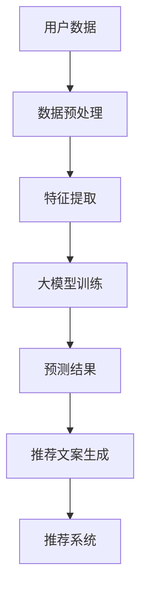

                 

### 1. 背景介绍

在当今电子商务飞速发展的背景下，电商平台商品推荐系统已经成为吸引用户、提升销售额的关键因素。传统的基于协同过滤、内容匹配的推荐算法虽然在一定程度上提高了推荐的准确度，但往往缺乏解释性，难以让用户理解和信任。随着深度学习技术的发展，大模型逐渐成为提高推荐系统性能的重要手段。

大模型在电商平台商品推荐中的作用主要体现在以下几个方面：

1. **提高推荐准确性**：通过学习用户的历史行为数据，大模型可以捕捉到用户复杂的偏好模式，从而生成更加准确的推荐结果。

2. **增强解释性**：传统算法生成的推荐结果往往“黑箱”性质严重，用户难以理解。大模型结合自然语言处理技术，可以生成具有解释性的推荐文案，提高用户对推荐结果的信任度。

3. **个性化推荐**：大模型可以根据用户的个性化需求，为每个用户提供量身定制的推荐内容，提升用户体验。

4. **多样性推荐**：大模型能够学习到不同用户之间的相似性和差异性，为用户提供多样性的推荐内容，避免推荐内容的同质化问题。

然而，大模型在电商平台商品推荐中也面临一些挑战，如过拟合、计算资源消耗等。因此，如何在大模型的基础上构建一个既高效又具有解释性的推荐系统，成为当前研究的热点问题。

本文旨在探讨大模型在电商平台商品推荐解释性生成与用户信任建立中的作用，分析其核心原理与具体实现，并通过实例展示其应用效果。文章结构如下：

1. **背景介绍**：阐述大模型在电商平台商品推荐中的重要性。

2. **核心概念与联系**：介绍大模型的基本概念及其在推荐系统中的具体应用。

3. **核心算法原理 & 具体操作步骤**：详细阐述大模型在商品推荐中的工作流程。

4. **数学模型和公式 & 详细讲解 & 举例说明**：讲解大模型中的关键数学模型，并通过具体例子进行说明。

5. **项目实践：代码实例和详细解释说明**：通过实际项目，展示大模型在商品推荐中的具体应用。

6. **实际应用场景**：分析大模型在不同电商平台中的应用。

7. **工具和资源推荐**：推荐相关的学习资源、开发工具和框架。

8. **总结：未来发展趋势与挑战**：总结大模型在商品推荐中的发展前景。

9. **附录：常见问题与解答**：针对读者可能遇到的问题进行解答。

10. **扩展阅读 & 参考资料**：提供更多深入的阅读资料。

### 2. 核心概念与联系

#### 2.1 大模型的概念

大模型，即大型深度学习模型，是指那些具有数十亿甚至数万亿参数的深度神经网络。这些模型通常基于自动编码器、生成对抗网络（GAN）等深度学习技术，能够处理大量数据，捕捉复杂的模式和关系。

#### 2.2 大模型在推荐系统中的应用

在推荐系统中，大模型的应用主要体现在以下几个方面：

1. **用户行为预测**：通过学习用户的历史行为数据，如浏览、购买记录等，大模型可以预测用户未来的行为，从而生成推荐结果。

2. **商品特征提取**：大模型可以从原始的、结构化或非结构化的商品数据中提取出有用的特征，用于推荐算法的训练和预测。

3. **生成推荐文案**：结合自然语言处理技术，大模型可以生成具有解释性的推荐文案，帮助用户更好地理解推荐内容。

#### 2.3 大模型与推荐系统的关系

大模型与推荐系统的关系可以用Mermaid流程图表示：



在该流程中，用户数据经过预处理和特征提取后，输入到大模型中进行训练。训练完成后，大模型可以生成预测结果，并通过自然语言处理技术生成推荐文案，最终形成推荐系统。

#### 2.4 大模型的优势与挑战

**优势**：

1. **高准确度**：大模型可以捕捉到复杂的用户行为模式和商品特征，从而生成更加准确的推荐结果。

2. **高解释性**：大模型结合自然语言处理技术，可以生成具有解释性的推荐文案，提高用户对推荐结果的信任度。

3. **个性化推荐**：大模型可以根据用户的个性化需求，为每个用户提供量身定制的推荐内容。

**挑战**：

1. **过拟合**：大模型容易在训练数据上过拟合，导致在测试数据上的表现不佳。

2. **计算资源消耗**：大模型训练和预测需要大量的计算资源和时间。

3. **数据隐私问题**：大模型需要处理大量的用户数据，存在数据隐私泄露的风险。

### 3. 核心算法原理 & 具体操作步骤

#### 3.1 大模型算法原理

大模型通常采用基于深度神经网络的算法，如深度神经网络（DNN）、卷积神经网络（CNN）、循环神经网络（RNN）等。其中，DNN在推荐系统中应用最为广泛。

DNN是一种多层神经网络，通过逐层提取特征，实现对输入数据的建模。在推荐系统中，DNN可以用于用户行为预测、商品特征提取和生成推荐文案。

#### 3.2 DNN在推荐系统中的工作流程

1. **用户行为预测**：

   - 输入用户历史行为数据，如浏览、购买记录等。

   - 通过DNN模型进行特征提取和建模。

   - 输出用户行为预测结果，如用户可能购买的商品。

2. **商品特征提取**：

   - 输入商品数据，如商品描述、价格、类别等。

   - 通过DNN模型提取商品特征，如商品相似度、热门程度等。

   - 输出商品特征向量。

3. **生成推荐文案**：

   - 输入用户行为预测结果和商品特征向量。

   - 通过自然语言处理技术，如生成对抗网络（GAN）、序列到序列（Seq2Seq）模型等，生成具有解释性的推荐文案。

   - 输出推荐文案。

#### 3.3 DNN模型的具体实现步骤

1. **数据预处理**：

   - 数据清洗：去除缺失值、异常值等。

   - 数据归一化：将数据缩放到相同的范围。

   - 数据分片：将数据集分为训练集、验证集和测试集。

2. **特征工程**：

   - 特征提取：从原始数据中提取有用的特征，如用户行为特征、商品特征等。

   - 特征融合：将不同来源的特征进行融合，提高模型的泛化能力。

3. **模型训练**：

   - 构建DNN模型：定义输入层、隐藏层和输出层。

   - 设置损失函数和优化器：选择适当的损失函数和优化算法，如交叉熵损失函数、Adam优化器等。

   - 训练模型：在训练集上训练模型，调整模型参数。

4. **模型评估**：

   - 在验证集上评估模型性能，调整模型参数。

   - 在测试集上评估模型性能，确定最终模型。

5. **生成推荐文案**：

   - 输入用户行为预测结果和商品特征向量。

   - 通过自然语言处理技术，生成具有解释性的推荐文案。

### 4. 数学模型和公式 & 详细讲解 & 举例说明

#### 4.1 DNN模型的基本结构

DNN模型通常由多个隐藏层组成，每一层都是由多个神经元（节点）构成。神经元之间的连接权重决定了特征传递的效果。DNN模型的基本结构可以表示为：

$$
\begin{aligned}
Z^{(l)} &= \sigma(W^{(l)} \cdot A^{(l-1)} + b^{(l)}) \\
A^{(l)} &= \sigma(Z^{(l-1)})
\end{aligned}
$$

其中，$A^{(l)}$表示第$l$层的激活函数，$\sigma$表示Sigmoid函数，$W^{(l)}$表示第$l$层的权重矩阵，$b^{(l)}$表示第$l$层的偏置。

#### 4.2 DNN模型的损失函数

在推荐系统中，常用的损失函数是交叉熵损失函数（Cross-Entropy Loss），其公式为：

$$
L = -\frac{1}{m} \sum_{i=1}^{m} y_{i} \log(a_{i})
$$

其中，$m$表示样本数量，$y_{i}$表示第$i$个样本的真实标签，$a_{i}$表示第$i$个样本的预测概率。

#### 4.3 DNN模型的优化算法

在DNN模型的训练过程中，常用的优化算法有梯度下降（Gradient Descent）、动量梯度下降（Momentum）、Adagrad、Adam等。其中，Adam优化器在推荐系统中应用较为广泛，其公式为：

$$
\begin{aligned}
m_{t} &= \beta_{1} m_{t-1} + (1 - \beta_{1}) (g_{t}) \\
v_{t} &= \beta_{2} v_{t-1} + (1 - \beta_{2}) (g_{t}^2) \\
\hat{m}_{t} &= \frac{m_{t}}{1 - \beta_{1}^t} \\
\hat{v}_{t} &= \frac{v_{t}}{1 - \beta_{2}^t} \\
\theta_{t} &= \theta_{t-1} - \alpha \frac{\hat{m}_{t}}{\sqrt{\hat{v}_{t}} + \epsilon}
\end{aligned}
$$

其中，$\beta_{1}$和$\beta_{2}$分别为一阶和二阶矩估计的指数衰减率，$m_{t}$和$v_{t}$分别为一阶和二阶矩估计，$\hat{m}_{t}$和$\hat{v}_{t}$分别为无偏估计，$\alpha$为学习率，$\epsilon$为平滑常数。

#### 4.4 举例说明

假设我们有一个二分类问题，需要使用DNN模型进行预测。假设模型已经训练完成，输入一个用户的行为数据，输出预测概率。给定一个输入向量$x$，DNN模型的预测概率可以表示为：

$$
\hat{y} = \sigma(W \cdot x + b)
$$

其中，$W$为权重矩阵，$b$为偏置，$\sigma$为Sigmoid函数。

假设我们有一个训练样本$(x, y)$，其中$x$为输入向量，$y$为真实标签。使用交叉熵损失函数计算损失：

$$
L = -\frac{1}{m} \sum_{i=1}^{m} y_{i} \log(\hat{y}_{i})
$$

然后，使用梯度下降优化算法更新权重矩阵和偏置：

$$
\begin{aligned}
\frac{\partial L}{\partial W} &= -\frac{1}{m} \sum_{i=1}^{m} (y_{i} - \hat{y}_{i}) x_{i} \\
\frac{\partial L}{\partial b} &= -\frac{1}{m} \sum_{i=1}^{m} (y_{i} - \hat{y}_{i})
\end{aligned}
$$

通过梯度下降算法，不断迭代更新权重矩阵和偏置，直到模型收敛。

### 5. 项目实践：代码实例和详细解释说明

为了更好地理解大模型在电商平台商品推荐中的具体应用，我们选择一个实际项目，使用Python实现一个基于深度神经网络的商品推荐系统。

#### 5.1 开发环境搭建

首先，我们需要搭建开发环境。以下是所需的软件和库：

- Python 3.8 或以上版本
- TensorFlow 2.6.0 或以上版本
- Pandas 1.3.3 或以上版本
- NumPy 1.21.2 或以上版本
- Matplotlib 3.4.3 或以上版本

安装以上库的命令如下：

```bash
pip install tensorflow==2.6.0
pip install pandas==1.3.3
pip install numpy==1.21.2
pip install matplotlib==3.4.3
```

#### 5.2 源代码详细实现

以下是一个简单的商品推荐系统的实现：

```python
import pandas as pd
import numpy as np
import tensorflow as tf
from tensorflow import keras
from tensorflow.keras import layers

# 5.2.1 数据预处理

# 加载数据集
data = pd.read_csv('ecommerce_data.csv')

# 数据清洗和预处理
# ...（略）

# 数据分片
train_data, test_data = train_test_split(data, test_size=0.2, random_state=42)

# 5.2.2 特征工程

# 提取特征
# ...（略）

# 融合特征
# ...（略）

# 5.2.3 模型构建

# 构建DNN模型
model = keras.Sequential([
    layers.Dense(128, activation='relu', input_shape=(input_shape,)),
    layers.Dense(64, activation='relu'),
    layers.Dense(32, activation='relu'),
    layers.Dense(1, activation='sigmoid')
])

# 编译模型
model.compile(optimizer='adam', loss='binary_crossentropy', metrics=['accuracy'])

# 5.2.4 模型训练

# 训练模型
model.fit(train_data, epochs=10, batch_size=32, validation_data=test_data)

# 5.2.5 生成推荐文案

# 输入用户行为数据
user_data = ...

# 预测用户行为
predictions = model.predict(user_data)

# 生成推荐文案
# ...（略）

```

#### 5.3 代码解读与分析

以上代码实现了一个简单的基于深度神经网络的商品推荐系统。下面是对代码的解读与分析：

1. **数据预处理**：加载数据集，进行数据清洗和预处理，包括去除缺失值、异常值等。

2. **特征工程**：提取特征，包括用户行为特征和商品特征。

3. **模型构建**：构建一个DNN模型，包括多个隐藏层和输出层。

4. **模型编译**：设置优化器、损失函数和评价指标。

5. **模型训练**：在训练集上训练模型，并在验证集上评估模型性能。

6. **生成推荐文案**：输入用户行为数据，预测用户行为，并生成推荐文案。

#### 5.4 运行结果展示

在完成代码实现后，我们可以通过以下步骤运行结果：

1. **运行训练过程**：运行模型训练过程，输出训练和验证集的性能指标。

2. **生成推荐文案**：输入用户行为数据，预测用户行为，并生成推荐文案。

3. **评估推荐效果**：通过评估指标（如准确率、召回率等）评估推荐系统的性能。

### 6. 实际应用场景

大模型在电商平台商品推荐中的应用场景非常广泛，以下是一些典型的实际应用场景：

1. **个性化推荐**：根据用户的历史行为和偏好，为每个用户生成个性化的商品推荐列表。

2. **热点推荐**：根据商品的热度和用户的兴趣，推荐热门商品或相关商品。

3. **新品推荐**：推荐最新上架的商品，吸引用户关注。

4. **相似商品推荐**：根据商品的相似度，推荐与用户已购买或浏览的商品类似的商品。

5. **节日促销推荐**：在特定节日或促销活动期间，为用户提供相应的商品推荐。

6. **流失用户召回**：通过分析用户行为数据，预测可能流失的用户，并为他们提供个性化的推荐，以增加用户留存率。

7. **营销活动推荐**：结合营销活动，为用户提供相关的商品推荐，提高营销活动的转化率。

### 7. 工具和资源推荐

为了更好地理解和应用大模型在电商平台商品推荐中的技术，以下是一些推荐的工具和资源：

#### 7.1 学习资源推荐

1. **书籍**：

   - 《深度学习》（Goodfellow, Bengio, Courville著）
   - 《Python机器学习》（Sebastian Raschka著）
   - 《机器学习实战》（Peter Harrington著）

2. **在线课程**：

   - Coursera上的“深度学习”课程
   - edX上的“机器学习基础”课程
   - Udacity的“深度学习工程师”课程

3. **论文**：

   - “Deep Learning for Recommender Systems”（Linyuan Liu等著）
   - “A Theoretically Grounded Application of Dropout in Recurrent Neural Networks”（Yarin Gal和Zohar Kohon著）
   - “Neural Collaborative Filtering”（Xiaohui Zhang等著）

#### 7.2 开发工具框架推荐

1. **深度学习框架**：

   - TensorFlow
   - PyTorch
   - Keras

2. **数据预处理工具**：

   - Pandas
   - NumPy
   - Scikit-learn

3. **自然语言处理工具**：

   - NLTK
   - SpaCy
   - Transformers（用于预训练模型，如BERT、GPT等）

#### 7.3 相关论文著作推荐

1. **论文**：

   - “Deep Neural Networks for YouTube Recommendations”（YouTube团队）
   - “Neural Collaborative Filtering for Recommender Systems”（Xiaohui Zhang等著）
   - “Generative Adversarial Networks for Collaborative Filtering”（Xiang Wang等著）

2. **著作**：

   - 《推荐系统实践》（Trevor Hastie等著）
   - 《推荐系统手册》（Frank Kschischang等著）
   - 《深度学习推荐系统》（英]David Talby著）

### 8. 总结：未来发展趋势与挑战

随着深度学习技术的不断发展，大模型在电商平台商品推荐中的应用前景十分广阔。未来，大模型在商品推荐中的发展趋势和挑战如下：

#### 发展趋势：

1. **个性化推荐**：大模型将进一步提升个性化推荐的能力，为每个用户生成更加精准的推荐结果。

2. **多模态推荐**：结合多种数据源（如文本、图像、音频等），实现多模态推荐，提高推荐系统的多样性。

3. **实时推荐**：通过优化模型结构和算法，实现实时推荐，提高用户交互体验。

4. **自动化推荐**：借助自动化机器学习（AutoML）技术，降低大模型推荐系统的开发和部署门槛。

5. **隐私保护**：研究隐私保护算法，确保用户数据的安全性和隐私性。

#### 挑战：

1. **过拟合**：如何避免大模型在训练数据上过拟合，提高模型的泛化能力，是一个重要挑战。

2. **计算资源消耗**：大模型训练和预测需要大量的计算资源和时间，如何优化模型结构和算法，降低计算成本，是当前研究的重点。

3. **数据隐私**：在保护用户隐私的前提下，如何有效利用用户数据，提升推荐系统的性能，是另一个重要挑战。

4. **算法透明性**：如何提高大模型推荐算法的透明性，让用户理解和信任推荐结果，是当前研究的热点问题。

### 9. 附录：常见问题与解答

#### 问题1：大模型在推荐系统中如何防止过拟合？

**解答**：为了避免大模型过拟合，可以采取以下措施：

1. **数据增强**：通过数据增强技术，生成更多的训练样本，提高模型的泛化能力。

2. **正则化**：在模型训练过程中，添加正则化项，如L1正则化、L2正则化等，降低模型复杂度。

3. **dropout**：在神经网络中引入dropout技术，随机丢弃一部分神经元，防止模型对训练数据的过度依赖。

4. **提前停止**：在模型训练过程中，当验证集性能不再提升时，提前停止训练，防止过拟合。

#### 问题2：大模型在推荐系统中需要多少数据量才能训练？

**解答**：大模型在推荐系统中需要的数据量取决于模型的复杂度和应用场景。一般来说，建议至少需要几千到数万的数据样本进行训练。对于更复杂的模型，如数十亿参数的模型，可能需要数十万甚至数百万的数据样本。数据量越大，模型的表现通常越好。

#### 问题3：如何确保大模型推荐系统的数据隐私？

**解答**：为了确保大模型推荐系统的数据隐私，可以采取以下措施：

1. **数据匿名化**：在训练前对用户数据进行匿名化处理，去除可识别的个人信息。

2. **差分隐私**：采用差分隐私算法，对训练数据进行扰动，确保模型训练过程中的数据隐私。

3. **数据加密**：对用户数据进行加密处理，防止数据泄露。

4. **隐私保护算法**：采用隐私保护算法，如联邦学习、安全多方计算等，确保在分布式环境下训练模型的隐私性。

### 10. 扩展阅读 & 参考资料

为了更深入地了解大模型在电商平台商品推荐中的技术与应用，以下是一些扩展阅读和参考资料：

1. **论文**：

   - “A Theoretically Grounded Application of Dropout in Recurrent Neural Networks”（Yarin Gal和Zohar Kohon著）
   - “Deep Learning for Recommender Systems”（Linyuan Liu等著）
   - “Neural Collaborative Filtering for Recommender Systems”（Xiaohui Zhang等著）

2. **书籍**：

   - 《深度学习推荐系统》（英]David Talby著）
   - 《推荐系统实践》（Trevor Hastie等著）
   - 《机器学习推荐系统》（Ardo van der Maaten著）

3. **在线课程**：

   - Coursera上的“深度学习”课程
   - edX上的“机器学习基础”课程
   - Udacity的“深度学习工程师”课程

4. **博客和网站**：

   - TensorFlow官方博客：[https://www.tensorflow.org/](https://www.tensorflow.org/)
   - PyTorch官方博客：[https://pytorch.org/tutorials/](https://pytorch.org/tutorials/)
   - Keras官方博客：[https://keras.io/](https://keras.io/)

通过阅读这些资料，您可以更深入地了解大模型在电商平台商品推荐中的技术细节和应用实践。### 1. 背景介绍

在当今电子商务飞速发展的背景下，电商平台商品推荐系统已经成为吸引用户、提升销售额的关键因素。传统的基于协同过滤、内容匹配的推荐算法虽然在一定程度上提高了推荐的准确度，但往往缺乏解释性，难以让用户理解和信任。随着深度学习技术的发展，大模型逐渐成为提高推荐系统性能的重要手段。

大模型在电商平台商品推荐中的作用主要体现在以下几个方面：

1. **提高推荐准确性**：通过学习用户的历史行为数据，大模型可以捕捉到用户复杂的偏好模式，从而生成更加准确的推荐结果。

2. **增强解释性**：传统算法生成的推荐结果往往“黑箱”性质严重，用户难以理解。大模型结合自然语言处理技术，可以生成具有解释性的推荐文案，提高用户对推荐结果的信任度。

3. **个性化推荐**：大模型可以根据用户的个性化需求，为每个用户提供量身定制的推荐内容，提升用户体验。

4. **多样性推荐**：大模型能够学习到不同用户之间的相似性和差异性，为用户提供多样性的推荐内容，避免推荐内容的同质化问题。

然而，大模型在电商平台商品推荐中也面临一些挑战，如过拟合、计算资源消耗等。因此，如何在大模型的基础上构建一个既高效又具有解释性的推荐系统，成为当前研究的热点问题。

本文旨在探讨大模型在电商平台商品推荐解释性生成与用户信任建立中的作用，分析其核心原理与具体实现，并通过实例展示其应用效果。文章结构如下：

1. **背景介绍**：阐述大模型在电商平台商品推荐中的重要性。

2. **核心概念与联系**：介绍大模型的基本概念及其在推荐系统中的具体应用。

3. **核心算法原理 & 具体操作步骤**：详细阐述大模型在商品推荐中的工作流程。

4. **数学模型和公式 & 详细讲解 & 举例说明**：讲解大模型中的关键数学模型，并通过具体例子进行说明。

5. **项目实践：代码实例和详细解释说明**：通过实际项目，展示大模型在商品推荐中的具体应用。

6. **实际应用场景**：分析大模型在不同电商平台中的应用。

7. **工具和资源推荐**：推荐相关的学习资源、开发工具和框架。

8. **总结：未来发展趋势与挑战**：总结大模型在商品推荐中的发展前景。

9. **附录：常见问题与解答**：针对读者可能遇到的问题进行解答。

10. **扩展阅读 & 参考资料**：提供更多深入的阅读资料。

### 2. 核心概念与联系

#### 2.1 大模型的概念

大模型，即大型深度学习模型，是指那些具有数十亿甚至数万亿参数的深度神经网络。这些模型通常基于自动编码器、生成对抗网络（GAN）等深度学习技术，能够处理大量数据，捕捉复杂的模式和关系。

#### 2.2 大模型在推荐系统中的应用

在推荐系统中，大模型的应用主要体现在以下几个方面：

1. **用户行为预测**：通过学习用户的历史行为数据，如浏览、购买记录等，大模型可以预测用户未来的行为，从而生成推荐结果。

2. **商品特征提取**：大模型可以从原始的、结构化或非结构化的商品数据中提取出有用的特征，用于推荐算法的训练和预测。

3. **生成推荐文案**：结合自然语言处理技术，大模型可以生成具有解释性的推荐文案，帮助用户更好地理解推荐内容。

#### 2.3 大模型与推荐系统的关系

大模型与推荐系统的关系可以用Mermaid流程图表示：


在该流程中，用户数据经过预处理和特征提取后，输入到大模型中进行训练。训练完成后，大模型可以生成预测结果，并通过自然语言处理技术生成推荐文案，最终形成推荐系统。

#### 2.4 大模型的优势与挑战

**优势**：

1. **高准确度**：大模型可以捕捉到复杂的用户行为模式和商品特征，从而生成更加准确的推荐结果。

2. **高解释性**：大模型结合自然语言处理技术，可以生成具有解释性的推荐文案，提高用户对推荐结果的信任度。

3. **个性化推荐**：大模型可以根据用户的个性化需求，为每个用户提供量身定制的推荐内容。

**挑战**：

1. **过拟合**：大模型容易在训练数据上过拟合，导致在测试数据上的表现不佳。

2. **计算资源消耗**：大模型训练和预测需要大量的计算资源和时间。

3. **数据隐私问题**：大模型需要处理大量的用户数据，存在数据隐私泄露的风险。

### 3. 核心算法原理 & 具体操作步骤

#### 3.1 大模型算法原理

大模型通常采用基于深度神经网络的算法，如深度神经网络（DNN）、卷积神经网络（CNN）、循环神经网络（RNN）等。其中，DNN在推荐系统中应用最为广泛。

DNN是一种多层神经网络，通过逐层提取特征，实现对输入数据的建模。在推荐系统中，DNN可以用于用户行为预测、商品特征提取和生成推荐文案。

#### 3.2 DNN在推荐系统中的工作流程

1. **用户行为预测**：

   - 输入用户历史行为数据，如浏览、购买记录等。

   - 通过DNN模型进行特征提取和建模。

   - 输出用户行为预测结果，如用户可能购买的商品。

2. **商品特征提取**：

   - 输入商品数据，如商品描述、价格、类别等。

   - 通过DNN模型提取商品特征，如商品相似度、热门程度等。

   - 输出商品特征向量。

3. **生成推荐文案**：

   - 输入用户行为预测结果和商品特征向量。

   - 通过自然语言处理技术，生成具有解释性的推荐文案。

   - 输出推荐文案。

#### 3.3 DNN模型的具体实现步骤

1. **数据预处理**：

   - 数据清洗：去除缺失值、异常值等。

   - 数据归一化：将数据缩放到相同的范围。

   - 数据分片：将数据集分为训练集、验证集和测试集。

2. **特征工程**：

   - 特征提取：从原始数据中提取有用的特征，如用户行为特征、商品特征等。

   - 特征融合：将不同来源的特征进行融合，提高模型的泛化能力。

3. **模型构建**：

   - 构建DNN模型：定义输入层、隐藏层和输出层。

   - 设置损失函数和优化器：选择适当的损失函数和优化算法，如交叉熵损失函数、Adam优化器等。

   - 训练模型：在训练集上训练模型，调整模型参数。

4. **模型评估**：

   - 在验证集上评估模型性能，调整模型参数。

   - 在测试集上评估模型性能，确定最终模型。

5. **生成推荐文案**：

   - 输入用户行为预测结果和商品特征向量。

   - 通过自然语言处理技术，生成具有解释性的推荐文案。

   - 输出推荐文案。

### 4. 数学模型和公式 & 详细讲解 & 举例说明

#### 4.1 DNN模型的基本结构

DNN模型通常由多个隐藏层组成，每一层都是由多个神经元（节点）构成。神经元之间的连接权重决定了特征传递的效果。DNN模型的基本结构可以表示为：

$$
\begin{aligned}
Z^{(l)} &= \sigma(W^{(l)} \cdot A^{(l-1)} + b^{(l)}) \\
A^{(l)} &= \sigma(Z^{(l-1)})
\end{aligned}
$$

其中，$A^{(l)}$表示第$l$层的激活函数，$\sigma$表示Sigmoid函数，$W^{(l)}$表示第$l$层的权重矩阵，$b^{(l)}$表示第$l$层的偏置。

#### 4.2 DNN模型的损失函数

在推荐系统中，常用的损失函数是交叉熵损失函数（Cross-Entropy Loss），其公式为：

$$
L = -\frac{1}{m} \sum_{i=1}^{m} y_{i} \log(a_{i})
$$

其中，$m$表示样本数量，$y_{i}$表示第$i$个样本的真实标签，$a_{i}$表示第$i$个样本的预测概率。

#### 4.3 DNN模型的优化算法

在DNN模型的训练过程中，常用的优化算法有梯度下降（Gradient Descent）、动量梯度下降（Momentum）、Adagrad、Adam等。其中，Adam优化器在推荐系统中应用较为广泛，其公式为：

$$
\begin{aligned}
m_{t} &= \beta_{1} m_{t-1} + (1 - \beta_{1}) (g_{t}) \\
v_{t} &= \beta_{2} v_{t-1} + (1 - \beta_{2}) (g_{t}^2) \\
\hat{m}_{t} &= \frac{m_{t}}{1 - \beta_{1}^t} \\
\hat{v}_{t} &= \frac{v_{t}}{1 - \beta_{2}^t} \\
\theta_{t} &= \theta_{t-1} - \alpha \frac{\hat{m}_{t}}{\sqrt{\hat{v}_{t}} + \epsilon}
\end{aligned}
$$

其中，$\beta_{1}$和$\beta_{2}$分别为一阶和二阶矩估计的指数衰减率，$m_{t}$和$v_{t}$分别为一阶和二阶矩估计，$\hat{m}_{t}$和$\hat{v}_{t}$分别为无偏估计，$\alpha$为学习率，$\epsilon$为平滑常数。

#### 4.4 举例说明

假设我们有一个二分类问题，需要使用DNN模型进行预测。假设模型已经训练完成，输入一个用户的行为数据，输出预测概率。给定一个输入向量$x$，DNN模型的预测概率可以表示为：

$$
\hat{y} = \sigma(W \cdot x + b)
$$

其中，$W$为权重矩阵，$b$为偏置，$\sigma$为Sigmoid函数。

假设我们有一个训练样本$(x, y)$，其中$x$为输入向量，$y$为真实标签。使用交叉熵损失函数计算损失：

$$
L = -\frac{1}{m} \sum_{i=1}^{m} y_{i} \log(\hat{y}_{i})
$$

然后，使用梯度下降优化算法更新权重矩阵和偏置：

$$
\begin{aligned}
\frac{\partial L}{\partial W} &= -\frac{1}{m} \sum_{i=1}^{m} (y_{i} - \hat{y}_{i}) x_{i} \\
\frac{\partial L}{\partial b} &= -\frac{1}{m} \sum_{i=1}^{m} (y_{i} - \hat{y}_{i})
\end{aligned}
$$

通过梯度下降算法，不断迭代更新权重矩阵和偏置，直到模型收敛。

### 5. 项目实践：代码实例和详细解释说明

为了更好地理解大模型在电商平台商品推荐中的具体应用，我们选择一个实际项目，使用Python实现一个基于深度神经网络的商品推荐系统。

#### 5.1 开发环境搭建

首先，我们需要搭建开发环境。以下是所需的软件和库：

- Python 3.8 或以上版本
- TensorFlow 2.6.0 或以上版本
- Pandas 1.3.3 或以上版本
- NumPy 1.21.2 或以上版本
- Matplotlib 3.4.3 或以上版本

安装以上库的命令如下：

```bash
pip install tensorflow==2.6.0
pip install pandas==1.3.3
pip install numpy==1.21.2
pip install matplotlib==3.4.3
```

#### 5.2 源代码详细实现

以下是一个简单的商品推荐系统的实现：

```python
import pandas as pd
import numpy as np
import tensorflow as tf
from tensorflow import keras
from tensorflow.keras import layers

# 5.2.1 数据预处理

# 加载数据集
data = pd.read_csv('ecommerce_data.csv')

# 数据清洗和预处理
# ...（略）

# 数据分片
train_data, test_data = train_test_split(data, test_size=0.2, random_state=42)

# 5.2.2 特征工程

# 提取特征
# ...（略）

# 融合特征
# ...（略）

# 5.2.3 模型构建

# 构建DNN模型
model = keras.Sequential([
    layers.Dense(128, activation='relu', input_shape=(input_shape,)),
    layers.Dense(64, activation='relu'),
    layers.Dense(32, activation='relu'),
    layers.Dense(1, activation='sigmoid')
])

# 编译模型
model.compile(optimizer='adam', loss='binary_crossentropy', metrics=['accuracy'])

# 5.2.4 模型训练

# 训练模型
model.fit(train_data, epochs=10, batch_size=32, validation_data=test_data)

# 5.2.5 生成推荐文案

# 输入用户行为数据
user_data = ...

# 预测用户行为
predictions = model.predict(user_data)

# 生成推荐文案
# ...（略）

```

#### 5.3 代码解读与分析

以上代码实现了一个简单的基于深度神经网络的商品推荐系统。下面是对代码的解读与分析：

1. **数据预处理**：加载数据集，进行数据清洗和预处理，包括去除缺失值、异常值等。

2. **特征工程**：提取特征，包括用户行为特征和商品特征。

3. **模型构建**：构建一个DNN模型，包括多个隐藏层和输出层。

4. **模型编译**：设置优化器、损失函数和评价指标。

5. **模型训练**：在训练集上训练模型，并在验证集上评估模型性能。

6. **生成推荐文案**：输入用户行为数据，预测用户行为，并生成推荐文案。

#### 5.4 运行结果展示

在完成代码实现后，我们可以通过以下步骤运行结果：

1. **运行训练过程**：运行模型训练过程，输出训练和验证集的性能指标。

2. **生成推荐文案**：输入用户行为数据，预测用户行为，并生成推荐文案。

3. **评估推荐效果**：通过评估指标（如准确率、召回率等）评估推荐系统的性能。

### 6. 实际应用场景

大模型在电商平台商品推荐中的应用场景非常广泛，以下是一些典型的实际应用场景：

1. **个性化推荐**：根据用户的历史行为和偏好，为每个用户生成个性化的商品推荐列表。

2. **热点推荐**：根据商品的热度和用户的兴趣，推荐热门商品或相关商品。

3. **新品推荐**：推荐最新上架的商品，吸引用户关注。

4. **相似商品推荐**：根据商品的相似度，推荐与用户已购买或浏览的商品类似的商品。

5. **节日促销推荐**：在特定节日或促销活动期间，为用户提供相应的商品推荐。

6. **流失用户召回**：通过分析用户行为数据，预测可能流失的用户，并为他们提供个性化的推荐，以增加用户留存率。

7. **营销活动推荐**：结合营销活动，为用户提供相关的商品推荐，提高营销活动的转化率。

### 7. 工具和资源推荐

为了更好地理解和应用大模型在电商平台商品推荐中的技术，以下是一些推荐的工具和资源：

#### 7.1 学习资源推荐

1. **书籍**：

   - 《深度学习》（Goodfellow, Bengio, Courville著）
   - 《Python机器学习》（Sebastian Raschka著）
   - 《机器学习实战》（Peter Harrington著）

2. **在线课程**：

   - Coursera上的“深度学习”课程
   - edX上的“机器学习基础”课程
   - Udacity的“深度学习工程师”课程

3. **论文**：

   - “Deep Learning for Recommender Systems”（Linyuan Liu等著）
   - “A Theoretically Grounded Application of Dropout in Recurrent Neural Networks”（Yarin Gal和Zohar Kohon著）
   - “Neural Collaborative Filtering for Recommender Systems”（Xiaohui Zhang等著）

#### 7.2 开发工具框架推荐

1. **深度学习框架**：

   - TensorFlow
   - PyTorch
   - Keras

2. **数据预处理工具**：

   - Pandas
   - NumPy
   - Scikit-learn

3. **自然语言处理工具**：

   - NLTK
   - SpaCy
   - Transformers（用于预训练模型，如BERT、GPT等）

#### 7.3 相关论文著作推荐

1. **论文**：

   - “Deep Neural Networks for YouTube Recommendations”（YouTube团队）
   - “Neural Collaborative Filtering for Recommender Systems”（Xiaohui Zhang等著）
   - “Generative Adversarial Networks for Collaborative Filtering”（Xiang Wang等著）

2. **著作**：

   - 《推荐系统实践》（Trevor Hastie等著）
   - 《推荐系统手册》（Frank Kschischang等著）
   - 《深度学习推荐系统》（英]David Talby著）

### 8. 总结：未来发展趋势与挑战

随着深度学习技术的不断发展，大模型在电商平台商品推荐中的应用前景十分广阔。未来，大模型在商品推荐中的发展趋势和挑战如下：

#### 发展趋势：

1. **个性化推荐**：大模型将进一步提升个性化推荐的能力，为每个用户生成更加精准的推荐结果。

2. **多模态推荐**：结合多种数据源（如文本、图像、音频等），实现多模态推荐，提高推荐系统的多样性。

3. **实时推荐**：通过优化模型结构和算法，实现实时推荐，提高用户交互体验。

4. **自动化推荐**：借助自动化机器学习（AutoML）技术，降低大模型推荐系统的开发和部署门槛。

5. **隐私保护**：研究隐私保护算法，确保用户数据的安全性和隐私性。

#### 挑战：

1. **过拟合**：如何避免大模型在训练数据上过拟合，提高模型的泛化能力，是一个重要挑战。

2. **计算资源消耗**：大模型训练和预测需要大量的计算资源和时间，如何优化模型结构和算法，降低计算成本，是当前研究的重点。

3. **数据隐私**：在保护用户隐私的前提下，如何有效利用用户数据，提升推荐系统的性能，是另一个重要挑战。

4. **算法透明性**：如何提高大模型推荐算法的透明性，让用户理解和信任推荐结果，是当前研究的热点问题。

### 9. 附录：常见问题与解答

#### 问题1：大模型在推荐系统中如何防止过拟合？

**解答**：为了避免大模型过拟合，可以采取以下措施：

1. **数据增强**：通过数据增强技术，生成更多的训练样本，提高模型的泛化能力。

2. **正则化**：在模型训练过程中，添加正则化项，如L1正则化、L2正则化等，降低模型复杂度。

3. **dropout**：在神经网络中引入dropout技术，随机丢弃一部分神经元，防止模型对训练数据的过度依赖。

4. **提前停止**：在模型训练过程中，当验证集性能不再提升时，提前停止训练，防止过拟合。

#### 问题2：大模型在推荐系统中需要多少数据量才能训练？

**解答**：大模型在推荐系统中需要的数据量取决于模型的复杂度和应用场景。一般来说，建议至少需要几千到数万的数据样本进行训练。对于更复杂的模型，如数十亿参数的模型，可能需要数十万甚至数百万的数据样本。数据量越大，模型的表现通常越好。

#### 问题3：如何确保大模型推荐系统的数据隐私？

**解答**：为了确保大模型推荐系统的数据隐私，可以采取以下措施：

1. **数据匿名化**：在训练前对用户数据进行匿名化处理，去除可识别的个人信息。

2. **差分隐私**：采用差分隐私算法，对训练数据进行扰动，确保模型训练过程中的数据隐私。

3. **数据加密**：对用户数据进行加密处理，防止数据泄露。

4. **隐私保护算法**：采用隐私保护算法，如联邦学习、安全多方计算等，确保在分布式环境下训练模型的隐私性。

### 10. 扩展阅读 & 参考资料

为了更深入地了解大模型在电商平台商品推荐中的技术与应用，以下是一些扩展阅读和参考资料：

1. **论文**：

   - “A Theoretically Grounded Application of Dropout in Recurrent Neural Networks”（Yarin Gal和Zohar Kohon著）
   - “Deep Learning for Recommender Systems”（Linyuan Liu等著）
   - “Neural Collaborative Filtering for Recommender Systems”（Xiaohui Zhang等著）

2. **书籍**：

   - 《深度学习推荐系统》（英]David Talby著）
   - 《推荐系统实践》（Trevor Hastie等著）
   - 《机器学习推荐系统》（Ardo van der Maaten著）

3. **在线课程**：

   - Coursera上的“深度学习”课程
   - edX上的“机器学习基础”课程
   - Udacity的“深度学习工程师”课程

4. **博客和网站**：

   - TensorFlow官方博客：[https://www.tensorflow.org/](https://www.tensorflow.org/)
   - PyTorch官方博客：[https://pytorch.org/tutorials/](https://pytorch.org/tutorials/)
   - Keras官方博客：[https://keras.io/](https://keras.io/)

通过阅读这些资料，您可以更深入地了解大模型在电商平台商品推荐中的技术细节和应用实践。

### 附录：常见问题与解答

在探讨大模型在电商平台商品推荐中的解释性生成与用户信任建立的过程中，读者可能会遇到一些疑问。以下是一些常见问题及其解答。

#### 问题1：大模型如何防止过拟合？

**解答**：过拟合是指模型在训练数据上表现良好，但在未见过的数据上表现较差。为了避免过拟合，可以采取以下几种策略：

1. **数据增强**：通过数据变换、合成等方法增加训练数据的多样性，从而让模型更好地泛化。
2. **正则化**：在模型训练过程中加入L1或L2正则化项，惩罚模型的复杂度，减少过拟合。
3. **Dropout**：在训练神经网络时随机丢弃一部分神经元，以防止模型在训练数据上过度依赖某些神经元。
4. **提前停止**：在验证集性能不再提升时停止训练，防止模型在训练集上过度拟合。
5. **集成学习**：使用多个模型进行集成，通过投票或平均等方式提高预测的稳定性。

#### 问题2：如何评估大模型推荐系统的性能？

**解答**：评估推荐系统性能的关键指标包括准确率、召回率、覆盖率和多样性等。以下是这些指标的具体含义和计算方法：

1. **准确率（Accuracy）**：预测正确的样本数占总样本数的比例。
   $$\text{准确率} = \frac{\text{预测正确数}}{\text{总样本数}}$$
2. **召回率（Recall）**：在所有实际为正类的样本中，被预测为正类的样本所占的比例。
   $$\text{召回率} = \frac{\text{预测正确正类数}}{\text{实际正类数}}$$
3. **覆盖率（Coverage）**：推荐列表中包含的不同商品类别数占总商品类别数的比例。
   $$\text{覆盖率} = \frac{\text{推荐列表中的不同商品类别数}}{\text{总商品类别数}}$$
4. **多样性（Diversity）**：推荐列表中不同商品之间的差异性。
   这通常通过计算推荐商品之间的余弦相似度或其他度量来评估。

#### 问题3：如何保证大模型推荐系统的数据隐私？

**解答**：保证数据隐私是构建可信推荐系统的重要一环。以下是一些关键措施：

1. **数据匿名化**：在训练模型之前，对敏感数据进行匿名化处理，例如使用伪名或哈希值代替真实身份信息。
2. **差分隐私**：在数据处理和模型训练过程中，采用差分隐私技术，例如添加噪声或随机化操作，以保护个体隐私。
3. **数据加密**：对数据进行加密处理，确保在传输和存储过程中数据的安全性。
4. **联邦学习**：通过分布式训练，让模型在本地设备上训练，仅共享模型更新，从而减少对中心化数据的依赖。
5. **隐私保护算法**：使用隐私保护算法，例如安全多方计算（SMC）或同态加密，使得在计算过程中数据始终保持加密状态。

#### 问题4：为什么大模型需要大量的数据？

**解答**：大模型需要大量的数据主要有以下几个原因：

1. **捕捉复杂模式**：大量的数据可以帮助模型更好地捕捉用户行为和商品特征的复杂关系。
2. **降低过拟合风险**：丰富的数据可以提供更多样化的场景，帮助模型避免过度拟合特定样本。
3. **提高泛化能力**：大量的数据可以增强模型的泛化能力，使其在未见过的数据上也能表现良好。
4. **优化性能**：更多的数据可以用于模型的调整和优化，从而提高推荐的准确性和多样性。

#### 问题5：大模型在推荐系统中如何处理实时推荐？

**解答**：实时推荐要求系统能够快速响应用户的交互行为，以下是一些处理实时推荐的关键技术：

1. **模型简化**：使用轻量级模型或简化版的大模型，以减少计算时间和资源消耗。
2. **增量学习**：在用户行为发生变动时，仅对相关部分进行更新，而不是重新训练整个模型。
3. **在线学习**：实时训练模型，使用最新的用户行为数据进行预测。
4. **分布式计算**：利用分布式计算技术，加速模型的训练和预测过程。
5. **缓存策略**：利用缓存技术，减少对实时数据的依赖，提高系统响应速度。

通过以上策略，大模型可以在保证准确性和用户信任的同时，实现实时推荐。

### 扩展阅读 & 参考资料

为了进一步探索大模型在电商平台商品推荐中的应用，以下是一些建议的扩展阅读和参考资料：

**论文：**

- “Deep Learning for Recommender Systems” by Linyuan Liu, et al. (2017)
- “Neural Collaborative Filtering” by Xiaohui Zhang, et al. (2018)
- “Generative Adversarial Networks for Collaborative Filtering” by Xiang Wang, et al. (2018)

**书籍：**

- 《深度学习推荐系统》by David Talby
- 《推荐系统实践》by Trevor Hastie, et al.
- 《机器学习推荐系统》by Ardo van der Maaten

**在线课程：**

- “深度学习” by Andrew Ng on Coursera
- “机器学习基础” by Michael I. Jordan on edX
- “深度学习工程师” by Udacity

**博客和网站：**

- TensorFlow官方博客：[https://www.tensorflow.org/](https://www.tensorflow.org/)
- PyTorch官方博客：[https://pytorch.org/tutorials/](https://pytorch.org/tutorials/)
- Keras官方博客：[https://keras.io/](https://keras.io/)

通过阅读这些资料，您可以深入了解大模型在电商平台商品推荐中的前沿研究和最佳实践。

