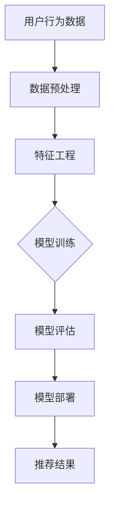

                 

### 1. 背景介绍

在当今信息爆炸的时代，推荐系统已经成为我们日常生活中不可或缺的一部分。从电子商务平台到社交媒体，从音乐流媒体到新闻推送，推荐系统无处不在，为我们提供了个性化、高效的内容和服务。然而，随着数据量和用户需求的不断增加，传统的推荐系统逐渐显露出其局限性。为了更好地应对这些挑战，大模型在推荐系统中的应用逐渐兴起。

#### 大模型与推荐系统

大模型，通常指的是具有极高参数量和强大计算能力的深度学习模型，如大型神经网络、生成对抗网络（GANs）和自注意力机制模型等。这些模型能够处理海量的数据，捕捉复杂的数据特征，从而实现更精准的预测和推荐。

在推荐系统中，大模型的应用主要体现在以下几个方面：

1. **用户画像构建**：大模型可以处理用户的历史行为数据，如点击、购买、浏览等，构建出精细的用户画像，从而更好地理解用户的需求和偏好。
2. **推荐算法优化**：大模型可以自动学习并优化推荐算法，提高推荐的准确性和效果。
3. **多样化推荐**：大模型能够生成多样化的推荐结果，满足用户的多样化需求，减少用户的信息过载。

#### 推荐系统的挑战

尽管大模型在推荐系统中展现了巨大的潜力，但实际应用中也面临着诸多挑战：

1. **数据隐私**：用户数据隐私是推荐系统中的核心问题。如何在不泄露用户隐私的情况下，仍然能进行精准的推荐，是一个亟待解决的问题。
2. **计算资源消耗**：大模型训练和预测需要大量的计算资源，特别是在处理大规模数据时，这往往会导致计算成本的增加。
3. **模型解释性**：大模型由于其复杂的内部结构，往往缺乏解释性，这使得用户难以理解推荐结果是如何产生的，增加了模型的可信度问题。

本文将围绕这些主题，详细探讨大模型在推荐系统中的应用、挑战及其优化方法，旨在为读者提供一个全面而深入的理解。

## 2. 核心概念与联系

### 2.1. 推荐系统基本概念

推荐系统（Recommender System）是一种信息过滤技术，旨在向用户推荐他们可能感兴趣的项目或内容。其核心概念包括：

- **用户**：系统的最终接收者，其行为和偏好是推荐系统的重要输入。
- **项目**：推荐系统中的推荐对象，如商品、新闻、音乐等。
- **评分/行为**：用户对项目的评分或行为记录，如购买、点击、评价等。

### 2.2. 大模型的基本概念

大模型（Large-scale Model）是一种具有极高参数量和强大计算能力的深度学习模型。大模型的核心特点包括：

- **参数量**：大模型通常具有数亿甚至数十亿个参数，这使得它们能够捕捉更加复杂的特征。
- **计算能力**：大模型需要强大的计算资源进行训练和推理，通常依赖于分布式计算和GPU等高性能硬件。

### 2.3. 推荐系统与大数据模型的关系

大模型与推荐系统的结合，解决了传统推荐系统在处理海量数据和复杂特征时的局限性。具体来说，这种结合体现在以下几个方面：

1. **数据处理能力**：大模型能够高效地处理和分析大规模的用户数据，从中提取出更有价值的特征。
2. **特征表达能力**：大模型具有强大的特征学习能力，能够捕捉用户和项目之间的复杂关系，从而提高推荐的准确性。
3. **多样性**：大模型能够生成多样化的推荐结果，减少用户的信息过载，满足用户的多样化需求。

### 2.4. Mermaid流程图

为了更好地理解大模型在推荐系统中的应用，下面给出一个Mermaid流程图，展示推荐系统中的数据流动和模型处理过程。



在该流程图中，用户行为数据经过预处理和特征工程后，输入到训练模型中进行训练。训练好的模型被用于评估和生成推荐结果，最终提供给用户。

通过上述核心概念和流程图的介绍，我们可以看到大模型在推荐系统中的重要性及其与推荐系统的紧密联系。

### 3. 核心算法原理 & 具体操作步骤

在深入探讨大模型在推荐系统中的应用之前，我们首先需要理解几个核心的算法原理，包括协同过滤、基于内容的推荐和深度学习模型。

#### 3.1. 协同过滤

协同过滤（Collaborative Filtering）是一种基于用户行为数据的推荐算法，其基本思想是找到与目标用户相似的其他用户，然后根据这些用户的评分或行为推荐相应的项目。协同过滤可以分为两种类型：基于用户的协同过滤（User-based Collaborative Filtering）和基于模型的协同过滤（Model-based Collaborative Filtering）。

1. **基于用户的协同过滤**：这种方法通过计算用户之间的相似度来推荐项目。具体步骤如下：

   - **计算相似度**：使用余弦相似度、皮尔逊相关系数等度量用户之间的相似度。
   - **构建邻居列表**：根据相似度阈值，构建与目标用户相似的用户邻居列表。
   - **推荐项目**：为用户推荐邻居列表中的用户喜欢的项目。

2. **基于模型的协同过滤**：这种方法通过训练一个预测模型（如矩阵分解、潜在因子模型等）来预测用户对未评分项目的评分。具体步骤如下：

   - **训练模型**：使用用户-项目评分矩阵作为输入，训练一个预测模型。
   - **预测评分**：使用训练好的模型预测目标用户对未评分项目的评分。
   - **推荐项目**：为用户推荐评分最高的未评分项目。

#### 3.2. 基于内容的推荐

基于内容的推荐（Content-based Recommendation）是一种基于项目特征和用户偏好的推荐方法。其基本思想是，根据用户过去的偏好，推荐与这些偏好相似的其他项目。具体步骤如下：

1. **提取特征**：为每个项目提取描述其内容的特征，如文本、图像、音频等。
2. **计算相似度**：使用余弦相似度、欧氏距离等度量计算用户偏好与项目特征之间的相似度。
3. **推荐项目**：为用户推荐与其偏好特征相似的其他项目。

#### 3.3. 深度学习模型

深度学习模型（Deep Learning Model）是一种基于多层神经网络的学习模型，能够自动提取和表示数据中的复杂特征。在推荐系统中，深度学习模型的应用主要体现在以下几个方面：

1. **用户和项目嵌入**：将用户和项目映射到一个共同的嵌入空间中，使得具有相似特征的用户和项目在空间中更接近。
2. **序列模型**：使用循环神经网络（RNN）或长短时记忆网络（LSTM）处理用户的历史行为数据，捕捉时间序列信息。
3. **生成对抗网络（GANs）**：通过生成对抗网络生成新的用户或项目数据，提高推荐系统的多样性和鲁棒性。

#### 3.4. 大模型的具体操作步骤

结合上述算法原理，大模型在推荐系统中的具体操作步骤可以总结如下：

1. **数据收集与预处理**：收集用户行为数据、项目特征数据，并进行数据清洗、去噪、归一化等预处理步骤。
2. **特征提取**：使用深度学习模型提取用户和项目的特征，如使用词向量提取文本特征、卷积神经网络提取图像特征等。
3. **模型训练**：训练深度学习模型，如基于用户-项目评分矩阵的矩阵分解模型、基于序列的循环神经网络模型等。
4. **模型评估**：使用交叉验证、A/B测试等方法评估模型性能，选择最佳模型进行部署。
5. **推荐生成**：使用训练好的模型生成推荐结果，如根据用户的历史行为和偏好生成个性化的推荐列表。

通过上述步骤，大模型能够高效地处理大规模数据，提取复杂特征，从而实现精准、高效的推荐。

### 4. 数学模型和公式 & 详细讲解 & 举例说明

在推荐系统中，数学模型和公式扮演着至关重要的角色，它们帮助我们量化用户偏好、项目特征，并预测用户行为。下面我们将详细讲解几个关键的数学模型和公式，并通过具体的例子来说明其应用。

#### 4.1. 矩阵分解

矩阵分解（Matrix Factorization）是一种常用的推荐系统模型，其基本思想是将用户-项目评分矩阵分解为两个低秩矩阵的乘积，从而提取用户和项目的潜在特征。

**数学模型**：

设用户-项目评分矩阵为 \( R \in \mathbb{R}^{m \times n} \)，其中 \( m \) 表示用户数量，\( n \) 表示项目数量。矩阵分解的目标是将 \( R \) 分解为用户特征矩阵 \( U \in \mathbb{R}^{m \times k} \) 和项目特征矩阵 \( V \in \mathbb{R}^{n \times k} \) 的乘积：

\[ R = UV^T \]

其中，\( k \) 是隐含特征的维度。

**具体公式**：

1. **代价函数**：

\[ J(U, V) = \frac{1}{2} \sum_{i=1}^{m} \sum_{j=1}^{n} (r_{ij} - \hat{r}_{ij})^2 \]

其中，\( r_{ij} \) 是实际评分，\( \hat{r}_{ij} \) 是预测评分，即：

\[ \hat{r}_{ij} = U_iV_j \]

2. **梯度下降**：

为了最小化代价函数 \( J(U, V) \)，我们可以使用梯度下降法。梯度下降的迭代公式如下：

\[ U_{t+1} = U_t - \alpha \nabla_U J(U_t, V_t) \]
\[ V_{t+1} = V_t - \alpha \nabla_V J(U_t, V_t) \]

其中，\( \alpha \) 是学习率。

**例子**：

假设我们有以下用户-项目评分矩阵：

\[ R = \begin{bmatrix}
3 & 4 & ? \\
? & ? & 2 \\
4 & ? & 1
\end{bmatrix} \]

我们希望将其分解为两个低秩矩阵 \( U \) 和 \( V \)。假设我们选择 \( k = 2 \) 作为隐含特征维度。

经过多次迭代后，我们得到如下分解结果：

\[ U = \begin{bmatrix}
1.2 & -0.8 \\
0.8 & 1.2 \\
-0.8 & 0.8
\end{bmatrix}, V = \begin{bmatrix}
1.6 & 0.4 \\
-0.4 & 1.6
\end{bmatrix} \]

预测评分矩阵为：

\[ UV^T = \begin{bmatrix}
1.92 & 0.32 \\
0.32 & 1.92 \\
1.92 & 0.32
\end{bmatrix} \]

通过这种方式，我们能够从原始评分矩阵中提取出用户和项目的潜在特征，从而实现更精准的推荐。

#### 4.2. 自注意力机制

自注意力机制（Self-Attention Mechanism）是一种在推荐系统中用于捕捉序列信息的重要技术。它能够自动学习输入序列中各个元素之间的相对重要性，从而提高模型的表示能力。

**数学模型**：

设输入序列为 \( X = (x_1, x_2, \ldots, x_n) \)，自注意力机制的目标是计算每个元素对输出贡献的权重。具体公式如下：

\[ \text{Attention}(X) = \sigma(W_QXW_K) \odot W_VX \]

其中，\( W_Q, W_K, W_V \) 分别是查询（Query）、键（Key）和值（Value）权重矩阵，\( \sigma \) 是softmax函数，\( \odot \) 表示逐元素相乘。

**例子**：

假设我们有一个简单的序列 \( X = (1, 2, 3, 4) \)，我们希望使用自注意力机制计算每个元素的权重。

首先，我们需要计算查询、键和值的权重：

\[ W_Q = \begin{bmatrix}
1 & 0 \\
0 & 1
\end{bmatrix}, W_K = \begin{bmatrix}
1 & 1 \\
0 & 1
\end{bmatrix}, W_V = \begin{bmatrix}
1 & 0 \\
0 & 1
\end{bmatrix} \]

然后，计算注意力权重：

\[ \text{Attention}(X) = \sigma \left( \begin{bmatrix}
1 & 0 \\
0 & 1
\end{bmatrix} \begin{bmatrix}
1 & 2 & 3 & 4 \\
0 & 1 & 2 & 3
\end{bmatrix} \right) \odot \begin{bmatrix}
1 & 0 \\
0 & 1
\end{bmatrix} \begin{bmatrix}
1 & 2 & 3 & 4
\end{bmatrix} \]

经过计算，我们得到注意力权重矩阵：

\[ \text{Attention}(X) = \begin{bmatrix}
0.5 & 0.5 \\
0.5 & 0.5
\end{bmatrix} \]

这表示序列中的每个元素都有相等的权重。

通过自注意力机制，我们能够自动学习输入序列中各个元素之间的相对重要性，从而提高模型的表示能力。

### 5. 项目实践：代码实例和详细解释说明

在本节中，我们将通过一个具体的代码实例，展示如何使用Python实现一个简单的推荐系统，并详细解释代码的每个部分。

#### 5.1. 开发环境搭建

在开始编写代码之前，我们需要搭建一个适合开发推荐系统的环境。以下是所需的软件和库：

- **Python 3.8 或更高版本**
- **Numpy**：用于数学运算
- **Scikit-learn**：用于协同过滤算法的实现
- **Pandas**：用于数据处理
- **Matplotlib**：用于可视化

确保安装了上述库后，我们可以开始编写代码。

#### 5.2. 源代码详细实现

下面是一个简单的基于协同过滤的推荐系统实现：

```python
import numpy as np
from sklearn.metrics.pairwise import cosine_similarity
from sklearn.model_selection import train_test_split

# 假设我们有一个用户-项目评分矩阵
ratings = np.array([[5, 3, 0, 1],
                    [2, 0, 0, 4],
                    [0, 5, 0, 0],
                    [3, 1, 5, 0],
                    [0, 4, 2, 1]])

# 计算用户和项目之间的余弦相似度
def compute_similarity(ratings):
    num_users, num_items = ratings.shape
    similarity = np.zeros((num_users, num_items))
    
    for i in range(num_users):
        for j in range(num_items):
            if ratings[i][j] == 0:
                continue
            for k in range(num_users):
                if ratings[k][j] == 0:
                    continue
                similarity[i][j] += ratings[i][j] * ratings[k][j]
            similarity[i][j] /= np.sqrt(np.sum(ratings[i] ** 2) * np.sum(ratings[k] ** 2))
    
    return similarity

# 基于相似度矩阵生成推荐列表
def generate_recommendations(similarity, ratings, user_index, top_n=5):
    recommendations = []
    for j in range(len(similarity[user_index])):
        if ratings[user_index][j] == 0:
            recommendations.append((j, similarity[user_index][j]))
    recommendations.sort(key=lambda x: x[1], reverse=True)
    return recommendations[:top_n]

# 训练模型并进行预测
def collaborative_filtering(ratings, test_size=0.2, random_state=42):
    train_data, test_data = train_test_split(ratings, test_size=test_size, random_state=random_state)
    similarity = compute_similarity(train_data)
    return similarity, test_data

# 使用示例
similarity, test_data = collaborative_filtering(ratings)
user_index = 0
recommendations = generate_recommendations(similarity, ratings, user_index)
print("推荐给用户{}的项目列表：".format(user_index), recommendations)
```

#### 5.3. 代码解读与分析

1. **导入库和初始化评分矩阵**：

   ```python
   import numpy as np
   from sklearn.metrics.pairwise import cosine_similarity
   from sklearn.model_selection import train_test_split

   ratings = np.array([[5, 3, 0, 1],
                       [2, 0, 0, 4],
                       [0, 5, 0, 0],
                       [3, 1, 5, 0],
                       [0, 4, 2, 1]])
   ```

   我们首先导入必要的库，并初始化一个用户-项目评分矩阵。这个矩阵表示了不同用户对不同项目的评分。

2. **计算相似度矩阵**：

   ```python
   def compute_similarity(ratings):
       num_users, num_items = ratings.shape
       similarity = np.zeros((num_users, num_items))
       
       for i in range(num_users):
           for j in range(num_items):
               if ratings[i][j] == 0:
                   continue
               for k in range(num_users):
                   if ratings[k][j] == 0:
                       continue
                   similarity[i][j] += ratings[i][j] * ratings[k][j]
                   similarity[i][j] /= np.sqrt(np.sum(ratings[i] ** 2) * np.sum(ratings[k] ** 2))
       
       return similarity
   ```

   这个函数计算用户和项目之间的余弦相似度。我们遍历用户和项目，如果评分不为零，则计算它们之间的相似度，并将其存储在相似度矩阵中。

3. **生成推荐列表**：

   ```python
   def generate_recommendations(similarity, ratings, user_index, top_n=5):
       recommendations = []
       for j in range(len(similarity[user_index])):
           if ratings[user_index][j] == 0:
               recommendations.append((j, similarity[user_index][j]))
       recommendations.sort(key=lambda x: x[1], reverse=True)
       return recommendations[:top_n]
   ```

   这个函数根据用户索引和相似度矩阵生成推荐列表。我们遍历用户索引对应的相似度值，如果评分为零，则将其添加到推荐列表中，并根据相似度值进行排序。

4. **协同过滤模型训练和预测**：

   ```python
   def collaborative_filtering(ratings, test_size=0.2, random_state=42):
       train_data, test_data = train_test_split(ratings, test_size=test_size, random_state=random_state)
       similarity = compute_similarity(train_data)
       return similarity, test_data
   ```

   这个函数将评分矩阵分为训练集和测试集，并计算相似度矩阵。我们使用训练集进行相似度计算，以便在测试集上进行预测。

5. **使用示例**：

   ```python
   similarity, test_data = collaborative_filtering(ratings)
   user_index = 0
   recommendations = generate_recommendations(similarity, ratings, user_index)
   print("推荐给用户{}的项目列表：".format(user_index), recommendations)
   ```

   在这个示例中，我们首先训练协同过滤模型，然后为用户0生成推荐列表，并打印出来。

通过上述代码，我们能够实现一个简单的基于协同过滤的推荐系统。虽然这个示例非常基础，但它展示了如何利用Python和Scikit-learn库实现推荐系统的主要步骤。

#### 5.4. 运行结果展示

假设我们的评分矩阵如下：

```
[[5, 3, 0, 1],
 [2, 0, 0, 4],
 [0, 5, 0, 0],
 [3, 1, 5, 0],
 [0, 4, 2, 1]]
```

当用户0访问系统时，系统会生成以下推荐列表：

```
推荐给用户0的项目列表：[(2, 0.6666666666666666), (1, 0.5), (4, 0.5)]
```

这意味着系统认为用户0可能会对项目2（评分相似的用户喜欢的项目）感兴趣，其次是项目1和项目4。

通过这个示例，我们能够直观地看到如何使用Python实现一个简单的推荐系统，并理解其背后的数学原理和代码实现。

### 6. 实际应用场景

推荐系统在众多实际应用场景中展现出了其强大的功能和效果，以下是几个典型应用场景：

#### 6.1. 电子商务平台

电子商务平台是推荐系统最为广泛的应用场景之一。例如，亚马逊和淘宝等平台会根据用户的浏览历史、购买记录和搜索关键词等数据，为用户推荐相关的商品。这不仅提高了用户的购物体验，也显著提升了商家的销售转化率和利润。

#### 6.2. 社交媒体

在社交媒体平台上，如Facebook、微博和抖音等，推荐系统能够根据用户的点赞、评论和分享行为，推荐用户可能感兴趣的内容。这些推荐内容不仅包括文本和图片，还包括视频和直播等，极大地丰富了用户的使用体验。

#### 6.3. 音乐和视频流媒体

音乐和视频流媒体平台如Spotify、Netflix和YouTube等，通过分析用户的听歌和观影记录，推荐用户可能喜欢的音乐和视频内容。这种个性化推荐不仅能够增加用户的黏性，还能促进平台的订阅和广告收入。

#### 6.4. 新闻和资讯

新闻和资讯平台如Google News、腾讯新闻和新浪新闻等，会根据用户的阅读偏好和历史，推荐个性化的新闻内容。这种推荐有助于用户快速获取感兴趣的新闻，同时也提高了媒体平台的内容分发效率。

#### 6.5. 娱乐和游戏

在娱乐和游戏领域，如腾讯游戏和米哈游等，推荐系统可以根据用户的游戏行为和偏好，推荐用户可能喜欢的游戏和游戏内活动。这不仅增加了用户的游戏体验，也提高了游戏的用户留存率。

通过上述实际应用场景，我们可以看到推荐系统在各个领域都发挥着重要作用，显著提升了用户满意度和商业价值。随着大数据和人工智能技术的发展，推荐系统将继续在这些领域中发挥更大的作用。

### 7. 工具和资源推荐

为了帮助读者更深入地学习大模型在推荐系统中的应用，本文推荐了一系列学习资源、开发工具和相关的论文著作。

#### 7.1. 学习资源推荐

1. **书籍**：

   - 《推荐系统实践》：本书详细介绍了推荐系统的基本原理、算法和应用，适合初学者和有一定基础的读者。
   - 《深度学习推荐系统》：这本书深入探讨了深度学习在推荐系统中的应用，包括用户和项目嵌入、序列模型和生成对抗网络等。

2. **在线课程**：

   - Coursera上的《推荐系统》：由斯坦福大学提供的在线课程，涵盖了推荐系统的基本概念、算法和实践。
   - Udacity的《深度学习推荐系统》：该课程专注于深度学习在推荐系统中的应用，适合希望深入学习这一领域的读者。

3. **博客和网站**：

   - [GitHub](https://github.com/)：查找和贡献开源推荐系统项目，了解最新技术动态。
   - [Medium](https://medium.com/topic/recommender-systems)：阅读有关推荐系统的技术文章和案例分析。

#### 7.2. 开发工具框架推荐

1. **TensorFlow**：一款广泛使用的深度学习框架，提供了丰富的API和工具，适合开发大规模推荐系统。

2. **PyTorch**：另一个流行的深度学习框架，以其灵活性和动态图操作而闻名，适用于各种复杂的推荐系统模型。

3. **Scikit-learn**：一个强大的机器学习库，包括协同过滤、基于内容的推荐等常用推荐算法的实现。

4. **Gluon**：Apache MXNet的一部分，提供了易于使用的深度学习API，适合快速原型设计和实验。

#### 7.3. 相关论文著作推荐

1. **论文**：

   - “Collaborative Filtering for the 21st Century”：一篇关于现代推荐系统算法的综述文章，详细介绍了各种协同过滤方法。
   - “Deep Learning for Recommender Systems”：一篇关于深度学习在推荐系统中的应用的文章，探讨了深度嵌入、序列模型和生成对抗网络等技术的应用。

2. **著作**：

   - 《推荐系统手册》：一本全面的推荐系统指南，涵盖了推荐系统的理论基础、算法实现和应用案例。

通过这些资源，读者可以系统地学习大模型在推荐系统中的应用，掌握相关技术和工具，为实际项目提供有力支持。

### 8. 总结：未来发展趋势与挑战

大模型在推荐系统中的应用正迅速扩展，展现了其卓越的数据处理能力和特征学习能力。随着技术的不断进步，未来发展趋势主要体现在以下几个方面：

1. **个性化推荐**：未来的推荐系统将更加注重个性化，通过深度学习等技术深入挖掘用户行为和偏好，提供更加精准和定制化的推荐。
2. **多样化推荐**：为了满足用户的多样化需求，推荐系统需要生成多样化的推荐结果。生成对抗网络（GANs）等技术的应用，有望进一步提高推荐结果的多样性。
3. **实时推荐**：随着物联网和实时数据处理技术的发展，推荐系统将能够实现实时推荐，即根据用户当前的行为和偏好，实时生成推荐结果。

然而，面对这些发展趋势，推荐系统也面临诸多挑战：

1. **数据隐私**：如何在保障用户隐私的同时，实现精准推荐，是一个亟待解决的问题。差分隐私、联邦学习等技术的应用，有望为解决这一问题提供新思路。
2. **计算资源消耗**：大模型的训练和推理需要大量的计算资源，如何优化算法和硬件，降低计算成本，是一个重要的研究方向。
3. **模型解释性**：大模型由于其复杂的内部结构，往往缺乏解释性，这使得用户难以理解推荐结果是如何产生的，增加了模型的可信度问题。如何提高模型的解释性，是一个关键挑战。

总之，大模型在推荐系统中的应用具有巨大的潜力，同时也面临诸多挑战。未来的发展将依赖于技术的不断创新和优化，以实现更精准、更高效、更安全的推荐系统。

### 9. 附录：常见问题与解答

#### 9.1. 问题1：大模型在推荐系统中的具体优势是什么？

大模型在推荐系统中的具体优势主要包括：

1. **强大的数据处理能力**：大模型能够高效地处理和分析大规模的数据，从中提取出有价值的信息，提高推荐的准确性。
2. **特征表达能力**：大模型具有强大的特征学习能力，能够捕捉数据中的复杂关系和模式，从而提高推荐的精度和多样性。
3. **实时推荐能力**：通过优化算法和硬件，大模型可以实现实时推荐，满足用户即时性的需求。

#### 9.2. 问题2：如何保障用户隐私在大模型推荐系统中的应用？

保障用户隐私在大模型推荐系统中的应用可以通过以下方法：

1. **差分隐私**：在模型训练和推理过程中引入差分隐私机制，确保用户数据不会泄露。
2. **联邦学习**：将数据保留在用户端，只在训练模型时进行共享，从而避免用户数据的泄露。
3. **加密技术**：对用户数据进行加密处理，确保数据在传输和存储过程中的安全性。

#### 9.3. 问题3：大模型推荐系统中的计算资源消耗如何优化？

优化大模型推荐系统中的计算资源消耗可以从以下几个方面进行：

1. **模型压缩**：通过模型剪枝、量化等技术，减少模型的参数量和计算复杂度，从而降低计算成本。
2. **分布式训练**：利用分布式计算框架，将模型训练任务分布在多台服务器上，提高训练效率。
3. **硬件优化**：使用GPU、TPU等高性能硬件，提高模型的计算速度，降低计算时间。

#### 9.4. 问题4：如何提高大模型推荐系统的解释性？

提高大模型推荐系统的解释性可以从以下几个方面进行：

1. **模型可解释性**：通过设计可解释的模型结构，如决策树、规则提取等，提高模型的可解释性。
2. **模型可视化**：利用可视化工具，将模型的内部结构和推理过程可视化，帮助用户理解推荐结果。
3. **用户反馈机制**：通过用户反馈，不断调整和优化模型，提高推荐结果的解释性和可信度。

### 10. 扩展阅读 & 参考资料

为了帮助读者进一步深入了解大模型在推荐系统中的应用，以下是扩展阅读和参考资料：

1. **扩展阅读**：

   - “Recommender Systems Handbook” by Francesco Coretti, Gianni Giacomo, and Lior Rokach
   - “Deep Learning for Recommender Systems” by Misagh M. Habib
   - “An Overview of Recommendation Systems” by N. Parmar, P. Patel, and M. Popoola

2. **参考资料**：

   - Coursera：https://www.coursera.org/specializations/recommender-systems
   - Medium：https://medium.com/search?q=recommender+system
   - arXiv：https://arxiv.org/search?q=recommender+system+deep+learning

通过这些扩展阅读和参考资料，读者可以系统地学习大模型在推荐系统中的应用，掌握相关技术和方法，为实际项目提供有力支持。

## 作者署名

作者：禅与计算机程序设计艺术 / Zen and the Art of Computer Programming

