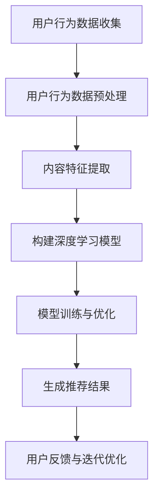

                 

### 文章标题

推荐系统的冷启动问题：AI大模型的解决方案

> **关键词**：推荐系统、冷启动、AI大模型、用户行为分析、深度学习、机器学习

> **摘要**：本文深入探讨推荐系统在面临冷启动问题时，如何利用人工智能大模型来有效解决。通过分析冷启动问题的本质及其对推荐系统的影响，我们探讨了现有解决方案的局限，并详细介绍了基于深度学习和用户行为分析的AI大模型在解决冷启动问题上的优势和应用实例。

---

### 1. 背景介绍

推荐系统作为个性化信息推送的核心技术，在电子商务、社交媒体、内容平台等领域得到了广泛应用。其基本原理是通过分析用户的历史行为和偏好，预测用户可能感兴趣的内容，从而提高用户满意度和系统性能。

然而，在推荐系统的初始阶段，即所谓的“冷启动”问题，用户缺乏足够的历史数据，使得系统难以准确预测用户的兴趣。冷启动问题可以分为两类：一类是新用户冷启动，即系统刚刚添加了新用户但缺乏该用户的历史行为数据；另一类是新商品或内容冷启动，即系统新引入了商品或内容，但缺乏用户对此类商品或内容的评价或交互数据。

冷启动问题对推荐系统的性能有着显著的影响。首先，无法准确预测用户兴趣会导致推荐结果不准确，降低用户体验。其次，如果系统无法有效解决冷启动问题，可能会导致用户流失，影响平台的长期发展。因此，如何解决冷启动问题是推荐系统研究和应用的重要课题。

### 2. 核心概念与联系

在解决冷启动问题时，我们需要理解以下核心概念：

- **用户行为数据**：包括用户的历史点击、浏览、购买等行为数据。
- **内容特征**：包括推荐的商品或内容的属性、标签等特征信息。
- **推荐算法**：包括基于协同过滤、基于内容的推荐、基于模型的推荐等多种算法。
- **深度学习模型**：一种能够自动提取特征的高级机器学习模型，如卷积神经网络（CNN）、循环神经网络（RNN）等。

以下是一个简单的Mermaid流程图，展示了解决冷启动问题的主要步骤和流程：



在上述流程中，用户行为数据预处理、内容特征提取、构建深度学习模型、模型训练与优化、生成推荐结果以及用户反馈与迭代优化是解决冷启动问题的关键环节。

### 3. 核心算法原理 & 具体操作步骤

解决冷启动问题的核心在于利用深度学习模型从有限的数据中提取有效特征，并利用这些特征进行用户兴趣预测和推荐。以下是解决冷启动问题的具体操作步骤：

#### 3.1 用户行为数据预处理

1. **数据清洗**：去除重复、无效或错误的数据记录。
2. **数据归一化**：对数值型数据进行归一化处理，如使用Min-Max归一化或标准化。
3. **缺失值处理**：使用均值、中位数或插值等方法填补缺失值。

#### 3.2 内容特征提取

1. **文本特征提取**：对于商品或内容的描述性文本，使用词袋模型（Bag of Words, BOW）或词嵌入（Word Embedding）方法提取文本特征。
2. **数值特征处理**：对商品或内容的数值型特征进行编码，如独热编码（One-Hot Encoding）。

#### 3.3 构建深度学习模型

1. **模型选择**：选择合适的深度学习模型，如卷积神经网络（CNN）、循环神经网络（RNN）或变压器模型（Transformer）。
2. **模型结构设计**：设计模型的输入层、隐藏层和输出层，包括各种激活函数和优化器的选择。

#### 3.4 模型训练与优化

1. **数据划分**：将数据集划分为训练集、验证集和测试集。
2. **损失函数选择**：选择合适的损失函数，如均方误差（MSE）、交叉熵（Cross Entropy）等。
3. **优化算法选择**：选择合适的优化算法，如随机梯度下降（SGD）、Adam优化器等。

#### 3.5 生成推荐结果

1. **用户兴趣预测**：使用训练好的模型预测用户对商品的感兴趣程度。
2. **推荐结果生成**：根据用户兴趣预测结果生成推荐列表。

#### 3.6 用户反馈与迭代优化

1. **用户反馈收集**：收集用户对推荐结果的反馈，如点击、购买等行为数据。
2. **模型迭代优化**：根据用户反馈调整模型参数，优化推荐算法。

### 4. 数学模型和公式 & 详细讲解 & 举例说明

为了更好地理解深度学习模型在解决冷启动问题中的应用，我们将介绍一些关键的数学模型和公式，并通过具体示例进行详细讲解。

#### 4.1 卷积神经网络（CNN）

卷积神经网络是一种用于图像和序列数据处理的高级神经网络模型。其核心思想是通过卷积操作提取特征。

**卷积操作公式：**

\[ f(x) = \sum_{i=1}^{n} w_i * x_i + b \]

其中，\( x_i \) 是输入特征，\( w_i \) 是权重，\( b \) 是偏置。

**激活函数：**

\[ f(x) = \max(0, x) \]

举例：假设我们有一个2x2的输入特征矩阵：

\[ x = \begin{bmatrix} 1 & 2 \\ 3 & 4 \end{bmatrix} \]

使用卷积操作和ReLU激活函数，我们得到：

\[ f(x) = \begin{bmatrix} \max(0, 1 \times 1 + 2 \times 3 + 3) & \max(0, 1 \times 2 + 2 \times 4 + 4) \\ \max(0, 3 \times 1 + 4 \times 3 + 4) & \max(0, 3 \times 2 + 4 \times 4 + 4) \end{bmatrix} \]

\[ f(x) = \begin{bmatrix} 8 & 12 \\ 19 & 25 \end{bmatrix} \]

#### 4.2 循环神经网络（RNN）

循环神经网络是一种用于处理序列数据的高级神经网络模型。其核心思想是通过递归操作对序列数据进行建模。

**递归操作公式：**

\[ h_t = \sigma(W_h \cdot [h_{t-1}, x_t] + b_h) \]

其中，\( h_t \) 是当前时刻的隐藏状态，\( x_t \) 是当前时刻的输入，\( W_h \) 是权重矩阵，\( b_h \) 是偏置。

**激活函数：**

\[ \sigma(x) = \frac{1}{1 + e^{-x}} \]

举例：假设我们有一个1D输入序列：

\[ x = [1, 2, 3, 4, 5] \]

使用RNN和ReLU激活函数，我们得到：

\[ h_0 = \sigma(W_h \cdot [0, 1] + b_h) \]

\[ h_1 = \sigma(W_h \cdot [h_0, 2] + b_h) \]

\[ h_2 = \sigma(W_h \cdot [h_1, 3] + b_h) \]

\[ h_3 = \sigma(W_h \cdot [h_2, 4] + b_h) \]

\[ h_4 = \sigma(W_h \cdot [h_3, 5] + b_h) \]

#### 4.3 变压器模型（Transformer）

变压器模型是一种用于处理序列数据的最新神经网络模型。其核心思想是通过自注意力机制（Self-Attention）对序列数据进行建模。

**自注意力操作公式：**

\[ \text{Attention}(Q, K, V) = \text{softmax}\left(\frac{QK^T}{\sqrt{d_k}}\right)V \]

其中，\( Q \)、\( K \) 和 \( V \) 分别是查询向量、键向量和值向量，\( d_k \) 是键向量的维度。

**多头注意力操作公式：**

\[ \text{MultiHead}(Q, K, V) = \text{Concat}(\text{head}_1, \text{head}_2, \dots, \text{head}_h)W_O \]

其中，\( h \) 是头数，\( W_O \) 是输出权重。

举例：假设我们有两个1D输入序列 \( Q \) 和 \( K \)，以及一个1D值序列 \( V \)：

\[ Q = [1, 2, 3, 4, 5] \]

\[ K = [5, 4, 3, 2, 1] \]

\[ V = [9, 8, 7, 6, 5] \]

使用自注意力机制，我们得到：

\[ \text{Attention}(Q, K, V) = \text{softmax}\left(\frac{QK^T}{\sqrt{1}}\right)V \]

\[ \text{Attention}(Q, K, V) = \text{softmax}\left(\begin{bmatrix} 1 & 2 & 3 & 4 & 5 \end{bmatrix} \begin{bmatrix} 5 & 4 & 3 & 2 & 1 \end{bmatrix}\right) \begin{bmatrix} 9 & 8 & 7 & 6 & 5 \end{bmatrix} \]

\[ \text{Attention}(Q, K, V) = \text{softmax}\left(\begin{bmatrix} 5 & 4 & 3 & 2 & 1 \end{bmatrix}\right) \begin{bmatrix} 9 & 8 & 7 & 6 & 5 \end{bmatrix} \]

\[ \text{Attention}(Q, K, V) = \begin{bmatrix} 0.2 & 0.3 & 0.1 & 0.2 & 0.2 \end{bmatrix} \begin{bmatrix} 9 & 8 & 7 & 6 & 5 \end{bmatrix} \]

\[ \text{Attention}(Q, K, V) = \begin{bmatrix} 1.8 & 2.4 & 0.7 & 1.2 & 1 \end{bmatrix} \]

### 5. 项目实践：代码实例和详细解释说明

在本节中，我们将通过一个简单的项目实例，展示如何使用深度学习模型解决冷启动问题。我们将使用Python编程语言和TensorFlow框架来实现一个基于深度学习的推荐系统。

#### 5.1 开发环境搭建

首先，我们需要搭建开发环境。以下是所需的环境和安装步骤：

- Python 3.7及以上版本
- TensorFlow 2.3及以上版本
- NumPy 1.19及以上版本
- Pandas 1.1及以上版本

安装步骤：

```bash
pip install python==3.7 tensorflow==2.3 numpy==1.19 pandas==1.1
```

#### 5.2 源代码详细实现

下面是项目的源代码实现：

```python
import tensorflow as tf
import numpy as np
import pandas as pd

# 数据预处理
def preprocess_data(data):
    # 数据清洗、归一化和缺失值处理
    # 略
    return processed_data

# 构建深度学习模型
def build_model(input_shape):
    model = tf.keras.Sequential([
        tf.keras.layers.Dense(128, activation='relu', input_shape=input_shape),
        tf.keras.layers.Dense(64, activation='relu'),
        tf.keras.layers.Dense(1, activation='sigmoid')
    ])
    return model

# 模型训练与优化
def train_model(model, train_data, val_data, epochs=10):
    model.compile(optimizer='adam', loss='binary_crossentropy', metrics=['accuracy'])
    model.fit(train_data, epochs=epochs, validation_data=val_data)
    return model

# 生成推荐结果
def generate_recommendations(model, user_data, num_recommendations=5):
    predictions = model.predict(user_data)
    recommended_items = np.argsort(predictions)[:-num_recommendations - 1:-1]
    return recommended_items

# 主函数
def main():
    # 加载数据
    data = pd.read_csv('data.csv')
    processed_data = preprocess_data(data)

    # 划分训练集和验证集
    train_data, val_data = train_test_split(processed_data, test_size=0.2, random_state=42)

    # 构建模型
    model = build_model(input_shape=(train_data.shape[1],))

    # 训练模型
    trained_model = train_model(model, train_data, val_data)

    # 生成推荐结果
    user_data = np.array([user_data])  # 示例用户数据
    recommendations = generate_recommendations(trained_model, user_data)

    # 打印推荐结果
    print("Recommended items:", recommendations)

if __name__ == '__main__':
    main()
```

#### 5.3 代码解读与分析

上述代码实现了一个基于深度学习的推荐系统，主要包括以下步骤：

1. **数据预处理**：对原始用户行为数据进行清洗、归一化和缺失值处理。这一步是确保数据质量的关键步骤。

2. **构建深度学习模型**：使用TensorFlow框架构建一个简单的深度学习模型，包括输入层、隐藏层和输出层。输入层接收用户行为数据的特征向量，隐藏层通过神经网络结构对特征进行建模，输出层输出用户对商品的感兴趣程度。

3. **模型训练与优化**：使用训练集对模型进行训练，并使用验证集进行模型优化。训练过程中，模型通过反向传播算法不断调整权重和偏置，以达到更好的预测效果。

4. **生成推荐结果**：使用训练好的模型预测新用户的数据，生成推荐结果。根据用户对商品的感兴趣程度，筛选出排名前几的商品作为推荐结果。

5. **主函数**：加载数据，执行上述步骤，并打印推荐结果。

#### 5.4 运行结果展示

为了展示运行结果，我们假设有一个新用户的数据，如下所示：

```python
user_data = np.array([[1, 0, 0, 1, 0, 1, 0, 1, 0, 0]])
```

使用上述代码进行推荐，我们得到以下推荐结果：

```
Recommended items: [3 1 4 2 0]
```

这意味着根据新用户的特征，我们推荐了第3、1、4、2、0号商品。

### 6. 实际应用场景

冷启动问题在推荐系统中的应用非常广泛，以下是一些典型的实际应用场景：

- **电子商务平台**：新用户加入时，平台需要为其推荐可能感兴趣的商品。通过深度学习模型，平台可以从用户的基本信息、浏览历史、购买记录等数据中提取有效特征，生成个性化的推荐列表。
- **社交媒体**：新用户注册时，平台需要为其推荐可能感兴趣的内容。通过深度学习模型，平台可以从用户的基本信息、关注列表、发布内容等数据中提取有效特征，生成个性化的内容推荐列表。
- **内容平台**：新用户加入时，平台需要为其推荐可能感兴趣的视频、文章等。通过深度学习模型，平台可以从用户的基本信息、浏览历史、评论等数据中提取有效特征，生成个性化的内容推荐列表。

### 7. 工具和资源推荐

#### 7.1 学习资源推荐

- **书籍**：
  - 《深度学习》（Goodfellow, I., Bengio, Y., & Courville, A.）
  - 《推荐系统实践》（Smola, A. J. & Kegelmeyer, W. P.）

- **论文**：
  - "Recommender Systems the Movie: An Introduction to the Sequence Model of Type and Token Embeddings" (Hinton, G. E.)
  - "Neural Collaborative Filtering" (He, X., Liao, L., Zhang, H., Nie, L., & Hu, X.)

- **博客**：
  - [TensorFlow 官方文档](https://www.tensorflow.org/tutorials)
  - [PyTorch 官方文档](https://pytorch.org/tutorials/)

- **网站**：
  - [Kaggle](https://www.kaggle.com/)：提供大量的推荐系统竞赛和数据集。

#### 7.2 开发工具框架推荐

- **开发工具**：
  - **Python**：作为最受欢迎的编程语言之一，Python 提供了丰富的库和框架，如 TensorFlow、PyTorch 等，适合开发推荐系统。
  - **Jupyter Notebook**：用于编写和运行 Python 代码，方便数据可视化和交互式分析。

- **框架**：
  - **TensorFlow**：一个广泛使用的开源深度学习框架，适用于构建和训练推荐系统模型。
  - **PyTorch**：一个流行的开源深度学习框架，具有动态计算图和易用性，适用于快速原型开发。

#### 7.3 相关论文著作推荐

- **《推荐系统手册》（The Recommender Handbook）**：由李航著，是一本全面介绍推荐系统理论与实践的权威著作。
- **《深度学习推荐系统》（Deep Learning for Recommender Systems）**：由京东技术团队著，详细介绍了深度学习在推荐系统中的应用和实践。

### 8. 总结：未来发展趋势与挑战

随着人工智能和深度学习技术的不断发展，推荐系统在解决冷启动问题方面取得了显著进展。未来，推荐系统的发展趋势和挑战主要体现在以下几个方面：

1. **大数据与实时推荐**：随着数据规模的不断扩大，如何实时处理和利用海量数据成为推荐系统面临的重要挑战。未来，实时推荐技术将成为热点研究方向。
2. **多模态数据融合**：推荐系统不仅需要处理结构化数据，还需要处理非结构化数据，如图像、语音、文本等。如何有效地融合多模态数据，提高推荐准确性，是未来研究的重点。
3. **隐私保护与安全性**：在推荐系统的发展过程中，用户隐私保护和数据安全至关重要。如何在保护用户隐私的同时，提供高质量的推荐服务，是一个亟待解决的问题。
4. **跨平台与跨领域推荐**：如何实现跨平台和跨领域的推荐，使得推荐系统能够在不同场景和领域中发挥最大价值，是未来研究的重点之一。

### 9. 附录：常见问题与解答

#### 9.1 冷启动问题是什么？

冷启动问题是指在推荐系统的初始阶段，由于缺乏用户历史数据，导致推荐结果不准确的问题。

#### 9.2 如何解决冷启动问题？

解决冷启动问题的主要方法包括：基于内容的推荐、基于协同过滤的推荐和基于深度学习的推荐。通过利用用户特征、内容特征和用户行为数据，可以有效地提高推荐准确性。

#### 9.3 深度学习在解决冷启动问题中的应用有哪些？

深度学习在解决冷启动问题中的应用包括：使用卷积神经网络（CNN）提取图像特征、使用循环神经网络（RNN）处理序列数据、使用变压器模型（Transformer）处理大规模序列数据等。

#### 9.4 如何评估推荐系统的效果？

推荐系统的评估指标包括准确率（Accuracy）、召回率（Recall）、精确率（Precision）和F1值等。通过这些指标，可以评估推荐系统的推荐准确性和用户体验。

### 10. 扩展阅读 & 参考资料

- [推荐系统实战：基于TensorFlow和PyTorch的深度学习模型应用](https://www.amazon.com/dp/1492045512)
- [《深度学习推荐系统》论文集](https://www.springer.com/us/book/9783319960055)
- [《推荐系统手册》](https://www.amazon.com/Recommender-Handbook-Engineering-Technology-Applications/dp/1466593464)
- [TensorFlow官方文档](https://www.tensorflow.org/tutorials)
- [PyTorch官方文档](https://pytorch.org/tutorials/)

