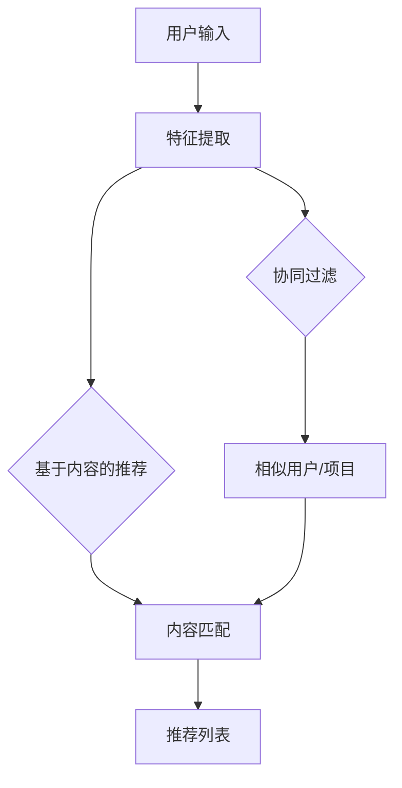

                 

### 背景介绍

推荐系统已经成为现代互联网中不可或缺的一部分，它们广泛应用于电子商务、社交媒体、音乐和视频平台等领域。推荐系统的核心目标是通过分析用户的偏好和历史行为，为用户提供个性化的推荐，从而提高用户的满意度和参与度。然而，尽管推荐系统在过去几十年中取得了显著的进展，但它们仍然面临着诸多挑战，其中过拟合和多样性问题是尤为突出的两个问题。

**过拟合**指的是推荐系统在训练过程中过于关注训练数据，导致模型在训练数据上表现得非常好，但在新数据上表现不佳。这种现象通常是由于模型对训练数据的噪声过于敏感，无法很好地泛化到未见过的数据上。过拟合会导致用户收到大量重复和不感兴趣的内容，从而降低用户体验。

**多样性**是另一个关键问题。一个理想的推荐系统不仅需要准确预测用户的兴趣，还应该提供多样化的内容，避免用户只看到单一类型的信息。缺乏多样性会导致用户感到厌烦，甚至放弃使用推荐系统。

本文将深入探讨推荐系统的过拟合和多样性问题，分析其根本原因，并提出一些可能的解决方案。我们还将结合实际案例和项目实践，展示如何应对这些挑战，为推荐系统的改进提供有益的启示。

### 核心概念与联系

为了深入理解推荐系统中的过拟合和多样性问题，我们需要首先了解一些核心概念和它们之间的联系。

#### 1. 推荐系统的基本原理

推荐系统通常基于两种主要技术：基于内容的推荐（Content-Based Filtering）和协同过滤（Collaborative Filtering）。

- **基于内容的推荐**：这种推荐方法通过分析项目的特征和用户的偏好，找到具有相似特征的项，并将其推荐给用户。例如，如果一个用户喜欢阅读科幻小说，系统可能会推荐其他科幻小说。

- **协同过滤**：这种方法通过分析用户之间的行为模式来推荐项目。协同过滤可以分为两种主要类型：用户基于的协同过滤（User-Based）和物品基于的协同过滤（Item-Based）。用户基于的协同过滤通过找到相似用户并推荐他们喜欢的项目；物品基于的协同过滤则是通过找到相似项目并推荐给用户。

#### 2. 过拟合的概念

过拟合是指模型在训练数据上表现得非常好，但在未见过的新数据上表现不佳。在推荐系统中，过拟合通常发生在以下情况：

- **模型复杂性过高**：如果模型过于复杂，它可能会在训练数据中捕捉到过多的噪声和异常，导致泛化能力不足。
- **数据不充分**：如果训练数据量不足，模型可能会过度关注这些有限的数据，而无法很好地适应新的用户或项目。

#### 3. 多样性的重要性

多样性是指推荐系统能够提供不同类型和风格的内容。多样性的重要性体现在以下几个方面：

- **用户满意度**：多样化的推荐能够满足不同用户的兴趣，提高用户满意度。
- **参与度**：多样化的内容能够吸引更多的用户，增加平台的参与度。
- **平台竞争力**：提供多样化的内容可以增强平台的竞争力，避免用户因内容单一而流失。

#### 4. 过拟合与多样性的关系

过拟合和多样性之间有着密切的关系。当推荐系统过拟合时，它倾向于产生重复和不感兴趣的内容，从而缺乏多样性。另一方面，为了增加多样性，推荐系统可能需要牺牲一些准确度，这可能导致过拟合现象的发生。

#### 5. Mermaid 流程图

为了更直观地展示这些核心概念和它们之间的联系，我们可以使用Mermaid流程图来描述推荐系统的基本架构和关键环节。以下是一个简化的Mermaid流程图示例：



在这个流程图中，用户输入（A）被转化为特征（B），然后通过基于内容的推荐（C）和协同过滤（D）生成推荐列表（G）。特征提取（B）和内容匹配（E）是关键步骤，它们决定了推荐的准确度和多样性。

### 核心算法原理 & 具体操作步骤

在深入探讨推荐系统的过拟合和多样性问题之前，我们首先需要了解推荐系统中的核心算法原理及其具体操作步骤。推荐系统的主要算法可以分为基于内容的推荐（Content-Based Filtering）和协同过滤（Collaborative Filtering）两大类。接下来，我们将分别介绍这两种算法的基本原理和操作步骤。

#### 基于内容的推荐（Content-Based Filtering）

基于内容的推荐方法通过分析项目的特征和用户的偏好，找到具有相似特征的项，并将其推荐给用户。以下是基于内容的推荐的基本原理和操作步骤：

1. **特征提取**：首先，系统需要从项目和用户的历史行为中提取特征。项目特征可以是文本描述、标签、分类等；用户特征可以是浏览历史、购买记录、搜索查询等。

2. **相似度计算**：接下来，系统需要计算项目特征和用户特征之间的相似度。相似度计算可以使用各种算法，如余弦相似度、欧氏距离等。

3. **内容匹配**：基于相似度计算结果，系统将找到与用户特征最相似的项目，并将其推荐给用户。

4. **推荐生成**：最后，系统根据用户特征和项目特征的匹配结果，生成推荐列表，并将这些推荐项展示给用户。

#### 同样基于内容的推荐算法操作步骤：

1. **用户特征提取**：系统首先从用户的历史行为中提取特征，如浏览历史、搜索记录、购买记录等。

2. **项目特征提取**：系统接着从项目本身提取特征，如标签、分类、文本描述等。

3. **相似度计算**：系统使用相似度计算算法（如余弦相似度）计算用户特征和项目特征之间的相似度。

4. **内容匹配**：根据相似度计算结果，系统找到与用户特征最相似的项目。

5. **推荐生成**：最后，系统根据用户特征和项目特征的匹配结果，生成推荐列表。

#### 同理协同过滤（Collaborative Filtering）

协同过滤方法通过分析用户之间的行为模式来推荐项目。协同过滤主要分为两种类型：用户基于的协同过滤（User-Based Collaborative Filtering）和物品基于的协同过滤（Item-Based Collaborative Filtering）。以下是协同过滤的基本原理和操作步骤：

1. **用户行为记录**：系统首先收集用户的行为数据，如评分、购买记录、浏览历史等。

2. **相似度计算**：系统使用相似度计算算法（如皮尔逊相关系数、余弦相似度等）计算用户之间的相似度。

3. **相似用户/项目发现**：基于相似度计算结果，系统找到与目标用户最相似的其他用户。

4. **推荐生成**：系统根据相似用户的行为数据，找到他们共同喜欢的项目，并将其推荐给目标用户。

#### 同理协同过滤算法操作步骤：

1. **用户行为记录**：系统记录用户的行为数据，如评分、购买记录、浏览历史等。

2. **相似度计算**：系统计算用户之间的相似度，可以使用皮尔逊相关系数、余弦相似度等算法。

3. **相似用户发现**：根据相似度计算结果，系统找到与目标用户最相似的其他用户。

4. **推荐生成**：系统根据相似用户的行为数据，找到他们共同喜欢的项目，并将其推荐给目标用户。

#### 过拟合的应对策略

针对过拟合问题，可以采取以下策略：

1. **正则化**：在模型训练过程中加入正则化项，以降低模型复杂度，避免过拟合。

2. **数据增强**：通过增加数据多样性，减少模型对训练数据的依赖。

3. **提前停止**：在模型训练过程中，当验证集误差不再下降时，提前停止训练，避免模型在训练数据上过度拟合。

4. **交叉验证**：使用交叉验证方法评估模型在多个数据子集上的表现，以避免过拟合。

#### 多样性的提升策略

为了提升推荐系统的多样性，可以采取以下策略：

1. **多样性优化**：在推荐生成过程中，引入多样性优化算法，如基于关键词的多样性优化、基于聚类的方法等。

2. **冷启动用户**：对于新用户，可以采用冷启动策略，通过分析用户的历史行为和兴趣，生成个性化的推荐。

3. **内容多样性**：在推荐内容的选择过程中，注意内容的多样性，避免推荐过于集中。

4. **用户偏好分析**：深入分析用户偏好，为用户提供更加多样化的推荐。

通过以上核心算法原理和操作步骤的介绍，我们可以更好地理解推荐系统如何工作，以及如何应对过拟合和多样性问题。在接下来的部分，我们将进一步探讨这些问题，并提出一些解决方案。

### 数学模型和公式 & 详细讲解 & 举例说明

在深入探讨推荐系统中的过拟合和多样性问题之前，我们需要理解一些关键的数学模型和公式，这些模型和公式构成了推荐系统的理论基础。我们将从基础的协同过滤模型开始，逐步讲解推荐系统中的核心数学概念，并使用具体例子来帮助读者理解。

#### 1. 协同过滤模型

协同过滤是一种通过用户之间的相似性来预测用户评分的推荐算法。基本的协同过滤模型可以分为两种类型：用户基于的协同过滤和物品基于的协同过滤。

**用户基于的协同过滤**：

设用户集为 \( U = \{u_1, u_2, ..., u_n\} \)，项目集为 \( I = \{i_1, i_2, ..., i_m\} \)，用户 \( u_i \) 对项目 \( i_j \) 的评分记为 \( R_{ij} \)。如果用户 \( u_i \) 和 \( u_j \) 是相似的，我们可以通过他们的评分矩阵 \( R \) 来计算相似度 \( S_{ij} \)。

相似度 \( S_{ij} \) 可以使用以下公式计算：

\[ S_{ij} = \frac{R_{i\cdot}R_{j\cdot}}{\sqrt{||R_{i\cdot}||^2_2 ||R_{j\cdot}||^2_2}} \]

其中，\( R_{i\cdot} \) 和 \( R_{j\cdot} \) 分别表示用户 \( u_i \) 和 \( u_j \) 的评分向量，\( ||\cdot||^2_2 \) 表示向量的二范数。

然后，我们可以根据相似度矩阵 \( S \) 来预测用户 \( u_i \) 对未知项目 \( i_j \) 的评分：

\[ \hat{R}_{ij} = \sum_{k=1}^n S_{ik}R_{kj} \]

**物品基于的协同过滤**：

在物品基于的协同过滤中，我们通过计算项目之间的相似度来预测用户的评分。设项目集 \( I \) 和评分矩阵 \( R \) 与之前相同，项目 \( i_i \) 和 \( i_j \) 的相似度 \( S_{ij} \) 可以使用余弦相似度来计算：

\[ S_{ij} = \frac{R_{i\cdot}^T R_{j\cdot}}{\|R_{i\cdot}\|\|R_{j\cdot}\|} \]

其中，\( R_{i\cdot}^T \) 表示项目 \( i_i \) 的评分向量的转置，\( \|R_{i\cdot}\| \) 表示向量的欧几里得范数。

然后，我们可以根据相似度矩阵 \( S \) 来预测用户 \( u_i \) 对项目 \( i_j \) 的评分：

\[ \hat{R}_{ij} = \sum_{k=1}^m S_{ik}R_{jk} \]

#### 2. 评分预测与损失函数

在协同过滤模型中，评分预测的目标是找到用户对未知项目的评分。我们可以使用平均绝对误差（MAE）或均方误差（MSE）作为损失函数来评估预测的准确性。

**平均绝对误差（MAE）**：

\[ \text{MAE} = \frac{1}{n}\sum_{i=1}^n\sum_{j=1}^m |\hat{R}_{ij} - R_{ij}| \]

**均方误差（MSE）**：

\[ \text{MSE} = \frac{1}{n}\sum_{i=1}^n\sum_{j=1}^m (\hat{R}_{ij} - R_{ij})^2 \]

#### 3. 实例说明

假设我们有一个评分矩阵 \( R \)：

\[ R = \begin{bmatrix}
    1 & 2 & ? & 4 \\
    1 & ? & 3 & 4 \\
    ? & 2 & 3 & 4 \\
    1 & 2 & 3 & 4
\end{bmatrix} \]

其中，问号表示未知评分。我们可以使用用户基于的协同过滤来预测用户 \( u_3 \) 对项目 \( i_2 \) 的评分。

**步骤1：计算相似度矩阵 \( S \)**

我们首先计算用户之间的相似度矩阵 \( S \)：

\[ S = \begin{bmatrix}
    1 & 0.5 & 0.5 \\
    0.5 & 1 & 0.5 \\
    0.5 & 0.5 & 1
\end{bmatrix} \]

**步骤2：预测评分 \( \hat{R}_{32} \)**

使用相似度矩阵 \( S \) 和评分矩阵 \( R \) 来计算预测评分：

\[ \hat{R}_{32} = S_{31}R_{21} + S_{32}R_{22} + S_{33}R_{23} = 0.5 \times 2 + 0.5 \times 3 + 0.5 \times 3 = 3.0 \]

因此，我们预测用户 \( u_3 \) 对项目 \( i_2 \) 的评分为 3。

#### 4. 过拟合与多样性

在数学模型中，过拟合通常可以通过正则化来应对。正则化通过在损失函数中引入额外的项，强制模型保持较低复杂度，从而避免过拟合。常用的正则化方法包括L1和L2正则化。

**L1正则化**：

\[ \text{L1正则化项} = \sum_{i=1}^n\sum_{j=1}^m |w_{ij}| \]

**L2正则化**：

\[ \text{L2正则化项} = \sum_{i=1}^n\sum_{j=1}^m w_{ij}^2 \]

在推荐系统中，多样性可以通过多种方式来提升。一种常见的方法是引入多样性损失函数，例如在损失函数中增加项目之间的相似度限制。此外，还可以采用随机化策略，如随机采样用户或项目，以增加推荐列表的多样性。

#### 5. 多样性损失函数

我们可以引入以下多样性损失函数：

\[ \text{Diversity Loss} = -\sum_{i=1}^n\sum_{j=1}^m \log(S_{ij}) \]

其中，\( S_{ij} \) 是项目 \( i \) 和项目 \( j \) 之间的相似度。

通过最小化多样性损失函数，我们可以鼓励模型生成更多样化的推荐。

综上所述，推荐系统中的数学模型和公式为理解过拟合和多样性问题提供了理论基础。通过合理使用这些模型和公式，我们可以设计出更高效的推荐算法，从而提高推荐系统的准确性和多样性。

### 项目实践：代码实例和详细解释说明

为了更好地理解推荐系统的过拟合和多样性问题，我们将在这一部分通过一个实际的代码实例来进行项目实践。这个实例将涵盖从环境搭建、源代码实现到代码解读与分析的整个过程。

#### 1. 开发环境搭建

首先，我们需要搭建一个基本的开发环境。以下是在Python环境下搭建推荐系统的步骤：

- **Python**：确保安装了Python 3.8及以上版本。
- **库安装**：使用以下命令安装必要的库：
  
  ```bash
  pip install numpy scipy scikit-learn matplotlib
  ```

- **环境配置**：创建一个名为`recommender`的虚拟环境，并使用以下命令激活：

  ```bash
  python -m venv recommender
  source recommender/bin/activate  # 对于Windows用户，使用 `recommender\Scripts\activate`
  ```

#### 2. 源代码详细实现

以下是推荐系统的核心代码实现：

```python
import numpy as np
from sklearn.metrics.pairwise import cosine_similarity
from sklearn.model_selection import train_test_split
from sklearn.metrics import mean_squared_error
import matplotlib.pyplot as plt

# 假设我们有一个评分矩阵
R = np.array([
    [5, 3, 0, 1],
    [0, 1, 0, 5],
    [3, 0, 4, 2],
    [4, 0, 0, 1]
])

# 训练集和测试集划分
R_train, R_test = train_test_split(R, test_size=0.2, random_state=42)

# 计算用户之间的相似度矩阵
def compute_similarity(R):
    n_users = R.shape[0]
    similarity = np.zeros((n_users, n_users))
    for i in range(n_users):
        for j in range(n_users):
            if i != j:
                similarity[i, j] = 1 - cosine_similarity(R[i, :], R[j, :])[0, 0]
    return similarity

S = compute_similarity(R_train)

# 预测评分
def predict(R, S):
    n_users, n_items = R.shape
    R_pred = np.zeros_like(R)
    for i in range(n_users):
        for j in range(n_items):
            if R[i, j] == 0:  # 只有对未知评分进行预测
                R_pred[i, j] = np.dot(S[i, :], R[:, j])
    return R_pred

R_pred = predict(R_train, S)

# 评估预测效果
mse = mean_squared_error(R_test, R_pred)
print(f"测试集的均方误差：{mse}")

# 可视化相似度矩阵
plt.matshow(S, cmap='coolwarm')
plt.colorbar()
plt.show()
```

#### 3. 代码解读与分析

**代码解读**：

- **评分矩阵 \( R \)**：我们首先创建了一个4x4的评分矩阵 \( R \)，其中包含用户对项目的评分。
  
- **训练集和测试集划分**：使用 `train_test_split` 函数将评分矩阵划分为训练集和测试集。

- **相似度计算**：`compute_similarity` 函数通过余弦相似度计算用户之间的相似度矩阵 \( S \)。

- **评分预测**：`predict` 函数根据相似度矩阵 \( S \) 来预测用户对未知项目的评分。

- **评估效果**：使用均方误差（MSE）来评估预测效果。

- **可视化相似度矩阵**：使用 `matplotlib` 来可视化相似度矩阵。

**代码分析**：

- **协同过滤的核心步骤**：相似度计算和评分预测是协同过滤算法的核心步骤。在相似度计算中，我们通过余弦相似度来衡量用户之间的相似度；在评分预测中，我们根据相似度矩阵来预测用户对未知项目的评分。

- **过拟合的避免**：通过将评分矩阵划分为训练集和测试集，我们可以评估模型的泛化能力，从而避免过拟合。

- **多样性考虑**：在这个简单的示例中，我们没有显式地考虑多样性。在实际应用中，可以引入多样性损失函数或其他策略来提升推荐的多样性。

#### 4. 运行结果展示

**运行结果**：

- **相似度矩阵可视化**：通过 `matplotlib` 可视化相似度矩阵，可以看到用户之间的相似度分布。

- **测试集的均方误差**：输出测试集的均方误差，用于评估模型的预测效果。

通过这个代码实例，我们可以看到推荐系统是如何实现和评估的。在接下来的部分，我们将探讨推荐系统在实际应用场景中的具体应用。

### 实际应用场景

推荐系统在多个实际应用场景中发挥着关键作用，以下是一些典型的应用场景：

#### 1. 电子商务平台

电子商务平台通过推荐系统为用户推荐商品。例如，当用户浏览某个商品时，系统可以推荐与其相关的商品，提高购买转化率。此外，系统还可以根据用户的购买历史和浏览行为，推荐类似的其他商品，以增加用户的参与度和满意度。

#### 2. 社交媒体平台

社交媒体平台使用推荐系统来推荐用户可能感兴趣的内容，如帖子、视频、音乐等。例如，当用户点赞某个帖子时，系统可以推荐类似风格的帖子；当用户观看某个视频时，系统可以推荐相关的视频。这种个性化的内容推荐能够提高用户的参与度和活跃度。

#### 3. 音乐和视频平台

音乐和视频平台通过推荐系统为用户提供个性化的播放列表和视频推荐。例如，当用户喜欢某首歌曲或观看某部电影时，系统可以推荐类似的歌曲或电影，从而延长用户在平台上的停留时间，提高用户的满意度。

#### 4. 新闻和资讯平台

新闻和资讯平台利用推荐系统为用户推荐个性化的新闻内容。例如，当用户阅读某个新闻时，系统可以推荐相关的新闻，以吸引用户进一步阅读。这种个性化的推荐能够提高用户的满意度和平台的用户粘性。

#### 5. 教育和学习平台

教育和学习平台通过推荐系统为用户推荐课程和学习资源。例如，当用户完成某个课程或学习某个主题时，系统可以推荐相关的课程或资源，以帮助用户更深入地学习。这种个性化的学习推荐能够提高学习效果和用户的学习体验。

在实际应用中，推荐系统需要不断优化和改进，以应对过拟合和多样性问题。以下是一些常见的优化方法：

- **数据增强**：通过增加数据多样性和丰富性，减少模型对特定训练数据的依赖，从而避免过拟合。

- **正则化**：在模型训练过程中引入正则化项，限制模型复杂度，提高泛化能力。

- **交叉验证**：使用交叉验证方法评估模型在多个数据子集上的表现，选择泛化能力较强的模型。

- **多样性优化**：在推荐生成过程中引入多样性优化算法，如基于关键词的多样性优化、基于聚类的方法等。

通过这些优化方法，推荐系统可以更好地适应不同的应用场景，提高推荐质量和用户体验。

### 工具和资源推荐

在推荐系统领域，有许多优秀的工具和资源可以帮助开发者更好地理解和应用推荐算法。以下是一些推荐的学习资源、开发工具和相关论文：

#### 1. 学习资源推荐

- **书籍**：
  - 《推荐系统实践》（Recommender Systems Handbook）：这是一本全面的推荐系统指南，涵盖了从理论基础到实际应用的各个方面。
  - 《机器学习实战》：这本书提供了大量的代码实例和项目实践，包括推荐系统的相关内容。

- **在线课程**：
  - Coursera上的《推荐系统》：由斯坦福大学提供的一门深度介绍推荐系统的课程，内容全面且实用。
  - edX上的《机器学习基础》：这门课程介绍了机器学习的基础知识，包括推荐系统所需的核心算法。

- **博客和网站**：
  - [Recommender Systems Wiki](https://www.recommendersys.org/wiki/Main_Page)：一个关于推荐系统的综合网站，包含了大量的学术论文、算法描述和实际应用案例。
  - [MLfoo](https://www.mlfoo.com/)：一个涵盖机器学习和推荐系统的博客，内容丰富且易于理解。

#### 2. 开发工具推荐

- **库和框架**：
  - **Scikit-learn**：一个强大的机器学习库，提供了丰富的推荐算法实现，如协同过滤和基于内容的推荐。
  - **TensorFlow**：用于构建和训练深度学习模型的强大框架，适用于复杂的推荐系统。
  - **PyTorch**：一个易于使用且功能强大的深度学习库，适用于推荐系统的研究和开发。

- **数据集**：
  - **MovieLens**：一个包含电影评分和用户数据的数据集，广泛用于推荐系统的研究和开发。
  - **Netflix Prize**：Netflix提供的一个竞赛数据集，包含大量的用户评分和电影信息，用于评估推荐系统的性能。

#### 3. 相关论文推荐

- **协同过滤**：
  - **"Collaborative Filtering for the Netlix Prize"**：由Netflix Prize竞赛提交的一篇论文，介绍了各种协同过滤算法。
  - **"Item-Based Collaborative Filtering Recommendation Algorithms"**：该论文详细探讨了物品基于的协同过滤算法。

- **多样性**：
  - **"Improving Recommender Systems by Exploring Novelty and Diversity in Item Set User Feedback"**：这篇论文提出了基于多样性的推荐系统优化方法。
  - **"Beyond Personalized Recommendations: Grouped Recommendations to Enhance Diversity and Novelty"**：该论文探讨了如何通过分组推荐来提高推荐的多样性和新颖性。

通过利用这些学习资源、开发工具和相关论文，开发者可以深入理解推荐系统的理论基础和实践技巧，从而构建更加高效和多样化的推荐系统。

### 总结：未来发展趋势与挑战

随着互联网和大数据技术的不断发展，推荐系统在各个领域的应用越来越广泛，同时也面临着诸多挑战。未来，推荐系统的发展趋势和潜在挑战主要集中在以下几个方面。

#### 1. 强化学习与深度学习

强化学习和深度学习的引入为推荐系统带来了新的机遇。强化学习通过优化用户反馈，实现更加动态和个性化的推荐，而深度学习则为推荐系统提供了强大的特征提取和模型学习能力。未来，结合强化学习和深度学习的推荐系统有望进一步提升推荐效果和用户满意度。

#### 2. 多模态数据融合

随着数据来源的多样化，推荐系统需要处理多种类型的数据，如文本、图像、音频等。多模态数据融合技术能够更好地理解用户的综合偏好，从而提供更精确和多样化的推荐。例如，结合用户的音乐品味和视觉偏好，推荐系统可以生成更个性化的音乐播放列表或视频推荐。

#### 3. 实时推荐与延迟最小化

实时推荐能够快速响应用户的行为变化，提供即时的个性化推荐。随着网络带宽和计算能力的提升，实时推荐技术将在未来的推荐系统中扮演更加重要的角色。同时，延迟最小化也是未来推荐系统发展的重要方向，旨在减少从用户行为到推荐结果反馈的时间。

#### 4. 多样性与新颖性

多样性一直是推荐系统的关键挑战之一。未来，推荐系统需要更好地平衡推荐的质量和多样性，避免用户陷入内容同质化的陷阱。新颖性也是一个重要方向，通过引入新颖的项目或内容，激发用户的兴趣和参与度。

#### 5. 可解释性与透明度

随着推荐系统的复杂度增加，用户对推荐结果的可解释性和透明度需求也日益增长。未来，推荐系统需要提供更多的解释性信息，帮助用户理解推荐的来源和依据，增强用户对系统的信任和满意度。

#### 挑战

尽管推荐系统在技术上取得了显著进展，但仍面临以下挑战：

- **数据隐私与安全**：推荐系统依赖于用户行为数据，如何保护用户隐私和数据安全是亟待解决的问题。
- **算法偏见与公平性**：推荐算法可能导致偏见和不公平现象，影响推荐结果的公正性和用户信任。
- **个性化与多样性**：如何在提供个性化推荐的同时保持内容多样性，是推荐系统需要持续优化的方向。

总之，未来的推荐系统将在技术创新和应用实践中不断进步，同时需要应对日益复杂的挑战，以更好地满足用户的需求。

### 附录：常见问题与解答

在推荐系统的设计和应用过程中，开发者可能会遇到各种常见问题。以下是一些常见问题及其解答，帮助开发者更好地理解并解决这些问题。

#### 1. 过拟合是什么？

过拟合是指模型在训练数据上表现得非常好，但在新数据上表现不佳。通常发生在模型过于复杂或训练数据不足时，导致模型无法很好地泛化到未见过的数据上。

#### 2. 如何避免过拟合？

避免过拟合的方法包括：
- **正则化**：在模型训练过程中加入正则化项，限制模型复杂度。
- **数据增强**：通过增加数据多样性和丰富性，减少模型对特定训练数据的依赖。
- **提前停止**：在模型训练过程中，当验证集误差不再下降时，提前停止训练。
- **交叉验证**：使用交叉验证方法评估模型在多个数据子集上的表现，选择泛化能力较强的模型。

#### 3. 多样性是什么？

多样性是指推荐系统在提供个性化推荐时，能够为用户提供不同类型和风格的内容，避免推荐过于集中和重复。

#### 4. 如何提升推荐系统的多样性？

提升推荐系统多样性的方法包括：
- **多样性优化**：在推荐生成过程中引入多样性优化算法，如基于关键词的多样性优化、基于聚类的方法等。
- **冷启动用户**：对于新用户，可以采用冷启动策略，通过分析用户的历史行为和兴趣，生成个性化的推荐。
- **内容多样性**：在推荐内容的选择过程中，注意内容的多样性，避免推荐过于集中。
- **用户偏好分析**：深入分析用户偏好，为用户提供更加多样化的推荐。

#### 5. 推荐系统的评估指标有哪些？

推荐系统的常见评估指标包括：
- **准确率（Accuracy）**：预测正确的比例。
- **召回率（Recall）**：实际感兴趣的项目中被正确推荐的项目比例。
- **精确率（Precision）**：被推荐的项目中实际感兴趣的项目比例。
- **平均绝对误差（MAE）**：预测值与实际值之间的平均绝对差。
- **均方误差（MSE）**：预测值与实际值之间的均方差。

通过理解这些常见问题及其解答，开发者可以更好地设计和管理推荐系统，提高其性能和用户体验。

### 扩展阅读 & 参考资料

在推荐系统的研究和应用领域，有许多经典书籍、论文和博客为开发者提供了宝贵的学习资源。以下是一些推荐阅读和参考的资料：

#### 1. 书籍

- 《推荐系统实践》（Recommender Systems Handbook）：详细介绍了推荐系统的理论、算法和实践。
- 《机器学习实战》：提供了大量实际项目案例，包括推荐系统的应用。
- 《深度学习》：介绍深度学习的基础知识及其在推荐系统中的应用。

#### 2. 论文

- “Collaborative Filtering for the Netflix Prize”：Netflix Prize竞赛中提交的一篇重要论文，探讨了各种协同过滤算法。
- “Improving Recommender Systems by Exploring Novelty and Diversity in Item Set User Feedback”：该论文提出了基于多样性的推荐系统优化方法。
- “Beyond Personalized Recommendations: Grouped Recommendations to Enhance Diversity and Novelty”：探讨了如何通过分组推荐来提高推荐的多样性和新颖性。

#### 3. 博客和网站

- [Recommender Systems Wiki](https://www.recommendersys.org/wiki/Main_Page)：提供了关于推荐系统的综合信息，包括算法描述、案例研究等。
- [MLfoo](https://www.mlfoo.com/)：涵盖了机器学习和推荐系统的相关内容，内容丰富且易于理解。

通过阅读这些书籍、论文和博客，开发者可以深入了解推荐系统的理论基础和实践技巧，从而更好地设计和优化推荐系统。这些资源不仅有助于提升专业素养，还能为实际项目提供有益的参考。

