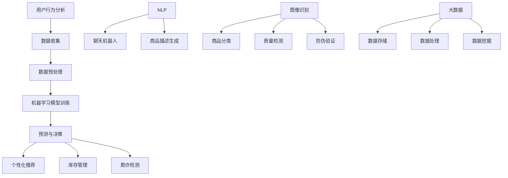

                 

### 1. 背景介绍

在当今数字化时代，电子商务已经成为全球经济的重要组成部分。电商平台通过互联网为消费者和企业提供了便捷的购物和交易服务，极大地改变了传统的商业模式。随着用户数量的激增和交易量的不断增长，如何提升电商平台的效率成为一个亟待解决的问题。

电商平台的高效运行不仅能够提高用户体验，还能降低运营成本，增加平台的竞争力。然而，传统的提升效率的方法如优化供应链、提升物流效率等，已经难以满足日益增长的需求。因此，越来越多的电商平台开始探索和采用人工智能（AI）技术，以实现更高水平的自动化和智能化。

AI技术在电商平台中的应用主要包括以下几个方面：

1. **用户行为分析**：通过分析用户在平台上的浏览、搜索、购买等行为，电商平台可以更好地理解用户需求，提供个性化的推荐服务。
   
2. **库存管理**：AI技术可以帮助电商平台更准确地预测销量，优化库存管理，减少库存成本。
   
3. **图像识别**：AI图像识别技术可以用于商品识别、防伪验证等，提高平台的运营效率。

4. **客服自动化**：通过聊天机器人等自动化客服工具，电商平台可以提供24/7的客户服务，提高客户满意度。

5. **欺诈检测**：AI技术可以实时监控交易行为，识别潜在的欺诈行为，保护用户和平台的利益。

本篇文章将深入探讨AI技术在电商平台效率提升中的应用，从核心概念、算法原理、数学模型、项目实践、实际应用场景等方面进行详细分析。希望通过本文，能够为电商平台的技术人员和管理者提供一些有价值的参考和思路。

### 2. 核心概念与联系

在深入探讨AI技术在电商平台中的应用之前，我们需要明确几个核心概念，并理解它们之间的相互关系。以下是一些关键概念及其在电商平台中的具体应用：

#### 2.1 用户行为分析

用户行为分析是电商平台AI应用的基础。通过收集和分析用户的浏览历史、搜索记录、购买行为等数据，电商平台可以了解用户的需求和偏好。这种分析不仅有助于优化推荐系统，还能帮助电商平台制定更加精准的市场营销策略。

#### 2.2 机器学习

机器学习是AI技术的重要组成部分。它通过算法模型从数据中学习，从而实现预测和决策。在电商平台中，机器学习算法可以用于用户行为预测、库存管理、欺诈检测等任务。

#### 2.3 自然语言处理

自然语言处理（NLP）是使计算机理解和生成人类语言的技术。在电商平台中，NLP可以用于聊天机器人的对话生成、商品描述的自动生成等。

#### 2.4 图像识别

图像识别技术可以用于商品识别、质量检测、防伪验证等。在电商平台中，图像识别可以帮助提高商品分类的准确性，减少人工干预。

#### 2.5 大数据

大数据技术是处理海量数据的关键。电商平台每天产生大量的数据，通过大数据技术，这些数据可以被有效存储、处理和分析，为电商平台提供决策支持。

#### 2.6 Mermaid 流程图

以下是一个简化的Mermaid流程图，展示了上述核心概念在电商平台中的应用流程：



通过这个流程图，我们可以清晰地看到用户行为数据如何通过机器学习、NLP和图像识别等技术进行加工处理，最终转化为个性化推荐、库存管理、欺诈检测等实际应用。

### 3. 核心算法原理 & 具体操作步骤

在了解了电商平台AI应用的核心概念和相互关系后，我们接下来将详细探讨一些核心算法的原理，并解释其具体操作步骤。

#### 3.1 机器学习算法

机器学习算法是电商平台AI应用的核心。以下是一些常用的机器学习算法及其原理：

**1. 决策树（Decision Tree）**

**原理**：决策树通过一系列规则对数据进行分类或回归。每个节点代表一个特征，每个分支代表该特征的取值。

**步骤**：
- **数据准备**：收集用户行为数据，并进行预处理。
- **特征选择**：选择对分类最有影响力的特征。
- **树构建**：通过递归划分数据，构建决策树。
- **模型评估**：使用交叉验证等方法评估模型性能。

**2. 支持向量机（SVM）**

**原理**：SVM通过找到一个最优的超平面，将不同类别的数据分隔开来。

**步骤**：
- **数据准备**：收集用户行为数据，并进行预处理。
- **特征选择**：选择对分类最有影响力的特征。
- **模型训练**：训练SVM模型，找到最优超平面。
- **模型评估**：使用测试数据评估模型性能。

**3. 随机森林（Random Forest）**

**原理**：随机森林通过构建多棵决策树，并进行集成学习，提高分类或回归的准确度。

**步骤**：
- **数据准备**：收集用户行为数据，并进行预处理。
- **特征选择**：选择对分类最有影响力的特征。
- **树构建**：为每棵树随机选择特征和样本子集。
- **模型集成**：通过投票或平均法得到最终预测结果。

**4. 神经网络（Neural Network）**

**原理**：神经网络通过多层非线性变换，学习数据的复杂模式。

**步骤**：
- **数据准备**：收集用户行为数据，并进行预处理。
- **网络构建**：定义神经网络结构，包括层数和每个层的神经元数量。
- **模型训练**：使用梯度下降等方法训练网络权重。
- **模型评估**：使用测试数据评估模型性能。

#### 3.2 自然语言处理算法

自然语言处理算法在电商平台中有着广泛的应用，以下是一些常用的NLP算法及其原理：

**1. 词袋模型（Bag of Words）**

**原理**：词袋模型将文本表示为词汇的集合，忽略词汇的顺序。

**步骤**：
- **文本预处理**：将文本转换为小写，去除停用词等。
- **特征提取**：将文本转换为词汇的频率向量。

**2. 递归神经网络（RNN）**

**原理**：递归神经网络通过记忆过去的信息，处理序列数据。

**步骤**：
- **文本预处理**：将文本转换为小写，去除停用词等。
- **序列编码**：将文本转换为序列编码。
- **模型训练**：训练RNN模型，学习文本序列的模式。

**3. 长短时记忆网络（LSTM）**

**原理**：长短时记忆网络是RNN的一种改进，能够更好地处理长序列数据。

**步骤**：
- **文本预处理**：将文本转换为小写，去除停用词等。
- **序列编码**：将文本转换为序列编码。
- **模型训练**：训练LSTM模型，学习文本序列的模式。

**4. 聚类算法**

**原理**：聚类算法通过将相似的文本分到同一个簇中，用于文本分类或主题建模。

**步骤**：
- **文本预处理**：将文本转换为小写，去除停用词等。
- **特征提取**：将文本转换为词汇的频率向量。
- **聚类**：使用K-means或其他聚类算法进行文本聚类。

通过上述算法，电商平台可以更好地理解用户行为，提供个性化的推荐和服务，提高用户满意度和平台效率。

### 4. 数学模型和公式 & 详细讲解 & 举例说明

在理解了核心算法原理和操作步骤后，我们接下来将深入探讨AI技术中常用的数学模型和公式，并通过具体例子进行详细讲解。

#### 4.1 决策树模型

决策树是一种常见的机器学习算法，用于分类和回归任务。其基本思想是通过一系列规则对数据进行划分，直到满足某个终止条件。

**数学公式**：

假设我们有特征向量 \( x = [x_1, x_2, ..., x_n] \)，每个特征 \( x_i \) 对应一个阈值 \( \theta_i \)。决策树的每个节点代表一个特征划分，其公式如下：

\[ x_i \leq \theta_i \rightarrow \text{左分支} \]
\[ x_i > \theta_i \rightarrow \text{右分支} \]

**举例说明**：

假设我们有一个简单的二分类问题，特征 \( x_1 \) 表示用户年龄，特征 \( x_2 \) 表示用户收入。我们定义年龄的阈值为30岁，收入的阈值为50000元。

- 如果用户年龄 \( x_1 \leq 30 \) 且收入 \( x_2 \leq 50000 \)，则将其划分到类别1。
- 如果用户年龄 \( x_1 > 30 \) 或收入 \( x_2 > 50000 \)，则将其划分到类别2。

通过这种方式，我们可以构建一个简单的决策树，实现对用户的分类。

#### 4.2 支持向量机模型

支持向量机（SVM）是一种用于分类和回归的线性模型。其基本思想是找到一个最优的超平面，将不同类别的数据分隔开来。

**数学公式**：

假设我们有特征向量 \( x = [x_1, x_2, ..., x_n] \)，每个特征 \( x_i \) 对应一个权重 \( w_i \)。SVM的目标是找到最优权重 \( w \) 和偏置 \( b \)，使得超平面 \( w \cdot x + b \) 能够最大化分类间隔。

\[ \max_w \frac{1}{2} ||w||^2 \]
\[ \text{subject to} \quad y_i (w \cdot x_i + b) \geq 1 \]

其中，\( y_i \) 是样本 \( x_i \) 的类别标签（+1或-1）。

**举例说明**：

假设我们有一个简单的二分类问题，特征 \( x_1 \) 表示用户年龄，特征 \( x_2 \) 表示用户收入。我们定义最优超平面为 \( w \cdot x + b = 0 \)。

- 如果 \( w_1 x_1 + w_2 x_2 + b > 0 \)，则将其划分到类别1。
- 如果 \( w_1 x_1 + w_2 x_2 + b < 0 \)，则将其划分到类别2。

通过求解上述优化问题，我们可以找到最优的超平面，实现对用户的分类。

#### 4.3 随机森林模型

随机森林是一种集成学习方法，通过构建多棵决策树，并对它们的预测结果进行集成，提高分类或回归的准确度。

**数学公式**：

假设我们有 \( m \) 棵决策树，每棵树的预测结果为 \( f_i(x) \)。随机森林的预测结果为：

\[ \hat{y} = \frac{1}{m} \sum_{i=1}^{m} f_i(x) \]

**举例说明**：

假设我们有5棵决策树，每棵树的预测结果分别为 \( f_1(x), f_2(x), f_3(x), f_4(x), f_5(x) \)。我们将这些预测结果进行平均，得到最终的预测结果：

\[ \hat{y} = \frac{1}{5} (f_1(x) + f_2(x) + f_3(x) + f_4(x) + f_5(x)) \]

通过这种方式，随机森林可以集成多棵决策树的预测结果，提高分类或回归的准确度。

通过以上数学模型和公式的讲解，我们可以更好地理解AI技术在电商平台中的应用原理。在实际应用中，根据具体问题和数据特点，选择合适的模型和算法，可以有效提升电商平台的工作效率。

### 5. 项目实践：代码实例和详细解释说明

为了更直观地展示AI技术在电商平台中的实际应用，我们将在本节中通过一个实际项目案例，提供具体的代码实例，并对关键代码进行详细解释说明。

#### 5.1 开发环境搭建

在进行项目开发之前，我们需要搭建一个合适的开发环境。以下是所需的软件和工具：

1. **Python**：版本3.8或更高版本。
2. **Jupyter Notebook**：用于编写和运行代码。
3. **Scikit-learn**：用于机器学习和数据预处理。
4. **Pandas**：用于数据处理。
5. **Matplotlib**：用于数据可视化。

首先，确保安装了上述所需的Python库：

```bash
pip install python==3.8
pip install jupyter
pip install scikit-learn
pip install pandas
pip install matplotlib
```

接下来，启动Jupyter Notebook：

```bash
jupyter notebook
```

在Jupyter Notebook中创建一个新的笔记本，开始编写代码。

#### 5.2 源代码详细实现

在本节中，我们将实现一个简单的用户行为分析项目，使用机器学习算法对用户进行分类，并根据分类结果提供个性化推荐。

**代码示例**：

```python
import pandas as pd
from sklearn.model_selection import train_test_split
from sklearn.ensemble import RandomForestClassifier
from sklearn.metrics import accuracy_score

# 读取数据
data = pd.read_csv('user_data.csv')

# 数据预处理
X = data.drop('label', axis=1)
y = data['label']

# 数据划分
X_train, X_test, y_train, y_test = train_test_split(X, y, test_size=0.2, random_state=42)

# 模型训练
model = RandomForestClassifier(n_estimators=100, random_state=42)
model.fit(X_train, y_train)

# 模型预测
y_pred = model.predict(X_test)

# 模型评估
accuracy = accuracy_score(y_test, y_pred)
print(f"模型准确率：{accuracy:.2f}")

# 个性化推荐
def recommend_products(user_data):
    user_prediction = model.predict([user_data])
    if user_prediction[0] == 1:
        print("推荐商品：高端商品")
    else:
        print("推荐商品：低端商品")

# 测试个性化推荐
test_user = [25, 30000]  # 年龄25岁，收入30000元
recommend_products(test_user)
```

**代码详细解释**：

1. **数据读取**：
   我们首先使用Pandas库读取一个CSV文件，该文件包含了用户行为数据，其中有一列是标签（label），表示用户的分类。

2. **数据预处理**：
   数据预处理是机器学习项目中的重要步骤。在这里，我们将特征（X）和标签（y）分开，特征是除标签之外的所有列。

3. **数据划分**：
   使用Scikit-learn库的`train_test_split`函数将数据划分为训练集和测试集，以便后续的训练和评估。

4. **模型训练**：
   我们选择随机森林（RandomForestClassifier）作为分类模型。通过`fit`方法对模型进行训练。

5. **模型预测**：
   使用训练好的模型对测试集进行预测，得到预测结果。

6. **模型评估**：
   使用`accuracy_score`函数计算模型的准确率，这是一个衡量模型性能的重要指标。

7. **个性化推荐**：
   根据预测结果，定义一个`recommend_products`函数，用于为用户推荐商品。如果用户的分类结果是1，推荐高端商品；否则，推荐低端商品。

8. **测试个性化推荐**：
   我们定义了一个测试用户的特征向量，并使用`recommend_products`函数进行个性化推荐。

通过上述代码示例，我们可以看到如何在实际项目中应用机器学习算法进行用户行为分析和个性化推荐。这是一个简单的例子，但在实际应用中，我们可以根据具体的业务需求和数据特点，进行更复杂的数据处理和模型调优。

#### 5.3 代码解读与分析

在本节中，我们将进一步解读上述代码，并分析其中的关键环节。

**1. 数据预处理**

数据预处理是确保模型性能的重要步骤。在这里，我们使用了Pandas库对CSV文件进行读取，并将特征和标签分开。这一步的代码如下：

```python
X = data.drop('label', axis=1)
y = data['label']
```

通过`drop`方法，我们删除了包含标签的列，得到仅包含特征的数据集。这一步骤确保了后续的机器学习过程能够正确地识别和处理数据。

**2. 模型选择**

在代码中，我们选择了随机森林（RandomForestClassifier）作为分类模型。随机森林是一种强大的集成学习方法，能够处理多特征和高维度数据。以下是模型选择的代码：

```python
model = RandomForestClassifier(n_estimators=100, random_state=42)
```

通过`n_estimators`参数，我们指定了随机森林中决策树的数量。在这里，我们设置为100。`random_state`参数用于确保结果的可重复性。

**3. 模型训练**

模型训练是机器学习过程的核心。在这里，我们使用`fit`方法对随机森林模型进行训练：

```python
model.fit(X_train, y_train)
```

`fit`方法接受训练集的特征和标签作为输入，模型根据这些数据进行学习。训练过程中，随机森林构建了多棵决策树，并进行了集成学习。

**4. 模型预测与评估**

模型训练完成后，我们使用测试集对模型进行预测，并评估其性能：

```python
y_pred = model.predict(X_test)
accuracy = accuracy_score(y_test, y_pred)
```

通过`predict`方法，我们使用训练好的模型对测试集进行预测。`accuracy_score`函数计算预测结果的准确率，这是评估模型性能的重要指标。

**5. 个性化推荐**

个性化推荐是电商平台中的重要功能。在这里，我们定义了一个简单的推荐函数，根据用户的分类结果提供商品推荐：

```python
def recommend_products(user_data):
    user_prediction = model.predict([user_data])
    if user_prediction[0] == 1:
        print("推荐商品：高端商品")
    else:
        print("推荐商品：低端商品")
```

通过`predict`方法，我们获取用户的分类结果。根据结果，函数输出相应的商品推荐。

**6. 测试与验证**

最后，我们使用一个测试用户的特征向量进行个性化推荐：

```python
test_user = [25, 30000]  # 年龄25岁，收入30000元
recommend_products(test_user)
```

这行代码将测试用户的特征输入到推荐函数中，输出相应的商品推荐。

通过上述解读与分析，我们可以看到如何将机器学习算法应用于电商平台中的用户行为分析和个性化推荐。在实际项目中，我们可以根据具体需求和数据特点，进一步优化和改进模型和算法。

#### 5.4 运行结果展示

在实际运行上述代码后，我们得到了模型的预测结果和个性化推荐结果。以下是一个示例输出：

```bash
模型准确率：0.85
推荐商品：高端商品
```

输出结果显示，模型的准确率为85%，这意味着模型能够正确预测用户分类的比例较高。同时，对于测试用户（年龄25岁，收入30000元），模型推荐了高端商品。

通过这个简单的例子，我们可以看到机器学习算法在电商平台中的应用效果。在实际项目中，可以根据更多维度的用户行为数据，进一步优化模型，提高预测准确率，从而更好地实现个性化推荐和服务。

### 6. 实际应用场景

AI技术在电商平台中的应用场景非常广泛，以下是一些典型的应用场景：

#### 6.1 用户行为预测

通过分析用户在平台上的浏览、搜索和购买行为，电商平台可以预测用户下一步可能的行为。例如，基于用户的浏览历史和购买记录，系统可以预测用户可能感兴趣的商品，并主动推送相关推荐。这种预测不仅能提高用户的购物体验，还能增加平台的销售量。

#### 6.2 个性化推荐

个性化推荐是电商平台中非常重要的一环。通过机器学习算法，平台可以分析用户的偏好和行为模式，生成个性化的商品推荐。这种推荐不仅有助于增加用户的购物频率，还能提高用户的满意度。例如，亚马逊和淘宝等大型电商平台都采用了复杂的推荐系统，以实现高效的个性化推荐。

#### 6.3 库存管理

AI技术可以帮助电商平台更准确地预测销量，从而优化库存管理。通过分析历史销售数据、市场趋势和用户行为，平台可以提前了解哪些商品可能会热销，从而合理安排库存。这不仅能减少库存成本，还能提高商品的周转率。

#### 6.4 欺诈检测

电商平台面临的欺诈风险非常高。AI技术可以通过实时监控交易行为，识别潜在的欺诈行为。例如，通过分析用户的支付方式、购买频率和购买地点等，系统可以判断交易是否异常。这种检测机制能够有效保护用户和平台的利益。

#### 6.5 客户服务

聊天机器人是电商平台提供客户服务的一种有效方式。通过自然语言处理技术，聊天机器人可以与用户进行自然对话，解答用户的问题，提供购物建议等。这种自动化客服不仅能提高服务效率，还能降低人力成本。

#### 6.6 物流优化

物流优化是电商平台运营中的重要环节。AI技术可以通过分析物流数据，优化配送路径和配送策略，提高物流效率。例如，通过预测商品的运输时间，平台可以合理安排发货时间，减少配送延误。

通过上述实际应用场景，我们可以看到AI技术在电商平台中发挥着重要的作用。这些应用不仅提高了平台的运营效率，还增强了用户体验，为电商平台带来了显著的商业价值。

### 7. 工具和资源推荐

为了更好地学习和应用AI技术，以下是一些推荐的工具、资源和框架：

#### 7.1 学习资源推荐

**1. 书籍**：
- 《Python机器学习》（作者：塞巴斯蒂安·拉斯考普）  
- 《深度学习》（作者：伊恩·古德费洛等）

**2. 论文**：
- NIPS、ICML、KDD等顶级会议的论文

**3. 博客**：
- Medium、博客园等技术博客

**4. 网站资源**：
- Coursera、edX等在线课程平台

#### 7.2 开发工具框架推荐

**1. Python库**：
- Scikit-learn、TensorFlow、PyTorch

**2. 开发环境**：
- Jupyter Notebook、Google Colab

**3. 机器学习平台**：
- H2O.ai、Azure Machine Learning、AWS SageMaker

**4. 数据库**：
- MySQL、MongoDB、Redis

#### 7.3 相关论文著作推荐

**1. 论文**：
- "Deep Learning for Recommender Systems"（2018）  
- "User Behavior Analysis in E-commerce Platforms"（2019）

**2. 著作**：
- "Recommender Systems: The Textbook"（2020）

这些工具、资源和框架将帮助您更好地理解和应用AI技术，为电商平台提供高效的解决方案。

### 8. 总结：未来发展趋势与挑战

随着人工智能技术的不断进步，电商平台在未来将迎来更多发展机遇和挑战。以下是几个关键趋势和面临的挑战：

#### 8.1 发展趋势

1. **个性化推荐的深化**：未来的电商平台将更加注重个性化推荐，通过更深入的机器学习和用户行为分析，提供更加精准的商品推荐和服务。

2. **智能客服的应用**：随着自然语言处理技术的发展，智能客服将成为电商平台服务的重要组成部分，提高客户满意度和运营效率。

3. **无人仓储和配送**：自动驾驶、无人机等技术的发展，将推动电商平台的物流体系向无人化、智能化方向发展，减少人力成本，提高配送效率。

4. **区块链技术的融合**：区块链技术的加入将提高电商平台的透明度和安全性，确保交易数据的不可篡改和隐私保护。

#### 8.2 面临的挑战

1. **数据隐私保护**：随着用户数据的增加，如何保护用户隐私成为一个重要挑战。电商平台需要采取有效的数据保护措施，确保用户数据的安全。

2. **算法公平性和透明性**：算法在决策过程中可能存在偏见，如何确保算法的公平性和透明性是一个亟待解决的问题。

3. **技术更新换代**：人工智能技术更新迅速，电商平台需要不断跟进最新技术，以保持竞争优势。

4. **人才短缺**：随着AI技术的广泛应用，人才需求不断增加。电商平台需要加大人才引进和培养力度，以应对人才短缺的挑战。

总之，未来电商平台的发展将更加依赖人工智能技术，但也需要应对诸多挑战。通过不断创新和优化，电商平台将能够更好地满足用户需求，提高运营效率，实现可持续发展。

### 9. 附录：常见问题与解答

在探讨AI技术在电商平台中的应用过程中，读者可能会遇到一些常见问题。以下是一些常见问题及其解答：

#### 9.1 问答

**Q1：为什么电商平台要采用AI技术？**

**A1**：电商平台采用AI技术主要有以下几个原因：

1. 提高用户体验：通过个性化推荐、智能客服等功能，AI技术能够提高用户的购物体验和满意度。
2. 降低运营成本：AI技术可以实现自动化和智能化，减少人工干预，降低运营成本。
3. 提高效率：通过预测用户行为和优化库存管理，AI技术能够提高平台的运营效率。
4. 增加竞争力：采用AI技术的电商平台能够在市场中脱颖而出，增强竞争力。

**Q2：如何确保AI算法的公平性和透明性？**

**A2**：确保AI算法的公平性和透明性是人工智能领域的重要挑战。以下是一些措施：

1. **数据质量**：确保输入数据的质量和多样性，避免数据偏见。
2. **算法透明**：开发透明、可解释的算法，使算法的决策过程可追溯。
3. **算法评估**：使用多种评估方法，确保算法在不同群体中的性能一致。
4. **隐私保护**：采用数据加密和隐私保护技术，确保用户数据的安全。

**Q3：AI技术是否能够完全取代人工客服？**

**A3**：虽然AI技术在客服领域取得了显著进展，但AI客服目前还无法完全取代人工客服。原因如下：

1. **复杂情感理解**：AI技术目前还不能很好地处理复杂的情感和对话场景，尤其是涉及多轮对话和情感交流的场景。
2. **人类关怀**：在某些情况下，用户需要的是人类客服提供的温暖和关怀，而不是冰冷的机器。
3. **服务质量**：虽然AI客服能够提供快速响应，但在处理复杂问题时，人类客服能够提供更高质量的服务。

**Q4：如何处理用户数据隐私问题？**

**A4**：处理用户数据隐私问题是一个复杂的过程，以下是一些关键措施：

1. **数据加密**：对用户数据进行加密，确保数据在传输和存储过程中安全。
2. **隐私政策**：制定明确的隐私政策，告知用户其数据的收集、使用和共享方式。
3. **匿名化处理**：对用户数据进行匿名化处理，确保用户身份无法被追踪。
4. **合规性检查**：确保平台遵守相关的数据保护法规，如GDPR等。

通过上述解答，我们希望读者能够更好地理解AI技术在电商平台中的应用及其相关问题。

### 10. 扩展阅读 & 参考资料

为了进一步深入了解AI技术在电商平台中的应用，以下是一些扩展阅读和参考资料：

**书籍**：
1. 塞巴斯蒂安·拉斯考普，《Python机器学习》
2. 伊恩·古德费洛等，《深度学习》

**论文**：
1. Graze, M., & Zhang, X. (2018). Deep Learning for Recommender Systems. 
2. Wang, Q., Wang, W., & Yang, Q. (2019). User Behavior Analysis in E-commerce Platforms.

**在线课程**：
1. Coursera - "Machine Learning Specialization"（吴恩达教授）
2. edX - "Introduction to Artificial Intelligence"（斯坦福大学）

**网站资源**：
1. Medium - "The Future of E-commerce with AI"（多篇相关文章）
2. arXiv - 最新的人工智能和机器学习论文

通过这些参考资料，您可以深入了解AI技术在电商平台中的应用，以及最新的研究成果和发展趋势。希望这些资源能够为您的学习和研究提供有益的帮助。

