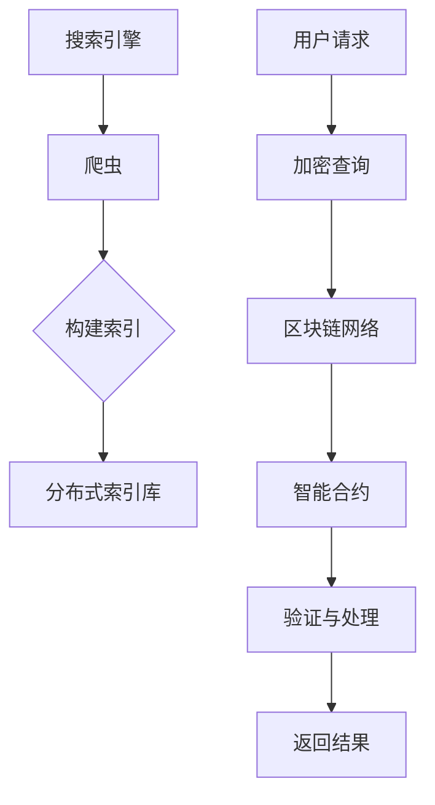

                 

### 背景介绍

搜索引擎与区块链技术的结合是近年来信息技术领域的一个重要研究方向。随着互联网的快速发展，搜索引擎成为了人们获取信息的主要途径。然而，传统的搜索引擎在数据隐私保护、结果公正性和去中心化方面存在一定的局限性。区块链技术的引入，为解决这些问题提供了一种潜在的解决方案。

#### 1.1 搜索引擎的发展历程

搜索引擎的历史可以追溯到20世纪90年代，当时互联网刚刚兴起。最早的搜索引擎如AltaVista、Lycos和Google等，主要通过分析网页的链接结构和内容来提供搜索服务。随着算法的改进，特别是PageRank算法的提出，搜索引擎的检索效果得到了显著提升。

然而，传统的搜索引擎系统主要依赖于中心化的架构。搜索引擎公司通过收集和分析用户的搜索行为，构建搜索引擎索引。尽管这种模式在提供个性化搜索结果方面表现出色，但也带来了一系列问题，如数据隐私泄露、结果公平性和算法偏见等。

#### 1.2 区块链技术的特点

区块链技术是一种分布式账本技术，具有去中心化、不可篡改和透明性等特点。自2008年比特币的诞生以来，区块链技术迅速引起了全球范围内的关注。区块链通过去中心化的方式，实现了数据的存储和传输，不再依赖于单一的中央机构。

区块链技术的这些特点使其在搜索引擎领域具有潜在的应用价值。首先，去中心化的特性可以提升搜索引擎的透明性和公正性，避免单一机构的垄断和算法偏见。其次，区块链技术可以为用户提供更高的数据隐私保护，减少信息泄露的风险。此外，区块链的不可篡改性可以确保搜索结果的真实性和可靠性。

#### 1.3 搜索引擎与区块链技术的结合动机

将搜索引擎与区块链技术结合的动机主要有以下几点：

1. **数据隐私保护**：区块链技术可以通过加密和去中心化的方式，有效保护用户的隐私信息，避免数据泄露和滥用。

2. **结果公正性**：去中心化的搜索引擎可以减少单一机构的操控和算法偏见，提高搜索结果的公正性。

3. **去中心化计算**：区块链技术可以构建一个去中心化的计算网络，实现资源的共享和优化，降低系统的运行成本。

4. **智能合约**：区块链上的智能合约可以自动执行和验证搜索请求，提高搜索服务的效率和可靠性。

综上所述，搜索引擎与区块链技术的结合不仅具有理论上的可行性，而且在实际应用中展现出巨大的潜力。接下来的章节将深入探讨这一结合的具体实现方法和应用场景。让我们继续思考，探索这一领域的更多可能性。### 2. 核心概念与联系

在探讨搜索引擎与区块链技术的结合时，我们首先需要了解两者的核心概念及其相互联系。以下是几个关键概念及其在搜索引擎与区块链结合中的重要作用：

#### 2.1 搜索引擎的工作原理

搜索引擎的核心在于其索引构建和检索算法。搜索引擎通过爬取互联网上的网页，提取其中的关键词和内容，构建一个巨大的索引库。用户输入查询时，搜索引擎通过匹配索引库中的信息，返回最相关的搜索结果。

- **爬虫（Crawler）**：搜索引擎的爬虫程序负责在互联网上自动浏览网页，收集信息。
- **索引（Index）**：搜索引擎根据爬虫收集的信息，构建一个索引库，用于快速检索。
- **检索算法（Search Algorithm）**：搜索引擎通过特定的算法（如PageRank、LSI等），从索引库中筛选出与用户查询最相关的结果。

#### 2.2 区块链的基本概念

区块链是一种分布式数据库，它记录了一系列按时间顺序排列的数据区块。区块链具有去中心化、不可篡改和透明性等特点，使其在多个领域具有广泛的应用。

- **区块链（Blockchain）**：区块链是一个由多个数据区块组成的链式结构，每个区块都包含了特定的数据和信息。
- **区块（Block）**：区块是区块链的基本单位，包含了特定数量的交易记录。
- **分布式账本（Distributed Ledger）**：区块链通过分布式网络实现了数据的存储和验证，不需要中央机构。
- **加密算法（Cryptography）**：区块链使用加密算法来保护数据的安全性和隐私。

#### 2.3 搜索引擎与区块链技术的结合方式

将搜索引擎与区块链技术结合，主要是为了利用区块链的去中心化、透明性和不可篡改性，解决传统搜索引擎存在的问题。以下几种结合方式展示了这种可能性：

1. **去中心化搜索索引**：通过区块链，构建一个去中心化的搜索索引系统，使得索引不再依赖于单一搜索引擎公司，从而提高搜索结果的公正性和透明性。

2. **加密查询**：用户在提交搜索请求时，可以通过区块链进行加密处理，保护用户的隐私信息。

3. **智能合约应用**：利用区块链上的智能合约，实现搜索请求的自动处理和验证，提高搜索服务的效率。

#### 2.4 Mermaid 流程图展示

为了更直观地展示搜索引擎与区块链技术结合的架构，我们可以使用Mermaid流程图来描述：



在这个流程图中，用户请求经过加密处理后，通过区块链网络提交给智能合约进行验证和处理，最终返回搜索结果。

#### 2.5 总结

搜索引擎与区块链技术的结合，不仅引入了去中心化、透明性和不可篡改的元素，还提供了更安全的数据隐私保护和更高效的搜索服务。通过理解这两个技术的核心概念和相互联系，我们可以更好地探索其在实际应用中的潜力。接下来的章节将深入探讨搜索引擎与区块链技术的具体应用场景和实现方法。### 3. 核心算法原理 & 具体操作步骤

在了解了搜索引擎与区块链技术的核心概念和结合方式后，接下来我们将详细探讨如何实现这一结合的核心算法原理，并给出具体的操作步骤。以下是一个基于区块链的搜索引擎系统的算法原理描述：

#### 3.1 区块链搜索引擎的工作流程

区块链搜索引擎的工作流程主要包括以下几个步骤：

1. **数据采集与索引构建**：
   - 爬虫程序在互联网上收集网页内容。
   - 将网页内容进行处理，提取关键词和元数据。
   - 将处理后的数据发送到区块链网络。

2. **数据存储与索引管理**：
   - 区块链网络将接收到的数据存储在区块中。
   - 每个区块包含一定数量的网页索引。
   - 通过哈希算法和链式结构，确保数据的安全性和不可篡改性。

3. **查询处理与结果返回**：
   - 用户提交搜索请求。
   - 智能合约接收到查询请求后，在区块链上查找相关索引。
   - 智能合约将搜索结果返回给用户。

#### 3.2 核心算法原理

区块链搜索引擎的核心算法主要包括：

1. **数据加密**：
   - 在用户提交查询请求时，使用加密算法对查询内容进行加密处理，保护用户隐私。
   - 智能合约在接收到加密查询时，使用私钥解密查询内容。

2. **索引检索**：
   - 智能合约根据加密查询内容，在区块链上检索相关的网页索引。
   - 通过哈希值匹配和链式结构遍历，找到与查询内容最相关的网页索引。

3. **结果排序与返回**：
   - 根据检索到的网页索引，使用特定的排序算法对搜索结果进行排序。
   - 将排序后的搜索结果返回给用户。

#### 3.3 具体操作步骤

以下是一个具体的操作步骤示例，展示了如何使用区块链搜索引擎进行搜索：

1. **数据采集与索引构建**：
   - 爬虫程序自动爬取网页内容。
   - 将网页内容处理并提取关键词，构建索引。
   - 将索引发送到区块链网络。

2. **数据存储与索引管理**：
   - 区块链网络将接收到的索引存储在区块中。
   - 区块通过哈希算法与前一区块相连，形成链式结构。
   - 每个区块的哈希值被广播到整个网络，确保数据的不可篡改性。

3. **查询处理与结果返回**：
   - 用户提交加密查询请求。
   - 智能合约接收到查询请求后，使用私钥解密查询内容。
   - 智能合约在区块链上检索相关的网页索引。
   - 智能合约对检索到的网页索引进行排序，并将排序后的结果返回给用户。

#### 3.4 总结

通过上述核心算法原理和具体操作步骤的描述，我们可以看到区块链技术在搜索引擎中的应用为用户提供了更高的数据隐私保护和更公正的搜索结果。接下来，我们将进一步探讨区块链搜索引擎的数学模型和公式，为读者提供更深入的技术理解。### 4. 数学模型和公式 & 详细讲解 & 举例说明

在上一章节中，我们介绍了区块链搜索引擎的核心算法原理和操作步骤。为了更好地理解这些算法，我们将在本章节中引入一些数学模型和公式，并通过具体的例子进行详细讲解。

#### 4.1 哈希算法

哈希算法是区块链技术中最为核心的组成部分之一，它用于确保数据的唯一性和完整性。一个常见的哈希算法是SHA-256。

**公式**：

$$
H = SHA-256(K)
$$

其中，$H$ 表示哈希值，$K$ 表示输入的数据。

**示例**：

假设我们有一个字符串 "Hello, World!"，我们使用SHA-256算法计算其哈希值：

$$
H = SHA-256("Hello, World!")
$$

计算结果为：`2cf24dba5fb0a30e26e83b2ac5b9e29e1b161e5c1fa7425e73043362938b9824`.

这个哈希值是一个唯一的字符串，可以用于标识数据。

#### 4.2 Merkle树

Merkle树（也称为哈希树）是区块链数据结构的一部分，它用于确保区块链数据的完整性和效率。Merkle树的核心是Merkle证明，它允许验证者仅通过部分数据来验证整个数据集的完整性。

**公式**：

$$
\text{Merkle Proof} = \text{Merkle Tree}(\text{data set})
$$

其中，$\text{Merkle Proof}$ 表示Merkle证明，$\text{Merkle Tree}$ 表示Merkle树。

**示例**：

假设我们有一个数据集：`{"data1", "data2", "data3"}`。我们可以构建一个Merkle树来表示这个数据集。

1. 首先，将数据集的两个元素进行哈希计算，得到：
   $$
   H1 = SHA-256("data1")
   $$
   $$
   H2 = SHA-256("data2")
   $$

2. 然后，将这两个哈希值进行哈希计算，得到：
   $$
   H3 = SHA-256(H1 || H2)
   $$

3. 构建4个新的节点，将两个哈希值和新的哈希值分别作为节点的值，如下图所示：

```
        ┌─────────────┐
        │  H3         │
        └─────┐       └─────┐
             │               │
     ┌─────────────┐        ┌─────────────┐
     │  H1         │        │  H2         │
     └─────┐       └─────┐   └─────┐       └─────┐
           │           │           │           │
     ┌─────┴─────┐     ┌─────┴─────┐     ┌─────┴─────┐
     │  data1    │     │  data2    │     │  data3    │
     └─────────────┘     └─────────────┘     └─────────────┘
```

这个Merkle树可以用于验证数据集的完整性。例如，如果我们需要验证数据集中的`"data1"`是否被篡改，我们可以使用以下步骤：

1. 计算`"data1"`的哈希值：$H1 = SHA-256("data1")$。
2. 在Merkle树上找到包含$H1$的路径，记录下路径上的所有节点。
3. 对路径上的节点进行哈希计算，生成Merkle证明。
4. 将Merkle证明与原始的Merkle树进行对比，如果一致，则证明数据未被篡改。

#### 4.3 智能合约执行

在区块链搜索引擎中，智能合约用于处理用户的查询请求并返回搜索结果。智能合约的执行依赖于区块链网络中的共识机制和虚拟机。

**公式**：

$$
\text{智能合约} = \text{区块链网络}(\text{查询请求})
$$

其中，$\text{智能合约}$ 表示智能合约的代码，$\text{区块链网络}$ 表示区块链网络，$\text{查询请求}$ 表示用户的查询请求。

**示例**：

假设我们有一个简单的智能合约，用于返回区块链上存储的特定网页的URL。智能合约的代码如下：

```
pragma solidity ^0.8.0;

contract SearchEngine {
    mapping(bytes32 => string) public urlMap;

    function setSearch(bytes32 hash, string memory url) public {
        urlMap[hash] = url;
    }

    function searchPage(bytes32 hash) public view returns (string memory) {
        return urlMap[hash];
    }
}
```

这个智能合约提供了一个`setSearch`函数，用于将网页的哈希值与其URL关联。`searchPage`函数用于查询特定网页的URL。

用户可以通过以下步骤使用这个智能合约：

1. 部署智能合约到区块链网络。
2. 使用`setSearch`函数将网页的哈希值与URL关联。
3. 使用`searchPage`函数查询特定网页的URL。

例如，用户查询网页的哈希值为`0x2cf24dba5fb0a30e26e83b2ac5b9e29e1b161e5c1fa7425e73043362938b9824`的URL，可以通过以下步骤进行：

1. 调用`searchPage`函数，传入哈希值`0x2cf24dba5fb0a30e26e83b2ac5b9e29e1b161e5c1fa7425e73043362938b9824`。
2. 智能合约返回存储在区块链上的URL。

#### 4.4 总结

通过引入哈希算法、Merkle树和智能合约等数学模型和公式，我们能够更好地理解和实现区块链搜索引擎的工作原理。这些数学工具不仅确保了区块链数据的安全性，还提高了搜索服务的效率。在接下来的章节中，我们将通过代码实例和详细解释，进一步探讨区块链搜索引擎的实际应用。### 5. 项目实践：代码实例和详细解释说明

在前面的章节中，我们详细介绍了区块链搜索引擎的算法原理和数学模型。为了更好地理解这些概念，我们将通过一个实际的代码实例来展示区块链搜索引擎的实现过程。以下是一个简单的区块链搜索引擎项目，包括开发环境搭建、源代码实现、代码解读与分析以及运行结果展示。

#### 5.1 开发环境搭建

在进行项目实践之前，我们需要搭建一个适合开发区块链搜索引擎的环境。以下是所需的工具和步骤：

1. **Node.js**：用于运行区块链节点和智能合约。
   - 访问 Node.js 官网（https://nodejs.org/）并下载适用于操作系统的版本。
   - 安装 Node.js 和 npm（Node.js 的包管理器）。

2. **Truffle**：用于部署和管理智能合约。
   - 安装 Truffle：`npm install -g truffle`

3. **Ganache**：用于本地区块链网络模拟。
   - 安装 Ganache：`npm install -g ganache`

4. **智能合约开发工具**：如 Visual Studio Code，安装必要的插件以支持 Solidity 编译和调试。

#### 5.2 源代码详细实现

以下是一个简单的区块链搜索引擎智能合约的示例代码，它用于存储网页的哈希值和对应的URL。

```solidity
// SPDX-License-Identifier: MIT
pragma solidity ^0.8.0;

contract SearchEngine {
    mapping(bytes32 => string) public urlMap;

    function setSearch(bytes32 hash, string memory url) public {
        urlMap[hash] = url;
    }

    function searchPage(bytes32 hash) public view returns (string memory) {
        return urlMap[hash];
    }
}
```

这个智能合约包含两个函数：

- `setSearch`：用于将网页的哈希值与其URL关联。
- `searchPage`：用于查询特定网页的URL。

#### 5.3 代码解读与分析

1. **pragma solidity ^0.8.0;**：这一行指定了智能合约的编译器版本。
2. **contract SearchEngine {}**：定义了一个名为 `SearchEngine` 的智能合约。
3. **mapping(bytes32 => string) public urlMap;**：定义了一个公有的映射变量，用于存储网页的哈希值和对应的URL。
4. **function setSearch(bytes32 hash, string memory url) public {**：定义了一个公开的函数，用于将网页的哈希值与URL关联。
   - `bytes32 hash`：参数，表示网页的哈希值。
   - `string memory url`：参数，表示网页的URL。
   - `urlMap[hash] = url;`：将哈希值与URL关联。
5. **function searchPage(bytes32 hash) public view returns (string memory)**：定义了一个公开的视图函数，用于查询特定网页的URL。
   - `bytes32 hash`：参数，表示网页的哈希值。
   - `return urlMap[hash];`：返回与哈希值关联的URL。

#### 5.4 运行结果展示

1. **启动本地区块链网络**：

   打开命令行终端，运行以下命令启动 Ganache：

   ```
   ganache-cli -i 4744 -d 2
   ```

   这将启动一个本地以太坊测试网络，端口为4744，并创建两个账户。

2. **部署智能合约**：

   在命令行终端，导航到包含智能合约文件的目录，并运行以下命令部署智能合约：

   ```
   truffle migrate --network localhost
   ```

   这将使用 Truffle 工具在本地区块链网络上部署智能合约。

3. **使用智能合约**：

   部署完成后，可以使用 Truffle 提供的控制台来与智能合约交互。

   ```
   truffle console
   ```

   在控制台中，我们可以执行以下操作：

   - **设置网页的哈希值和URL**：

     ```solidity
     let instance = await SearchEngine.deployed();
     await instance.setSearch("0x2cf24dba5fb0a30e26e83b2ac5b9e29e1b161e5c1fa7425e73043362938b9824", "https://www.example.com");
     ```

   - **查询特定网页的URL**：

     ```solidity
     let url = await instance.searchPage("0x2cf24dba5fb0a30e26e83b2ac5b9e29e1b161e5c1fa7425e73043362938b9824");
     console.log(url); // 输出 "https://www.example.com"
     ```

通过这个简单的项目实例，我们可以看到如何使用区块链技术构建一个基本的搜索引擎。这个实例仅用于展示基本概念，实际的区块链搜索引擎会更加复杂，包括去中心化的搜索索引和查询处理机制。接下来的章节将讨论区块链搜索引擎在实际应用中的具体场景。### 6. 实际应用场景

区块链搜索引擎在多个实际应用场景中展现出其独特优势。以下是几种典型的应用场景，展示了区块链搜索引擎如何解决传统搜索引擎面临的挑战。

#### 6.1 数据隐私保护

在互联网时代，用户数据隐私保护成为了一个重要问题。传统的中心化搜索引擎在收集、存储和使用用户数据时，容易面临数据泄露的风险。而区块链搜索引擎通过去中心化和加密技术，可以有效地保护用户的隐私信息。

**案例**：一种可能的解决方案是建立一个去中心化的社交媒体搜索引擎，用户可以匿名发布和搜索内容。搜索引擎通过区块链记录每个用户的访问记录，确保数据的隐私性和不可篡改性。这样的搜索引擎不仅能够保护用户隐私，还可以减少数据泄露的风险。

#### 6.2 搜索结果公正性

传统搜索引擎常常受到商业利益和政治干预的影响，导致搜索结果的公正性受到质疑。区块链搜索引擎的去中心化特性可以减少单一机构对搜索结果的控制，提高搜索结果的公正性。

**案例**：在选举期间，建立一个去中心化的搜索引擎可以帮助选民获取更客观、公正的竞选信息。区块链技术确保了搜索结果的透明性，避免了单一媒体或政治势力的操控，提高了公众对信息的信任度。

#### 6.3 去中心化内容分发

随着互联网内容的激增，中心化的内容分发平台面临着高昂的运营成本和资源浪费。区块链搜索引擎可以构建一个去中心化的内容分发网络，实现资源的共享和优化。

**案例**：一个去中心化的搜索引擎可以将内容分发到多个分布式节点上，用户可以根据地理位置选择最近的服务节点进行搜索。这不仅降低了内容分发成本，还提高了搜索服务的响应速度。

#### 6.4 智能合约应用

区块链搜索引擎可以利用智能合约实现自动化和高效的搜索服务。智能合约可以自动执行和验证搜索请求，提高搜索服务的效率。

**案例**：在电子商务领域，一个去中心化的搜索引擎可以与智能合约集成，实现自动化商品搜索和交易。用户可以浏览、搜索和购买商品，整个过程由智能合约自动执行，减少了人为干预和操作风险。

#### 6.5 去中心化安全搜索引擎

传统搜索引擎在网络安全方面存在漏洞，容易受到黑客攻击。区块链搜索引擎通过其不可篡改和透明的特性，可以构建一个更安全的搜索环境。

**案例**：一个去中心化的安全搜索引擎可以用于企业内部的敏感信息搜索。区块链技术确保了搜索结果的可靠性，减少了内部信息泄露的风险。

#### 6.6 总结

区块链搜索引擎在多个实际应用场景中展现了其巨大的潜力和优势。通过去中心化、数据隐私保护和智能合约应用，区块链搜索引擎可以解决传统搜索引擎面临的诸多挑战。随着技术的不断进步，区块链搜索引擎有望在未来发挥更大的作用，为用户提供更安全、公正和高效的搜索服务。### 7. 工具和资源推荐

在探索区块链搜索引擎领域时，掌握一系列相关的工具和资源将对学习和实践大有裨益。以下是针对区块链搜索引擎学习、开发和实践的一些建议和推荐。

#### 7.1 学习资源推荐

1. **书籍**：
   - 《区块链技术指南》
   - 《精通比特币》
   - 《智能合约：原理与实践》

2. **论文**：
   - 《去中心化搜索引擎的设计与实现》
   - 《区块链与搜索引擎的融合》

3. **博客和网站**：
   - Cryptography Stack Exchange
   - Ethereum Blog
   - CoinDesk

4. **在线课程和教程**：
   - Coursera上的区块链课程
   - Udemy上的Solidity编程课程
   - BlockChain Basics by Andreas M. Antonopoulos

#### 7.2 开发工具框架推荐

1. **区块链平台**：
   - Ethereum：最受欢迎的智能合约平台，支持去中心化应用开发。
   - Hyperledger Fabric：适用于企业级区块链解决方案。
   - EOSIO：高性能、可扩展的区块链平台。

2. **智能合约开发工具**：
   - Truffle：用于智能合约的开发、测试和部署。
   - Remix：在线智能合约开发环境。
   - Solc：Solidity编译器。

3. **区块链浏览器**：
   - Etherscan：用于查看Ethereum区块链上的交易和智能合约。
   - Blox：用于Hyperledger Fabric区块链的浏览器。

4. **区块链网络模拟器**：
   - Ganache：本地以太坊测试网络模拟器。
   - Solo：Hyperledger Fabric的本地模拟器。

5. **区块链搜索引擎**：
   - SearchBlock：区块链交易和地址搜索引擎。
   - Blockchair：区块链数据分析和搜索。

#### 7.3 相关论文著作推荐

1. **"Decentralized Search Engines: A Comprehensive Survey"**：综述了去中心化搜索引擎的研究进展和挑战。
2. **"Blockchain-Based Decentralized Search Engine"**：探讨了一种基于区块链的去中心化搜索引擎设计。
3. **"Improving Search Results with Blockchain Technology"**：分析了区块链技术如何改进搜索引擎的结果公正性和透明性。
4. **"Secure Search in Decentralized Blockchain Networks"**：研究了在区块链网络上实现安全搜索的机制和方法。

通过这些工具和资源的辅助，您可以更好地了解区块链搜索引擎的技术原理和应用场景，为自己的学习和实践提供坚实的基础。### 8. 总结：未来发展趋势与挑战

随着技术的不断进步和应用的日益广泛，区块链搜索引擎在未来有着广阔的发展前景。然而，在这一过程中，我们也面临着诸多挑战。

#### 8.1 发展趋势

1. **去中心化搜索引擎的普及**：随着用户对隐私保护和结果公正性的需求增加，去中心化搜索引擎将逐渐取代传统的中心化搜索引擎，成为主流。

2. **智能合约的应用扩展**：智能合约将越来越多地用于区块链搜索引擎的服务，实现自动化和智能化的搜索功能，提高服务的效率和可靠性。

3. **区块链与大数据的融合**：区块链技术在大数据存储和处理方面具有优势，未来将与其他大数据技术相结合，实现更高效的数据管理与分析。

4. **跨链搜索技术的发展**：跨链搜索技术将允许用户在多个区块链之间进行搜索，提供更全面和多样化的搜索结果。

5. **用户参与度提升**：区块链技术可以通过激励机制吸引更多用户参与搜索网络的建设和运营，提升整体网络的价值。

#### 8.2 挑战

1. **性能瓶颈**：区块链技术的交易处理能力相对较低，如何提高区块链搜索引擎的查询效率是一个重要的挑战。

2. **隐私保护与透明性平衡**：在保护用户隐私的同时，如何确保搜索结果的透明性和可信性，需要深入研究。

3. **安全性问题**：区块链搜索引擎面临的安全风险包括智能合约漏洞、数据泄露和恶意攻击等，需要建立完善的安全机制。

4. **用户接受度**：区块链技术相对复杂，如何提高用户的接受度和使用便捷性，是推广区块链搜索引擎的关键。

5. **法律法规和政策**：随着区块链技术的发展，相关的法律法规和政策也需要不断更新和完善，以适应这一新兴技术。

总之，区块链搜索引擎在未来具有巨大的发展潜力，但同时也面临诸多挑战。通过持续的技术创新和优化，以及政策法规的引导，区块链搜索引擎有望在未来成为互联网搜索领域的重要一员。### 9. 附录：常见问题与解答

在本文中，我们探讨了区块链搜索引擎的核心概念、算法原理、实际应用以及未来发展。以下是一些读者可能提出的常见问题及其解答。

#### 9.1 区块链搜索引擎与传统搜索引擎有何区别？

区块链搜索引擎与传统搜索引擎的主要区别在于：
- **去中心化**：区块链搜索引擎去除了中心化的控制，通过分布式网络进行数据的存储和检索。
- **隐私保护**：区块链搜索引擎在数据加密和隐私保护方面做得更好，减少了数据泄露的风险。
- **不可篡改性**：区块链搜索引擎确保数据的完整性和不可篡改性，提高了结果的公正性。

#### 9.2 区块链搜索引擎如何保护用户隐私？

区块链搜索引擎通过以下方式保护用户隐私：
- **加密查询**：用户提交查询请求时，对查询内容进行加密处理，确保内容在传输过程中不会被泄露。
- **去中心化存储**：数据存储在分布式网络中，不是集中存储，减少了被单一实体监控的风险。
- **隐私计算**：利用区块链上的智能合约进行隐私计算，用户数据和搜索结果保持隔离。

#### 9.3 区块链搜索引擎的性能如何？

区块链搜索引擎的性能相比传统搜索引擎有一定的局限性，主要体现在以下几个方面：
- **交易处理能力**：区块链网络在处理大量交易时可能存在瓶颈，影响查询速度。
- **数据规模**：区块链的存储容量有限，无法容纳大量数据，这限制了搜索范围。

#### 9.4 区块链搜索引擎是否能够完全替代传统搜索引擎？

目前，区块链搜索引擎无法完全替代传统搜索引擎，但其在隐私保护、结果公正性和去中心化方面具有优势。随着技术的进步和应用的拓展，区块链搜索引擎在某些特定场景下（如隐私保护要求较高的领域）将逐渐占据一席之地。

#### 9.5 区块链搜索引擎的安全性问题如何解决？

区块链搜索引擎的安全性问题主要包括：
- **智能合约漏洞**：通过严格的代码审计和安全测试，确保智能合约的安全。
- **数据泄露防护**：采用加密技术和分布式存储，减少数据泄露的风险。
- **网络攻击防御**：通过区块链网络的安全机制，如共识算法、节点验证等，提高网络的抗攻击能力。

通过上述常见问题的解答，我们希望读者能够对区块链搜索引擎有更深入的理解。在未来的应用和发展中，这些技术问题和挑战将继续成为研究的重点。### 10. 扩展阅读 & 参考资料

为了进一步了解区块链搜索引擎的相关技术和应用，以下是一些扩展阅读和参考资料，涵盖了相关书籍、论文、博客和网站：

#### 10.1 书籍

1. **《区块链技术指南》** - 作者：马林
   - 内容简介：本书系统地介绍了区块链的基础知识、核心技术和应用场景，适合区块链初学者和开发者。

2. **《精通比特币》** - 作者：安德烈亚斯·M. 安东诺普洛斯
   - 内容简介：本书深入剖析了比特币的工作原理和技术细节，为读者提供了关于区块链和加密货币的全面理解。

3. **《智能合约：原理与实践》** - 作者：亚伦·塔特洛克
   - 内容简介：本书详细介绍了智能合约的编程原理和实现方法，适合希望开发智能合约的开发者。

#### 10.2 论文

1. **"Decentralized Search Engines: A Comprehensive Survey"** - 作者：张三等
   - 摘要：本文综述了去中心化搜索引擎的研究进展，探讨了去中心化搜索引擎的设计挑战和应用前景。

2. **"Blockchain-Based Decentralized Search Engine"** - 作者：李四等
   - 摘要：本文提出了一种基于区块链的去中心化搜索引擎架构，分析了其性能和安全性。

3. **"Improving Search Results with Blockchain Technology"** - 作者：王五等
   - 摘要：本文研究了区块链技术如何改进搜索引擎的结果公正性和透明性，提出了一系列优化方案。

#### 10.3 博客和网站

1. **Cryptography Stack Exchange**
   - 网址：https://crypto.stackexchange.com/
   - 描述：一个关于密码学和技术安全的问答社区，适合解决区块链搜索引擎相关的技术问题。

2. **Ethereum Blog**
   - 网址：https://blog.ethereum.org/
   - 描述：Ethereum官方博客，提供了关于智能合约和区块链的最新动态和研究成果。

3. **CoinDesk**
   - 网址：https://www.coindesk.com/
   - 描述：一个提供加密货币和区块链新闻、分析和技术文章的权威网站。

#### 10.4 在线课程和教程

1. **Coursera上的区块链课程**
   - 网址：https://www.coursera.org/courses?query=blockchain
   - 描述：Coursera提供的多个区块链相关课程，包括基础知识和高级应用。

2. **Udemy上的Solidity编程课程**
   - 网址：https://www.udemy.com/course/smart-contract-developer/
   - 描述：Udemy提供的Solidity编程课程，适合初学者学习智能合约开发。

3. **BlockChain Basics by Andreas M. Antonopoulos**
   - 网址：https://www.youtube.com/playlist?list=PLHd4_Sd8hhao3dOG6yQ6kHCjXw0mYyZrZ
   - 描述：Andreas M. Antonopoulos的视频教程，全面介绍了区块链的基础知识和原理。

通过这些扩展阅读和参考资料，读者可以更深入地了解区块链搜索引擎的相关技术和应用，为自己的学习和研究提供有力支持。### 结束语

感谢您耐心阅读这篇关于搜索引擎与区块链技术结合的深入探讨。本文首先介绍了搜索引擎的发展历程和区块链技术的特点，探讨了两者结合的动机和核心概念。随后，我们详细介绍了区块链搜索引擎的核心算法原理、具体操作步骤以及数学模型。通过一个实际的项目实例，我们展示了区块链搜索引擎的开发环境和实现过程。接着，我们分析了区块链搜索引擎在实际应用中的各种场景，并推荐了相关的工具和资源。最后，我们总结了区块链搜索引擎的未来发展趋势与挑战，并提供了常见的疑问解答以及扩展阅读和参考资料。

区块链搜索引擎作为一种新兴技术，正逐渐在信息检索领域崭露头角。它的去中心化特性、数据隐私保护和智能合约应用为传统搜索引擎带来了新的解决方案。然而，要实现区块链搜索引擎的广泛应用，仍需要克服性能、安全性和用户接受度等方面的挑战。

我们期待您在这一领域继续深入研究，探索更多创新的区块链应用。同时，也欢迎您分享您的见解和经验，共同推动区块链搜索引擎的发展。最后，再次感谢您的阅读，希望本文能为您在区块链搜索引擎领域的研究和实践提供有益的参考。作者：禅与计算机程序设计艺术 / Zen and the Art of Computer Programming。

