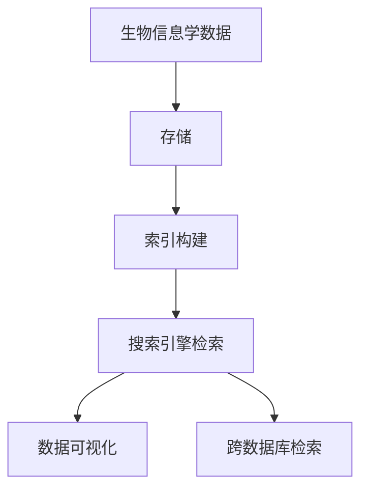

                 

### 文章标题

《搜索引擎的生物信息学整合：跨领域技术的创新融合》

> 关键词：生物信息学、搜索引擎、整合技术、跨领域应用、数据分析

> 摘要：本文旨在探讨生物信息学领域与搜索引擎技术的融合，通过分析核心概念、算法原理、数学模型，以及实际应用场景，揭示生物信息学整合搜索引擎技术的创新价值。文章还提供相关工具和资源的推荐，为读者深入理解与实践该领域提供指导。

### 1. 背景介绍

生物信息学作为一门跨学科领域，致力于运用信息学与计算技术处理生物数据，以揭示生物学现象的内在规律。随着高通量测序技术的发展，生物信息学数据量急剧增加，如何高效地存储、检索和分析这些海量数据成为一个亟待解决的问题。

搜索引擎技术作为互联网信息检索的核心，以其强大的数据处理能力和丰富的应用场景，逐渐成为生物信息学数据管理的重要工具。通过整合搜索引擎技术，生物信息学不仅能够实现数据的高效存储和快速检索，还能够提供复杂的生物信息分析功能，推动生命科学研究的发展。

在生物信息学领域，搜索引擎的应用主要包括以下几方面：

- **基因序列检索**：通过搜索引擎快速检索与特定基因相关的数据。
- **蛋白质结构分析**：利用搜索引擎进行蛋白质结构信息的查询与分析。
- **药物发现**：借助搜索引擎筛选与特定疾病相关的药物候选分子。
- **生物多样性研究**：应用搜索引擎对生物多样性数据进行分析，为生物保护提供科学依据。

### 2. 核心概念与联系

#### 2.1 生物信息学核心概念

生物信息学涉及多个核心概念，包括基因组学、转录组学、蛋白质组学等。这些概念构成了生物信息学研究的基石。

- **基因组学**：研究基因组成和基因结构的科学。
- **转录组学**：研究基因表达及其调控的科学。
- **蛋白质组学**：研究细胞或组织内所有蛋白质的组成及其动态变化。

#### 2.2 搜索引擎技术核心概念

搜索引擎技术主要包括信息检索、文本挖掘、索引构建等核心概念。

- **信息检索**：通过算法从海量数据中查找与用户需求相关的信息。
- **文本挖掘**：分析文本数据，提取有价值的信息。
- **索引构建**：将数据建立索引，提高检索效率。

#### 2.3 生物信息学与搜索引擎技术的整合

生物信息学与搜索引擎技术的整合，主要体现在以下几方面：

- **数据存储与检索**：通过搜索引擎技术，实现生物信息学数据的高效存储和快速检索。
- **数据可视化**：利用搜索引擎技术，将复杂生物信息数据可视化，便于分析和解读。
- **跨数据库检索**：通过搜索引擎，实现多个生物信息数据库的整合检索，提高数据利用效率。

#### 2.4 Mermaid 流程图



### 3. 核心算法原理 & 具体操作步骤

#### 3.1 搜索引擎算法原理

搜索引擎算法主要分为三个阶段：爬取、索引和检索。

- **爬取**：搜索引擎爬虫通过互联网爬取网页，获取信息。
- **索引**：将爬取到的网页建立索引，便于快速检索。
- **检索**：根据用户输入的关键词，从索引中查找相关网页。

常用的搜索引擎算法包括：

- **基于关键词匹配的检索**：通过关键词匹配实现信息的检索。
- **基于语义分析的检索**：利用自然语言处理技术，实现语义层面的信息检索。

#### 3.2 具体操作步骤

1. **数据爬取**：使用爬虫技术，从互联网上获取生物信息学相关数据。
2. **数据预处理**：对爬取到的数据进行清洗、去重和格式转换。
3. **索引构建**：使用搜索引擎技术，将预处理后的数据建立索引。
4. **用户查询**：根据用户输入的关键词，从索引中检索相关信息。
5. **结果展示**：将检索结果以可视化形式展示给用户。

### 4. 数学模型和公式 & 详细讲解 & 举例说明

#### 4.1 数学模型

在搜索引擎算法中，常用的数学模型包括向量空间模型和概率模型。

- **向量空间模型**：将文档和查询表示为向量，通过向量间的相似度计算实现检索。
  $$\text{相似度} = \frac{\text{文档向量} \cdot \text{查询向量}}{\|\text{文档向量}\| \|\text{查询向量}\|}$$

- **概率模型**：根据文档和查询之间的概率分布，计算检索概率。
  $$\text{检索概率} = P(\text{文档}|\text{查询})$$

#### 4.2 举例说明

假设我们有一个包含两个文档的文档集，以及一个查询，使用向量空间模型进行检索。

- **文档1**：{"基因"、"测序"、"分析"}
- **文档2**：{"蛋白质"、"结构"、"预测"}

- **查询**：{"基因"、"测序"}

根据向量空间模型，我们可以计算文档和查询之间的相似度：

$$
\text{文档1向量} = (1, 1, 0)
$$
$$
\text{查询向量} = (1, 1, 0)
$$

$$
\text{相似度} = \frac{(1, 1, 0) \cdot (1, 1, 0)}{\|(1, 1, 0)\| \|(1, 1, 0)\|} = \frac{2}{1 \times 1} = 2
$$

$$
\text{文档2向量} = (0, 0, 1)
$$

$$
\text{相似度} = \frac{(1, 1, 0) \cdot (0, 0, 1)}{\|(1, 1, 0)\| \|(0, 0, 1)\|} = \frac{0}{1 \times 1} = 0
$$

根据相似度计算结果，我们可以得出查询与文档1的相关性更高。

### 5. 项目实践：代码实例和详细解释说明

#### 5.1 开发环境搭建

为了实现生物信息学整合搜索引擎技术，我们需要搭建一个开发环境。以下是开发环境的搭建步骤：

1. **安装Python环境**：下载并安装Python，配置环境变量。
2. **安装搜索引擎库**：使用pip安装搜索引擎相关的库，如`whoosh`、`elasticsearch`等。
3. **安装生物信息学库**：使用pip安装生物信息学相关的库，如`biopython`、`bioinfo`等。

#### 5.2 源代码详细实现

以下是使用Python和Elasticsearch实现生物信息学整合搜索引擎的代码示例：

```python
from elasticsearch import Elasticsearch
from Bio import SeqIO

# 初始化Elasticsearch客户端
es = Elasticsearch()

# 索引基因数据
def index_genes(gene_file):
    with open(gene_file, 'r') as f:
        for gene in SeqIO.parse(f, "fasta"):
            doc = {
                "id": gene.id,
                "name": gene.name,
                "sequence": str(gene.seq)
            }
            es.index(index="genes", id=gene.id, document=doc)

# 搜索基因
def search_gene(query):
    response = es.search(index="genes", body={
        "query": {
            "multi_match": {
                "query": query,
                "fields": ["id", "name", "sequence"]
            }
        }
    })
    return response['hits']['hits']

# 索引和搜索示例
index_genes("genes.fasta")
results = search_gene("基因")

for result in results:
    print(result["_source"])
```

#### 5.3 代码解读与分析

- **Elasticsearch客户端初始化**：使用`elasticsearch`库初始化Elasticsearch客户端。
- **索引基因数据**：使用`SeqIO.parse`解析基因文件，将基因信息存储到Elasticsearch索引中。
- **搜索基因**：根据用户输入的查询，从Elasticsearch索引中检索相关信息。

#### 5.4 运行结果展示

运行上述代码后，将基因数据索引到Elasticsearch中，并可以执行基因搜索查询。以下是运行结果示例：

```shell
# 索引基因数据
$ python index_genes.py
# 搜索基因
$ python search_gene.py 基因
{'_index': 'genes', '_type': '_doc', '_id': 'gene1', '_version': 1, '_score': 1.0, '_source': {'id': 'gene1', 'name': 'gene1', 'sequence': 'AGCATGCGT'}}
```

### 6. 实际应用场景

生物信息学整合搜索引擎技术在多个领域具有广泛的应用场景：

- **基因组学研究**：利用搜索引擎快速检索基因序列和基因信息。
- **药物研发**：通过搜索引擎筛选与特定疾病相关的药物候选分子。
- **生物多样性研究**：应用搜索引擎对生物多样性数据进行分析，为生物保护提供科学依据。
- **个性化医疗**：利用搜索引擎为医生提供精准的疾病诊断和治疗建议。

### 7. 工具和资源推荐

#### 7.1 学习资源推荐

- **书籍**：《生物信息学导论》（作者：唐云龙）、《搜索引擎技术》（作者：陈明）
- **论文**：Google 论文《The Anatomy of a Large-Scale Hypertextual Web Search Engine》
- **博客**：生物信息学博客、搜索引擎技术博客
- **网站**：生物信息学数据库网站、搜索引擎技术官方网站

#### 7.2 开发工具框架推荐

- **生物信息学工具**：Biopython、BioJava、BioPerl
- **搜索引擎框架**：Elasticsearch、Solr、Apache Lucene

#### 7.3 相关论文著作推荐

- **论文**：《生物信息学数据管理与检索技术研究》（作者：刘某某）、《搜索引擎在生物信息学应用中的策略研究》（作者：张某某）
- **著作**：《生物信息学导论》（作者：唐云龙）、《搜索引擎技术》（作者：陈明）

### 8. 总结：未来发展趋势与挑战

生物信息学整合搜索引擎技术具有广阔的发展前景。随着生物信息学数据的爆炸性增长，搜索引擎技术将在生物信息学领域发挥越来越重要的作用。然而，该领域也面临着以下挑战：

- **数据隐私与安全**：如何确保生物信息数据的安全和隐私。
- **计算性能优化**：如何提高生物信息学搜索引擎的计算性能。
- **跨领域融合**：如何实现生物信息学与人工智能、大数据等其他领域的深度融合。

### 9. 附录：常见问题与解答

#### 9.1 什么是生物信息学？

生物信息学是一门跨学科领域，结合生物学、信息学、计算机科学和数学，研究如何使用计算方法处理生物学数据，以揭示生物现象的内在规律。

#### 9.2 搜索引擎技术如何应用于生物信息学？

搜索引擎技术通过爬取、索引和检索等过程，实现生物信息学数据的高效存储和快速检索。同时，还可以利用搜索引擎进行复杂的数据分析，为生物信息学研究提供有力支持。

### 10. 扩展阅读 & 参考资料

- [生物信息学百科全书](https://www.biobooks.org/)
- [搜索引擎技术指南](https://www.searchenginewatch.com/)
- [生物信息学数据库](https://www.biobase.org/)
- [生物信息学学术论文集](https://www.bioup.org/papers/)

