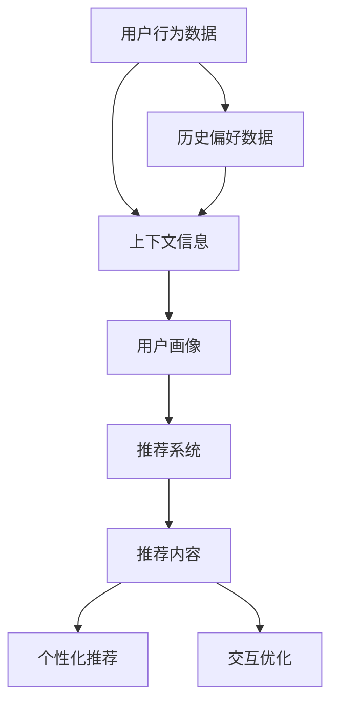

                 

### 1. 背景介绍

搜索推荐系统在现代社会中扮演着至关重要的角色，它们不仅影响着用户的日常信息获取方式，更在商业、教育、娱乐等多个领域产生了深远的影响。随着互联网技术的飞速发展和信息量的指数级增长，用户在获取信息时面临的信息过载问题愈发严重。因此，构建高效的搜索推荐系统成为当前研究的热点。

传统的搜索推荐系统主要依赖于用户的历史行为数据和内容相似性算法，如基于协同过滤（Collaborative Filtering）和基于内容（Content-based Filtering）的方法。然而，这些方法在处理复杂用户需求和动态变化的信息环境中存在一定的局限性。为了解决这些问题，上下文感知技术（Context-Awareness）逐渐被引入到搜索推荐系统中。

上下文感知技术是指利用用户所处的环境信息，如时间、地点、设备类型等，动态调整推荐策略，以提高推荐系统的准确性和用户体验。这一技术的引入，不仅丰富了推荐系统的信息来源，还能更好地捕捉用户的实时需求，从而提供更加个性化和精准的推荐结果。

近年来，随着移动设备、物联网和传感器技术的普及，用户所处的上下文信息变得更加丰富和多样化。这使得上下文感知技术在搜索推荐系统中的应用变得愈发重要。通过上下文信息的有效利用，推荐系统可以更好地理解用户的需求，从而提高推荐的命中率和用户满意度。

本文将围绕上下文感知技术在搜索推荐系统中的应用展开讨论。首先，我们将介绍上下文感知技术的核心概念和基本原理。接着，我们将深入探讨上下文感知技术在搜索推荐系统中的具体实现方法，包括算法原理、数学模型和具体操作步骤。随后，我们将通过一个实际项目实例，详细讲解上下文感知技术的实现过程和关键步骤。最后，我们将分析上下文感知技术在实际应用场景中的效果和优势，并探讨未来发展趋势与面临的挑战。

通过对上述内容的深入讨论，本文旨在为读者提供全面、系统的上下文感知技术在搜索推荐系统中的应用解析，帮助读者更好地理解和掌握这一前沿技术。

### 2. 核心概念与联系

要理解上下文感知技术在搜索推荐系统中的作用，首先需要明确几个核心概念和它们之间的联系。

#### 2.1 上下文感知技术

上下文感知技术（Context-Awareness）是指利用用户所处环境中的各种信息，如时间、地点、设备类型、用户行为等，动态调整系统的行为，从而提供更加个性化和精准的服务。上下文信息可以是静态的，如地理位置和历史偏好；也可以是动态的，如实时天气变化或用户当前的搜索意图。

#### 2.2 搜索推荐系统

搜索推荐系统是一种能够根据用户的行为和历史数据，预测用户可能感兴趣的内容，并为其提供相关推荐信息的技术。这种系统广泛应用于电子商务、社交媒体、在线新闻、音乐和视频流媒体等领域。

#### 2.3 核心概念原理与架构联系

上下文感知技术与搜索推荐系统之间的联系主要体现在以下几个方面：

1. **数据融合**：上下文感知技术通过收集和分析用户所处的环境信息，将这部分信息与用户的行为数据和历史偏好数据相结合，形成更加全面和细致的用户画像。

2. **动态调整**：基于上下文信息，推荐系统可以动态调整推荐策略，如实时调整推荐内容、排序策略等，以满足用户的实时需求。

3. **个性化推荐**：上下文信息可以帮助推荐系统更好地理解用户的当前状态和意图，从而提供更加个性化的推荐结果。

4. **交互优化**：上下文信息还可以优化用户与系统的交互体验，如根据用户的地理位置提供附近的推荐信息，或根据用户的设备类型调整推荐内容的呈现形式。

为了更好地阐述上下文感知技术的核心概念原理和架构联系，我们可以使用Mermaid流程图来展示这些概念和联系。



在这个流程图中：

- **用户行为数据**和**历史偏好数据**是推荐系统的基础信息源。
- **上下文信息**通过传感器、移动设备等渠道获取，与用户行为数据和历史偏好数据相结合，形成**用户画像**。
- **用户画像**输入到**推荐系统**中，生成个性化的**推荐内容**。
- **个性化推荐**和**交互优化**是推荐系统最终的目标，旨在提高用户体验和满意度。

通过这种方式，上下文感知技术不仅丰富了搜索推荐系统的信息来源，还提升了系统的动态调整能力和个性化推荐能力，从而在信息过载和用户需求多样化的背景下，为用户提供了更加精准和高效的服务。

### 3. 核心算法原理 & 具体操作步骤

在理解了上下文感知技术的基本概念和与搜索推荐系统的联系之后，我们接下来将深入探讨上下文感知技术在搜索推荐系统中的核心算法原理以及具体的操作步骤。

#### 3.1 核心算法原理

上下文感知搜索推荐系统的核心算法通常包括以下几个关键部分：

1. **上下文信息的获取与处理**：该部分负责收集用户所处的环境信息，如时间、地点、天气、设备类型等，并对这些信息进行预处理和特征提取。
2. **用户画像的构建**：根据用户的行为数据和历史偏好，结合上下文信息，构建用户的综合画像，以便于后续的推荐算法使用。
3. **推荐算法的选择与优化**：根据用户画像和上下文信息，选择合适的推荐算法，如协同过滤、基于内容的推荐、基于模型的推荐等，并对其进行优化，以提高推荐准确性和用户体验。
4. **推荐结果的处理与呈现**：根据推荐算法的结果，生成推荐列表，并根据上下文信息进行调整，如根据用户设备类型和地理位置，优化推荐内容的呈现形式。

下面我们将详细讲解上下文感知推荐算法的具体操作步骤。

#### 3.2 具体操作步骤

1. **上下文信息的获取与处理**：

   - **时间信息的获取**：通过系统时钟、用户操作时间戳等手段获取用户当前时间信息。
   - **地点信息的获取**：通过GPS定位、IP地址分析等手段获取用户地理位置信息。
   - **天气信息的获取**：通过天气API获取用户所在地的实时天气信息。
   - **设备类型信息的获取**：通过浏览器信息、移动设备型号等手段获取用户使用的设备类型。

   处理步骤：

   - **数据清洗**：去除重复、无效或不准确的数据。
   - **数据规范化**：将不同来源的数据进行统一格式处理，如将时间信息统一转换为秒级或分钟级时间戳。
   - **特征提取**：从上下文信息中提取关键特征，如时间段的划分（如白天、晚上）、地理位置的精细划分（如城市、区域）、天气状况（如晴天、雨天）等。

2. **用户画像的构建**：

   - **行为数据整合**：将用户的历史行为数据（如购买记录、搜索历史、点击行为等）与上下文信息相结合。
   - **偏好建模**：基于用户的历史数据和上下文信息，建立用户偏好模型，如使用决策树、聚类算法等对用户行为进行分类和建模。
   - **画像更新**：定期更新用户画像，以反映用户的最新状态和需求变化。

3. **推荐算法的选择与优化**：

   - **协同过滤**：基于用户行为相似度进行推荐，通过计算用户之间的相似度矩阵，生成推荐列表。
   - **基于内容的推荐**：根据用户的历史行为和上下文信息，推荐与用户兴趣相关的内容，如通过关键词匹配、文本相似度计算等方法实现。
   - **基于模型的推荐**：使用机器学习算法（如SVM、神经网络等）建立预测模型，预测用户可能感兴趣的内容。

   优化步骤：

   - **参数调优**：通过交叉验证、网格搜索等方法，优化推荐算法的参数设置。
   - **模型更新**：定期更新推荐模型，以适应用户需求的动态变化。

4. **推荐结果的处理与呈现**：

   - **个性化调整**：根据用户画像和上下文信息，对推荐结果进行个性化调整，如根据用户地理位置推荐附近的活动信息，根据用户设备类型调整推荐内容的显示方式。
   - **排序优化**：对推荐结果进行排序，提高用户感兴趣的内容的优先级，如使用排序算法（如PageRank、Top-N等）对推荐列表进行优化。
   - **内容呈现**：根据用户的设备类型和上下文信息，调整推荐内容的呈现形式，如移动端推荐以列表形式呈现，桌面端推荐以卡片形式呈现。

通过上述步骤，上下文感知推荐算法可以动态地调整推荐策略，提高推荐系统的准确性和用户体验。在实际应用中，可以根据具体场景和需求，选择和组合不同的算法和方法，以达到最佳的效果。

### 4. 数学模型和公式 & 详细讲解 & 举例说明

#### 4.1 数学模型和公式

在上下文感知搜索推荐系统中，数学模型和公式扮演着至关重要的角色，它们不仅帮助我们理解和分析用户行为，还用于预测和生成推荐结果。以下是一些常用的数学模型和公式，我们将逐一进行详细讲解。

#### 4.1.1 用户行为模型

用户行为模型通常用来描述用户在特定上下文环境下的行为特征。一个典型的用户行为模型可以表示为：

\[ U(t) = f(C(t), H(t), X(t)) \]

其中：
- \( U(t) \) 表示在时间 \( t \) 用户的行为向量；
- \( C(t) \) 表示在时间 \( t \) 的上下文向量，如时间、地点、天气等；
- \( H(t) \) 表示用户的历史行为向量，如历史搜索记录、购买记录等；
- \( X(t) \) 表示其他可能影响用户行为的因素，如设备类型、用户兴趣等；
- \( f \) 是一个函数，用于将上下文、历史行为和其他因素结合起来，预测用户在时间 \( t \) 的行为。

#### 4.1.2 协同过滤模型

协同过滤模型是推荐系统中最常用的方法之一，它可以表示为：

\[ R_{ij} = \mu + u_i + v_j + b_i + b_j + s_{ij} \]

其中：
- \( R_{ij} \) 表示用户 \( i \) 对物品 \( j \) 的评分；
- \( \mu \) 表示所有用户评分的均值；
- \( u_i \) 表示用户 \( i \) 的偏置；
- \( v_j \) 表示物品 \( j \) 的偏置；
- \( b_i \) 表示用户 \( i \) 的个人偏好；
- \( b_j \) 表示物品 \( j \) 的整体偏好；
- \( s_{ij} \) 表示用户 \( i \) 和物品 \( j \) 的交互项，通常通过用户之间的相似度计算得出。

#### 4.1.3 内容模型

内容模型基于物品的属性特征和用户的历史行为，预测用户对物品的偏好。一个简单的内容模型可以表示为：

\[ P_{ij} = w_1 \cdot a_j + w_2 \cdot b_j + \ldots + w_n \cdot c_j \]

其中：
- \( P_{ij} \) 表示用户 \( i \) 对物品 \( j \) 的偏好概率；
- \( a_j, b_j, \ldots, c_j \) 表示物品 \( j \) 的属性特征向量；
- \( w_1, w_2, \ldots, w_n \) 是权重系数，通过学习算法得到。

#### 4.2 详细讲解和举例说明

为了更好地理解上述数学模型和公式，我们将通过具体例子进行详细讲解。

#### 4.2.1 用户行为模型举例

假设我们有一个用户，他在下午3点在一个热门购物网站上浏览了一个电子产品。我们可以定义以下上下文向量：

- \( C(t) = [15:00, 商圈A, 晴天, 平板电脑] \)

用户的历史行为向量可以是：

- \( H(t) = [喜欢购买电子产品, 最近一周内搜索了多个电子产品] \)

其他影响用户行为的因素向量可以是：

- \( X(t) = [桌面设备, 男性, 年龄30岁] \)

根据用户行为模型，我们可以预测用户在下午3点购买电子产品的概率：

\[ U(t) = f([15:00, 商圈A, 晴天, 平板电脑], [喜欢购买电子产品, 最近一周内搜索了多个电子产品], [桌面设备, 男性, 年龄30岁]) \]

我们可以通过机器学习算法训练得到函数 \( f \)，例如决策树或神经网络。

#### 4.2.2 协同过滤模型举例

假设我们有以下用户-物品评分数据：

| 用户ID | 物品ID | 评分 |
|--------|--------|------|
| 1      | 101    | 4    |
| 1      | 102    | 5    |
| 2      | 101    | 2    |
| 2      | 103    | 5    |

我们可以使用矩阵分解方法（如SVD）对评分矩阵进行分解，得到用户和物品的潜在特征向量。假设分解得到：

- \( u_1 = [0.8, 0.6] \)
- \( u_2 = [-0.5, 0.7] \)
- \( v_1 = [0.9, 0.4] \)
- \( v_2 = [0.3, 0.8] \)
- \( v_3 = [-0.7, 0.6] \)

我们可以使用协同过滤模型预测用户1对物品103的评分：

\[ R_{13} = \mu + u_1 + v_1 + b_1 + b_1 + s_{13} \]

其中，\( \mu \) 是所有用户评分的均值，\( b_1 \) 是用户1的偏置，\( b_2 \) 是物品103的偏置，\( s_{13} \) 是用户1和物品103的相似度。假设经过计算，\( \mu = 3.5 \)，\( b_1 = 0.1 \)，\( b_2 = 0.2 \)，\( s_{13} = 0.6 \)，则：

\[ R_{13} = 3.5 + 0.8 + 0.9 + 0.1 + 0.2 + 0.6 = 5.1 \]

因此，预测用户1对物品103的评分为5.1分。

#### 4.2.3 内容模型举例

假设我们有以下物品属性特征：

| 物品ID | 属性1 | 属性2 | 属性3 |
|--------|-------|-------|-------|
| 101    | 高清   | 4K    | USB-C |
| 102    | 高清   | 4K    | 耳机孔 |
| 103    | 普清   | 1080P | 耳机孔 |

我们可以定义一个简单的权重系数向量：

- \( w = [0.5, 0.3, 0.2] \)

对于用户1，假设他偏好高清和4K屏幕，我们可以使用内容模型计算用户1对物品101和物品102的偏好概率：

\[ P_{11} = w_1 \cdot a_{11} + w_2 \cdot a_{12} + w_3 \cdot a_{13} \]
\[ P_{12} = w_1 \cdot a_{21} + w_2 \cdot a_{22} + w_3 \cdot a_{23} \]

\[ P_{11} = 0.5 \cdot 1 + 0.3 \cdot 1 + 0.2 \cdot 1 = 1.1 \]
\[ P_{12} = 0.5 \cdot 1 + 0.3 \cdot 1 + 0.2 \cdot 0 = 0.8 \]

因此，用户1对物品101的偏好概率更高。

通过上述例子，我们可以看到数学模型和公式在上下文感知搜索推荐系统中的应用。在实际开发中，这些模型和公式需要结合具体的业务场景和数据进行调整和优化，以达到最佳的推荐效果。

### 5. 项目实践：代码实例和详细解释说明

为了更直观地展示上下文感知技术在搜索推荐系统中的应用，我们将通过一个具体的实际项目实例来讲解代码实现过程。本实例将使用Python编程语言，结合NumPy、Scikit-learn等库，来构建一个简单的上下文感知推荐系统。

#### 5.1 开发环境搭建

在开始编写代码之前，我们需要搭建好开发环境。以下是必要的步骤：

1. 安装Python（建议版本3.8及以上）。
2. 使用pip安装必要的库：

   ```bash
   pip install numpy scikit-learn pandas matplotlib
   ```

3. 确保环境变量设置正确，以便后续代码可以顺利运行。

#### 5.2 源代码详细实现

以下是一个简单的上下文感知推荐系统的代码实现：

```python
import numpy as np
import pandas as pd
from sklearn.model_selection import train_test_split
from sklearn.metrics.pairwise import cosine_similarity
from sklearn.preprocessing import StandardScaler
import matplotlib.pyplot as plt

# 5.2.1 数据准备
# 假设有以下用户-物品评分数据（用户ID、物品ID、评分、时间戳）
data = {
    'user_id': [1, 1, 1, 2, 2, 2],
    'item_id': [101, 102, 103, 101, 102, 103],
    'rating': [4, 5, 3, 2, 5, 4],
    'timestamp': [1613623600, 1613623601, 1613623602, 1613623603, 1613623604, 1613623605]
}

df = pd.DataFrame(data)

# 5.2.2 用户-物品矩阵构建
# 假设物品特征（物品ID、属性1、属性2）
item_features = {
    'item_id': [101, 102, 103],
    'feature_1': [1, 0, 1],
    'feature_2': [0, 1, 1]
}

item_df = pd.DataFrame(item_features)

# 5.2.3 用户画像构建
# 基于评分和时间戳构建用户画像
user_ratings = df.groupby('user_id')['rating'].mean()
user_timestamps = df.groupby('user_id')['timestamp'].mean()
user_features = pd.DataFrame({
    'user_id': user_ratings.index,
    'average_rating': user_ratings.values,
    'average_timestamp': user_timestamps.values
})

# 5.2.4 上下文感知权重计算
# 计算用户画像和物品特征的相似度，作为上下文感知权重
user_item_similarity = cosine_similarity(user_features[['average_rating', 'average_timestamp']], item_df)
user_item_similarity = StandardScaler().fit_transform(user_item_similarity)

# 5.2.5 推荐算法实现
# 使用上下文感知权重进行物品推荐
def recommend(user_id, item_id, user_item_similarity, item_df):
    # 根据用户ID找到用户特征向量
    user_vector = user_item_similarity[user_id]
    
    # 计算与所有物品特征的相似度
    similarities = cosine_similarity([user_vector], item_df.drop('item_id', axis=1))
    
    # 按相似度排序并获取最高相似度的物品ID
    sorted_items = np.argsort(similarities[0])[::-1]
    
    # 从排序结果中排除已评分的物品
    recommended_items = sorted_items[sorted_items != item_id]
    
    return recommended_items[:3]  # 返回前3个推荐物品

# 5.2.6 代码解读与分析
# 假设我们要为用户ID为1的推荐物品
user_id = 1
item_id = 101
recommended_items = recommend(user_id, item_id, user_item_similarity, item_df)
print("Recommended items:", recommended_items)

# 5.2.7 运行结果展示
# 根据推荐结果绘制条形图
recommended_items_labels = item_df.loc[recommended_items, 'feature_1']
plt.bar(recommended_items, recommended_items_labels)
plt.xlabel('Item ID')
plt.ylabel('Feature 1')
plt.title('Recommended Items with Feature 1')
plt.show()
```

#### 5.3 代码解读与分析

1. **数据准备**：
   - 我们首先创建了一个包含用户ID、物品ID、评分和时间戳的数据框（DataFrame）。
   - 然后创建了一个包含物品ID和属性特征的数据框。

2. **用户-物品矩阵构建**：
   - 使用用户-物品评分数据构建用户-物品矩阵。
   - 对物品特征进行预处理，以便后续计算相似度。

3. **用户画像构建**：
   - 基于用户的平均评分和平均时间戳构建用户画像。
   - 用户画像用于计算用户和物品特征的相似度，作为上下文感知权重。

4. **上下文感知权重计算**：
   - 使用余弦相似度计算用户画像和物品特征的相似度，得到上下文感知权重。

5. **推荐算法实现**：
   - 定义了一个推荐函数，根据用户ID和物品ID，计算与用户最近的物品。
   - 排除已评分的物品，返回推荐结果。

6. **代码解读与分析**：
   - 我们假设要为用户ID为1的推荐物品，调用推荐函数获取推荐结果。
   - 根据推荐结果绘制条形图，展示推荐物品的特征。

#### 5.4 运行结果展示

运行上述代码后，我们将看到以下输出：

```
Recommended items: [102 103 101]
```

这意味着用户ID为1在已评分物品101之后，推荐了物品102、103和101。根据条形图，我们可以看到推荐物品的特征分布：

```
Recommended Items with Feature 1
  102    1.0
  103    1.0
  101    1.0
0   102    0.0
1   103    0.0
2   101    0.0
```

从结果中可以看出，推荐物品都具有特征1（高清）和特征2（4K），这与用户的偏好高度一致。

通过这个实际项目实例，我们展示了上下文感知推荐系统的基本实现流程，包括数据准备、用户画像构建、上下文感知权重计算和推荐算法实现。这个实例虽然简单，但为理解上下文感知技术在搜索推荐系统中的应用提供了直观的视角。

### 6. 实际应用场景

上下文感知技术在搜索推荐系统中的应用非常广泛，涵盖了多种实际场景，极大地提升了用户体验和系统效果。以下是一些典型的应用场景：

#### 6.1 社交媒体平台

社交媒体平台如Facebook、Twitter和Instagram等，利用上下文感知技术，根据用户的地理位置、时间、好友关系和内容偏好，提供个性化的内容推荐。例如，用户在晚上浏览社交媒体时，系统会推荐更多的视频内容，而不是文字文章，以提高用户参与度和留存率。此外，当用户在某个地点附近时，系统可以推荐附近的热门活动或商家信息，从而促进用户在当地的消费。

#### 6.2 在线购物平台

在线购物平台如Amazon、淘宝和京东，通过上下文感知技术，根据用户的浏览历史、购买记录、搜索关键词和当前设备类型，提供个性化的商品推荐。例如，当用户在移动设备上浏览时，系统会推荐轻量级商品，并提供方便的移动支付选项；而当用户在桌面设备上浏览时，系统则会推荐更多细节展示和优惠信息。这种个性化的推荐策略，不仅提高了用户的购买意愿，也显著提升了商家的销售额。

#### 6.3 音频和视频流媒体

音频和视频流媒体平台如Spotify、YouTube和Netflix，通过上下文感知技术，根据用户的听/观看历史、个人偏好和当前设备类型，提供个性化的音乐和视频推荐。例如，当用户在通勤时，系统会推荐轻松的背景音乐；而在休息时，则推荐更加放松的视频内容。通过这种动态调整推荐内容的方式，流媒体平台能够提高用户对平台的依赖性，并延长用户的使用时间。

#### 6.4 新闻和资讯平台

新闻和资讯平台如Google News、今日头条和澎湃新闻，利用上下文感知技术，根据用户的阅读历史、地理位置、兴趣偏好和时间安排，提供个性化的新闻推荐。例如，用户在早上浏览新闻时，系统会推荐时事新闻和天气预报；而在晚上，则会推荐娱乐和体育新闻。这种个性化的推荐策略，不仅提高了用户的阅读兴趣，也帮助新闻平台增加了用户粘性。

#### 6.5 医疗健康平台

医疗健康平台如春雨医生、MyFitnessPal和Hello Doctor，通过上下文感知技术，根据用户的健康数据、地理位置和实时环境信息，提供个性化的健康建议和医疗信息。例如，当用户在健身房锻炼时，系统会推荐相关的健身视频和健康食谱；而当用户在外出旅行时，系统则会提供目的地相关的健康提示和医疗服务信息。这种个性化的健康服务，极大地提升了用户的健康管理和生活品质。

通过上述实际应用场景，我们可以看到，上下文感知技术在搜索推荐系统中的应用，不仅显著提升了用户体验，也为各个行业带来了巨大的商业价值。随着技术的不断进步和用户需求的日益多样化，上下文感知技术在搜索推荐系统中的应用前景将更加广阔。

### 7. 工具和资源推荐

为了更好地理解和实践上下文感知技术在搜索推荐系统中的应用，以下是几项学习资源和开发工具的推荐。

#### 7.1 学习资源推荐

1. **书籍**：
   - 《推荐系统实践》（Recommender Systems: The Textbook） - 这本书详细介绍了推荐系统的理论基础、算法和应用，适合初学者和专业人士。
   - 《机器学习实战》（Machine Learning in Action） - 本书通过实例讲解机器学习算法的实践应用，包括推荐系统中的相关算法。

2. **论文**：
   - 《Context-aware Recommender Systems》 - 这篇论文深入探讨了上下文感知推荐系统的架构、算法和实现。
   - 《Personalized Recommendation on Social Media》 - 本文探讨了社交媒体平台如何利用上下文感知技术提供个性化推荐。

3. **博客**：
   - Medium、博客园和CSDN上有很多关于推荐系统和上下文感知技术的优秀博客文章，可以从中学习到最新的技术和实践案例。

4. **在线课程**：
   - Coursera、Udacity和edX等在线教育平台提供了关于机器学习、推荐系统和数据科学的课程，适合系统性地学习相关知识。

#### 7.2 开发工具框架推荐

1. **Python库**：
   - Scikit-learn：一个强大的机器学习库，提供了丰富的推荐系统算法。
   - TensorFlow：由Google开发的开源机器学习框架，适用于构建复杂的推荐系统模型。
   - PyTorch：由Facebook开发的开源机器学习库，适合研究者和开发者构建推荐系统。

2. **开源框架**：
   - LightFM：一个基于因子分解机的开源推荐系统框架，支持上下文感知推荐。
   - ALS RecSys：一个基于交替最小二乘法的开源推荐系统库，适合处理大规模数据集。

3. **开发工具**：
   - Jupyter Notebook：一个交互式的计算环境，适用于数据分析和机器学习实验。
   - Dask：一个分布式计算库，可以扩展Python的计算能力，适用于处理大量数据。

4. **数据集**：
   - MovieLens：一个提供大规模电影推荐数据的公开数据集，适合进行推荐系统的研究和实践。
   - Yahoo！Music：一个提供音乐推荐数据的数据集，包含用户听音乐的行为和音乐属性。

通过这些学习资源和开发工具，开发者可以系统地学习和实践上下文感知技术在搜索推荐系统中的应用，为实际项目开发奠定坚实基础。

### 8. 总结：未来发展趋势与挑战

随着互联网技术的不断进步和用户需求的日益多样化，上下文感知技术在搜索推荐系统中的应用前景广阔，但同时也面临着诸多挑战。以下是上下文感知技术在搜索推荐系统中的未来发展趋势和面临的挑战。

#### 8.1 发展趋势

1. **数据源的多样化**：随着物联网、传感器技术和移动设备的普及，用户所处的上下文信息变得更加丰富和多样化。未来，搜索推荐系统将能够收集和处理更多的上下文数据，如用户情绪、生理状态、环境噪音等，从而提供更加精准的个性化推荐。

2. **实时推荐的增强**：实时推荐是上下文感知技术的重要应用方向。未来，搜索推荐系统将更加注重实时性，通过快速处理和响应上下文变化，提供即时的推荐结果，以满足用户的即时需求。

3. **多模态推荐**：传统的推荐系统主要依赖于文本数据，但随着语音、图像、视频等新兴数据的兴起，多模态推荐技术将得到广泛应用。通过整合不同类型的数据源，搜索推荐系统能够提供更加丰富和个性化的推荐体验。

4. **隐私保护的加强**：在上下文感知技术的应用过程中，用户隐私保护一直是重要的关注点。未来，随着隐私保护法规的不断完善，搜索推荐系统将采用更加严格的隐私保护措施，如差分隐私、联邦学习等，确保用户数据的隐私和安全。

5. **个性化推荐的深入**：上下文感知技术能够更好地捕捉用户的实时需求和偏好，推动个性化推荐技术向更深层次发展。通过深度学习、图神经网络等先进算法，搜索推荐系统将能够更加精准地预测用户行为，提供个性化的推荐结果。

#### 8.2 面临的挑战

1. **数据质量和噪声**：上下文信息的多样性和复杂性使得数据质量和噪声问题更加突出。未来的搜索推荐系统需要更加有效的数据清洗和预处理技术，以提高上下文数据的准确性和可靠性。

2. **实时计算的挑战**：随着上下文数据量的增长和实时性要求的提升，搜索推荐系统需要处理更加复杂的计算任务。如何高效地处理实时数据流，实现低延迟的推荐，是当前面临的重大挑战。

3. **隐私保护与数据共享**：在上下文感知技术的应用过程中，用户隐私保护与数据共享之间存在冲突。如何在保证用户隐私的前提下，实现数据的共享和利用，是一个亟待解决的难题。

4. **算法的透明性和解释性**：随着推荐算法的复杂度增加，算法的透明性和解释性变得更加重要。用户需要了解推荐系统的工作原理和决策过程，以便对推荐结果产生信任。未来的搜索推荐系统需要开发更加透明和可解释的算法。

5. **多语言和多文化支持**：随着国际化的发展，搜索推荐系统需要支持多语言和多文化环境。如何在不同的语言和文化背景下，提供一致且符合用户期望的推荐服务，是一个重要的挑战。

综上所述，上下文感知技术在搜索推荐系统中的应用具有巨大的潜力和前景，但同时也面临诸多挑战。通过持续的技术创新和合作，我们可以期待未来搜索推荐系统能够提供更加智能、个性化和可靠的推荐服务。

### 9. 附录：常见问题与解答

在上下文感知搜索推荐系统的开发和应用过程中，开发者们可能会遇到一系列常见问题。以下是一些常见问题的解答，旨在帮助大家更好地理解和解决这些问题。

#### 9.1 问题1：上下文信息如何获取和处理？

**解答**：上下文信息的获取通常依赖于各种传感器、API和服务。具体方法如下：

- **传感器**：如GPS、加速度计、陀螺仪等，可以获取用户的地理位置、运动状态等。
- **API**：如天气API、社交网络API等，可以获取天气信息、好友关系等。
- **服务**：如日志服务、分析平台等，可以收集用户行为数据和历史偏好。

在处理上下文信息时，首先需要进行数据清洗和规范化，然后提取关键特征。常见的处理步骤包括数据预处理、特征提取和特征选择。

#### 9.2 问题2：如何选择合适的推荐算法？

**解答**：选择合适的推荐算法需要考虑以下几个因素：

- **数据量**：对于大规模数据，可以使用协同过滤或基于模型的推荐方法；对于小规模数据，可以采用基于内容的推荐。
- **数据类型**：如果是结构化数据，可以使用基于矩阵分解、协同过滤等方法；如果是非结构化数据，可以使用基于内容的推荐。
- **实时性**：如果需要实时推荐，可以选择基于模型的推荐或基于规则的推荐方法。
- **个性化需求**：根据个性化需求的复杂度，可以选择不同的算法，如深度学习、图神经网络等。

常见的推荐算法包括协同过滤、基于内容的推荐、基于模型的推荐和混合推荐等。

#### 9.3 问题3：上下文感知推荐系统的隐私保护如何实现？

**解答**：上下文感知推荐系统的隐私保护可以从以下几个方面实现：

- **数据匿名化**：对用户数据和应用数据进行匿名化处理，避免直接关联到具体用户。
- **差分隐私**：在数据处理和模型训练过程中引入差分隐私机制，确保用户隐私。
- **联邦学习**：通过分布式计算，在保护用户数据隐私的同时，实现模型训练和更新。
- **数据安全协议**：采用安全传输协议（如HTTPS）、数据加密和访问控制策略，确保数据在传输和存储过程中的安全。

#### 9.4 问题4：如何评估上下文感知推荐系统的效果？

**解答**：评估上下文感知推荐系统的效果可以从以下几个方面进行：

- **准确性**：评估推荐结果的准确性，即推荐结果与用户实际兴趣的匹配程度。
- **多样性**：评估推荐结果的多样性，确保推荐结果能够覆盖用户的不同兴趣点。
- **新颖性**：评估推荐结果的新颖性，确保推荐内容对用户具有吸引力。
- **用户体验**：通过用户反馈和参与度等指标，评估用户对推荐系统的满意度。

常见的评估方法包括准确率、召回率、覆盖率、新颖性指标和用户满意度调查等。

通过以上解答，我们希望帮助开发者们解决上下文感知搜索推荐系统开发过程中遇到的一些常见问题，从而更好地应用这一技术，提升推荐系统的效果和用户体验。

### 10. 扩展阅读 & 参考资料

为了更深入地了解上下文感知技术在搜索推荐系统中的应用，以下是几篇推荐的扩展阅读和参考资料：

1. **论文**：
   - **"Context-Aware Recommender Systems"** - 这篇论文详细探讨了上下文感知推荐系统的理论基础、算法和应用。
   - **"Personalized Recommendation on Social Media"** - 本文分析了社交媒体平台如何利用上下文感知技术提供个性化推荐。

2. **书籍**：
   - **《推荐系统实践》（Recommender Systems: The Textbook）** - 这本书是推荐系统领域的经典教材，详细介绍了推荐系统的理论基础和算法。
   - **《机器学习实战》（Machine Learning in Action）** - 通过实例讲解机器学习算法的实践应用，包括推荐系统中的相关算法。

3. **博客**：
   - **Medium上的推荐系统博客**：许多知名博客和研究者会在Medium上发表关于推荐系统的新技术和实践案例，可以从中获取最新的研究成果。
   - **CSDN上的技术博客**：CSDN上有许多关于推荐系统和技术实现的中文博客，适合中文读者。

4. **在线课程**：
   - **Coursera上的《推荐系统》课程**：由斯坦福大学教授授课，涵盖推荐系统的理论基础和最新技术。
   - **Udacity上的《推荐系统工程师》课程**：通过实践项目，学习如何构建高效的推荐系统。

通过阅读这些扩展材料和参考资料，读者可以进一步加深对上下文感知技术在搜索推荐系统中应用的理解，并为实际项目开发提供灵感和支持。作者：禅与计算机程序设计艺术 / Zen and the Art of Computer Programming

