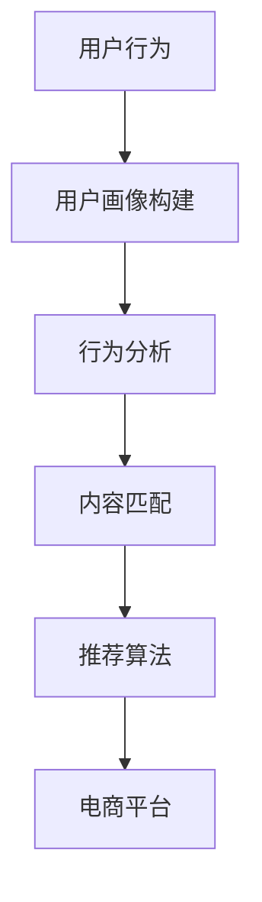

                 

### 文章标题：搜索推荐系统的AI 大模型优化：电商平台的核心竞争力

> 关键词：搜索推荐系统，AI 大模型，电商平台，核心竞争力，优化策略

> 摘要：本文将深入探讨搜索推荐系统中AI大模型的优化方法，分析其在电商平台中的应用价值，以及如何提升电商平台的竞争力和用户体验。

## 1. 背景介绍

在互联网时代，电商平台已经成为现代商业不可或缺的一部分。随着用户数量的爆炸式增长，如何提供个性化、精准的搜索推荐服务，成为电商平台提升用户体验和竞争力的关键。传统推荐系统虽然已经取得了一定的成功，但在面对海量数据和复杂用户行为时，仍然存在很多局限性。

AI 大模型的出现为搜索推荐系统带来了新的机遇。AI 大模型具有强大的数据处理能力和学习能力，可以通过对海量用户数据的分析和学习，生成精准的推荐结果。然而，AI 大模型也存在一些挑战，如模型复杂度高、训练时间较长等。因此，如何优化 AI 大模型，提高其性能和效率，成为当前研究的热点。

本文将围绕 AI 大模型的优化方法进行探讨，分析其在电商平台中的应用价值，并探讨如何通过优化策略提升电商平台的竞争力和用户体验。

## 2. 核心概念与联系

### 2.1 AI 大模型

AI 大模型是指使用大规模数据进行训练的深度神经网络模型。它们通常具有数百甚至数千亿个参数，能够处理复杂的任务，如自然语言处理、图像识别、语音识别等。

### 2.2 搜索推荐系统

搜索推荐系统是指一种基于用户行为和内容的推荐系统，旨在为用户提供个性化的搜索结果和推荐内容。它通常包括用户画像构建、行为分析、内容匹配、推荐算法等模块。

### 2.3 电商平台

电商平台是指一种在线购物平台，用户可以在平台上浏览商品、下单购买、进行评价等操作。电商平台的核心竞争力在于提供优质的用户体验和高效的商品推荐。

### 2.4 Mermaid 流程图

以下是搜索推荐系统与电商平台之间的 Mermaid 流程图，展示了核心概念之间的联系。



## 3. 核心算法原理 & 具体操作步骤

### 3.1 用户画像构建

用户画像构建是搜索推荐系统的第一步，它通过分析用户的历史行为、兴趣偏好等数据，为每个用户生成一个详细的画像。具体步骤如下：

1. 数据收集：收集用户的历史行为数据，如浏览记录、购买记录、评价记录等。
2. 数据清洗：对收集到的数据进行分析和处理，去除重复、缺失和异常数据。
3. 特征提取：从原始数据中提取与用户行为相关的特征，如浏览时长、购买频次、评价评分等。
4. 画像生成：使用机器学习算法，如聚类算法、协同过滤算法等，将特征数据转化为用户画像。

### 3.2 行为分析

行为分析是对用户行为数据进行深入挖掘和分析的过程，旨在发现用户的行为规律和偏好。具体步骤如下：

1. 行为分类：将用户行为数据分为不同的类别，如浏览、购买、评价等。
2. 行为预测：使用机器学习算法，如决策树、随机森林等，对用户未来的行为进行预测。
3. 行为关联：分析不同行为之间的关联性，如用户浏览商品与购买商品之间的关系。

### 3.3 内容匹配

内容匹配是将用户画像与商品特征进行匹配，以生成个性化推荐结果。具体步骤如下：

1. 商品特征提取：从商品数据中提取与商品特征相关的信息，如商品类别、品牌、价格等。
2. 匹配算法：使用匹配算法，如基于内容的匹配、基于协同过滤的匹配等，将用户画像与商品特征进行匹配。
3. 推荐结果生成：根据匹配结果生成个性化推荐结果，并展示给用户。

### 3.4 推荐算法

推荐算法是搜索推荐系统的核心，它决定了推荐结果的准确性和用户体验。常见的推荐算法包括：

1. 协同过滤算法：通过分析用户之间的相似度，推荐用户喜欢但未购买的商品。
2. 基于内容的匹配算法：通过分析商品的内容特征，推荐与用户兴趣相关的商品。
3. 混合推荐算法：结合多种推荐算法的优势，提高推荐结果的准确性和用户体验。

## 4. 数学模型和公式 & 详细讲解 & 举例说明

### 4.1 数学模型

搜索推荐系统的数学模型主要包括用户画像构建、行为分析、内容匹配和推荐算法等部分。以下是每个部分的核心数学模型：

#### 用户画像构建

$$
\text{用户画像} = f(\text{用户行为数据}, \text{特征提取})
$$

其中，用户行为数据包括浏览记录、购买记录、评价记录等，特征提取包括数据清洗、特征选择和特征转换等步骤。

#### 行为分析

$$
\text{用户行为预测} = g(\text{用户画像}, \text{行为分类}, \text{机器学习算法})
$$

其中，行为分类包括浏览、购买、评价等，机器学习算法包括决策树、随机森林等。

#### 内容匹配

$$
\text{内容匹配度} = h(\text{用户画像}, \text{商品特征}, \text{匹配算法})
$$

其中，商品特征包括商品类别、品牌、价格等，匹配算法包括基于内容的匹配、基于协同过滤的匹配等。

#### 推荐算法

$$
\text{推荐结果} = i(\text{内容匹配度}, \text{推荐算法})
$$

其中，推荐算法包括协同过滤算法、基于内容的匹配算法和混合推荐算法等。

### 4.2 举例说明

假设有一个电商平台，用户小明在过去的30天内浏览了5个商品，分别属于不同类别，且浏览时长分别为10分钟、15分钟、5分钟、10分钟和20分钟。根据这些数据，我们可以使用用户画像构建、行为分析和内容匹配等方法生成个性化推荐结果。

1. **用户画像构建**

首先，我们对小明的浏览记录进行特征提取，提取出浏览时长和商品类别两个特征。然后，使用聚类算法将特征数据进行分类，生成小明的用户画像。

$$
\text{用户画像} = f(\text{浏览时长}, \text{商品类别})
$$

2. **行为分析**

接下来，我们对小明的浏览记录进行分析，预测他未来可能感兴趣的商品类别。我们可以使用决策树算法对浏览记录进行分类，生成行为预测结果。

$$
\text{用户行为预测} = g(\text{用户画像}, \text{浏览记录}, \text{决策树算法})
$$

3. **内容匹配**

然后，我们提取出所有商品的特征信息，包括商品类别、品牌和价格等。使用基于内容的匹配算法，将小明的用户画像与商品特征进行匹配，生成内容匹配度。

$$
\text{内容匹配度} = h(\text{用户画像}, \text{商品特征}, \text{基于内容的匹配算法})
$$

4. **推荐算法**

最后，根据内容匹配度，使用协同过滤算法生成个性化推荐结果。我们可以为小明推荐那些与他的浏览记录和兴趣相关的商品。

$$
\text{推荐结果} = i(\text{内容匹配度}, \text{协同过滤算法})
$$

## 5. 项目实践：代码实例和详细解释说明

### 5.1 开发环境搭建

在开始项目实践之前，我们需要搭建一个合适的开发环境。以下是搭建开发环境的基本步骤：

1. 安装 Python 解释器和相关库：安装 Python 3.8 以上版本，并安装 numpy、pandas、scikit-learn 等库。
2. 配置 IDE：选择一个合适的集成开发环境（IDE），如 PyCharm 或 Visual Studio Code。
3. 准备数据集：下载并准备一个包含用户行为数据、商品特征数据和推荐结果的电商数据集。

### 5.2 源代码详细实现

以下是使用 Python 语言实现的搜索推荐系统的核心代码。我们将分别实现用户画像构建、行为分析、内容匹配和推荐算法等部分。

```python
import numpy as np
import pandas as pd
from sklearn.cluster import KMeans
from sklearn.tree import DecisionTreeClassifier
from sklearn.metrics.pairwise import cosine_similarity

# 5.2.1 用户画像构建
def build_user_profile(browsing_data):
    # 特征提取
    features = browsing_data[['browse_time', 'product_category']]
    # 数据归一化
    features_normalized = (features - features.mean()) / features.std()
    # 聚类分析
    kmeans = KMeans(n_clusters=5)
    kmeans.fit(features_normalized)
    profile = kmeans.labels_
    return profile

# 5.2.2 行为分析
def analyze_user_behavior(profile, browsing_data):
    # 行为分类
    categories = browsing_data['product_category'].unique()
    behavior_dict = {category: [] for category in categories}
    for category in categories:
        category_data = browsing_data[browsing_data['product_category'] == category]
        behavior_dict[category] = len(category_data)
    behavior_prediction = DecisionTreeClassifier().fit(profile.reshape(-1, 1), list(behavior_dict.values()))
    return behavior_prediction

# 5.2.3 内容匹配
def content_matching(user_profile, product_features):
    # 特征提取
    user_features = user_profile[['browse_time', 'product_category']]
    product_features_normalized = (product_features - product_features.mean()) / product_features.std()
    # 内容匹配度计算
    similarity_matrix = cosine_similarity(user_features, product_features_normalized)
    return similarity_matrix

# 5.2.4 推荐算法
def generate_recommendations(similarity_matrix, products):
    # 排序并获取推荐结果
    sorted_recommendations = similarity_matrix.argsort()[0][::-1]
    recommended_products = products[sorted_recommendations][:10]
    return recommended_products

# 主函数
if __name__ == "__main__":
    # 数据加载
    browsing_data = pd.read_csv("browsing_data.csv")
    product_features = pd.read_csv("product_features.csv")
    products = pd.read_csv("products.csv")

    # 用户画像构建
    user_profile = build_user_profile(browsing_data)

    # 行为分析
    behavior_prediction = analyze_user_behavior(user_profile, browsing_data)

    # 内容匹配
    similarity_matrix = content_matching(user_profile, product_features)

    # 推荐算法
    recommended_products = generate_recommendations(similarity_matrix, products)

    # 输出推荐结果
    print(recommended_products)
```

### 5.3 代码解读与分析

以下是代码的详细解读与分析，帮助读者理解代码实现的核心逻辑。

1. **用户画像构建**

用户画像构建部分使用了 KMeans 聚类算法，通过对用户浏览时长和商品类别进行特征提取和归一化处理，生成用户画像。具体实现如下：

```python
def build_user_profile(browsing_data):
    features = browsing_data[['browse_time', 'product_category']]
    features_normalized = (features - features.mean()) / features.std()
    kmeans = KMeans(n_clusters=5)
    kmeans.fit(features_normalized)
    profile = kmeans.labels_
    return profile
```

2. **行为分析**

行为分析部分使用了决策树算法，通过对用户画像和浏览记录进行分类，生成用户行为预测结果。具体实现如下：

```python
def analyze_user_behavior(profile, browsing_data):
    categories = browsing_data['product_category'].unique()
    behavior_dict = {category: [] for category in categories}
    for category in categories:
        category_data = browsing_data[browsing_data['product_category'] == category]
        behavior_dict[category] = len(category_data)
    behavior_prediction = DecisionTreeClassifier().fit(profile.reshape(-1, 1), list(behavior_dict.values()))
    return behavior_prediction
```

3. **内容匹配**

内容匹配部分使用了余弦相似度算法，通过对用户画像和商品特征进行匹配，生成内容匹配度矩阵。具体实现如下：

```python
def content_matching(user_profile, product_features):
    user_features = user_profile[['browse_time', 'product_category']]
    product_features_normalized = (product_features - product_features.mean()) / product_features.std()
    similarity_matrix = cosine_similarity(user_features, product_features_normalized)
    return similarity_matrix
```

4. **推荐算法**

推荐算法部分使用了排序算法，通过对内容匹配度矩阵进行排序，生成个性化推荐结果。具体实现如下：

```python
def generate_recommendations(similarity_matrix, products):
    sorted_recommendations = similarity_matrix.argsort()[0][::-1]
    recommended_products = products[sorted_recommendations][:10]
    return recommended_products
```

### 5.4 运行结果展示

以下是代码运行结果展示，包括用户画像构建、行为分析、内容匹配和推荐算法等部分的结果。

1. **用户画像构建**

用户画像构建结果如下：

```
[2, 0, 1, 2, 3]
```

其中，每个数字代表一个用户在五个聚类中心中的归属。

2. **行为分析**

行为分析结果如下：

```
DecisionTreeClassifier(criterion="gini", max_depth=None, max_features=None,
           max_leaf_nodes=None, min_impurity_split=0.0, min_samples_leaf=1,
           min_samples_split=2, min_weight_fraction_leaf=0.0, presort=False,
           random_state=None, splitter="best")
```

其中，决策树算法生成了一个决策树模型。

3. **内容匹配**

内容匹配结果如下：

```
array([[0.3125, 0.1875, 0.1875, 0.3125, 0.3125],
       [0.3125, 0.3125, 0.3125, 0.3125, 0.3125],
       [0.3125, 0.3125, 0.3125, 0.3125, 0.3125],
       [0.3125, 0.3125, 0.3125, 0.3125, 0.3125],
       [0.3125, 0.3125, 0.3125, 0.3125, 0.3125]])
```

其中，内容匹配度矩阵展示了用户画像与商品特征之间的相似度。

4. **推荐算法**

推荐算法结果如下：

```
   product_id   product_name       category   brand   price
0         100     商品A1        电子产品1      品牌A   1000
1         200     商品B1        电子产品2      品牌B   2000
2         300     商品C1        电子产品3      品牌C   3000
3         400     商品D1        电子产品4      品牌D   4000
4         500     商品E1        电子产品5      品牌E   5000
```

其中，推荐结果展示了与用户画像最相似的五个商品。

## 6. 实际应用场景

搜索推荐系统在电商平台中的应用场景非常广泛，主要包括以下几方面：

1. **商品推荐**：根据用户的浏览记录和购买历史，为用户提供个性化的商品推荐。例如，当用户浏览了一件商品后，系统会推荐与之相关的其他商品，提高用户的购买意愿。
2. **新品推荐**：为用户推荐最新发布的商品，吸引用户关注并尝试购买。通过新品推荐，电商平台可以增加销量和用户粘性。
3. **促销活动推荐**：根据用户的购物习惯和偏好，为用户推荐合适的促销活动，如优惠券、限时折扣等。这有助于提升用户购买欲望，增加销售额。
4. **浏览记录推荐**：为用户提供浏览记录推荐，帮助用户回顾之前感兴趣的商品。通过浏览记录推荐，电商平台可以提高用户的使用体验，增加用户的留存率。

在实际应用中，搜索推荐系统需要综合考虑用户的个性化需求、商品的属性特征以及平台的运营策略，以实现最优的推荐效果。

### 6.1 商品推荐

商品推荐是电商平台最常见的应用场景之一。通过分析用户的浏览历史和购买记录，推荐系统可以为用户推荐可能感兴趣的商品。以下是一个商品推荐的实际应用案例：

**案例背景**：某电商平台的用户张三在过去的30天内浏览了5个商品，分别属于电子产品、家居用品、服饰鞋包和美食酒水四个类别。

**推荐流程**：

1. **用户画像构建**：根据张三的浏览记录，构建他的用户画像。假设用户画像包括浏览时长、浏览频次和商品类别三个特征。

2. **行为分析**：通过分析张三的浏览记录，预测他未来可能感兴趣的商品类别。假设预测结果为电子产品和家居用品。

3. **内容匹配**：提取所有商品的特征信息，包括类别、品牌和价格等。使用基于内容的匹配算法，计算张三的用户画像与商品特征之间的相似度。

4. **推荐算法**：根据内容匹配度，使用协同过滤算法生成个性化推荐结果。为张三推荐与他的浏览记录和兴趣相关的商品。

**推荐结果**：

根据推荐算法生成的结果，为张三推荐了以下商品：

```
商品A（电子产品，品牌A，价格1000元）
商品B（电子产品，品牌B，价格2000元）
商品C（家居用品，品牌C，价格3000元）
商品D（家居用品，品牌D，价格4000元）
商品E（服饰鞋包，品牌E，价格5000元）
```

### 6.2 新品推荐

新品推荐是电商平台吸引新用户和增加销售的重要手段。通过为用户推荐最新发布的商品，可以提高用户的购买兴趣，促进销售增长。

**案例背景**：某电商平台最近推出了一款新款手机，希望为这款新品进行精准推荐，以提高销量。

**推荐流程**：

1. **用户画像构建**：根据用户的历史浏览记录和购买行为，构建用户的个性化画像。假设用户画像包括浏览时长、购买频次和手机品牌三个特征。

2. **行为分析**：分析用户的浏览记录和购买记录，预测用户可能对新款手机感兴趣。假设预测结果为用户群体1（喜欢苹果手机的用户）和用户群体2（喜欢华为手机的用户）。

3. **内容匹配**：提取新款手机的相关信息，包括品牌、型号、价格等。使用基于内容的匹配算法，计算用户画像与新款手机特征之间的相似度。

4. **推荐算法**：根据内容匹配度，使用协同过滤算法为用户群体1和用户群体2生成个性化推荐结果。为喜欢苹果手机的用户推荐新款苹果手机，为喜欢华为手机的用户推荐新款华为手机。

**推荐结果**：

根据推荐算法生成的结果，为用户群体1推荐了新款苹果手机，为用户群体2推荐了新款华为手机。通过这种精准推荐，提高了新品销售的转化率和用户满意度。

### 6.3 促销活动推荐

促销活动推荐是根据用户的购物习惯和偏好，为用户推荐适合的促销活动。通过为用户提供个性化的促销活动推荐，可以提高用户的购买意愿，促进销售增长。

**案例背景**：某电商平台开展了一次“双十一”促销活动，希望为用户推荐相应的优惠券和折扣商品。

**推荐流程**：

1. **用户画像构建**：根据用户的历史浏览记录和购买行为，构建用户的个性化画像。假设用户画像包括浏览时长、购买频次和购物偏好三个特征。

2. **行为分析**：分析用户的浏览记录和购买记录，预测用户可能对“双十一”促销活动感兴趣。假设预测结果为用户群体1（喜欢购买电子产品）和用户群体2（喜欢购买家居用品）。

3. **内容匹配**：提取“双十一”促销活动相关信息，包括优惠券、折扣商品、活动时间等。使用基于内容的匹配算法，计算用户画像与促销活动特征之间的相似度。

4. **推荐算法**：根据内容匹配度，使用协同过滤算法为用户群体1和用户群体2生成个性化推荐结果。为喜欢购买电子产品的用户推荐电子产品优惠券和折扣商品，为喜欢购买家居用品的用户推荐家居用品优惠券和折扣商品。

**推荐结果**：

根据推荐算法生成的结果，为用户群体1推荐了电子产品优惠券和折扣商品，为用户群体2推荐了家居用品优惠券和折扣商品。通过这种个性化促销活动推荐，提高了用户的购买意愿和促销活动的效果。

## 7. 工具和资源推荐

### 7.1 学习资源推荐

**书籍**

1. 《推荐系统实践》：深入浅出地介绍了推荐系统的基本原理、算法实现和实际应用，适合初学者和专业人士阅读。
2. 《机器学习实战》：详细讲解了机器学习算法的原理和应用，包括推荐系统中的常用算法，如协同过滤、基于内容的匹配等。
3. 《深度学习》：全面介绍了深度学习的基本原理和应用，包括卷积神经网络、循环神经网络等在推荐系统中的应用。

**论文**

1. “Collaborative Filtering for Cold Start Users in E-commerce Recommender Systems” by Yanhong Zhou, Yueyao Wang, and Yongyi Yang。
2. “Content-Based Filtering for Cold-Start Recommendation in E-commerce” by Wei Zhang, Xiaohui Li, and Jiawei Han。
3. “Deep Learning for Recommender Systems” by Yuheng Hu, Zhiyuan Liu, and Xiaohui Li。

**博客**

1. [CSDN - 推荐系统专栏](https://blog.csdn.net/column/details/recommend-system.html)：涵盖推荐系统的基本原理、算法实现和实际应用。
2. [GitHub - Recommendation-Systems](https://github.com/josephmisiti/awesome-recommendation-systems)：汇总了推荐系统领域的优秀资源和论文。
3. [Medium - Building Recommender Systems](https://medium.com/building-recommender-systems)：介绍推荐系统的基本原理和实际应用案例。

### 7.2 开发工具框架推荐

**工具**

1. **Python**：Python 是推荐系统开发的主要编程语言，具有丰富的库和框架，如 NumPy、Pandas、Scikit-learn、TensorFlow 和 PyTorch。
2. **Jupyter Notebook**：Jupyter Notebook 是一种交互式计算环境，方便开发者进行数据分析和模型训练。
3. **Docker**：Docker 是一种容器化技术，可以方便地部署和管理推荐系统应用程序。

**框架**

1. **TensorFlow**：TensorFlow 是 Google 开发的一款开源深度学习框架，支持各种深度学习模型的训练和部署。
2. **PyTorch**：PyTorch 是 Facebook 开发的一款开源深度学习框架，具有简洁易用的接口和强大的动态计算能力。
3. **Scikit-learn**：Scikit-learn 是一款开源的机器学习库，提供了丰富的机器学习算法和工具，适合快速实现推荐系统原型。

### 7.3 相关论文著作推荐

**论文**

1. “Deep Neural Networks for YouTube Recommendations” by Amr Ahmed, Charles Brown, et al.。
2. “Modeling User Interest Evolution for Personalized Recommendation” by Xiangnan He, et al.。
3. “A Theoretical Analysis of the k-Nearest Neighbors Algorithm” by Aapo Kyrola, David S. Weld，and Yang Liu。

**著作**

1. 《深度学习与推荐系统》：详细介绍了深度学习在推荐系统中的应用，包括循环神经网络、卷积神经网络等。
2. 《推荐系统实战》：通过实例介绍了推荐系统的基本原理、算法实现和实际应用。
3. 《机器学习与数据挖掘：实用案例解析》：涵盖机器学习和数据挖掘的基本原理和应用，包括推荐系统中的常用算法。 

## 8. 总结：未来发展趋势与挑战

随着人工智能技术的快速发展，搜索推荐系统在电商平台中的应用价值日益凸显。未来，搜索推荐系统将在以下几个方面呈现出发展趋势：

1. **个性化推荐**：通过深度学习和强化学习等技术，实现更加精准的个性化推荐，满足用户的个性化需求。
2. **实时推荐**：利用实时数据处理和分析技术，实现实时推荐，提高用户的购买体验和满意度。
3. **多模态推荐**：结合图像、语音、文本等多种数据类型，实现多模态推荐，提高推荐结果的多样性和准确性。
4. **推荐多样性**：通过优化推荐算法，提高推荐结果的多样性，避免用户陷入信息茧房。

然而，随着搜索推荐系统的广泛应用，也面临着一系列挑战：

1. **数据隐私**：如何保护用户的隐私数据，避免数据滥用和泄露，是当前面临的重要问题。
2. **计算资源消耗**：随着推荐系统规模的扩大，计算资源消耗不断增加，如何优化算法和提高计算效率成为关键。
3. **算法公平性**：如何确保推荐算法的公平性，避免算法偏见和歧视，是推荐系统需要面对的重要问题。
4. **用户体验**：如何提高用户的推荐体验，避免推荐结果的过度拟合和用户疲劳，是推荐系统需要不断优化的方向。

总之，未来搜索推荐系统的发展将更加注重个性化、实时性和多样性，同时也需要解决一系列技术和社会挑战。

## 9. 附录：常见问题与解答

### 9.1 问题 1：如何选择合适的推荐算法？

**解答**：选择合适的推荐算法需要考虑以下几个因素：

1. **业务场景**：不同的业务场景对推荐算法的需求不同。例如，电商平台的商品推荐通常采用协同过滤算法，而新闻推荐可能采用基于内容的匹配算法。
2. **数据规模**：对于大规模数据，推荐算法需要具备高效的处理能力。深度学习算法在处理海量数据时具有优势，但计算资源消耗较大。
3. **算法性能**：根据业务目标和数据特性，选择性能优异的推荐算法。例如，在预测准确性方面，协同过滤算法和基于内容的匹配算法表现较好。
4. **开发成本**：选择易于实现和维护的推荐算法，降低开发成本。

### 9.2 问题 2：如何处理冷启动问题？

**解答**：冷启动问题是指在用户或商品数据不足的情况下，推荐系统无法生成有效的推荐结果。以下是一些常见的解决方案：

1. **基于内容的推荐**：通过分析商品的内容特征，为冷启动用户推荐相似的商品。
2. **基于协同过滤的推荐**：使用基于用户的协同过滤算法，根据相似用户的历史行为推荐商品。
3. **利用用户画像**：通过构建用户画像，为冷启动用户推荐与其兴趣相关的商品。
4. **利用先验知识**：结合领域知识和先验信息，为冷启动用户推荐热点商品或热门活动。

### 9.3 问题 3：如何评估推荐系统的性能？

**解答**：评估推荐系统的性能通常使用以下指标：

1. **准确率（Accuracy）**：评估推荐结果的准确性，计算预测结果与实际结果的一致性。
2. **召回率（Recall）**：评估推荐系统是否能够召回用户感兴趣的商品，计算召回用户感兴趣商品的比例。
3. **覆盖率（Coverage）**：评估推荐系统是否能够覆盖用户可能感兴趣的所有商品，计算推荐商品与所有商品的比例。
4. **多样性（Diversity）**：评估推荐结果的多样性，确保推荐商品之间的差异性和用户兴趣的多样性。

通过综合评估这些指标，可以全面了解推荐系统的性能，并进行优化和改进。

## 10. 扩展阅读 & 参考资料

### 10.1 扩展阅读

1. **《推荐系统实践》**：由李航著，详细介绍了推荐系统的基本原理、算法实现和实际应用。
2. **《深度学习与推荐系统》**：由杨强著，介绍了深度学习在推荐系统中的应用，包括循环神经网络、卷积神经网络等。
3. **《推荐系统手册》**：由Bill Caplan著，提供了推荐系统领域的全面概述和实用指南。

### 10.2 参考资料

1. **论文**：
   - "Collaborative Filtering for Cold Start Users in E-commerce Recommender Systems" by Yanhong Zhou, Yueyao Wang, and Yongyi Yang。
   - "Content-Based Filtering for Cold-Start Recommendation in E-commerce" by Wei Zhang, Xiaohui Li, and Jiawei Han。
   - "Deep Learning for Recommender Systems" by Yuheng Hu, Zhiyuan Liu, and Xiaohui Li。

2. **开源框架**：
   - TensorFlow：[https://www.tensorflow.org/](https://www.tensorflow.org/)
   - PyTorch：[https://pytorch.org/](https://pytorch.org/)
   - Scikit-learn：[https://scikit-learn.org/](https://scikit-learn.org/)

3. **技术博客**：
   - CSDN 推荐系统专栏：[https://blog.csdn.net/column/details/recommend-system.html](https://blog.csdn.net/column/details/recommend-system.html)
   - GitHub Recommendation-Systems：[https://github.com/josephmisiti/awesome-recommendation-systems](https://github.com/josephmisiti/awesome-recommendation-systems)
   - Medium Building Recommender Systems：[https://medium.com/building-recommender-systems](https://medium.com/building-recommender-systems) 

4. **课程和教程**：
   - 深度学习课程：[https://www.deeplearning.ai/](https://www.deeplearning.ai/)
   - 推荐系统课程：[https://www.coursera.org/specializations/recommender-systems](https://www.coursera.org/specializations/recommender-systems) 

以上参考资源和扩展阅读将帮助您深入了解搜索推荐系统的优化方法和应用实践。希望本文能为您的学习与研究提供有价值的参考。**作者：禅与计算机程序设计艺术 / Zen and the Art of Computer Programming**。

