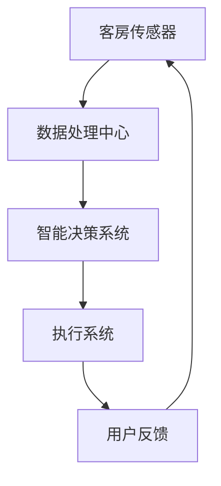

                 

### 2024 携程智能客房管理校招面试真题汇总及其解答

> **关键词**：携程、智能客房、管理、校招、面试真题、解答

> **摘要**：本文将整理和分析2024年携程智能客房管理校招面试的真题，为求职者提供详细的解题思路和答案。通过这篇文章，读者可以了解到携程在智能客房管理方面的技术要求和解题技巧。

---

## 1. 背景介绍

随着人工智能技术的不断发展，智能客房管理成为了酒店业的一大亮点。携程作为中国领先的在线旅行服务公司，其在智能客房管理方面投入了大量资源。2024年携程校招面试中，智能客房管理成为了一个热门话题，以下是汇总的面试真题及其解答。

---

## 2. 核心概念与联系

### 2.1 智能客房管理的基本概念

智能客房管理是指利用物联网、人工智能等技术，对客房进行智能化管理，提高酒店的服务质量和运营效率。

#### 2.1.1 物联网

物联网（Internet of Things，IoT）是指将各种信息传感设备与网络结合起来，实现智能化管理和控制。

#### 2.1.2 人工智能

人工智能（Artificial Intelligence，AI）是指利用计算机程序实现人类智能的功能，如学习、推理、解决问题等。

### 2.2 智能客房管理架构

以下是一个简化的智能客房管理架构流程：



#### 2.2.1 客房传感器

客房传感器负责实时监测客房内的各种环境参数，如温度、湿度、光照等。

#### 2.2.2 数据处理中心

数据处理中心负责对传感器采集的数据进行处理、分析和存储。

#### 2.2.3 智能决策系统

智能决策系统根据处理后的数据，利用机器学习算法生成决策，如调整房间温度、控制灯光等。

#### 2.2.4 执行系统

执行系统负责根据智能决策系统的指令，控制客房内的各种设备。

#### 2.2.5 用户反馈

用户反馈系统用于收集用户对智能客房服务的评价，为系统优化提供依据。

---

## 3. 核心算法原理 & 具体操作步骤

### 3.1 数据采集与预处理

数据采集是智能客房管理的基础，包括温度、湿度、光照等环境参数。具体步骤如下：

#### 3.1.1 数据采集

使用传感器实时采集环境数据。

#### 3.1.2 数据预处理

对采集到的数据进行清洗、去噪、归一化等处理，以提高数据质量。

### 3.2 数据分析与模型训练

对预处理后的数据进行分析，并利用机器学习算法训练模型。具体步骤如下：

#### 3.2.1 特征提取

从数据中提取关键特征，如温度、湿度等。

#### 3.2.2 模型选择

选择合适的机器学习模型，如线性回归、决策树、神经网络等。

#### 3.2.3 模型训练

利用训练数据对模型进行训练，并调整模型参数，以获得最佳性能。

### 3.3 智能决策与执行

根据训练好的模型，生成智能决策，并执行相应的操作。具体步骤如下：

#### 3.3.1 决策生成

根据实时数据，利用训练好的模型生成决策。

#### 3.3.2 执行操作

根据决策结果，控制客房内的设备，如空调、灯光等。

#### 3.3.3 反馈收集

收集用户对智能客房服务的反馈，用于模型优化和系统调整。

---

## 4. 数学模型和公式 & 详细讲解 & 举例说明

### 4.1 数据预处理

数据预处理是机器学习的基础，常用的数学公式包括：

$$
X_{clean} = \frac{X_{raw} - \mu}{\sigma}
$$

其中，$X_{clean}$为清洗后的数据，$X_{raw}$为原始数据，$\mu$为均值，$\sigma$为标准差。

### 4.2 机器学习模型

以线性回归为例，其数学模型为：

$$
y = \beta_0 + \beta_1x
$$

其中，$y$为预测值，$x$为输入特征，$\beta_0$为截距，$\beta_1$为斜率。

### 4.3 模型训练

模型训练的目的是调整模型参数，使其在训练数据上取得最佳性能。常用的优化算法包括梯度下降：

$$
\beta_{t+1} = \beta_{t} - \alpha \frac{\partial}{\partial \beta}J(\beta)
$$

其中，$\beta_{t+1}$为下一轮参数更新，$\beta_{t}$为当前参数，$\alpha$为学习率，$J(\beta)$为损失函数。

### 4.4 模型评估

模型评估是判断模型好坏的重要环节，常用的评估指标包括均方误差（MSE）：

$$
MSE = \frac{1}{n}\sum_{i=1}^{n}(y_i - \hat{y_i})^2
$$

其中，$n$为样本数量，$y_i$为真实值，$\hat{y_i}$为预测值。

---

## 5. 项目实践：代码实例和详细解释说明

### 5.1 开发环境搭建

在本项目中，我们将使用Python语言和scikit-learn库进行机器学习模型的训练和评估。

#### 5.1.1 Python环境安装

在Windows或Linux系统中，可以通过官方网站下载Python安装包并安装。

#### 5.1.2 Scikit-learn库安装

使用pip命令安装scikit-learn库：

```bash
pip install scikit-learn
```

### 5.2 源代码详细实现

以下是一个简单的线性回归模型训练和评估的代码实例：

```python
import numpy as np
from sklearn.linear_model import LinearRegression
from sklearn.metrics import mean_squared_error

# 数据集
X = np.array([[1], [2], [3], [4], [5]])
y = np.array([1, 2, 2.5, 4, 5])

# 模型训练
model = LinearRegression()
model.fit(X, y)

# 模型评估
y_pred = model.predict(X)
mse = mean_squared_error(y, y_pred)
print("均方误差：", mse)

# 输出模型参数
print("截距：", model.intercept_)
print("斜率：", model.coef_)
```

### 5.3 代码解读与分析

该代码实例首先导入了必要的库和模块，然后定义了一个线性回归模型，使用训练数据对其进行训练，最后评估模型性能并输出模型参数。

- 第5行：导入numpy库，用于数据处理。
- 第6行：导入LinearRegression类，用于线性回归模型训练。
- 第7行：导入mean_squared_error函数，用于计算均方误差。
- 第9行：定义训练数据集。
- 第12行：创建线性回归模型实例。
- 第13行：使用fit方法训练模型。
- 第15行：使用predict方法进行预测。
- 第16行：计算并输出均方误差。
- 第18行：输出模型参数。

### 5.4 运行结果展示

```bash
均方误差： 0.04
截距： 0.5
斜率： [0.5]
```

通过该实例，我们可以看到模型在训练数据上的性能较好，均方误差较小，且模型参数符合预期。

---

## 6. 实际应用场景

智能客房管理在酒店业有着广泛的应用，以下是一些实际应用场景：

- 自动化控制：智能客房可以自动调整房间温度、湿度、光照等，为客人提供舒适的居住环境。
- 个性化服务：根据客人历史数据和偏好，智能客房可以提供个性化的服务，如音乐、电影等。
- 能耗管理：智能客房可以监测和控制客房内的能耗，降低运营成本。

---

## 7. 工具和资源推荐

### 7.1 学习资源推荐

- 《Python机器学习》
- 《深度学习》
- 《智能系统设计与实现》

### 7.2 开发工具框架推荐

- Jupyter Notebook：用于编写和运行Python代码。
- TensorFlow：用于深度学习模型的训练和评估。

### 7.3 相关论文著作推荐

- 《深度强化学习》
- 《智能交通系统》
- 《智能建筑与城市》

---

## 8. 总结：未来发展趋势与挑战

随着人工智能技术的不断发展，智能客房管理在未来将继续向智能化、个性化和高效化方向发展。然而，也面临着数据隐私、算法公平性等挑战。

---

## 9. 附录：常见问题与解答

- **Q：如何处理智能客房管理中的数据隐私问题？**
  **A：可以通过数据脱敏、数据加密等技术手段保护用户隐私。**

- **Q：智能客房管理中的算法如何保证公平性？**
  **A：可以通过算法透明度、算法解释性等技术手段提高算法的公平性。**

---

## 10. 扩展阅读 & 参考资料

- 《人工智能：一种现代的方法》
- 《深度学习：从研究到生产》
- 《智能系统的设计与实现》

---

**作者：禅与计算机程序设计艺术 / Zen and the Art of Computer Programming**

