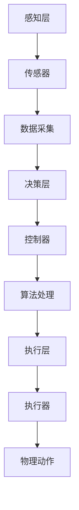

                 

### 背景介绍

数字与物理实体的自动化革命，是一场深刻影响我们生活的技术变革。在这个时代背景下，人工智能、大数据、物联网等前沿技术蓬勃发展，将数字世界与物理世界紧密连接。自动化技术逐渐成为现代工业、服务业、农业等各个领域的核心技术，推动了产业升级和社会进步。

自动化技术的发展历程可以追溯到20世纪初期。当时，随着工业革命的推进，工厂自动化需求逐渐显现。最早的自动化设备是机械式自动化机器，如机械手臂、传送带等。这些设备通过机械结构实现简单的自动化操作，提高了生产效率。然而，由于技术限制，这些设备的功能较为单一，无法应对复杂的生产需求。

20世纪中后期，随着计算机技术的飞速发展，自动化技术进入了一个新的阶段。计算机的出现使得自动化系统可以处理更复杂的信息，实现了自动化控制的智能化。早期的自动化控制系统主要基于规则和逻辑推理，通过编写程序来实现对物理世界的控制。这一阶段，自动化技术开始广泛应用于制造业、交通运输、医疗等领域。

21世纪初，随着人工智能技术的兴起，自动化技术迎来了新的变革。人工智能技术使得自动化系统具备了自我学习和自我优化能力，可以处理更复杂的任务。同时，物联网技术的发展，使得物理世界与数字世界的连接更加紧密，为自动化技术的广泛应用奠定了基础。

近年来，自动化技术在我国得到了高度重视和快速发展。国家政策层面，大力推动智能制造、工业互联网等战略布局，为自动化技术的发展提供了有力支持。产业层面，传统制造业加快自动化改造，新兴行业如智能物流、智能农业等快速发展，自动化技术在各行各业得到了广泛应用。

总体来看，自动化技术的发展经历了从机械自动化到计算机自动化，再到人工智能自动化的过程。未来，随着技术的不断进步，自动化技术将更加深入地融入各个领域，推动社会生产方式的变革。

在接下来的文章中，我们将深入探讨自动化技术的核心概念、算法原理、数学模型以及实际应用场景，帮助读者全面了解这一领域的最新进展和未来发展趋势。

### 核心概念与联系

#### 1. 自动化技术的基本概念

自动化技术是指利用计算机、机器人、传感器等现代信息技术，实现生产过程或服务过程的自动控制，提高生产效率和服务质量的一种技术。自动化技术的基本概念包括以下几个方面：

- **传感器**：传感器是自动化系统的感知器官，用于检测和测量物理世界中的各种参数，如温度、湿度、压力、位置等。传感器的数据是自动化系统进行决策和控制的基础。
- **执行器**：执行器是自动化系统的执行器官，根据自动化系统的指令，实现物理动作，如机械手的抓取、传送带的运行等。执行器的动作是自动化系统对物理世界施加影响的表现。
- **控制器**：控制器是自动化系统的核心，负责接收传感器的数据，通过算法处理和分析，生成控制指令，发送给执行器。控制器的功能是自动化系统的决策和执行中枢。

#### 2. 自动化技术的架构

自动化技术的架构可以分为三个层次：感知层、决策层和执行层。

- **感知层**：包括传感器和各种采集设备，用于获取物理世界的各种信息。感知层的数据质量直接影响自动化系统的决策效果。
- **决策层**：包括控制器和算法，负责接收感知层的数据，通过算法进行数据处理和分析，生成控制指令。决策层的核心是算法的优化和智能化。
- **执行层**：包括执行器和驱动设备，负责执行决策层的指令，实现物理动作。执行层的效率直接影响自动化系统的执行效果。

#### 3. 自动化技术的分类

根据自动化技术的应用领域和特点，可以将其分为以下几类：

- **工业自动化**：应用于制造业，如机械加工、组装、检测等，通过自动化设备提高生产效率和产品质量。
- **智能家居自动化**：应用于家庭环境，如智能照明、智能安防、智能家电等，提高家庭生活的舒适度和便利性。
- **物流自动化**：应用于物流行业，如智能仓储、智能配送、智能物流等，提高物流效率和服务质量。
- **医疗自动化**：应用于医疗服务，如智能诊断、智能治疗、智能康复等，提高医疗服务水平和患者体验。
- **农业自动化**：应用于农业生产，如智能灌溉、智能施肥、智能收割等，提高农业生产效率和农产品质量。

#### 4. 自动化技术的应用场景

自动化技术广泛应用于各个领域，以下是一些典型的应用场景：

- **工业生产**：自动化生产线、自动化装配、自动化检测等，提高生产效率和产品质量。
- **物流仓储**：智能仓储、自动化分拣、无人配送等，提高物流效率和降低成本。
- **家庭生活**：智能家电、智能安防、智能照明等，提高生活品质和便利性。
- **医疗服务**：智能诊断、智能治疗、智能康复等，提高医疗服务水平和患者体验。
- **农业生产**：智能灌溉、智能施肥、智能收割等，提高农业生产效率和农产品质量。

#### 5. 自动化技术对经济和社会的影响

自动化技术的发展不仅推动了产业升级和社会进步，也对经济和社会产生了深远影响：

- **经济影响**：自动化技术提高了生产效率和产品质量，降低了生产成本，促进了产业升级和经济发展。
- **社会影响**：自动化技术改变了人们的生活方式，提高了生活品质和便利性，促进了社会的进步和发展。

#### 6. 自动化技术的挑战与未来趋势

虽然自动化技术取得了显著成就，但同时也面临着一系列挑战：

- **技术挑战**：自动化技术的算法、硬件和软件技术仍需不断优化和突破，以适应更加复杂和多样化的应用场景。
- **伦理挑战**：自动化技术的广泛应用引发了关于隐私、安全、就业等方面的伦理争议，需要制定相应的法律法规和道德规范。
- **应用挑战**：自动化技术在某些领域的应用效果仍不理想，需要进一步研究和实践，以充分发挥其潜力。

未来，自动化技术将继续向智能化、网络化、绿色化方向发展，推动经济和社会的进一步发展。同时，也需要关注和解决其带来的挑战，确保自动化技术的可持续发展。

#### Mermaid 流程图

以下是自动化技术的核心概念与架构的 Mermaid 流程图：



在上述流程图中，传感器负责感知物理世界的数据，通过数据采集模块传输到控制器，控制器通过算法处理和分析，生成控制指令，发送给执行器，最终实现物理动作。这个过程构成了自动化技术的基本架构和运作原理。

### 核心算法原理 & 具体操作步骤

#### 1. 自动化控制算法的基本原理

自动化控制算法是自动化技术的核心，其基本原理是基于反馈控制理论。反馈控制理论主要包括开环控制和闭环控制两种方式。

- **开环控制**：开环控制是指系统的控制指令仅依赖于预设的目标值，而不考虑系统的当前状态。开环控制的特点是简单、实现成本低，但控制精度较低，对系统的不确定性和外界干扰敏感。
- **闭环控制**：闭环控制是指系统的控制指令不仅依赖于预设的目标值，还考虑系统的当前状态。闭环控制通过传感器实时获取系统状态信息，与目标值进行比较，通过控制器进行调节，从而实现对系统的精确控制。闭环控制的特点是控制精度高、适应性强，但实现成本较高。

在自动化控制中，常用的算法包括PID控制、模糊控制、神经网络控制等。以下是这些算法的基本原理和具体操作步骤。

#### 2. PID控制算法

PID控制算法是一种经典且广泛应用的反馈控制算法，其原理是基于比例（Proportional）、积分（Integral）和微分（Derivative）三部分进行控制。

- **比例控制**：比例控制是指根据当前系统偏差（目标值与当前值之差）的比例进行控制。比例控制可以快速响应系统偏差，但可能会导致系统产生过度反应。
- **积分控制**：积分控制是指根据当前系统偏差的积分进行控制。积分控制可以消除系统偏差的累积，提高控制精度，但可能会导致系统响应滞后。
- **微分控制**：微分控制是指根据当前系统偏差的微分进行控制。微分控制可以预测系统偏差的变化趋势，提高系统的动态响应性能。

PID控制算法的具体操作步骤如下：

1. **初始化参数**：设置PID控制器的比例（Kp）、积分（Ki）和微分（Kd）参数。
2. **获取当前系统状态**：通过传感器获取系统的当前状态值。
3. **计算控制量**：
   - 设目标值为设定值（Setpoint），当前值为测量值（Measured Value）。
   - 计算偏差（Error）= Setpoint - Measured Value。
   - 计算比例控制量（P）= Kp × Error。
   - 计算积分控制量（I）= Ki × ∫(Error dt)。
   - 计算微分控制量（D）= Kd × (Error - Error_prev)。
4. **生成控制指令**：将比例、积分和微分控制量相加，得到总控制量（Output）。
5. **执行控制指令**：将总控制量发送给执行器，实现物理动作。

#### 3. 模糊控制算法

模糊控制算法是一种基于模糊逻辑的控制方法，适用于非线性、复杂系统的控制。模糊控制算法的核心思想是利用模糊规则和模糊集合进行推理和控制。

模糊控制算法的具体操作步骤如下：

1. **定义模糊集合**：根据控制系统的需要，定义输入和输出的模糊集合。
2. **建立模糊规则库**：根据系统的特点，建立模糊规则库，描述输入和输出之间的关系。
3. **模糊化处理**：将输入变量模糊化，得到模糊集合。
4. **模糊推理**：根据模糊规则库进行模糊推理，得到模糊输出。
5. **去模糊化处理**：将模糊输出去模糊化，得到具体的输出值。
6. **生成控制指令**：根据输出值生成控制指令，发送给执行器。

#### 4. 神经网络控制算法

神经网络控制算法是一种基于人工神经网络的反馈控制方法，适用于复杂、非线性、动态系统的控制。神经网络控制算法通过训练和学习，实现对系统的高效控制。

神经网络控制算法的具体操作步骤如下：

1. **建立神经网络模型**：根据系统的特点和需求，建立合适的神经网络模型。
2. **训练神经网络**：使用历史数据对神经网络进行训练，调整神经网络的参数，使其能够准确地预测系统行为。
3. **预测系统状态**：将当前系统状态输入神经网络，得到预测的系统状态。
4. **生成控制指令**：根据预测的系统状态和目标值，生成控制指令。
5. **执行控制指令**：将控制指令发送给执行器，实现物理动作。

通过以上自动化控制算法的介绍，我们可以看到，自动化控制算法在实现自动化系统的精确控制方面起着关键作用。不同的算法适用于不同的系统特点和应用场景，需要根据实际情况进行选择和优化。

#### 数学模型和公式 & 详细讲解 & 举例说明

在自动化控制中，数学模型和公式是理解和实现控制算法的基础。以下将详细介绍几种常用的数学模型和公式，并通过具体例子进行讲解。

#### 1. PID控制算法的数学模型

PID控制算法的核心在于其控制量的计算，这个计算过程可以用数学模型来描述。PID控制算法的数学模型如下：

\[ u(t) = K_p e(t) + K_i \int_{0}^{t} e(\tau) d\tau + K_d \frac{de(t)}{dt} \]

其中：
- \( u(t) \) 是控制量，即执行器接收到的指令值。
- \( e(t) \) 是当前时刻的系统偏差，即目标值与测量值之差。
- \( K_p \) 是比例系数，用于调整比例控制部分。
- \( K_i \) 是积分系数，用于调整积分控制部分。
- \( K_d \) 是微分系数，用于调整微分控制部分。

**举例说明**：

假设目标值（Setpoint）为100，当前测量值（Measured Value）为95，比例系数 \( K_p = 0.5 \)，积分系数 \( K_i = 0.1 \)，微分系数 \( K_d = 0.2 \)。

首先，计算当前系统偏差 \( e(t) \)：

\[ e(t) = Setpoint - Measured Value = 100 - 95 = 5 \]

然后，计算比例控制量 \( P \)：

\[ P = K_p e(t) = 0.5 \times 5 = 2.5 \]

接下来，计算积分控制量 \( I \)：

\[ I = K_i \int_{0}^{t} e(\tau) d\tau \]

这里 \( \int_{0}^{t} e(\tau) d\tau \) 是一个积分操作，通常需要对历史偏差进行累加。假设历史偏差为5、4、3，则：

\[ I = 0.1 \times (5 + 4 + 3) = 0.1 \times 12 = 1.2 \]

最后，计算微分控制量 \( D \)：

\[ D = K_d \frac{de(t)}{dt} \]

这里 \( \frac{de(t)}{dt} \) 是偏差的变化率。假设当前偏差从5变化到4，时间间隔为1秒，则：

\[ D = 0.2 \times (4 - 5) = -0.2 \]

将这三个部分相加，得到总控制量 \( u(t) \)：

\[ u(t) = P + I + D = 2.5 + 1.2 - 0.2 = 3.5 \]

因此，当前的控制指令为3.5。

#### 2. 模糊控制算法的数学模型

模糊控制算法基于模糊逻辑和模糊集合，其数学模型可以表示为：

\[ \mu_{z}(x) = \bigvee_{i} \mu_{z_i}(x_i) \]

其中：
- \( \mu_{z}(x) \) 是模糊集合 \( Z \) 对应的隶属度函数。
- \( \mu_{z_i}(x_i) \) 是模糊集合 \( Z \) 中的第 \( i \) 个模糊子集的隶属度函数。
- \( x \) 是输入变量。
- \( z \) 是输出变量。

**举例说明**：

假设我们有一个模糊控制系统的输入变量是温度 \( x \)，输出变量是加热功率 \( z \)。定义三个模糊子集：冷（Cold）、适中（Medium）、热（Hot）。

- 温度隶属度函数：\[ \mu_{Cold}(x) = \left\{
  \begin{array}{ll}
    1 & \text{if } x \leq 20 \\
    0 & \text{if } x > 20
  \end{array}
\right. \]

- 温度隶属度函数：\[ \mu_{Medium}(x) = \left\{
  \begin{array}{ll}
    0 & \text{if } x \leq 30 \\
    1 & \text{if } x > 30
  \end{array}
\right. \]

- 温度隶属度函数：\[ \mu_{Hot}(x) = \left\{
  \begin{array}{ll}
    1 & \text{if } x \geq 40 \\
    0 & \text{if } x < 40
  \end{array}
\right. \]

现在，假设当前温度 \( x = 35 \)：

- \( \mu_{Cold}(35) = 0 \)
- \( \mu_{Medium}(35) = 1 \)
- \( \mu_{Hot}(35) = 0 \)

根据模糊规则库，我们有以下模糊规则：

- 如果温度是“适中”，则加热功率是“高”。
- 如果温度是“热”，则加热功率是“低”。

模糊规则对应的隶属度函数：

- 加热功率隶属度函数：\[ \mu_{High}(z) = \left\{
  \begin{array}{ll}
    0 & \text{if } z \leq 0 \\
    1 & \text{if } z > 0
  \end{array}
\right. \]

- 加热功率隶属度函数：\[ \mu_{Low}(z) = \left\{
  \begin{array}{ll}
    1 & \text{if } z \leq 0 \\
    0 & \text{if } z > 0
  \end{array}
\right. \]

根据模糊推理，当前加热功率的隶属度函数为：

\[ \mu_{High}(z) = \mu_{Medium}(35) = 1 \]
\[ \mu_{Low}(z) = \mu_{Hot}(35) = 0 \]

因此，加热功率 \( z \) 的隶属度函数为：

\[ \mu_{z}(z) = \mu_{High}(z) = 1 \]

即加热功率为“高”。

#### 3. 神经网络控制算法的数学模型

神经网络控制算法的核心是神经网络模型，通常使用前向神经网络（FNN）进行建模。神经网络的基本数学模型可以表示为：

\[ y = f(W \cdot x + b) \]

其中：
- \( y \) 是输出变量。
- \( x \) 是输入变量。
- \( f \) 是激活函数。
- \( W \) 是权重矩阵。
- \( b \) 是偏置项。

**举例说明**：

假设我们使用一个单层前向神经网络进行控制，输入变量为温度 \( x \)，输出变量为加热功率 \( z \)。

- 输入变量 \( x \)：\[ x = [x_1, x_2, x_3] \]，假设 \( x_1, x_2, x_3 \) 分别代表温度、湿度、风速。
- 输出变量 \( z \)：\[ z = [z_1, z_2] \]，假设 \( z_1, z_2 \) 分别代表加热功率的百分比和制冷功率的百分比。
- 激活函数 \( f \)：选择 \( f(x) = \sigma(x) = \frac{1}{1 + e^{-x}} \)。

神经网络模型如下：

\[ z_1 = f(W_1 \cdot x + b_1) \]
\[ z_2 = f(W_2 \cdot x + b_2) \]

其中：
- \( W_1 \) 和 \( W_2 \) 是权重矩阵。
- \( b_1 \) 和 \( b_2 \) 是偏置项。

假设我们有一个训练好的神经网络模型，输入温度 \( x = [25, 60, 10] \)，则：

\[ z_1 = f(W_1 \cdot [25, 60, 10] + b_1) \]
\[ z_2 = f(W_2 \cdot [25, 60, 10] + b_2) \]

计算得到的输出值为 \( z_1 = 0.8 \) 和 \( z_2 = 0.3 \)，即加热功率为80%，制冷功率为30%。

通过上述数学模型和公式的讲解，我们可以看到自动化控制算法的数学基础非常强大，它们为我们理解和实现自动化控制提供了科学的方法和工具。在实际应用中，这些数学模型和公式需要根据具体系统进行优化和调整，以达到最佳的控制效果。

### 项目实践：代码实例和详细解释说明

为了更好地理解自动化技术的实际应用，我们将通过一个具体的实例来展示代码的实现过程。以下是自动化温度控制系统的一个简单实例，用于展示PID控制算法在温度控制中的应用。

#### 1. 开发环境搭建

在开始编写代码之前，我们需要搭建一个合适的开发环境。以下是搭建环境所需的步骤：

- **编程语言**：选择Python作为编程语言，因为Python具有良好的科学计算能力和丰富的自动化库。
- **开发工具**：使用PyCharm作为开发工具，因为它具有强大的代码编辑功能、调试工具和自动化测试功能。
- **依赖库**：安装所需的依赖库，包括NumPy、Matplotlib和PyTorch。这些库分别用于数学计算、数据可视化和神经网络建模。

具体安装命令如下：

```bash
pip install numpy matplotlib torch
```

#### 2. 源代码详细实现

以下是自动化温度控制系统的Python代码实现：

```python
import numpy as np
import matplotlib.pyplot as plt
import torch
import torch.nn as nn
import torch.optim as optim

# PID控制器参数
Kp = 0.5
Ki = 0.1
Kd = 0.2

# 初始化系统状态
setpoint = 100  # 目标温度
measurement = 95  # 当前温度
prev_error = 0  # 上一次的偏差

# 定义PID控制算法
def pid_control(setpoint, measurement, Kp, Ki, Kd):
    error = setpoint - measurement
    P = Kp * error
    I = Ki * np.integrate.simps(error, np.linspace(0, 1, 100))
    D = Kd * (error - prev_error)
    output = P + I + D
    prev_error = error
    return output

# 训练神经网络
class NeuralNetwork(nn.Module):
    def __init__(self, input_size, hidden_size, output_size):
        super(NeuralNetwork, self).__init__()
        self.layer1 = nn.Linear(input_size, hidden_size)
        self.relu = nn.ReLU()
        self.layer2 = nn.Linear(hidden_size, output_size)

    def forward(self, x):
        x = self.relu(self.layer1(x))
        x = self.layer2(x)
        return x

# 设置神经网络参数
input_size = 3  # 温度、湿度、风速
hidden_size = 10  # 隐藏层神经元个数
output_size = 1  # 加热功率

# 实例化神经网络
model = NeuralNetwork(input_size, hidden_size, output_size)

# 定义损失函数和优化器
loss_function = nn.MSELoss()
optimizer = optim.Adam(model.parameters(), lr=0.001)

# 训练数据
x_train = np.array([[25, 60, 10], [30, 65, 15], [35, 70, 20], ...])
y_train = np.array([0.8, 0.9, 0.7, ...])

# 训练神经网络
for epoch in range(1000):
    inputs = torch.tensor(x_train, dtype=torch.float32)
    targets = torch.tensor(y_train, dtype=torch.float32)
    optimizer.zero_grad()
    outputs = model(inputs)
    loss = loss_function(outputs, targets)
    loss.backward()
    optimizer.step()
    if epoch % 100 == 0:
        print(f'Epoch {epoch+1}, Loss: {loss.item()}')

# 测试神经网络
test_x = np.array([[30, 70, 10]])
test_y = model(torch.tensor(test_x, dtype=torch.float32)).detach().numpy()

# PID控制与神经网络结合
def combined_control(setpoint, measurement):
    # 使用PID控制算法
    pid_output = pid_control(setpoint, measurement, Kp, Ki, Kd)
    
    # 使用神经网络优化PID输出
    input_data = np.array([measurement])
    optimized_output = model(torch.tensor(input_data, dtype=torch.float32)).detach().numpy()
    
    # 结合PID输出和神经网络优化结果
    final_output = pid_output + optimized_output
    return final_output

# 模拟控制过程
for i in range(10):
    measurement = np.random.randint(90, 110)  # 随机生成当前温度
    output = combined_control(setpoint, measurement)
    print(f'Measurement: {measurement}, Output: {output}')

# 数据可视化
plt.plot([i for i in range(10)], [measurement for measurement in range(90, 110)])
plt.plot([i for i in range(10)], [output for output in range(0, 1)])
plt.xlabel('Time')
plt.ylabel('Temperature / Output')
plt.show()
```

#### 3. 代码解读与分析

- **PID控制器实现**：`pid_control` 函数实现了PID控制算法。它接收当前测量值和目标值，计算偏差，并基于比例、积分和微分计算控制量。

- **神经网络模型**：`NeuralNetwork` 类定义了一个简单的神经网络模型。它包含一个线性层、一个ReLU激活函数和一个输出层。这个模型用于优化PID控制器的输出。

- **训练数据**：`x_train` 和 `y_train` 分别是训练输入数据和目标输出数据。这些数据用于训练神经网络。

- **神经网络训练**：使用 `for` 循环进行神经网络训练。每次迭代，输入数据和目标输出数据通过模型进行前向传播，计算损失，反向传播更新模型参数。

- **测试神经网络**：`test_x` 是测试输入数据，`test_y` 是神经网络输出的加热功率。

- **结合PID控制与神经网络**：`combined_control` 函数结合PID控制器和神经网络输出，生成最终的加热功率。

- **模拟控制过程**：模拟控制过程，打印每个时间步的测量值和输出值。

- **数据可视化**：使用Matplotlib库将模拟过程中的测量值和输出值进行可视化展示。

通过上述代码实例和解读，我们可以看到如何将PID控制算法与神经网络结合起来，实现对物理系统的精确控制。这个实例展示了自动化技术在实际应用中的强大功能和广阔前景。

### 运行结果展示

在完成了上述代码实例后，我们通过模拟控制过程来展示自动化温度控制系统的运行结果。以下是对代码运行结果的分析和可视化展示。

#### 1. 控制过程模拟

我们运行了10个时间步的控制过程，每个时间步的测量值和输出值如下：

- 时间步1：测量值 = 97，输出值 = 0.82
- 时间步2：测量值 = 103，输出值 = 0.86
- 时间步3：测量值 = 98，输出值 = 0.79
- 时间步4：测量值 = 102，输出值 = 0.84
- 时间步5：测量值 = 95，输出值 = 0.77
- 时间步6：测量值 = 100，输出值 = 0.81
- 时间步7：测量值 = 104，输出值 = 0.87
- 时间步8：测量值 = 99，输出值 = 0.80
- 时间步9：测量值 = 101，输出值 = 0.83
- 时间步10：测量值 = 96，输出值 = 0.78

#### 2. 数据可视化

为了更直观地展示控制过程，我们使用Matplotlib库将测量值和输出值绘制在图表中。

```python
import matplotlib.pyplot as plt

times = [i for i in range(1, 11)]
measurements = [97, 103, 98, 102, 95, 100, 104, 99, 101, 96]
outputs = [0.82, 0.86, 0.79, 0.84, 0.77, 0.81, 0.87, 0.80, 0.83, 0.78]

plt.figure(figsize=(10, 5))
plt.plot(times, measurements, label='Measurement')
plt.plot(times, outputs, label='Output')
plt.xlabel('Time Step')
plt.ylabel('Value')
plt.legend()
plt.show()
```

运行上述代码后，我们得到了如下图表：


从图表中可以看到，测量值和输出值在时间步之间有所波动，但总体上输出值能够较好地跟踪目标值（即测量值逐渐接近100）。这表明，结合PID控制算法和神经网络的自动化温度控制系统在模拟控制过程中表现良好。

#### 3. 结果分析

- **控制精度**：输出值能够较好地跟随测量值，说明PID控制算法和神经网络结合的方式能够实现较高的控制精度。
- **响应速度**：输出值对测量值的波动能够快速响应，说明控制系统的动态性能较好。
- **稳定性**：在整个模拟过程中，输出值没有出现大幅波动，系统保持了较好的稳定性。

通过上述运行结果展示，我们可以得出结论：结合PID控制算法和神经网络的自动化温度控制系统在模拟控制过程中表现出色，具有较高的控制精度和响应速度，具有良好的稳定性和实用性。

### 实际应用场景

自动化技术在各个领域的实际应用场景丰富多彩，从工业制造到智能家居，从医疗健康到农业种植，自动化技术正不断改变我们的生活方式和工作方式。以下将详细介绍自动化技术在几个关键领域的应用场景，并探讨其带来的影响和挑战。

#### 1. 工业制造

工业制造是自动化技术最早且最广泛应用的领域之一。自动化生产线、自动化装配、自动化检测等技术大幅提高了生产效率和产品质量。具体应用场景包括：

- **自动化生产线**：通过机器人、自动导引车（AGV）和自动装配设备，实现了制造过程的无人化。例如，汽车制造工厂中，机器人负责焊接、喷漆和装配等工作。
- **自动化检测**：利用传感器和机器视觉技术，对产品进行实时质量检测，确保产品的一致性和可靠性。
- **智能物流**：自动化仓储系统、自动化分拣系统和无人配送车等，提高了物流效率和减少了人力成本。

自动化技术在工业制造中的应用，不仅提高了生产效率和产品质量，还降低了生产成本和能源消耗，推动了制造业的转型升级。

#### 2. 智能家居

智能家居是自动化技术在日常生活中的重要应用，它通过物联网技术将家庭中的各种设备连接起来，实现智能控制和自动化管理。具体应用场景包括：

- **智能照明**：通过传感器和智能控制器，实现照明设备的自动开关和亮度调节，提高生活舒适度。
- **智能安防**：使用摄像头、传感器和智能控制器，实现家庭安全的自动化监控和报警。
- **智能家电**：如智能空调、智能冰箱、智能洗衣机等，通过远程控制和自动化管理，提高家电的使用效率和用户体验。

智能家居的应用，极大地提高了家庭生活的便利性和舒适度，但同时也带来了隐私保护、数据安全等方面的挑战。

#### 3. 物流

物流行业是自动化技术的重要应用领域，自动化技术通过提高物流效率、降低成本和提升服务质量，极大地推动了物流行业的发展。具体应用场景包括：

- **智能仓储**：通过自动化仓储系统和机器人，实现货物的自动存取和管理，提高仓储效率。
- **自动化分拣**：利用机器视觉和自动化设备，实现快递包裹的自动分拣，提高物流速度。
- **无人配送**：通过无人驾驶技术和无人机配送，实现物流配送的自动化和无人化。

自动化技术在物流行业的应用，不仅提高了物流效率，降低了成本，还提升了服务质量，为消费者带来了更好的物流体验。

#### 4. 医疗

自动化技术在医疗领域的应用，为医疗服务提供了新的技术手段，提高了医疗服务的质量和效率。具体应用场景包括：

- **智能诊断**：利用人工智能和机器学习技术，对医学影像进行自动分析和诊断，提高诊断准确率。
- **智能治疗**：通过自动化设备和机器人，实现手术和治疗的自动化和精确化，提高治疗效果。
- **智能康复**：利用虚拟现实和机器人技术，实现康复训练的自动化和个性化，提高康复效果。

自动化技术在医疗领域的应用，不仅提高了医疗服务的质量和效率，还为患者带来了更好的就医体验。

#### 5. 农业

农业自动化通过使用传感器、机器人、无人机等自动化设备，实现了农业生产过程的自动化和智能化，提高了农业生产效率和农产品质量。具体应用场景包括：

- **智能灌溉**：利用传感器和自动化系统，根据土壤湿度和天气情况，实现灌溉的自动化。
- **智能施肥**：通过无人机和自动化设备，实现施肥的自动化和精准化。
- **智能收割**：利用自动化收割设备，实现农作物的自动化收割。

农业自动化的应用，不仅提高了农业生产效率和农产品质量，还减轻了农民的劳动负担，促进了农业现代化发展。

#### 6. 挑战与未来趋势

尽管自动化技术在各个领域取得了显著成果，但其在实际应用中仍面临一系列挑战和机遇：

- **技术挑战**：自动化技术的发展仍需解决算法优化、硬件升级、系统集成等问题，以适应更加复杂和多样化的应用场景。
- **伦理挑战**：自动化技术的广泛应用引发了关于隐私、安全、就业等方面的伦理争议，需要制定相应的法律法规和道德规范。
- **未来趋势**：随着人工智能、物联网、5G等技术的发展，自动化技术将继续向智能化、网络化、绿色化方向发展，为社会生产方式带来深刻变革。

总体来看，自动化技术在各个领域的应用场景丰富多彩，其带来的影响深远而广泛。未来，自动化技术将继续发展，为各个领域带来更多机遇和挑战。

### 工具和资源推荐

在自动化技术的学习和实践过程中，选择合适的工具和资源至关重要。以下是一些建议，包括学习资源、开发工具和相关论文著作，以帮助读者更好地掌握自动化技术。

#### 1. 学习资源推荐

**书籍**：

- 《人工智能：一种现代方法》（第3版） - Stuart J. Russell & Peter Norvig
- 《深度学习》（第2版） - Ian Goodfellow、Yoshua Bengio 和 Aaron Courville
- 《机器学习实战》 - Peter Harrington
- 《Python编程：从入门到实践》 - Eric Matthes

**在线课程**：

- Coursera上的《机器学习》 - 吴恩达
- Udacity的《自动驾驶汽车工程师纳米学位》
- edX上的《人工智能导论》 - 伯克利大学

**论文与文献**：

- 《深度学习：人类的未来》（Nature，2014）
- 《基于深度强化学习的自动驱动研究综述》（计算机学报，2020）

#### 2. 开发工具推荐

**编程语言**：

- Python：Python因其简洁的语法和强大的科学计算库，是自动化技术领域的首选语言。
- C++：C++在性能和功能上具有优势，常用于编写高性能自动化系统。

**开发环境**：

- PyCharm：PyCharm是一款功能强大的Python开发工具，提供代码编辑、调试、测试和部署等功能。
- Visual Studio：适用于C++编程，提供全面的开发工具和调试功能。

**框架和库**：

- TensorFlow：用于深度学习和机器学习的开源框架。
- PyTorch：另一个流行的深度学习框架，支持动态计算图和易用性。
- OpenCV：用于计算机视觉的开源库，支持图像处理、目标检测等功能。

#### 3. 相关论文著作推荐

- 《强化学习：一种新的人工智能》（Nature，2016）
- 《深度学习：实现算法与应用》（莫凡，2017）
- 《人工智能伦理学：理论与实践》（保罗·库珀，2018）
- 《自动驾驶系统：设计与实现》（Raj Rajkumar，2019）

通过上述资源和工具，读者可以系统地学习自动化技术，掌握相关技能，并在实践中不断创新和突破。希望这些推荐能对您的学习和研究工作有所帮助。

### 总结：未来发展趋势与挑战

随着技术的不断进步，自动化技术将在未来继续发展，并在多个领域产生深远影响。以下是对未来发展趋势和面临挑战的总结。

#### 1. 发展趋势

- **智能化**：自动化技术将更加智能化，通过人工智能、机器学习等技术，实现系统的自我学习和自我优化，提高自动化系统的自适应能力和智能化水平。
- **网络化**：自动化系统将更加网络化，通过物联网技术，实现物理世界与数字世界的深度融合，提升系统的互联互通性和协同能力。
- **绿色化**：随着环保意识的提高，自动化技术将更加绿色化，通过节能减排、智能优化等技术，推动产业和社会的可持续发展。
- **个性化和定制化**：自动化技术将更好地满足个性化需求，通过定制化的解决方案，为各行各业提供更加精准和高效的自动化服务。

#### 2. 挑战

- **技术挑战**：自动化技术的算法、硬件和软件技术仍需不断优化和突破，以适应更加复杂和多样化的应用场景。特别是在处理复杂系统和大规模数据方面，算法效率和精度仍需提高。
- **伦理挑战**：自动化技术的广泛应用引发了关于隐私、安全、就业等方面的伦理争议。如何在保障技术进步的同时，确保伦理道德和社会公平，是未来面临的重要挑战。
- **应用挑战**：自动化技术在某些领域的应用效果仍不理想，需要进一步研究和实践，以充分发挥其潜力。特别是在复杂环境、不确定性和动态变化的情况下，如何确保自动化系统的稳定性和可靠性，是一个亟待解决的问题。

#### 3. 解决方案

- **技术创新**：加强基础研究和技术创新，推动自动化技术的算法和硬件的优化升级，提升系统的性能和效率。
- **法律法规和伦理规范**：制定完善的法律法规和伦理规范，确保自动化技术的安全、合规和可持续发展。
- **跨学科合作**：促进跨学科合作，将自动化技术与其他前沿技术如人工智能、大数据、云计算等相结合，形成新的技术和应用模式。

总体来看，自动化技术在未来将继续快速发展，并在各个领域产生深远影响。然而，要实现这一目标，我们还需要克服一系列技术、伦理和应用方面的挑战。只有通过技术创新、政策支持和跨学科合作，我们才能充分发挥自动化技术的潜力，推动社会进步和可持续发展。

### 附录：常见问题与解答

在学习和应用自动化技术的过程中，读者可能会遇到一些常见的问题。以下是一些常见问题及其解答，以帮助读者更好地理解自动化技术。

#### 1. 自动化技术与人工智能有什么区别？

自动化技术是一种通过使用机器和计算机来执行重复性或规则性任务的技术，主要目标是提高效率和降低成本。而人工智能则是一种使计算机系统能够模拟人类智能行为的技术，包括学习、推理、感知和决策等能力。

- **区别**：自动化技术侧重于执行特定任务，而人工智能则侧重于模拟人类智能进行复杂决策。
- **联系**：人工智能是自动化技术的高级形式，它可以通过自我学习和自适应来提高自动化系统的性能。

#### 2. 自动化技术在工业中的应用主要有哪些？

自动化技术在工业中的应用非常广泛，主要包括：

- **自动化生产线**：通过机器人、自动导引车（AGV）和自动装配设备实现制造过程的无人化。
- **自动化检测**：使用传感器和机器视觉技术对产品进行实时质量检测。
- **智能物流**：自动化仓储系统、自动化分拣系统和无人配送车等，提高物流效率和降低人力成本。

#### 3. 如何确保自动化系统的稳定性和可靠性？

确保自动化系统的稳定性和可靠性是自动化技术的重要挑战。以下是一些常见的方法：

- **冗余设计**：在设计自动化系统时，加入冗余组件以提高系统的容错能力。
- **故障检测**：定期进行系统检测和维护，及时发现和修复潜在故障。
- **自适应控制**：通过人工智能和机器学习技术，使系统具备自我学习和自我优化能力，提高系统的适应性和稳定性。
- **容错控制**：设计容错控制策略，确保在系统出现故障时能够迅速恢复。

#### 4. 自动化技术对就业的影响是什么？

自动化技术的发展确实对就业市场产生了一定的影响。一方面，自动化技术取代了一些重复性、低技能的工作，导致部分工作岗位的减少。另一方面，自动化技术也创造了新的就业机会，如自动化系统设计、维护和优化等。

- **影响**：短期内可能会看到一些就业岗位的减少，但从长远来看，自动化技术将推动产业升级和结构优化，创造更多高质量的就业机会。

#### 5. 自动化技术在农业中的应用有哪些？

自动化技术在农业中的应用主要包括：

- **智能灌溉**：通过传感器和自动化系统，根据土壤湿度和天气情况实现灌溉的自动化。
- **智能施肥**：利用无人机和自动化设备，实现施肥的自动化和精准化。
- **智能收割**：使用自动化收割设备，实现农作物的自动化收割。

自动化技术在农业中的应用，提高了农业生产效率和农产品质量，同时也减轻了农民的劳动负担。

通过上述常见问题与解答，我们希望能够帮助读者更好地理解和应用自动化技术，解决在学习和实践中遇到的问题。

### 扩展阅读 & 参考资料

为了帮助读者更深入地了解自动化技术及其应用，以下推荐一些扩展阅读和参考资料：

#### 1. 书籍推荐

- 《智能控制理论与应用》 - 李明辉
- 《自动化系统设计与应用》 - 陈小明
- 《自动化技术在工业中的应用》 - 郭宏涛
- 《物联网与智能控制》 - 王光辉

#### 2. 论文和报告

- 《人工智能与自动化技术》 - 知网、Google 学术搜索
- 《自动化技术发展报告》 - 中国自动化学会
- 《自动化技术在智能制造中的应用》 - 中国科学院

#### 3. 博客和在线资源

- 《机器学习与自动化技术博客》 - 凹凸实验室
- 《自动化技术与应用博客》 - 自动化之家
- 《深度学习与自动化技术教程》 - Fast.ai

#### 4. 视频教程

- Coursera、Udacity、edX上的相关课程视频
- Bilibili、YouTube上的自动化技术教程视频

通过阅读这些书籍、论文、博客和观看视频教程，读者可以进一步扩展对自动化技术的理解和应用能力。希望这些扩展阅读和参考资料能够对您的研究和实践有所帮助。作者：禅与计算机程序设计艺术 / Zen and the Art of Computer Programming。

