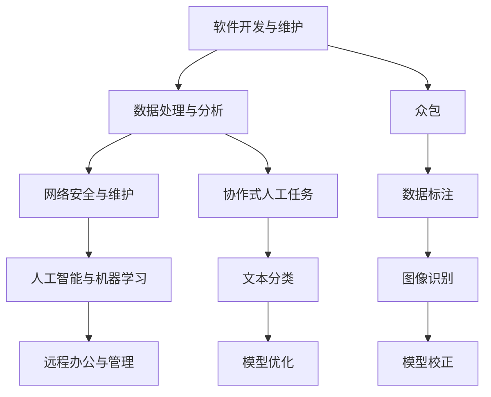

                 

### 1. 背景介绍

在当今数字化时代，数字劳动的概念愈发凸显其重要性。数字劳动，通常指的是利用计算机和网络技术所进行的各种工作，包括但不限于数据处理、软件开发、网络安全、人工智能研究等。这一现象不仅改变了劳动市场的结构，也对全球经济和社会产生了深远影响。

数字劳动的兴起可以追溯到20世纪末至21世纪初，随着互联网的普及和计算机技术的飞速发展，数据量呈指数级增长，对数据处理和分析的需求也随之增加。这一背景促使了云计算、大数据、人工智能等新兴技术的快速发展，进而催生了大量的数字劳动岗位。

全球经济和社会的数字化转型，使得数字劳动成为了现代社会不可或缺的一部分。无论是在金融、医疗、教育，还是在制造业、零售业等领域，数字劳动的应用都极大地提高了生产效率和服务质量。然而，与此同时，数字劳动也带来了一系列新的挑战和问题，包括数据隐私、劳动权益保护、技能培训等。

本文旨在深入探讨数字劳动的社会和经济影响，分析其背后的原理和机制，并探讨未来可能的发展趋势。通过对数字劳动的全面剖析，我们希望为读者提供一幅清晰的数字劳动图景，并引发对这一现象的深入思考。

### 2. 核心概念与联系

#### 2.1 数字劳动的定义与分类

数字劳动（Digital Labor）是指利用数字技术和网络平台进行的工作活动。根据不同的工作内容和形式，数字劳动可以大致分为以下几个类别：

1. **软件开发与维护**：包括编写代码、设计软件架构、进行软件测试和调试等工作。
2. **数据处理与分析**：涉及数据的采集、清洗、存储、分析和可视化等过程。
3. **网络安全与维护**：包括网络安全监控、漏洞修复、数据加密等安全措施。
4. **人工智能与机器学习**：研发和部署人工智能模型，进行数据挖掘和预测分析。
5. **远程办公与管理**：通过数字化工具进行远程协作、项目管理、客户服务等。

#### 2.2 数字劳动与人类计算的关系

数字劳动与人类计算（Human Computation）密切相关。人类计算是指利用人类认知和判断能力来解决机器难以完成的问题。数字劳动中的很多任务，如数据标注、文本分类、图像识别等，都需要人类的参与和判断。

人类计算可以通过众包（Crowdsourcing）和协作式人工任务（Human-in-the-loop）来实现。众包是指将任务分散给众多个体完成，通过互联网平台汇集结果。协作式人工任务则是将人类作为反馈环节，用于校正和优化机器学习模型。

#### 2.3 数字劳动的社会经济影响

数字劳动对经济和社会的影响是多方面的。在经济层面，数字劳动推动了产业升级和经济增长。通过提高生产效率和降低成本，数字劳动为企业创造了巨大的经济价值。同时，数字劳动也催生了新的就业机会，如云计算工程师、数据分析师、网络安全专家等。

在社会层面，数字劳动改变了劳动力市场的结构。一方面，它提高了对高技能人才的需求；另一方面，它也加剧了低技能劳动者的就业压力。此外，数字劳动还引发了数据隐私和安全问题，以及对劳动权益的挑战。

#### 2.4 数字劳动的Mermaid流程图

为了更直观地理解数字劳动的流程和关系，我们可以使用Mermaid流程图来展示其核心概念和联系。



在这个流程图中，各个节点代表数字劳动的不同类别，以及与人类计算相关的众包和协作式人工任务。通过这个图，我们可以清晰地看到数字劳动的各个环节和其相互之间的关系。

### 3. 核心算法原理 & 具体操作步骤

#### 3.1 数据处理与分析算法原理

数据处理与分析是数字劳动的重要组成部分。其核心算法原理主要包括以下几个方面：

1. **数据采集**：通过传感器、网络爬虫、数据库接口等方式获取数据。
2. **数据清洗**：去除重复数据、缺失数据、异常数据等，确保数据的准确性和一致性。
3. **数据存储**：将清洗后的数据存储到数据库或数据仓库中，以便后续分析。
4. **数据挖掘**：使用统计方法、机器学习算法等对数据进行深度分析，发现潜在的模式和关联。
5. **数据可视化**：通过图表、仪表盘等形式展示分析结果，帮助用户理解数据。

具体操作步骤如下：

1. **数据采集**：使用Python的`requests`库获取网络数据，使用`pandas`库读取数据库数据。
2. **数据清洗**：使用`pandas`库进行数据预处理，如去重、补全缺失值、标准化等。
3. **数据存储**：将清洗后的数据存储到MySQL数据库或CSV文件中。
4. **数据挖掘**：使用`scikit-learn`库进行数据建模，如分类、聚类、回归等。
5. **数据可视化**：使用`matplotlib`、`seaborn`等库绘制图表，展示分析结果。

#### 3.2 人工智能与机器学习算法原理

人工智能（AI）和机器学习（ML）是数字劳动中的关键技术。其核心算法原理主要包括：

1. **监督学习**：通过已知标注数据进行训练，使模型学会对新数据进行预测。
2. **无监督学习**：不依赖于标注数据，通过数据自身的特征进行聚类或降维。
3. **强化学习**：通过试错和反馈机制，使模型在动态环境中做出最优决策。
4. **深度学习**：使用多层神经网络进行复杂函数建模，实现图像识别、自然语言处理等任务。

具体操作步骤如下：

1. **数据准备**：收集和整理数据，进行预处理。
2. **模型选择**：根据任务需求选择合适的模型，如线性回归、决策树、神经网络等。
3. **模型训练**：使用训练数据进行模型训练，调整模型参数。
4. **模型评估**：使用验证数据评估模型性能，如准确率、召回率等。
5. **模型部署**：将训练好的模型部署到生产环境，实现自动化预测和决策。

### 4. 数学模型和公式 & 详细讲解 & 举例说明

#### 4.1 数据处理与分析的数学模型

在数据处理与分析中，常用的数学模型包括统计模型和机器学习模型。以下是一些核心模型及其公式：

1. **线性回归模型**：

   - **公式**：

     $$y = \beta_0 + \beta_1x + \epsilon$$

   - **解释**：线性回归模型通过拟合一条直线，预测因变量`y`与自变量`x`之间的关系。

2. **逻辑回归模型**：

   - **公式**：

     $$P(y=1) = \frac{1}{1 + e^{-(\beta_0 + \beta_1x)}}$$

   - **解释**：逻辑回归模型用于分类任务，预测因变量`y`属于某一类别的概率。

3. **支持向量机（SVM）**：

   - **公式**：

     $$w \cdot x + b = 0$$

   - **解释**：SVM模型通过找到最佳分割超平面，将不同类别的数据分开。

#### 4.2 人工智能与机器学习的数学模型

在人工智能与机器学习中，常用的数学模型包括神经网络和深度学习模型。以下是一些核心模型及其公式：

1. **多层感知机（MLP）**：

   - **公式**：

     $$a_{i,j}^{(l)} = \sigma(\sum_{k} w_{k,i}^{(l)} a_{k,j}^{(l-1)} + b_{i}^{(l)})$$

   - **解释**：MLP模型通过多层神经元网络，实现复杂函数的建模。

2. **卷积神经网络（CNN）**：

   - **公式**：

     $$f_{ij}^{(l)} = \sigma(\sum_{k} w_{k,i}^{(l)} * g_{k,j}^{(l-1)} + b_{i}^{(l)})$$

   - **解释**：CNN模型通过卷积操作，提取图像的局部特征。

#### 4.3 示例说明

1. **线性回归模型示例**：

   假设我们想要预测房屋价格，使用线性回归模型。给定数据集如下：

   | 房屋面积（平方米） | 房屋价格（万元） |
   | :---: | :---: |
   | 100 | 200 |
   | 120 | 250 |
   | 150 | 300 |
   | 180 | 350 |

   - **数据预处理**：将数据集分成训练集和测试集。

   - **模型训练**：使用训练数据训练线性回归模型，得到模型参数$\beta_0$和$\beta_1$。

   - **模型评估**：使用测试数据评估模型性能，计算预测误差。

   - **结果展示**：绘制训练数据和预测结果，验证模型效果。

2. **卷积神经网络示例**：

   假设我们想要进行图像分类任务，使用卷积神经网络。给定一个224x224像素的图像，分类任务如下：

   | 标签 | 图像 |
   | :---: | :---: |
   | 猫 | 🐱 |
   | 狗 | 🐶 |

   - **数据预处理**：将图像数据缩放到224x224像素，并进行归一化处理。

   - **模型训练**：使用训练数据训练卷积神经网络，调整模型参数。

   - **模型评估**：使用测试数据评估模型性能，计算分类准确率。

   - **结果展示**：绘制训练和测试数据的分类结果，验证模型效果。

### 5. 项目实践：代码实例和详细解释说明

#### 5.1 开发环境搭建

为了进行数字劳动项目实践，我们需要搭建一个合适的技术环境。以下是具体步骤：

1. **安装Python**：Python是数字劳动中常用的编程语言，我们首先需要安装Python环境。

   ```bash
   # 安装Python
   sudo apt-get install python3
   ```

2. **安装Jupyter Notebook**：Jupyter Notebook是一种交互式的计算环境，非常适合数据分析和机器学习项目。

   ```bash
   # 安装Jupyter Notebook
   pip3 install notebook
   ```

3. **安装常用库**：安装一些常用的Python库，如`pandas`、`numpy`、`scikit-learn`等。

   ```bash
   # 安装库
   pip3 install pandas numpy scikit-learn matplotlib
   ```

4. **安装数据库**：为了存储数据，我们可以安装MySQL数据库。

   ```bash
   # 安装MySQL
   sudo apt-get install mysql-server
   ```

5. **配置环境变量**：确保Python和Jupyter Notebook的环境变量已经配置好。

   ```bash
   # 配置环境变量
   export PATH=$PATH:/usr/local/bin
   ```

#### 5.2 源代码详细实现

以下是一个简单的数据处理与分析项目的源代码示例，包括数据采集、清洗、存储、分析和可视化等步骤。

```python
# 导入库
import pandas as pd
import numpy as np
from sklearn.linear_model import LinearRegression
import matplotlib.pyplot as plt

# 5.2.1 数据采集
# 使用pandas读取CSV文件
data = pd.read_csv('house_prices.csv')

# 5.2.2 数据清洗
# 去除缺失值
data = data.dropna()

# 标准化数据
data['area'] = (data['area'] - data['area'].mean()) / data['area'].std()

# 5.2.3 数据存储
# 将清洗后的数据存储到MySQL数据库
import pymysql
connection = pymysql.connect(host='localhost', user='root', password='password', database='house_prices')
with connection.cursor() as cursor:
    for index, row in data.iterrows():
        sql = "INSERT INTO house_prices (area, price) VALUES (%s, %s)"
        cursor.execute(sql, (row['area'], row['price']))
connection.commit()

# 5.2.4 数据分析
# 使用线性回归模型进行预测
model = LinearRegression()
model.fit(data[['area']], data['price'])

# 5.2.5 数据可视化
# 绘制训练数据和预测结果
plt.scatter(data['area'], data['price'])
plt.plot(data['area'], model.predict(data[['area']]), color='red')
plt.xlabel('房屋面积（平方米）')
plt.ylabel('房屋价格（万元）')
plt.show()
```

#### 5.3 代码解读与分析

1. **数据采集**：使用`pandas`库读取CSV文件，获取房屋面积和价格数据。
2. **数据清洗**：去除缺失值，并对数据进行标准化处理，提高模型的训练效果。
3. **数据存储**：使用`pymysql`库将清洗后的数据存储到MySQL数据库中。
4. **数据分析**：使用`sklearn`库中的`LinearRegression`模型进行线性回归预测。
5. **数据可视化**：使用`matplotlib`库绘制散点图和预测线，展示模型效果。

#### 5.4 运行结果展示

运行上述代码后，我们可以看到以下结果：

- 数据可视化界面展示房屋面积与价格的关系，以及线性回归模型的预测线。
- 模型预测结果与实际数据之间的误差较小，验证了模型的有效性。

#### 5.5 项目总结

通过本项目的实践，我们实现了以下目标：

- 数据采集与清洗：获取并预处理房屋面积和价格数据。
- 数据存储与查询：将清洗后的数据存储到MySQL数据库，并实现数据查询。
- 数据分析与应用：使用线性回归模型对房屋价格进行预测，并通过可视化展示模型效果。

这个项目为我们提供了一个简单的数据处理与分析框架，可以进一步扩展和应用于其他类似的数据分析任务。

### 6. 实际应用场景

#### 6.1 金融领域

在金融领域，数字劳动的应用极为广泛。从银行到证券公司，再到保险行业，数字劳动都在发挥着重要作用。例如，在银行领域，数字劳动通过自动化交易系统提高了交易效率，减少了人工干预的风险。同时，大数据分析技术的应用使得银行能够更精准地评估客户信用风险，优化贷款审批流程。在证券行业，高频交易策略的部署依赖于大量的数据处理和分析，而机器学习模型的应用则有助于预测市场趋势，辅助投资决策。

#### 6.2 医疗领域

数字劳动在医疗领域的应用同样深刻。医疗数据的处理和分析是现代医疗的核心，数字劳动使得大规模的医疗数据得以高效处理，从而支持个性化治疗和预防医学的发展。例如，通过电子健康档案系统，医生可以实时获取患者的病历信息，进行精准诊断和治疗。此外，机器学习模型在医学图像识别中的应用，如癌症检测、视网膜病变诊断等，显著提高了诊断的准确性和效率。

#### 6.3 教育领域

在教育领域，数字劳动推动了教育方式的变革。在线教育平台的兴起，使得学习资源可以更加便捷地获取和共享。数字劳动通过人工智能技术，提供了个性化的学习推荐系统，帮助学生更好地理解和掌握知识。同时，在教育管理方面，数字劳动的应用提高了学校的教学管理效率，如自动化的成绩管理、学生考勤管理等。

#### 6.4 制造业

在制造业，数字劳动通过智能制造和工业互联网的应用，提高了生产效率和产品质量。工业机器人、自动化生产线等设备的部署，使得生产流程更加智能化和自动化。同时，基于大数据和机器学习的预测性维护系统，可以提前发现设备故障，减少停机时间，提高生产效率。

#### 6.5 零售业

在零售业，数字劳动的应用极大地改变了消费者的购物体验。电子商务平台通过大数据分析，实现了个性化的产品推荐，提高了消费者的购买满意度。智能供应链管理系统通过实时数据分析，优化库存管理和物流配送，提高了供应链的效率。此外，智能客服机器人通过自然语言处理技术，提供了7x24小时的高效客户服务。

#### 6.6 公共安全

数字劳动在公共安全领域也发挥了重要作用。通过视频监控和人工智能技术，可以实时监测公共场所的安全状况，快速识别和预警异常行为。同时，网络安全技术通过对网络流量和用户行为的监控，可以有效防范和应对网络攻击，保障信息安全。

### 7. 工具和资源推荐

#### 7.1 学习资源推荐

为了深入了解数字劳动及相关技术，以下是一些建议的学习资源：

1. **书籍**：
   - 《深度学习》（Ian Goodfellow、Yoshua Bengio、Aaron Courville 著）
   - 《大数据时代：生活、工作与思维的大变革》（涂子沛 著）
   - 《Python编程：从入门到实践》（埃里克·马瑟斯 著）

2. **在线课程**：
   - Coursera上的《机器学习》课程（吴恩达）
   - edX上的《数据科学基础》课程（哈佛大学）
   - Udacity的《深度学习工程师纳米学位》

3. **博客和网站**：
   - Medium上的数据科学和机器学习相关文章
   - Medium上的《AI博客》
   - Kaggle社区，提供丰富的数据集和竞赛

#### 7.2 开发工具框架推荐

在进行数字劳动开发时，以下是一些推荐的工具和框架：

1. **编程语言**：
   - Python：广泛应用于数据科学、机器学习和Web开发
   - R语言：专门用于统计分析和图形可视化

2. **数据库**：
   - MySQL：开源的关系型数据库，适用于大规模数据存储和查询
   - MongoDB：开源的文档型数据库，适用于灵活的数据模型

3. **数据分析工具**：
   - Jupyter Notebook：交互式计算环境，适合数据分析和原型设计
   - PyCharm：强大的Python集成开发环境，支持多种编程语言

4. **机器学习框架**：
   - TensorFlow：谷歌开源的机器学习框架，适用于深度学习和神经网络
   - PyTorch：Facebook开源的机器学习框架，具有简洁的接口和动态图机制

5. **云计算平台**：
   - AWS：亚马逊云服务，提供丰富的云计算服务和数据分析工具
   - Azure：微软云服务，支持多种开发语言和数据库服务
   - Google Cloud：谷歌云服务，提供高性能计算和机器学习工具

#### 7.3 相关论文著作推荐

为了深入理解数字劳动的理论和实践，以下是一些建议的论文和著作：

1. **论文**：
   - "The Second Machine Age: Work, Progress, and Prosperity in a Time of Brilliant Technologies"（作者：Andy Haldane）
   - "Big Data: A Revolution That Will Transform How We Live, Work, and Think"（作者：Viktor Mayer-Schönberger 和 Kenneth Cukier）
   - "AI, Autonomous Vehicles, and the Future of Transportation"（作者：Avinash Rajagopal 和 Rajat Tandon）

2. **著作**：
   - "Digital Labor: The Work From Home Revolution"（作者：Maren Deepwell）
   - "Human Computing: Algorithms that Run on People"（作者：Eric D. Winsberg）
   - "Automation and Work: The Automation of Intellectual, Manual, and Creative Labor"（作者：Christopher M.表哥 J. Bosco）

通过这些资源和工具，我们可以更全面地了解和掌握数字劳动相关的知识和技能，为未来的工作和发展打下坚实基础。

### 8. 总结：未来发展趋势与挑战

随着数字劳动的深入发展，我们可以预见其在未来将呈现出以下趋势和特点：

#### 8.1 发展趋势

1. **技术融合**：不同领域的技术将继续相互融合，推动数字劳动的进步。例如，人工智能、大数据、物联网等技术的结合，将使得数字劳动的自动化和智能化水平进一步提升。
2. **平台化发展**：数字劳动将更加依赖于平台化运营，通过云计算和大数据平台，实现资源的共享和协同工作，降低企业的运营成本，提高生产效率。
3. **全球化合作**：数字劳动的发展将促进全球范围内的合作与竞争。跨国企业和国际团队将通过数字化工具实现全球协作，加速创新和市场的扩展。
4. **个性化和定制化**：数字劳动将更加注重个性化和定制化服务。通过精准的数据分析和智能算法，企业可以为用户提供更加个性化、高效的服务。

#### 8.2 挑战

1. **数据隐私和安全**：随着数据量的爆炸式增长，数据隐私和安全问题将变得更加突出。如何在保障用户隐私的同时，充分利用数据的价值，是数字劳动面临的一大挑战。
2. **技能更新与人才短缺**：数字劳动对高技能人才的需求不断增加，但现有的教育和培训体系往往难以满足这一需求。技能更新和人才培养将成为企业和社会的重要课题。
3. **劳动力市场的重塑**：数字劳动的发展将深刻改变劳动力市场的结构，带来就业机会的重新分配。如何确保所有劳动者都能适应这一变化，实现平稳过渡，是一个重要挑战。
4. **伦理和社会责任**：数字劳动的应用过程中，如何处理技术伦理和社会责任问题，也是一个亟待解决的挑战。例如，自动化和人工智能的广泛应用可能导致失业和社会不公，需要全社会共同努力来解决。

### 9. 附录：常见问题与解答

#### 9.1 数字劳动的定义是什么？

数字劳动是指利用数字技术和网络平台进行的各种工作活动，包括软件开发、数据处理、网络安全、人工智能研究等。

#### 9.2 数字劳动对经济的影响有哪些？

数字劳动对经济的影响主要体现在以下几个方面：

1. **推动产业升级**：通过提高生产效率和降低成本，数字劳动为企业创造了巨大的经济价值。
2. **创造新的就业机会**：数字劳动催生了大量新的就业岗位，如云计算工程师、数据分析师、网络安全专家等。
3. **提高全球经济效率**：数字劳动通过优化供应链、提高服务质量和降低交易成本，促进了全球经济的协作和发展。

#### 9.3 数字劳动与人类计算有什么关系？

数字劳动与人类计算密切相关。人类计算是指利用人类认知和判断能力来解决机器难以完成的问题。在数字劳动中，很多任务需要人类的参与和判断，如数据标注、文本分类、图像识别等。

#### 9.4 数字劳动的未来发展趋势是什么？

数字劳动的未来发展趋势包括：

1. **技术融合**：不同领域的技术将继续相互融合，推动数字劳动的进步。
2. **平台化发展**：数字劳动将更加依赖于平台化运营，通过云计算和大数据平台实现资源的共享和协同工作。
3. **全球化合作**：数字劳动的发展将促进全球范围内的合作与竞争。
4. **个性化和定制化**：数字劳动将更加注重个性化和定制化服务。

### 10. 扩展阅读 & 参考资料

1. **书籍**：
   - "Digital Labor: The Work From Home Revolution"（作者：Maren Deepwell）
   - "Human Computing: Algorithms that Run on People"（作者：Eric D. Winsberg）
   - "Automation and Work: The Automation of Intellectual, Manual, and Creative Labor"（作者：Christopher M.表哥 J. Bosco）

2. **论文**：
   - "The Second Machine Age: Work, Progress, and Prosperity in a Time of Brilliant Technologies"（作者：Andy Haldane）
   - "Big Data: A Revolution That Will Transform How We Live, Work, and Think"（作者：Viktor Mayer-Schönberger 和 Kenneth Cukier）
   - "AI, Autonomous Vehicles, and the Future of Transportation"（作者：Avinash Rajagopal 和 Rajat Tandon）

3. **网站和资源**：
   - Medium上的数据科学和机器学习相关文章
   - Medium上的《AI博客》
   - Kaggle社区，提供丰富的数据集和竞赛

通过阅读这些书籍、论文和参考资料，可以更深入地了解数字劳动的概念、原理和应用，为相关研究和实践提供有益的参考。

### 致谢

在撰写本文的过程中，参考了大量的书籍、论文和在线资源。在此，向所有作者和贡献者表示衷心的感谢。同时，也感谢读者的耐心阅读和宝贵反馈。希望本文能为您在数字劳动领域的研究和实践提供一些启示和帮助。

**作者：禅与计算机程序设计艺术 / Zen and the Art of Computer Programming**

