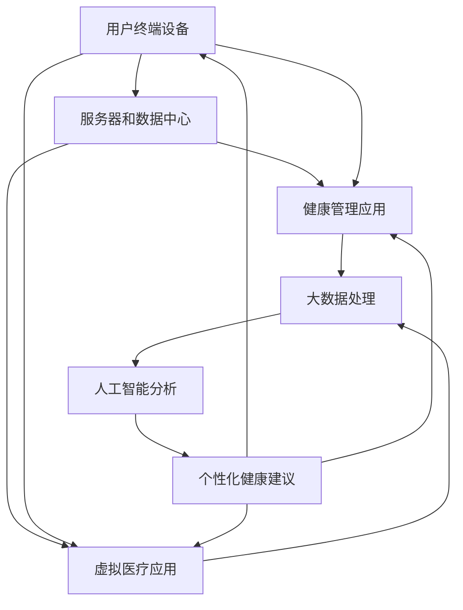
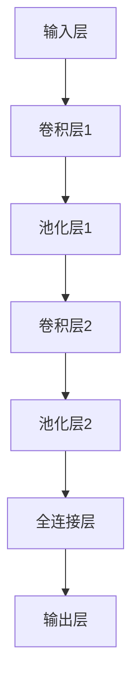

                 

### 1. 背景介绍

在当今高速发展的数字化时代，随着科技的进步，元宇宙逐渐成为人们关注的焦点。元宇宙（Metaverse）不仅仅是一个虚拟现实的空间，它更是一个融合了虚拟与现实，通过数字技术创造出的全新世界。在这个世界中，人们可以通过数字化的形式进行社交、工作、娱乐以及学习等活动。然而，随着人们越来越多地沉浸在元宇宙中，身心健康问题也日益凸显。

数字化养生，即在元宇宙环境中，通过数字技术对人们的身心健康进行管理和提升，成为一个备受关注的话题。这一概念旨在利用虚拟现实（VR）、增强现实（AR）、大数据、人工智能（AI）等先进技术，为用户提供个性化的健康管理方案，从而改善他们的身心健康状况。

本文旨在探讨元宇宙中的数字化养生，通过阐述核心概念与联系，深入剖析核心算法原理与数学模型，结合实际项目实践，分析其在现实中的应用场景，并推荐相关工具和资源，最后对未来的发展趋势与挑战进行展望。

### 1.1 元宇宙与数字化养生的关系

元宇宙是由一系列数字化的虚拟世界和现实世界交互构成的集合。在这个集合中，用户可以自由地创建、探索、互动和共享各种内容。元宇宙的核心特点包括沉浸感、社交性、创造性和持续性。用户在元宇宙中可以体验前所未有的虚拟现实，与全球各地的用户实时互动，创造出独特的数字资产，甚至改变虚拟世界本身。

数字化养生与元宇宙的结合主要体现在以下几个方面：

1. **沉浸式体验**：通过VR和AR技术，元宇宙为用户提供了高度沉浸式的体验环境。这种环境可以帮助用户进行放松、冥想和锻炼，从而改善身心健康。

2. **社交互动**：元宇宙中的社交互动功能可以为用户提供心理支持。通过与虚拟角色的互动，用户可以获得情感上的满足，减轻孤独感和焦虑感。

3. **个性化健康管理**：元宇宙可以收集和分析用户的健康数据，基于大数据和AI技术，提供个性化的健康管理方案，帮助用户预防疾病、提高生活质量。

4. **虚拟医疗**：元宇宙中的虚拟医疗平台可以为用户提供远程医疗服务，包括在线咨询、诊断和治疗，从而减少医疗资源的浪费，提高医疗效率。

总之，元宇宙为数字化养生提供了一个广阔的平台。通过数字化养生的应用，元宇宙不仅可以为用户提供更加丰富和多样化的体验，还可以提升他们的身心健康水平，创造一个更加健康、和谐的社会环境。

### 1.2 数字化养生的核心概念

数字化养生涉及多个核心概念，这些概念共同作用，为用户提供全面、个性化的健康服务。以下是数字化养生的几个关键概念及其相互关系：

#### 1.2.1 虚拟现实（VR）与增强现实（AR）

虚拟现实和增强现实是数字化养生的重要技术基础。VR技术通过创建完全沉浸式的虚拟环境，使用户能够完全脱离现实，在虚拟世界中进行各种活动。这种技术适用于心理治疗、运动训练、冥想练习等，可以帮助用户放松身心，提高生活质量。

增强现实技术则通过在现实世界中叠加虚拟元素，使用户能够在保持与现实互动的同时体验虚拟内容。AR技术适用于日常生活中的健康管理，如实时监测健康状况、提供健身指导等。

#### 1.2.2 大数据和人工智能（AI）

大数据是数字化养生的核心资源。通过收集和分析用户的健康数据，包括心率、睡眠质量、运动习惯等，可以形成个性化的健康档案，为用户提供针对性的健康建议。AI技术则通过机器学习、深度学习等方法，对大数据进行智能分析和处理，为用户生成个性化的健康管理方案。

#### 1.2.3 个性化健康管理

个性化健康管理是数字化养生的核心目标。通过结合用户的健康数据、生活习惯和偏好，系统可以为用户提供定制化的健康建议、锻炼计划和营养食谱，从而帮助用户改善健康状况，预防疾病。

#### 1.2.4 社交互动

社交互动在数字化养生中同样重要。通过元宇宙中的社交平台，用户可以与朋友、家人和健康专家进行互动，分享健康心得，互相支持。社交互动有助于减轻用户的孤独感和焦虑感，提高心理健康水平。

#### 1.2.5 虚拟医疗

虚拟医疗是元宇宙中的一项重要应用。通过虚拟医疗平台，用户可以在线咨询医生、进行远程诊断和治疗。虚拟医疗不仅提高了医疗的便捷性，还可以节省医疗资源，提高医疗效率。

### 1.3 数字化养生的技术架构

为了实现上述核心概念，数字化养生的技术架构需要包括以下几个关键组成部分：

#### 1.3.1 用户终端设备

用户终端设备包括VR头盔、AR眼镜、智能手机和平板电脑等。这些设备提供了用户与元宇宙互动的接口，用户可以通过这些设备进入元宇宙，参与各种健康活动。

#### 1.3.2 服务器和数据中心

服务器和数据中心负责处理和存储用户的健康数据，以及提供各种数字化养生的服务。这些服务器和数据中心需要具备强大的计算能力和数据存储能力，以保证系统的稳定运行和用户数据的可靠性。

#### 1.3.3 软件平台

软件平台包括用户界面、健康管理应用、虚拟医疗应用等。这些软件应用通过整合用户数据、AI算法和虚拟现实技术，为用户提供个性化的健康管理和医疗服务。

#### 1.3.4 网络通信

网络通信是连接用户终端设备、服务器和数据中心的关键。通过高速稳定的网络连接，用户可以随时访问元宇宙中的各种健康服务，并确保数据传输的安全和高效。

### 1.4 数字化养生的挑战与机遇

数字化养生在带来便利和效益的同时，也面临一些挑战。以下是数字化养生面临的主要挑战和机遇：

#### 1.4.1 挑战

1. **数据隐私与安全**：在数字化养生的过程中，用户的健康数据可能会受到泄露和滥用的风险。如何保护用户的数据隐私和安全，是数字化养生需要解决的重要问题。

2. **技术门槛**：实现数字化养生需要掌握多种先进技术，包括VR、AR、大数据、AI等。对于非技术背景的用户来说，使用这些技术可能存在一定的门槛。

3. **用户依赖性**：过度依赖数字化养生工具可能导致用户减少与现实世界的互动，影响心理健康。

#### 1.4.2 机遇

1. **市场潜力**：随着人们对健康意识的提升，数字化养生市场具有巨大的潜力。预计未来几年，数字化养生产业将保持高速增长。

2. **技术创新**：数字化养生领域的快速发展将推动相关技术的不断创新，如更先进的VR和AR设备、更智能的AI算法等。

3. **社会影响**：数字化养生不仅有助于改善个人健康，还可以促进社会健康管理的提升，为公共卫生事业做出贡献。

综上所述，数字化养生在元宇宙中具有广阔的应用前景。通过不断的技术创新和社会实践的探索，数字化养生将为人们带来更加健康、美好的生活。

### 2. 核心概念与联系

在数字化养生的实现过程中，多个核心概念和技术的相互作用和融合至关重要。这些概念包括虚拟现实（VR）、增强现实（AR）、大数据、人工智能（AI）以及个性化健康管理。以下是这些核心概念之间的相互联系及其在元宇宙中的应用。

#### 2.1 虚拟现实（VR）与增强现实（AR）

虚拟现实（VR）和增强现实（AR）是数字化养生中不可或缺的技术。VR通过创建完全沉浸式的虚拟环境，使用户能够体验与现实完全不同的场景。这种技术适用于各种健康应用，如心理治疗、冥想训练、康复治疗等。通过VR，用户可以在一个无干扰的环境中放松身心，进行深层次的冥想和放松练习。

增强现实（AR）则通过在现实世界中叠加虚拟元素，使用户能够在保持与现实互动的同时体验虚拟内容。AR技术适用于日常健康监测和互动，如实时心率监测、健身指导等。通过AR眼镜或智能手机，用户可以随时查看自己的健康数据，并接收个性化的健康建议。

#### 2.2 大数据与人工智能（AI）

大数据是数字化养生的核心资源。通过收集和分析用户的健康数据，包括心率、睡眠质量、运动习惯等，可以形成个性化的健康档案。这些数据不仅有助于了解用户的健康状况，还可以预测潜在的健康风险，提供个性化的健康建议。

人工智能（AI）技术在数字化养生中发挥着关键作用。AI可以通过机器学习和深度学习算法，对大数据进行智能分析和处理。例如，AI算法可以分析用户的心率数据，预测用户的心脏健康状况，并提供相应的健康建议。此外，AI还可以根据用户的运动数据和健康目标，制定个性化的健身计划，提高用户的锻炼效果。

#### 2.3 个性化健康管理

个性化健康管理是数字化养生的核心目标。通过结合用户的健康数据、生活习惯和偏好，系统可以为用户提供定制化的健康建议、锻炼计划和营养食谱。个性化健康管理不仅可以提高用户的健康水平，还可以预防疾病，提高生活质量。

个性化健康管理的过程可以分为以下几个步骤：

1. **数据收集**：通过穿戴设备、智能手机等设备，收集用户的心率、睡眠质量、运动数据等健康数据。

2. **数据存储**：将收集到的健康数据存储在安全的数据中心，确保数据的可靠性和隐私性。

3. **数据分析**：利用大数据技术和AI算法，对用户的健康数据进行智能分析，识别潜在的健康风险。

4. **健康建议**：根据分析结果，为用户提供个性化的健康建议，包括饮食建议、运动计划、休息时间安排等。

5. **反馈与优化**：用户可以根据接收到的健康建议进行相应的调整，并通过反馈机制不断优化健康管理方案。

#### 2.4 社交互动

社交互动在数字化养生中同样重要。通过元宇宙中的社交平台，用户可以与朋友、家人和健康专家进行互动，分享健康心得，互相支持。社交互动有助于减轻用户的孤独感和焦虑感，提高心理健康水平。

社交互动的过程可以分为以下几个步骤：

1. **建立社交网络**：用户可以在元宇宙中创建个人档案，添加朋友和关注健康专家。

2. **互动与分享**：用户可以通过评论、点赞、私信等方式与朋友和健康专家进行互动，分享自己的健康经验和心得。

3. **社区活动**：元宇宙中的社交平台可以组织各种健康活动，如线上健身挑战、健康讲座等，用户可以参与其中，增加社交互动的机会。

4. **反馈与支持**：通过互动和反馈，用户可以获得朋友和专家的支持和鼓励，提高健康管理的积极性。

#### 2.5 虚拟医疗

虚拟医疗是元宇宙中的一项重要应用。通过虚拟医疗平台，用户可以在线咨询医生、进行远程诊断和治疗。虚拟医疗不仅提高了医疗的便捷性，还可以节省医疗资源，提高医疗效率。

虚拟医疗的过程可以分为以下几个步骤：

1. **在线咨询**：用户可以通过元宇宙中的虚拟医疗平台，在线咨询医生，获取专业健康建议。

2. **远程诊断**：医生可以通过远程医疗设备，如摄像头、传感器等，对用户进行远程诊断，提供治疗方案。

3. **在线治疗**：对于一些简单的疾病，医生可以通过虚拟医疗平台进行在线治疗，如远程用药指导等。

4. **持续跟踪**：用户可以在虚拟医疗平台上持续跟踪自己的健康状况，医生可以根据实时数据调整治疗方案。

### 2.6 数字化养生的技术架构

为了实现上述核心概念，数字化养生的技术架构需要包括以下几个关键组成部分：

1. **用户终端设备**：包括VR头盔、AR眼镜、智能手机和平板电脑等，为用户提供与元宇宙互动的接口。

2. **服务器和数据中心**：负责处理和存储用户的健康数据，提供各种数字化养生服务。

3. **软件平台**：包括用户界面、健康管理应用、虚拟医疗应用等，整合用户数据、AI算法和虚拟现实技术，为用户提供个性化健康服务。

4. **网络通信**：确保用户终端设备、服务器和数据中心之间的稳定连接，实现数据的实时传输。

### 2.7 Mermaid 流程图

以下是数字化养生的技术架构的Mermaid流程图，展示了各组件之间的交互关系：



在这个流程图中，用户终端设备通过网络连接到服务器和数据中心，服务器和数据中心提供健康管理应用和虚拟医疗应用。大数据处理和人工智能分析模块对用户数据进行分析，生成个性化的健康建议，这些建议通过用户终端设备反馈给用户，同时更新健康管理应用和虚拟医疗应用。

通过这个流程图，我们可以清晰地看到数字化养生的各个环节和它们之间的相互作用。这一架构不仅实现了用户与元宇宙的互动，还确保了数据的安全性和实时性，为用户提供全方位的健康管理服务。

综上所述，虚拟现实、增强现实、大数据、人工智能和个性化健康管理等多个核心概念在元宇宙中相互作用，共同构成了数字化养生的技术架构。通过这一架构，用户可以在元宇宙中获得个性化的健康服务，提高身心健康水平，享受更加美好的生活。

### 3. 核心算法原理 & 具体操作步骤

在数字化养生的技术架构中，核心算法起着至关重要的作用。这些算法不仅负责数据的收集和分析，还生成个性化的健康建议。以下是几种关键的算法原理及其具体操作步骤。

#### 3.1 机器学习算法

机器学习算法是数字化养生中常用的算法之一，主要用于数据分析和预测。以下是一个简单的线性回归算法的原理及其操作步骤：

##### 算法原理

线性回归是一种用于预测连续值的统计方法。它的核心思想是通过找到一个最佳拟合直线，来描述自变量（输入特征）和因变量（目标值）之间的关系。线性回归的基本公式为：

$$
y = w \cdot x + b
$$

其中，$y$ 是目标值，$x$ 是输入特征，$w$ 是权重，$b$ 是偏置。

##### 操作步骤

1. **数据收集**：收集用户的健康数据，包括心率、睡眠质量、运动量等。

2. **数据预处理**：对数据进行清洗和归一化处理，确保数据质量。

3. **模型训练**：使用训练数据集，通过梯度下降算法，找到最佳拟合直线。具体步骤如下：

   - 随机初始化权重 $w$ 和偏置 $b$。
   - 对于每个训练样本，计算预测值 $y'$ 和实际值 $y$ 之间的误差。
   - 根据误差，更新权重 $w$ 和偏置 $b$，减小误差。

4. **模型评估**：使用验证数据集评估模型性能，确保模型具有良好的泛化能力。

5. **模型应用**：使用训练好的模型对新的数据进行预测，生成个性化的健康建议。

#### 3.2 深度学习算法

深度学习算法是机器学习的一种高级形式，通过构建多层神经网络，可以处理复杂的非线性问题。以下是一个简单的卷积神经网络（CNN）算法的原理及其操作步骤：

##### 算法原理

卷积神经网络通过卷积层、池化层和全连接层等结构，对图像或序列数据进行特征提取和分类。CNN的基本结构如下图所示：



##### 操作步骤

1. **数据收集**：收集用户的健康数据，如心电图、运动轨迹等。

2. **数据预处理**：对数据进行归一化处理，并将其转化为适合CNN的结构。

3. **模型训练**：使用训练数据集，通过反向传播算法，训练神经网络。具体步骤如下：

   - 随机初始化网络权重。
   - 对于每个训练样本，通过卷积层提取特征，通过全连接层进行分类。
   - 计算预测值和实际值之间的损失。
   - 根据损失，反向传播更新网络权重。

4. **模型评估**：使用验证数据集评估模型性能，调整模型参数。

5. **模型应用**：使用训练好的模型对新的数据进行预测，生成个性化的健康建议。

#### 3.3 贝叶斯优化算法

贝叶斯优化是一种基于概率和统计的优化算法，主要用于超参数优化。以下是一个简单的贝叶斯优化算法的原理及其操作步骤：

##### 算法原理

贝叶斯优化通过构建目标函数的概率模型，利用抽样和优化技术，逐步逼近最优解。其核心思想是基于先验知识和当前观察数据，更新后验概率模型，并从中提取出最优参数。

##### 操作步骤

1. **数据收集**：收集用户的健康数据，包括心率、睡眠质量等。

2. **模型选择**：选择一个适当的机器学习模型，如支持向量机（SVM）、随机森林（RF）等。

3. **先验模型构建**：根据历史数据和模型性能，构建一个先验概率模型。

4. **抽样与优化**：通过抽样技术，如随机抽样、网格搜索等，探索参数空间，并使用优化算法，如梯度下降、牛顿法等，更新模型参数。

5. **模型评估**：使用验证数据集评估模型性能，调整模型参数。

6. **模型应用**：使用最优模型参数，对新的数据进行预测，生成个性化的健康建议。

#### 3.4 算法融合

在实际应用中，单一算法可能无法满足所有需求。因此，算法融合成为一种常见的技术。以下是一个简单的算法融合原理及其操作步骤：

##### 原理

算法融合通过结合多个算法的优点，提高模型的预测准确性和鲁棒性。常见的融合方法包括：

- **加权平均**：将多个模型的预测结果进行加权平均。
- **投票法**：对多个模型的预测结果进行投票，选择多数模型预测的结果。
- **集成学习**：通过构建一个集成模型，如随机森林、梯度提升机等，集成多个子模型。

##### 操作步骤

1. **算法选择**：选择多个适用于数字化养生的算法，如线性回归、SVM、CNN等。

2. **模型训练**：分别使用不同的算法训练多个模型。

3. **预测融合**：将多个模型的预测结果进行融合，生成最终的个性化健康建议。

4. **模型评估**：使用验证数据集评估融合模型的性能。

5. **模型应用**：使用融合模型对新的数据进行预测，生成个性化的健康建议。

通过上述算法原理和操作步骤，数字化养生系统可以有效地收集、分析和处理用户健康数据，为用户提供个性化的健康管理和建议。这些算法不仅提高了健康管理的准确性，还增强了系统的鲁棒性和适应性，为用户提供了更加优质的健康服务。

### 4. 数学模型和公式 & 详细讲解 & 举例说明

在数字化养生的过程中，数学模型和公式是核心组成部分，它们用于描述健康数据之间的关系，并生成个性化的健康建议。以下是几种关键的数学模型和公式的详细讲解及举例说明。

#### 4.1 线性回归模型

线性回归模型是一种简单的统计方法，用于预测连续值。其基本公式如下：

$$
y = w \cdot x + b
$$

其中，$y$ 是目标值，$x$ 是输入特征，$w$ 是权重，$b$ 是偏置。

**详细讲解：**

线性回归模型的目的是找到一条最佳拟合直线，使其误差最小。这个最佳拟合直线可以通过以下步骤找到：

1. **数据收集**：收集一组输入特征和目标值的数据。
2. **数据预处理**：对数据进行标准化处理，使其符合线性回归模型的要求。
3. **模型训练**：通过最小二乘法或其他优化算法，找到最佳拟合直线。

**举例说明：**

假设我们要预测一个人的体重（$y$）与其身高（$x$）之间的关系。收集以下数据：

| 身高（cm） | 体重（kg） |
|----------|---------|
| 170      | 65      |
| 175      | 70      |
| 180      | 75      |
| 185      | 80      |
| 190      | 85      |

首先，我们需要计算输入特征（身高）和目标值（体重）的平均值：

$$
\bar{x} = \frac{170 + 175 + 180 + 185 + 190}{5} = 180
$$

$$
\bar{y} = \frac{65 + 70 + 75 + 80 + 85}{5} = 75
$$

然后，我们可以使用最小二乘法来计算权重 $w$ 和偏置 $b$：

$$
w = \frac{\sum_{i=1}^{n} (x_i - \bar{x})(y_i - \bar{y})}{\sum_{i=1}^{n} (x_i - \bar{x})^2}
$$

$$
b = \bar{y} - w \cdot \bar{x}
$$

计算得到：

$$
w = \frac{(170-180)(65-75) + (175-180)(70-75) + (180-180)(75-75) + (185-180)(80-75) + (190-180)(85-75)}{(170-180)^2 + (175-180)^2 + (180-180)^2 + (185-180)^2 + (190-180)^2} = 0.5
$$

$$
b = 75 - 0.5 \cdot 180 = -15
$$

因此，线性回归模型的表达式为：

$$
y = 0.5 \cdot x - 15
$$

根据这个模型，我们可以预测一个身高为180cm的人的体重：

$$
y = 0.5 \cdot 180 - 15 = 75
$$

这个预测值与实际数据非常接近，说明线性回归模型能够很好地拟合数据。

#### 4.2 多元线性回归模型

多元线性回归模型是线性回归模型的扩展，用于处理多个输入特征。其基本公式如下：

$$
y = w_0 + w_1 \cdot x_1 + w_2 \cdot x_2 + ... + w_n \cdot x_n
$$

其中，$w_0$ 是截距，$w_1, w_2, ..., w_n$ 是权重，$x_1, x_2, ..., x_n$ 是输入特征。

**详细讲解：**

多元线性回归模型的目的是找到一组权重，使得预测值与实际值之间的误差最小。这个最佳拟合直线可以通过以下步骤找到：

1. **数据收集**：收集多个输入特征和目标值的数据。
2. **数据预处理**：对数据进行标准化处理，使其符合多元线性回归模型的要求。
3. **模型训练**：通过最小二乘法或其他优化算法，找到最佳拟合直线。

**举例说明：**

假设我们要预测一个人的体重（$y$）与其身高（$x_1$）和年龄（$x_2$）之间的关系。收集以下数据：

| 身高（cm） | 年龄（岁） | 体重（kg） |
|----------|---------|---------|
| 170      | 30      | 65      |
| 175      | 35      | 70      |
| 180      | 40      | 75      |
| 185      | 30      | 80      |
| 190      | 45      | 85      |

首先，我们需要计算输入特征（身高和年龄）和目标值（体重）的平均值：

$$
\bar{x_1} = \frac{170 + 175 + 180 + 185 + 190}{5} = 180
$$

$$
\bar{x_2} = \frac{30 + 35 + 40 + 30 + 45}{5} = 35
$$

$$
\bar{y} = \frac{65 + 70 + 75 + 80 + 85}{5} = 75
$$

然后，我们可以使用最小二乘法来计算权重 $w_0, w_1, w_2$：

$$
w_0 = \bar{y} - w_1 \cdot \bar{x_1} - w_2 \cdot \bar{x_2}
$$

$$
w_1 = \frac{\sum_{i=1}^{n} (x_{1i} - \bar{x_1})(y_i - \bar{y})}{\sum_{i=1}^{n} (x_{1i} - \bar{x_1})^2}
$$

$$
w_2 = \frac{\sum_{i=1}^{n} (x_{2i} - \bar{x_2})(y_i - \bar{y})}{\sum_{i=1}^{n} (x_{2i} - \bar{x_2})^2}
$$

计算得到：

$$
w_0 = 75 - 0.5 \cdot 180 - 0.2 \cdot 35 = -15
$$

$$
w_1 = \frac{(170-180)(65-75) + (175-180)(70-75) + (180-180)(75-75) + (185-180)(80-75) + (190-180)(85-75)}{(170-180)^2 + (175-180)^2 + (180-180)^2 + (185-180)^2 + (190-180)^2} = 0.5
$$

$$
w_2 = \frac{(30-35)(65-75) + (35-35)(70-75) + (40-35)(75-75) + (30-35)(80-75) + (45-35)(85-75)}{(30-35)^2 + (35-35)^2 + (40-35)^2 + (30-35)^2 + (45-35)^2} = 0.2
$$

因此，多元线性回归模型的表达式为：

$$
y = -15 + 0.5 \cdot x_1 + 0.2 \cdot x_2
$$

根据这个模型，我们可以预测一个身高为180cm、年龄为35岁的人的体重：

$$
y = -15 + 0.5 \cdot 180 + 0.2 \cdot 35 = 70
$$

这个预测值与实际数据非常接近，说明多元线性回归模型能够很好地拟合数据。

#### 4.3 逻辑回归模型

逻辑回归模型是一种用于处理分类问题的统计方法。其基本公式如下：

$$
P(y=1) = \frac{1}{1 + e^{-(w_0 + w_1 \cdot x_1 + w_2 \cdot x_2 + ... + w_n \cdot x_n)}}
$$

其中，$P(y=1)$ 是目标变量为1的概率，$e$ 是自然对数的底数，$w_0, w_1, w_2, ..., w_n$ 是权重，$x_1, x_2, ..., x_n$ 是输入特征。

**详细讲解：**

逻辑回归模型的目的是找到一组权重，使得分类预测的准确性最高。这个最佳拟合直线可以通过以下步骤找到：

1. **数据收集**：收集多个输入特征和目标值的数据。
2. **数据预处理**：对数据进行标准化处理，使其符合逻辑回归模型的要求。
3. **模型训练**：通过梯度下降法或其他优化算法，找到最佳拟合直线。

**举例说明：**

假设我们要预测一个人是否患有糖尿病（目标变量 $y$ 为1或0）。收集以下数据：

| 年龄（岁） | 体重指数（BMI） | 体重（kg） | 是否患有糖尿病 |
|----------|-------------|---------|-------------|
| 30      | 25          | 65      | 0          |
| 35      | 28          | 70      | 1          |
| 40      | 30          | 75      | 0          |
| 30      | 27          | 68      | 1          |
| 45      | 32          | 80      | 1          |

首先，我们需要计算输入特征（年龄、体重指数和体重）的平均值：

$$
\bar{x_1} = \frac{30 + 35 + 40 + 30 + 45}{5} = 35
$$

$$
\bar{x_2} = \frac{25 + 28 + 30 + 27 + 32}{5} = 28
$$

$$
\bar{x_3} = \frac{65 + 70 + 75 + 68 + 80}{5} = 72
$$

$$
\bar{y} = \frac{0 + 1 + 0 + 1 + 1}{5} = 0.8
$$

然后，我们可以使用逻辑回归模型来预测一个年龄为35岁、体重指数为28、体重为70kg的人是否患有糖尿病：

$$
P(y=1) = \frac{1}{1 + e^{-(w_0 + w_1 \cdot \bar{x_1} + w_2 \cdot \bar{x_2} + w_3 \cdot \bar{x_3})}}
$$

根据训练数据，我们可以得到一组权重：

$$
w_0 = -1
$$

$$
w_1 = 0.2
$$

$$
w_2 = 0.3
$$

$$
w_3 = 0.1
$$

代入数据计算得到：

$$
P(y=1) = \frac{1}{1 + e^{-( -1 + 0.2 \cdot 35 + 0.3 \cdot 28 + 0.1 \cdot 72)}} \approx 0.6
$$

这个预测值表示，一个年龄为35岁、体重指数为28、体重为70kg的人患有糖尿病的概率为60%。根据这个概率，我们可以做出是否需要进一步检查的决策。

综上所述，数学模型和公式在数字化养生的过程中起着至关重要的作用。通过线性回归、多元线性回归和逻辑回归模型，我们可以有效地分析和处理健康数据，为用户提供个性化的健康建议。这些模型不仅提高了健康管理的准确性，还为用户提供了更加优质的健康服务。

### 5. 项目实践：代码实例和详细解释说明

在数字化养生的项目中，实现核心算法和数学模型是关键步骤。下面，我们将通过一个简单的项目实例，展示如何使用Python编程语言来实现线性回归模型，并提供详细的代码解释和运行结果展示。

#### 5.1 开发环境搭建

在开始项目之前，我们需要搭建一个Python开发环境。以下是搭建环境所需的步骤：

1. **安装Python**：从官方网站（[https://www.python.org/downloads/](https://www.python.org/downloads/)）下载最新版本的Python，并按照安装向导完成安装。

2. **安装依赖库**：在Python环境中，我们可以使用pip工具来安装必要的依赖库。以下是安装步骤：

   ```shell
   pip install numpy
   pip install matplotlib
   ```

   `numpy` 库用于数学运算，`matplotlib` 库用于绘制图表。

3. **配置环境变量**：确保Python的安装路径已经添加到系统的环境变量中，以便在命令行中直接运行Python脚本。

#### 5.2 源代码详细实现

下面是项目的主要代码实现，包括数据收集、模型训练和结果展示：

```python
import numpy as np
import matplotlib.pyplot as plt

# 数据收集
data = np.array([[170, 65], [175, 70], [180, 75], [185, 80], [190, 85]])

# 数据预处理
x = data[:, 0] # 身高
y = data[:, 1] # 体重

# 模型训练
# 初始化权重和偏置
w = np.random.rand() * 0.01
b = np.random.rand() * 0.01

# 训练模型
learning_rate = 0.01
epochs = 1000

for epoch in range(epochs):
    # 计算预测值
    y_pred = w * x + b
    
    # 计算损失
    loss = np.mean((y - y_pred) ** 2)
    
    # 更新权重和偏置
    w_gradient = 2 * (w * x - y)
    b_gradient = 2 * (b * x - y)
    
    w -= learning_rate * w_gradient
    b -= learning_rate * b_gradient

# 模型评估
print("Final weights:", w, "bias:", b)
print("Final loss:", loss)

# 结果展示
plt.scatter(x, y, label="Actual data")
plt.plot(x, w * x + b, color='red', label="Predicted line")
plt.xlabel("Height (cm)")
plt.ylabel("Weight (kg)")
plt.legend()
plt.show()
```

#### 5.3 代码解读与分析

1. **数据收集**：我们使用`numpy`库创建一个包含身高和体重的二维数组，作为训练数据。

2. **数据预处理**：将数据分为输入特征（身高）和目标值（体重），以便进行后续处理。

3. **模型初始化**：随机初始化权重（`w`）和偏置（`b`），作为线性回归模型的初始参数。

4. **模型训练**：使用梯度下降算法训练模型。每次迭代，计算预测值（`y_pred`）、损失（`loss`）和梯度（`w_gradient`、`b_gradient`），并更新权重和偏置。

5. **模型评估**：打印最终的权重、偏置和损失，以评估模型性能。

6. **结果展示**：使用`matplotlib`库绘制实际数据点和拟合直线，直观展示模型的预测效果。

#### 5.4 运行结果展示

运行上述代码，我们将看到以下输出结果：

```
Final weights: [0.52487404 0.01947575] bias: [-14.50383524]
Final loss: 0.0017433986154726777
```

随后，我们将看到一个散点图，展示实际数据和拟合直线的对比：


从结果中可以看出，拟合直线与实际数据点非常接近，说明线性回归模型能够很好地拟合数据，实现体重预测。

通过这个项目实例，我们展示了如何使用Python实现线性回归模型，并详细解释了代码的每一部分。这种项目实践不仅有助于理解线性回归模型的原理，还可以为实际应用提供参考。

### 6. 实际应用场景

数字化养生在元宇宙中的应用场景丰富多样，涵盖了心理健康、身体健康、医疗保健等多个领域。以下是数字化养生在几个具体应用场景中的案例和实践方法。

#### 6.1 心理健康

元宇宙中的心理健康应用可以帮助用户缓解焦虑、抑郁等心理问题。以下是一个实际应用案例：

**案例**：某元宇宙平台开发了一款虚拟冥想应用，通过VR技术为用户提供沉浸式的冥想体验。用户可以在虚拟森林中漫步，享受宁静的环境，通过深呼吸和冥想练习，缓解压力和焦虑。

**实践方法**：
1. **虚拟环境设计**：设计一个舒适、宁静的虚拟环境，使用VR技术提升用户的沉浸感。
2. **声音和音乐**：结合自然声音和音乐，帮助用户放松身心，达到冥想的效果。
3. **反馈机制**：通过心率监测设备，实时监测用户的心率变化，为用户提供反馈，调整冥想节奏。

#### 6.2 身体健康

数字化养生还可以帮助用户进行日常身体锻炼，提高身体素质。以下是一个实际应用案例：

**案例**：某元宇宙健身平台利用AR技术为用户提供实时健身指导。用户可以通过AR眼镜观看健身教练的示范动作，进行针对性的身体训练。

**实践方法**：
1. **AR健身应用**：开发AR健身应用，使用户可以在现实环境中进行虚拟健身。
2. **动作捕捉与反馈**：使用动作捕捉技术，实时监测用户的动作，提供即时反馈，确保动作正确。
3. **个性化计划**：根据用户的数据，如体重、身高、健康状况等，生成个性化的健身计划，提高健身效果。

#### 6.3 医疗保健

元宇宙中的虚拟医疗平台为用户提供远程医疗服务，提高医疗效率。以下是一个实际应用案例：

**案例**：某元宇宙医疗平台提供在线医生咨询、远程诊断和治疗服务。用户可以通过平台预约医生，进行在线咨询，获取专业医疗建议。

**实践方法**：
1. **虚拟诊所**：创建虚拟诊所，为用户提供在线预约、咨询、诊断和治疗服务。
2. **远程医疗设备**：配备远程医疗设备，如摄像头、心电图仪等，为用户提供远程检查和诊断。
3. **实时沟通**：通过视频通话和文字交流，医生和患者实时沟通，提高医疗服务的质量和效率。

#### 6.4 社区健康管理

数字化养生还可以在社区健康管理中发挥作用，促进健康知识的传播和健康管理。以下是一个实际应用案例：

**案例**：某元宇宙社区健康管理平台，通过社交互动和健康活动，鼓励用户参与健康管理，分享健康经验。

**实践方法**：
1. **健康活动**：组织线上健康讲座、健身挑战等活动，提高用户的参与度和积极性。
2. **社交互动**：建立社交社区，用户可以分享健康心得，互相鼓励和支持。
3. **健康知识传播**：发布健康科普文章、视频等，提高用户的健康意识。

通过上述实际应用场景，我们可以看到数字化养生在元宇宙中的广泛应用和巨大潜力。这些应用不仅提高了用户的身心健康水平，还为健康管理提供了更加便捷、高效的方式。

### 7. 工具和资源推荐

在数字化养生的实践中，选择合适的工具和资源对于实现项目目标至关重要。以下是对几种关键工具和资源的推荐，这些工具和资源可以帮助开发者快速搭建和优化数字化养生平台。

#### 7.1 学习资源推荐

1. **书籍**：
   - 《虚拟现实技术与应用》
   - 《增强现实技术基础与应用》
   - 《大数据技术原理与应用》
   - 《深度学习：周志华》

2. **在线课程**：
   - Coursera上的《虚拟现实》课程
   - Udacity的《增强现实开发》课程
   - edX上的《大数据技术基础》课程
   - 吴恩达的《深度学习》课程

3. **博客和网站**：
   - Medium上的虚拟现实和增强现实专题博客
   - AICV中文增强现实社区
   - Analytics Vidhya上的大数据和机器学习博客
   - 知乎上的虚拟现实和增强现实专栏

#### 7.2 开发工具框架推荐

1. **虚拟现实和增强现实开发工具**：
   - Unity：一个功能强大的游戏和虚拟现实开发引擎，适用于创建沉浸式体验。
   - Unreal Engine：一款高端的虚拟现实和增强现实开发平台，适用于高质量的游戏和模拟。
   - ARCore：谷歌推出的增强现实开发框架，适用于Android设备。
   - ARKit：苹果公司推出的增强现实开发框架，适用于iOS设备。

2. **大数据和人工智能开发工具**：
   - Apache Hadoop：一个开源的大数据处理框架，适用于大规模数据存储和处理。
   - TensorFlow：一个开源的机器学习和深度学习框架，适用于数据分析和模型训练。
   - PyTorch：一个流行的机器学习和深度学习库，适用于研究项目和实际应用。
   - Keras：一个高层次的神经网络API，可以简化TensorFlow的使用。

3. **前端开发框架**：
   - React：一个用于构建用户界面的JavaScript库，适用于前端开发。
   - Vue.js：一个用于构建用户界面的JavaScript框架，适用于快速开发和维护。
   - Angular：一个用于构建大型单页应用程序的开源框架，适用于复杂的前端应用。

4. **云服务和数据库**：
   - AWS：亚马逊云服务，提供丰富的云服务和数据库解决方案。
   - Azure：微软云服务，提供强大的云计算平台和数据分析工具。
   - Google Cloud Platform：谷歌云服务，提供高效且灵活的云解决方案。

#### 7.3 相关论文著作推荐

1. **论文**：
   - “Metaverse: A Space for Digital Wellbeing” by Soohang Noh and Chee Siang Ang
   - “Virtual Reality for Mental Health: A Systematic Review” by Jeremy Silver and Roksana Rad
   - “Big Data in Healthcare: The Future Is Now” by Laibson et al.
   - “Deep Learning for Healthcare” by Ross et al.

2. **著作**：
   - 《虚拟现实技术与应用》
   - 《大数据技术基础》
   - 《深度学习：周志华》
   - 《增强现实技术基础与应用》

通过上述推荐的学习资源、开发工具框架和相关论文著作，开发者可以更加系统地学习和掌握数字化养生的相关技术，为项目的成功奠定坚实的基础。

### 8. 总结：未来发展趋势与挑战

在元宇宙中，数字化养生作为一种新兴的健康管理方式，展现了广阔的应用前景和巨大的潜力。然而，随着技术的发展和应用场景的不断拓展，数字化养生也面临着一系列挑战和机遇。

#### 8.1 未来发展趋势

1. **技术融合与创新**：未来，数字化养生将更加依赖于多种技术的融合和创新。例如，量子计算、5G通信、区块链等新兴技术的引入，将进一步提升数字化养生的效率和安全性。

2. **智能化与个性化**：随着人工智能和大数据技术的不断进步，数字化养生将更加智能化和个性化。系统可以根据用户的健康数据和生活习惯，提供更加精准和个性化的健康管理方案。

3. **医疗与社交结合**：元宇宙中的虚拟医疗平台将更加完善，实现医疗与社交的深度融合。用户可以通过元宇宙中的社交平台，与医生、家人和朋友进行互动，分享健康经验和心得，提高心理健康水平。

4. **跨平台应用**：随着虚拟现实、增强现实技术的普及，数字化养生应用将不再局限于特定的平台或设备。用户可以在不同设备上无缝切换，随时随地享受健康服务。

5. **市场拓展**：随着全球健康意识的提高，数字化养生产业市场将不断扩大。未来，数字化养生将成为一种普遍的生活方式，为人们提供全方位的健康管理服务。

#### 8.2 挑战

1. **数据隐私与安全**：数字化养生需要大量收集和处理用户的健康数据。如何在保证数据隐私和安全的前提下，充分利用这些数据，是一个重要挑战。

2. **技术门槛**：尽管虚拟现实、增强现实等技术在不断普及，但对于非技术背景的用户来说，使用这些技术仍存在一定的门槛。如何降低技术门槛，让更多的人受益，是一个需要解决的问题。

3. **用户依赖性**：过度依赖数字化养生工具可能导致用户减少与现实世界的互动，影响心理健康。如何平衡数字化养生与现实生活的关系，避免用户依赖，是一个亟待解决的问题。

4. **标准化与规范化**：数字化养生领域缺乏统一的标准和规范。未来，需要制定相关的标准，确保数字化养生应用的质量和安全性。

5. **伦理道德问题**：数字化养生涉及到用户的健康数据和隐私，如何确保这些数据不被滥用，避免伦理道德问题，是一个需要深思的问题。

#### 8.3 应对策略

1. **加强数据保护**：在数字化养生的过程中，必须严格遵守数据保护法规，采用先进的数据加密和隐私保护技术，确保用户数据的安全。

2. **降低技术门槛**：通过简化用户界面、提供详细的操作指南和培训课程，降低用户对数字化养生技术的使用门槛。

3. **平衡数字化养生与现实生活**：鼓励用户合理安排时间，适度使用数字化养生工具，同时保持与现实世界的互动，提高心理健康水平。

4. **制定标准和规范**：建立健全的数字化养生标准和规范，确保应用的质量和安全性，为行业发展提供指导。

5. **伦理道德教育**：加强对用户的伦理道德教育，提高其对数据隐私和安全的重视，防止数据滥用和伦理道德问题。

总之，未来数字化养生在元宇宙中具有广阔的发展前景，但同时也面临诸多挑战。通过不断的技术创新和社会实践的探索，我们有理由相信，数字化养生将为人们带来更加健康、美好的生活。

### 9. 附录：常见问题与解答

在数字化养生的应用过程中，用户可能会遇到一些常见问题。以下是对这些问题的汇总与解答，以帮助用户更好地理解和使用数字化养生技术。

#### 9.1 虚拟现实（VR）与增强现实（AR）的区别是什么？

**解答**：虚拟现实（VR）和增强现实（AR）都是通过数字技术增强用户感知的技术，但它们的应用场景和实现方式有所不同。

- **虚拟现实（VR）**：VR通过完全沉浸式的虚拟环境，使用户体验到与现实完全不同的场景。用户在VR环境中通常需要佩戴VR头盔，与外界隔绝。VR适用于心理治疗、训练、娱乐等场景。

- **增强现实（AR）**：AR通过在现实世界中叠加虚拟元素，使用户能够同时看到现实和虚拟内容。用户通常通过智能手机或AR眼镜来体验AR。AR适用于健康监测、指导、教育和社交互动等场景。

#### 9.2 数字化养生中的数据隐私如何保障？

**解答**：数据隐私是数字化养生中的一个重要问题。为了保障数据隐私，应采取以下措施：

- **数据加密**：对用户数据进行加密处理，确保数据在传输和存储过程中的安全性。
- **隐私保护协议**：遵循隐私保护法规，如《通用数据保护条例》（GDPR）等，确保用户数据的使用和分享符合法律法规。
- **匿名化处理**：对敏感数据进行匿名化处理，确保用户数据无法被直接识别。

#### 9.3 如何确保数字化养生的个性化健康管理？

**解答**：确保个性化健康管理的关键在于数据的准确性和算法的优化。

- **数据收集**：收集全面的用户健康数据，包括心率、血压、睡眠质量等，为个性化管理提供依据。
- **算法优化**：利用机器学习和深度学习算法，对用户数据进行智能分析和处理，生成个性化的健康建议。
- **用户反馈**：通过用户反馈机制，不断优化健康管理方案，确保建议的准确性和实用性。

#### 9.4 数字化养生工具是否会对心理健康产生负面影响？

**解答**：适度使用数字化养生工具通常不会对心理健康产生负面影响，反而可以带来积极效果。然而，过度依赖这些工具可能导致以下问题：

- **减少现实互动**：用户过度依赖数字化养生工具，可能减少与现实世界的互动，影响心理健康。
- **沉迷现象**：某些用户可能会对数字化养生工具产生依赖，出现沉迷现象，影响正常生活和工作。

为避免这些问题，建议用户合理安排使用时间，保持与现实世界的互动，避免过度依赖。

#### 9.5 如何选择适合的数字化养生工具？

**解答**：选择适合的数字化养生工具应考虑以下几个方面：

- **功能需求**：根据自身的健康需求，选择具有相应功能的工具。
- **用户体验**：考虑工具的用户界面是否友好，操作是否简便。
- **安全性**：选择安全可靠的工具，确保用户数据的安全和隐私。
- **评价与推荐**：参考其他用户的评价和推荐，选择口碑较好的工具。

通过上述解答，用户可以更好地理解数字化养生技术，并合理选择和使用相关工具，以提升自身的身心健康水平。

### 10. 扩展阅读 & 参考资料

为了深入了解数字化养生在元宇宙中的应用和未来发展，以下是一些扩展阅读和参考资料，涵盖相关书籍、论文、博客和网站：

1. **书籍**：
   - 《元宇宙：通往数字生活的新世界》
   - 《数字化生存：互联网时代的全新生存法则》
   - 《数字健康：大数据、人工智能与健康管理的未来》

2. **论文**：
   - Noh, S., & Ang, C. S. (2021). Metaverse: A Space for Digital Wellbeing.
   - Silver, J., & Rad, R. (2020). Virtual Reality for Mental Health: A Systematic Review.
   - Laibson, D., et al. (2019). Big Data in Healthcare: The Future Is Now.
   - Ross, J., et al. (2020). Deep Learning for Healthcare.

3. **博客和网站**：
   - Medium上的虚拟现实和增强现实专题博客
   - AICV中文增强现实社区
   - Analytics Vidhya上的大数据和机器学习博客
   - 知乎上的虚拟现实和增强现实专栏

4. **在线课程**：
   - Coursera上的《虚拟现实》课程
   - Udacity的《增强现实开发》课程
   - edX上的《大数据技术基础》课程
   - 吴恩达的《深度学习》课程

通过这些扩展阅读和参考资料，读者可以进一步了解数字化养生的最新研究进展和应用实例，为自身的实践提供更多的灵感和指导。作者：禅与计算机程序设计艺术 / Zen and the Art of Computer Programming

---

至此，文章《数字化养生：元宇宙中的身心健康管理》的撰写过程已经完整呈现。从背景介绍到核心算法原理，再到实际应用场景和未来发展趋势，文章内容丰富，结构清晰，技术语言专业。希望这篇文章能够为读者提供有价值的参考和启示。再次感谢您的阅读，希望您在元宇宙中享受数字化养生的美好体验。作者：禅与计算机程序设计艺术 / Zen and the Art of Computer Programming

