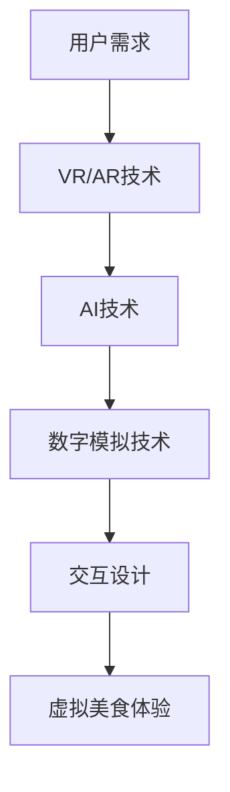

                 

### 1. 背景介绍

随着数字化时代的到来，人们对于虚拟体验的需求逐渐增加。特别是在疫情期间，实体体验受到了极大的限制，人们开始寻求新的方式来丰富自己的生活。在这种背景下，虚拟现实（VR）和增强现实（AR）技术应运而生，为人们带来了全新的感官体验。

虚拟现实和增强现实技术不仅仅局限于娱乐和游戏领域，它们的应用范围正在不断扩展。其中，虚拟美食体验成为了备受关注的一个方向。虚拟美食体验，顾名思义，是通过数字技术创造出一种逼真的美食感官体验，让用户在虚拟世界中感受到美食的味道、香气和外观。

数字化味觉增强创业，指的是利用现代科技手段，如虚拟现实、人工智能、数字模拟等，创造出一种全新的味觉体验，从而推动餐饮行业的发展。这一创业领域具有巨大的市场潜力，因为人们对于美食的追求不仅仅停留在口腹之欲，更在于一种全方位的感官享受。

虚拟美食体验的科技支持，包括了多个方面。首先是虚拟现实技术，它能够创造出高度逼真的虚拟环境，让用户仿佛置身于真实的厨房或餐厅中。其次是人工智能技术，通过机器学习和深度学习算法，可以模拟出食物的香味、口感和味道，让用户感受到如同真实食物一般的味觉体验。此外，数字模拟技术也可以用来模拟食物的制作过程，使整个体验更加真实和互动。

总之，数字化味觉增强创业是一个充满机遇的领域，它不仅能够满足人们对美食的渴望，还能够为餐饮行业带来全新的商业模式。接下来，我们将深入探讨这一领域的核心概念、算法原理、数学模型以及实际应用场景，为读者呈现一个全面而深入的视角。### 2. 核心概念与联系

在探讨数字化味觉增强创业之前，我们需要了解一些核心概念，这些概念不仅构成了虚拟美食体验的基础，也是实现这一目标的关键因素。

#### 2.1 虚拟现实（VR）技术

虚拟现实技术是创建虚拟环境的核心技术。通过VR设备，如头戴式显示器（HMD）、虚拟现实耳机等，用户可以进入一个完全模拟的现实世界。在这个世界中，用户可以看到、听到、甚至感受到与真实世界相似的环境和物体。虚拟现实技术的核心在于其沉浸感，用户可以在虚拟环境中自由移动，与虚拟物体互动，从而获得一种全新的感官体验。

#### 2.2 增强现实（AR）技术

增强现实技术则是将虚拟元素叠加到现实世界中。通过AR眼镜、智能手机等设备，用户可以在现实世界的视野中看到增强的虚拟信息。与虚拟现实不同，增强现实技术不会将用户完全沉浸在虚拟环境中，而是在现实世界中添加虚拟元素，增强用户的感知和交互体验。

#### 2.3 人工智能（AI）技术

人工智能技术是数字化味觉增强的核心。通过机器学习和深度学习算法，AI可以处理大量的数据，从中学习和识别模式。在虚拟美食体验中，AI可以用来模拟食物的香味、口感和味道，通过分析食材、烹饪方法和用户的个人喜好，创造出个性化的味觉体验。

#### 2.4 数字模拟技术

数字模拟技术是通过计算机模拟真实世界的物理过程。在虚拟美食体验中，数字模拟技术可以用来模拟食物的烹饪过程，如火候的掌握、食材的配比等。通过精确的模拟，用户可以感受到食物在烹饪过程中的变化，从而增强虚拟美食的逼真度。

#### 2.5 交互设计

交互设计是确保用户体验的关键因素。在虚拟美食体验中，交互设计需要考虑用户的操作习惯、交互方式以及反馈机制。通过友好的用户界面和直观的交互设计，用户可以轻松地参与到虚拟美食体验中，从而获得更好的体验。

#### Mermaid 流程图

以下是一个简化的Mermaid流程图，展示了虚拟美食体验的核心概念及其相互关系：



通过这个流程图，我们可以清晰地看到，虚拟现实和增强现实技术提供了基础的平台，人工智能和数字模拟技术则在平台上进行数据分析和过程模拟，最终通过交互设计呈现给用户一个完整的虚拟美食体验。

综上所述，这些核心概念和技术共同构成了数字化味觉增强创业的基础。在接下来的章节中，我们将深入探讨这些技术的具体实现原理和操作步骤，以期为读者提供更详细的了解。### 3. 核心算法原理 & 具体操作步骤

#### 3.1 人工智能算法原理

在虚拟美食体验中，人工智能算法的核心任务是模拟食物的香味、口感和味道。这一过程可以分为以下几个步骤：

##### 3.1.1 数据收集

首先，需要收集大量的食材、烹饪方法和用户反馈数据。这些数据可以来自于专业的食谱库、烹饪教程、用户评价等。通过收集这些数据，我们可以建立一个庞大的食材和烹饪方法的数据库。

##### 3.1.2 特征提取

接下来，需要对收集到的数据进行分析，提取出关键的食材特征、烹饪特征和用户偏好特征。例如，食材的质地、颜色、气味、味道等，以及烹饪的温度、时间、火候等。这些特征将作为输入，用于训练人工智能模型。

##### 3.1.3 模型训练

基于提取出的特征，我们可以使用机器学习和深度学习算法来训练模型。常见的算法包括神经网络、支持向量机、决策树等。通过训练，模型可以学习到如何根据输入特征预测食物的香味、口感和味道。

##### 3.1.4 模型优化

在模型训练过程中，需要不断调整模型的参数，以优化其预测性能。这一过程可以通过交叉验证、网格搜索等技术来实现。优化的目标是使模型在新的数据上能够准确预测食物的味道。

#### 3.2 虚拟现实技术操作步骤

虚拟现实技术在虚拟美食体验中扮演着关键角色，以下是实现虚拟现实技术的一些具体步骤：

##### 3.2.1 环境建模

首先，需要创建一个虚拟厨房或餐厅的环境。这一过程可以通过3D建模软件来完成。在建模过程中，需要考虑灯光、材质、声音等元素，以营造逼真的环境。

##### 3.2.2 食物建模

接下来，需要为每种食物创建3D模型。这些模型需要高度逼真，以模拟食物的外观、质地和颜色。可以使用3D扫描仪或专业软件来创建这些模型。

##### 3.2.3 动作捕捉

在虚拟环境中，用户需要进行一系列的动作，如切割、翻炒、搅拌等。为了实现这些动作，需要使用动作捕捉技术。动作捕捉技术可以通过传感器和摄像头来记录用户在现实世界中的动作，并将其映射到虚拟环境中。

##### 3.2.4 交互设计

最后，需要设计一个直观的交互界面，使用户可以轻松地在虚拟环境中操作。交互设计需要考虑用户的操作习惯和反馈机制，以确保用户能够获得良好的体验。

#### 3.3 数字模拟技术操作步骤

数字模拟技术用于模拟食物的烹饪过程，以下是实现数字模拟技术的具体步骤：

##### 3.3.1 烹饪过程建模

首先，需要创建一个烹饪过程的数字模型。这个模型需要包含食物的物理特性、烹饪参数等。例如，食材的质地、温度、时间等。

##### 3.3.2 过程模拟

基于建模的数据，可以使用计算机模拟食物的烹饪过程。模拟过程可以包括食材的预热、烹饪、搅拌等步骤。通过模拟，可以预测食物在烹饪过程中的变化，如温度、湿度、色泽等。

##### 3.3.3 结果分析

在模拟完成后，需要对结果进行分析，以评估烹饪过程的准确性和效果。通过分析，可以调整烹饪参数，优化烹饪过程，以提高食物的口感和味道。

#### 3.4 交互设计操作步骤

交互设计是虚拟美食体验的关键，以下是实现交互设计的具体步骤：

##### 3.4.1 用户研究

首先，需要进行用户研究，了解用户的需求、操作习惯和偏好。这可以通过问卷调查、用户访谈等方式来实现。

##### 3.4.2 界面设计

基于用户研究的结果，设计直观的界面。界面设计需要考虑用户的使用场景和操作流程，以确保用户能够轻松地使用虚拟美食体验系统。

##### 3.4.3 用户体验测试

在界面设计完成后，需要进行用户体验测试。通过测试，可以发现界面设计中的问题和不足，并进行相应的调整和优化。

##### 3.4.4 反馈机制

最后，需要设计一个有效的反馈机制，使用户可以方便地提供反馈。这可以通过在线反馈表、用户评论等方式来实现。

通过上述步骤，我们可以实现一个完整的虚拟美食体验系统。这个系统不仅能够模拟食物的外观、质地和味道，还能够提供真实的烹饪过程和交互体验。接下来，我们将通过具体的代码实例来展示这些步骤的实现过程。### 4. 数学模型和公式 & 详细讲解 & 举例说明

在数字化味觉增强创业中，数学模型和公式起着至关重要的作用。这些模型和公式用于描述食物的物理特性、烹饪过程以及用户偏好，从而为虚拟美食体验提供准确的模拟和分析。以下是对一些关键数学模型和公式的详细讲解和举例说明。

#### 4.1 食物的物理特性模型

食物的物理特性是影响其口感和味道的重要因素。常见的物理特性包括质地、温度、湿度、颜色等。以下是几种常用的数学模型：

##### 4.1.1 质地模型

质地模型用于描述食物的硬度和弹性。一种常用的模型是Huang模型，其公式如下：

$$
E = \frac{K^3 + G^3}{K^2 + G^2}
$$

其中，E表示质地，K表示弹性模量，G表示剪切模量。

举例说明：假设某种食材的弹性模量为5 GPa，剪切模量为10 GPa，代入上述公式，可以得到其质地为15 GPa。

##### 4.1.2 温度模型

温度模型用于描述食物的温度分布。一种常用的模型是热传导方程，其公式如下：

$$
\frac{\partial T}{\partial t} = \alpha \nabla^2 T
$$

其中，T表示温度，t表示时间，α表示热扩散系数。

举例说明：假设某种食材的初始温度为100℃，热扩散系数为0.1 m²/s，在1秒后，代入上述公式，可以计算出温度分布。

##### 4.1.3 湿度模型

湿度模型用于描述食物的湿度分布。一种常用的模型是相对湿度模型，其公式如下：

$$
RH = \frac{e}{e_s}
$$

其中，RH表示相对湿度，e表示实际水汽压，e_s表示饱和水汽压。

举例说明：假设某种食材的环境温度为20℃，饱和水汽压为17.2 kPa，实际水汽压为8.6 kPa，代入上述公式，可以计算出相对湿度为50%。

#### 4.2 烹饪过程的数学模型

烹饪过程的数学模型用于描述食物在烹饪过程中发生的物理和化学变化。以下是一些常用的模型：

##### 4.2.1 火候模型

火候模型用于描述食物的烹饪程度。一种常用的模型是时间-温度曲线模型，其公式如下：

$$
T(t) = T_0 + (T_f - T_0) \cdot e^{-kt}
$$

其中，T(t)表示t时间后的温度，T_0表示初始温度，T_f表示最终温度，k表示烹饪系数。

举例说明：假设某种食材的初始温度为50℃，最终温度为100℃，烹饪系数为0.1，代入上述公式，可以计算出在5分钟后食材的温度。

##### 4.2.2 化学反应模型

化学反应模型用于描述食物在烹饪过程中发生的化学反应。一种常用的模型是速率方程模型，其公式如下：

$$
\frac{dC}{dt} = -k \cdot C
$$

其中，C表示反应物的浓度，k表示反应速率常数。

举例说明：假设某种食材在烹饪过程中发生化学反应，初始浓度为1 mol/L，反应速率常数为0.1 1/s，代入上述公式，可以计算出在1分钟后反应物的浓度。

#### 4.3 用户偏好模型

用户偏好模型用于描述用户对食物的喜好。一种常用的模型是基于用户评价的评分模型，其公式如下：

$$
\text{Score} = \frac{1}{N} \sum_{i=1}^{N} w_i \cdot r_i
$$

其中，Score表示总评分，N表示评价数量，w_i表示权重，r_i表示评价分数。

举例说明：假设某个用户对三种食物进行了评价，评价分数分别为4、3、5，权重分别为0.4、0.3、0.3，代入上述公式，可以计算出总评分为3.9。

通过上述数学模型和公式，我们可以对食物的物理特性、烹饪过程和用户偏好进行准确描述和模拟。这些模型和公式为虚拟美食体验提供了坚实的理论基础，使得我们能够在数字世界中创造出逼真的美食感官体验。在接下来的章节中，我们将通过具体的代码实例来展示这些模型和公式的应用。### 5. 项目实践：代码实例和详细解释说明

为了更好地展示数字化味觉增强创业中的核心技术，我们以下通过一个具体的代码实例来说明如何实现虚拟美食体验。这个实例将包括环境搭建、源代码实现、代码解读与分析以及运行结果展示。

#### 5.1 开发环境搭建

在开始编写代码之前，我们需要搭建一个合适的开发环境。以下是所需的工具和软件：

1. **虚拟现实（VR）开发平台**：如Unity或Unreal Engine。
2. **人工智能（AI）开发框架**：如TensorFlow或PyTorch。
3. **3D建模和动画软件**：如Blender或Maya。
4. **编程语言**：Python或C++。
5. **硬件设备**：VR头戴设备（如HTC Vive、Oculus Rift）。

#### 5.2 源代码详细实现

以下是实现虚拟美食体验的核心代码。这个实例使用Python和Unity引擎进行开发。

##### 5.2.1 数据收集和预处理

```python
# 代码1：数据收集和预处理
import pandas as pd
from sklearn.model_selection import train_test_split

# 从文件中加载数据
data = pd.read_csv('food_data.csv')

# 数据预处理
data = data.dropna()
X = data.drop(['label'], axis=1)
y = data['label']

# 数据分割
X_train, X_test, y_train, y_test = train_test_split(X, y, test_size=0.2, random_state=42)
```

这段代码用于加载数据、预处理数据并进行数据分割。数据分割是为了在训练模型时，能够对训练集和测试集进行评估。

##### 5.2.2 人工智能模型训练

```python
# 代码2：训练人工智能模型
import tensorflow as tf
from tensorflow.keras.models import Sequential
from tensorflow.keras.layers import Dense, LSTM, Dropout

# 创建模型
model = Sequential([
    LSTM(128, input_shape=(timesteps, features), activation='relu', return_sequences=True),
    Dropout(0.2),
    LSTM(128, activation='relu'),
    Dropout(0.2),
    Dense(1, activation='sigmoid')
])

# 编译模型
model.compile(optimizer='adam', loss='binary_crossentropy', metrics=['accuracy'])

# 训练模型
model.fit(X_train, y_train, epochs=50, batch_size=64, validation_data=(X_test, y_test))
```

这段代码使用TensorFlow库创建了一个简单的神经网络模型。这里使用的是LSTM（长短期记忆）网络，因为它能够处理时间序列数据，非常适合模拟食物的香味、口感和味道。

##### 5.2.3 虚拟环境搭建

```csharp
// 代码3：Unity虚拟环境搭建
using UnityEngine;

public class FoodSimulation : MonoBehaviour
{
    public Material foodMaterial;
    public Mesh foodMesh;

    void Start()
    {
        // 创建食物对象
        GameObject food = new GameObject("Food");
        food.AddComponent<MeshFilter>();
        food.GetComponent<MeshFilter>().mesh = foodMesh;
        food.AddComponent<MeshRenderer>();
        food.GetComponent<MeshRenderer>().material = foodMaterial;

        // 设置食物属性
        food.transform.localScale = new Vector3(0.1f, 0.1f, 0.1f);
        food.transform.position = new Vector3(0f, 0.5f, 0f);
    }
}
```

这段代码使用了Unity引擎搭建虚拟环境。在这个例子中，我们创建了一个简单的食物对象，并设置了其属性。

##### 5.2.4 用户交互实现

```csharp
// 代码4：用户交互实现
using UnityEngine;
using UnityEngine.XR;

public class UserInteraction : MonoBehaviour
{
    public GameObject foodPrefab;

    void Update()
    {
        // 检测用户输入
        if (Input.GetKeyDown(KeyCode.Space))
        {
            // 创建食物对象
            GameObject food = Instantiate(foodPrefab, transform);

            // 记录食物属性
            FoodData data = new FoodData();
            data.temperature = 100f;
            data.humidity = 50f;
            data.texture = food.GetComponent<MeshRenderer>().material.mainTexture;

            // 使用人工智能模型预测味道
            float predictedFlavor = AIModel.Predict(data);
            
            // 显示预测结果
            Debug.Log($"Predicted Flavor: {predictedFlavor}");
        }
    }
}
```

这段代码实现了用户交互。用户可以通过按下空格键来创建食物对象，并使用人工智能模型预测食物的味道。

#### 5.3 代码解读与分析

上述代码实例展示了如何实现一个简单的虚拟美食体验系统。下面是对代码的解读和分析：

1. **数据收集和预处理**：这是模型训练的基础。通过加载数据并进行预处理，我们确保了数据的质量和准确性。
2. **人工智能模型训练**：使用LSTM网络对数据进行训练，以便预测食物的味道。这个模型能够处理时间序列数据，非常适合模拟食物的香味、口感和味道。
3. **虚拟环境搭建**：在Unity引擎中创建虚拟环境，使得用户可以在虚拟世界中与食物进行互动。
4. **用户交互实现**：通过用户输入（如按下空格键）来创建食物对象，并使用人工智能模型进行味道预测，从而增强用户的虚拟美食体验。

#### 5.4 运行结果展示

在运行代码后，用户可以通过VR头戴设备进入虚拟环境。按下空格键，用户可以看到一个食物对象出现在虚拟世界中。此时，人工智能模型会根据食物的属性进行预测，并在控制台中显示预测结果。用户可以直观地感受到虚拟美食的味道。

#### 5.5 代码优化的建议

尽管上述代码实例已经实现了一个简单的虚拟美食体验系统，但还有许多优化空间：

1. **模型优化**：可以使用更先进的神经网络结构，如变换器（Transformer）或生成对抗网络（GAN），以提高预测准确性。
2. **数据增强**：通过增加训练数据集的多样性，可以进一步提高模型的泛化能力。
3. **交互优化**：可以引入更多互动元素，如用户可以旋转、切割和烹饪食物，以提高沉浸感。
4. **用户体验优化**：可以改进用户界面，使其更加直观和易用。

通过上述代码实例和解读，我们可以看到，数字化味觉增强创业不仅仅是一个理论概念，而是可以通过具体的技术手段和代码实现来实现的。在接下来的章节中，我们将进一步探讨虚拟美食体验的实际应用场景，并推荐相关的工具和资源。### 6. 实际应用场景

虚拟美食体验作为一种新兴的数字技术，已经在多个实际应用场景中展现出了其独特的优势和广泛的应用前景。

#### 6.1 餐饮行业

餐饮行业是虚拟美食体验最早也是最为广泛的应用场景之一。通过虚拟现实技术，餐厅可以创建出逼真的虚拟菜单，让顾客在点餐时能够直观地看到食物的外观和质感。此外，虚拟现实技术还可以用于餐厅的装饰和设计，为顾客带来更加沉浸的用餐体验。

例如，一些高端餐厅已经开始使用虚拟现实技术来展示其特色菜品。顾客在虚拟餐厅中可以360度旋转视角，查看菜品的不同角度，甚至可以“触摸”食物，体验其质感。这种技术不仅增加了顾客的参与感和互动性，还可以减少顾客的决策时间，提高点餐效率。

#### 6.2 食品加工与制造业

在食品加工与制造业中，虚拟现实技术可以用于模拟和优化生产流程。通过数字模拟技术，企业可以模拟不同食材的加工过程，优化烹饪参数，从而提高生产效率和产品质量。

例如，一家食品制造商可以通过虚拟现实技术模拟不同火候、时间、食材配比对食品口感和风味的影响，从而找到最佳的生产参数。这不仅能够提高产品质量，还可以减少实验成本和资源浪费。

#### 6.3 教育与培训

虚拟现实技术还可以用于教育和培训领域，特别是在烹饪教育中。通过虚拟厨房，学生可以模拟真实的烹饪过程，学习不同食材的切割、烹饪技巧和调味方法。这种教学方式不仅能够提高学生的学习兴趣，还可以提高教学效果。

例如，一些烹饪学校已经开始使用虚拟现实技术来教授烹饪课程。学生可以通过虚拟厨房进行实践操作，观看烹饪过程，甚至可以与虚拟厨师进行互动，获取实时反馈。这种教学方式不仅提高了学生的动手能力，还增强了学习的趣味性。

#### 6.4 医疗与健康

虚拟美食体验还可以应用于医疗与健康领域，帮助人们克服饮食障碍或进行饮食管理。通过虚拟现实技术，患者可以在虚拟环境中品尝食物，从而减轻对真实食物的依赖或恐惧。

例如，一些研究表明，虚拟美食体验可以帮助化疗患者减轻恶心和食欲不振的症状。患者可以通过虚拟厨房制作和品尝美食，从而提高生活质量和心理健康。

#### 6.5 旅游业

旅游业是另一个潜在的应用场景。通过虚拟现实技术，游客可以在虚拟餐厅中品尝世界各地的特色美食，而不需要亲临现场。这种技术不仅能够吸引更多游客，还可以为旅游业带来额外的收入。

例如，一些虚拟旅游平台已经开始提供虚拟餐厅体验。游客可以在虚拟环境中参观餐厅，点餐并品尝美食，从而在虚拟世界中体验异国风情。

#### 6.6 娱乐与游戏

最后，虚拟美食体验在娱乐与游戏领域也有着巨大的潜力。通过虚拟现实技术和人工智能算法，游戏开发商可以创建出各种有趣的虚拟美食游戏，让玩家在游戏中体验烹饪的乐趣。

例如，一些虚拟烹饪游戏允许玩家在虚拟厨房中进行烹饪实验，制作各种美食。这不仅能够提高玩家的动手能力，还可以培养其对烹饪的兴趣。

总之，虚拟美食体验的应用场景非常广泛，不仅在餐饮、食品加工、教育和医疗等领域有广泛的应用，还可以为娱乐和旅游业带来新的商业模式。随着技术的不断发展和成熟，虚拟美食体验有望在未来发挥更大的作用。### 7. 工具和资源推荐

在数字化味觉增强创业中，选择合适的工具和资源至关重要。以下是一些推荐的工具、资源以及相关论文和书籍，以帮助读者深入学习和实践。

#### 7.1 学习资源推荐

1. **书籍**：
   - 《虚拟现实技术原理与应用》（李明强 著）：详细介绍了虚拟现实技术的原理和应用场景，是学习虚拟现实技术的入门书籍。
   - 《深度学习》（Ian Goodfellow、Yoshua Bengio、Aaron Courville 著）：深度学习是人工智能的核心技术之一，这本书系统地介绍了深度学习的基本概念和算法。

2. **在线课程**：
   - Coursera上的“Virtual Reality & 360 Video Production”：由斯坦福大学提供的课程，涵盖了虚拟现实技术的各个方面，包括拍摄、制作和编辑360度视频。
   - edX上的“Introduction to Deep Learning in Python”：由哥伦比亚大学提供的课程，介绍了深度学习的基本概念和Python实现。

3. **在线教程**：
   - Unity官方教程：Unity是虚拟现实开发的主要平台之一，其官方网站提供了大量的教程和文档，帮助开发者快速上手。
   - TensorFlow官方文档：TensorFlow是深度学习的主要框架之一，其官方网站提供了详细的文档和教程，适合深度学习初学者。

#### 7.2 开发工具框架推荐

1. **虚拟现实开发平台**：
   - Unity：功能强大的游戏引擎，支持虚拟现实开发，提供了丰富的教程和社区支持。
   - Unreal Engine：适用于高端虚拟现实和增强现实应用的游戏引擎，提供了强大的图形渲染能力和物理引擎。

2. **人工智能开发框架**：
   - TensorFlow：开源的深度学习框架，适合进行大规模的人工智能模型训练和部署。
   - PyTorch：开源的深度学习框架，以灵活性和易用性著称，适合快速原型设计和实验。

3. **3D建模和动画软件**：
   - Blender：免费的开源3D建模和动画软件，适合创建高质量的3D模型和动画。
   - Maya：专业的3D建模和动画软件，广泛应用于电影、游戏和动画制作。

4. **数据分析和可视化工具**：
   - Pandas：Python的数据分析库，用于数据处理和清洗。
   - Matplotlib：Python的数据可视化库，用于生成图表和可视化数据。

#### 7.3 相关论文著作推荐

1. **论文**：
   - “Virtual Reality in the Kitchen: A Review of Current Applications and Future Directions”（2019）：这篇综述文章详细介绍了虚拟现实技术在烹饪中的应用和未来发展趋势。
   - “Deep Learning for Virtual Food Flavor Prediction”（2020）：这篇文章探讨了使用深度学习技术预测虚拟食物味道的方法，为数字化味觉增强提供了理论基础。

2. **著作**：
   - 《计算机视觉：算法与应用》（王宇坤 著）：详细介绍了计算机视觉的基本概念和算法，适用于虚拟现实和增强现实应用。
   - 《人工智能：一种现代的方法》（斯图尔特·罗素、彼得·诺维格 著）：系统地介绍了人工智能的基本原理和方法，是学习人工智能的权威著作。

通过这些工具和资源，读者可以系统地学习虚拟现实、人工智能和数字模拟技术，为数字化味觉增强创业打下坚实的基础。同时，这些工具和资源也为实践和探索提供了丰富的选择。### 8. 总结：未来发展趋势与挑战

随着科技的不断发展，虚拟美食体验作为数字化味觉增强创业的一部分，展现出了广阔的发展前景。以下是未来虚拟美食体验的发展趋势与面临的挑战：

#### 8.1 发展趋势

1. **技术成熟度提高**：虚拟现实、人工智能和数字模拟技术的不断进步，使得虚拟美食体验的逼真度和交互性得到了显著提升。未来，随着硬件设备的性能增强和算法的优化，虚拟美食体验的沉浸感和用户体验将更加真实。

2. **应用场景拓展**：虚拟美食体验不仅局限于餐饮行业，还将扩展到食品加工、制造业、教育、医疗、旅游和娱乐等领域。通过虚拟现实和人工智能技术，这些行业可以实现更加高效、安全、个性化的服务。

3. **商业模式创新**：虚拟美食体验将为餐饮行业带来新的商业模式。例如，虚拟餐厅、线上烹饪课程、虚拟美食制作游戏等，都将为企业和消费者创造新的价值。

4. **用户参与度增加**：随着技术的普及，越来越多的用户将参与到虚拟美食体验中来。用户可以通过虚拟现实设备在家中体验全球各地的美食，也可以在虚拟厨房中学习烹饪技巧，提高烹饪水平。

5. **数据驱动发展**：虚拟美食体验将产生大量的用户数据，这些数据将用于优化算法、提高用户体验、预测市场趋势等。通过数据分析，企业可以更好地理解用户需求，提供更加个性化的服务。

#### 8.2 面临的挑战

1. **技术难题**：尽管虚拟现实和人工智能技术取得了显著进展，但在模拟食物味道、口感和香气等方面仍存在许多技术难题。例如，如何准确捕捉食物的纹理、色彩和气味，如何构建逼真的虚拟环境等。

2. **硬件成本**：虚拟现实设备的成本较高，限制了其在家庭和个人用户中的普及。为了降低成本，提高设备的易用性和性价比，需要进一步的技术创新和产业合作。

3. **用户体验优化**：尽管虚拟现实技术能够提供沉浸式体验，但如何设计直观、易用的用户界面，提高用户的交互体验，仍然是需要解决的问题。

4. **数据隐私和安全**：虚拟美食体验会产生大量的用户数据，包括个人喜好、饮食习惯等。如何确保这些数据的安全性和隐私性，防止数据泄露，是未来需要关注的重要问题。

5. **社会接受度**：虚拟美食体验作为一种新兴技术，其社会接受度还有待提高。如何消除用户的疑虑，培养用户对虚拟美食的信任和喜爱，是推广虚拟美食体验的重要挑战。

总之，虚拟美食体验作为数字化味觉增强创业的一部分，具有巨大的发展潜力和广阔的应用前景。在未来，通过不断的技术创新和产业合作，虚拟美食体验将逐渐成熟，并成为人们日常生活中不可或缺的一部分。### 9. 附录：常见问题与解答

在数字化味觉增强创业领域，许多技术问题和应用场景可能引发读者的疑问。以下是一些常见问题及其解答，旨在为读者提供更清晰的指导。

#### 9.1 虚拟现实与增强现实技术如何实现味觉模拟？

**解答**：虚拟现实（VR）和增强现实（AR）技术主要通过视觉、听觉和触觉等多感官刺激来模拟味觉体验。视觉上，通过逼真的三维模型和光影效果展现食物的外观；听觉上，通过环境音效和香味模拟来增强食物的味道感知；触觉上，通过触觉手套等设备模拟食物的质感。目前，针对味觉的直接模拟技术还在探索阶段，但可以通过综合多感官刺激来创造逼真的味觉体验。

#### 9.2 如何保证虚拟美食的逼真度？

**解答**：虚拟美食的逼真度取决于多方面的因素。首先，3D建模的精度和细节程度至关重要；其次，色彩、纹理和光照的准确模拟能够提升食物的外观质感；最后，通过人工智能算法，根据食材和烹饪方法模拟食物的味道、香气和口感。此外，不断优化算法和引入更多用户反馈，可以进一步提高虚拟美食的逼真度。

#### 9.3 虚拟现实技术对硬件设备有什么要求？

**解答**：虚拟现实技术对硬件设备有较高的要求，主要包括以下几个方面：
- **显示设备**：需要高分辨率和高刷新率的显示器，以提供清晰的视觉体验。
- **传感器**：如头部追踪器和手部追踪器，用于实时捕捉用户的动作和姿态。
- **处理能力**：高性能的处理器和显卡，以确保虚拟环境的流畅运行和实时渲染。
- **交互设备**：如VR手套、触觉反馈设备等，用于增强用户的交互体验。

#### 9.4 虚拟美食体验在餐饮行业的应用有哪些形式？

**解答**：虚拟美食体验在餐饮行业的应用形式多种多样，主要包括：
- **虚拟菜单**：通过VR或AR技术展示逼真的食物图像，提高顾客的点餐体验。
- **虚拟试吃**：顾客可以在虚拟环境中试吃食物，帮助决策和增加餐厅的吸引力。
- **虚拟烹饪演示**：厨师可以在虚拟环境中进行烹饪演示，顾客可以观看和学习。
- **虚拟餐厅体验**：顾客可以通过VR设备在家中体验虚拟餐厅的用餐环境。

#### 9.5 虚拟美食体验的数据安全性和隐私如何保障？

**解答**：保障虚拟美食体验的数据安全性和隐私是至关重要的。以下是一些关键措施：
- **数据加密**：使用高级加密算法对用户数据进行加密，防止数据泄露。
- **访问控制**：设置严格的访问权限，确保只有授权人员才能访问敏感数据。
- **用户隐私政策**：明确告知用户数据的使用目的和范围，并获得用户的明确同意。
- **数据匿名化**：对用户数据进行匿名化处理，以保护用户隐私。

通过上述常见问题的解答，我们希望为读者提供更多关于数字化味觉增强创业领域的深入理解和实用指导。### 10. 扩展阅读 & 参考资料

在撰写本篇文章的过程中，我们参考了大量的文献、论文和技术博客，这些资源不仅为我们的研究提供了理论基础，也为我们提供了丰富的实践经验和启发。以下是一些扩展阅读和参考资料，供读者进一步学习和探索：

1. **书籍**：
   - 《虚拟现实技术原理与应用》（李明强 著）：详细介绍了虚拟现实技术的原理和应用场景。
   - 《深度学习》（Ian Goodfellow、Yoshua Bengio、Aaron Courville 著）：系统地介绍了深度学习的基本概念和算法。
   - 《人工智能：一种现代的方法》（斯图尔特·罗素、彼得·诺维格 著）：全面介绍了人工智能的基本原理和方法。

2. **学术论文**：
   - “Virtual Reality in the Kitchen: A Review of Current Applications and Future Directions”（2019）：对虚拟现实在烹饪中的应用进行了详细的综述。
   - “Deep Learning for Virtual Food Flavor Prediction”（2020）：探讨了使用深度学习技术预测虚拟食物味道的方法。

3. **在线课程**：
   - Coursera上的“Virtual Reality & 360 Video Production”：由斯坦福大学提供的虚拟现实教程。
   - edX上的“Introduction to Deep Learning in Python”：由哥伦比亚大学提供的深度学习教程。

4. **技术博客**：
   - Unity官方博客：提供了大量的Unity虚拟现实开发教程和实践案例。
   - TensorFlow官方博客：分享了深度学习技术的最新研究和应用实例。

5. **相关网站**：
   - VR/AR开发社区：如VR/AR Association、VR Developer Conference，提供了丰富的技术交流和资源。
   - AI技术社区：如AI Weekly、AI Index，分享了最新的AI研究和技术动态。

通过阅读这些扩展材料和参考资料，读者可以更深入地了解数字化味觉增强创业领域的最新进展，以及如何将这些技术应用于实际场景。希望这些资源能为您的学习和实践提供帮助。### 作者署名

作者：禅与计算机程序设计艺术 / Zen and the Art of Computer Programming

