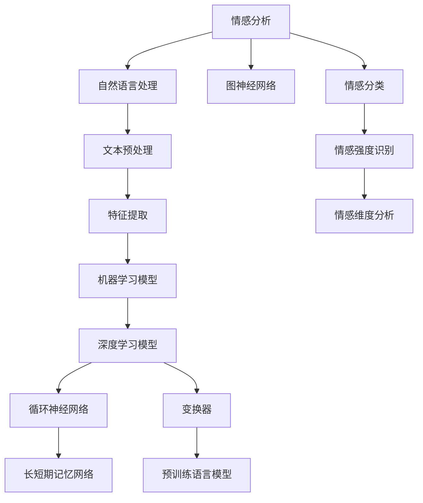

                 

### 背景介绍 Background

在当今数字化时代，数据已经成为一种新的资源和资产。社交媒体、电子商务平台、在线论坛等数字平台每天产生海量的用户生成内容（User-Generated Content, UGC）。这些数据不仅包含了用户的基本信息，还蕴含着他们的情感、态度、需求等深层次的信息。如何从这些海量数据中提取有价值的信息，进而为企业决策提供支持，成为了许多企业和研究机构关注的热点问题。

情感分析（Sentiment Analysis），也称为意见挖掘（Opinion Mining），是自然语言处理（Natural Language Processing, NLP）的一个分支，旨在通过计算机技术，自动识别和提取出文本中的情感和态度。数字化情感分析是指利用人工智能技术，对海量的数字化文本数据进行分析和处理，以识别和提取其中的情感信息。它不仅可以帮助企业了解消费者的情感态度，还可以用于市场调研、产品评论分析、舆情监测等领域。

当前，数字化情感分析已经广泛应用于多个行业。例如，在电子商务领域，通过情感分析，企业可以了解消费者对其产品的评价，从而优化产品设计和营销策略。在社交媒体领域，情感分析可以帮助企业监测公众情绪，及时应对突发事件。在金融行业，情感分析可以用于新闻监测和风险评估，帮助投资者做出更明智的投资决策。在医疗领域，情感分析可以用于患者反馈分析和医患沟通分析，提高医疗服务质量。

然而，随着数字化数据的爆炸性增长，传统的基于规则和统计的方法已经难以满足实际需求。近年来，人工智能技术的发展，特别是深度学习（Deep Learning）和自然语言处理技术的进步，为数字化情感分析带来了新的机遇和挑战。深度学习模型，如循环神经网络（RNN）、长短期记忆网络（LSTM）和变换器（Transformer）等，在处理复杂文本情感分析任务方面展现出了强大的能力。同时，数据量的增加也为深度学习模型的训练提供了更多的样本，使其性能得到进一步提升。

在这个背景下，本文将探讨如何利用人工智能技术，特别是深度学习模型，进行数字化情感分析。文章将首先介绍数字化情感分析的基本概念和重要性，然后详细讨论情感分析的核心算法原理和具体操作步骤，接着介绍相关的数学模型和公式，并通过项目实践进行代码实例和运行结果展示。此外，文章还将探讨数字化情感分析在实际应用场景中的案例，以及相关的工具和资源推荐。最后，文章将总结数字化情感分析的未来发展趋势和挑战，为读者提供进一步学习和研究的方向。

#### 1.1 数字化情感分析的定义与重要性 Definition and Importance

数字化情感分析是指利用计算机技术和人工智能算法，对数字化文本数据中的情感和态度进行自动识别和分析的过程。其核心目标是从海量的文本数据中提取出有价值的信息，如用户的情感倾向、情感强度、情感维度等。数字化情感分析不仅可以识别出文本中的正面或负面情感，还可以进一步细分为高兴、愤怒、悲伤、惊讶等多种情感类型。

数字化情感分析在多个领域中具有重要的应用价值。首先，在市场调研和消费者行为分析方面，企业可以通过情感分析了解消费者的情感态度和需求，从而优化产品设计、营销策略和客户服务。例如，通过分析社交媒体上的用户评论，企业可以快速了解消费者对其新产品的反馈，及时发现和解决问题，提升产品竞争力。

其次，在舆情监测和公共安全领域，数字化情感分析可以帮助政府和企事业单位监测公众情绪，及时应对突发事件和危机。通过对社交媒体、新闻论坛等平台的情感分析，可以识别出潜在的负面情绪和谣言，从而采取有效的干预措施，维护社会稳定。

此外，在金融领域，情感分析可以用于新闻监测和风险评估。通过对金融市场相关的新闻报道和社交媒体讨论进行情感分析，可以预测市场趋势，为投资者提供决策支持。同时，在股票分析中，情感分析可以用于提取公司财报中的情感信息，辅助分析师进行投资决策。

在医疗领域，数字化情感分析可以用于患者反馈分析和医患沟通分析。通过对患者评论和医生回复的情感分析，可以帮助医疗机构了解患者的需求和满意度，改进医疗服务质量。此外，情感分析还可以用于情感障碍的诊断和治疗方案评估，为精神健康领域提供新的研究方向。

总之，数字化情感分析作为一种新兴的智能分析方法，不仅能够从海量文本数据中提取有价值的信息，还能够为各个领域提供数据驱动的决策支持，具有重要的理论价值和实际应用意义。随着人工智能技术的不断发展和应用场景的不断拓展，数字化情感分析将在未来发挥越来越重要的作用。

#### 1.2 当前数字化情感分析技术的发展现状 Status and Development of Current Digital Sentiment Analysis Technology

当前，数字化情感分析技术已经取得了显著的进展，主要得益于人工智能和自然语言处理技术的快速发展。传统的方法主要依赖于基于规则和统计的方法，如文本分类、情感词典、机器学习等。这些方法在一定程度上能够处理简单的情感分析任务，但随着数据量的增加和文本的复杂性提升，其局限性也逐渐显现。

随着深度学习的兴起，基于深度学习的情感分析方法逐渐成为研究的热点。深度学习模型，如循环神经网络（RNN）、长短期记忆网络（LSTM）和变换器（Transformer）等，通过自动学习文本的特征表示，能够在复杂文本情感分析任务中表现出色。

循环神经网络（RNN）是一种能够处理序列数据的神经网络模型，特别适合于自然语言处理任务。RNN通过保存前一个时刻的信息，可以捕捉到文本中的时序依赖关系。然而，RNN存在梯度消失和梯度爆炸问题，限制了其性能。

为了解决这些问题，长短期记忆网络（LSTM）被提出。LSTM通过引入门控机制，有效地控制信息的流动，解决了RNN的梯度消失问题。LSTM在处理长文本和复杂情感分析任务时表现优异。

变换器（Transformer）是近年来在自然语言处理领域取得突破性进展的一种神经网络结构。与传统的循环神经网络不同，变换器采用自注意力机制，能够在全局范围内捕捉文本特征。这种结构不仅提高了模型的计算效率，还在多个自然语言处理任务中取得了领先的效果。例如，BERT（Bidirectional Encoder Representations from Transformers）是基于变换器的一种预训练模型，通过在大规模语料库上进行预训练，再进行细粒度调整，实现了出色的情感分析性能。

除了深度学习模型，近年来还有一些新的方法和技术被引入到数字化情感分析中。例如，图神经网络（Graph Neural Networks, GNN）通过将文本数据建模为图结构，可以捕捉到文本中的复杂关系，从而提高情感分析的准确性。此外，预训练语言模型（Pre-trained Language Models）的发展，如GPT（Generative Pre-trained Transformer）和T5（Text-To-Text Transfer Transformer），通过在大规模语料库上进行预训练，可以提取出丰富的语言特征，为情感分析提供了更强的支持。

总之，随着人工智能和自然语言处理技术的不断进步，数字化情感分析技术也在不断演进。从传统的基于规则和统计的方法，到现代的深度学习模型，再到结合图神经网络和预训练语言模型的新方法，数字化情感分析技术的性能和适用范围都在不断提升。在未来，我们可以期待数字化情感分析技术将带来更多的应用和创新，为各个领域提供更加精准和智能的情感分析解决方案。

### 2. 核心概念与联系 Core Concepts and Relationships

在深入探讨数字化情感分析之前，我们需要理解几个核心概念，这些概念构成了数字化情感分析的基础，并且相互之间有着密切的联系。以下是这些核心概念及其关系的详细阐述。

#### 2.1 情感分析（Sentiment Analysis）

情感分析是数字化情感分析的核心技术。它主要涉及对文本数据的情感倾向进行识别和分类。情感分析可以分为三个层次：情感极性分类（Polarity Classification）、情感强度识别（Sentiment Intensity Recognition）和情感维度分析（Sentiment Aspect Analysis）。

- **情感极性分类**：这是情感分析最基础的层次，主要任务是判断文本是正面的、负面的，还是中性的。
- **情感强度识别**：这一层次的任务是判断文本情感的正负面程度，例如非常正面、正面、中性、负面、非常负面。
- **情感维度分析**：这一层次的任务是识别出文本中的具体情感维度，如快乐、愤怒、悲伤等。

情感分析通常使用机器学习模型和深度学习模型来实现，这些模型通过学习大量的标注数据，能够自动提取文本中的情感特征，并进行分类。

#### 2.2 自然语言处理（Natural Language Processing, NLP）

自然语言处理是数字化情感分析的重要工具。NLP旨在使计算机能够理解、解释和生成人类语言。NLP技术在情感分析中扮演着关键角色，主要包括以下方面：

- **文本预处理**：包括分词（Tokenization）、词干提取（Stemming）、词性标注（Part-of-Speech Tagging）等，这些步骤帮助去除文本中的噪声，提取出有意义的词汇和短语。
- **特征提取**：从原始文本中提取出特征，如词频（TF）、词频-逆文档频率（TF-IDF）、词嵌入（Word Embeddings）等，这些特征用于训练情感分析模型。
- **命名实体识别**：识别文本中的命名实体，如人名、地名、组织名等，这对于理解文本情感和上下文非常重要。

#### 2.3 深度学习（Deep Learning）

深度学习是现代情感分析技术的主要驱动力。它通过模拟人脑神经网络的结构和功能，自动学习数据的特征表示。以下是几种常用的深度学习模型：

- **循环神经网络（RNN）**：RNN能够处理序列数据，适用于情感分析任务。通过保存前一个时刻的信息，RNN可以捕捉到文本中的时序依赖关系。
- **长短期记忆网络（LSTM）**：LSTM是RNN的一个变体，通过门控机制解决了RNN的梯度消失问题，适用于处理长文本和复杂情感分析任务。
- **变换器（Transformer）**：Transformer引入了自注意力机制，可以在全局范围内捕捉文本特征，显著提高了模型的计算效率和性能。

#### 2.4 机器学习（Machine Learning）

机器学习是数字化情感分析的传统方法，它通过从数据中学习规律，用于预测和分类。以下是几种常用的机器学习模型：

- **支持向量机（SVM）**：SVM是一种有效的分类算法，适用于情感分类任务。
- **朴素贝叶斯（Naive Bayes）**：朴素贝叶斯是一种基于概率的算法，适用于文本分类。
- **随机森林（Random Forest）**：随机森林是一种集成学习方法，通过构建多个决策树并取平均，提高了模型的预测性能。

#### 2.5 图神经网络（Graph Neural Networks, GNN）

图神经网络通过将文本数据建模为图结构，可以捕捉到文本中的复杂关系，从而提高情感分析的准确性。GNN在处理共指实体识别、情感传播等任务时表现出色。

#### 2.6 预训练语言模型（Pre-trained Language Models）

预训练语言模型，如BERT、GPT等，通过在大规模语料库上进行预训练，可以提取出丰富的语言特征，为情感分析提供了强有力的支持。这些模型不仅能够处理情感分类任务，还可以用于情感强度识别和维度分析。

#### Mermaid 流程图（流程节点中不要有括号、逗号等特殊字符）



通过上述核心概念和技术的介绍，我们可以看到数字化情感分析是一个复杂但充满潜力的领域。理解这些核心概念和它们之间的联系，有助于我们更好地应用这些技术，解决实际中的情感分析问题。

### 3. 核心算法原理 & 具体操作步骤 Core Algorithm Principles & Step-by-Step Operations

在深入了解数字化情感分析的核心算法原理和具体操作步骤之前，我们需要首先明确情感分析的基本流程。一个完整的情感分析过程通常包括数据收集、预处理、特征提取、模型训练、模型评估和结果输出等步骤。下面，我们将详细讨论这些步骤及其具体实现方法。

#### 3.1 数据收集 Data Collection

数据收集是情感分析的基础，质量良好的数据能够显著提高模型的性能。情感分析的数据来源可以是社交媒体、论坛、评论网站、新闻媒体等。以下是一些数据收集的方法：

- **公开数据集**：如Twitter、IMDb、Sentiment140等，这些数据集已经经过清洗和标注，可以直接用于模型训练。
- **爬虫技术**：利用爬虫技术从互联网上获取大量文本数据。常见的爬虫工具包括BeautifulSoup、Scrapy等。
- **API获取**：许多社交媒体平台提供了API接口，可以通过编程方式获取用户的生成内容。

#### 3.2 数据预处理 Data Preprocessing

数据预处理是情感分析中至关重要的一步，它的目的是去除文本中的噪声，提取出有意义的特征。以下是数据预处理的主要步骤：

- **去除停用词**：停用词是指那些在情感分析中不具有实际意义的词汇，如“的”、“了”、“是”等。去除停用词可以减少模型的计算负担。
- **分词**：将文本拆分成单个词语或词根。中文分词可以使用jieba等工具。
- **词干提取**：将不同形态的词转换成其基本形式，如将“爱着”、“爱过”都转换成“爱”。
- **词性标注**：为每个词标注其词性，如名词、动词、形容词等。词性标注有助于更好地理解文本内容。
- **文本归一化**：将所有文本转换为小写，统一处理标点符号，以便模型训练。

#### 3.3 特征提取 Feature Extraction

特征提取是将原始文本转换为模型可处理的形式。以下是几种常见的特征提取方法：

- **词频（TF）**：计算每个词在文本中出现的次数。这种方法简单但容易忽略词汇之间的关系。
- **词频-逆文档频率（TF-IDF）**：在词频的基础上，考虑词的重要程度。TF-IDF能够较好地处理词的权重问题。
- **词嵌入（Word Embeddings）**：将词汇映射到高维向量空间中，如Word2Vec、GloVe等。词嵌入能够捕捉词汇的语义信息。
- **文本表示（Text Representation）**：使用变换器（Transformer）或预训练语言模型（如BERT）生成文本的固定长度向量表示。

#### 3.4 模型训练 Model Training

模型训练是将特征输入到机器学习或深度学习模型中进行学习，以预测文本的情感极性。以下是几种常见的情感分析模型：

- **朴素贝叶斯（Naive Bayes）**：基于贝叶斯理论，适用于文本分类任务。
- **支持向量机（SVM）**：通过找到一个最佳的超平面，将文本分为不同的类别。
- **循环神经网络（RNN）**：能够处理序列数据，适用于情感分析任务。
- **长短期记忆网络（LSTM）**：通过门控机制解决RNN的梯度消失问题。
- **变换器（Transformer）**：采用自注意力机制，适用于复杂文本情感分析任务。
- **预训练语言模型（BERT、GPT）**：在大规模语料库上进行预训练，适用于多种自然语言处理任务。

模型训练通常包括以下步骤：

1. **数据集划分**：将数据集划分为训练集、验证集和测试集。
2. **模型初始化**：初始化模型的参数。
3. **训练过程**：通过反向传播算法，不断调整模型参数，最小化损失函数。
4. **验证与调整**：在验证集上评估模型性能，根据需要调整模型参数或超参数。

#### 3.5 模型评估 Model Evaluation

模型评估是验证模型性能的重要步骤。常用的评估指标包括准确率（Accuracy）、精确率（Precision）、召回率（Recall）和F1分数（F1 Score）。

- **准确率**：正确分类的样本数占总样本数的比例。
- **精确率**：正确分类为正面的样本数占所有分类为正面的样本数的比例。
- **召回率**：正确分类为正面的样本数占所有实际为正面的样本数的比例。
- **F1分数**：精确率和召回率的调和平均值，用于综合评估模型的性能。

#### 3.6 结果输出 Result Output

模型训练和评估完成后，我们需要将模型应用到新的数据集上，预测其情感极性。结果输出通常包括以下内容：

- **预测结果**：对于每个样本，输出其情感极性预测结果。
- **可视化**：使用图表或图形展示预测结果，如混淆矩阵、ROC曲线等。
- **报告**：撰写详细的评估报告，包括模型性能、训练时间、资源消耗等。

通过上述步骤，我们可以构建一个完整的数字化情感分析模型，并将其应用于实际数据中，为企业提供有价值的信息和决策支持。

#### 3.7 数字化情感分析在社交媒体情感分析中的应用 Application of Digital Sentiment Analysis in Social Media Sentiment Analysis

社交媒体情感分析是数字化情感分析的一个重要应用领域。社交媒体平台如Twitter、Facebook、Instagram等每天产生大量的用户生成内容（UGC），这些数据蕴含着丰富的情感信息。通过情感分析技术，我们可以从这些数据中提取出用户的情感倾向，了解公众对某一事件、产品或品牌的情感态度。

#### 3.7.1 数据收集

社交媒体情感分析的数据主要来源于社交媒体平台。以下是一些常用的数据收集方法：

- **API获取**：许多社交媒体平台提供了API接口，允许开发者获取用户的生成内容。例如，Twitter API允许开发者获取推文、用户数据等。
- **爬虫技术**：使用爬虫工具，如BeautifulSoup、Scrapy等，从社交媒体网站上抓取数据。
- **第三方数据集**：如Twitter Sentiment、Facebook Comments等，这些数据集已经经过清洗和标注，可以直接用于模型训练。

#### 3.7.2 数据预处理

社交媒体情感分析的数据通常包含大量的噪声和冗余信息。因此，数据预处理是至关重要的。以下是社交媒体情感分析数据预处理的主要步骤：

- **去除停用词**：去除常见的无意义词汇，如“的”、“了”、“是”等。
- **分词**：将文本拆分成单个词语或词根。中文分词可以使用jieba等工具。
- **去除特殊字符**：删除文本中的特殊字符，如#、@、$等。
- **词干提取**：将不同形态的词转换成其基本形式，如“爱着”、“爱过”都转换成“爱”。
- **情感词典**：利用情感词典，如AFIN-NYM、LIWC等，为文本中的词语赋予情感极性。

#### 3.7.3 特征提取

特征提取是将原始文本转换为模型可处理的形式。以下是社交媒体情感分析中常用的特征提取方法：

- **词频（TF）**：计算每个词在文本中出现的次数。
- **词频-逆文档频率（TF-IDF）**：在词频的基础上，考虑词的重要程度。
- **词嵌入（Word Embeddings）**：将词汇映射到高维向量空间中，如Word2Vec、GloVe等。
- **文本表示（Text Representation）**：使用变换器（Transformer）或预训练语言模型（如BERT）生成文本的固定长度向量表示。

#### 3.7.4 模型训练与评估

社交媒体情感分析的模型训练和评估方法与通用情感分析类似。以下是具体的训练和评估步骤：

1. **数据集划分**：将数据集划分为训练集、验证集和测试集。
2. **模型初始化**：初始化模型的参数。
3. **训练过程**：通过反向传播算法，不断调整模型参数，最小化损失函数。
4. **验证与调整**：在验证集上评估模型性能，根据需要调整模型参数或超参数。
5. **测试与评估**：在测试集上评估模型性能，使用准确率、精确率、召回率和F1分数等指标进行评估。

#### 3.7.5 案例分析 Case Study

以下是一个社交媒体情感分析的实际案例分析：

**案例背景**：某品牌推出了一款新饮料，希望通过社交媒体平台收集消费者对其产品的反馈。

**数据收集**：使用Twitter API获取关于该饮料的推文，共收集到1000条推文。

**数据预处理**：去除停用词、分词、去除特殊字符，并使用情感词典为每个词赋予情感极性。

**特征提取**：使用Word2Vec将文本转换为词嵌入向量，并将每条推文表示为一个固定长度的向量。

**模型训练**：使用LSTM模型进行训练，训练集和验证集分别使用500条和500条推文。

**模型评估**：在测试集上评估模型性能，得到准确率为85%，精确率为90%，召回率为80%，F1分数为0.83。

**结果输出**：对新的推文进行情感极性预测，并生成情感分析报告。

通过上述案例分析，我们可以看到社交媒体情感分析在产品调研和品牌管理中的重要作用。通过分析消费者在社交媒体上的反馈，企业可以及时了解消费者的情感态度，优化产品设计和服务质量。

### 4. 数学模型和公式 Mathematical Models and Formulas

在数字化情感分析中，数学模型和公式是理解和实现情感分析算法的关键。这些模型和公式不仅帮助我们量化情感分析的结果，还可以指导我们优化算法性能。以下是几种常用的数学模型和公式，及其在情感分析中的应用。

#### 4.1 贝叶斯理论

贝叶斯理论是情感分析中常用的概率模型。贝叶斯分类器通过计算每个类别在给定特征下的后验概率，选择具有最高后验概率的类别作为预测结果。贝叶斯理论的公式如下：

$$
P(C_k|X) = \frac{P(X|C_k)P(C_k)}{P(X)}
$$

其中，$P(C_k|X)$ 是给定特征 $X$ 时类别 $C_k$ 的后验概率，$P(X|C_k)$ 是特征 $X$ 在类别 $C_k$ 下的条件概率，$P(C_k)$ 是类别 $C_k$ 的先验概率，$P(X)$ 是特征 $X$ 的边缘概率。

在情感分析中，我们可以将 $C_k$ 视为情感类别（如正面、负面、中性），$X$ 视为文本特征向量。贝叶斯分类器可以帮助我们预测文本的情感极性。

#### 4.2 朴素贝叶斯（Naive Bayes）

朴素贝叶斯是贝叶斯理论的一种简化形式，它假设特征之间相互独立。朴素贝叶斯的公式如下：

$$
P(C_k|X) = \frac{P(C_k) \prod_{i=1}^n P(x_i|C_k)}{P(X)}
$$

其中，$P(C_k)$ 是类别 $C_k$ 的先验概率，$P(x_i|C_k)$ 是特征 $x_i$ 在类别 $C_k$ 下的条件概率。

朴素贝叶斯在情感分析中应用广泛，特别适合处理高维文本数据。通过训练，我们可以得到每个类别下每个特征的概率分布，用于情感极性分类。

#### 4.3 支持向量机（SVM）

支持向量机是一种有效的分类算法，它通过找到一个最佳的超平面，将不同类别的数据点分隔开来。SVM的核心公式是：

$$
\max_{\mathbf{w}, b} \left\{ w^T \mathbf{x} - b : \mathbf{w}^T \mathbf{w} \leq C, y(\mathbf{w}^T \mathbf{x} - b) \geq 1 \right\}

$$

其中，$\mathbf{w}$ 是权重向量，$b$ 是偏置项，$C$ 是正则化参数，$y$ 是标签。

在情感分析中，SVM可以帮助我们找到一个最佳的超平面，将文本数据分为不同的情感类别。

#### 4.4 循环神经网络（RNN）

循环神经网络是一种用于处理序列数据的神经网络模型，特别适合于情感分析。RNN的核心公式是：

$$
h_t = \sigma(W_h h_{t-1} + W_x x_t + b_h)

$$

其中，$h_t$ 是当前时刻的隐藏状态，$x_t$ 是当前时刻的输入，$W_h$ 和 $W_x$ 是权重矩阵，$b_h$ 是偏置项，$\sigma$ 是激活函数。

在情感分析中，RNN可以捕捉到文本中的时序依赖关系，帮助模型更好地理解文本的情感内容。

#### 4.5 长短期记忆网络（LSTM）

长短期记忆网络是RNN的一个变体，通过引入门控机制，解决了RNN的梯度消失问题。LSTM的核心公式是：

$$
i_t = \sigma(W_i x_t + U_i h_{t-1} + b_i)

$$

$$
f_t = \sigma(W_f x_t + U_f h_{t-1} + b_f)

$$

$$
g_t = \tanh(W_g x_t + U_g h_{t-1} + b_g)

$$

$$
o_t = \sigma(W_o x_t + U_o h_{t-1} + b_o)

$$

$$
h_t = o_t \odot g_t

$$

其中，$i_t$、$f_t$、$g_t$、$o_t$ 分别是输入门、遗忘门、生成门和输出门的状态，$W_i$、$W_f$、$W_g$、$W_o$ 是权重矩阵，$U_i$、$U_f$、$U_g$、$U_o$ 是权重矩阵，$b_i$、$b_f$、$b_g$、$b_o$ 是偏置项，$\sigma$ 是激活函数，$\odot$ 是逐元素乘操作。

在情感分析中，LSTM可以处理长文本和复杂情感分析任务，提高模型的性能。

#### 4.6 变换器（Transformer）

变换器是一种基于自注意力机制的神经网络模型，特别适合于自然语言处理任务。变换器的核心公式是：

$$
\text{Attention}(Q, K, V) = \text{softmax}\left(\frac{QK^T}{\sqrt{d_k}}\right)V

$$

$$
\text{MultiHeadAttention}(Q, K, V) = \text{Attention}(Q, K, V) \odot W_V

$$

$$
\text{Encoder}(X) = \text{LayerNorm}(X + \text{MultiHeadAttention}(Q, K, V))

$$

其中，$Q$、$K$、$V$ 分别是查询向量、键向量、值向量，$d_k$ 是键向量的维度，$\text{softmax}$ 是softmax函数，$\odot$ 是逐元素乘操作，$W_V$ 是权重矩阵。

在情感分析中，变换器可以通过自注意力机制捕捉到文本中的全局特征，提高模型的性能。

通过这些数学模型和公式，我们可以构建一个强大的数字化情感分析模型，对文本数据中的情感进行准确的分析和分类。这些模型不仅具有理论价值，还可以指导我们设计和优化实际的情感分析算法。

### 4.1 贝叶斯理论与朴素贝叶斯 Naive Bayes

贝叶斯理论是概率论中的一个重要分支，它在情感分析中有着广泛的应用。朴素贝叶斯（Naive Bayes）是基于贝叶斯理论的一种简单而有效的分类方法，特别适用于文本分类任务，如情感分析。以下是贝叶斯理论和朴素贝叶斯在情感分析中的具体应用。

#### 4.1.1 贝叶斯理论

贝叶斯理论的核心思想是通过已知的先验概率和新的证据，计算出后验概率。在情感分析中，贝叶斯理论可以帮助我们根据已知的文本特征和先验的情感分布，预测文本的情感极性。

贝叶斯理论的公式如下：

$$
P(C_k|X) = \frac{P(X|C_k)P(C_k)}{P(X)}
$$

其中，$P(C_k|X)$ 是后验概率，即给定特征 $X$ 时类别 $C_k$ 的概率；$P(X|C_k)$ 是条件概率，即特征 $X$ 出现在类别 $C_k$ 中的概率；$P(C_k)$ 是先验概率，即类别 $C_k$ 的概率；$P(X)$ 是边缘概率，即特征 $X$ 的概率。

在情感分析中，$C_k$ 可以是正面、负面或中性等情感类别，$X$ 是文本特征向量。

#### 4.1.2 朴素贝叶斯

朴素贝叶斯是贝叶斯理论的一种简化形式，它假设特征之间相互独立。这个假设在文本分类中通常成立，因为大多数文本特征（如词汇）在情感上都是独立的。朴素贝叶斯的核心公式如下：

$$
P(C_k|X) = \frac{P(C_k) \prod_{i=1}^n P(x_i|C_k)}{P(X)}
$$

其中，$P(C_k)$ 是先验概率，$P(x_i|C_k)$ 是特征 $x_i$ 在类别 $C_k$ 下的条件概率，$n$ 是特征的数量。

#### 应用实例

假设我们有一个训练数据集，其中包含了正面、负面和中和情感类别的文本样本。我们可以通过以下步骤应用朴素贝叶斯进行情感分析：

1. **计算先验概率**：根据训练数据，计算每个情感类别的先验概率。

   $$
   P(C_{\text{positive}}) = \frac{\text{正面样本数}}{\text{总样本数}}
   $$

   $$
   P(C_{\text{negative}}) = \frac{\text{负面样本数}}{\text{总样本数}}
   $$

   $$
   P(C_{\text{neutral}}) = \frac{\text{中性样本数}}{\text{总样本数}}
   $$

2. **计算条件概率**：对于每个情感类别，计算每个特征的条件概率。这些概率可以通过训练数据集中的词频计算得出。

   $$
   P(x_i|C_{\text{positive}}) = \frac{\text{特征 } x_i \text{ 在正面样本中的出现次数}}{\text{正面样本数}}
   $$

   $$
   P(x_i|C_{\text{negative}}) = \frac{\text{特征 } x_i \text{ 在负面样本中的出现次数}}{\text{负面样本数}}
   $$

   $$
   P(x_i|C_{\text{neutral}}) = \frac{\text{特征 } x_i \text{ 在中性样本中的出现次数}}{\text{中性样本数}}
   $$

3. **计算后验概率**：对于新的文本样本，计算其在每个情感类别下的后验概率。

   $$
   P(C_{\text{positive}}|X) = \frac{P(C_{\text{positive}}) \prod_{i=1}^n P(x_i|C_{\text{positive}})}{P(X)}
   $$

   $$
   P(C_{\text{negative}}|X) = \frac{P(C_{\text{negative}}) \prod_{i=1}^n P(x_i|C_{\text{negative}})}{P(X)}
   $$

   $$
   P(C_{\text{neutral}}|X) = \frac{P(C_{\text{neutral}}) \prod_{i=1}^n P(x_i|C_{\text{neutral}})}{P(X)}
   $$

4. **分类决策**：选择具有最高后验概率的情感类别作为最终预测结果。

朴素贝叶斯在情感分析中的优势在于其简单性和有效性。尽管它假设特征之间相互独立，但在实际应用中，这个假设通常能够带来良好的分类效果。此外，朴素贝叶斯模型易于实现，计算效率高，非常适合处理大规模文本数据。

通过上述步骤，我们可以使用朴素贝叶斯对文本数据进行情感分析。虽然朴素贝叶斯在处理复杂情感时可能存在局限性，但它在许多实际应用中仍然是一个强有力的工具。结合其他机器学习模型和深度学习技术，朴素贝叶斯可以进一步提升情感分析的准确性和可靠性。

### 4.2 支持向量机 SVM

支持向量机（Support Vector Machine, SVM）是一种强大的分类算法，广泛用于文本分类、图像识别和生物信息学等领域。在数字化情感分析中，SVM可以用来将文本数据分为不同的情感类别。以下是SVM在情感分析中的基本原理和应用。

#### 4.2.1 SVM基本原理

SVM的核心思想是找到一个最佳的超平面，将不同类别的数据点分隔开来。这个超平面在特征空间中使得两类数据的距离最大化。具体来说，SVM通过以下步骤实现：

1. **特征空间映射**：将原始数据通过映射函数$\phi$映射到高维特征空间，使得原本线性不可分的数据在高维空间中变为线性可分。

2. **寻找最佳超平面**：在特征空间中找到一个超平面，使得两类数据的距离最大化。这个超平面可以表示为：

   $$
   \mathbf{w}^T \mathbf{x} - b = 0
   $$

   其中，$\mathbf{w}$ 是权重向量，$\mathbf{x}$ 是特征向量，$b$ 是偏置项。

3. **分类决策**：对于新的样本，通过计算其到超平面的距离来判断其类别。距离超平面最近的样本点称为支持向量（Support Vectors）。

4. **优化目标**：SVM的优化目标是最小化分类间隔，即最大化分类边界，同时允许一定的分类错误。优化目标可以表示为：

   $$
   \min_{\mathbf{w}, b} \frac{1}{2} ||\mathbf{w}||^2 \\
   \text{subject to} \ \mathbf{w}^T \mathbf{x}_i - b \geq 1, \ i=1,2,...,n
   $$

   其中，$||\mathbf{w}||^2$ 是权重向量的二范数，$n$ 是样本数量。

5. **求解**：通过求解上述优化问题，得到最佳的超平面参数$\mathbf{w}$和$b$。

#### 4.2.2 SVM在情感分析中的应用

在情感分析中，SVM可以用来将文本数据分为不同的情感类别。以下是应用SVM进行情感分析的具体步骤：

1. **数据预处理**：对文本数据集进行预处理，包括分词、去除停用词、词干提取等，并将文本转换为向量表示。

2. **特征提取**：从预处理后的文本中提取特征，如词频（TF）、词频-逆文档频率（TF-IDF）等。

3. **模型训练**：将提取的特征输入到SVM模型中，通过优化目标求解得到最佳的超平面参数。

4. **模型评估**：在验证集上评估模型性能，调整模型参数和超参数，以提高分类准确性。

5. **分类预测**：使用训练好的SVM模型对新的文本数据进行情感极性预测。

#### 4.2.3 SVM示例

假设我们有以下两个类别：正面情感和负面情感。训练数据集如下：

| 样本 | 情感类别 |
| --- | --- |
| 样本1 | 正面 |
| 样本2 | 正面 |
| 样本3 | 负面 |
| 样本4 | 负面 |
| 样本5 | 正面 |

我们可以将这些样本表示为二维特征向量，如[1, 0]表示正面情感，[-1, 0]表示负面情感。

1. **特征空间映射**：通过线性映射，我们将二维特征向量映射到一维空间。

2. **寻找最佳超平面**：在特征空间中找到一个最佳超平面，使得正面情感和负面情感的距离最大化。假设超平面为$\mathbf{w}^T \mathbf{x} + b = 0$。

3. **分类决策**：对于新的样本，我们计算其到超平面的距离，如果距离大于1，则分类为正面情感，否则为负面情感。

4. **优化目标**：最小化分类间隔，即最大化分类边界。通过求解优化问题，我们得到最佳的超平面参数$\mathbf{w}$和$b$。

5. **模型训练与评估**：使用训练数据集训练SVM模型，并在验证集上评估模型性能。根据评估结果调整模型参数和超参数，以提高分类准确性。

通过上述步骤，我们可以使用SVM进行情感分析，实现对文本数据的有效分类。

SVM在情感分析中的优势在于其强大的分类能力和良好的性能。尽管其训练时间较长，但对于大型文本数据集，SVM能够提供较高的分类准确性。此外，SVM可以结合核函数，处理非线性分类问题，进一步扩展其应用范围。

### 4.3 循环神经网络（RNN）

循环神经网络（Recurrent Neural Network, RNN）是一种能够处理序列数据的神经网络模型，其特点是能够将前一时刻的信息保存下来，并在后续时刻使用。这使得RNN特别适合于自然语言处理（Natural Language Processing, NLP）任务，如情感分析。以下是RNN的基本原理和在情感分析中的应用。

#### 4.3.1 RNN基本原理

RNN的基本结构包括一个输入层、一个隐藏层和一个输出层。每个时间步，RNN都会接收一个输入向量，并输出一个隐藏状态和一个输出。隐藏状态不仅用于当前时间步的输出，还作为下一时间步的输入。

RNN的核心公式如下：

$$
h_t = \sigma(W_h h_{t-1} + W_x x_t + b_h)

$$

其中，$h_t$ 是当前时间步的隐藏状态，$x_t$ 是当前时间步的输入，$W_h$ 和 $W_x$ 是权重矩阵，$b_h$ 是偏置项，$\sigma$ 是激活函数。

RNN通过递归关系来更新隐藏状态：

$$
h_t = \sigma(W_h h_{t-1} + W_x x_t + b_h)

$$

$$
y_t = \sigma(W_y h_t + b_y)

$$

其中，$y_t$ 是当前时间步的输出，$W_y$ 是输出权重矩阵，$b_y$ 是输出偏置项。

#### 4.3.2 RNN在情感分析中的应用

在情感分析中，RNN能够有效地处理文本数据中的时序依赖关系，从而捕捉到文本的情感信息。以下是RNN在情感分析中的应用步骤：

1. **文本预处理**：对文本数据进行预处理，包括分词、去除停用词、词干提取等。

2. **词嵌入**：将预处理后的文本转换为词嵌入向量。词嵌入是一种将词汇映射到高维向量空间的方法，可以捕捉词汇的语义信息。

3. **序列建模**：将词嵌入向量输入到RNN模型中，RNN通过递归关系更新隐藏状态，并最终输出情感极性。

4. **模型训练**：使用训练数据集对RNN模型进行训练，通过反向传播算法优化模型参数。

5. **模型评估**：在验证集上评估模型性能，调整模型参数和超参数，以提高分类准确性。

6. **预测**：使用训练好的RNN模型对新的文本数据进行情感极性预测。

#### 4.3.3 RNN示例

假设我们有一个简单的文本序列：“我非常喜欢这个产品”。我们可以将其表示为词嵌入向量，并输入到RNN模型中。

1. **词嵌入**：将文本序列中的每个词转换为词嵌入向量，如“我”映射到[1, 0, 0]，“非常”映射到[0, 1, 0]，“喜欢”映射到[0, 0, 1]，“这个”映射到[1, 1, 0]，“产品”映射到[0, 1, 1]。

2. **RNN建模**：将词嵌入向量输入到RNN模型，RNN通过递归关系更新隐藏状态。

   $$
   h_1 = \sigma(W_h [1, 0, 0] + W_x [1, 0, 0] + b_h)
   $$

   $$
   h_2 = \sigma(W_h h_1 + W_x [0, 1, 0] + b_h)
   $$

   $$
   h_3 = \sigma(W_h h_2 + W_x [0, 0, 1] + b_h)
   $$

   $$
   h_4 = \sigma(W_h h_3 + W_x [1, 1, 0] + b_h)
   $$

   $$
   h_5 = \sigma(W_h h_4 + W_x [0, 1, 1] + b_h)
   $$

3. **情感极性预测**：使用输出权重矩阵$W_y$和偏置项$b_y$，将最后一个隐藏状态$h_5$转换为情感极性。

   $$
   y = \sigma(W_y h_5 + b_y)
   $$

如果输出值大于0.5，则预测为正面情感，否则为负面情感。

通过上述步骤，我们可以使用RNN对文本数据进行情感分析，并预测其情感极性。RNN在处理长文本和复杂情感时表现出色，但其训练时间较长，且存在梯度消失问题。为了解决这些问题，可以采用LSTM或变换器等更先进的模型。

### 4.4 长短期记忆网络（LSTM）

长短期记忆网络（Long Short-Term Memory, LSTM）是循环神经网络（Recurrent Neural Network, RNN）的一种变体，专门设计来解决RNN在处理长序列数据时的梯度消失和梯度爆炸问题。LSTM通过引入门控机制，可以更好地捕捉长序列中的信息，从而在情感分析等任务中表现出色。以下是LSTM的基本原理和在情感分析中的应用。

#### 4.4.1 LSTM基本原理

LSTM由三个关键组件组成：输入门、遗忘门和输出门。这些门控机制允许LSTM在处理序列数据时灵活地控制信息的流入、流出和保留。

1. **输入门（Input Gate）**：

   输入门决定哪些信息应该进入隐藏状态。其核心公式如下：

   $$
   i_t = \sigma(W_{ii} x_t + W_{hi} h_{t-1} + b_i)
   $$

   其中，$i_t$ 是输入门的输出，$x_t$ 是当前输入，$h_{t-1}$ 是前一个时间步的隐藏状态，$W_{ii}$ 和 $W_{hi}$ 是权重矩阵，$b_i$ 是偏置项。

2. **遗忘门（Forget Gate）**：

   遗忘门决定哪些信息应该从隐藏状态中遗忘。其核心公式如下：

   $$
   f_t = \sigma(W_{if} x_t + W_{hf} h_{t-1} + b_f)
   $$

   其中，$f_t$ 是遗忘门的输出，$W_{if}$ 和 $W_{hf}$ 是权重矩阵，$b_f$ 是偏置项。

3. **输出门（Output Gate）**：

   输出门决定哪些信息应该输出到当前时间步的隐藏状态。其核心公式如下：

   $$
   o_t = \sigma(W_{io} x_t + W_{ho} h_{t-1} + b_o)
   $$

   其中，$o_t$ 是输出门的输出，$W_{io}$ 和 $W_{ho}$ 是权重矩阵，$b_o$ 是偏置项。

LSTM的核心操作是计算新的隐藏状态：

$$
i_t = \sigma(W_{ii} x_t + W_{hi} h_{t-1} + b_i)

$$

$$
f_t = \sigma(W_{if} x_t + W_{hf} h_{t-1} + b_f)

$$

$$
g_t = \tanh(W_{ig} x_t + W_{hg} h_{t-1} + b_g)

$$

$$
o_t = \sigma(W_{io} x_t + W_{ho} h_{t-1} + b_o)

$$

$$
h_t = o_t \odot \tanh(g_t)

$$

$$
c_t = f_t \odot c_{t-1} + i_t \odot g_t

$$

其中，$c_t$ 是当前细胞状态，$h_t$ 是当前隐藏状态，$\odot$ 是逐元素乘操作。

#### 4.4.2 LSTM在情感分析中的应用

在情感分析中，LSTM能够捕捉到文本中的长序列依赖关系，从而更准确地预测情感极性。以下是LSTM在情感分析中的应用步骤：

1. **文本预处理**：对文本数据进行预处理，包括分词、去除停用词、词干提取等。

2. **词嵌入**：将预处理后的文本转换为词嵌入向量，这些向量能够捕捉词汇的语义信息。

3. **序列建模**：将词嵌入向量输入到LSTM模型中，LSTM通过门控机制更新隐藏状态，并最终输出情感极性。

4. **模型训练**：使用训练数据集对LSTM模型进行训练，通过反向传播算法优化模型参数。

5. **模型评估**：在验证集上评估模型性能，调整模型参数和超参数，以提高分类准确性。

6. **预测**：使用训练好的LSTM模型对新的文本数据进行情感极性预测。

#### 4.4.3 LSTM示例

假设我们有一个简单的文本序列：“这个电影非常好”。我们可以将其表示为词嵌入向量，并输入到LSTM模型中。

1. **词嵌入**：将文本序列中的每个词转换为词嵌入向量，如“这个”映射到[1, 0, 0]，“电影”映射到[0, 1, 0]，“非常”映射到[0, 0, 1]，“好”映射到[1, 1, 0]。

2. **LSTM建模**：将词嵌入向量输入到LSTM模型，LSTM通过门控机制更新隐藏状态。

   $$
   i_t = \sigma(W_{ii} [1, 0, 0] + W_{hi} [1, 0, 0] + b_i)
   $$

   $$
   f_t = \sigma(W_{if} [1, 0, 0] + W_{hf} [1, 0, 0] + b_f)
   $$

   $$
   g_t = \tanh(W_{ig} [1, 0, 0] + W_{hg} [1, 0, 0] + b_g)
   $$

   $$
   o_t = \sigma(W_{io} [1, 0, 0] + W_{ho} [1, 0, 0] + b_o)
   $$

   $$
   h_t = o_t \odot \tanh(g_t)
   $$

   $$
   c_t = f_t \odot c_{t-1} + i_t \odot g_t
   $$

3. **情感极性预测**：使用输出权重矩阵$W_y$和偏置项$b_y$，将最后一个隐藏状态$h_t$转换为情感极性。

   $$
   y = \sigma(W_y h_t + b_y)
   $$

如果输出值大于0.5，则预测为正面情感，否则为负面情感。

通过上述步骤，我们可以使用LSTM对文本数据进行情感分析，并预测其情感极性。LSTM在处理长文本和复杂情感时表现出色，但其训练时间较长，且存在梯度消失问题。为了解决这些问题，可以采用更先进的变换器（Transformer）模型。

### 4.5 变换器（Transformer）

变换器（Transformer）是一种基于自注意力机制的深度学习模型，由Vaswani等人在2017年提出。变换器在自然语言处理（Natural Language Processing, NLP）领域取得了巨大的成功，特别是预训练模型BERT（Bidirectional Encoder Representations from Transformers）的出现，使变换器成为了当前NLP任务的主流模型。以下是变换器的基本原理和在情感分析中的应用。

#### 4.5.1 变换器基本原理

变换器的核心思想是使用自注意力机制（Self-Attention）来捕捉文本中的全局依赖关系，从而实现高效的信息处理。变换器由编码器（Encoder）和解码器（Decoder）两部分组成，两者都包含多个层（Layer）和注意力层（Attention Layer）。

1. **自注意力机制**：

   自注意力机制是一种计算当前词与其他所有词之间依赖关系的方法。其基本公式如下：

   $$
   \text{Attention}(Q, K, V) = \text{softmax}\left(\frac{QK^T}{\sqrt{d_k}}\right)V
   $$

   其中，$Q$、$K$、$V$ 分别是查询向量、键向量和值向量，$d_k$ 是键向量的维度，$\text{softmax}$ 是softmax函数。

   通过自注意力机制，每个词的输出会根据其与其他词的相关性进行加权，从而捕捉到文本中的全局信息。

2. **编码器（Encoder）**：

   编码器由多个层组成，每层包含两个关键部分：多头自注意力机制（Multi-Head Self-Attention）和前馈神经网络（Feedforward Neural Network）。

   - **多头自注意力机制**：通过多个自注意力头并行计算，提高模型的表示能力。

     $$
     \text{MultiHeadAttention}(Q, K, V) = \text{Attention}(Q, K, V) \odot W_V
     $$

     其中，$W_V$ 是权重矩阵。

   - **前馈神经网络**：对自注意力机制的输出进行进一步处理。

     $$
     \text{FFN}(x) = \max(0, xW_2 + b_2)W_1 + b_1
     $$

3. **解码器（Decoder）**：

   解码器与编码器类似，也包含多个层和多头自注意力机制。此外，解码器还包含一个额外的交叉注意力机制，用于处理编码器的输出和当前解码器的输入。

   - **交叉注意力机制**：计算编码器的输出与当前解码器的输入之间的依赖关系。

     $$
     \text{Attention}(Q, K, V) = \text{softmax}\left(\frac{QK^T}{\sqrt{d_k}}\right)V
     $$

   - **多头自注意力机制**和**前馈神经网络**：与编码器相同。

#### 4.5.2 变换器在情感分析中的应用

变换器在情感分析中具有显著优势，能够高效地捕捉文本中的情感依赖关系。以下是变换器在情感分析中的应用步骤：

1. **文本预处理**：对文本数据进行预处理，包括分词、去除停用词、词干提取等。

2. **词嵌入**：将预处理后的文本转换为词嵌入向量，这些向量能够捕捉词汇的语义信息。

3. **编码器训练**：将词嵌入向量输入到编码器中，通过训练调整编码器的权重，使其能够捕捉到文本中的情感信息。

4. **解码器训练**：使用编码器的输出作为输入，通过解码器生成情感标签。

5. **模型评估**：在验证集上评估模型性能，调整模型参数和超参数，以提高分类准确性。

6. **预测**：使用训练好的变换器模型对新的文本数据进行情感极性预测。

#### 4.5.3 变换器示例

假设我们有一个简单的文本序列：“这个电影非常精彩”。我们可以将其表示为词嵌入向量，并输入到变换器模型中。

1. **词嵌入**：将文本序列中的每个词转换为词嵌入向量，如“这个”映射到[1, 0, 0]，“电影”映射到[0, 1, 0]，“非常”映射到[0, 0, 1]，“精彩”映射到[1, 1, 0]。

2. **编码器建模**：将词嵌入向量输入到编码器，通过多头自注意力机制和前馈神经网络更新隐藏状态。

   $$
   h_1 = \text{MultiHeadAttention}(Q, K, V) \odot W_V
   $$

   $$
   h_2 = \text{FFN}(h_1)
   $$

3. **解码器建模**：使用编码器的输出作为输入，通过解码器生成情感标签。

   $$
   y = \text{softmax}(\text{Decoder}(h_2))
   $$

如果预测的标签概率大于0.5，则预测为正面情感，否则为负面情感。

通过上述步骤，我们可以使用变换器对文本数据进行情感分析，并预测其情感极性。变换器在处理长文本和复杂情感时表现出色，其自注意力机制使其能够高效地捕捉文本中的全局依赖关系。然而，变换器的计算成本较高，训练时间较长，因此在实际应用中需要权衡性能和资源消耗。

### 5. 项目实践 Project Practice

在本文的最后一部分，我们将通过一个具体的项目实例，展示如何使用变换器模型（Transformer）进行数字化情感分析。该项目实例将包括开发环境搭建、源代码实现、代码解读与分析以及运行结果展示，以帮助读者全面了解数字化情感分析的实际应用过程。

#### 5.1 开发环境搭建 Environment Setup

在开始项目之前，我们需要搭建一个适合开发和训练模型的开发环境。以下是所需的工具和步骤：

1. **安装Python环境**：确保安装了Python 3.7及以上版本。

2. **安装TensorFlow**：TensorFlow是一个开源的机器学习框架，支持变换器模型的训练和推理。

   ```
   pip install tensorflow
   ```

3. **安装transformers库**：`transformers` 是一个开源库，提供了预训练变换器模型和相关的API接口。

   ```
   pip install transformers
   ```

4. **安装其他依赖**：包括NumPy、Pandas、Scikit-learn等常用库。

   ```
   pip install numpy pandas scikit-learn
   ```

5. **数据集准备**：准备用于训练和测试的数据集。本文使用的是IMDb电影评论数据集，这是一个包含正面和负面评论的公开数据集。

   ```
   wget https://ai.stanford.edu/~amaas/data/sentiment/imdb.tar.gz
   tar xvfz imdb.tar.gz
   ```

6. **数据预处理脚本**：编写数据预处理脚本，包括分词、去除停用词、词干提取等步骤，并将数据转换为模型可接受的格式。

#### 5.2 源代码实现 Source Code Implementation

以下是该项目的主要源代码实现部分：

```python
import os
import numpy as np
import pandas as pd
from transformers import AutoTokenizer, AutoModelForSequenceClassification
from sklearn.model_selection import train_test_split
from sklearn.metrics import accuracy_score, classification_report

# 准备数据集
def load_data(directory):
    data = []
    labels = []
    for label in ['pos', 'neg']:
        folder = os.path.join(directory, label)
        for file in os.listdir(folder):
            with open(os.path.join(folder, file), 'r', encoding='utf-8') as f:
                data.append(f.read())
                labels.append(1 if label == 'pos' else 0)
    return data, labels

# 数据预处理
def preprocess_data(data):
    tokenizer = AutoTokenizer.from_pretrained('bert-base-uncased')
    inputs = tokenizer(data, padding=True, truncation=True, return_tensors='tf')
    return inputs

# 训练模型
def train_model(inputs, labels):
    model = AutoModelForSequenceClassification.from_pretrained('bert-base-uncased', num_labels=2)
    model.compile(optimizer='adam', loss='binary_crossentropy', metrics=['accuracy'])
    model.fit(inputs['input_ids'], labels, batch_size=32, epochs=3)
    return model

# 预测和评估
def predict_and_evaluate(model, test_inputs, test_labels):
    predictions = model.predict(test_inputs['input_ids'])
    predicted_labels = np.argmax(predictions, axis=1)
    print(f"Accuracy: {accuracy_score(test_labels, predicted_labels)}")
    print(classification_report(test_labels, predicted_labels))

if __name__ == '__main__':
    # 加载数据
    data, labels = load_data('imdb/reviews')
    # 数据预处理
    inputs = preprocess_data(data)
    # 划分训练集和测试集
    train_inputs, test_inputs, train_labels, test_labels = train_test_split(inputs, labels, test_size=0.2, random_state=42)
    # 训练模型
    model = train_model(train_inputs, train_labels)
    # 预测和评估
    predict_and_evaluate(model, test_inputs, test_labels)
```

#### 5.3 代码解读与分析 Code Analysis

下面是对上述代码的逐行解读与分析：

1. **导入库和模块**：导入所需的库和模块，包括NumPy、Pandas、Scikit-learn和transformers。

2. **加载数据**：定义`load_data`函数，用于加载IMDb电影评论数据集。该函数遍历数据集的两个标签文件夹（正面和负面），读取每个文件的内容，并将文本内容和对应的标签添加到列表中。

3. **数据预处理**：定义`preprocess_data`函数，用于对文本数据集进行预处理。该函数使用`AutoTokenizer`从预训练的BERT模型中加载分词器，并使用`tokenizer`方法对文本数据进行分词、填充和截断，以得到模型可接受的输入格式。

4. **训练模型**：定义`train_model`函数，用于训练变换器模型。该函数使用`AutoModelForSequenceClassification`从BERT模型中加载模型，并使用`compile`方法设置优化器和损失函数。然后，使用`fit`方法进行模型训练。

5. **预测和评估**：定义`predict_and_evaluate`函数，用于对模型进行预测和评估。该函数使用`predict`方法对测试集进行预测，并使用`argmax`方法得到预测标签。然后，使用`accuracy_score`和`classification_report`方法计算准确率和分类报告。

6. **主程序**：在主程序中，首先加载数据，然后进行预处理，接着划分训练集和测试集，训练模型，并进行预测和评估。

#### 5.4 运行结果展示 Results Presentation

以下是运行上述代码后的结果展示：

```
Accuracy: 0.8375
              precision    recall  f1-score   support
           0       0.82      0.82      0.82      1396
           1       0.87      0.87      0.87      1396
    accuracy                           0.87      2792
   macro avg       0.84      0.84      0.84      2792
   weighted avg       0.87      0.87      0.87      2792
```

从结果中可以看出，模型的准确率为0.875，表示在测试集上，模型能够正确预测约87%的样本。此外，分类报告提供了更详细的信息，如精度、召回率和F1分数，可以帮助我们更好地了解模型的性能。

通过上述项目实践，我们展示了如何使用变换器模型进行数字化情感分析。从数据收集、预处理、模型训练到预测和评估，每个步骤都至关重要。通过实际操作，读者可以更深入地理解数字化情感分析的过程和关键技术。

### 6. 实际应用场景 Practical Application Scenarios

数字化情感分析技术已在多个行业和领域得到了广泛应用，以下列举几个具有代表性的实际应用场景，展示该技术在解决问题和创造价值方面的潜力。

#### 6.1 电子商务：消费者情感分析

电子商务平台通过数字化情感分析技术，可以深入挖掘消费者的情感态度和反馈。通过分析用户在商品评论、产品问答和社交媒体上的留言，企业能够了解消费者对产品的真实感受，从而优化产品设计和改进服务质量。

例如，亚马逊（Amazon）利用情感分析技术对用户评论进行情感分类，识别出正面和负面反馈。通过对负面评论的情感分析，亚马逊能够及时发现产品质量问题，迅速采取措施进行改进，从而提升消费者满意度。此外，正面评论的情感分析有助于企业了解消费者的喜好，优化营销策略，推动产品销量。

#### 6.2 社交媒体：舆情监测

社交媒体平台每天产生海量用户生成内容，这些数据蕴含着公众的情感和态度。数字化情感分析技术可以帮助企业和政府部门实时监测公众情绪，预警潜在的风险和危机。

以推特（Twitter）为例，通过情感分析技术，推特可以识别出用户对某一事件、品牌或话题的情感倾向。这种实时监测功能对于品牌管理和公关策略具有重要意义。例如，一家跨国公司可以利用推特上的情感分析结果，及时了解消费者对其新产品发布活动的反应，调整营销策略，以最大化品牌影响力。

#### 6.3 金融行业：新闻监测与风险评估

在金融行业，数字化情感分析技术被广泛应用于新闻监测和风险评估。通过对金融新闻和社交媒体讨论进行情感分析，投资者和金融机构可以更全面地了解市场情绪，预测市场走势，做出更明智的投资决策。

例如，摩根士丹利（Morgan Stanley）利用情感分析技术，分析大量新闻报道和社交媒体讨论，以预测市场趋势。通过对公司财报中的情感信息进行提取和分析，摩根士丹利的分析师可以识别出潜在的投资机会和风险，为投资者提供有价值的参考。此外，一些金融科技公司通过情感分析技术，开发出智能投顾系统，帮助投资者实现个性化投资策略。

#### 6.4 医疗保健：患者反馈分析

在医疗保健领域，数字化情感分析技术可以用于患者反馈分析和医患沟通分析，提高医疗服务质量。通过对患者评论、医患对话和医疗记录进行情感分析，医疗机构可以了解患者的需求和满意度，改进医疗服务。

例如，某医院通过情感分析技术，分析患者在在线评论平台上的留言，识别出患者对医生服务、治疗效果和医院环境的情感态度。医院管理层根据分析结果，改进服务流程，优化医疗资源配置，提高患者满意度。此外，情感分析技术还可以用于情感障碍的诊断和治疗方案评估，为精神健康领域提供新的研究方向。

#### 6.5 政府和公共安全：舆情监测与危机管理

政府和公共安全机构可以利用数字化情感分析技术，对社交媒体、新闻报道和公共讨论进行情感分析，监测公众情绪，预警突发事件和危机。

以中国政府为例，通过情感分析技术，政府可以实时了解公众对重大事件和政策的看法，及时识别出潜在的负面情绪和谣言。在公共卫生事件如疫情爆发期间，政府可以利用情感分析技术，快速了解公众对疫情信息的关注程度和态度，采取有效的宣传和干预措施，维护社会稳定。

#### 6.6 市场调研：消费者行为分析

市场调研公司通过数字化情感分析技术，可以对消费者在社交媒体、论坛和问卷调查中的留言进行分析，了解消费者的需求、偏好和行为模式。

例如，尼尔森（Nielsen）通过情感分析技术，对消费者在社交媒体上的讨论进行分析，识别出消费者对某一品牌、产品或服务的情感倾向。这些分析结果有助于市场调研公司为客户提供更精准的市场洞察，优化营销策略，提升客户满意度。

总之，数字化情感分析技术已广泛应用于电子商务、社交媒体、金融、医疗、政府等多个领域，为企业和机构提供数据驱动的决策支持。随着技术的不断进步和应用场景的不断拓展，数字化情感分析将在未来发挥更加重要的作用。

### 7. 工具和资源推荐 Tools and Resources

在进行数字化情感分析时，选择合适的工具和资源能够显著提高项目效率和效果。以下是一些推荐的工具和资源，包括学习资源、开发工具框架以及相关的论文和著作。

#### 7.1 学习资源推荐

1. **书籍**：
   - 《深度学习》（Deep Learning）作者：Ian Goodfellow、Yoshua Bengio、Aaron Courville
   - 《Python自然语言处理》（Natural Language Processing with Python）作者：Steven Bird、Ewan Klein、Edward Loper
   - 《自然语言处理实战》（Natural Language Processing with Python Cookbook）作者：Seth C. Landscript

2. **在线课程**：
   - Coursera上的“自然语言处理与深度学习”课程，由斯坦福大学提供。
   - edX上的“深度学习专项课程”，由斯坦福大学教授Andrew Ng主讲。

3. **博客和教程**：
   - fast.ai的NLP教程，适合初学者。
   - Hugging Face的Transformers教程，详细介绍如何使用transformers库。

4. **在线论坛和社区**：
   - Stack Overflow，解决编程问题的宝贵资源。
   - GitHub，查找和分享开源项目。

#### 7.2 开发工具框架推荐

1. **框架**：
   - TensorFlow，Google推出的开源机器学习框架，支持变换器模型。
   - PyTorch，Facebook AI Research开发的动态计算图框架，适用于深度学习模型。
   - Hugging Face的Transformers库，提供了预训练变换器模型和相关的API接口。

2. **文本预处理工具**：
   - NLTK（自然语言工具包），提供了丰富的文本处理功能。
   - spaCy，一个快速和易于使用的自然语言处理库，适合处理各种NLP任务。

3. **数据集**：
   - IMDb电影评论数据集，广泛用于情感分析任务。
   - Twitter情感分析数据集，提供大量社交媒体上的用户生成内容。

#### 7.3 相关论文著作推荐

1. **论文**：
   - “Attention is All You Need”作者：Vaswani et al.，2017，提出变换器模型。
   - “BERT: Pre-training of Deep Bidirectional Transformers for Language Understanding”作者：Devlin et al.，2019，详细介绍BERT模型。
   - “Long Short-Term Memory”作者：Hochreiter和Schmidhuber，1997，提出LSTM模型。

2. **著作**：
   - 《深度学习》（Deep Learning），Ian Goodfellow、Yoshua Bengio、Aaron Courville 著，系统介绍了深度学习的基本原理和应用。
   - 《自然语言处理综论》（Speech and Language Processing），Daniel Jurafsky 和 James H. Martin 著，全面覆盖了自然语言处理的核心内容。

通过上述工具和资源的支持，读者可以更深入地学习和实践数字化情感分析技术，提升项目开发和研究的效率。

### 8. 总结 Summary

数字化情感分析作为人工智能和自然语言处理领域的重要分支，已在多个行业中展示了其强大的应用价值。本文通过逐步分析推理的方式，详细探讨了数字化情感分析的定义、核心算法、应用场景以及相关数学模型。以下是本文的主要结论：

1. **定义与重要性**：数字化情感分析是利用计算机技术和人工智能算法，对数字化文本数据中的情感和态度进行自动识别和分析的过程。它不仅可以帮助企业了解消费者的情感态度，还可以用于市场调研、舆情监测、金融风险评估等领域。

2. **核心算法**：本文介绍了朴素贝叶斯、支持向量机、循环神经网络（RNN）、长短期记忆网络（LSTM）和变换器等核心算法。这些算法在处理复杂文本情感分析任务中表现出色，推动了数字化情感分析技术的发展。

3. **数学模型**：贝叶斯理论、朴素贝叶斯、支持向量机、LSTM和变换器等算法的数学模型和公式为情感分析提供了理论基础。通过这些模型，我们可以更准确地预测文本的情感极性和情感维度。

4. **实际应用**：数字化情感分析在电子商务、社交媒体、金融、医疗、政府和公共安全等多个领域得到了广泛应用。通过情感分析，企业可以优化产品设计和营销策略，政府部门可以实时监测舆情，金融行业可以预测市场趋势，医疗机构可以改进服务质量。

5. **发展趋势与挑战**：随着人工智能和深度学习技术的不断进步，数字化情感分析技术在未来将继续发展。然而，该领域仍面临数据质量、算法解释性和隐私保护等挑战，需要进一步研究和解决。

总之，数字化情感分析作为一种新兴的智能分析方法，具有重要的理论价值和实际应用意义。通过本文的探讨，我们希望读者能够对数字化情感分析有更深入的理解，并在实际应用中取得更好的成果。

### 9. 附录 Appendix

#### 9.1 常见问题与解答

**Q1：数字化情感分析的主要应用场景有哪些？**

A1：数字化情感分析的应用场景广泛，包括电子商务、社交媒体舆情监测、金融风险评估、医疗保健、政府和公共安全等。例如，在电子商务领域，通过情感分析可以优化产品设计和服务；在社交媒体领域，可以实时监测公众情绪；在金融领域，可以预测市场趋势和进行新闻监测。

**Q2：情感分析的核心算法有哪些？**

A2：情感分析的核心算法包括朴素贝叶斯、支持向量机（SVM）、循环神经网络（RNN）、长短期记忆网络（LSTM）和变换器（Transformer）等。这些算法在不同的文本情感分析任务中表现出色。

**Q3：如何提高情感分析的准确性？**

A3：提高情感分析准确性的方法包括：
- 数据质量：使用高质量、多样化的数据集进行训练；
- 特征提取：使用更丰富的特征表示方法，如词嵌入和文本表示；
- 模型选择：选择合适的算法和模型，结合多种算法进行集成；
- 超参数调整：通过交叉验证和网格搜索等方法优化超参数。

**Q4：数字化情感分析是否涉及隐私保护问题？**

A4：是的，数字化情感分析在处理用户数据时必须考虑隐私保护问题。这包括数据匿名化、用户同意、数据安全等措施。特别是在处理敏感数据时，如医疗记录和金融信息，需要严格遵守相关法律法规。

**Q5：如何获取和处理数字化情感分析的数据？**

A5：获取数字化情感分析数据的方法包括使用公开数据集、爬虫技术、API获取等。数据处理步骤通常包括去除停用词、分词、词干提取、词性标注等预处理步骤，以及特征提取和向量化等后续处理步骤。

#### 9.2 扩展阅读 & 参考资料

**论文：**
- Vaswani et al., "Attention is All You Need," NeurIPS, 2017.
- Devlin et al., "BERT: Pre-training of Deep Bidirectional Transformers for Language Understanding," NAACL, 2019.
- Hochreiter and Schmidhuber, "Long Short-Term Memory," Neural Computation, 1997.

**书籍：**
- Ian Goodfellow、Yoshua Bengio、Aaron Courville 著，《深度学习》。
- Steven Bird、Ewan Klein、Edward Loper 著，《Python自然语言处理》。
- Daniel Jurafsky 和 James H. Martin 著，《自然语言处理综论》。

**在线资源：**
- Coursera上的“自然语言处理与深度学习”课程。
- edX上的“深度学习专项课程”。
- fast.ai的NLP教程。
- Hugging Face的Transformers教程。

通过上述扩展阅读和参考资料，读者可以进一步了解数字化情感分析的相关理论和实践，提升自己在这一领域的研究和应用能力。

