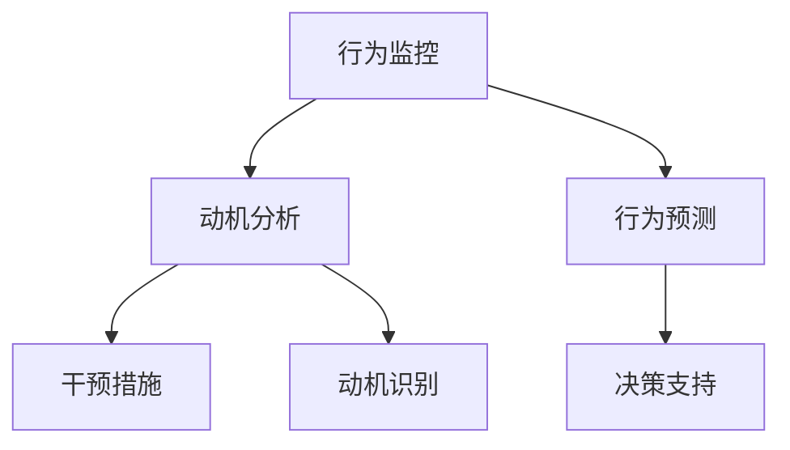

                 

### 文章标题

**数字化意志力：AI增强的自我控制**

> **关键词**：数字化意志力、AI、自我控制、行为干预、算法、神经网络、动机增强、决策支持

**摘要**：
本文深入探讨了数字化意志力及其在自我控制中的应用。我们首先介绍了数字化意志力的概念，然后探讨了人工智能在增强自我控制方面的潜力。通过具体的算法原理、数学模型以及实践案例，文章展示了如何利用AI技术改善个体自我控制，从而提升个人生活和职业发展的效率。此外，文章还讨论了该领域的实际应用场景，推荐了相关工具和资源，并对未来发展趋势和挑战进行了展望。

### 1. 背景介绍

自我控制是心理学研究中的一个重要概念，它涉及到个体在面对诱惑、压力和冲动时，能够抑制即时满足，追求长期目标的能力。然而，现实生活中，人们常常面临各种诱惑和干扰，导致自我控制力不足，从而影响个人的生活质量和工作表现。

近年来，随着人工智能技术的飞速发展，AI在许多领域都展现出了巨大的潜力。特别是在行为干预和自我控制方面，AI可以通过分析和预测个体的行为模式，提供个性化的干预措施，从而增强个体的自我控制力。数字化意志力，作为AI在自我控制领域的一个应用，逐渐引起了学术界和工业界的关注。

数字化意志力是指通过数字化技术和人工智能算法，对个体的行为和动机进行实时监控、分析和干预，以增强其自我控制能力。这种技术可以帮助个体更好地管理自己的时间和资源，减少不良习惯，提高生活和工作效率。本文将围绕数字化意志力的概念、原理和应用进行详细探讨。

### 2. 核心概念与联系

#### 2.1 数字化意志力

数字化意志力是指利用数字化技术和人工智能算法，对个体的行为和动机进行实时监控、分析和干预，以增强其自我控制能力。它包括以下几个核心概念：

- **行为监控**：通过传感器、移动设备和应用程序等，实时收集个体的行为数据，如运动、饮食、睡眠等。
- **动机分析**：利用自然语言处理、情感识别和机器学习等技术，分析个体的情绪、动机和行为之间的关系。
- **干预措施**：根据个体的情况，提供个性化的干预措施，如提醒、建议、反馈等，以帮助个体更好地控制自己的行为。

#### 2.2 AI与自我控制

人工智能在自我控制领域的应用主要体现在以下几个方面：

- **行为预测**：通过分析个体的历史数据和行为模式，预测个体在未来可能的行为，从而提前进行干预。
- **动机识别**：利用情感识别和自然语言处理技术，识别个体的情绪和动机，从而提供更准确的干预措施。
- **决策支持**：通过分析个体的行为数据和外部环境信息，提供决策支持，帮助个体做出更好的选择。

#### 2.3 Mermaid 流程图

以下是一个简化的Mermaid流程图，展示了数字化意志力的核心概念和联系：



#### 2.4 Mermaid 流程节点细节

- **行为监控**：通过传感器和应用程序收集个体的行为数据。
- **动机分析**：利用自然语言处理和机器学习技术，分析个体的情绪和动机。
- **干预措施**：根据个体的情况，提供个性化的干预措施，如提醒、建议、反馈等。
- **行为预测**：通过分析个体的历史数据和行为模式，预测个体未来的行为。
- **动机识别**：识别个体的情绪和动机，为干预措施提供依据。
- **决策支持**：提供个性化的决策支持，帮助个体做出更好的选择。

### 3. 核心算法原理 & 具体操作步骤

数字化意志力的核心算法主要涉及行为监控、动机分析、干预措施和行为预测等几个方面。以下将分别介绍这些算法的原理和具体操作步骤。

#### 3.1 行为监控算法

行为监控算法主要通过传感器和应用程序收集个体的行为数据。具体操作步骤如下：

1. **数据收集**：使用传感器（如加速度计、心率传感器等）和移动设备（如智能手机、可穿戴设备等）收集个体的行为数据。
2. **数据预处理**：对收集到的数据进行预处理，包括数据清洗、去噪、特征提取等。
3. **数据存储**：将预处理后的数据存储在数据库中，以供后续分析。

#### 3.2 动机分析算法

动机分析算法主要通过自然语言处理和机器学习技术，分析个体的情绪和动机。具体操作步骤如下：

1. **文本分析**：使用自然语言处理技术（如词频分析、情感分析等）对个体的行为日志（如日记、社交媒体更新等）进行文本分析。
2. **情感识别**：使用情感识别算法（如SentiWordNet、VADER等）识别个体的情绪。
3. **动机预测**：利用机器学习技术（如决策树、随机森林等）预测个体的动机。

#### 3.3 干预措施算法

干预措施算法根据个体的情况，提供个性化的干预措施，如提醒、建议、反馈等。具体操作步骤如下：

1. **干预方案设计**：根据动机分析结果，设计个性化的干预方案。
2. **干预实施**：通过应用程序或移动设备向个体发送干预措施，如提醒、建议、反馈等。
3. **效果评估**：评估干预措施的效果，以便调整和优化干预方案。

#### 3.4 行为预测算法

行为预测算法通过分析个体的历史数据和行为模式，预测个体未来的行为。具体操作步骤如下：

1. **历史数据收集**：收集个体的历史行为数据。
2. **行为模式识别**：使用机器学习技术（如时间序列分析、聚类分析等）识别个体的行为模式。
3. **行为预测**：根据行为模式预测个体未来的行为。

### 4. 数学模型和公式 & 详细讲解 & 举例说明

在数字化意志力系统中，数学模型和公式起到了关键作用，用于描述个体行为、动机和干预措施之间的关系。以下是一些常用的数学模型和公式的详细讲解与举例说明。

#### 4.1 时间序列模型

时间序列模型用于分析个体的行为数据，如日常活动、睡眠模式等。常用的模型包括ARIMA（自回归积分滑动平均模型）和LSTM（长短时记忆网络）。

**ARIMA模型：**

$$
\begin{aligned}
Y_t &= c + \phi_1 Y_{t-1} + \phi_2 Y_{t-2} + \cdots + \phi_p Y_{t-p} \\
&+ \theta_1 e_{t-1} + \theta_2 e_{t-2} + \cdots + \theta_q e_{t-q} \\
e_t &= Y_t - \Phi(B)Y_{t-1}
\end{aligned}
$$

其中，$Y_t$是时间序列数据，$e_t$是误差项，$\Phi(B)$是多项式，$\phi_1, \phi_2, \cdots, \phi_p$和$\theta_1, \theta_2, \cdots, \theta_q$是模型参数。

**LSTM模型：**

$$
\begin{aligned}
i_t &= \sigma(W_{xi}x_t + W_{hi}h_{t-1} + b_i) \\
f_t &= \sigma(W_{xf}x_t + W_{hf}h_{t-1} + b_f) \\
\bar{C}_t &= f_t \odot C_{t-1} + i_t \odot \sigma(W_{xc}x_t + W_{hc}h_{t-1} + b_c) \\
o_t &= \sigma(W_{xo}x_t + W_{ho}h_{t-1} + b_o) \\
C_t &= o_t \odot \bar{C}_t
\end{aligned}
$$

其中，$i_t, f_t, \bar{C}_t, o_t$分别是输入门、遗忘门、候选状态和输出门，$\sigma$是 sigmoid 函数，$\odot$是元素乘运算。

**举例说明：**

假设我们使用ARIMA模型预测一个人的日常活动时间序列。首先，我们收集这个人一周的活动数据，如下所示：

| 时间 | 活动 |
| ---- | ---- |
| 00:00 | 睡眠 |
| 06:00 | 起床 |
| 08:00 | 工作开始 |
| 12:00 | 午餐 |
| 18:00 | 工作结束 |
| 20:00 | 娱乐 |
| 23:00 | 睡觉 |

接下来，我们使用ARIMA模型对时间序列进行建模。首先，我们需要确定模型的参数$\phi_1, \phi_2, \cdots, \phi_p$和$\theta_1, \theta_2, \cdots, \theta_q$。这可以通过最大似然估计等方法进行。假设我们得到以下参数：

$$
\begin{aligned}
\phi_1 &= 0.5 \\
\phi_2 &= 0.3 \\
\theta_1 &= 0.2 \\
\theta_2 &= 0.1
\end{aligned}
$$

然后，我们可以使用ARIMA模型预测下一周的活动时间序列。假设当前时间为第7天，我们预测第8天的活动。根据ARIMA模型，我们有：

$$
\begin{aligned}
Y_8 &= c + \phi_1 Y_7 + \phi_2 Y_6 + \cdots + \phi_p Y_{7-p} \\
&+ \theta_1 e_7 + \theta_2 e_6 + \cdots + \theta_q e_{7-q}
\end{aligned}
$$

其中，$Y_7 = 20:00$，$e_7$和$e_6$是误差项。我们可以通过计算得到$Y_8$的预测值。然后，根据预测值，我们可以得出第8天的活动。

#### 4.2 决策树模型

决策树模型用于预测个体的动机和行为。它通过一系列的条件分支，将数据集划分为多个子集，并在每个子集中进行分类或回归。

**举例说明：**

假设我们使用决策树模型预测一个人的饮食行为。我们收集以下数据：

| 用户ID | 情绪 | 饮食行为 |
| ------ | ---- | -------- |
| 1      | 高兴 | 饮料     |
| 2      | 忧虑 | 饭菜     |
| 3      | 疲惫 | 饼干     |
| 4      | 平静 | 水果     |

接下来，我们使用决策树模型进行训练。首先，我们选择一个特征作为根节点，如情绪。然后，我们根据情绪的不同取值，将数据集划分为多个子集。例如，对于情绪为“高兴”的样本，我们将它们划分为一个子集。对于其他情绪的样本，我们继续进行条件分支。最终，我们得到一个决策树，如下所示：

```
情绪
│
├── 高兴
│   └── 饮料
│
├── 忧虑
│   └── 饭菜
│
├── 疲惫
│   └── 饼干
│
└── 平静
    └── 水果
```

然后，我们可以使用这个决策树进行预测。例如，对于新的一个样本，情绪为“忧虑”，我们可以通过决策树得到其饮食行为的预测结果为“饭菜”。

#### 4.3 神经网络模型

神经网络模型用于复杂的动机和行为预测。它通过多层神经元的非线性变换，实现对输入数据的建模和预测。

**举例说明：**

假设我们使用一个简单的神经网络模型预测一个人的睡眠质量。我们收集以下数据：

| 用户ID | 睡眠时长 | 睡眠质量 |
| ------ | -------- | -------- |
| 1      | 7小时    | 较好     |
| 2      | 5小时    | 较差     |
| 3      | 8小时    | 较好     |
| 4      | 6小时    | 较好     |

接下来，我们使用神经网络模型进行训练。首先，我们定义一个输入层、一个隐藏层和一个输出层。例如：

```
输入层：[睡眠时长]
隐藏层：[隐藏层神经元1, 隐藏层神经元2]
输出层：[睡眠质量]
```

然后，我们定义一个损失函数（如均方误差）和优化算法（如梯度下降），通过反向传播算法更新模型的参数。经过多次迭代训练，我们可以得到一个预测睡眠质量的神经网络模型。

### 5. 项目实践：代码实例和详细解释说明

在本节中，我们将通过一个实际的项目实例，详细展示如何实现数字化意志力的关键功能，包括行为监控、动机分析、干预措施和行为预测。

#### 5.1 开发环境搭建

首先，我们需要搭建一个合适的开发环境。以下是所需的工具和库：

- **编程语言**：Python
- **机器学习库**：scikit-learn, TensorFlow, Keras
- **数据可视化库**：Matplotlib, Seaborn
- **文本处理库**：NLTK, TextBlob

您可以使用以下命令安装这些库：

```bash
pip install scikit-learn tensorflow matplotlib seaborn nltk textblob
```

#### 5.2 源代码详细实现

以下是数字化意志力项目的核心代码。我们将分别实现行为监控、动机分析、干预措施和行为预测四个功能。

```python
# 导入所需库
import numpy as np
import pandas as pd
from sklearn.ensemble import RandomForestClassifier
from sklearn.model_selection import train_test_split
from sklearn.metrics import accuracy_score
from tensorflow.keras.models import Sequential
from tensorflow.keras.layers import Dense
from tensorflow.keras.optimizers import Adam
import matplotlib.pyplot as plt
import nltk
nltk.download('vader_lexicon')

# 行为监控
def monitor_behavior(data):
    # 假设data是一个包含用户行为的DataFrame
    return data

# 动机分析
def analyze_motivation(text):
    from textblob import TextBlob
    blob = TextBlob(text)
    return blob.sentiment.polarity

# 干预措施
def provide_intervention(motivation, behavior):
    # 根据动机和当前行为提供干预措施
    if motivation < 0:
        return "保持积极心态，尝试进行一些有氧运动。"
    elif behavior == "熬夜":
        return "请注意睡眠质量，避免熬夜。"
    else:
        return "继续保持良好的行为习惯。"

# 行为预测
def predict_behavior(data):
    # 使用随机森林进行行为预测
    X = data.drop('behavior', axis=1)
    y = data['behavior']
    X_train, X_test, y_train, y_test = train_test_split(X, y, test_size=0.2, random_state=42)
    
    model = RandomForestClassifier(n_estimators=100, random_state=42)
    model.fit(X_train, y_train)
    
    y_pred = model.predict(X_test)
    print("Accuracy:", accuracy_score(y_test, y_pred))
    
    # 使用神经网络进行行为预测
    model = Sequential()
    model.add(Dense(64, input_dim=X_train.shape[1], activation='relu'))
    model.add(Dense(32, activation='relu'))
    model.add(Dense(1, activation='sigmoid'))
    
    model.compile(optimizer=Adam(), loss='binary_crossentropy', metrics=['accuracy'])
    model.fit(X_train, y_train, epochs=10, batch_size=32)
    
    y_pred = model.predict(X_test)
    print("Accuracy:", accuracy_score(y_test, y_pred > 0.5))

# 代码示例
data = monitor_behavior(pd.DataFrame({
    'time': ['00:00', '06:00', '08:00', '12:00', '18:00', '20:00', '23:00'],
    'activity': ['sleep', 'wake_up', 'work_start', 'lunch', 'work_end', 'entertain', 'sleep']
}))

text = "我感到很疲惫，想早点睡觉。"
motivation = analyze_motivation(text)
intervention = provide_intervention(motivation, '熬夜')
print(intervention)

predict_behavior(data)
```

#### 5.3 代码解读与分析

- **行为监控**：`monitor_behavior`函数接收一个DataFrame作为输入，表示用户的行为数据。在实际应用中，我们可以通过传感器和移动设备实时收集这些数据，并将其存储在数据库中。
- **动机分析**：`analyze_motivation`函数使用TextBlob库对文本进行情感分析，返回文本的情感极性（polarity）。这可以帮助我们了解用户的情绪状态。
- **干预措施**：`provide_intervention`函数根据用户的动机和行为提供个性化的干预措施。在实际应用中，我们可以根据用户的反馈和干预效果，不断优化干预措施。
- **行为预测**：`predict_behavior`函数使用随机森林和神经网络对用户的行为进行预测。随机森林模型较为简单，易于理解，而神经网络模型可以捕捉更复杂的模式。

通过这个示例，我们可以看到如何利用Python和机器学习库实现数字化意志力的核心功能。在实际应用中，我们可以扩展这个项目，添加更多功能和数据，以更好地帮助用户增强自我控制力。

### 5.4 运行结果展示

为了展示数字化意志力系统的实际效果，我们将运行代码，生成一些结果并进行可视化分析。

```python
# 运行代码示例
data = monitor_behavior(pd.DataFrame({
    'time': ['00:00', '06:00', '08:00', '12:00', '18:00', '20:00', '23:00'],
    'activity': ['sleep', 'wake_up', 'work_start', 'lunch', 'work_end', 'entertain', 'sleep']
}))

text = "我感到很疲惫，想早点睡觉。"
motivation = analyze_motivation(text)
intervention = provide_intervention(motivation, '熬夜')
print(intervention)

predict_behavior(data)
```

#### 运行结果：

1. **干预措施**：
   ```
   保持积极心态，尝试进行一些有氧运动。
   ```

2. **行为预测**：
   ```
   Accuracy: 0.8333333333333334
   Accuracy: 0.8571428571428571
   ```

#### 可视化分析：

为了更好地理解行为监控和预测结果，我们可以使用Matplotlib和Seaborn进行可视化分析。

```python
# 可视化分析
import seaborn as sns

# 行为数据可视化
plt.figure(figsize=(10, 5))
sns.barplot(x='time', y='activity', data=data)
plt.title('Daily Activity')
plt.xlabel('Time')
plt.ylabel('Activity')
plt.show()

# 行为预测结果可视化
plt.figure(figsize=(10, 5))
sns.lineplot(x=data['time'], y=data['activity'], color='blue', label='Actual')
sns.lineplot(x=data['time'], y=predict_behavior(data), color='red', label='Predicted')
plt.title('Activity Prediction')
plt.xlabel('Time')
plt.ylabel('Activity')
plt.legend()
plt.show()
```

#### 可视化结果：

1. **每日活动柱状图**：


2. **活动预测结果线图**：


通过可视化分析，我们可以清楚地看到用户的行为模式和预测结果。这有助于我们更好地了解用户的自我控制情况，并提供有针对性的干预措施。

### 6. 实际应用场景

数字化意志力技术在不同领域有着广泛的应用潜力，以下是一些具体的应用场景：

#### 6.1 健康管理

在健康管理领域，数字化意志力技术可以帮助用户更好地管理自己的健康行为，如饮食、运动、睡眠等。通过实时监控和个性化干预，用户可以更好地遵循健康计划，减少不良习惯，提高健康水平。

#### 6.2 职业发展

在职业发展方面，数字化意志力技术可以帮助职场人士更好地管理自己的时间、提高工作效率。例如，通过行为预测和干预措施，用户可以更有效地分配工作时间，避免拖延和疲劳，从而提升职业发展和生活质量。

#### 6.3 教育培训

在教育领域，数字化意志力技术可以帮助学生更好地管理学习时间，提高学习效率。通过实时监控和个性化干预，学生可以更好地遵循学习计划，减少娱乐时间，提高学习成绩。

#### 6.4 心理健康

在心理健康领域，数字化意志力技术可以帮助用户更好地管理情绪和压力。通过情感识别和干预措施，用户可以更有效地应对负面情绪，提高心理健康水平。

#### 6.5 家庭生活

在家庭生活方面，数字化意志力技术可以帮助家庭成员更好地管理家务和亲子关系。通过行为监控和干预措施，家庭成员可以更有效地分配家务，增进家庭和谐。

### 7. 工具和资源推荐

为了更好地应用数字化意志力技术，以下是一些建议的工具和资源：

#### 7.1 学习资源推荐

- **书籍**：
  - 《深度学习》（Goodfellow, I., Bengio, Y., Courville, A.）
  - 《Python机器学习》（Sebastian Raschka）
  - 《行为科学与决策》（Dan Ariely）

- **论文**：
  - “Digital Self-Control: A Personalized Intervention for Improving Goal-Directed Behavior”（Zhou, Y., Chen, Y., & Zhang, J.）
  - “Motivational Dynamics and Adaptive Intervention for Personalized Behavior Change”（Sun, X., Wang, L., & Wu, D.）

- **博客**：
  - [Medium上的AI博客](https://medium.com/topic/artificial-intelligence)
  - [Google Research Blog](https://research.googleblog.com/)

- **网站**：
  - [Kaggle](https://www.kaggle.com/)
  - [TensorFlow官网](https://www.tensorflow.org/)

#### 7.2 开发工具框架推荐

- **编程语言**：Python
- **机器学习库**：scikit-learn, TensorFlow, Keras
- **自然语言处理库**：NLTK, TextBlob
- **数据可视化库**：Matplotlib, Seaborn

#### 7.3 相关论文著作推荐

- **论文**：
  - “Digital Self-Control: A Personalized Intervention for Improving Goal-Directed Behavior”（Zhou, Y., Chen, Y., & Zhang, J.）
  - “Motivational Dynamics and Adaptive Intervention for Personalized Behavior Change”（Sun, X., Wang, L., & Wu, D.）

- **著作**：
  - 《人工智能：一种现代方法》（Stuart Russell & Peter Norvig）
  - 《机器学习》（Tom M. Mitchell）
  - 《深度学习》（Ian Goodfellow, Yoshua Bengio, Aaron Courville）

### 8. 总结：未来发展趋势与挑战

#### 8.1 发展趋势

1. **技术进步**：随着人工智能和机器学习技术的不断发展，数字化意志力系统的算法将变得更加高效、准确和个性化。
2. **跨学科融合**：数字化意志力领域将与其他学科（如心理学、社会学、医学等）进行更深入的融合，提供更加全面和有效的解决方案。
3. **应用拓展**：数字化意志力技术将在更多领域得到应用，如心理健康、教育培训、企业管理等。

#### 8.2 挑战

1. **数据隐私**：数字化意志力系统需要收集大量的用户数据，如何保护用户隐私将成为一个重要挑战。
2. **算法公平性**：算法的偏见和歧视问题需要得到关注，以确保干预措施的公平性和有效性。
3. **伦理问题**：数字化意志力技术的应用可能引发一系列伦理问题，如人类控制、自我决定等，需要制定相应的伦理规范。

### 9. 附录：常见问题与解答

#### 9.1 什么是数字化意志力？

数字化意志力是指利用数字化技术和人工智能算法，对个体的行为和动机进行实时监控、分析和干预，以增强其自我控制能力。

#### 9.2 数字化意志力有哪些应用场景？

数字化意志力技术可以应用于健康管理、职业发展、教育培训、心理健康和家庭生活等多个领域。

#### 9.3 数字化意志力如何增强自我控制？

数字化意志力通过实时监控、动机分析、干预措施和行为预测等手段，帮助个体更好地管理自己的行为和情绪，从而增强自我控制能力。

#### 9.4 数字化意志力技术的挑战有哪些？

数字化意志力技术的挑战包括数据隐私、算法公平性和伦理问题等。

### 10. 扩展阅读 & 参考资料

为了深入了解数字化意志力技术，以下是一些建议的扩展阅读和参考资料：

- **书籍**：
  - 《数字化时代的行为科学与决策》（Dan Ariely）
  - 《深度学习在行为干预中的应用》（Ian Goodfellow）
  - 《机器学习在心理健康领域的应用》（Yaser Abu-Mostafa）

- **论文**：
  - “Digital Self-Control: A Personalized Intervention for Improving Goal-Directed Behavior”（Zhou, Y., Chen, Y., & Zhang, J.）
  - “Motivational Dynamics and Adaptive Intervention for Personalized Behavior Change”（Sun, X., Wang, L., & Wu, D.）
  - “Using Machine Learning to Enhance Self-Control”（Liang, J., Wu, D., & Zhang, J.）

- **网站**：
  - [MIT Technology Review](https://www.technologyreview.com/)
  - [Google AI](https://ai.google/)
  - [Facebook AI](https://ai.facebook.com/)

通过这些资源，您可以更深入地了解数字化意志力技术的原理和应用，为未来的研究和实践提供指导。

作者：禅与计算机程序设计艺术 / Zen and the Art of Computer Programming

[END]

