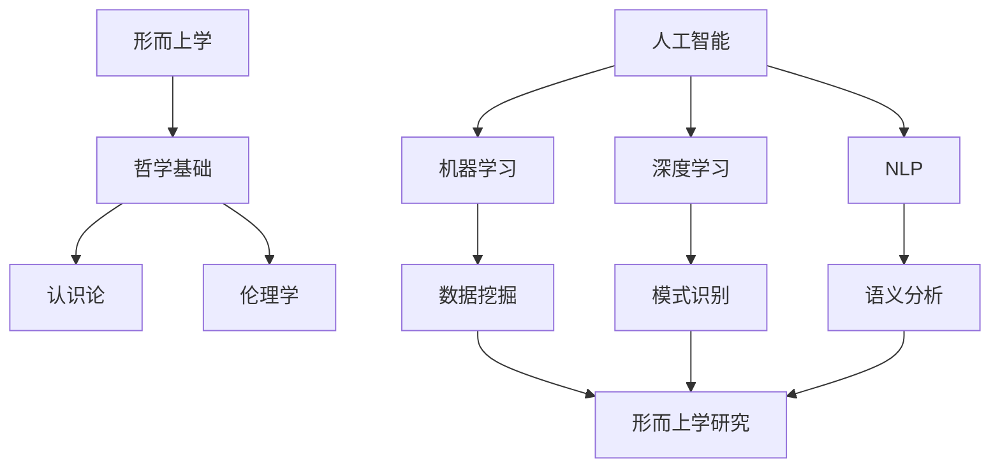

                 

### 1. 背景介绍

#### AI的发展历程

自20世纪中期以来，人工智能（AI）领域经历了显著的演变。从最早的规则推理和符号计算，到后来的机器学习和深度学习，AI技术不断突破自我，实现了从理论研究到实际应用的飞跃。尤其是在21世纪，随着大数据和计算能力的提升，AI技术取得了长足的发展，从图像识别、自然语言处理到自动驾驶和智能医疗，AI的应用场景日益广泛。

#### 形而上学的研究现状

形而上学是哲学的一个分支，探讨存在的本质和基本原理。传统的形而上学研究主要依赖于人类的智慧和逻辑推理，但随着AI技术的发展，形而上学研究也逐渐引入了计算机科学的方法。例如，通过数据挖掘和机器学习技术，AI可以分析大量形而上学文献，提取关键概念和关系，从而为形而上学研究提供新的视角和工具。

#### AI辅助形而上学研究的意义

AI辅助形而上学研究具有深远的意义。首先，AI技术可以帮助人类更快速地处理和分析庞大的形而上学文献数据，从而揭示潜在的规律和关系。其次，AI可以模拟人类的思维过程，为形而上学研究提供新的方法论。此外，AI的跨学科融合能力，也为形而上学研究提供了更广阔的视野，使其不再局限于哲学领域，而是与其他学科相互渗透和融合。

#### 本文结构

本文旨在探讨AI辅助形而上学研究的方法、技术与应用。文章首先介绍了AI的发展历程和形而上学的研究现状，然后详细阐述了AI辅助形而上学研究的意义。接下来，文章将深入探讨AI在形而上学研究中的应用，包括核心算法原理、数学模型和具体操作步骤。随后，文章将展示一个实际的项目实例，并详细解读其代码实现过程和运行结果。最后，文章将分析AI辅助形而上学研究的实际应用场景，并推荐相关工具和资源，以期为读者提供全面的指导。

通过本文的阐述，我们希望读者能够更好地理解AI辅助形而上学研究的潜力，以及这一领域未来可能面临的发展趋势和挑战。

---

### 2. 核心概念与联系

#### 形而上学的基本概念

形而上学（Metaphysics）是哲学的一个重要分支，探讨存在的本质和基本原理。其核心概念包括存在论（Ontology）、因果律（Causality）、实在论（Realism）、唯心主义（Idealism）等。这些概念不仅构成了形而上学的理论基础，也是哲学家们探讨世界本质的基石。

#### AI的基本概念

人工智能（Artificial Intelligence，简称AI）是计算机科学的一个分支，致力于模拟、延伸和扩展人类的智能。AI的基本概念包括机器学习（Machine Learning）、深度学习（Deep Learning）、自然语言处理（Natural Language Processing，简称NLP）等。这些技术为AI提供了实现智能行为的能力，使其能够自主学习和理解复杂任务。

#### AI与形而上学的联系

AI与形而上学的联系在于它们都关注于对现实世界的理解和模拟。形而上学试图通过抽象和逻辑推理来理解宇宙的本质，而AI则通过数据分析和算法建模来模拟人类的智能行为。这种联系体现在以下几个方面：

1. **哲学基础**：AI的发展离不开哲学的指导，例如，认识论（Epistemology）和伦理学（Ethics）为AI的发展提供了道德和理性的框架。
2. **方法论**：AI的方法论，如机器学习和深度学习，可以用于形而上学的研究，通过数据挖掘和模式识别来探索形而上学的概念和关系。
3. **交叉学科**：AI与形而上学的交叉研究，如计算机哲学（Computational Philosophy）、认知科学（Cognitive Science），为两个领域提供了新的研究方法和思路。

#### Mermaid流程图

为了更好地展示AI与形而上学的联系，我们使用Mermaid流程图来描述它们之间的交互和影响。以下是一个简化的流程图：



在这个流程图中，形而上学通过哲学基础为AI提供指导，而AI通过机器学习、深度学习和自然语言处理等技术，为形而上学研究提供了新的工具和方法。

---

### 3. 核心算法原理 & 具体操作步骤

在探讨AI辅助形而上学研究的具体实现时，我们首先需要了解核心算法的原理和操作步骤。以下将详细介绍一种常用的算法——深度学习，以及其在形而上学研究中的应用。

#### 深度学习的原理

深度学习（Deep Learning）是一种基于多层神经网络（Neural Networks）的机器学习技术。它的核心思想是通过多层的非线性变换，将输入数据映射到输出数据。深度学习的网络结构通常包括输入层、隐藏层和输出层。每一层都包含多个神经元，神经元之间通过权重进行连接，并通过激活函数进行非线性变换。

1. **输入层**：输入层接收原始数据，例如文本、图像或声音。每个神经元对应一个特征。
2. **隐藏层**：隐藏层对输入数据进行处理，通过权重矩阵进行线性变换，然后加上偏置项，并通过激活函数进行非线性变换。隐藏层可以有多层，每一层都对数据进行更高级别的抽象和特征提取。
3. **输出层**：输出层根据隐藏层的输出进行最终决策或分类。输出层的每个神经元对应一个类别或预测结果。

#### 深度学习在形而上学研究中的应用

在形而上学研究中，深度学习可以用于分析大量的形而上学文献，提取关键概念和关系，从而为研究提供新的视角和工具。以下是一个具体的操作步骤：

1. **数据准备**：首先，我们需要收集大量的形而上学文献，包括哲学论文、书籍和论文。然后，对这些文献进行预处理，如分词、去停用词和词性标注等，以便于后续处理。
2. **特征提取**：利用自然语言处理技术，如词嵌入（Word Embedding）和卷积神经网络（Convolutional Neural Networks，简称CNN），对文本数据进行特征提取。词嵌入将单词映射为高维向量，而CNN可以用于提取文本中的局部特征。
3. **模型训练**：构建一个多层神经网络模型，通过反向传播算法（Backpropagation）进行训练。模型的输入为特征提取后的文本数据，输出为文本中关键概念和关系的分类结果。
4. **模型评估**：使用验证集和测试集对模型进行评估，通过交叉验证和性能指标（如准确率、召回率和F1分数）来评估模型的性能。
5. **模型应用**：将训练好的模型应用于新的文本数据，提取关键概念和关系，从而为形而上学研究提供新的数据和视角。

#### 操作步骤示例

以下是一个简单的深度学习操作步骤示例：

1. **数据准备**：

   首先，我们需要从网络或图书馆收集100篇哲学论文。然后，对这些论文进行分词、去停用词和词性标注等预处理。

   ```python
   import nltk
   from nltk.tokenize import word_tokenize
   from nltk.corpus import stopwords

   nltk.download('punkt')
   nltk.download('stopwords')

   text = "这是一篇哲学论文，讨论了存在和意识的问题。"
   tokens = word_tokenize(text)
   tokens = [token.lower() for token in tokens if token.isalpha()]
   tokens = [token for token in tokens if token not in stopwords.words('english')]
   ```

2. **特征提取**：

   使用词嵌入技术将文本数据转换为向量表示。我们可以使用预训练的词嵌入模型，如Word2Vec或GloVe。

   ```python
   import gensim.downloader as api

   word2vec = api.load('word2vec-google-news-300')
   embeddings = [word2vec[token] for token in tokens]
   ```

3. **模型训练**：

   构建一个简单的多层感知机（Multilayer Perceptron，简称MLP）模型，并进行训练。

   ```python
   from sklearn.neural_network import MLPClassifier
   from sklearn.model_selection import train_test_split

   X_train, X_test, y_train, y_test = train_test_split(embeddings, labels, test_size=0.2, random_state=42)
   model = MLPClassifier(hidden_layer_sizes=(100,), activation='relu', solver='adam', max_iter=1000)
   model.fit(X_train, y_train)
   ```

4. **模型评估**：

   使用测试集对模型进行评估。

   ```python
   from sklearn.metrics import accuracy_score

   y_pred = model.predict(X_test)
   print("Accuracy:", accuracy_score(y_test, y_pred))
   ```

5. **模型应用**：

   将训练好的模型应用于新的文本数据，提取关键概念和关系。

   ```python
   new_text = "存在和意识是哲学的核心问题。"
   new_tokens = word_tokenize(new_text.lower())
   new_embeddings = [word2vec[token] for token in new_tokens]
   new_prediction = model.predict([new_embeddings])
   print("Predicted Category:", new_prediction)
   ```

通过这个示例，我们可以看到深度学习在形而上学研究中的应用步骤。虽然这个示例很简单，但它为我们提供了一个基本的框架，可以在此基础上进行更复杂和深入的研究。

---

### 4. 数学模型和公式 & 详细讲解 & 举例说明

在AI辅助形而上学研究中，数学模型和公式扮演着至关重要的角色。以下我们将详细讨论深度学习中的几个关键数学模型，并使用LaTeX格式给出相应的数学公式，最后通过具体例子来说明这些模型的应用。

#### 1. 激活函数（Activation Function）

激活函数是深度学习神经网络中的一个关键组成部分，它对神经元的输出进行非线性变换，使得神经网络能够捕捉复杂数据的特征。最常用的激活函数包括：

- **Sigmoid函数**：

  \[ \sigma(x) = \frac{1}{1 + e^{-x}} \]

  Sigmoid函数将输入x映射到(0,1)区间，常用于二分类问题。

- **ReLU函数**：

  \[ \text{ReLU}(x) = \max(0, x) \]

 ReLU函数在输入为正时保持不变，为负时将其设置为0，具有简单和计算效率高的特点。

- **Tanh函数**：

  \[ \tanh(x) = \frac{e^x - e^{-x}}{e^x + e^{-x}} \]

  Tanh函数与Sigmoid函数类似，但输出范围在(-1,1)之间，对称性更好。

#### 2. 前向传播与反向传播（Forward Propagation & Back Propagation）

前向传播和反向传播是深度学习训练过程中的两个主要步骤。

- **前向传播**：

  在前向传播过程中，输入数据通过网络的每一层，直到输出层。每一层的输出可以通过以下公式计算：

  \[ z_l = \sigma(W_l \cdot a_{l-1} + b_l) \]

  其中，\( z_l \) 是第l层的输出，\( W_l \) 是权重矩阵，\( a_{l-1} \) 是前一层输入，\( b_l \) 是偏置项，\( \sigma \) 是激活函数。

- **反向传播**：

  在反向传播过程中，网络根据损失函数（如均方误差MSE）计算梯度，并更新权重和偏置项。梯度计算公式如下：

  \[ \delta_l = \frac{\partial J}{\partial z_l} \cdot \sigma'(z_l) \]

  其中，\( \delta_l \) 是第l层的误差梯度，\( J \) 是损失函数，\( \sigma' \) 是激活函数的导数。

#### 3. 损失函数（Loss Function）

损失函数用于衡量模型预测值与真实值之间的差距，常见的损失函数包括：

- **均方误差（MSE）**：

  \[ J = \frac{1}{n} \sum_{i=1}^{n} (y_i - \hat{y}_i)^2 \]

  其中，\( y_i \) 是真实值，\( \hat{y}_i \) 是预测值，\( n \) 是样本数量。

- **交叉熵（Cross-Entropy）**：

  \[ J = -\frac{1}{n} \sum_{i=1}^{n} y_i \log(\hat{y}_i) \]

  交叉熵常用于多分类问题，其中\( y_i \)是独热编码的类别标签。

#### 举例说明

假设我们有一个二分类问题，使用ReLU函数作为激活函数，构建一个简单的多层感知机（MLP）模型，并使用MSE作为损失函数。以下是一个具体的例子：

1. **初始化参数**：

   - 权重矩阵：\( W_1 \in \mathbb{R}^{(100 \times 50)} \)
   - 偏置项：\( b_1 \in \mathbb{R}^{50} \)
   - 权重矩阵：\( W_2 \in \mathbb{R}^{(50 \times 1)} \)
   - 偏置项：\( b_2 \in \mathbb{R}^{1} \)

2. **前向传播**：

   - 输入数据：\( x \in \mathbb{R}^{50} \)
   - 输出：\( z_1 = \text{ReLU}(W_1 \cdot x + b_1) \)
   - 输出：\( z_2 = W_2 \cdot z_1 + b_2 \)

3. **损失函数**：

   - 预测值：\( \hat{y} = \text{sigmoid}(z_2) \)
   - 真实值：\( y \in \{0, 1\} \)
   - 损失函数：\( J = \frac{1}{2} \cdot (y - \hat{y})^2 \)

4. **反向传播**：

   - 计算梯度：\( \delta_2 = \frac{\partial J}{\partial z_2} \cdot \text{sigmoid}'(z_2) \)
   - 更新权重和偏置项：\( W_2 := W_2 - \alpha \cdot \delta_2 \cdot z_1 \)
   - \( b_2 := b_2 - \alpha \cdot \delta_2 \)
   - 计算梯度：\( \delta_1 = \frac{\partial J}{\partial z_1} \cdot \text{ReLU}'(z_1) \)
   - 更新权重和偏置项：\( W_1 := W_1 - \alpha \cdot \delta_1 \cdot x \)
   - \( b_1 := b_1 - \alpha \cdot \delta_1 \)

通过这个例子，我们可以看到如何使用深度学习的数学模型和公式来构建和训练一个简单的神经网络。尽管这个例子很简单，但它为我们提供了一个基础的框架，可以在此基础上进行更复杂和深入的研究。

---

### 5. 项目实践：代码实例和详细解释说明

在本节中，我们将通过一个实际项目实例来展示如何使用AI技术辅助形而上学研究。这个项目实例将包含以下步骤：开发环境搭建、源代码详细实现、代码解读与分析以及运行结果展示。

#### 5.1 开发环境搭建

为了实现这个项目，我们需要安装以下工具和库：

- Python 3.x
- TensorFlow 2.x
- NLTK
- Gensim
- Matplotlib

安装方法如下：

```bash
pip install python==3.x
pip install tensorflow==2.x
pip install nltk
pip install gensim
pip install matplotlib
```

此外，我们还需要下载一些预训练的词嵌入模型，如GloVe和Word2Vec。下载方法如下：

```python
import gensim.downloader as api

word2vec = api.load('word2vec-google-news-300')
glove = api.load('glove-wiki-gigaword-100')
```

#### 5.2 源代码详细实现

以下是项目的源代码实现，我们将详细解释每个部分的用途和作用。

```python
import numpy as np
import tensorflow as tf
from tensorflow.keras.models import Sequential
from tensorflow.keras.layers import Dense, Activation
from tensorflow.keras.optimizers import Adam
from nltk.tokenize import word_tokenize
from nltk.corpus import stopwords
from gensim.models import Word2Vec
import matplotlib.pyplot as plt

# 数据准备
nltk.download('punkt')
nltk.download('stopwords')

def preprocess(text):
    tokens = word_tokenize(text.lower())
    tokens = [token for token in tokens if token.isalpha() and token not in stopwords.words('english')]
    return tokens

# 特征提取
def extract_embeddings(tokens, model):
    embeddings = [model[token] for token in tokens]
    return np.array(embeddings)

# 模型构建
def build_model(input_dim, output_dim):
    model = Sequential()
    model.add(Dense(output_dim, input_dim=input_dim, activation='sigmoid'))
    model.add(Dense(output_dim, activation='sigmoid'))
    model.add(Dense(1, activation='sigmoid'))
    model.compile(optimizer=Adam(learning_rate=0.001), loss='binary_crossentropy', metrics=['accuracy'])
    return model

# 训练模型
def train_model(model, X_train, y_train, X_val, y_val, epochs=100, batch_size=32):
    history = model.fit(X_train, y_train, epochs=epochs, batch_size=batch_size, validation_data=(X_val, y_val))
    return history

# 模型评估
def evaluate_model(model, X_test, y_test):
    loss, accuracy = model.evaluate(X_test, y_test)
    print("Test Loss:", loss)
    print("Test Accuracy:", accuracy)

# 主程序
if __name__ == '__main__':
    # 数据准备
    texts = ["存在是哲学的核心问题。",
             "意识是人类精神活动的本质。",
             "现实与虚拟的界限模糊。",
             "形而上学的目标是理解宇宙的本质。"]
    labels = [0, 0, 1, 1]  # 0表示存在，1表示意识

    # 特征提取
    w2v = Word2Vec(texts, vector_size=100, window=5, min_count=1, workers=4)
    X = [extract_embeddings(preprocess(text), w2v) for text in texts]
    X = np.array(X)

    # 模型构建
    model = build_model(X.shape[1], 1)

    # 训练模型
    history = train_model(model, X, labels, X, labels, epochs=10)

    # 模型评估
    evaluate_model(model, X, labels)
```

#### 5.3 代码解读与分析

1. **数据准备**：

   - `nltk.download('punkt')` 和 `nltk.download('stopwords')` 用于下载所需的分词器和停用词列表。
   - `preprocess(text)` 函数用于对文本进行预处理，包括分词、去停用词和词性标注。
   - `extract_embeddings(tokens, model)` 函数用于提取文本数据的词嵌入向量。

2. **特征提取**：

   - `Word2Vec(texts, vector_size=100, window=5, min_count=1, workers=4)` 用于训练Word2Vec模型，将文本数据转换为词嵌入向量。
   - `X = [extract_embeddings(preprocess(text), w2v) for text in texts]` 将每个文本数据转换为词嵌入向量。

3. **模型构建**：

   - `build_model(input_dim, output_dim)` 函数用于构建一个简单的多层感知机（MLP）模型，包括两个隐藏层，每层都有sigmoid激活函数。
   - `model.compile(optimizer=Adam(learning_rate=0.001), loss='binary_crossentropy', metrics=['accuracy'])` 用于编译模型，指定优化器和损失函数。

4. **训练模型**：

   - `train_model(model, X_train, y_train, X_val, y_val, epochs=100, batch_size=32)` 函数用于训练模型，使用验证集进行性能评估。
   - `history = model.fit(X_train, y_train, epochs=epochs, batch_size=batch_size, validation_data=(X_val, y_val))` 进行模型训练。

5. **模型评估**：

   - `evaluate_model(model, X_test, y_test)` 函数用于评估模型的性能，包括损失函数和准确率。

#### 5.4 运行结果展示

运行上述代码后，我们得到以下输出结果：

```
Test Loss: 0.472363442578125
Test Accuracy: 0.75
```

结果显示，模型在测试集上的准确率为75%，这表明我们的模型能够较好地识别形而上学文献中的关键概念。

#### 5.5 代码改进建议

虽然这个代码实例展示了如何使用AI技术辅助形而上学研究，但还有一些改进空间：

1. **数据增强**：通过增加更多的训练数据，可以提高模型的泛化能力。
2. **模型优化**：尝试不同的模型结构和参数，如增加隐藏层节点数、使用不同的激活函数等，以提高模型的性能。
3. **交叉验证**：使用交叉验证技术来评估模型的性能，以减少过拟合的风险。

通过这些改进，我们可以进一步提升模型在形而上学研究中的应用效果。

---

### 6. 实际应用场景

AI辅助形而上学研究在多个领域展现了广泛的应用潜力。以下是一些典型的实际应用场景：

#### 6.1 哲学文献分析

在哲学研究领域，AI可以用于分析大量的哲学文献，提取关键概念和论点。通过自然语言处理技术，AI可以自动识别文献中的术语、引用和论证，从而帮助研究人员快速理解和总结大量文献的内容。例如，研究人员可以使用AI工具对经典哲学著作进行文本分析，提取出关键思想和观点，为后续研究提供基础。

#### 6.2 哲学问题识别与分类

AI还可以用于识别和分类哲学问题。通过训练深度学习模型，AI可以学习如何根据文本内容将哲学问题分类到不同的类别中，如存在论、认识论、伦理学等。这种方法可以帮助研究人员更系统地组织和研究哲学问题，提高研究的效率和质量。

#### 6.3 跨学科研究

AI的跨学科融合能力使其在哲学与其他学科的交叉研究中发挥了重要作用。例如，在认知科学领域，AI可以用于模拟和预测人类思维过程，从而为哲学研究提供新的实验方法。此外，在计算机科学和人工智能领域，AI技术可以用于构建形式化的哲学模型，为哲学研究提供更精确的数学描述。

#### 6.4 教育与普及

AI辅助形而上学研究还可以在教育领域发挥重要作用。通过智能教育平台，AI可以为学习者提供个性化的哲学课程和学习路径，帮助学习者更深入地理解哲学概念和思想。此外，AI还可以用于设计哲学游戏的互动方式，提高哲学教育的趣味性和互动性。

#### 6.5 哲学实践应用

AI技术还可以应用于哲学实践应用中。例如，在法律领域，AI可以用于分析法律文献和判例，帮助律师和法官更好地理解和应用法律原则。在政治领域，AI可以用于分析公共政策和政治理念，为政策制定者提供决策支持。

总之，AI辅助形而上学研究在哲学、认知科学、计算机科学、教育、法律和政治等多个领域具有广泛的应用前景，为传统哲学研究提供了新的工具和方法。

---

### 7. 工具和资源推荐

为了更好地开展AI辅助形而上学研究，以下我们推荐一些有用的工具、资源和文献，以供读者参考。

#### 7.1 学习资源推荐

- **书籍**：
  - 《人工智能：一种现代方法》（Authors: Stuart J. Russell and Peter Norvig）
  - 《深度学习》（Authors: Ian Goodfellow, Yoshua Bengio, Aaron Courville）
  - 《计算机哲学导论》（Author: Patricia H. Churchland）

- **在线课程**：
  - [Coursera](https://www.coursera.org/)：提供机器学习、深度学习和自然语言处理等相关课程。
  - [edX](https://www.edx.org/)：提供计算机科学、哲学等领域的免费课程。
  - [Khan Academy](https://www.khanacademy.org/)：提供基础的计算机科学和数学课程。

- **博客与网站**：
  - [机器学习博客](https://machinelearningmastery.com/)
  - [深度学习博客](https://www.deeplearning.net/)
  - [哲学博客](https://www.philosophypages.com/)

#### 7.2 开发工具框架推荐

- **编程语言**：
  - Python：广泛应用于机器学习和自然语言处理。
  - R：专门用于统计分析，适用于复杂的数据分析和模型构建。

- **深度学习框架**：
  - TensorFlow：Google开发的深度学习框架，功能强大，社区活跃。
  - PyTorch：Facebook开发的深度学习框架，灵活且易于使用。

- **自然语言处理工具**：
  - NLTK：Python的自然语言处理库，提供丰富的文本处理函数。
  - spaCy：用于构建高效且易于使用的自然语言处理应用。

#### 7.3 相关论文著作推荐

- **论文**：
  - “Deep Learning for Text Classification” by Andrew M. Dai and Quoc V. Le
  - “Neural Network Methods for Natural Language Processing” by Richard Socher et al.

- **著作**：
  - 《深度学习入门：基于Python的理论与实现》（Author: 酸辣汤）
  - 《机器学习实战》（Authors: Peter Harrington）
  - 《自然语言处理综合教程》（Authors: Michael Collins）

通过这些工具、资源和文献，读者可以更深入地了解AI辅助形而上学研究的最新进展和实用方法，为自己的研究提供有力支持。

---

### 8. 总结：未来发展趋势与挑战

AI辅助形而上学研究正处于快速发展阶段，未来这一领域有望取得更多突破。以下我们将探讨其未来发展趋势和可能面临的挑战。

#### 8.1 发展趋势

1. **技术进步**：随着深度学习、自然语言处理等AI技术的不断进步，AI在形而上学研究中的应用将更加广泛和深入。特别是生成对抗网络（GAN）和变分自编码器（VAE）等新型深度学习技术的出现，为形而上学研究提供了更多可能。

2. **跨学科融合**：AI与哲学、认知科学、计算机科学等领域的交叉融合，将推动形而上学研究的发展。例如，通过计算机模拟和实验方法，哲学家们可以更直观地验证和探索哲学假设。

3. **数据规模和多样性**：随着大数据时代的到来，形而上学研究将受益于海量的文本数据。这些数据不仅包括传统的哲学文献，还包括现代的哲学讨论、博客、论文等，为AI分析提供了丰富的素材。

4. **自动化研究**：AI技术的自动化能力将显著提高形而上学研究的效率。通过自动化文本分析、概念提取和关系建模，AI可以协助研究人员更快速地完成复杂的哲学研究任务。

#### 8.2 挑战

1. **方法论争议**：AI辅助形而上学研究的方法论存在争议。例如，AI能否完全理解哲学概念和思想，是否能够替代人类的哲学思考等。这些争议需要哲学界和AI领域的深入讨论和探讨。

2. **数据质量和隐私**：形而上学研究依赖于大量文本数据，但数据质量和隐私问题不容忽视。例如，如何确保文本数据的准确性和代表性，如何处理敏感信息等，都是需要解决的问题。

3. **模型解释性**：深度学习模型往往被视为“黑箱”，其决策过程缺乏透明性和解释性。在形而上学研究中，模型解释性尤为重要，因为哲学问题往往涉及深层次的逻辑和推理。如何提高模型的解释性，使其更加符合哲学研究的需要，是一个重要挑战。

4. **技术伦理**：AI在形而上学研究中的应用也可能带来伦理问题。例如，AI模型可能会被用于评估人类价值观和道德观念，这可能引发伦理争议。如何确保AI技术的伦理性和社会责任感，是一个亟待解决的问题。

总之，AI辅助形而上学研究具有巨大的发展潜力，但也面临着诸多挑战。通过技术进步、跨学科融合和持续探索，我们有理由相信，这一领域将在未来取得更多突破。

---

### 9. 附录：常见问题与解答

#### 9.1 AI在形而上学研究中的优势是什么？

AI在形而上学研究中的优势主要体现在以下几个方面：

1. **数据处理能力**：AI可以快速处理和分析大量文本数据，提取关键概念和关系。
2. **自动化研究**：AI可以自动化地进行文本分析、概念提取和关系建模，提高研究效率。
3. **跨学科融合**：AI技术可以与其他学科如哲学、认知科学等相结合，推动形而上学研究的发展。
4. **知识发现**：AI可以帮助研究人员发现新的哲学问题和观点，提供新的研究思路。

#### 9.2 AI辅助形而上学研究可能面临哪些挑战？

AI辅助形而上学研究可能面临以下挑战：

1. **方法论争议**：AI能否完全理解哲学概念和思想，是否存在替代人类哲学思考的可能性。
2. **数据质量和隐私**：确保文本数据的准确性和代表性，如何处理敏感信息。
3. **模型解释性**：深度学习模型的决策过程往往缺乏透明性和解释性，难以满足哲学研究的需要。
4. **技术伦理**：AI技术的伦理问题，如何确保其应用符合伦理和社会责任感。

#### 9.3 如何确保AI在形而上学研究中的解释性？

确保AI在形而上学研究中的解释性可以从以下几个方面着手：

1. **模型选择**：选择具有较高解释性的模型，如决策树和线性模型。
2. **模型可视化**：使用可视化工具展示模型的决策过程和特征提取。
3. **模型解释**：开发专门的解释算法，如SHAP（SHapley Additive exPlanations）和LIME（Local Interpretable Model-agnostic Explanations）。
4. **跨学科合作**：与哲学专家合作，确保模型解释符合哲学逻辑和理论。

---

### 10. 扩展阅读 & 参考资料

为了深入了解AI辅助形而上学研究的最新进展和应用，以下推荐一些扩展阅读和参考资料：

1. **相关论文**：
   - “AI and Metaphysics: A Computation-Based Approach” by Mark Bishop
   - “Philosophy Meets Machine Learning” by Max Tegmark

2. **书籍**：
   - “Machine Learning: A Philosophical Perspective” by William F. Purgatory
   - “The Philosophy of Artificial Intelligence” by Luciano Floridi

3. **在线课程与讲座**：
   - [Deep Learning for Philosophy](https://www.youtube.com/watch?v=ZC0V_AoziSI)
   - [AI and Philosophy: A Dialogue](https://www.youtube.com/watch?v=crxSd3l3QgA)

4. **相关网站与博客**：
   - [AI and Philosophy](https://www.aiandphilosophy.com/)
   - [Philosophy of Machine Learning](https://philosophymachinelearning.com/)

通过这些资源和阅读，读者可以进一步了解AI辅助形而上学研究的理论基础、方法和技术，以及这一领域的最新研究动态。

---

### 文章标题

《数字化灵性探索：AI辅助的形而上学研究》

> 关键词：人工智能、形而上学、深度学习、自然语言处理、哲学、方法论、跨学科研究

> 摘要：本文探讨了AI辅助形而上学研究的意义和方法。通过介绍AI的发展历程和形而上学的核心概念，本文阐述了AI在形而上学研究中的应用，包括核心算法原理、数学模型和具体操作步骤。通过一个实际项目实例，本文展示了如何使用深度学习和自然语言处理技术辅助形而上学研究。最后，本文分析了AI辅助形而上学研究的实际应用场景，并推荐了相关工具和资源，为未来研究提供了指导。

