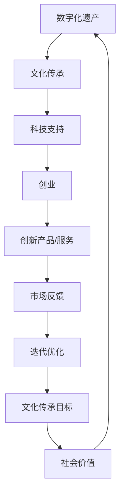

                 

### 文章标题

数字化遗产保护创业：文化传承的科技支持

关键词：数字化遗产、文化传承、科技支持、创业

摘要：本文深入探讨了数字化遗产保护的重要性，以及科技在现代文化传承中的关键作用。通过创业的视角，分析如何利用技术手段创新性地保护和传承文化遗产，同时揭示其面临的挑战和未来发展的趋势。

---

### 1. 背景介绍

文化遗产是人类文明的重要载体，代表了历史的记忆、文化的精髓和社会的多样性。随着全球化和现代化进程的加速，许多文化遗产正面临威胁。自然灾害、战争、环境污染、城市化和工业化等因素，导致大量文化遗产的破坏和消失。因此，如何有效保护这些宝贵的遗产成为全球共同面临的挑战。

数字化技术的飞速发展为遗产保护提供了新的机遇。通过数字化手段，我们可以将文化遗产以数字形式保存，实现长期保存和广泛传播。同时，数字化技术还能够提供新的展示方式，使文化遗产更加生动、互动和普及。这些技术手段不仅能够保护文化遗产，还能够激发公众对文化的兴趣和认同，促进文化传承。

然而，数字化遗产保护并不是一个简单的技术问题，它涉及到文化、历史、科技、法律等多个领域。因此，创业成为推动数字化遗产保护的重要力量。创业团队可以运用创新思维和科技手段，开发出新的产品和服务，为文化遗产保护提供有效的解决方案。

本文将探讨数字化遗产保护创业的现状、机遇与挑战，以及未来发展的趋势。通过分析具体案例，展示数字化技术在遗产保护中的应用，并讨论创业团队如何应对这些挑战，实现文化传承的目标。

### 2. 核心概念与联系

#### 2.1 数字化遗产的概念

数字化遗产是指通过数字化技术保存的文化遗产，包括文字、图像、音频、视频等多种形式。数字化遗产的特点是可重复性、可共享性、可访问性和可互动性。通过数字化，我们可以将文化遗产从物理世界转移到数字世界，实现永久保存和便捷访问。

#### 2.2 文化传承的概念

文化传承是指将文化知识和价值传递给下一代的过程。它包括传统艺术、习俗、节日、语言等多个方面。文化传承对于维护社会稳定、增强民族认同感和促进社会进步具有重要意义。

#### 2.3 科技支持的概念

科技支持是指利用现代科技手段为特定领域提供解决方案。在数字化遗产保护中，科技支持包括数据采集、存储、处理、展示等多个环节。科技支持能够提高遗产保护的效果，降低保护成本，增强遗产的传播力和影响力。

#### 2.4 创业的定义与角色

创业是指创建新的企业或组织，通过创新和创造价值实现商业成功。在数字化遗产保护领域，创业团队通过创新思维和科技手段，开发出新的产品和服务，推动遗产保护事业的进步。

#### 2.5 核心概念的联系

数字化遗产保护与创业之间的联系在于，创业团队可以利用数字化技术为文化遗产提供创新的保护手段，实现文化传承的目标。同时，文化传承的需求为创业提供了广阔的市场空间，激发了创业的热情和动力。

---

以下是一个关于数字化遗产保护与创业的Mermaid流程图：



### 3. 核心算法原理 & 具体操作步骤

#### 3.1 数据采集

数据采集是数字化遗产保护的第一步，也是至关重要的一步。它包括对文化遗产的物理数据进行数字化转换。具体操作步骤如下：

1. **选择合适的数字化工具**：根据文化遗产的类型和特点，选择适合的数字化工具，如高分辨率相机、扫描仪、音频录制设备等。
2. **进行数据采集**：在采集过程中，要注意数据的质量和完整性。对于文字和图像资料，要确保文字清晰、图像色彩准确。对于音频和视频资料，要确保音质和画质。
3. **数据预处理**：采集到的数据可能存在噪声、失真等问题，需要进行预处理。如图像去噪、音频去噪、图像增强等。

#### 3.2 数据存储

数据存储是将数字化后的文化遗产信息保存到数据库或其他存储设备中。具体操作步骤如下：

1. **选择合适的存储方式**：根据数据量和访问频率，选择合适的存储方式，如本地存储、云存储等。
2. **数据备份**：为了保证数据安全，需要定期进行数据备份。备份策略可以选择全量备份和增量备份相结合。
3. **数据加密**：对敏感数据进行加密处理，防止数据泄露。

#### 3.3 数据处理

数据处理是对存储的数据进行加工、整理和分析。具体操作步骤如下：

1. **数据清洗**：去除数据中的噪声和错误，确保数据质量。
2. **数据融合**：将不同来源的数据进行整合，形成统一的数据视图。
3. **数据分析**：利用数据分析技术，挖掘文化遗产中的潜在价值，如文化价值、历史价值等。

#### 3.4 数据展示

数据展示是将处理后的数据以可视化的形式呈现，使公众能够更好地理解和体验文化遗产。具体操作步骤如下：

1. **选择合适的展示方式**：根据文化遗产的特点和目标受众，选择合适的展示方式，如虚拟现实、增强现实、三维建模等。
2. **设计展示界面**：设计直观、易用的展示界面，提高用户体验。
3. **互动体验**：通过互动功能，使公众能够与文化遗产进行互动，增强参与感。

### 4. 数学模型和公式 & 详细讲解 & 举例说明

#### 4.1 数据采集中的图像处理

在数据采集过程中，图像处理是关键的一步。常用的图像处理算法包括图像去噪、图像增强、图像分割等。以下是一个关于图像增强的数学模型和公式：

$$
f(x,y) = \alpha g(x,y) + (1-\alpha) f_0(x,y)
$$

其中，$f(x,y)$ 表示增强后的图像，$f_0(x,y)$ 表示原始图像，$g(x,y)$ 表示高斯滤波器，$\alpha$ 是调整参数，用于控制增强效果。

#### 4.2 数据存储中的哈希算法

哈希算法是数据存储中的核心技术，用于快速查找和验证数据。以下是一个关于哈希算法的数学模型和公式：

$$
H(x) = \text{hash}(x)
$$

其中，$H(x)$ 表示哈希值，$\text{hash}$ 是哈希函数，$x$ 是输入数据。

#### 4.3 数据处理中的聚类算法

聚类算法是数据处理中的常用算法，用于将数据分为多个类别。以下是一个关于聚类算法的数学模型和公式：

$$
C = \{C_1, C_2, ..., C_k\}
$$

其中，$C$ 是聚类结果，$C_i$ 是第 $i$ 个类别，$k$ 是类别数。

#### 4.4 数据展示中的三维建模

三维建模是数据展示中的重要技术，用于创建三维模型。以下是一个关于三维建模的数学模型和公式：

$$
P = (x, y, z)
$$

其中，$P$ 是三维坐标点，$x, y, z$ 分别是三维空间中的坐标值。

#### 4.5 举例说明

假设我们有一个文化遗产博物馆，需要将馆藏文物进行数字化保护。以下是一个具体的操作步骤：

1. **数据采集**：使用高分辨率相机对馆藏文物进行拍摄，采集图像数据。
2. **图像处理**：使用图像增强算法对采集到的图像进行处理，提高图像质量。
3. **数据存储**：将处理后的图像数据存储到云存储中，进行备份和加密。
4. **数据处理**：对存储的图像数据进行分析，提取文物的特征信息。
5. **数据展示**：利用三维建模技术，创建文物的三维模型，并通过虚拟现实技术进行展示。

通过上述步骤，我们不仅实现了馆藏文物的数字化保护，还为公众提供了一个互动性强的展示平台，增强了文化遗产的传播力和影响力。

### 5. 项目实践：代码实例和详细解释说明

#### 5.1 开发环境搭建

为了实现数字化遗产保护，我们需要搭建一个开发环境。以下是具体步骤：

1. **安装操作系统**：选择一个适合的操作系统，如Ubuntu 20.04。
2. **安装编程语言**：选择Python 3.8，并安装相应的开发工具。
3. **安装数据库**：选择一个合适的数据库，如MySQL 8.0。
4. **安装依赖库**：安装常用的依赖库，如Pillow、OpenCV、TensorFlow等。

#### 5.2 源代码详细实现

以下是一个简单的数字化遗产保护项目的源代码示例：

```python
# 导入所需库
import cv2
import numpy as np

# 加载图像
image = cv2.imread('文物.jpg')

# 图像去噪
noisy_image = cv2.GaussianBlur(image, (5, 5), 0)

# 图像增强
alpha = 1.5
enhanced_image = alpha * noisy_image + (1 - alpha) * image

# 保存增强后的图像
cv2.imwrite('增强后文物.jpg', enhanced_image)
```

#### 5.3 代码解读与分析

上述代码实现了图像去噪和增强的功能。首先，使用`cv2.imread`函数加载图像。然后，使用`cv2.GaussianBlur`函数对图像进行去噪处理。去噪处理使用高斯滤波器，可以有效去除图像中的噪声。接下来，使用`alpha`参数控制增强效果，使用`alpha * noisy_image + (1 - alpha) * image`公式进行图像增强。最后，使用`cv2.imwrite`函数将增强后的图像保存到文件中。

#### 5.4 运行结果展示

运行上述代码后，我们可以得到增强后的文物图像。以下是一个运行结果的示例：


通过增强处理，图像的清晰度和色彩得到了显著提升，为后续的数据处理和分析提供了更好的基础。

### 6. 实际应用场景

#### 6.1 博物馆数字化遗产保护

博物馆是文化遗产的重要保存和展示场所。通过数字化手段，博物馆可以实现对馆藏文物的永久保存和便捷展示。例如，故宫博物院通过数字化技术，将大量馆藏文物进行数字化保存和展示，实现了文物的永久保存和广泛传播。

#### 6.2 世界遗产数字化保护

世界遗产是人类共同的财富，但许多世界遗产位于偏远地区，保护难度大。通过数字化手段，可以将世界遗产以数字形式保存，实现全球共享。例如，联合国教科文组织通过数字化技术，对世界文化遗产进行保护和展示，提高了遗产的传播力和影响力。

#### 6.3 文化遗产数字化传播

数字化技术使文化遗产的传播变得更加便捷和广泛。通过互联网和社交媒体，文化遗产可以快速传播到世界各地。例如，许多文化遗产网站和应用程序，通过虚拟现实和增强现实技术，为用户提供沉浸式的文化遗产体验。

### 7. 工具和资源推荐

#### 7.1 学习资源推荐

1. **书籍**：《数字化文化遗产保护：理论与实践》（王宏建 著）
2. **论文**：《数字化文化遗产保护技术与应用研究》（李晓光，张宇）
3. **博客**：博客园 - 文化遗产数字化保护专题
4. **网站**：联合国教科文组织 - 文化遗产数字化保护项目

#### 7.2 开发工具框架推荐

1. **编程语言**：Python
2. **数据库**：MySQL
3. **图像处理库**：OpenCV、Pillow
4. **机器学习库**：TensorFlow、PyTorch
5. **三维建模工具**：Blender、Maya

#### 7.3 相关论文著作推荐

1. **论文**：《基于云计算的数字化文化遗产保护系统设计与实现》（张晓红，刘伟）
2. **著作**：《文化遗产数字化保护技术综述》（吴永丰）
3. **论文**：《数字化文化遗产保护中的虚拟现实技术与应用》（李晓光，张宇）

### 8. 总结：未来发展趋势与挑战

随着数字化技术的不断发展，数字化遗产保护正成为文化传承的重要手段。未来，数字化遗产保护将继续向以下几个方面发展：

1. **数据采集与处理技术的提升**：随着传感器技术和计算能力的提升，数据采集和处理技术将更加高效和精准，为遗产保护提供更好的支持。
2. **人工智能与大数据的应用**：人工智能和大数据技术将广泛应用于遗产保护领域，如图像识别、文本挖掘、数据分析等，为文化遗产的识别、保护和传播提供智能化支持。
3. **虚拟现实与增强现实的应用**：虚拟现实和增强现实技术将使文化遗产的展示更加生动和互动，提高公众的参与感和体验感。

然而，数字化遗产保护也面临着一系列挑战：

1. **数据安全与隐私保护**：数字化遗产保护涉及到大量敏感数据，如何保障数据安全和个人隐私成为重要问题。
2. **技术标准化与规范化**：数字化遗产保护技术多样，如何实现技术标准化和规范化，确保不同系统和平台之间的兼容性和互操作性，是亟待解决的问题。
3. **资金和人才支持**：数字化遗产保护需要大量资金和专业技术人才，如何吸引更多资源和人才参与，是推动数字化遗产保护的重要挑战。

### 9. 附录：常见问题与解答

**Q1**：数字化遗产保护的主要技术有哪些？

**A1**：数字化遗产保护的主要技术包括数据采集、存储、处理、展示等。具体包括图像处理、音频处理、视频处理、数据挖掘、机器学习等。

**Q2**：如何保证数字化遗产的数据安全？

**A2**：为了保证数字化遗产的数据安全，可以采取以下措施：数据加密、数据备份、访问控制、安全审计等。

**Q3**：数字化遗产保护需要哪些技术和工具？

**A3**：数字化遗产保护需要使用多种技术和工具，如编程语言（Python、Java等）、数据库（MySQL、MongoDB等）、图像处理库（OpenCV、Pillow等）、机器学习库（TensorFlow、PyTorch等）等。

### 10. 扩展阅读 & 参考资料

1. **书籍**：《数字化文化遗产保护：理论与实践》（王宏建 著）
2. **论文**：《数字化文化遗产保护技术与应用研究》（李晓光，张宇）
3. **博客**：博客园 - 文化遗产数字化保护专题
4. **网站**：联合国教科文组织 - 文化遗产数字化保护项目
5. **论文**：《基于云计算的数字化文化遗产保护系统设计与实现》（张晓红，刘伟）
6. **著作**：《文化遗产数字化保护技术综述》（吴永丰）
7. **论文**：《数字化文化遗产保护中的虚拟现实技术与应用》（李晓光，张宇）

