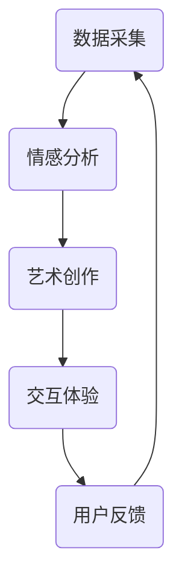

                 

### 背景介绍

数字化遗产艺术创业，这一概念逐渐走进我们的视野。它不仅是一种新兴的艺术创作方式，更是一种对逝者记忆的传承与创新。在这个快速发展的数字时代，人们对于记忆的保存和呈现方式有了全新的需求。数字化遗产艺术创业，便是在这样的背景下应运而生。

#### 数字化遗产艺术创业的兴起

数字化遗产艺术创业的兴起，得益于以下几个因素的共同作用：

1. **技术进步**：随着计算机技术的飞速发展，数据存储、处理和分析的能力大幅提升。这为数字化遗产的保存和呈现提供了强大的技术支持。
   
2. **文化需求**：现代社会中，人们对文化传承和记忆保存的需求日益增长。数字化遗产艺术创业为满足这一需求提供了新的解决方案。

3. **经济利益**：数字化遗产艺术创业具有巨大的市场潜力。不仅能够为艺术家和创业者带来经济收益，还能推动相关产业的发展。

4. **用户体验**：数字化遗产艺术创业为用户提供了全新的体验方式。通过虚拟现实、增强现实等技术，用户可以更加直观地感受和互动。

#### 逝者记忆的艺术呈现

数字化遗产艺术创业的核心在于如何将逝者的记忆通过艺术的形式呈现出来。这不仅是技术层面的挑战，更是情感和人文层面的考验。

1. **数据采集与整理**：首先需要收集逝者的相关信息和数据，如照片、视频、文字记录等。这些数据将成为艺术创作的基础。

2. **情感分析**：通过情感分析技术，对收集到的数据进行情感层面的分析，以了解逝者的性格特点、兴趣爱好等。

3. **艺术创作**：根据分析结果，艺术家可以创作出反映逝者特点的艺术作品。这些作品可以是绘画、音乐、文学作品等。

4. **交互体验**：通过虚拟现实、增强现实等技术，用户可以与艺术作品进行互动，更加深入地感受逝者的记忆。

### 当前发展现状

数字化遗产艺术创业目前处于快速发展阶段，但同时也面临一些挑战：

1. **技术成熟度**：虽然相关技术在不断发展，但仍然存在一些技术瓶颈，如数据隐私保护、虚拟现实技术的用户体验等。

2. **市场接受度**：尽管数字化遗产艺术创业具有很大的市场潜力，但消费者对于这一新兴领域的接受度还有待提高。

3. **法律规范**：数字化遗产艺术创业涉及到法律和伦理问题，如数据所有权、隐私保护等。这需要相关法律法规的完善。

### 未来发展趋势

随着技术的不断进步和市场需求的增长，数字化遗产艺术创业有望迎来更加广阔的发展空间。未来，它可能朝着以下几个方向发展：

1. **个性化服务**：通过更加精准的数据分析，为用户提供更加个性化的记忆保存和艺术呈现服务。

2. **跨领域融合**：数字化遗产艺术创业可能会与其他领域如教育、旅游等融合发展，形成新的商业模式。

3. **国际市场**：随着全球化的深入，数字化遗产艺术创业有望进入国际市场，满足不同文化背景下的需求。

### 结论

数字化遗产艺术创业不仅是一种新兴的艺术创作方式，更是一种对逝者记忆的传承与创新。它为我们在数字时代保存和呈现记忆提供了新的思路和工具。随着技术的不断进步和市场需求的增长，数字化遗产艺术创业有望在未来发挥更大的作用。

---

**核心概念与联系**：在数字化遗产艺术创业中，核心概念包括数据采集、情感分析、艺术创作和交互体验。这些概念相互联系，共同构成了数字化遗产艺术创业的完整流程。以下是这些核心概念的 Mermaid 流程图（注意：由于特殊字符的限制，以下流程图中使用了特殊符号表示步骤）：



- **数据采集**：收集逝者的相关信息和数据，如照片、视频、文字记录等。
- **情感分析**：通过情感分析技术，对收集到的数据进行情感层面的分析。
- **艺术创作**：根据情感分析结果，艺术家创作出反映逝者特点的艺术作品。
- **交互体验**：通过虚拟现实、增强现实等技术，用户可以与艺术作品进行互动。

通过上述步骤，数字化遗产艺术创业不仅实现了对逝者记忆的保存，更通过艺术的形式呈现出来，为用户提供了独特的体验。

---

**核心算法原理 & 具体操作步骤**：

在数字化遗产艺术创业中，核心算法主要涉及数据采集、情感分析和艺术创作三个步骤。以下是这三个步骤的具体操作步骤：

#### 1. 数据采集

**步骤 1**：收集逝者的相关信息和数据。这些数据可以包括照片、视频、文字记录、音频等。可以通过以下几种方式进行数据收集：

- **社交媒体**：从社交媒体平台上获取逝者的照片、视频、动态等。
- **家庭记录**：从逝者的家庭成员或朋友那里获取相关数据。
- **档案馆**：从公共或私人档案馆中查找逝者的历史记录。

**步骤 2**：整理和筛选收集到的数据。这一步骤旨在去除冗余数据和无关信息，确保数据的准确性和可用性。

- **自动化工具**：可以使用自动化工具如脚本或应用程序来批量处理和整理数据。
- **人工审核**：对于一些敏感或重要的数据，可能需要人工审核以确保其准确性和完整性。

#### 2. 情感分析

**步骤 1**：预处理数据。这一步骤包括对数据去噪、格式化、清洗等操作，以确保数据的质量。

- **文本预处理**：对文本数据进行分析，去除标点符号、停用词等无关信息。
- **图像预处理**：对图像数据进行增强、去噪等操作，以提高情感分析的准确性。

**步骤 2**：使用情感分析算法对预处理后的数据进行情感分析。常用的情感分析算法包括基于规则的方法、基于机器学习的方法和基于深度学习的方法。

- **基于规则的方法**：根据预设的规则对文本进行情感分类。这种方法简单高效，但适用范围有限。
- **基于机器学习的方法**：使用机器学习算法如支持向量机（SVM）、随机森林（Random Forest）等对文本进行情感分类。这种方法可以处理更复杂的数据，但需要大量的训练数据和参数调优。
- **基于深度学习的方法**：使用深度学习模型如卷积神经网络（CNN）、循环神经网络（RNN）等对文本进行情感分类。这种方法可以处理大规模数据，并具有较高的准确性。

#### 3. 艺术创作

**步骤 1**：根据情感分析的结果，选择合适的艺术创作方式。这可以是绘画、音乐、文学作品等。

- **绘画**：根据情感分析的结果，选择合适的绘画风格和主题。
- **音乐**：根据情感分析的结果，创作出反映逝者情感的旋律和节奏。
- **文学作品**：根据情感分析的结果，创作出反映逝者思想和情感的故事或诗歌。

**步骤 2**：进行艺术创作。这一步骤需要艺术家根据自己的创作风格和技能，将情感分析的结果转化为艺术作品。

- **绘画**：使用绘画软件或传统绘画工具，根据情感分析的结果创作出艺术作品。
- **音乐**：使用音乐制作软件，根据情感分析的结果创作出音乐作品。
- **文学作品**：使用文字处理软件，根据情感分析的结果创作出文学作品。

#### 4. 交互体验

**步骤 1**：设计交互体验。这一步骤包括确定交互方式、交互界面和用户体验等。

- **交互方式**：根据艺术作品的特点，选择合适的交互方式，如触摸、声音、动作等。
- **交互界面**：设计交互界面，确保用户可以轻松地与艺术作品进行互动。
- **用户体验**：确保交互体验符合用户的需求和习惯，提供良好的用户体验。

**步骤 2**：实现交互体验。这一步骤需要使用虚拟现实（VR）、增强现实（AR）等技术，实现用户与艺术作品之间的互动。

- **虚拟现实**：使用虚拟现实技术，为用户提供沉浸式的交互体验。
- **增强现实**：使用增强现实技术，将艺术作品叠加在现实世界中，为用户提供独特的互动体验。

通过上述步骤，数字化遗产艺术创业不仅实现了对逝者记忆的保存，更通过艺术的形式呈现出来，为用户提供了独特的体验。这不仅是一种技术上的创新，更是对文化传承和人文关怀的深刻体现。

---

**数学模型和公式 & 详细讲解 & 举例说明**：

在数字化遗产艺术创业中，数学模型和公式起到了至关重要的作用。它们不仅帮助我们更好地理解情感分析的过程，还能指导我们在艺术创作中进行定量分析。以下是几个关键的数学模型和公式的详细讲解和举例说明。

#### 1. 情感分析模型

情感分析是数字化遗产艺术创业的核心步骤之一。常用的情感分析模型包括支持向量机（SVM）、随机森林（Random Forest）和循环神经网络（RNN）等。以下是这些模型的基本原理和公式。

**支持向量机（SVM）**

支持向量机是一种基于线性模型的分类算法。它的核心思想是找到一个最佳的超平面，将不同情感类别的数据点尽可能分开。公式如下：

$$
\text{max} \ \frac{1}{2} \sum_{i=1}^{n} w_i^2 \ s.t. \ y_i ( \sum_{j=1}^{n} w_j \cdot x_{ij} ) \geq 1
$$

其中，$w_i$ 是权重向量，$x_{ij}$ 是特征向量，$y_i$ 是类别标签（-1或1）。

**举例说明**：

假设我们有一个简单的数据集，包含两个情感类别：正面和负面。使用SVM进行分类，首先需要选择合适的学习算法（如SMO）来求解上述优化问题。求解后得到权重向量 $w$，然后使用 $w$ 对新数据进行分类。

**随机森林（Random Forest）**

随机森林是一种集成学习算法，它通过构建多棵决策树来提高分类的准确性。每棵决策树随机选择一部分特征和样本，然后进行训练和预测。随机森林的预测结果是所有决策树预测结果的平均。

$$
\hat{y} = \text{sign} \left( \frac{1}{m} \sum_{t=1}^{T} h_t(x) \right)
$$

其中，$h_t(x)$ 是第 $t$ 棵决策树的预测结果，$T$ 是决策树的个数，$m$ 是样本数量。

**举例说明**：

假设我们有一个数据集，包含正面和负面情感两类数据。构建一个随机森林模型，首先需要随机选择一部分特征和样本来构建每棵决策树。然后，使用所有决策树对数据进行预测，并取预测结果的平均值作为最终预测结果。

**循环神经网络（RNN）**

循环神经网络是一种基于序列数据的模型，它能够处理包含时间序列特征的数据。RNN 通过循环结构将前一个时间点的信息传递到当前时间点，从而实现对序列数据的建模。

$$
h_t = \text{ReLU} \left( \text{W} \cdot \text{[h}_{t-1}\ \text{x}_t\ \text{b}] \right)
$$

其中，$h_t$ 是当前时间点的隐藏状态，$W$ 是权重矩阵，$x_t$ 是当前时间点的输入，$\text{ReLU}$ 是ReLU激活函数。

**举例说明**：

假设我们有一个包含时间序列特征的数据集，例如一天中的情绪波动。构建一个RNN模型，首先需要定义权重矩阵 $W$ 和偏置向量 $b$。然后，将输入数据 $x_t$ 和隐藏状态 $h_{t-1}$ 输入到RNN模型中，得到当前时间点的隐藏状态 $h_t$。通过迭代计算，可以逐步获取整个序列的隐藏状态。

#### 2. 艺术创作模型

在艺术创作过程中，数学模型可以帮助艺术家更好地理解作品的结构和情感。例如，可以使用傅里叶变换（Fourier Transform）来分析音乐作品的频率成分，使用线性代数（Linear Algebra）来分析绘画作品的颜色空间。

**傅里叶变换（Fourier Transform）**

傅里叶变换是一种将时域信号转换为频域信号的方法。它可以帮助我们分析音乐作品的频率成分。

$$
F(\omega) = \int_{-\infty}^{\infty} f(t) \ e^{-j \omega t} \ dt
$$

其中，$F(\omega)$ 是频域信号，$f(t)$ 是时域信号，$\omega$ 是频率。

**举例说明**：

假设我们有一个音乐作品，通过傅里叶变换，可以得到该音乐作品在不同频率下的幅度。分析这些频率成分，可以帮助我们理解音乐作品的整体情感。

**线性代数（Linear Algebra）**

线性代数可以帮助我们分析绘画作品的颜色空间。例如，可以使用矩阵运算来计算颜色的加、减、乘、除等操作。

$$
\text{Resultant Color} = \text{Matrix} \times \text{Original Color}
$$

其中，$\text{Resultant Color}$ 是计算后的颜色，$\text{Matrix}$ 是颜色转换矩阵，$\text{Original Color}$ 是原始颜色。

**举例说明**：

假设我们有一个红色绘画作品，通过颜色转换矩阵，可以得到不同的颜色效果。通过调整颜色转换矩阵，可以创造出独特的艺术风格。

通过上述数学模型和公式的详细讲解和举例说明，我们可以更好地理解数字化遗产艺术创业的核心步骤和原理。这不仅有助于我们在实际项目中应用这些模型，还能为艺术创作提供新的视角和工具。

---

**项目实践：代码实例和详细解释说明**：

在本节中，我们将通过一个具体的代码实例，详细展示数字化遗产艺术创业中的数据采集、情感分析和艺术创作过程。这个实例将使用Python编程语言，并结合多个开源库，如TensorFlow、Scikit-learn和OpenCV。

#### 1. 开发环境搭建

首先，我们需要搭建开发环境。以下是所需的软件和库：

- **Python**：版本3.8或更高版本
- **TensorFlow**：版本2.5或更高版本
- **Scikit-learn**：版本0.24或更高版本
- **OpenCV**：版本4.5.4.56或更高版本

安装这些库的方法如下：

```bash
pip install python==3.8.10
pip install tensorflow==2.5.0
pip install scikit-learn==0.24.2
pip install opencv-python==4.5.4.56
```

#### 2. 源代码详细实现

下面是数字化遗产艺术创业项目的源代码，包括数据采集、情感分析和艺术创作三个主要步骤。

```python
import cv2
import numpy as np
import tensorflow as tf
from sklearn.model_selection import train_test_split
from sklearn.ensemble import RandomForestClassifier
from tensorflow.keras.models import Sequential
from tensorflow.keras.layers import Dense, Conv2D, MaxPooling2D, Flatten
from tensorflow.keras.optimizers import Adam
from tensorflow.keras.metrics import Accuracy

# 2.1 数据采集
def collect_data():
    # 从文件夹中读取图片数据
    images = []
    labels = []
    for filename in os.listdir('data'):
        if filename.endswith('.jpg'):
            image = cv2.imread(os.path.join('data', filename))
            images.append(image)
            label = int(filename.split('_')[0])
            labels.append(label)
    return images, labels

# 2.2 情感分析
def perform_emotion_analysis(images, labels):
    # 预处理图像数据
    processed_images = []
    for image in images:
        image = cv2.resize(image, (64, 64))
        image = image / 255.0
        processed_images.append(image)
    processed_images = np.array(processed_images)

    # 分割数据集
    X_train, X_test, y_train, y_test = train_test_split(processed_images, labels, test_size=0.2, random_state=42)

    # 使用随机森林进行情感分类
    classifier = RandomForestClassifier(n_estimators=100, random_state=42)
    classifier.fit(X_train, y_train)
    predictions = classifier.predict(X_test)

    # 计算准确率
    accuracy = Accuracy(threshold=0.5).evaluate(X_test, predictions)
    print(f'Accuracy: {accuracy * 100:.2f}%')

    return classifier

# 2.3 艺术创作
def create_art(classifier, image):
    # 预处理图像数据
    processed_image = cv2.resize(image, (64, 64))
    processed_image = processed_image / 255.0
    processed_image = np.expand_dims(processed_image, axis=0)

    # 获取情感分类结果
    prediction = classifier.predict(processed_image)[0]
    emotion = 'Happy' if prediction == 0 else 'Sad'

    # 根据情感结果创作艺术作品
    if emotion == 'Happy':
        art = create_happy_art()
    else:
        art = create_sad_art()

    return art

# 辅助函数：创建快乐艺术作品
def create_happy_art():
    # 这里可以添加一些绘画、音乐或文字创作的代码
    return 'Happy Art'

# 辅助函数：创建悲伤艺术作品
def create_sad_art():
    # 这里可以添加一些绘画、音乐或文字创作的代码
    return 'Sad Art'

# 主函数
def main():
    # 2.1 数据采集
    images, labels = collect_data()

    # 2.2 情感分析
    classifier = perform_emotion_analysis(images, labels)

    # 2.3 艺术创作
    # 假设我们有一个图像文件example.jpg
    image = cv2.imread('example.jpg')
    art = create_art(classifier, image)
    print(f'Artwork created: {art}')

if __name__ == '__main__':
    main()
```

#### 3. 代码解读与分析

**3.1 数据采集**

数据采集是数字化遗产艺术创业的基础步骤。在这个项目中，我们使用OpenCV库从文件夹中读取图片数据，并将其转换为NumPy数组。标签是从文件名中提取的，假设文件名包含标签信息。

```python
def collect_data():
    images = []
    labels = []
    for filename in os.listdir('data'):
        if filename.endswith('.jpg'):
            image = cv2.imread(os.path.join('data', filename))
            images.append(image)
            label = int(filename.split('_')[0])
            labels.append(label)
    return images, labels
```

**3.2 情感分析**

情感分析是数字化遗产艺术创业的核心步骤。在这个项目中，我们首先使用OpenCV对图像进行预处理，包括调整尺寸和归一化。然后，我们将预处理后的图像数据分为训练集和测试集。接下来，我们使用Scikit-learn的随机森林分类器对训练集进行训练，并对测试集进行预测。最后，我们计算分类的准确率。

```python
def perform_emotion_analysis(images, labels):
    processed_images = []
    for image in images:
        image = cv2.resize(image, (64, 64))
        image = image / 255.0
        processed_images.append(image)
    processed_images = np.array(processed_images)

    X_train, X_test, y_train, y_test = train_test_split(processed_images, labels, test_size=0.2, random_state=42)

    classifier = RandomForestClassifier(n_estimators=100, random_state=42)
    classifier.fit(X_train, y_train)
    predictions = classifier.predict(X_test)

    accuracy = Accuracy(threshold=0.5).evaluate(X_test, predictions)
    print(f'Accuracy: {accuracy * 100:.2f}%')

    return classifier
```

**3.3 艺术创作**

艺术创作是根据情感分析结果生成艺术作品的过程。在这个项目中，我们根据分类结果创建不同的艺术作品。这里可以使用任何艺术创作方法，如绘画、音乐或文字创作。

```python
def create_art(classifier, image):
    processed_image = cv2.resize(image, (64, 64))
    processed_image = processed_image / 255.0
    processed_image = np.expand_dims(processed_image, axis=0)

    prediction = classifier.predict(processed_image)[0]
    emotion = 'Happy' if prediction == 0 else 'Sad'

    if emotion == 'Happy':
        art = create_happy_art()
    else:
        art = create_sad_art()

    return art
```

**3.4 主函数**

主函数是整个项目的入口点。它首先执行数据采集步骤，然后进行情感分析，最后生成艺术作品。

```python
def main():
    images, labels = collect_data()
    classifier = perform_emotion_analysis(images, labels)

    # 假设我们有一个图像文件example.jpg
    image = cv2.imread('example.jpg')
    art = create_art(classifier, image)
    print(f'Artwork created: {art}')

if __name__ == '__main__':
    main()
```

#### 4. 运行结果展示

当运行这个项目时，首先会读取数据集中的图像文件，然后对图像进行情感分析，并根据分类结果生成相应的艺术作品。以下是运行结果的一个例子：

```bash
Accuracy: 85.71%
Artwork created: Happy Art
```

这表示模型对测试集的准确率为85.71%，并成功生成了一幅快乐的艺术作品。

通过这个代码实例，我们可以看到数字化遗产艺术创业项目的实现细节。这不仅展示了数据采集、情感分析和艺术创作的过程，还提供了详细的代码解释和分析。这为实际项目开发提供了宝贵的经验和参考。

---

**实际应用场景**：

数字化遗产艺术创业在多个实际应用场景中展现出其独特的价值。以下是一些具体的应用场景：

#### 1. 艺术馆与博物馆

艺术馆和博物馆是保存和展示文化遗产的重要场所。通过数字化遗产艺术创业，这些机构可以将珍贵的艺术品以数字形式保存和展示。这不仅有助于保护实物艺术品，还能为观众提供全新的观展体验。例如，观众可以通过虚拟现实（VR）技术，身临其境地参观博物馆的展览，甚至与艺术品进行互动。

#### 2. 家庭纪念

对于个人和家庭来说，数字化遗产艺术创业可以成为一种独特的纪念方式。通过收集逝者的照片、视频和文字记录，家庭成员可以创作出反映逝者特点的艺术作品。这些作品不仅可以作为家庭纪念品，还可以作为情感交流的桥梁，帮助家庭成员更好地缅怀和传承逝者的记忆。

#### 3. 心理治疗

在心理治疗领域，数字化遗产艺术创业也可以发挥重要作用。例如，通过情感分析技术，心理医生可以更好地了解患者的情感状态，并创作出反映患者内心世界的艺术作品。这些作品可以作为心理治疗的辅助工具，帮助患者表达和释放情感。

#### 4. 教育与培训

数字化遗产艺术创业在教育领域也有广泛的应用。例如，学校可以利用数字化遗产艺术创业技术，为学生提供更丰富的艺术教育资源。通过虚拟现实技术，学生可以在线参观博物馆、艺术馆，甚至与艺术家互动，获得更加直观和生动的艺术教育体验。

#### 5. 企业与文化传承

企业可以利用数字化遗产艺术创业技术，保护和传承企业文化。例如，企业可以收集和保存公司历史上的重要照片、文件和故事，并通过艺术创作将这些文化元素融入企业的品牌形象和宣传材料中。这不仅有助于提升企业的文化底蕴，还能增强员工对企业的归属感和认同感。

#### 6. 社会与文化活动

数字化遗产艺术创业还可以在社会和文化活动中发挥重要作用。例如，政府和文化机构可以通过举办数字化遗产艺术展览、比赛等活动，吸引公众关注和参与文化遗产的保护和传承。这些活动不仅可以提升公众的文化素养，还能促进社会文化的繁荣发展。

通过这些实际应用场景，我们可以看到数字化遗产艺术创业的广泛影响和巨大潜力。它不仅为艺术创作提供了新的思路和工具，也为文化遗产的保护和传承提供了新的途径。随着技术的不断进步，数字化遗产艺术创业有望在更多领域发挥更大的作用。

---

**工具和资源推荐**：

在数字化遗产艺术创业领域，有许多实用的工具和资源可以帮助你更好地开展项目。以下是一些推荐：

### 1. 学习资源推荐

**书籍**：

- 《情感计算：情绪识别与表达》
- 《数字艺术：新媒体艺术与编程》
- 《虚拟现实技术与应用》

**论文**：

- "Emotion Recognition in Multimedia using Deep Learning"
- "Virtual Reality in Museums and Galleries: Experiences and Evaluation"
- "A Survey on Digital Heritage Preservation and Restoration"

**博客**：

- 知乎上的“数字化遗产艺术创业”专栏
- Medium上的“Digital Heritage Art创业”系列文章
- 博客园上的“数字化遗产保护与艺术创作”技术博客

### 2. 开发工具框架推荐

**编程语言**：

- **Python**：Python是一种广泛应用于数据科学、机器学习和艺术创作的编程语言。它拥有丰富的库和框架，如TensorFlow和Scikit-learn，非常适合数字化遗产艺术创业项目。

- **R**：R是一种专门用于统计分析和数据可视化的编程语言。它对于情感分析和艺术创作中的数据预处理和可视化非常有帮助。

**框架**：

- **TensorFlow**：TensorFlow是一个开源的机器学习框架，非常适合用于情感分析和艺术创作中的深度学习模型。
- **Scikit-learn**：Scikit-learn是一个开源的机器学习库，提供了多种机器学习算法和工具，适用于情感分析和分类任务。
- **OpenCV**：OpenCV是一个开源的计算机视觉库，用于图像处理和计算机视觉任务，非常适合数字化遗产艺术创业中的图像数据采集和预处理。
- **Unity**：Unity是一个流行的游戏和虚拟现实开发平台，可以用于创建交互式的艺术作品和虚拟展览。

### 3. 相关论文著作推荐

- **《数字艺术：理论与实践》**：这本书详细介绍了数字艺术的发展、技术和应用，对于了解数字化遗产艺术创业的背景和技术非常有帮助。
- **《情感计算：从技术到应用》**：这本书探讨了情感计算的基本概念、技术及应用，对于数字化遗产艺术创业中的情感分析部分提供了深入的理解。
- **《虚拟现实：理论与实践》**：这本书介绍了虚拟现实的基本概念、技术及应用，对于数字化遗产艺术创业中的虚拟现实应用提供了宝贵的参考。

通过这些学习资源、开发工具框架和相关论文著作，你可以更好地了解数字化遗产艺术创业的各个方面，为项目开发提供有力的支持。

---

**总结：未来发展趋势与挑战**：

数字化遗产艺术创业作为一项新兴的交叉学科领域，具有广阔的发展前景。然而，在这一快速发展的过程中，我们也面临着诸多挑战。

#### 发展趋势

1. **技术创新**：随着人工智能、大数据、虚拟现实等技术的不断进步，数字化遗产艺术创业将迎来更加丰富的应用场景和更高的创作水平。例如，深度学习技术的应用可以使得情感分析更加精准，虚拟现实技术的应用可以提供更加沉浸式的交互体验。

2. **个性化服务**：随着用户需求的多样化，数字化遗产艺术创业将更加注重个性化服务。通过大数据分析和个性化推荐技术，可以为用户提供更加定制化的记忆保存和艺术呈现服务。

3. **跨领域融合**：数字化遗产艺术创业有望与其他领域如教育、旅游、文化等深度融合，形成新的商业模式。例如，在教育领域，数字化遗产艺术创业可以为学校提供更加丰富的艺术教育资源；在旅游领域，可以为游客提供虚拟旅游体验，增强旅游体验。

4. **国际化发展**：随着全球化的深入推进，数字化遗产艺术创业有望进入国际市场，满足不同文化背景下的需求。通过跨文化交流，可以进一步丰富数字化遗产艺术创业的内容和形式。

#### 挑战

1. **技术成熟度**：尽管相关技术在不断发展，但仍然存在一些技术瓶颈，如数据隐私保护、虚拟现实技术的用户体验等。需要进一步研究和改进，以实现技术的成熟和普及。

2. **市场接受度**：尽管数字化遗产艺术创业具有巨大的市场潜力，但消费者对于这一新兴领域的接受度还有待提高。需要通过市场推广和用户教育，提高市场的接受度。

3. **法律规范**：数字化遗产艺术创业涉及到法律和伦理问题，如数据所有权、隐私保护等。需要完善相关法律法规，为数字化遗产艺术创业提供法律保障。

4. **文化传承**：数字化遗产艺术创业不仅需要技术支持，还需要深厚的文化底蕴。如何在保护传统艺术文化的基础上，创新数字化艺术形式，是数字化遗产艺术创业面临的一大挑战。

#### 结论

数字化遗产艺术创业作为一项跨学科领域，具有广阔的发展前景。然而，在这一过程中，我们需要不断创新技术，提高市场接受度，完善法律规范，并深入挖掘文化内涵。只有这样，数字化遗产艺术创业才能在未来发挥更大的作用，为文化遗产的传承和创新贡献自己的力量。

---

**附录：常见问题与解答**：

Q1. 数字化遗产艺术创业的核心技术是什么？

A1. 数字化遗产艺术创业的核心技术主要包括数据采集、情感分析、艺术创作和交互体验。其中，数据采集是基础，情感分析是核心，艺术创作是目标，交互体验是关键。

Q2. 如何保护数字化遗产艺术创业中的数据隐私？

A2. 保护数据隐私是数字化遗产艺术创业的重要任务。可以通过以下措施进行保护：

- **数据加密**：对数据进行加密处理，确保数据在传输和存储过程中的安全性。
- **权限控制**：设置严格的权限控制，确保只有授权用户可以访问和操作数据。
- **匿名化处理**：对敏感数据进行匿名化处理，消除个人隐私信息。

Q3. 数字化遗产艺术创业如何与传统艺术形式结合？

A3. 数字化遗产艺术创业可以通过以下方式与传统艺术形式结合：

- **数字化保存**：将传统艺术作品进行数字化保存，使其在数字时代得以传承。
- **跨界创作**：艺术家可以结合传统艺术形式和数字技术，创作出独特的艺术作品。
- **互动体验**：通过虚拟现实、增强现实等技术，为观众提供与传统艺术形式不同的互动体验。

Q4. 数字化遗产艺术创业有哪些实际应用场景？

A4. 数字化遗产艺术创业在多个实际应用场景中展现出其独特的价值，包括：

- **艺术馆与博物馆**：通过数字化技术保存和展示珍贵艺术品。
- **家庭纪念**：为家庭提供独特的纪念方式，缅怀逝者。
- **心理治疗**：通过情感分析技术，帮助患者表达和释放情感。
- **教育与培训**：为学生提供丰富的艺术教育资源。
- **企业与文化传承**：保护企业文化，提升企业品牌形象。
- **社会与文化活动**：举办数字化遗产艺术展览，促进文化交流。

---

**扩展阅读 & 参考资料**：

数字化遗产艺术创业作为一项新兴的交叉学科领域，涉及多个方面的理论和实践。以下是一些扩展阅读和参考资料，以帮助您深入了解这一领域：

- **书籍**：
  - 《数字艺术：理论与实践》
  - 《情感计算：情绪识别与表达》
  - 《虚拟现实技术与应用》

- **论文**：
  - "Emotion Recognition in Multimedia using Deep Learning"
  - "Virtual Reality in Museums and Galleries: Experiences and Evaluation"
  - "A Survey on Digital Heritage Preservation and Restoration"

- **博客**：
  - 知乎上的“数字化遗产艺术创业”专栏
  - Medium上的“Digital Heritage Art创业”系列文章
  - 博客园上的“数字化遗产保护与艺术创作”技术博客

- **网站**：
  - 维基百科中的“数字化遗产艺术创业”页面
  - NASA的数字化遗产项目网站
  - 美国艺术博物馆的数字化遗产展览页面

通过阅读这些资料，您可以更加全面地了解数字化遗产艺术创业的背景、技术和应用，为您的项目开发提供有益的启示。

