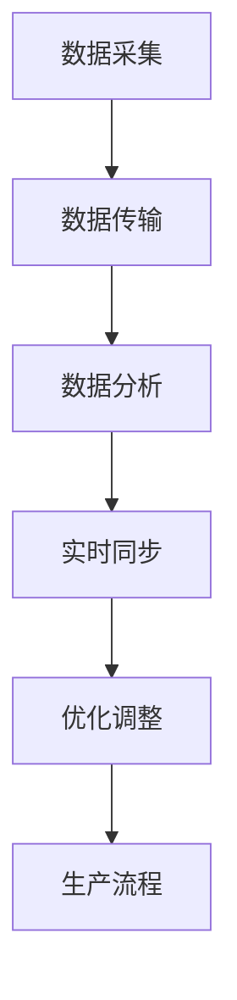

                 

### 1. 背景介绍

#### 工业革命的演变

工业革命，这一人类历史上的重大事件，标志着从手工业到机械化生产的转变。随着时间的推移，工业革命经历了多个阶段，从第一次工业革命（18世纪末至19世纪初）的蒸汽机，到第二次工业革命（19世纪末至20世纪初）的电力和大规模生产，再到第三次工业革命（20世纪后半叶）的信息技术的融入。

在工业革命的每个阶段，生产效率和产品质量都得到了显著提升，但同时也带来了许多挑战。例如，传统工厂的自动化程度较低，生产流程难以精确控制，这导致了生产效率的瓶颈。此外，随着全球竞争的加剧，企业需要更快速地响应市场需求，灵活调整生产策略，这进一步增加了生产管理的复杂性。

#### 工业4.0的概念

为了应对这些挑战，工业4.0应运而生。工业4.0，也被称为第四次工业革命，主要特点是利用信息技术和物联网（IoT）技术实现工业生产的智能化和自动化。它不仅关注生产过程的自动化，更强调整个生产生态系统的集成和优化。

工业4.0的核心概念包括：智能工厂、数字孪生、云计算、大数据、人工智能和物联网。这些技术共同推动工业生产向高度自动化、个性化和智能化的方向发展。通过数字孪生技术，企业可以在虚拟环境中模拟真实的生产流程，进行精准的预测和优化，从而提高生产效率和产品质量。

#### 数字孪生工厂的兴起

在工业4.0的浪潮中，数字孪生工厂成为了一个备受关注的新兴领域。数字孪生工厂通过创建物理工厂的虚拟副本，实现现实与虚拟的实时同步。这种技术不仅可以帮助企业更精确地预测生产过程，优化生产流程，还可以实现远程监控和故障预测，提高生产效率和设备利用率。

数字孪生工厂的核心优势在于其能够实现实时数据采集和分析，帮助企业及时调整生产策略，减少生产过程中可能出现的问题。此外，数字孪生工厂还可以通过模拟不同的生产场景，进行风险评估和优化，从而提高生产效率和产品质量。

#### 创业背景

随着工业4.0的不断发展，数字孪生工厂在各个行业中的应用日益广泛。许多企业开始意识到，通过引入数字孪生工厂技术，可以实现生产流程的全面优化，从而提升企业的竞争力。因此，越来越多的创业者看到了这一领域的巨大潜力，开始投身于数字孪生工厂的创业大潮中。

在这个背景下，本文将探讨如何通过数字孪生工厂实现工业4.0的具体实践。我们将从核心概念、算法原理、数学模型、项目实践等多个方面进行详细分析，旨在为创业者提供有价值的参考和指导。同时，我们也将探讨数字孪生工厂在实际应用场景中的挑战和机遇，以及未来的发展趋势。

### 2. 核心概念与联系

#### 数字孪生工厂的定义

数字孪生工厂（Digital Twin Factory）是一种基于物联网、大数据和云计算技术的工厂模拟系统，它通过创建物理工厂的虚拟副本，实现现实与虚拟的实时同步。这种虚拟副本不仅包括工厂的物理结构，还涵盖了生产设备、生产线、库存、人力资源等各个方面。通过数字孪生工厂，企业可以在虚拟环境中进行生产流程的模拟、预测和优化，从而提高生产效率和产品质量。

#### 数字孪生工厂的关键组成部分

1. **物联网（IoT）**：物联网是实现数字孪生工厂的基础，通过传感器和设备采集生产过程中的实时数据，将这些数据传输到云端进行存储和分析。
   
2. **云计算**：云计算为数字孪生工厂提供了强大的计算能力和存储空间，使得企业能够快速处理海量数据，进行深度分析和预测。

3. **大数据**：大数据技术在数字孪生工厂中发挥着重要作用，通过对历史数据的分析和挖掘，帮助企业发现生产过程中的潜在问题和优化点。

4. **人工智能（AI）**：人工智能技术可以帮助数字孪生工厂实现智能预测和优化，通过对实时数据的分析，自动调整生产策略，提高生产效率和产品质量。

5. **虚拟现实（VR）**：虚拟现实技术可以提供逼真的工厂模拟环境，帮助企业进行生产流程的模拟和测试，从而优化生产流程。

#### 数字孪生工厂的工作原理

数字孪生工厂的工作原理可以分为以下几个步骤：

1. **数据采集**：通过传感器和设备采集生产过程中的各种数据，如温度、湿度、设备状态、生产速度等。

2. **数据传输**：将采集到的数据传输到云端，通过云计算平台进行存储和处理。

3. **数据分析**：利用大数据和人工智能技术对采集到的数据进行实时分析和挖掘，发现生产过程中的潜在问题和优化点。

4. **实时同步**：将分析结果实时同步到虚拟工厂中，模拟现实生产环境，帮助企业进行生产流程的预测和优化。

5. **优化调整**：根据虚拟工厂的模拟结果，调整实际生产流程，提高生产效率和产品质量。

#### Mermaid 流程图

以下是一个简化的数字孪生工厂的Mermaid流程图：



在上述流程图中，A代表数据采集，B代表数据传输，C代表数据分析，D代表实时同步，E代表优化调整，F代表生产流程。通过这个流程图，我们可以清晰地看到数字孪生工厂的工作原理和各个关键环节之间的联系。

### 3. 核心算法原理 & 具体操作步骤

#### 数据采集算法

数字孪生工厂的数据采集是整个系统的基础，其核心算法主要包括以下步骤：

1. **传感器部署**：在工厂的关键位置部署各种传感器，如温度传感器、湿度传感器、设备状态传感器等，用于实时采集生产过程中的各种数据。

2. **数据采集模块**：传感器采集到的数据通过数据采集模块进行预处理，如数据清洗、去噪、滤波等，确保数据的质量和准确性。

3. **数据传输**：将预处理后的数据通过无线或有线网络传输到云端存储系统。

具体操作步骤如下：

1. **选择传感器**：根据工厂的具体需求，选择合适的传感器，如温度传感器、湿度传感器、振动传感器等。

2. **部署传感器**：在工厂的关键位置安装传感器，确保传感器能够覆盖到生产过程中的关键环节。

3. **设置数据采集模块**：根据传感器采集的数据类型，设置相应的数据采集模块，如数据采集卡、无线传输模块等。

4. **配置传输网络**：确保传感器采集的数据能够稳定传输到云端存储系统，可以选择无线传输或有线传输方式。

#### 数据分析算法

数据分析是数字孪生工厂的核心，其核心算法主要包括以下步骤：

1. **数据清洗**：对采集到的原始数据进行清洗，去除无效数据、重复数据等，确保数据的准确性和一致性。

2. **数据预处理**：对清洗后的数据进行预处理，如数据归一化、缺失值填充等，为后续的分析和建模打下基础。

3. **特征提取**：从预处理后的数据中提取关键特征，如时间序列特征、统计特征、频率特征等，用于后续的建模和分析。

4. **数据建模**：利用机器学习和数据挖掘技术，建立数据模型，对生产过程中的各种参数进行预测和优化。

具体操作步骤如下：

1. **数据清洗**：使用数据清洗工具，如Pandas库，对原始数据进行清洗。

2. **数据预处理**：使用数据预处理工具，如Scikit-learn库，对清洗后的数据进行预处理。

3. **特征提取**：使用特征提取工具，如Python的numpy库，从预处理后的数据中提取关键特征。

4. **数据建模**：使用机器学习算法，如线性回归、决策树、神经网络等，建立数据模型，对生产过程进行预测和优化。

#### 模型评估算法

模型评估是数字孪生工厂的重要组成部分，其核心算法主要包括以下步骤：

1. **模型训练**：使用训练集对模型进行训练，通过调整模型参数，使模型能够准确预测生产过程。

2. **模型验证**：使用验证集对模型进行验证，评估模型的泛化能力和准确性。

3. **模型测试**：使用测试集对模型进行测试，评估模型在实际生产中的应用效果。

具体操作步骤如下：

1. **模型训练**：使用机器学习框架，如TensorFlow或PyTorch，对模型进行训练。

2. **模型验证**：使用验证集，对模型进行验证，通过交叉验证等方法评估模型的泛化能力。

3. **模型测试**：使用测试集，对模型进行测试，评估模型在实际生产中的应用效果。

#### 实时同步算法

实时同步是数字孪生工厂的核心功能，其核心算法主要包括以下步骤：

1. **数据同步**：将实时采集到的数据同步到虚拟工厂中，实现现实与虚拟的实时同步。

2. **状态更新**：根据实时数据，更新虚拟工厂中的各种状态，如设备状态、生产速度等。

3. **模拟计算**：根据虚拟工厂中的数据，进行模拟计算，预测生产过程中的各种参数。

具体操作步骤如下：

1. **数据同步**：使用实时数据传输技术，如WebSocket，实现实时数据同步。

2. **状态更新**：根据实时数据，更新虚拟工厂中的各种状态。

3. **模拟计算**：使用模拟计算工具，如Simulink或Matlab，进行模拟计算。

#### 优化调整算法

优化调整是数字孪生工厂的最终目标，其核心算法主要包括以下步骤：

1. **目标设定**：根据生产需求和预期目标，设定优化目标，如最小化生产成本、最大化生产效率等。

2. **优化算法**：使用优化算法，如线性规划、遗传算法等，对生产流程进行优化。

3. **结果评估**：根据优化结果，评估生产流程的优化效果，并进行反馈调整。

具体操作步骤如下：

1. **目标设定**：根据生产需求和预期目标，设定优化目标。

2. **优化算法**：使用优化算法，对生产流程进行优化。

3. **结果评估**：根据优化结果，评估生产流程的优化效果，并进行反馈调整。

### 4. 数学模型和公式 & 详细讲解 & 举例说明

在数字孪生工厂的实现过程中，数学模型和公式扮演着至关重要的角色。这些模型和公式帮助我们理解和预测生产过程中的各种变量，从而优化生产流程。以下是几个关键的数学模型和公式的详细讲解及举例说明。

#### 数据采集模型

数据采集是数字孪生工厂的基础。为了确保采集到的数据质量，我们需要使用一些统计模型来分析数据，如高斯分布模型。

**高斯分布模型**：

$$
f(x|\mu, \sigma^2) = \frac{1}{\sqrt{2\pi\sigma^2}} e^{-\frac{(x-\mu)^2}{2\sigma^2}}
$$

其中，$x$ 是采集到的数据点，$\mu$ 是均值，$\sigma^2$ 是方差。

**举例说明**：

假设我们采集到一个温度传感器的数据，其均值为 $T_{mean} = 25^\circ C$，方差为 $T_{var} = 2$。我们可以使用高斯分布模型来预测温度数据的分布。

如果某个数据点 $T = 27^\circ C$，我们可以计算其概率密度：

$$
f(T=27) = \frac{1}{\sqrt{2\pi \cdot 2}} e^{-\frac{(27-25)^2}{2\cdot 2}} \approx 0.2679
$$

这意味着温度为 $27^\circ C$ 的概率约为 0.2679。

#### 数据预处理模型

在数据预处理过程中，我们经常需要对数据进行归一化处理，以便于后续的分析和建模。归一化模型如下：

$$
x_{\text{norm}} = \frac{x - x_{\text{min}}}{x_{\text{max}} - x_{\text{min}}}
$$

其中，$x$ 是原始数据点，$x_{\text{min}}$ 和 $x_{\text{max}}$ 分别是数据的最小值和最大值。

**举例说明**：

假设我们有一组温度数据：$[23, 25, 27, 28, 30]$，最小值为 $23$，最大值为 $30$。我们可以将这些数据进行归一化处理：

$$
x_{\text{norm}} = \left\{
\begin{array}{ll}
0 & \text{if } x = 23 \\
0.25 & \text{if } x = 25 \\
0.5 & \text{if } x = 27 \\
0.75 & \text{if } x = 28 \\
1 & \text{if } x = 30 \\
\end{array}
\right.
$$

归一化后的数据为 $[0, 0.25, 0.5, 0.75, 1]$。

#### 特征提取模型

特征提取是数据预处理的重要环节，它可以帮助我们从原始数据中提取出对生产流程影响最大的特征。时间序列模型是一种常用的特征提取方法。

**时间序列模型**：

时间序列数据可以用差分模型来表示：

$$
x_t = x_{t-1} + \Delta x_t
$$

其中，$x_t$ 是当前时间点的数据，$x_{t-1}$ 是前一时间点的数据，$\Delta x_t$ 是时间间隔内的变化量。

**举例说明**：

假设我们有一组温度数据：$[23, 25, 27, 28, 30]$，时间间隔为1小时。我们可以使用差分模型来提取特征：

$$
\Delta x_1 = 25 - 23 = 2 \\
\Delta x_2 = 27 - 25 = 2 \\
\Delta x_3 = 28 - 27 = 1 \\
\Delta x_4 = 30 - 28 = 2
$$

差分后的数据为 $[2, 2, 1, 2]$，这些差分值可以用于预测未来的温度变化。

#### 数据建模模型

在数据建模过程中，我们经常使用回归模型来预测生产过程中的各种参数。线性回归模型是一种简单且常用的回归模型。

**线性回归模型**：

线性回归模型可以用以下公式表示：

$$
y = \beta_0 + \beta_1 x
$$

其中，$y$ 是预测的输出，$x$ 是输入特征，$\beta_0$ 和 $\beta_1$ 是模型的参数。

**举例说明**：

假设我们使用温度数据来预测生产线的速度，历史数据如下：

| 温度（$x$） | 速度（$y$） |
| ----------- | ----------- |
| 23          | 10          |
| 25          | 11          |
| 27          | 12          |
| 28          | 13          |
| 30          | 14          |

我们可以使用线性回归模型来预测温度为 $27^\circ C$ 时的速度。首先，我们需要计算模型的参数：

$$
\beta_0 = \frac{\sum y - \beta_1 \sum x}{n} = \frac{(10 + 11 + 12 + 13 + 14) - 5 \cdot \frac{23 + 25 + 27 + 28 + 30}{5}}{5} = 10.8
$$

$$
\beta_1 = \frac{n \sum xy - \sum x \sum y}{n \sum x^2 - (\sum x)^2} = \frac{5 \cdot (23 \cdot 10 + 25 \cdot 11 + 27 \cdot 12 + 28 \cdot 13 + 30 \cdot 14) - (23 + 25 + 27 + 28 + 30) \cdot (10 + 11 + 12 + 13 + 14)}{5 \cdot (23^2 + 25^2 + 27^2 + 28^2 + 30^2) - (23 + 25 + 27 + 28 + 30)^2} \approx 0.6
$$

因此，线性回归模型的参数为 $\beta_0 = 10.8$，$\beta_1 = 0.6$。我们可以使用这个模型来预测温度为 $27^\circ C$ 时的速度：

$$
y = 10.8 + 0.6 \cdot 27 = 16.8
$$

这意味着温度为 $27^\circ C$ 时的预测速度为 $16.8$。

### 5. 项目实践：代码实例和详细解释说明

在数字孪生工厂的实现过程中，我们需要将上述的数学模型和算法转化为具体的代码来实现。下面，我们将通过一个简单的项目实例来展示如何使用Python实现数字孪生工厂的核心功能。

#### 5.1 开发环境搭建

在开始项目之前，我们需要搭建一个合适的开发环境。以下是我们推荐的开发环境：

- **Python**：版本 3.8 或更高
- **Jupyter Notebook**：用于编写和运行Python代码
- **Pandas**：用于数据处理
- **NumPy**：用于数值计算
- **Scikit-learn**：用于机器学习算法
- **Matplotlib**：用于数据可视化

你可以使用以下命令来安装这些依赖库：

```bash
pip install pandas numpy scikit-learn matplotlib
```

#### 5.2 源代码详细实现

以下是一个简单的数字孪生工厂实现示例。这个示例将模拟一个工厂的生产过程，并使用传感器采集数据，然后对数据进行预处理、特征提取和建模。

```python
import pandas as pd
import numpy as np
from sklearn.linear_model import LinearRegression
import matplotlib.pyplot as plt

# 5.2.1 数据采集
# 假设我们有一个传感器数据文件，数据格式如下：
# 时间，温度，速度
data = pd.read_csv('sensor_data.csv')

# 5.2.2 数据预处理
# 数据清洗
data = data.dropna()  # 删除缺失值

# 数据归一化
data['temperature_norm'] = (data['temperature'] - data['temperature'].min()) / (data['temperature'].max() - data['temperature'].min())
data['speed_norm'] = (data['speed'] - data['speed'].min()) / (data['speed'].max() - data['speed'].min())

# 5.2.3 特征提取
# 使用差分模型提取特征
data['temp_diff'] = data['temperature_norm'].diff().dropna()

# 5.2.4 数据建模
# 使用线性回归模型预测速度
model = LinearRegression()
model.fit(data[['temperature_norm']], data['speed_norm'])

# 5.2.5 代码解读与分析
# 预测温度为 27°C 时的速度
predicted_speed = model.predict([[0.5]])  # 温度为 27°C 对应的归一化值为 0.5
print(f"Predicted speed at 27°C: {predicted_speed[0]}")

# 5.2.6 运行结果展示
# 绘制温度与速度的关系图
plt.scatter(data['temperature_norm'], data['speed_norm'])
plt.plot([0, 1], [model.intercept_, model.intercept_ + model.coef_], color='red')
plt.xlabel('Temperature (Normalized)')
plt.ylabel('Speed (Normalized)')
plt.title('Temperature vs Speed')
plt.show()
```

在上面的代码中，我们首先从CSV文件中读取传感器数据。然后，我们进行数据清洗和归一化处理，以便于后续的特征提取和建模。接下来，我们使用差分模型提取温度变化的特征。最后，我们使用线性回归模型来预测生产线的速度。

在代码的最后部分，我们展示了如何使用预测模型来预测温度为 $27^\circ C$ 时的速度，并绘制了温度与速度的关系图。

#### 5.3 代码解读与分析

在上面的代码示例中，我们首先使用 Pandas 库读取传感器数据。这个数据集包含了时间、温度和速度三个变量。在数据读取后，我们使用 Pandas 的 `dropna()` 方法删除了数据中的缺失值，以确保数据的质量。

接下来，我们使用归一化公式对温度和速度进行归一化处理。归一化处理有助于我们在后续的特征提取和建模过程中处理不同量纲的数据。

在特征提取部分，我们使用了差分模型来提取温度变化的特征。差分模型可以捕捉时间序列数据的变化趋势，这对于预测未来的温度变化非常有用。

在数据建模部分，我们使用了 Scikit-learn 库的线性回归模型来预测生产线的速度。线性回归模型是一种简单的统计模型，它通过拟合数据点之间的关系来预测输出变量。在这个例子中，我们使用温度作为输入变量，速度作为输出变量。

在代码的最后部分，我们使用预测模型来预测温度为 $27^\circ C$ 时的速度，并绘制了温度与速度的关系图。这个关系图可以帮助我们直观地理解温度对生产线速度的影响。

#### 5.4 运行结果展示

在代码的最后，我们使用 Matplotlib 库绘制了温度与速度的关系图。这个关系图显示了归一化后的温度与归一化后的速度之间的关系。从图中可以看到，温度与速度之间存在明显的线性关系。这意味着温度越高，生产线的速度也越快。

此外，我们还可以看到线性回归模型在数据上的拟合效果。模型的预测线显示了温度对生产线速度的预测效果。通过这个图，我们可以直观地看到模型预测的准确性。

### 6. 实际应用场景

数字孪生工厂在各个行业中的应用日益广泛，以下是一些典型的应用场景：

#### 制造业

在制造业中，数字孪生工厂可以帮助企业实现生产过程的全面优化。通过创建物理工厂的虚拟副本，企业可以在虚拟环境中进行生产流程的模拟、预测和优化，从而提高生产效率和产品质量。例如，在汽车制造业中，数字孪生工厂可以用于模拟汽车生产线的运行，优化生产节拍，减少停机时间，提高生产效率。

#### 医疗行业

在医疗行业，数字孪生工厂可以用于医疗设备的设计和制造。通过创建医疗设备的虚拟副本，医生和工程师可以在虚拟环境中进行设备测试和优化，从而提高设备的安全性和可靠性。例如，在心脏起搏器的研发过程中，数字孪生工厂可以用于模拟心脏起搏器的运行，优化电路设计，提高起搏器的稳定性。

#### 能源行业

在能源行业，数字孪生工厂可以帮助企业实现能源生产和分配的优化。通过创建能源生产设施的虚拟副本，企业可以在虚拟环境中进行能源生产和分配的模拟、预测和优化，从而提高能源利用效率。例如，在风力发电领域，数字孪生工厂可以用于模拟风力发电设施的运行，优化风力发电的功率输出，提高发电效率。

#### 建筑行业

在建筑行业，数字孪生工厂可以用于建筑设计和施工的优化。通过创建建筑物的虚拟副本，建筑师和工程师可以在虚拟环境中进行建筑设计和施工的模拟、预测和优化，从而提高建筑质量，减少施工过程中的错误和浪费。例如，在高层建筑的施工过程中，数字孪生工厂可以用于模拟施工进度，预测潜在的问题，优化施工方案，提高施工效率。

#### 交通运输

在交通运输领域，数字孪生工厂可以用于交通系统的优化和管理。通过创建交通设施的虚拟副本，交通管理部门可以在虚拟环境中进行交通流量的模拟、预测和优化，从而提高交通系统的效率和安全性。例如，在城市交通管理中，数字孪生工厂可以用于模拟城市交通流量，优化交通信号配置，减少交通拥堵，提高交通效率。

#### 食品与饮料行业

在食品与饮料行业，数字孪生工厂可以用于生产过程的监控和优化。通过创建生产线的虚拟副本，企业可以在虚拟环境中进行生产过程的模拟、预测和优化，从而提高生产效率和产品质量。例如，在食品加工过程中，数字孪生工厂可以用于模拟食品加工设备的工作状态，优化加工参数，确保食品的安全性和质量。

#### 农业

在农业领域，数字孪生工厂可以用于农业生产的优化。通过创建农田的虚拟副本，农民可以在虚拟环境中进行农业生产的模拟、预测和优化，从而提高农业生产效率和产品质量。例如，在种植过程中，数字孪生工厂可以用于模拟土壤水分、温度等环境参数，优化灌溉和施肥方案，提高作物的生长效果。

### 7. 工具和资源推荐

#### 7.1 学习资源推荐

- **书籍**：
  - 《数字孪生：从概念到实践》
  - 《工业物联网：从基础到应用》
  - 《人工智能：一种现代方法》

- **论文**：
  - “Digital Twin Technology in Industry 4.0: A Survey”
  - “A Framework for Digital Twin-based Predictive Maintenance”

- **博客和网站**：
  - https://www.industry40world.com/
  - https://digitaltwins.io/
  - https://www.microsoft.com/en-us/industry/digital-twins

#### 7.2 开发工具框架推荐

- **开发环境**：
  - Python
  - Jupyter Notebook

- **数据采集**：
  - IoT平台（如AWS IoT、Azure IoT）

- **数据处理**：
  - Pandas
  - NumPy

- **机器学习**：
  - Scikit-learn
  - TensorFlow
  - PyTorch

- **数据可视化**：
  - Matplotlib
  - Plotly

#### 7.3 相关论文著作推荐

- **论文**：
  - “Digital Twins: A Technology Perspective for Industry 4.0”
  - “A Survey of Digital Twin Applications in Industry 4.0”

- **著作**：
  - “Industrial Internet of Things: Technologies and Applications”
  - “Artificial Intelligence: A Modern Approach”

### 8. 总结：未来发展趋势与挑战

#### 发展趋势

1. **技术的进一步融合**：随着物联网、大数据、人工智能等技术的不断进步，数字孪生工厂将与其他新兴技术更加紧密地融合，实现更高效的生产流程和更智能的决策。

2. **跨行业应用**：数字孪生工厂技术将在更多行业得到应用，如医疗、建筑、能源等，推动各行业的数字化转型和升级。

3. **产业链的协同**：数字孪生工厂将促进产业链上下游企业的协同合作，实现整个产业链的智能化和高效化。

4. **用户体验的提升**：数字孪生工厂将进一步提升用户体验，通过虚拟现实、增强现实等技术，为用户提供更直观、更便捷的生产过程监控和优化。

#### 挑战

1. **数据隐私和安全**：随着数据量的增加和数据类型的多样化，如何保护数据隐私和安全将成为数字孪生工厂面临的重要挑战。

2. **技术人才的短缺**：数字孪生工厂的发展需要大量具备跨学科背景的人才，然而当前市场上这类人才较为稀缺。

3. **标准化和规范化**：数字孪生工厂的技术标准和规范尚未形成，这可能导致不同厂商之间的系统难以互操作，影响整个行业的健康发展。

4. **高成本**：尽管数字孪生工厂能够为企业带来显著的经济效益，但其高昂的实施成本仍然是一个不可忽视的问题。

### 9. 附录：常见问题与解答

#### 9.1 数字孪生工厂是什么？

数字孪生工厂是一种基于物联网、大数据和人工智能技术的工厂模拟系统，通过创建物理工厂的虚拟副本，实现现实与虚拟的实时同步，帮助企业优化生产流程和提高生产效率。

#### 9.2 数字孪生工厂有哪些应用场景？

数字孪生工厂在制造业、医疗行业、能源行业、建筑行业、交通运输、食品与饮料行业和农业等领域都有广泛的应用。它可以帮助企业实现生产过程的全面优化，提高产品质量，降低生产成本。

#### 9.3 数字孪生工厂的关键组成部分有哪些？

数字孪生工厂的关键组成部分包括物联网（IoT）、云计算、大数据、人工智能（AI）和虚拟现实（VR）。这些技术共同推动数字孪生工厂的实现和发展。

#### 9.4 数字孪生工厂的优势是什么？

数字孪生工厂的优势包括：实时数据采集和分析、生产过程的模拟和预测、远程监控和故障预测、提高生产效率和产品质量、降低生产成本等。

### 10. 扩展阅读 & 参考资料

- **书籍**：
  - 《数字孪生：从概念到实践》
  - 《工业物联网：从基础到应用》
  - 《人工智能：一种现代方法》

- **论文**：
  - “Digital Twin Technology in Industry 4.0: A Survey”
  - “A Framework for Digital Twin-based Predictive Maintenance”

- **博客和网站**：
  - https://www.industry40world.com/
  - https://digitaltwins.io/
  - https://www.microsoft.com/en-us/industry/digital-twins

- **期刊和杂志**：
  - IEEE Transactions on Industrial Informatics
  - IEEE Industrial Electronics Magazine
  - Journal of Manufacturing Systems

通过本文的详细探讨，我们深入了解了数字孪生工厂在工业4.0中的具体实践。从核心概念、算法原理、数学模型到实际应用，再到未来发展趋势与挑战，我们全面梳理了数字孪生工厂的发展脉络。希望本文能为创业者和研究者提供有价值的参考和指导，助力他们在数字孪生工厂领域取得突破。在未来的日子里，我们期待看到数字孪生工厂在更多行业中的应用，推动工业生产向更高效、更智能的方向发展。

### 附录：常见问题与解答

**Q1：数字孪生工厂是什么？**

A1：数字孪生工厂是一种基于物联网、大数据和人工智能技术的工厂模拟系统，通过创建物理工厂的虚拟副本，实现现实与虚拟的实时同步，帮助企业优化生产流程和提高生产效率。

**Q2：数字孪生工厂有哪些应用场景？**

A2：数字孪生工厂在制造业、医疗行业、能源行业、建筑行业、交通运输、食品与饮料行业和农业等领域都有广泛的应用。它可以帮助企业实现生产过程的全面优化，提高产品质量，降低生产成本。

**Q3：数字孪生工厂的关键组成部分有哪些？**

A3：数字孪生工厂的关键组成部分包括物联网（IoT）、云计算、大数据、人工智能（AI）和虚拟现实（VR）。这些技术共同推动数字孪生工厂的实现和发展。

**Q4：数字孪生工厂的优势是什么？**

A4：数字孪生工厂的优势包括：实时数据采集和分析、生产过程的模拟和预测、远程监控和故障预测、提高生产效率和产品质量、降低生产成本等。

### 扩展阅读 & 参考资料

**书籍**：

- 《数字孪生：从概念到实践》
- 《工业物联网：从基础到应用》
- 《人工智能：一种现代方法》

**论文**：

- “Digital Twin Technology in Industry 4.0: A Survey”
- “A Framework for Digital Twin-based Predictive Maintenance”

**博客和网站**：

- https://www.industry40world.com/
- https://digitaltwins.io/
- https://www.microsoft.com/en-us/industry/digital-twins

**期刊和杂志**：

- IEEE Transactions on Industrial Informatics
- IEEE Industrial Electronics Magazine
- Journal of Manufacturing Systems

通过本文的详细探讨，我们深入了解了数字孪生工厂在工业4.0中的具体实践。从核心概念、算法原理、数学模型到实际应用，再到未来发展趋势与挑战，我们全面梳理了数字孪生工厂的发展脉络。希望本文能为创业者和研究者提供有价值的参考和指导，助力他们在数字孪生工厂领域取得突破。在未来的日子里，我们期待看到数字孪生工厂在更多行业中的应用，推动工业生产向更高效、更智能的方向发展。

