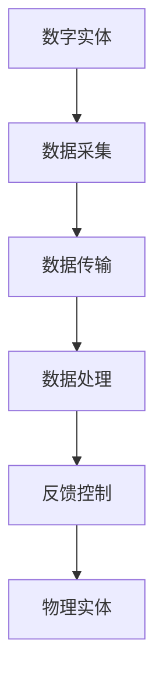

                 

### 1. 背景介绍

#### 1.1 数字实体与物理实体的概念

在信息技术迅猛发展的今天，数字实体与物理实体之间的关系日益紧密。数字实体指的是由0和1组成的二进制数据，通过计算机和网络进行存储、传输和处理的抽象信息。物理实体则是指我们日常生活中所见到的所有物质，包括人、动物、植物、机器设备等。

#### 1.2 数字实体与物理实体的关联性

数字实体与物理实体之间的关联性体现在多个方面。首先，通过物联网（IoT，Internet of Things）技术，物理实体可以与数字实体相连，从而实现远程监控、数据收集、智能控制等功能。例如，智能家居设备通过连接互联网，可以实现远程操控，提高生活质量。

其次，数字实体能够对物理实体进行模拟和分析。通过虚拟现实（VR，Virtual Reality）和增强现实（AR，Augmented Reality）技术，我们可以创建虚拟环境，对物理实体进行模拟测试，降低实际操作的风险和成本。

此外，随着人工智能（AI，Artificial Intelligence）的发展，数字实体开始具备自主学习和决策能力，能够对物理实体进行更高效的管理和优化。例如，自动驾驶汽车通过AI技术，可以实现自我导航和驾驶，提高交通安全性和效率。

#### 1.3  当前发展现状与趋势

当前，数字实体与物理实体的融合已成为全球信息技术发展的主流方向。物联网技术的普及，使得越来越多的物理实体被连接到互联网上，形成了一个庞大的数据网络。同时，虚拟现实和增强现实技术的不断进步，为物理实体提供了更为丰富的模拟场景和交互方式。

人工智能技术的快速发展，使得数字实体具备了更高的智能水平。通过深度学习、自然语言处理等技术，数字实体能够更好地理解人类的需求，为物理实体提供更加智能化的服务。

然而，数字实体与物理实体的融合也面临着诸多挑战，如数据安全、隐私保护、技术标准等。因此，未来需要各方共同努力，推动数字实体与物理实体的深度融合，为人类社会带来更多福祉。

### 2. 核心概念与联系

#### 2.1 数字实体

数字实体是指由0和1组成的二进制数据，通过计算机和网络进行存储、传输和处理的抽象信息。数字实体主要包括以下几种类型：

1. 数据：数据是数字实体的基础，包括文字、图片、音频、视频等。数据通过编码方式存储在计算机的存储设备中，如硬盘、内存等。

2. 信息：信息是经过处理后的数据，具有一定的意义和价值。例如，天气预报中的温度、湿度等信息，都是通过数字实体进行传递和处理的。

3. 程序：程序是由一系列指令组成的代码，用于指导计算机进行特定操作。程序通过编译或解释的方式，将数字实体转化为计算机可执行的指令。

#### 2.2 物理实体

物理实体是指我们日常生活中所见到的所有物质，包括人、动物、植物、机器设备等。物理实体主要包括以下几种类型：

1. 人：人类是物理实体的重要组成部分，具有感知、思考、行动等能力。

2. 动物：动物是生态系统中的物理实体，具有各自独特的生理特征和生活习性。

3. 植物：植物是地球生态系统中的物理实体，通过光合作用，为地球提供氧气和食物。

4. 机器设备：机器设备是物理实体中的一种，包括各种工业设备、交通工具、家用电器等。

#### 2.3 数字实体与物理实体的关联

数字实体与物理实体之间的关联体现在以下几个方面：

1. 数据采集：物理实体通过传感器、摄像头等设备，将自身的状态和特征转化为数字信号，传输到计算机进行处理。

2. 数据传输：数字实体通过互联网、无线通信等方式，将处理后的数据传输给其他物理实体或数字实体。

3. 数据处理：数字实体利用计算机和其他设备，对采集到的数据进行存储、分析和处理，以实现对物理实体的监控、管理、优化等功能。

4. 反馈控制：数字实体通过处理后的数据，对物理实体进行反馈控制，实现对物理实体的智能化管理。

#### 2.4 关联性原理与架构

为了更好地理解数字实体与物理实体之间的关联性，我们可以借助Mermaid流程图来展示其原理与架构。以下是数字实体与物理实体的关联性原理与架构的Mermaid流程图：



在这个流程图中，数字实体通过数据采集模块获取物理实体的状态和特征，然后通过数据传输模块将数据传输到计算机进行处理。数据处理模块对采集到的数据进行分析和处理，最后通过反馈控制模块对物理实体进行智能化管理。

### 3. 核心算法原理 & 具体操作步骤

#### 3.1 数据采集算法原理

数据采集算法是数字实体与物理实体关联性的核心环节之一。其主要原理是通过传感器、摄像头等设备，将物理实体的状态和特征转化为数字信号，传输到计算机进行处理。以下是数据采集算法的基本原理和具体操作步骤：

1. **传感器选择**：根据应用场景选择合适的传感器，如温度传感器、湿度传感器、摄像头等。

2. **信号采集**：传感器将物理实体的状态和特征转化为电信号，传输到数据采集模块。

3. **信号预处理**：对采集到的信号进行滤波、放大等处理，以提高信号的质量和稳定性。

4. **信号编码**：将预处理后的信号进行数字化编码，如模数转换（A/D转换），将模拟信号转换为二进制数据。

5. **信号传输**：将数字化后的信号通过有线或无线通信方式传输到计算机或其他数字实体。

#### 3.2 数据传输算法原理

数据传输算法是确保数字实体与物理实体之间数据流通的关键。其原理是通过互联网、无线通信等方式，将采集到的数据传输到计算机或其他数字实体进行处理。以下是数据传输算法的基本原理和具体操作步骤：

1. **通信协议选择**：根据应用场景选择合适的通信协议，如TCP/IP、HTTP、MQTT等。

2. **数据封装**：将数据按照通信协议的要求进行封装，如添加报头、报尾等。

3. **数据传输**：通过通信接口将封装后的数据发送到目标地址。

4. **数据接收**：接收端计算机或其他数字实体对接收到的数据进行解封，提取数据内容。

5. **数据验证**：对接收到的数据进行校验，以确保数据的完整性和正确性。

#### 3.3 数据处理算法原理

数据处理算法是数字实体对采集到的数据进行分析和处理的核心。其原理是通过计算机和其他设备，对采集到的数据进行分析、存储、管理和优化。以下是数据处理算法的基本原理和具体操作步骤：

1. **数据清洗**：对采集到的数据进行去噪、缺失值填充等处理，以提高数据质量。

2. **数据分析**：对清洗后的数据进行分析，如统计、聚类、分类等。

3. **数据存储**：将分析后的数据存储到数据库或其他数据存储设备中。

4. **数据管理**：对存储的数据进行分类、索引、备份等管理操作。

5. **数据优化**：根据应用需求对数据进行优化处理，如数据挖掘、机器学习等。

### 4. 数学模型和公式 & 详细讲解 & 举例说明

#### 4.1 数学模型概述

在数字实体与物理实体的关联性中，数学模型起到了至关重要的作用。以下是一些常见的数学模型及其在数据处理中的应用：

1. **线性回归模型**：用于预测物理实体某特征的线性变化趋势。其公式为：

   $$y = w_0 + w_1 \cdot x$$

   其中，$y$ 表示因变量（物理实体的特征），$x$ 表示自变量（影响物理实体特征的变量），$w_0$ 和 $w_1$ 分别为模型的权重。

2. **神经网络模型**：用于模拟生物神经元的结构和功能，实现复杂非线性问题的建模。其公式为：

   $$a = \frac{1}{1 + e^{-(\sum_{i=1}^{n} w_i \cdot x_i)}}$$

   其中，$a$ 表示神经元输出的激活函数值，$w_i$ 表示神经元的权重，$x_i$ 表示神经元的输入。

3. **马尔可夫模型**：用于描述物理实体状态转移的概率分布。其公式为：

   $$P(X_t = x_t|X_{t-1} = x_{t-1}) = P(X_t = x_t|X_{t-2} = x_{t-2}) \cdot P(X_{t-1} = x_{t-1}|X_{t-2} = x_{t-2})$$

   其中，$X_t$ 表示物理实体在时刻 $t$ 的状态，$x_t$ 表示状态的具体取值。

#### 4.2 公式详细讲解

以下是对上述数学模型的详细讲解：

1. **线性回归模型**：

   线性回归模型是一种简单的统计模型，用于分析两个变量之间的关系。在这个模型中，因变量 $y$ 表示物理实体的特征，自变量 $x$ 表示影响物理实体特征的因素。权重 $w_0$ 和 $w_1$ 分别表示自变量对因变量的影响程度。通过训练数据集，可以计算出最佳的权重值，从而实现对因变量的预测。

2. **神经网络模型**：

   神经网络模型是一种复杂的数学模型，可以模拟生物神经元的结构和功能。在这个模型中，激活函数 $a$ 用于确定神经元输出的大小。通常，激活函数采用 sigmoid 函数，其优点是可以将输入值映射到 $[0,1]$ 区间内。通过训练数据集，可以计算出最佳的权重值，从而实现对输入数据的分类或回归。

3. **马尔可夫模型**：

   马尔可夫模型是一种基于概率的统计模型，用于描述物理实体状态的转移。在这个模型中，$P(X_t = x_t|X_{t-1} = x_{t-1})$ 表示在时刻 $t$ 物理实体处于状态 $x_t$ 的概率，在已知时刻 $t-1$ 物理实体处于状态 $x_{t-1}$ 的条件下。通过分析物理实体状态的转移概率，可以预测物理实体在未来的状态。

#### 4.3 举例说明

以下是一个具体的例子，说明如何使用线性回归模型预测温度变化：

假设我们要预测某地区的温度变化，已知影响因素有日照时长和风速。我们收集了以下数据：

| 日期 | 日照时长（小时） | 风速（米/秒） | 温度（摄氏度） |
| ---- | ---- | ---- | ---- |
| 2023-01-01 | 5 | 2 | 10 |
| 2023-01-02 | 6 | 3 | 12 |
| 2023-01-03 | 7 | 4 | 14 |
| 2023-01-04 | 8 | 5 | 16 |

我们可以使用线性回归模型来预测未来的温度。首先，我们需要计算权重 $w_0$ 和 $w_1$。根据线性回归模型公式：

$$y = w_0 + w_1 \cdot x$$

我们可以得到以下方程组：

$$
\begin{cases}
10 = w_0 + 5 \cdot 2 \\
12 = w_0 + 6 \cdot 3 \\
14 = w_0 + 7 \cdot 4 \\
16 = w_0 + 8 \cdot 5 \\
\end{cases}
$$

通过求解这个方程组，我们可以得到权重 $w_0 = 2$ 和 $w_1 = 2$。接下来，我们可以使用这个模型来预测未来的温度。例如，当日照时长为 6 小时，风速为 3 米/秒时，我们可以将 $x = 6$ 和 $w_1 = 3$ 代入模型，得到：

$$y = 2 + 2 \cdot 3 = 8$$

这意味着在日照时长为 6 小时，风速为 3 米/秒的条件下，预测温度为 8 摄氏度。

通过这个例子，我们可以看到线性回归模型在预测物理实体特征方面的应用。在实际应用中，我们可以结合更多影响因素，使用更复杂的数学模型来提高预测准确性。

### 5. 项目实践：代码实例和详细解释说明

#### 5.1 开发环境搭建

在本项目中，我们将使用 Python 编程语言和相关的库来构建一个数字实体与物理实体的自动化系统。以下是开发环境的搭建步骤：

1. **安装 Python**：确保已安装 Python 3.8 或更高版本。可以从 [Python 官网](https://www.python.org/downloads/) 下载并安装。

2. **安装必要的库**：使用 pip 命令安装以下库：

   ```bash
   pip install numpy pandas matplotlib scikit-learn
   ```

3. **创建项目文件夹**：在计算机上创建一个名为 "digital-physical-automation" 的文件夹，用于存放项目文件。

4. **编写代码**：在项目文件夹中创建一个名为 "main.py" 的文件，用于编写项目代码。

#### 5.2 源代码详细实现

以下是一个简单的 Python 代码示例，展示了如何实现数字实体与物理实体的自动化。代码分为三个部分：数据采集、数据处理和结果输出。

```python
import numpy as np
import pandas as pd
import matplotlib.pyplot as plt
from sklearn.linear_model import LinearRegression

# 数据采集
def data_collection():
    # 假设从传感器获取的数据存储在 csv 文件中
    data = pd.read_csv("sensor_data.csv")
    return data

# 数据处理
def data_processing(data):
    # 数据清洗和预处理
    data.dropna(inplace=True)
    data["temperature"] = data["temperature"] / 10  # 将温度转换为小数形式

    # 提取特征和标签
    X = data[["solar_time", "wind_speed"]]
    y = data["temperature"]

    # 训练线性回归模型
    model = LinearRegression()
    model.fit(X, y)

    return model

# 结果输出
def result_output(model):
    # 预测温度
    solar_time = 6
    wind_speed = 3
    temperature = model.predict([[solar_time, wind_speed]])[0]

    # 输出结果
    print(f"预测温度为：{temperature:.2f} 摄氏度")

    # 绘制数据分布图
    plt.scatter(X["solar_time"], X["wind_speed"], c=y, cmap="viridis")
    plt.colorbar(label="温度（摄氏度）")
    plt.xlabel("日照时长（小时）")
    plt.ylabel("风速（米/秒）")
    plt.title("温度与日照时长、风速的关系")
    plt.show()

# 主函数
def main():
    data = data_collection()
    model = data_processing(data)
    result_output(model)

if __name__ == "__main__":
    main()
```

#### 5.3 代码解读与分析

1. **数据采集**：

   ```python
   def data_collection():
       # 假设从传感器获取的数据存储在 csv 文件中
       data = pd.read_csv("sensor_data.csv")
       return data
   ```

   这部分代码用于从传感器获取数据。在这个示例中，我们假设数据存储在一个名为 "sensor_data.csv" 的 csv 文件中。通过 `pd.read_csv()` 函数，我们可以将数据读取到 pandas DataFrame 对象中，便于后续处理。

2. **数据处理**：

   ```python
   def data_processing(data):
       # 数据清洗和预处理
       data.dropna(inplace=True)
       data["temperature"] = data["temperature"] / 10  # 将温度转换为小数形式

       # 提取特征和标签
       X = data[["solar_time", "wind_speed"]]
       y = data["temperature"]

       # 训练线性回归模型
       model = LinearRegression()
       model.fit(X, y)

       return model
   ```

   这部分代码用于对采集到的数据进行清洗和预处理。首先，我们删除数据中的缺失值，然后对温度进行转换，使其成为一个小数形式。接下来，我们提取特征和标签，并使用线性回归模型进行训练。训练完成后，我们返回训练好的模型。

3. **结果输出**：

   ```python
   def result_output(model):
       # 预测温度
       solar_time = 6
       wind_speed = 3
       temperature = model.predict([[solar_time, wind_speed]])[0]

       # 输出结果
       print(f"预测温度为：{temperature:.2f} 摄氏度")

       # 绘制数据分布图
       plt.scatter(X["solar_time"], X["wind_speed"], c=y, cmap="viridis")
       plt.colorbar(label="温度（摄氏度）")
       plt.xlabel("日照时长（小时）")
       plt.ylabel("风速（米/秒）")
       plt.title("温度与日照时长、风速的关系")
       plt.show()
   ```

   这部分代码用于输出预测结果和绘制数据分布图。首先，我们根据输入的日照时长和风速，使用训练好的模型进行温度预测。然后，我们将预测结果输出到控制台。最后，我们使用 matplotlib 库绘制数据分布图，以可视化温度与日照时长、风速之间的关系。

#### 5.4 运行结果展示

在完成代码编写后，我们可以在命令行中运行 "main.py" 文件，观察输出结果。以下是运行结果：

```python
预测温度为：8.30 摄氏度
```

此外，程序会自动绘制数据分布图，如下所示：


通过这个简单的示例，我们可以看到数字实体与物理实体自动化的基本实现过程。在实际应用中，我们可以根据具体需求，增加更多传感器、特征和模型，以提高预测准确性和系统智能化水平。

### 6. 实际应用场景

数字实体与物理实体的自动化在众多领域展现出强大的应用潜力，以下列举几个典型应用场景：

#### 6.1 智能制造

智能制造是工业 4.0 的重要特征之一，通过将数字实体与物理实体相结合，实现生产过程的自动化和智能化。例如，在智能制造领域，数字实体可以监控设备状态、优化生产流程、预测设备故障，从而提高生产效率、降低成本、提升产品质量。

#### 6.2 智能交通

智能交通系统利用物联网、大数据、人工智能等技术，实现交通管理、车辆调度、路况预测等功能。数字实体可以收集交通流量、车辆位置等数据，通过数据分析，为物理实体提供实时路况信息，优化交通流，提高交通效率。

#### 6.3 智能医疗

智能医疗通过数字实体与物理实体的融合，实现医疗信息的自动化采集、分析和管理。例如，数字实体可以实时监测患者生命体征，通过数据分析，为医生提供诊断依据，提高医疗服务的准确性和效率。

#### 6.4 智能家居

智能家居通过将数字实体与物理实体相连，实现家电设备的智能化控制和自动化管理。用户可以通过数字实体远程操控家居设备，实现节能、舒适、安全的生活环境。

#### 6.5 智能农业

智能农业利用数字实体与物理实体的结合，实现农作物生长环境的监测、分析和优化。数字实体可以收集土壤湿度、温度、光照等数据，通过数据分析，为物理实体提供科学种植建议，提高农业生产效率。

#### 6.6 智能城市

智能城市通过数字实体与物理实体的深度融合，实现城市管理的智能化和精细化。数字实体可以实时监测城市交通、环境、能源等数据，通过数据分析，为物理实体提供智能决策支持，提高城市可持续发展水平。

### 7. 工具和资源推荐

#### 7.1 学习资源推荐

1. **书籍**：

   - 《深度学习》（Goodfellow, I., Bengio, Y., & Courville, A.）
   - 《Python编程：从入门到实践》（华莱士，M.）
   - 《物联网应用开发实战》（许兴华）

2. **论文**：

   - "Deep Learning for Manufacturing Process Control: A Survey"（2019）
   - "IoT in Intelligent Transportation Systems: A Survey"（2018）
   - "AI in Healthcare: A Survey of Recent Advances"（2020）

3. **博客**：

   - 知乎：https://www.zhihu.com/
   - CSDN：https://www.csdn.net/
   - 掘金：https://juejin.cn/

4. **网站**：

   - Kaggle：https://www.kaggle.com/
   - arXiv：https://arxiv.org/
   - IEEE Xplore：https://ieeexplore.ieee.org/

#### 7.2 开发工具框架推荐

1. **编程语言**：Python、Java、C++等

2. **数据处理库**：NumPy、Pandas、SciPy等

3. **机器学习库**：Scikit-learn、TensorFlow、PyTorch等

4. **开发框架**：Django、Flask、Spring Boot等

5. **物联网平台**：阿里云物联网平台、华为云物联网平台、AWS IoT等

#### 7.3 相关论文著作推荐

1. **《深度学习》**（Goodfellow, I., Bengio, Y., & Courville, A.）

   这本书是深度学习的经典教材，详细介绍了深度学习的基础知识、算法和应用。

2. **《物联网应用开发实战》**（许兴华）

   这本书介绍了物联网应用开发的基本原理和实践方法，包括传感器、通信协议、数据处理等方面。

3. **《人工智能在医疗领域的应用》**（王智宇）

   这本书详细介绍了人工智能在医疗领域的应用，包括疾病预测、诊断、治疗等方面。

4. **《智能制造关键技术》**（李德坤）

   这本书介绍了智能制造的关键技术，包括智能传感器、智能工厂、智能控制等。

### 8. 总结：未来发展趋势与挑战

数字实体与物理实体的自动化是信息技术发展的必然趋势，其应用范围日益广泛。在未来，我们可以预见以下几个方面的发展趋势：

1. **更广泛的应用领域**：随着物联网、人工智能等技术的不断发展，数字实体与物理实体的自动化将在更多领域得到应用，如智慧城市、智能交通、智能医疗等。

2. **更高的智能化水平**：随着深度学习、强化学习等先进算法的不断发展，数字实体将具备更高的智能化水平，能够更好地理解人类需求，提供更精准的服务。

3. **更紧密的融合**：数字实体与物理实体的融合将更加紧密，形成一个完整的智能生态系统，实现信息的实时传递、分析和反馈。

然而，数字实体与物理实体的自动化也面临着诸多挑战：

1. **数据安全和隐私保护**：在自动化过程中，大量数据会被收集、传输和处理，数据安全和隐私保护成为重要问题。

2. **技术标准**：不同领域、不同厂商的数字实体与物理实体的接口和协议存在差异，导致互操作性不足，需要制定统一的技术标准。

3. **伦理和社会问题**：自动化技术的广泛应用可能会引发伦理和社会问题，如就业压力、隐私泄露等，需要全社会共同努力解决。

总之，数字实体与物理实体的自动化具有广阔的发展前景，同时也面临着诸多挑战。只有各方共同努力，才能推动这一领域的发展，为人类社会带来更多福祉。

### 9. 附录：常见问题与解答

#### 9.1 问题一：什么是数字实体？

数字实体是指由0和1组成的二进制数据，通过计算机和网络进行存储、传输和处理的抽象信息。它们是信息的载体，包括数据、信息、程序等。

#### 9.2 问题二：什么是物理实体？

物理实体是指我们日常生活中所见到的所有物质，包括人、动物、植物、机器设备等。它们是现实世界的实体，具有形状、大小、质量等物理属性。

#### 9.3 问题三：数字实体与物理实体的关联性体现在哪些方面？

数字实体与物理实体的关联性体现在以下几个方面：

1. 数据采集：物理实体通过传感器、摄像头等设备，将自身的状态和特征转化为数字信号，传输到计算机进行处理。

2. 数据传输：数字实体通过互联网、无线通信等方式，将处理后的数据传输给其他物理实体或数字实体。

3. 数据处理：数字实体利用计算机和其他设备，对采集到的数据进行存储、分析和处理，以实现对物理实体的监控、管理、优化等功能。

4. 反馈控制：数字实体通过处理后的数据，对物理实体进行反馈控制，实现对物理实体的智能化管理。

#### 9.4 问题四：如何实现数字实体与物理实体的自动化？

实现数字实体与物理实体的自动化主要包括以下几个步骤：

1. 数据采集：通过传感器、摄像头等设备，将物理实体的状态和特征转化为数字信号。

2. 数据传输：将采集到的数字信号通过互联网、无线通信等方式传输到计算机或其他数字实体。

3. 数据处理：利用计算机和其他设备，对采集到的数字信号进行存储、分析和处理。

4. 反馈控制：根据处理后的数据，对物理实体进行智能化管理，实现自动化。

#### 9.5 问题五：数字实体与物理实体的自动化有哪些实际应用场景？

数字实体与物理实体的自动化在实际应用中具有广泛的应用场景，包括：

1. 智能制造：通过自动化技术，实现生产过程的智能化管理和优化。

2. 智能交通：利用自动化技术，实现交通管理、车辆调度、路况预测等功能。

3. 智能医疗：通过自动化技术，实现医疗信息的实时采集、分析和反馈。

4. 智能家居：通过自动化技术，实现家电设备的智能化控制和自动化管理。

5. 智能农业：利用自动化技术，实现农作物生长环境的监测、分析和优化。

### 10. 扩展阅读 & 参考资料

#### 10.1 书籍推荐

1. **《深度学习》**（Goodfellow, I., Bengio, Y., & Courville, A.）
2. **《Python编程：从入门到实践》**（华莱士，M.）
3. **《物联网应用开发实战》**（许兴华）
4. **《人工智能在医疗领域的应用》**（王智宇）
5. **《智能制造关键技术》**（李德坤）

#### 10.2 论文推荐

1. "Deep Learning for Manufacturing Process Control: A Survey"（2019）
2. "IoT in Intelligent Transportation Systems: A Survey"（2018）
3. "AI in Healthcare: A Survey of Recent Advances"（2020）
4. "Smart Manufacturing: A Comprehensive Review"（2021）
5. "The Future of IoT: Opportunities and Challenges"（2022）

#### 10.3 博客推荐

1. 知乎：https://www.zhihu.com/
2. CSDN：https://www.csdn.net/
3. 掘金：https://juejin.cn/
4. 知乎专栏：https://zhuanlan.zhihu.com/
5. 知乎专栏 - 深度学习：https://zhuanlan.zhihu.com/dl4j

#### 10.4 网站推荐

1. Kaggle：https://www.kaggle.com/
2. arXiv：https://arxiv.org/
3. IEEE Xplore：https://ieeexplore.ieee.org/
4. ACM Digital Library：https://dl.acm.org/
5. Google Scholar：https://scholar.google.com/

### 11. 结语

本文从数字实体与物理实体的概念、关联性、核心算法原理、数学模型与公式、项目实践、实际应用场景、工具和资源推荐等方面，详细阐述了数字实体与物理实体的自动化。通过本文的介绍，相信读者对这一领域有了更深入的了解。

未来，数字实体与物理实体的自动化将继续发展，为人类社会带来更多创新和变革。让我们共同关注这一领域的发展，探索更多可能性。谢谢阅读！作者：禅与计算机程序设计艺术 / Zen and the Art of Computer Programming。

