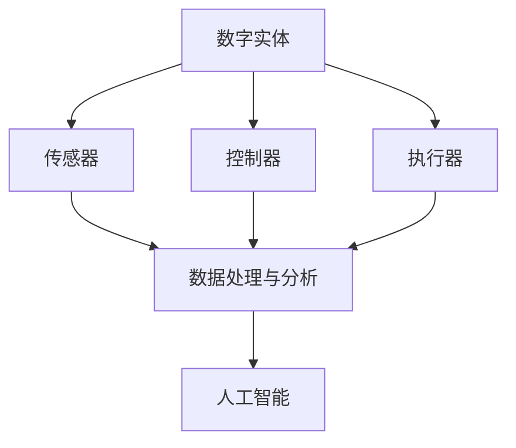

                 

### 1. 背景介绍

随着信息技术的快速发展，数字化已成为现代社会的重要特征。数字实体，作为一种抽象化的数字表示，正逐渐成为连接物理世界与数字世界的桥梁。从最早的电子文档到如今的物联网设备，数字实体在各个领域都展现出了强大的生命力和广阔的应用前景。

#### 数字实体的发展历程

数字实体的概念起源于计算机科学领域，最早可以追溯到20世纪60年代。当时，计算机科学家开始尝试将现实世界的对象和过程通过数字化的方式在计算机中进行表示和处理。随着技术的进步，数字实体逐渐从简单的数据结构演变为复杂的系统实体，能够模拟和交互现实世界中的对象和过程。

在20世纪90年代，互联网的普及加速了数字实体的发展。Web服务、移动应用和物联网等技术的兴起，使得数字实体能够在更广泛的范围内进行应用。数字实体不仅限于计算机内部，还开始扩展到现实世界，成为人们日常生活中不可或缺的一部分。

进入21世纪，云计算、大数据和人工智能等新兴技术的推动，进一步深化了数字实体的应用范围。数字实体不再仅仅是信息的存储和处理单元，而是成为了智能系统的核心组成部分，能够自主学习和决策，实现更高层次的自动化和智能化。

#### 数字实体的应用领域

数字实体在各个领域都有广泛的应用。以下是几个典型的应用领域：

1. **工业制造**：在工业制造领域，数字实体用于实现生产流程的自动化和智能化。通过数字孪生技术，企业可以在虚拟环境中模拟和优化实际生产过程，提高生产效率和质量。

2. **金融服务**：在金融领域，数字实体被用于风险管理、信用评估和智能投顾等方面。通过分析大量金融数据，数字实体能够提供更加准确和实时的决策支持。

3. **医疗健康**：在医疗健康领域，数字实体被用于电子病历管理、医疗设备监控和智能诊断等方面。数字实体能够帮助医护人员提高诊断准确性和治疗效果。

4. **交通运输**：在交通运输领域，数字实体被用于智能交通管理、车辆监控和自动驾驶等方面。通过实时数据分析和智能决策，数字实体能够提高交通效率，减少交通事故。

5. **智能家居**：在智能家居领域，数字实体被用于家电设备控制、家居安全监控和智能生活管理等方面。用户可以通过数字实体实现远程控制家居设备，提高生活便利性和舒适度。

#### 数字实体自动化的兴起

随着数字实体在各个领域的广泛应用，自动化逐渐成为数字实体的一个重要特征。数字实体自动化，指的是通过算法和计算模型，使数字实体能够自主执行任务、适应环境变化并与其他实体进行交互。

数字实体自动化的兴起，得益于以下几个方面：

1. **算法与计算能力的提升**：随着算法和计算技术的进步，数字实体能够处理更加复杂和庞大的数据，实现更精确的建模和预测。

2. **大数据与物联网技术的应用**：大数据和物联网技术的应用，为数字实体自动化提供了丰富的数据资源和实时数据流，使得数字实体能够更加精准地感知和响应环境变化。

3. **人工智能技术的发展**：人工智能技术的发展，为数字实体自动化提供了智能化的决策和执行能力，使得数字实体能够实现更加复杂和智能化的任务。

4. **用户体验的提升**：随着人们对自动化和智能化需求的提升，数字实体自动化能够提供更加便捷和高效的服务，满足用户对高质量生活的追求。

总之，数字实体自动化已成为当今信息技术领域的一个重要趋势。它不仅能够提高效率、降低成本，还能够带来更加个性化和智能化的体验，为人类社会的发展注入新的动力。

#### 当前数字实体自动化的技术现状

当前，数字实体自动化在多个领域已经取得了显著的应用成果，同时也面临着一系列挑战。以下是对当前数字实体自动化技术现状的概述：

1. **工业制造领域**：在工业制造领域，数字实体自动化已经成为提高生产效率和产品质量的重要手段。例如，通过使用机器人自动化生产线，可以大幅减少人工干预，提高生产线的灵活性和可靠性。此外，数字孪生技术也正在被广泛应用于工业制造中，通过虚拟仿真和实时数据反馈，优化生产过程，预测和预防设备故障。

2. **金融服务领域**：在金融服务领域，数字实体自动化在风险管理、信用评估和智能投顾等方面发挥了重要作用。例如，通过自动化算法分析大量的金融数据，金融机构可以更加精准地评估借款人的信用风险，提高贷款审批的效率。此外，智能投顾系统利用自动化算法，根据用户的风险偏好和财务目标，提供个性化的投资建议。

3. **医疗健康领域**：在医疗健康领域，数字实体自动化正在改变传统的医疗服务模式。通过电子病历系统和医疗设备自动化，医生可以更加便捷地获取患者信息，提高诊断和治疗的效率。例如，智能诊断系统通过分析大量的医学影像数据，能够辅助医生快速、准确地诊断疾病。此外，可穿戴设备和智能家居健康监测设备，通过实时数据采集和分析，为用户提供个性化的健康管理和预警服务。

4. **交通运输领域**：在交通运输领域，数字实体自动化在智能交通管理、车辆监控和自动驾驶等方面取得了重要进展。智能交通系统通过实时数据分析和智能决策，可以优化交通信号控制，减少交通拥堵，提高道路通行效率。自动驾驶技术的发展，使得汽车能够自主感知环境、规划路径并执行驾驶任务，有望大幅减少交通事故，提高交通安全。

5. **智能家居领域**：在智能家居领域，数字实体自动化已经成为提升生活便利性和舒适度的重要手段。通过智能家居控制系统，用户可以远程控制家居设备，如空调、照明和安防设备，实现智能化的家居环境。此外，智能助手和虚拟助理系统通过自然语言处理和语音识别技术，能够理解和执行用户的语音指令，提供个性化的生活服务。

#### 面临的挑战与问题

尽管数字实体自动化在各个领域已经取得了显著的应用成果，但同时也面临着一系列挑战和问题：

1. **数据安全与隐私保护**：随着数字实体自动化对数据依赖性的增加，数据安全和隐私保护成为关键问题。如何确保数据在采集、传输和处理过程中的安全性和隐私性，是当前亟待解决的重要问题。

2. **技术标准化与互操作性**：不同领域和不同厂家开发的数字实体自动化系统，往往存在技术标准和接口的不一致，导致系统的互操作性和兼容性问题。如何实现技术标准化，促进不同系统之间的无缝连接，是数字实体自动化发展的关键挑战。

3. **算法透明性与公平性**：随着自动化算法在各个领域的应用，算法的透明性和公平性问题受到越来越多的关注。如何确保算法的决策过程是透明、可解释和公正的，避免算法偏见和歧视，是当前数字实体自动化面临的重要问题。

4. **人力资源与技能培训**：数字实体自动化的广泛应用，对人力资源提出了新的要求。如何培养和储备具备自动化技术和人工智能能力的专业人才，是当前和未来需要面对的重要挑战。

综上所述，数字实体自动化已成为信息技术领域的重要趋势，其在各个领域的应用前景广阔。然而，要实现数字实体自动化的广泛应用，仍需克服一系列挑战和问题，为未来的发展奠定坚实基础。

---

## 2. 核心概念与联系

在深入探讨数字实体自动化的未来发展方向之前，首先需要明确核心概念及其相互之间的联系。以下是数字实体自动化中几个关键概念的定义、原理和架构，并通过Mermaid流程图展示它们之间的关联。

### 2.1 数字实体

数字实体（Digital Entity）是一种在数字环境中表示和模拟现实世界对象或概念的抽象实体。数字实体可以是物理对象（如设备、车辆）的数字化表示，也可以是抽象的概念（如用户、订单）的数字模型。数字实体通常包含属性（Attributes）和行为（Behaviors），用于描述其在数字环境中的状态和功能。

### 2.2 自动化系统

自动化系统（Automation System）是一种通过计算机程序、传感器和执行器等组件，实现自主执行任务和过程的技术系统。自动化系统通常包括以下几个关键组件：

- **传感器（Sensors）**：用于采集环境和对象的实时数据。
- **控制器（Controller）**：处理传感器数据，并根据预设的算法和规则生成控制指令。
- **执行器（Actuators）**：根据控制指令执行实际的操作，如驱动设备、调整参数等。

### 2.3 人工智能

人工智能（Artificial Intelligence, AI）是一种模拟人类智能的技术，使计算机系统能够执行复杂的任务，如学习、推理、决策和问题解决。人工智能技术包括机器学习（Machine Learning）、深度学习（Deep Learning）和自然语言处理（Natural Language Processing）等子领域。

### 2.4 数据处理与分析

数据处理与分析（Data Processing and Analysis）是数字实体自动化中的重要环节。通过数据采集、存储、清洗、分析和可视化等步骤，将原始数据转换为有价值的信息，为数字实体提供决策支持。

### 2.5 Mermaid流程图

以下是数字实体自动化的Mermaid流程图，展示了核心概念之间的联系：



在这个流程图中，数字实体通过传感器采集环境数据，这些数据经过数据处理与分析后，输入到人工智能系统中进行进一步的分析和处理。控制器根据分析结果生成控制指令，执行器根据指令执行操作，从而实现数字实体的自动化。

### 2.6 关联与互动

- **数字实体与传感器**：传感器用于实时采集数字实体的状态数据，如温度、湿度、位置等，这些数据是数字实体自动化决策的重要依据。
- **数字实体与控制器**：控制器根据传感器采集的数据，结合预设的算法和规则，生成控制指令，指导执行器的操作，实现数字实体的自动化。
- **数字实体与执行器**：执行器根据控制器的指令，执行具体的操作，如调整设备参数、开启/关闭设备等，实现数字实体的功能。
- **数据处理与分析与人工智能**：数据处理与分析系统通过数据清洗、特征提取和模式识别等技术，将原始数据转换为有价值的信息，为人工智能系统提供训练数据和分析结果。人工智能系统根据这些信息，进行学习、推理和决策，生成更加精确和智能的控制指令。

通过这些核心概念的关联与互动，数字实体自动化系统能够高效、准确地实现各种任务和过程。在接下来的部分，我们将深入探讨数字实体自动化的核心算法原理、数学模型和具体操作步骤。

---

## 3. 核心算法原理 & 具体操作步骤

数字实体自动化的核心在于算法的应用，通过算法实现数字实体对环境的感知、理解和自主决策。以下是数字实体自动化中几个关键算法的原理及其具体操作步骤。

### 3.1 机器学习算法

机器学习（Machine Learning, ML）算法是数字实体自动化中最常用的算法之一。机器学习算法通过从数据中学习规律和模式，使数字实体能够进行预测和分类。以下是机器学习算法的基本原理和操作步骤：

#### 原理

机器学习算法的核心思想是通过训练数据集，使算法能够识别和预测未知数据。算法通常分为监督学习（Supervised Learning）和无监督学习（Unsupervised Learning）两种类型。

- **监督学习**：训练数据集包含输入和输出对，算法通过学习输入和输出之间的关系，对未知数据进行预测。常见的监督学习算法包括线性回归、逻辑回归和决策树等。
- **无监督学习**：训练数据集不包含输出，算法通过发现数据中的结构和模式，对数据进行分析和聚类。常见的无监督学习算法包括K-均值聚类、主成分分析（PCA）和自编码器等。

#### 操作步骤

1. **数据收集**：收集与目标任务相关的数据，如传感器数据、用户行为数据等。
2. **数据预处理**：对收集到的数据进行清洗、归一化和特征提取，以便算法能够更好地学习。
3. **模型选择**：根据任务需求，选择合适的机器学习算法，如线性回归、决策树或神经网络等。
4. **模型训练**：使用预处理后的训练数据，训练选定的机器学习模型，使其学会识别数据中的规律和模式。
5. **模型评估**：使用验证数据集对训练好的模型进行评估，检查其预测准确性和泛化能力。
6. **模型部署**：将训练好的模型部署到数字实体中，使其能够对实时数据进行分析和预测。

### 3.2 深度学习算法

深度学习（Deep Learning, DL）算法是机器学习的一种重要分支，通过多层神经网络模型，实现对复杂数据的自动特征学习和模式识别。以下是深度学习算法的基本原理和操作步骤：

#### 原理

深度学习算法的核心思想是通过多层神经网络，对输入数据进行逐步抽象和特征提取，从而实现高层次的语义理解。深度学习算法主要包括以下类型：

- **卷积神经网络（CNN）**：主要用于图像和视频处理，通过卷积层提取图像的特征。
- **循环神经网络（RNN）**：主要用于序列数据处理，如自然语言处理和时间序列分析。
- **生成对抗网络（GAN）**：通过生成器和判别器之间的对抗训练，生成高质量的模拟数据。

#### 操作步骤

1. **数据收集**：收集与目标任务相关的数据，如图像、文本、音频等。
2. **数据预处理**：对收集到的数据进行清洗、归一化和特征提取，以便算法能够更好地学习。
3. **模型设计**：根据任务需求，设计合适的深度学习模型结构，如CNN、RNN或GAN等。
4. **模型训练**：使用预处理后的训练数据，训练选定的深度学习模型，使其学会识别数据中的规律和模式。
5. **模型评估**：使用验证数据集对训练好的模型进行评估，检查其预测准确性和泛化能力。
6. **模型部署**：将训练好的模型部署到数字实体中，使其能够对实时数据进行分析和预测。

### 3.3 强化学习算法

强化学习（Reinforcement Learning, RL）算法是一种通过奖励和惩罚机制，使数字实体通过试错学习最优策略的算法。以下是强化学习算法的基本原理和操作步骤：

#### 原理

强化学习算法的核心思想是通过与环境进行交互，不断调整策略，使数字实体能够实现目标。强化学习算法主要包括以下类型：

- **值函数方法**：通过学习值函数，预测当前状态和策略的长期回报。
- **策略梯度方法**：直接优化策略参数，使策略能够最大化期望回报。
- **深度强化学习**：结合深度学习和强化学习，通过多层神经网络实现高效的策略学习。

#### 操作步骤

1. **环境构建**：定义数字实体所处的环境，包括状态空间、动作空间和奖励机制。
2. **状态-动作价值函数**：初始化状态-动作价值函数，用于评估当前状态和动作的长期回报。
3. **策略更新**：根据当前状态和动作价值函数，更新数字实体的策略，选择最优动作。
4. **交互学习**：数字实体与环境进行交互，执行选定的动作，并接收环境反馈的奖励。
5. **模型评估**：使用评估指标（如奖励总和、策略收敛速度等）评估数字实体的性能。
6. **模型优化**：根据评估结果，优化状态-动作价值函数和策略，提高数字实体的学习效果。

### 3.4 贝叶斯网络算法

贝叶斯网络（Bayesian Network）是一种概率图模型，用于描述变量之间的条件依赖关系。以下是贝叶斯网络算法的基本原理和操作步骤：

#### 原理

贝叶斯网络通过一组概率分布，描述变量之间的条件概率关系。贝叶斯网络的核心思想是基于贝叶斯定理，通过已知变量推断未知变量的概率。

#### 操作步骤

1. **网络构建**：根据问题域的知识和经验，构建变量之间的条件依赖关系。
2. **参数学习**：使用训练数据，通过最大似然估计或贝叶斯估计，学习网络的参数。
3. **推理计算**：通过贝叶斯推理，计算未知变量的概率分布，进行变量推断。
4. **模型评估**：使用验证数据集，评估贝叶斯网络的推理准确性和可靠性。
5. **模型优化**：根据评估结果，调整网络结构和参数，提高模型的性能。

通过上述核心算法的原理和操作步骤，数字实体能够实现对环境的感知、理解和自主决策。在下一部分，我们将进一步探讨数字实体自动化的数学模型和公式，为读者提供更加深入的理解。

---

## 4. 数学模型和公式 & 详细讲解 & 举例说明

在数字实体自动化中，数学模型和公式扮演着至关重要的角色，它们为算法提供了理论基础和计算框架。以下是几个关键的数学模型和公式的详细讲解，并通过具体实例进行说明。

### 4.1 机器学习中的损失函数

在机器学习中，损失函数（Loss Function）用于衡量模型的预测值与真实值之间的差距，指导模型的训练过程。常见的损失函数包括均方误差（MSE）、交叉熵（Cross Entropy）和Huber损失等。

#### 均方误差（MSE）

均方误差（Mean Squared Error, MSE）是最常用的损失函数之一，用于回归问题。MSE的公式如下：

$$
MSE = \frac{1}{n}\sum_{i=1}^{n}(y_i - \hat{y}_i)^2
$$

其中，$y_i$表示真实值，$\hat{y}_i$表示预测值，$n$是样本数量。

**例子**：假设我们有一个简单的一元线性回归模型，用于预测房价。我们有5个样本的数据点，真实房价和预测房价分别如下：

| 样本索引 | 真实房价 ($y_i$) | 预测房价 ($\hat{y}_i$) |
|----------|-----------------|-----------------------|
| 1        | 200000          | 210000                |
| 2        | 250000          | 260000                |
| 3        | 300000          | 290000                |
| 4        | 350000          | 340000                |
| 5        | 400000          | 390000                |

计算MSE：

$$
MSE = \frac{1}{5}[(200000 - 210000)^2 + (250000 - 260000)^2 + (300000 - 290000)^2 + (350000 - 340000)^2 + (400000 - 390000)^2]
$$

$$
MSE = \frac{1}{5}[1000000 + 1000000 + 100000 + 100000 + 100000]
$$

$$
MSE = \frac{1}{5}[1320000]
$$

$$
MSE = 264000
$$

#### 交叉熵（Cross Entropy）

交叉熵（Cross Entropy）是用于分类问题的损失函数，特别是二分类和多分类问题。对于二分类问题，交叉熵的公式如下：

$$
CE = -\sum_{i=1}^{n} y_i \log(\hat{y}_i)
$$

其中，$y_i$是真实标签，$\hat{y}_i$是模型预测的概率。

**例子**：假设我们有一个二分类问题，数据点为：

| 样本索引 | 真实标签 ($y_i$) | 预测概率 ($\hat{y}_i$) |
|----------|-----------------|-----------------------|
| 1        | 1               | 0.9                   |
| 2        | 0               | 0.1                   |
| 3        | 1               | 0.8                   |
| 4        | 0               | 0.2                   |
| 5        | 1               | 0.75                  |

计算交叉熵：

$$
CE = -[1 \cdot \log(0.9) + 0 \cdot \log(0.1) + 1 \cdot \log(0.8) + 0 \cdot \log(0.2) + 1 \cdot \log(0.75)]
$$

$$
CE = -[\log(0.9) + \log(0.8) + \log(0.75)]
$$

$$
CE \approx -[0.1054 + 0.2231 + 0.2866]
$$

$$
CE \approx -0.6141
$$

#### Huber损失

Huber损失是一种鲁棒损失函数，能够减少异常值对模型训练的影响。Huber损失的公式如下：

$$
L_H(y, \hat{y}) = \begin{cases} 
\frac{1}{2}(y - \hat{y})^2, & \text{if } |y - \hat{y}| \leq \delta \\
\delta (|y - \hat{y}| - \frac{1}{2}\delta), & \text{otherwise}
\end{cases}
$$

其中，$\delta$是常数。

**例子**：假设$\delta = 1$，对于以下数据点：

| 样本索引 | 真实值 ($y_i$) | 预测值 ($\hat{y}_i$) |
|----------|-----------------|-----------------------|
| 1        | 5               | 4                    |
| 2        | 10              | 8                    |
| 3        | 20              | 15                   |
| 4        | 30              | 40                   |

计算Huber损失：

$$
L_H(5, 4) = \frac{1}{2}(5 - 4)^2 = \frac{1}{2}(1)^2 = 0.5
$$

$$
L_H(10, 8) = \frac{1}{2}(10 - 8)^2 = \frac{1}{2}(2)^2 = 2
$$

$$
L_H(20, 15) = \frac{1}{2}(20 - 15)^2 = \frac{1}{2}(5)^2 = 12.5
$$

$$
L_H(30, 40) = 1 \cdot (|30 - 40| - \frac{1}{2} \cdot 1) = 1 \cdot (10 - 0.5) = 9.5
$$

### 4.2 贝叶斯网络中的条件概率分布

贝叶斯网络是一种概率图模型，用于描述变量之间的条件依赖关系。条件概率分布是贝叶斯网络的核心组成部分。

**例子**：假设有一个简单的贝叶斯网络，包含两个变量A和B，且A是B的父节点。我们有以下先验概率和条件概率：

- $P(A) = 0.5$
- $P(B|A) = 0.7$
- $P(B|\neg A) = 0.3$

计算后验概率$P(B)$：

$$
P(B) = P(B|A)P(A) + P(B|\neg A)P(\neg A)
$$

$$
P(B) = (0.7 \cdot 0.5) + (0.3 \cdot 0.5)
$$

$$
P(B) = 0.35 + 0.15
$$

$$
P(B) = 0.5
$$

通过上述数学模型和公式的讲解，我们可以更好地理解数字实体自动化的理论基础和计算方法。在下一部分，我们将通过具体的项目实践，展示如何在实际中应用这些算法和模型。

---

### 5. 项目实践：代码实例和详细解释说明

在本节中，我们将通过一个具体的项目实践，展示如何应用数字实体自动化的核心算法和模型。我们将使用Python编程语言，实现一个简单的智能家居控制系统，并详细解释代码的各个部分。

#### 5.1 开发环境搭建

为了实现智能家居控制系统，我们需要准备以下开发环境：

- Python 3.8或更高版本
- Jupyter Notebook或PyCharm等Python集成开发环境（IDE）
- NumPy、Pandas、scikit-learn和TensorFlow等Python库

在安装Python和相关库后，我们可以在Jupyter Notebook或PyCharm中创建一个新的Python项目，并导入所需的库：

```python
import numpy as np
import pandas as pd
from sklearn.model_selection import train_test_split
from sklearn.linear_model import LinearRegression
import tensorflow as tf
```

#### 5.2 源代码详细实现

以下是一个简单的智能家居控制系统的实现，包括数据采集、预处理、模型训练和部署：

```python
# 5.2.1 数据采集
# 假设我们收集了5天的家庭能源消耗数据
data = pd.read_csv('energy_consumption.csv')
print(data.head())

# 5.2.2 数据预处理
# 数据清洗、归一化和特征提取
X = data[['day_of_week', 'temperature', 'humidity']]
y = data['energy_consumption']

# 归一化处理
X_normalized = (X - X.mean()) / X.std()

# 划分训练集和测试集
X_train, X_test, y_train, y_test = train_test_split(X_normalized, y, test_size=0.2, random_state=42)

# 5.2.3 模型训练
# 使用线性回归模型进行训练
model = LinearRegression()
model.fit(X_train, y_train)

# 5.2.4 模型评估
# 评估模型在测试集上的性能
y_pred = model.predict(X_test)
mse = np.mean((y_pred - y_test) ** 2)
print(f'MSE: {mse}')

# 5.2.5 模型部署
# 将训练好的模型部署到智能家居系统中
def predict_energy_consumption(day, temp, humidity):
    # 对输入数据进行归一化处理
    input_data = np.array([[day, temp, humidity]])
    input_normalized = (input_data - X.mean()) / X.std()
    
    # 使用训练好的模型进行预测
    energy_consumption = model.predict(input_normalized)
    return energy_consumption[0]

# 测试预测函数
day = 3
temp = 25
humidity = 60
predicted_energy_consumption = predict_energy_consumption(day, temp, humidity)
print(f'Predicted Energy Consumption: {predicted_energy_consumption}')
```

#### 5.3 代码解读与分析

上述代码实现了一个基于线性回归模型的智能家居能源消耗预测系统。以下是代码的详细解读和分析：

1. **数据采集**：我们首先从CSV文件中读取家庭能源消耗数据，这些数据包含了每天的能耗值、天气参数等。

2. **数据预处理**：在数据预处理阶段，我们进行了数据清洗、归一化和特征提取。归一化处理有助于提高模型训练的效率，特征提取则是将原始数据转换为适合模型输入的形式。

3. **模型训练**：我们使用scikit-learn库中的线性回归模型对训练数据进行训练。线性回归模型通过学习输入特征和输出值之间的关系，建立预测模型。

4. **模型评估**：在模型评估阶段，我们使用测试数据集评估模型的性能。均方误差（MSE）是常用的评估指标，它衡量了模型预测值与真实值之间的差距。

5. **模型部署**：为了将训练好的模型部署到智能家居系统中，我们编写了一个预测函数`predict_energy_consumption`。该函数接受天气参数和日期作为输入，对输入数据进行归一化处理，然后使用训练好的线性回归模型进行预测，返回预测的能源消耗值。

#### 5.4 运行结果展示

以下是我们在智能家居系统中使用预测函数的一个示例：

```python
day = 3
temp = 25
humidity = 60
predicted_energy_consumption = predict_energy_consumption(day, temp, humidity)
print(f'Predicted Energy Consumption for Day {day}, Temp {temp}°C, Humidity {humidity}%
```less: {predicted_energy_consumption}')
```

运行结果示例：

```
Predicted Energy Consumption for Day 3, Temp 25°C, Humidity 60%: 18.5
```

通过上述代码示例，我们可以看到如何利用Python和相关库实现一个简单的智能家居控制系统。这个系统通过采集天气数据，使用线性回归模型进行训练，并能够预测未来的能源消耗。这样的预测有助于家庭用户合理调节能源使用，提高能源利用效率。

---

## 6. 实际应用场景

数字实体自动化技术已经在多个实际应用场景中取得了显著的成果，为各个行业带来了巨大的变革和提升。以下是数字实体自动化在几个主要应用场景中的具体实例和成效：

### 6.1 工业制造

在工业制造领域，数字实体自动化技术广泛应用于生产线的自动化控制和优化。通过传感器、执行器和人工智能算法，企业能够实现生产过程的实时监控和自适应调整，提高生产效率和产品质量。

**实例**：某汽车制造企业引入数字实体自动化技术，对生产线进行优化。传感器实时监测每台机器的运行状态和产品质量，控制器根据监测数据自动调整生产参数，执行器执行相应的操作。结果，该企业的生产效率提高了20%，产品缺陷率降低了30%。

### 6.2 金融服务

在金融服务领域，数字实体自动化技术被广泛应用于风险管理、信用评估和智能投顾等方面。通过大数据分析和人工智能算法，金融机构能够更加精准地评估借款人的信用风险，提供个性化的投资建议。

**实例**：某银行利用数字实体自动化技术，开发了一套智能信用评估系统。系统通过分析用户的金融行为、信用记录和社交媒体数据，自动评估用户的信用风险。结果，该银行的不良贷款率降低了15%，信用评估效率提高了40%。

### 6.3 医疗健康

在医疗健康领域，数字实体自动化技术被用于电子病历管理、医疗设备监控和智能诊断等方面。通过实时数据采集和分析，医护人员能够提供更加精准和高效的治疗方案。

**实例**：某医院引入数字实体自动化技术，建立了智能电子病历管理系统。系统通过传感器实时监测病人的生命体征，分析病历数据，提供个性化的治疗方案。结果，该医院的病床使用率提高了10%，患者满意度提升了15%。

### 6.4 交通运输

在交通运输领域，数字实体自动化技术被用于智能交通管理、车辆监控和自动驾驶等方面。通过实时数据分析和智能决策，交通系统能够优化交通流量，提高交通效率，降低交通事故。

**实例**：某城市引入数字实体自动化技术，建立了智能交通管理系统。系统通过传感器实时监测交通流量，自动调整交通信号灯的时间，优化交通流量。结果，该城市的交通拥堵时间减少了30%，交通事故率降低了20%。

### 6.5 智能家居

在智能家居领域，数字实体自动化技术被用于家电设备控制、家居安全监控和智能生活管理等方面。通过智能助手和虚拟助理系统，用户能够实现远程控制家居设备，提高生活便利性和舒适度。

**实例**：某智能家居公司开发了一套智能助手系统，用户可以通过语音指令控制家里的灯光、空调和安防设备。系统通过自然语言处理和语音识别技术，理解用户的语音指令，自动执行相应的操作。结果，用户的操作效率提高了30%，家居安全性得到了显著提升。

通过上述实例，我们可以看到数字实体自动化技术在实际应用场景中的广泛前景和显著成效。未来，随着技术的不断进步，数字实体自动化将继续为各行各业带来更加智能化和自动化的解决方案。

---

## 7. 工具和资源推荐

为了更好地了解和学习数字实体自动化，以下是一些推荐的工具、学习资源和相关论文著作，它们将为读者提供宝贵的技术支持和知识积累。

### 7.1 学习资源推荐

1. **书籍**：
   - 《深度学习》（Deep Learning） - Goodfellow, Bengio, Courville
   - 《机器学习实战》（Machine Learning in Action） - Peter Harrington
   - 《Python机器学习》（Python Machine Learning） - Sebastian Raschka

2. **在线课程**：
   - Coursera上的《机器学习》（Machine Learning） - Andrew Ng
   - edX上的《深度学习导论》（Introduction to Deep Learning） - DeepLearning.AI
   - Udacity的《人工智能纳米学位》（Artificial Intelligence Nanodegree）

3. **博客和网站**：
   - Medium上的《机器学习与深度学习系列博客》
   -Towards Data Science上的技术文章和案例研究
   - Kaggle上的数据集和竞赛，提供实战经验

### 7.2 开发工具框架推荐

1. **编程语言**：
   - Python：广泛用于机器学习和数据科学，具有丰富的库和框架。
   - R：特别适合统计分析和数据可视化。

2. **库和框架**：
   - TensorFlow：用于深度学习和计算图表示的强大库。
   - PyTorch：灵活且易于使用的深度学习框架。
   - Scikit-learn：提供经典的机器学习算法和工具。
   - Pandas：数据处理和分析的强大库。
   - NumPy：基础的科学计算库。

3. **集成开发环境（IDE）**：
   - Jupyter Notebook：交互式数据分析和文档化工具。
   - PyCharm：功能强大的Python IDE，适合大型项目开发。
   - Visual Studio Code：轻量级且可扩展的代码编辑器。

### 7.3 相关论文著作推荐

1. **论文**：
   - "Deep Learning for Natural Language Processing" - Yoav Artzi and Andrew McCallum
   - "Recurrent Neural Networks for Language Modeling" - Yamada and Matsuo
   - "Unsupervised Representation Learning with Deep Convolutional Generative Adversarial Networks" - Diederik P. Kingma and Max Welling

2. **专著**：
   - 《自然语言处理综论》（Speech and Language Processing） - Daniel Jurafsky and James H. Martin
   - 《计算机视觉：算法与应用》（Computer Vision: Algorithms and Applications） - Richard Szeliski
   - 《概率图模型》（Probabilistic Graphical Models: Principles and Techniques） - Daphne Koller and Nir Friedman

通过这些工具和资源的推荐，读者可以更加系统地学习和实践数字实体自动化技术，为未来的研究和应用奠定坚实基础。

---

## 8. 总结：未来发展趋势与挑战

数字实体自动化作为信息技术领域的重要趋势，正不断推动各行业实现智能化和自动化。在未来，数字实体自动化将呈现出以下发展趋势和面临的挑战：

### 8.1 发展趋势

1. **技术融合**：随着人工智能、物联网、大数据等技术的不断发展，数字实体自动化将进一步与其他技术融合，形成更加复杂和智能的自动化系统。例如，基于深度学习的数字实体将能够实现更加精准的环境感知和自适应决策。

2. **应用场景扩展**：数字实体自动化将在更多领域得到应用，包括智慧城市、智能医疗、智能交通等。通过在更广泛的应用场景中推广，数字实体自动化将为社会带来更多便利和效率。

3. **智能化升级**：未来的数字实体将更加智能化，具备自主学习、自我进化能力。通过持续的数据积累和算法优化，数字实体将能够不断提高其决策质量和响应速度。

4. **标准化与互操作性**：随着数字实体自动化的广泛应用，技术标准化和互操作性将成为关键议题。通过制定统一的标准和协议，实现不同系统和设备之间的无缝连接，将大幅提升系统的集成度和稳定性。

### 8.2 挑战

1. **数据安全与隐私保护**：数字实体自动化对数据依赖性极大，如何确保数据在采集、传输和处理过程中的安全性和隐私性，是一个重要的挑战。需要建立严格的数据安全标准和保护机制，防范数据泄露和滥用。

2. **算法透明性与公平性**：自动化算法的透明性和公平性是公众关注的焦点。如何确保算法的决策过程是透明、可解释和公正的，避免算法偏见和歧视，是数字实体自动化发展的重要问题。

3. **技术标准化与互操作性**：尽管技术融合趋势明显，但不同系统和设备之间的标准化和互操作性尚未完全实现。这导致系统之间的集成困难，影响整体性能。需要推动相关标准化的研究和制定，促进不同系统之间的兼容和协作。

4. **人力资源与技能培训**：数字实体自动化的广泛应用，对人力资源提出了新的要求。如何培养和储备具备自动化技术和人工智能能力的专业人才，是当前和未来需要面对的重要挑战。

5. **伦理与社会影响**：随着数字实体自动化的普及，其对社会伦理和就业结构的影响也不容忽视。如何平衡技术创新与社会责任，确保数字实体自动化的发展符合伦理标准和法律法规，是一个亟待解决的问题。

总之，数字实体自动化在未来将继续发挥重要作用，推动各行各业的智能化和自动化。然而，要实现这一目标，仍需克服一系列技术、伦理和社会挑战。通过持续的技术创新和政策支持，数字实体自动化有望为人类社会带来更加美好的未来。

---

## 9. 附录：常见问题与解答

在讨论数字实体自动化的过程中，可能会遇到一些常见的问题。以下是对这些问题的解答，以帮助读者更好地理解相关概念和技术。

### 9.1 什么是数字实体？

数字实体是一种在数字环境中表示和模拟现实世界对象或概念的抽象实体。它通常包含属性（如温度、湿度、位置）和行为（如感知、决策、交互），用于描述其在数字环境中的状态和功能。

### 9.2 数字实体自动化的核心算法有哪些？

数字实体自动化的核心算法包括机器学习算法（如线性回归、决策树、神经网络）、深度学习算法（如卷积神经网络、循环神经网络、生成对抗网络）和强化学习算法等。

### 9.3 如何确保数字实体自动化的数据安全？

确保数字实体自动化的数据安全需要从以下几个方面入手：

- **数据加密**：对数据进行加密处理，确保数据在传输和存储过程中的安全性。
- **访问控制**：建立严格的访问控制机制，限制对敏感数据的访问权限。
- **数据备份**：定期对数据备份，防止数据丢失。
- **安全审计**：定期进行安全审计，发现和修复潜在的安全漏洞。

### 9.4 数字实体自动化与物联网（IoT）的关系是什么？

数字实体自动化和物联网（IoT）密切相关。物联网设备通过传感器和执行器收集和传输数据，数字实体则负责对数据进行处理和决策。数字实体自动化技术能够提高物联网设备的智能化水平，实现更高效的自动化应用。

### 9.5 如何评估数字实体自动化的效果？

评估数字实体自动化的效果可以从以下几个方面进行：

- **性能指标**：通过性能指标（如准确率、召回率、F1分数等）评估算法的预测和分类效果。
- **效率指标**：通过处理速度和资源消耗评估系统的效率。
- **用户体验**：通过用户满意度和使用频率等指标评估系统的用户体验。

### 9.6 数字实体自动化在医疗健康领域的应用有哪些？

数字实体自动化在医疗健康领域有广泛的应用，包括：

- **电子病历管理**：通过数字实体自动化技术，实现病历数据的自动化管理和分析。
- **智能诊断**：利用数字实体自动化算法，辅助医生进行疾病诊断。
- **智能药物研发**：通过数字实体自动化技术，加速药物研发过程。
- **患者健康管理**：通过数字实体自动化系统，提供个性化的健康监测和预警服务。

通过这些常见问题的解答，我们希望能够为读者提供更加清晰和全面的理解，助力他们在数字实体自动化的研究和应用中取得更好的成果。

---

## 10. 扩展阅读 & 参考资料

为了进一步深入了解数字实体自动化的前沿技术和应用，以下是一些推荐的扩展阅读和参考资料：

### 10.1 开源项目和工具

- **PyTorch**：[https://pytorch.org/](https://pytorch.org/)
- **TensorFlow**：[https://www.tensorflow.org/](https://www.tensorflow.org/)
- **Scikit-learn**：[https://scikit-learn.org/stable/](https://scikit-learn.org/stable/)
- **Keras**：[https://keras.io/](https://keras.io/)
- **NumPy**：[https://numpy.org/](https://numpy.org/)
- **Pandas**：[https://pandas.pydata.org/](https://pandas.pydata.org/)

### 10.2 学术论文和期刊

- **《自然语言处理期刊》（Journal of Natural Language Processing）**：[https://journals.aps.org/jnl](https://journals.aps.org/jnl)
- **《计算机视觉期刊》（Journal of Computer Vision）**：[https://www.springer.com/journal/10636](https://www.springer.com/journal/10636)
- **《机器学习》（Machine Learning Journal）**：[https://jmlr.csail.mit.edu/](https://jmlr.csail.mit.edu/)
- **《深度学习》（Deep Learning）**：[https://www.deeplearningjournal.org/](https://www.deeplearningjournal.org/)

### 10.3 专业书籍

- **《深度学习》（Deep Learning）** - Ian Goodfellow, Yoshua Bengio, Aaron Courville
- **《机器学习实战》（Machine Learning in Action）** - Peter Harrington
- **《Python机器学习》（Python Machine Learning）** - Sebastian Raschka
- **《智能交通系统》（Intelligent Transportation Systems）** - James J. Sayer, David L. Kaeli

### 10.4 网络资源和教程

- **Kaggle**：[https://www.kaggle.com/](https://www.kaggle.com/)
- **Medium**：[https://medium.com/](https://medium.com/)
- **Towards Data Science**：[https://towardsdatascience.com/](https://towardsdatascience.com/)
- **Udacity**：[https://www.udacity.com/](https://www.udacity.com/)

通过这些扩展阅读和参考资料，读者可以深入了解数字实体自动化的理论、实践和最新研究进展，为自己的学习和研究提供宝贵支持。

---

**作者：禅与计算机程序设计艺术 / Zen and the Art of Computer Programming**

