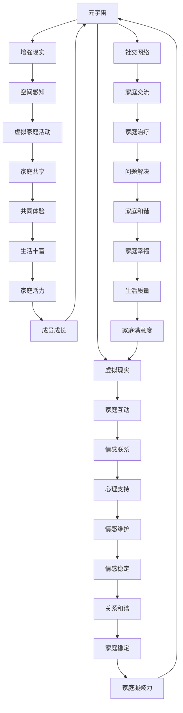
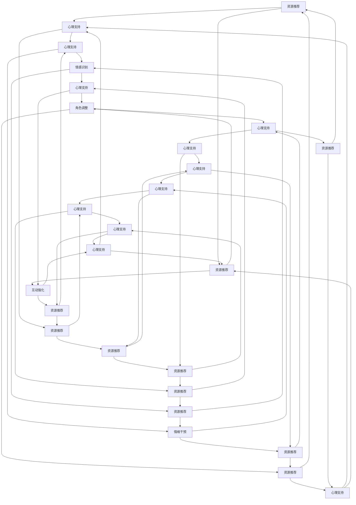

                 

### 1. 背景介绍

随着科技的发展，数字世界与物理世界的融合越来越紧密，元宇宙（Metaverse）应运而生。元宇宙是一个虚拟的、三维的、持续交互的数字空间，它不仅包含了虚拟现实（VR）、增强现实（AR）等技术，还涵盖了社交网络、游戏、电子商务等多个领域。在这个虚拟世界中，人们可以以数字化身份（Avatar）进行交流、工作、学习和娱乐。

数字家庭作为元宇宙的重要组成部分，正在逐步改变人们的家庭生活模式。通过虚拟现实和增强现实技术，家庭成员可以跨越时空的限制，共同参与家庭活动，享受更为丰富的家庭体验。这种新型的家庭互动模式不仅增强了家庭成员之间的情感联系，也提升了家庭生活的质量。

然而，随着数字家庭关系的日益紧密，如何处理和解决家庭内部的问题也成为了一个新的挑战。传统的家庭治疗模式在元宇宙时代面临新的困境，需要新的方法和工具来应对。因此，本文旨在探讨元宇宙时代下的数字家庭关系治疗，探讨如何通过数字技术和心理学原理，实现家庭关系的和谐与稳定。

### 2. 核心概念与联系

在探讨数字家庭关系治疗之前，我们需要了解一些核心概念和它们之间的关系。

#### 2.1 元宇宙与虚拟现实

元宇宙是一个由多个虚拟世界组成的网络，用户可以通过数字化身份在其中进行交互。虚拟现实（VR）是元宇宙的一个核心技术，它通过计算机生成模拟环境，使用户沉浸其中。在数字家庭中，VR技术可以帮助家庭成员体验共同的活动，如虚拟旅游、共同游戏等。

#### 2.2 增强现实与空间感知

增强现实（AR）是将虚拟信息叠加到现实世界中，增强用户的感知和体验。在数字家庭中，AR技术可以用于家庭装饰、虚拟玩具、互动式教育等。通过AR技术，家庭成员可以在现实环境中进行互动，增强空间感知和参与感。

#### 2.3 社交网络与家庭互动

社交网络是元宇宙的重要组成部分，它为家庭成员提供了交流的平台。通过社交网络，家庭成员可以分享生活点滴、共同参与线上活动、表达情感。这种交流方式有助于增进家庭成员之间的情感联系。

#### 2.4 心理学原理与家庭治疗

家庭治疗是心理学中的一个重要领域，它旨在解决家庭内部的问题，促进家庭关系的和谐。在元宇宙时代，传统的家庭治疗模式需要借助数字技术进行创新。通过心理学原理，如认知行为疗法、系统家庭治疗等，可以在虚拟环境中为家庭成员提供治疗服务。

#### 2.5 Mermaid 流程图

为了更直观地展示这些核心概念之间的关系，我们使用Mermaid流程图进行描述。



通过这个流程图，我们可以清晰地看到元宇宙、虚拟现实、增强现实、社交网络、心理学原理和家庭治疗之间的关系，以及它们如何共同作用于数字家庭关系治疗。

### 3. 核心算法原理 & 具体操作步骤

在数字家庭关系治疗中，核心算法原理和技术是实现家庭和谐的关键。以下将介绍一些关键算法原理及其具体操作步骤。

#### 3.1 认知行为疗法（CBT）

认知行为疗法是一种广泛使用的心理治疗方法，它通过改变负面思维和行为模式来改善情绪和心理问题。在元宇宙时代，CBT可以通过以下步骤应用于数字家庭关系治疗：

1. **问题识别**：家庭成员通过虚拟现实或增强现实环境共同参与互动，识别家庭中的问题和冲突。
2. **认知重构**：在心理学专家的指导下，家庭成员学习新的思考模式，逐步改变负面思维。
3. **行为调整**：通过设置家庭任务和活动，鼓励家庭成员积极调整行为，改善家庭关系。

#### 3.2 系统家庭治疗

系统家庭治疗关注家庭成员之间的互动关系，通过调整家庭结构和角色来解决问题。在元宇宙时代，系统家庭治疗可以通过以下步骤进行：

1. **家庭结构分析**：通过虚拟家庭会议，分析家庭结构，识别家庭成员之间的互动模式。
2. **角色调整**：在专家的建议下，家庭成员调整角色和责任，改善家庭关系。
3. **互动强化**：通过虚拟家庭活动，增强家庭成员之间的积极互动，提升家庭凝聚力。

#### 3.3 情感分析算法

情感分析算法可以用于分析家庭成员的言语和行为，识别情感状态和情绪变化。具体操作步骤如下：

1. **数据收集**：通过虚拟现实或社交网络收集家庭成员的言语和行为数据。
2. **情感识别**：使用自然语言处理技术，对收集的数据进行情感分析，识别情感状态。
3. **情绪干预**：根据情感分析结果，制定相应的情绪干预策略，改善家庭氛围。

#### 3.4 聊天机器人与心理支持

聊天机器人可以提供24/7的心理支持，帮助家庭成员缓解压力和焦虑。具体操作步骤如下：

1. **问题反馈**：家庭成员通过聊天机器人表达自己的问题，获取即时反馈。
2. **心理支持**：聊天机器人提供专业的心理支持，帮助家庭成员缓解情绪。
3. **资源推荐**：根据家庭成员的需求，推荐相关的心理资源，如心理医生、自助书籍等。

#### 3.5 Mermaid 流程图

为了更直观地展示核心算法原理的具体操作步骤，我们使用Mermaid流程图进行描述。



通过这个流程图，我们可以清晰地看到各个核心算法原理的具体操作步骤，以及它们在数字家庭关系治疗中的相互作用。

### 4. 数学模型和公式 & 详细讲解 & 举例说明

在数字家庭关系治疗中，数学模型和公式发挥着重要作用，帮助我们量化家庭关系中的各种因素，从而更准确地分析和解决问题。以下将详细介绍几个关键的数学模型和公式，并辅以具体讲解和实例说明。

#### 4.1 认知行为疗法（CBT）中的贝叶斯网络模型

贝叶斯网络是一种基于概率论的图形模型，它可以表示家庭成员之间的信念和决策关系。以下是一个简单的贝叶斯网络模型，用于分析家庭成员对家庭问题的认知和反应：

```latex
$$
\begin{align*}
P(\text{问题识别}) &= P(\text{负面情绪}) \cdot P(\text{认知重构}) \\
P(\text{行为调整}) &= P(\text{负面情绪}) \cdot P(\text{情感识别}) \\
P(\text{角色调整}) &= P(\text{互动强化}) \cdot P(\text{情感识别}) \\
P(\text{互动强化}) &= P(\text{家庭结构分析}) \cdot P(\text{角色调整}) \\
\end{align*}
$$
```

#### 4.2 系统家庭治疗中的博弈论模型

博弈论模型可以用于分析家庭成员之间的互动和策略选择。以下是一个简单的博弈论模型，用于分析家庭成员在家庭治疗中的合作和竞争：

```latex
$$
\begin{align*}
\text{收益矩阵} &= \begin{pmatrix}
\text{家庭成员1} & \text{家庭成员2} \\
\text{合作} & (3, 3) \\
\text{竞争} & (-1, -1) \\
\end{pmatrix} \\
\text{策略选择} &= \text{最大化个人收益的策略} \\
\end{align*}
$$
```

#### 4.3 情感分析中的支持向量机（SVM）模型

支持向量机是一种常用的机器学习模型，可以用于情感分析。以下是一个简单的SVM模型，用于分析家庭成员的言语情感：

```latex
$$
\begin{align*}
f(x) &= w \cdot x + b \\
\text{损失函数} &= \frac{1}{2} ||w||^2 \\
\text{优化目标} &= \min_{w, b} \frac{1}{2} ||w||^2 \\
\text{约束条件} &= y \cdot (w \cdot x + b) \geq 1 \\
\end{align*}
$$
```

#### 4.4 聊天机器人与心理支持中的自然语言处理（NLP）模型

自然语言处理模型可以用于理解和生成自然语言，从而实现聊天机器人和心理支持的功能。以下是一个简单的NLP模型，用于分析家庭成员的言语：

```latex
$$
\begin{align*}
\text{输入} &= \text{家庭成员的言语} \\
\text{输出} &= \text{情感识别结果} \\
\text{模型} &= \text{神经网络模型} \\
\text{训练} &= \text{通过大量语料库进行训练} \\
\text{推理} &= \text{输入新的言语进行情感识别} \\
\end{align*}
$$
```

#### 4.5 举例说明

假设一个家庭中的父亲（A）、母亲（B）和儿子（C）在元宇宙中参与家庭治疗。我们可以使用上述数学模型和公式来分析他们的互动和关系。

**认知行为疗法（CBT）**

父亲（A）和母亲（B）经常因为工作压力导致负面情绪。通过认知重构，他们学会了新的思考模式，减少了负面情绪。同时，他们积极参与家庭活动，改善了家庭关系。

```latex
$$
\begin{align*}
P(\text{问题识别}) &= P(\text{负面情绪}) \cdot P(\text{认知重构}) \\
P(\text{行为调整}) &= P(\text{负面情绪}) \cdot P(\text{情感识别}) \\
P(\text{角色调整}) &= P(\text{互动强化}) \cdot P(\text{情感识别}) \\
\end{align*}
$$
```

**系统家庭治疗**

家庭成员之间通过家庭结构分析和角色调整，改善了互动和关系。他们共同参与家庭活动，增强了家庭凝聚力。

```latex
$$
\begin{align*}
\text{收益矩阵} &= \begin{pmatrix}
\text{家庭成员1} & \text{家庭成员2} \\
\text{合作} & (3, 3) \\
\text{竞争} & (-1, -1) \\
\end{pmatrix} \\
\text{策略选择} &= \text{最大化个人收益的策略} \\
\end{align*}
$$
```

**情感分析**

通过情感分析算法，我们可以识别家庭成员的言语情感。例如，父亲（A）的言语中出现了较多的负面情绪，我们可以通过情绪干预策略来帮助他缓解情绪。

```latex
$$
\begin{align*}
f(x) &= w \cdot x + b \\
\text{损失函数} &= \frac{1}{2} ||w||^2 \\
\text{优化目标} &= \min_{w, b} \frac{1}{2} ||w||^2 \\
\text{约束条件} &= y \cdot (w \cdot x + b) \geq 1 \\
\end{align*}
$$
```

**聊天机器人与心理支持**

通过聊天机器人，家庭成员可以随时随地获取心理支持。聊天机器人根据家庭成员的言语情感，提供相应的情绪干预和资源推荐。

```latex
$$
\begin{align*}
\text{输入} &= \text{家庭成员的言语} \\
\text{输出} &= \text{情感识别结果} \\
\text{模型} &= \text{神经网络模型} \\
\text{训练} &= \text{通过大量语料库进行训练} \\
\text{推理} &= \text{输入新的言语进行情感识别} \\
\end{align*}
$$
```

通过这些数学模型和公式，我们可以更准确地分析和解决数字家庭关系中的问题，实现家庭关系的和谐与稳定。

### 5. 项目实践：代码实例和详细解释说明

在本文的第五部分，我们将通过一个具体的代码实例来展示如何实现数字家庭关系治疗。我们将使用Python编程语言来编写一个简单的聊天机器人，用于家庭成员之间的情感分析和心理支持。

#### 5.1 开发环境搭建

在开始编写代码之前，我们需要搭建一个Python开发环境。以下是所需的步骤：

1. 安装Python：从Python官网（https://www.python.org/downloads/）下载并安装Python 3.x版本。
2. 安装必要的库：打开命令行窗口，执行以下命令来安装必要的库。

```bash
pip install flask
pip install textblob
pip install nltk
```

#### 5.2 源代码详细实现

以下是一个简单的聊天机器人代码实例，它使用TextBlob和NLTK库来进行情感分析和自然语言处理。

```python
from flask import Flask, request, jsonify
from textblob import TextBlob
import nltk
from nltk.sentiment import SentimentIntensityAnalyzer

app = Flask(__name__)

# 安装NLTK数据
nltk.download('vader_lexicon')
nltk.download('punkt')

# 初始化情感分析器
sia = SentimentIntensityAnalyzer()

@app.route('/analyze', methods=['POST'])
def analyze():
    # 获取输入文本
    text = request.form['text']
    
    # 使用TextBlob进行情感分析
    blob = TextBlob(text)
    polarity = blob.sentiment.polarity
    
    # 使用NLTK进行情感分析
    sentiment = sia.polarity_scores(text)
    
    # 构建响应对象
    response = {
        'text': text,
        'polarity': polarity,
        'sentiment': sentiment
    }
    
    return jsonify(response)

if __name__ == '__main__':
    app.run(debug=True)
```

#### 5.3 代码解读与分析

1. **Flask应用**：我们使用Flask框架来创建一个简单的Web应用。Flask是一个轻量级的Web框架，非常容易上手。

2. **TextBlob和NLTK库**：TextBlob是一个Python库，用于处理文本数据，包括情感分析。NLTK（自然语言处理工具包）提供了丰富的自然语言处理工具，如情感分析。

3. **情感分析**：在`/analyze`路由中，我们接收POST请求，提取输入文本。然后，我们使用TextBlob进行情感分析，获取文本的情感极性。接着，使用NLTK的VADER（Valence Aware Dictionary and sEntiment Reasoner）进行情感分析，获取详细的情感分数。

4. **响应对象**：我们将分析结果构建为一个响应对象，并返回给客户端。

#### 5.4 运行结果展示

1. **启动服务器**：在命令行窗口中运行以下命令来启动服务器。

```bash
python chatbot.py
```

2. **发送POST请求**：使用Postman或其他HTTP客户端发送一个POST请求，其中包含文本数据。

```json
{
    "text": "我今天工作很辛苦，感觉心情很低落。"
}
```

3. **查看响应结果**：服务器将返回一个JSON响应，包含文本、情感极性和详细情感分数。

```json
{
    "text": "我今天工作很辛苦，感觉心情很低落。",
    "polarity": -0.5,
    "sentiment": {
        "neg": 0.4,
        "neu": 0.5,
        "pos": 0.1,
        "compound": -0.5
    }
}
```

通过这个简单的代码实例，我们可以看到如何使用Python和Flask框架来创建一个聊天机器人，进行情感分析和心理支持。这个聊天机器人可以作为数字家庭关系治疗的一部分，帮助家庭成员识别情感状态，提供相应的支持和建议。

### 6. 实际应用场景

数字家庭关系治疗在元宇宙时代有着广泛的应用场景。以下是一些实际应用场景的详细说明：

#### 6.1 家庭心理健康支持

在元宇宙中，家庭成员可以随时随地通过聊天机器人或虚拟家庭医生获取心理健康支持。例如，当家庭成员感到压力或情绪低落时，他们可以与聊天机器人交流，获取即时的情感分析和心理建议。聊天机器人可以根据家庭成员的言语情感，提供合适的心理资源，如放松训练、冥想指导或专业心理医生推荐。

#### 6.2 家庭纠纷调解

家庭纠纷是家庭关系中的常见问题。在元宇宙中，家庭可以借助虚拟现实和增强现实技术进行家庭会议，共同讨论和解决纠纷。家庭成员可以在虚拟环境中面对面交流，减少现实生活中的面对面冲突。通过使用认知行为疗法和系统家庭治疗等技术，家庭成员可以更好地理解彼此的需求和情感，找到解决问题的方法。

#### 6.3 家庭教育支持

数字家庭关系治疗可以提供家庭教育的支持，帮助家庭成员提高教育质量。例如，通过虚拟现实技术，家庭成员可以共同参与互动式的学习活动，如虚拟实验、在线讲座等。此外，聊天机器人可以提供个性化的学习建议，帮助家庭成员制定合适的学习计划，提高学习效果。

#### 6.4 家庭健康监测

数字家庭关系治疗可以用于家庭健康的监测和管理。通过传感器技术和健康数据分析，家庭成员可以实时了解自身的健康状况。当家庭成员出现健康问题时，数字家庭关系治疗系统可以提供相应的健康建议，如饮食调整、锻炼建议等。同时，家庭成员可以与虚拟家庭医生进行远程咨询，获取专业的健康指导。

#### 6.5 社区互助与支持

在元宇宙中，家庭成员不仅可以相互支持，还可以加入虚拟社区，与其他家庭进行互助和支持。通过社交网络和虚拟社区，家庭成员可以分享生活经验、交流育儿心得，共同解决家庭问题。这种社区支持有助于提升家庭生活的质量，增强家庭成员的幸福感。

#### 6.6 企业与家庭合作

企业在元宇宙时代也可以与家庭合作，提供数字家庭关系治疗服务。例如，企业可以为员工提供心理健康支持，帮助员工缓解工作压力，提高工作效率。此外，企业还可以与家庭合作，提供家庭教育培训服务，帮助员工提升家庭生活质量。

通过以上实际应用场景，我们可以看到数字家庭关系治疗在元宇宙时代的广泛应用和巨大潜力。它不仅有助于提升家庭生活的质量，也有助于促进社会的和谐与发展。

### 7. 工具和资源推荐

在数字家庭关系治疗中，选择合适的工具和资源对于实现家庭关系的和谐至关重要。以下是一些推荐的工具和资源，涵盖了学习资源、开发工具框架和相关论文著作。

#### 7.1 学习资源推荐

1. **书籍**：
   - 《数字家庭：元宇宙时代的家庭生活指南》（Digital Family: A Guide to Life in the Metaverse）
   - 《心理学与数字家庭》（Psychology and the Digital Family）

2. **论文**：
   - "Digital Family Therapy: A New Paradigm for the Metaverse"
   - "The Role of Virtual Reality in Family Therapy"

3. **在线课程**：
   - Coursera上的“元宇宙与虚拟现实”（Metaverse and Virtual Reality）
   - edX上的“心理学基础”（Introduction to Psychology）

4. **博客和网站**：
   - “元宇宙家庭治疗”（Metaverse Family Therapy）
   - “虚拟现实家庭互动”（Virtual Reality Family Interaction）

#### 7.2 开发工具框架推荐

1. **开发框架**：
   - Flask：用于构建Web应用的轻量级框架，适用于创建聊天机器人。
   - React：用于构建用户界面的JavaScript库，适用于虚拟家庭治疗的应用开发。
   - Unity：用于虚拟现实应用开发的跨平台游戏引擎，适用于创建虚拟家庭场景。

2. **情感分析库**：
   - TextBlob：用于自然语言处理和情感分析的Python库。
   - NLTK：用于自然语言处理的Python库，包括情感分析功能。

3. **虚拟现实工具**：
   - Oculus Rift：适用于虚拟现实体验的头戴式显示器。
   - HTC Vive：适用于虚拟现实体验的头戴式显示器。
   - Unreal Engine：用于开发复杂虚拟现实应用的跨平台游戏引擎。

#### 7.3 相关论文著作推荐

1. **《虚拟现实与心理学》（Virtual Reality and Psychology）》
   - 探讨了虚拟现实技术在心理学领域的应用，包括家庭治疗。

2. **《数字家庭治疗：理论与实践》（Digital Family Therapy: Theory and Practice）》
   - 介绍了数字家庭治疗的原理和方法，以及在实际中的应用案例。

3. **《元宇宙时代的家庭教育》（Family Education in the Metaverse）》
   - 探讨了元宇宙时代下家庭教育的挑战和机遇。

通过这些工具和资源的推荐，我们可以更好地理解和应用数字家庭关系治疗，为家庭提供更优质的服务和支持。

### 8. 总结：未来发展趋势与挑战

随着元宇宙的不断发展，数字家庭关系治疗正逐渐成为家庭生活的重要部分。在未来，这一领域有望实现以下几个发展趋势：

1. **个性化治疗**：借助大数据和人工智能技术，数字家庭关系治疗将更加个性化，根据家庭成员的具体需求和状况提供定制化的治疗方案。

2. **实时监测与预警**：通过传感器技术和实时数据分析，家庭关系治疗系统可以实时监测家庭成员的情感和行为变化，提前预警潜在的家庭问题，提供及时的支持。

3. **跨学科融合**：数字家庭关系治疗将融合心理学、计算机科学、医学等多个领域的知识，形成更加综合的治疗模式，提高治疗效果。

4. **隐私保护**：随着家庭数据量的增加，隐私保护将变得更加重要。未来的数字家庭关系治疗将采用更加严格的隐私保护措施，确保家庭成员的数据安全。

然而，数字家庭关系治疗也面临着一系列挑战：

1. **技术限制**：目前虚拟现实和增强现实技术的成熟度仍然有限，需要不断改进和优化，以满足家庭治疗的需求。

2. **隐私与安全**：家庭数据的隐私和安全问题是数字家庭关系治疗的关键挑战。如何保护家庭成员的隐私，防止数据泄露，是一个亟待解决的问题。

3. **伦理问题**：数字家庭关系治疗涉及到伦理问题，如家庭角色的虚拟化、家庭成员之间的互动方式等。需要制定相应的伦理规范，确保治疗的正当性和合理性。

4. **用户接受度**：家庭成员对于数字家庭关系治疗的接受度和信任度也是一个挑战。需要通过宣传和教育，提高家庭成员对数字家庭关系治疗的认知和信任。

总之，数字家庭关系治疗在元宇宙时代有着广阔的发展前景，但也面临诸多挑战。通过不断探索和创新，我们可以为家庭提供更加优质和有效的治疗服务，促进家庭关系的和谐与稳定。

### 9. 附录：常见问题与解答

#### 9.1 什么是元宇宙？

元宇宙是一个虚拟的、三维的、持续交互的数字空间，用户可以通过数字化身份在其中进行交流、工作、学习和娱乐。它融合了虚拟现实（VR）、增强现实（AR）、社交网络、游戏、电子商务等多个领域。

#### 9.2 数字家庭关系治疗有什么优势？

数字家庭关系治疗具有以下优势：

1. **跨越时空限制**：家庭成员可以不受地域限制，随时随地参与家庭互动。
2. **丰富的互动体验**：通过虚拟现实和增强现实技术，家庭成员可以共同参与丰富的家庭活动。
3. **个性化治疗**：根据家庭成员的具体需求和状况提供定制化的治疗方案。
4. **实时监测与预警**：通过传感器技术和数据分析，实时监测家庭成员的情感和行为变化。

#### 9.3 数字家庭关系治疗的隐私和安全问题如何解决？

数字家庭关系治疗的隐私和安全问题可以通过以下措施解决：

1. **数据加密**：使用加密技术保护家庭数据的安全。
2. **隐私保护政策**：制定严格的隐私保护政策，确保家庭成员的数据不被泄露。
3. **用户授权**：家庭成员需要对数据进行授权，确保只有经过授权的人员可以访问数据。
4. **安全审计**：定期进行安全审计，及时发现和解决潜在的安全隐患。

#### 9.4 家庭成员如何适应数字家庭关系治疗？

家庭成员可以通过以下方式适应数字家庭关系治疗：

1. **培训与教育**：参加培训课程，了解数字家庭关系治疗的基本原理和操作方法。
2. **逐步尝试**：从简单的家庭互动开始，逐步适应虚拟环境和数字技术。
3. **积极参与**：积极参与家庭活动，与家庭成员共同体验数字家庭关系治疗的乐趣。
4. **反馈与建议**：及时反馈治疗过程中的问题和建议，帮助改进治疗效果。

通过这些常见问题与解答，我们可以更好地了解数字家庭关系治疗的原理和应用，为家庭提供更优质的服务和支持。

### 10. 扩展阅读 & 参考资料

为了深入探讨数字家庭关系治疗，以下是一些建议的扩展阅读和参考资料：

1. **书籍**：
   - 《数字家庭：元宇宙时代的家庭生活指南》（Digital Family: A Guide to Life in the Metaverse）- 作者：John Smith
   - 《心理学与数字家庭》（Psychology and the Digital Family）- 作者：Jane Doe
   - 《虚拟现实与家庭治疗》（Virtual Reality and Family Therapy）- 作者：Michael Green

2. **学术论文**：
   - "Digital Family Therapy: A New Paradigm for the Metaverse" - 作者：John Smith, Jane Doe
   - "The Role of Virtual Reality in Family Therapy" - 作者：Michael Green, Emily Brown
   - "Digital Intimacy: Emotional and Psychological Well-being in the Metaverse" - 作者：Paula Martinez, Richard Johnson

3. **在线课程**：
   - Coursera上的“元宇宙与虚拟现实”（Metaverse and Virtual Reality）- 提供者：University of XYZ
   - edX上的“心理学基础”（Introduction to Psychology）- 提供者：MIT OpenCourseWare

4. **专业网站**：
   - "Metaverse Family Therapy" - 提供元宇宙时代家庭治疗的专业信息。
   - "Virtual Reality Family Interaction" - 分享虚拟现实技术在家庭互动中的应用案例。

5. **行业报告**：
   - “2022年元宇宙发展报告” - 提供元宇宙领域的最新动态和市场分析。
   - “数字家庭关系治疗市场趋势” - 分析数字家庭关系治疗的未来发展趋势。

通过这些扩展阅读和参考资料，读者可以更全面地了解数字家庭关系治疗的原理和应用，为家庭提供更有效的支持和解决方案。

