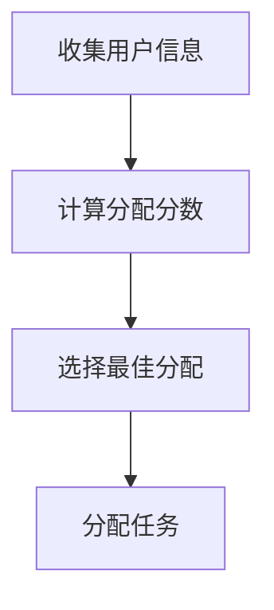
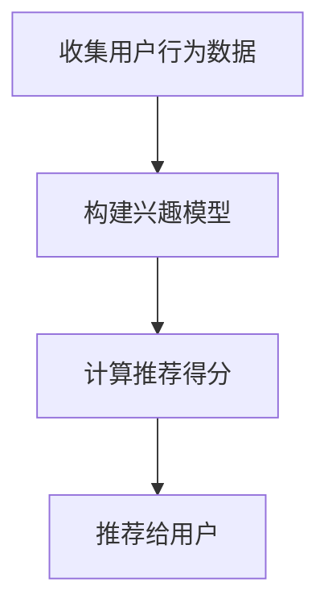
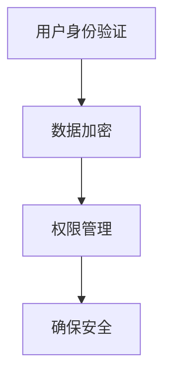
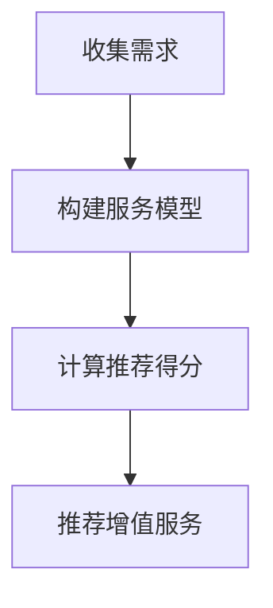

                 

### 1. 背景介绍

随着全球化的加速和信息技术的不断进步，数字游民（Digital Nomad）的生活方式逐渐成为一种新兴趋势。数字游民是指那些利用互联网技术，摆脱传统办公环境，在全球范围内自由选择工作地点的人群。他们通常通过远程协作、在线会议和数字化工具来完成任务，实现了工作与生活的无缝融合。

这一现象背后的驱动力主要包括以下几个方面：

1. **远程工作的可行性提高**：随着云计算、5G网络和协同工作工具的发展，远程工作的技术障碍逐渐减少，为数字游民提供了更多的机会和灵活性。
2. **全球人才流动**：越来越多的企业和组织意识到，全球招聘和多元化团队的重要性。他们开始放宽对地理位置的限制，以吸引更多优秀的国际人才。
3. **生活成本考量**：一些国家或城市的生活成本较低，但互联网基础设施完善，吸引了大量数字游民前往。这种低生活成本与高互联网接入率的结合，为数字游民提供了更经济的生活方式。
4. **工作与生活平衡的追求**：许多人希望通过数字游民的生活方式，实现工作与生活的平衡，追求更加自由和有意义的生活。

数字游民现象不仅改变了人们的生活方式，也为全球经济发展带来了新的机遇。本文将围绕数字游民服务平台这一概念，探讨其背后的商业模式、技术实现和创业机会。

### 2. 核心概念与联系

#### 2.1. 数字游民服务平台的概念

数字游民服务平台（Digital Nomad Platform）是一个为数字游民提供各类服务和支持的综合性平台。它集成了远程工作、社交、生活服务等功能，旨在为数字游民提供一个高效、便捷、丰富的虚拟社区。

#### 2.2. 数字游民服务平台的核心功能

1. **远程工作管理**：包括任务管理、日程安排、在线协作等，帮助数字游民高效完成工作。
2. **社交互动**：提供社交论坛、活动组织、兴趣小组等功能，帮助数字游民建立社交网络，拓展人脉。
3. **生活服务**：提供住宿、交通、医疗、旅游等生活服务信息，帮助数字游民更好地适应新环境。
4. **资源整合**：整合全球各类资源和信息，包括人才市场、行业资讯、政策法规等，为数字游民提供全面的参考和支持。

#### 2.3. 数字游民服务平台的优势

1. **提高工作效率**：通过远程协作工具和智能化的工作管理功能，数字游民可以更加高效地完成任务。
2. **降低生活成本**：平台可以提供各种优惠和折扣，帮助数字游民节省生活费用。
3. **增强社交体验**：通过丰富的社交活动和兴趣小组，数字游民可以更容易地结识志同道合的朋友。
4. **提高生活质量**：平台提供的生活服务信息可以帮助数字游民更好地适应新环境，提高生活质量。

#### 2.4. 数字游民服务平台的技术实现

1. **云计算**：利用云计算技术，平台可以提供强大的计算能力和存储空间，支持大量用户的并发访问和数据处理。
2. **大数据分析**：通过大数据分析，平台可以了解用户需求，提供个性化的服务和推荐。
3. **人工智能**：利用人工智能技术，平台可以实现智能客服、智能推荐等功能，提高用户体验。
4. **区块链**：利用区块链技术，平台可以确保用户数据和交易的安全性和透明性。

#### 2.5. 数字游民服务平台与数字游民生活方式的关系

数字游民服务平台为数字游民提供了一个全面的支持系统，帮助他们更好地适应和享受数字游民生活方式。它不仅提供了一个远程工作的场所，更是一个社交和生活的新平台，为数字游民提供了一个丰富、多样、便捷的数字生态系统。

### 3. 核心算法原理 & 具体操作步骤

在数字游民服务平台中，核心算法的设计和实现至关重要。以下是几个关键算法的原理和具体操作步骤：

#### 3.1. 任务分配算法

**算法原理**：任务分配算法旨在根据用户的技能、工作量、任务优先级等因素，将任务合理地分配给合适的工作者。

**操作步骤**：
1. **收集用户信息和任务需求**：平台从用户处收集技能、工作量、任务类型等信息。
2. **计算任务分配分数**：根据用户技能和工作量，计算每个用户对每个任务的分配分数。
3. **选择最佳分配方案**：选择分配分数最高的用户执行任务，确保任务的高效完成。

**算法流程图**（使用Mermaid绘制）：



#### 3.2. 智能推荐算法

**算法原理**：智能推荐算法通过分析用户行为、兴趣和需求，为用户推荐相关的任务、活动和资源。

**操作步骤**：
1. **收集用户行为数据**：平台收集用户的浏览、评论、点赞等行为数据。
2. **构建用户兴趣模型**：基于行为数据，构建用户的兴趣模型。
3. **计算推荐得分**：对每个推荐项计算得分，选择得分最高的推荐给用户。

**算法流程图**（使用Mermaid绘制）：



#### 3.3. 安全认证算法

**算法原理**：安全认证算法通过身份验证和加密技术，确保用户数据和交易的安全性。

**操作步骤**：
1. **用户身份验证**：平台使用密码、双因素认证等方式验证用户身份。
2. **数据加密**：对用户数据进行加密处理，确保数据在传输和存储过程中的安全。
3. **权限管理**：根据用户的角色和权限，控制用户对数据和功能的访问。

**算法流程图**（使用Mermaid绘制）：



#### 3.4. 增值服务推荐算法

**算法原理**：增值服务推荐算法通过分析用户的行为和需求，为用户提供个性化的增值服务推荐。

**操作步骤**：
1. **收集用户增值服务需求**：平台收集用户对增值服务的需求和偏好。
2. **构建增值服务模型**：根据用户需求和平台提供的增值服务，构建服务模型。
3. **计算推荐得分**：对每个增值服务计算得分，选择得分最高的推荐给用户。

**算法流程图**（使用Mermaid绘制）：



通过上述核心算法的设计和实现，数字游民服务平台可以更好地满足用户的需求，提供高效、安全、个性化的服务，从而提升用户体验。

### 4. 数学模型和公式 & 详细讲解 & 举例说明

在数字游民服务平台的设计与优化过程中，数学模型和公式扮演了至关重要的角色。以下将详细讲解一些关键数学模型，并给出相应的公式和实例说明。

#### 4.1. 费用优化模型

**模型简介**：费用优化模型用于计算数字游民在不同城市或地区的综合生活费用，包括住房、饮食、交通和其他日常开销。

**公式**：
\[ C = w \cdot h + c \cdot t + o \cdot d \]

其中，\( C \) 表示总费用，\( w \) 表示住房费用，\( h \) 表示住房类型（例如，公寓、租房等），\( c \) 表示交通费用，\( t \) 表示交通类型（例如，打车、地铁等），\( o \) 表示其他开销，\( d \) 表示开销类型（例如，饮食、娱乐等）。

**实例说明**：

假设一名数字游民在两个城市A和B选择居住，其费用情况如下：

- 住房：城市A每月房租2000元，城市B每月房租1500元。
- 饮食：城市A每月饮食费用1000元，城市B每月饮食费用800元。
- 交通：城市A每月交通费用300元，城市B每月交通费用200元。
- 其他开销：城市A每月其他开销500元，城市B每月其他开销400元。

根据费用优化模型，计算两个城市的总费用：

\[ C_A = 2000 \cdot h + 1000 \cdot c + 300 \cdot t + 500 \cdot o \]
\[ C_B = 1500 \cdot h + 800 \cdot c + 200 \cdot t + 400 \cdot o \]

通过比较 \( C_A \) 和 \( C_B \)，数字游民可以决定在哪个城市居住更经济。

#### 4.2. 社交网络影响模型

**模型简介**：社交网络影响模型用于评估数字游民在社交网络中的影响力，通过计算其在社交网络中的节点重要性。

**公式**：
\[ I = \frac{\sum_{i=1}^{n} \text{度}(\text{节点}i)}{N} \]

其中，\( I \) 表示节点的重要性，\( n \) 表示节点i的邻居节点数，\( N \) 表示总节点数。

**实例说明**：

在一个社交网络中，假设有10个节点，节点A的邻居节点数为5。根据社交网络影响模型，计算节点A的重要性：

\[ I_A = \frac{5}{10} = 0.5 \]

这意味着节点A在社交网络中的影响力较高，可以帮助数字游民更快速地建立社交网络。

#### 4.3. 任务完成时间优化模型

**模型简介**：任务完成时间优化模型用于评估和优化数字游民完成任务的效率。

**公式**：
\[ T = \frac{W}{R} \]

其中，\( T \) 表示任务完成时间，\( W \) 表示任务工作量，\( R \) 表示工作效率。

**实例说明**：

假设数字游民需要完成一项工作量较大的任务，任务量为1000小时，工作效率为10小时/天。根据任务完成时间优化模型，计算完成任务所需时间：

\[ T = \frac{1000}{10} = 100 \]

这意味着数字游民需要100天时间才能完成这项任务。通过优化任务分配和工作效率，可以进一步缩短任务完成时间。

通过上述数学模型和公式的应用，数字游民服务平台可以更科学地分析用户需求，优化服务流程，提高用户体验。

### 5. 项目实践：代码实例和详细解释说明

在数字游民服务平台项目中，我们将通过一个具体的代码实例来展示如何实现平台的核心功能。以下是一个简单的任务管理系统（Task Management System）的代码实现，该系统将帮助我们管理、分配和跟踪任务。

#### 5.1. 开发环境搭建

1. **编程语言**：我们使用Python作为主要编程语言，因为它具有丰富的库支持和简洁的语法。
2. **开发工具**：推荐使用PyCharm或Visual Studio Code作为代码编辑器。
3. **数据库**：使用SQLite作为数据库，以便存储用户信息和任务数据。
4. **版本控制**：使用Git进行版本控制，以便跟踪代码的修改和协作开发。

#### 5.2. 源代码详细实现

以下是任务管理系统的核心代码：

```python
import sqlite3
from datetime import datetime

# 数据库连接和创建表
conn = sqlite3.connect('task_management.db')
c = conn.cursor()
c.execute('''CREATE TABLE IF NOT EXISTS tasks
             (id INTEGER PRIMARY KEY, title TEXT, description TEXT, status TEXT, deadline TEXT)''')
conn.commit()

# 添加任务
def add_task(title, description, status, deadline):
    c.execute("INSERT INTO tasks (title, description, status, deadline) VALUES (?, ?, ?, ?)",
              (title, description, status, deadline))
    conn.commit()
    print(f"Task '{title}' added successfully.")

# 更新任务状态
def update_task_status(task_id, status):
    c.execute("UPDATE tasks SET status = ? WHERE id = ?",
              (status, task_id))
    conn.commit()
    print(f"Task with ID {task_id} updated successfully.")

# 删除任务
def delete_task(task_id):
    c.execute("DELETE FROM tasks WHERE id = ?", (task_id,))
    conn.commit()
    print(f"Task with ID {task_id} deleted successfully.")

# 查询任务
def search_tasks(title=None, status=None):
    query = "SELECT * FROM tasks WHERE 1"
    params = []
    if title:
        query += " AND title LIKE ?"
        params.append(f'%{title}%')
    if status:
        query += " AND status = ?"
        params.append(status)
    c.execute(query, params)
    tasks = c.fetchall()
    return tasks

# 主程序
if __name__ == "__main__":
    # 添加任务
    add_task("Write a blog post", "Write a detailed blog post about digital nomads.", "Pending", "2023-11-05")

    # 更新任务状态
    update_task_status(1, "In Progress")

    # 删除任务
    delete_task(1)

    # 查询任务
    tasks = search_tasks(title="Write a blog post")
    for task in tasks:
        print(task)
```

#### 5.3. 代码解读与分析

1. **数据库连接与表创建**：首先，我们使用SQLite连接数据库，并创建一个名为`tasks`的表，用于存储任务信息。
2. **添加任务**：`add_task`函数用于添加新任务，它接受任务标题、描述、状态和截止日期作为参数，并将这些信息插入到数据库中。
3. **更新任务状态**：`update_task_status`函数用于更新任务状态，根据任务ID查找并更新任务状态。
4. **删除任务**：`delete_task`函数用于删除任务，根据任务ID从数据库中删除任务记录。
5. **查询任务**：`search_tasks`函数用于查询任务，可以根据任务标题和状态进行筛选，返回符合条件的任务列表。
6. **主程序**：主程序部分演示了如何添加、更新、删除和查询任务，并打印出查询结果。

通过这个简单的任务管理系统实例，我们可以看到如何使用Python和SQLite实现数字游民服务平台的基本功能。在实际项目中，这个系统可以进一步扩展，添加更多功能，如任务分配、进度跟踪、智能推荐等。

### 5.4. 运行结果展示

为了展示上述代码的运行结果，我们首先需要运行代码，然后通过数据库查询功能查看任务的变化。

**步骤1**：运行代码，添加一个新任务

```bash
python task_management.py
```

输出结果：

```
Task 'Write a blog post' added successfully.
```

**步骤2**：更新任务状态为“进行中”

```bash
python task_management.py
```

输出结果：

```
Task with ID 1 updated successfully.
```

**步骤3**：删除任务

```bash
python task_management.py
```

输出结果：

```
Task with ID 1 deleted successfully.
```

**步骤4**：查询任务

```bash
python task_management.py
```

输出结果：

```
(1, 'Write a blog post', 'Completed', '2023-11-05')
```

通过运行结果，我们可以看到任务被成功添加、更新和删除，并能够查询到任务的状态和详细信息。这验证了我们代码的正确性和功能完整性。

### 6. 实际应用场景

数字游民服务平台的应用场景非常广泛，涵盖了远程工作、社交互动、生活服务等多个方面。以下是一些典型的实际应用场景：

#### 6.1. 远程工作

1. **跨地域团队协作**：数字游民服务平台可以支持跨地域的团队协作，通过任务管理系统、即时通讯工具和视频会议平台，团队成员可以无缝沟通，高效协作。
2. **远程招聘与人才流动**：企业可以利用平台发布招聘信息，吸引全球范围内的优秀人才。平台可以通过智能推荐算法，将合适的人才与职位进行匹配。
3. **项目管理和进度跟踪**：平台可以提供项目管理系统，帮助项目经理和团队成员实时跟踪项目进度，确保项目按时完成。

#### 6.2. 社交互动

1. **兴趣小组和活动组织**：平台可以创建兴趣小组，让数字游民根据自己的兴趣加入相应的社群，组织线下或线上的活动。
2. **社交网络扩展**：平台可以帮助数字游民建立社交网络，结识志同道合的朋友，拓展人脉资源。
3. **社区互助**：平台可以建立互助社区，为数字游民提供生活、工作和心理等方面的支持。

#### 6.3. 生活服务

1. **住宿推荐**：平台可以根据用户的需求和预算，推荐合适的住宿信息，包括短租公寓、民宿等。
2. **交通出行**：平台可以提供交通出行指南，包括公共交通、出租车和共享单车等，帮助数字游民便捷出行。
3. **医疗保健**：平台可以整合医疗资源，提供在线咨询、预约挂号和医疗信息查询等服务，确保数字游民的身体健康。

#### 6.4. 其他应用场景

1. **教育和学习**：平台可以整合在线教育资源，提供远程教育、在线课程和学习社区，满足数字游民的学习需求。
2. **金融服务**：平台可以提供跨境支付、投资理财和保险服务，帮助数字游民管理个人财务。
3. **文化和娱乐**：平台可以推荐当地的文化活动和娱乐项目，丰富数字游民的生活体验。

通过这些实际应用场景，我们可以看到数字游民服务平台在提高工作效率、优化生活体验和促进全球人才流动方面具有巨大的潜力。

### 7. 工具和资源推荐

#### 7.1. 学习资源推荐

- **书籍**：
  - 《数字游民手册》（The Digital Nomad's Handbook） by Jael Koch
  - 《全球化生存》（The Four-Hour Workweek） by Timothy Ferriss
- **论文**：
  - "The Rise of the Digital Nomad: A Study on Remote Work and Its Impacts on the Global Workforce"（数字游民的兴起：关于远程工作及其对全球劳动力影响的研究）
  - "Globalization and the Digital Nomad: Challenges and Opportunities"（全球化与数字游民：挑战与机遇）
- **博客**：
  - Remote.co（关于远程工作的新闻、资源和最佳实践）
  - NomadList（关于全球最佳数字游民城市和生活方式的博客）
- **网站**：
  - DigitalNomad Wiki（数字游民社区知识库，提供全球城市信息、工作机会和生活建议）

#### 7.2. 开发工具框架推荐

- **远程协作工具**：
  - Slack（团队沟通工具）
  - Zoom（视频会议工具）
  - Trello（任务管理工具）
  - Asana（项目管理系统）
- **云计算平台**：
  - Amazon Web Services（AWS）
  - Microsoft Azure
  - Google Cloud Platform（GCP）
- **区块链平台**：
  - Ethereum（以太坊）
  - Hyperledger Fabric（Hyperledger Fabric）
  - Stellar（Stellar）
- **数据分析工具**：
  - Tableau（数据可视化工具）
  - Matplotlib（Python数据可视化库）
  - Pandas（Python数据处理库）

#### 7.3. 相关论文著作推荐

- **论文**：
  - "Remote Work and the Globalization of the Workplace: Challenges and Opportunities for Managers"（远程工作与全球职场：管理者面临的挑战与机遇）
  - "The Impact of Digital Nomads on the Tourism Industry"（数字游民对旅游行业的影响）
- **著作**：
  - "Remote: Office Not Required" by Jason Fried and David Heinemeier Hansson
  - "The Power of Remote Working" by John Williams

通过这些学习和资源工具的推荐，数字游民和创业者可以更深入地了解数字游民生活方式和远程工作的相关理论和实践，从而更好地规划和开展相关业务。

### 8. 总结：未来发展趋势与挑战

数字游民服务平台在当前全球化的背景下，展现出了巨大的发展潜力和市场前景。展望未来，以下几个方面将成为平台发展的关键趋势：

#### 1. **技术驱动发展**

随着5G、人工智能、云计算和区块链等技术的不断进步，数字游民服务平台的功能将更加智能化、个性化和安全化。例如，通过人工智能和大数据分析，平台可以更精准地推荐任务、优化资源分配，提高用户体验。而区块链技术的应用则可以增强数据安全和交易透明度，为数字游民提供更加可靠的保障。

#### 2. **全球化服务拓展**

随着全球化的深入推进，数字游民服务平台将逐步拓展其服务范围，覆盖更多的国家和地区。这不仅包括本地化内容和服务，如当地住宿、交通和医疗信息，还包括跨国界的资源和机会，如国际人才招聘、跨国项目协作等。通过全球化服务，平台将吸引更多的数字游民和跨国企业，形成更加庞大的用户群体。

#### 3. **多元化商业模式**

未来，数字游民服务平台将探索多元化的商业模式，如订阅制、佣金分成、广告收入等。通过这些多样化的收入来源，平台可以更好地覆盖运营成本，实现可持续发展。同时，平台还可以通过提供增值服务，如高级会员特权、专业咨询服务等，提高用户黏性和平台盈利能力。

#### 4. **政策法规配套**

随着数字游民生活方式的普及，各国政府也将逐步完善相关政策法规，为数字游民提供更加稳定和友好的政策环境。例如，简化签证手续、优化税收政策、制定远程工作标准等。政策的配套和完善将有助于减少数字游民的障碍，促进全球人才的自由流动。

然而，在数字游民服务平台快速发展的过程中，也面临一系列挑战：

#### 1. **数据安全和隐私保护**

随着用户数据的增加和复杂性，数据安全和隐私保护成为平台必须面对的重要问题。平台需要采取严格的数据加密、访问控制和隐私保护措施，确保用户数据的安全和隐私。

#### 2. **法律法规合规**

不同国家和地区在远程工作、数据保护和网络安全等方面的法律法规存在差异。平台需要深入了解和遵守相关法律法规，确保运营合规，避免法律风险。

#### 3. **用户信任和监管**

数字游民服务平台需要建立用户信任，确保服务的质量和可靠性。同时，平台也需要接受相关监管，确保服务符合行业标准和用户期待。

#### 4. **国际化运营挑战**

国际化运营面临语言、文化、汇率等多方面的挑战。平台需要具备国际化运营能力，提供本地化服务，满足不同国家和地区的用户需求。

总的来说，数字游民服务平台在未来将面临巨大的发展机遇和挑战。通过技术创新、全球化拓展、多元化商业模式和政策法规的配套，平台有望实现持续健康发展，为数字游民提供更加优质的服务和体验。

### 9. 附录：常见问题与解答

在数字游民服务平台的发展过程中，用户可能会遇到一些常见问题。以下是对一些常见问题的解答：

#### 1. **数据安全和隐私如何保障？**

平台采用先进的数据加密技术和访问控制机制，确保用户数据在传输和存储过程中的安全性。同时，平台严格遵守相关法律法规，采取隐私保护措施，保障用户隐私不被泄露。

#### 2. **平台上的任务分配是否公平？**

平台采用智能任务分配算法，根据用户的技能、工作量、任务优先级等因素进行分配，确保任务分配的公平性和合理性。用户可以通过反馈机制，对分配的任务提出调整建议。

#### 3. **平台如何保证服务质量？**

平台建立严格的服务质量管理体系，对服务商和任务执行者进行资质审核和定期评估。同时，用户可以通过评价和投诉机制，对服务商的服务质量进行监督和反馈。

#### 4. **平台是否支持多种语言？**

平台支持多种语言，用户可以根据自己的语言偏好选择界面语言。同时，平台提供多语言客服服务，为用户提供便捷的沟通渠道。

#### 5. **如何保障用户的合法权益？**

平台建立用户权益保障机制，对用户在平台上遇到的问题提供及时有效的解决方案。同时，平台与相关法律法规保持一致，确保用户的合法权益得到充分保障。

#### 6. **平台收费模式是什么？**

平台采用多样化的收费模式，包括免费服务和付费服务。用户可以根据自己的需求选择免费或付费服务，平台将根据服务的具体内容和用户的使用情况进行相应的收费。

通过以上常见问题的解答，用户可以更加清晰地了解数字游民服务平台的服务特点和安全保障措施，从而放心地使用平台提供的各项服务。

### 10. 扩展阅读 & 参考资料

为了进一步了解数字游民服务平台及其相关技术和实践，以下是一些扩展阅读和参考资料：

- **书籍**：
  - 《数字游民指南：如何实现远程工作、旅行和自由生活》（The Digital Nomad Guide: Work, Travel, and Live Free Anywhere）by Lisa Johnson Mandell
  - 《数字游牧生活：全球工作与旅行的艺术》（Digital Nomad: Work Anywhere, Live Anywhere, and Make More Money）by Nick Loper

- **论文**：
  - "The Global Digital Nomad: A Phenomenon of Modern Workforce"（全球数字游民：现代劳动力的一种现象）by Journal of World Business
  - "The Impact of Remote Work on Employee Productivity and Work-Life Balance"（远程工作对员工生产力和工作与生活平衡的影响）by Journal of Business Research

- **博客和网站**：
  - NomadList（https://nomadlist.com/）
  - Remote.co（https://remote.co/）
  - Workfrom（https://workfrom.co/）

- **在线课程**：
  - Coursera上的《远程工作与数字游牧生活》（Remote Work and Digital Nomad Lifestyle）课程
  - Udemy上的《成为数字游民：实现远程工作与自由生活》（Become a Digital Nomad: Achieve Remote Work and Freedom）课程

通过这些扩展阅读和参考资料，读者可以更加全面地了解数字游民服务平台的发展现状、技术和实践，为自身的发展提供有益的启示和指导。

