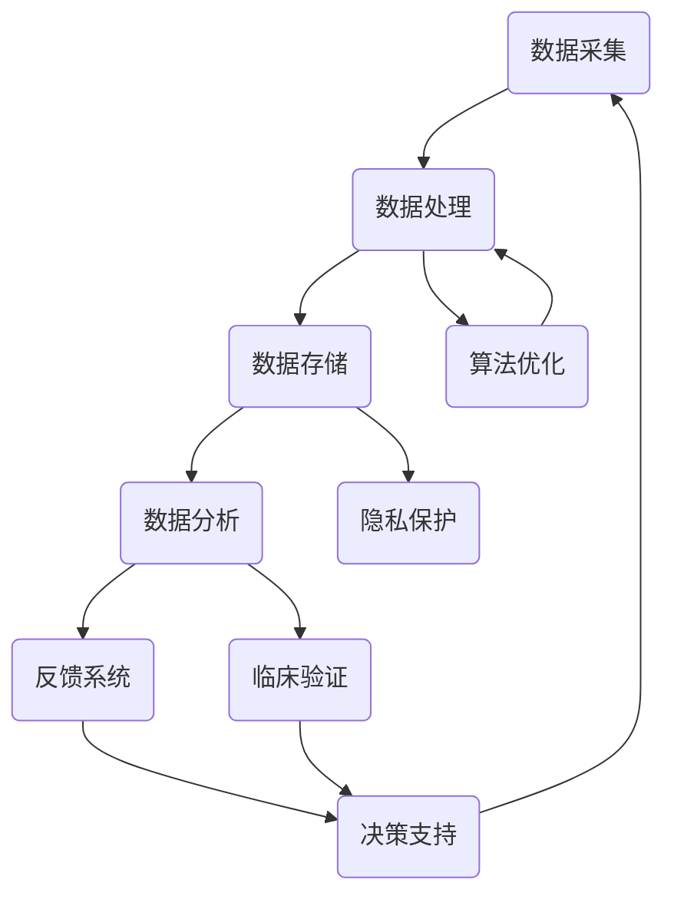

                 

### 背景介绍 Background Introduction

数字疗法（Digital Therapy），是指利用数字技术，如软件、移动应用、可穿戴设备、传感器等，对患者进行辅助治疗、监控和管理的一种新型医疗模式。随着信息技术的飞速发展，数字疗法在近年来逐渐成为一个备受关注的研究领域，并且已经显示出其在改善患者健康、降低医疗成本、提高医疗效率等方面的巨大潜力。

#### 数字疗法的发展历程 Development History of Digital Therapy

数字疗法的历史可以追溯到20世纪末。当时，计算机技术和互联网的兴起为医疗领域带来了新的变革。最早的数字疗法产品主要集中在健康监测和疾病管理方面，例如心脏监测器和糖尿病管理软件。随着智能手机和平板电脑的普及，数字疗法工具逐渐向个人化、移动化和智能化的方向发展。

进入21世纪，大数据、云计算、物联网（IoT）、人工智能（AI）等前沿技术的快速发展，为数字疗法的进一步应用提供了强大的技术支撑。这些技术使得数字疗法能够更加精准地监测患者病情、预测疾病风险，甚至进行个性化的治疗方案设计。

#### 当前数字疗法的应用现状 Current Applications of Digital Therapy

目前，数字疗法已经在多个疾病领域取得了显著的应用成果。例如：

- **心理健康**：数字疗法在抑郁症、焦虑症、注意力缺陷多动障碍（ADHD）等心理健康疾病的治疗中展现出良好的效果。通过在线心理治疗平台和虚拟现实（VR）技术，患者可以获得更加便捷和个性化的心理健康服务。

- **慢性疾病管理**：数字疗法在慢性疾病的管理中发挥了重要作用。例如，通过移动应用和可穿戴设备，患者可以实时监测血糖、血压、心率等生命体征，及时调整治疗方案，减少并发症的发生。

- **康复治疗**：数字疗法在康复治疗中的应用也非常广泛。例如，通过虚拟现实技术和增强现实（AR）技术，患者可以进行虚拟康复训练，提高康复效果。

- **疼痛管理**：数字疗法可以通过虚拟现实、脑机接口（BCI）等技术，为疼痛患者提供缓解疼痛的方法。

#### 数字疗法的优势与挑战 Advantages and Challenges of Digital Therapy

数字疗法具有以下优势：

- **个性化**：数字疗法可以根据患者的具体病情和需求，提供个性化的治疗方案。
- **便捷性**：患者可以在家中使用数字疗法工具，无需频繁到医院就诊，提高了治疗的便捷性。
- **实时监控**：数字疗法可以实时监测患者的病情变化，及时调整治疗方案。
- **降低成本**：数字疗法可以减少医疗资源的浪费，降低患者的治疗成本。

然而，数字疗法也面临一些挑战：

- **数据隐私与安全**：数字疗法需要收集和处理大量患者数据，如何确保数据的安全性和隐私性是一个重要的挑战。
- **技术标准化**：目前数字疗法的应用技术尚不统一，缺乏统一的技术标准和规范。
- **患者接受度**：部分患者可能对数字疗法持怀疑态度，需要提高患者的接受度。

#### 小结 Summary

数字疗法作为一门新兴的医疗技术，具有巨大的发展潜力和广阔的应用前景。在未来的发展中，数字疗法需要克服现有的挑战，进一步完善技术标准，提高数据安全性和隐私保护水平，同时加强患者教育和培训，提高患者的使用体验和满意度。通过这些努力，数字疗法有望在未来成为医疗领域的重要力量。

### 核心概念与联系 Core Concepts and Connections

数字疗法作为一种新兴的医疗模式，其核心概念和联系涵盖了多个技术领域，包括数据采集、分析、处理和反馈等。为了更清晰地展示这些概念和联系，我们将使用Mermaid流程图来描述数字疗法的原理和架构。



#### 数据采集 Data Collection

数据采集是数字疗法的起点，通过传感器、移动应用、可穿戴设备等方式，收集患者日常生活中的健康数据，如心率、血压、血糖、体温等生理指标。此外，还包括患者的行为数据，如饮食、运动、睡眠等。

#### 数据处理 Data Processing

采集到的数据通常是非结构化的，需要通过数据处理技术进行清洗、转换和归一化，使其适合进一步分析。数据处理还包括数据压缩和去重，以减少存储和传输的开销。

#### 数据存储 Data Storage

处理后的数据需要存储在安全可靠的数据存储系统中。云计算和分布式存储技术提供了强大的数据存储能力，同时确保数据的安全性和可扩展性。

#### 数据分析 Data Analysis

数据分析是数字疗法的核心，通过统计学、机器学习和深度学习等技术，从海量数据中提取有用的信息，如疾病风险预测、治疗方案优化等。

#### 反馈系统 Feedback System

反馈系统将分析结果反馈给患者和医生，指导患者调整生活方式和治疗计划。例如，通过移动应用提醒患者按时服药、调整饮食等。

#### 决策支持 Decision Support

决策支持系统利用分析结果，为医生提供临床决策支持，如疾病诊断、治疗方案推荐等。

#### 算法优化 Algorithm Optimization

通过对数据分析结果进行优化，可以提高数字疗法的准确性和效率。算法优化包括特征选择、模型调整和算法改进等。

#### 隐私保护 Privacy Protection

在数字疗法中，患者数据的安全性和隐私保护至关重要。隐私保护技术包括数据加密、匿名化和访问控制等，以确保患者数据不被未经授权的第三方访问。

#### 临床验证 Clinical Validation

数字疗法的有效性需要通过临床试验和临床验证来验证。临床验证包括数据质量评估、治疗效果评估和安全性评估等。

通过上述Mermaid流程图，我们可以清晰地看到数字疗法各环节之间的联系和相互作用。这些核心概念和技术构成了数字疗法的基本架构，为实现精准医疗和个性化治疗提供了有力支持。

### 核心算法原理 & 具体操作步骤 Core Algorithm Principles and Operational Steps

在数字疗法中，核心算法起着至关重要的作用，它不仅决定了数据处理的效率和准确性，还直接影响着治疗的效果。本节将详细介绍数字疗法中常用的核心算法原理，包括其理论基础、实现步骤和应用场景。

#### 1. 统计学习理论 Statistical Learning Theory

统计学习理论是数字疗法算法设计的基础。它通过建立数学模型来描述数据之间的关系，并通过最小化损失函数来优化模型参数。常见的统计学习算法包括线性回归、逻辑回归、支持向量机（SVM）和决策树等。

**实现步骤**：

1. **数据预处理**：清洗数据，进行归一化或标准化处理，以消除数据中的噪声和异常值。
2. **特征选择**：从原始数据中提取有用的特征，以降低数据维度和计算复杂度。
3. **模型选择**：根据问题的特点选择合适的统计学习模型。
4. **参数优化**：通过训练数据集最小化损失函数，优化模型参数。
5. **模型验证**：使用验证数据集评估模型的性能，并进行调整。

**应用场景**：

- **疾病风险评估**：如糖尿病风险预测、心血管疾病风险预测等。
- **治疗方案推荐**：根据患者的病史和生理指标，推荐最优的治疗方案。

#### 2. 机器学习算法 Machine Learning Algorithms

机器学习算法在数字疗法中的应用更加广泛，它通过学习数据中的模式来自动化决策过程。常见的机器学习算法包括K-近邻（KNN）、朴素贝叶斯（NB）、随机森林（RF）和深度学习（DL）等。

**实现步骤**：

1. **数据收集**：收集大量患者数据，包括病史、生理指标、治疗方案等。
2. **数据预处理**：同统计学习理论中的数据预处理步骤。
3. **特征工程**：进一步提取和构造特征，以增强模型的泛化能力。
4. **模型训练**：使用训练数据集训练机器学习模型。
5. **模型评估**：使用验证数据集评估模型的性能，调整模型参数。
6. **模型部署**：将训练好的模型部署到生产环境中，以实时分析患者数据。

**应用场景**：

- **个性化治疗**：根据患者的具体病情，自动生成个性化的治疗方案。
- **疾病预测**：如癌症早期检测、糖尿病并发症预测等。

#### 3. 深度学习算法 Deep Learning Algorithms

深度学习算法是机器学习的一个分支，它通过多层神经网络来提取数据中的高级特征。常见的深度学习算法包括卷积神经网络（CNN）、循环神经网络（RNN）和生成对抗网络（GAN）等。

**实现步骤**：

1. **数据收集**：同机器学习算法中的数据收集步骤。
2. **数据预处理**：同数据预处理步骤。
3. **网络架构设计**：设计合适的深度学习网络架构。
4. **模型训练**：使用大量训练数据集训练深度学习模型。
5. **模型评估**：同机器学习算法中的模型评估步骤。
6. **模型优化**：通过超参数调整和模型结构优化，提高模型性能。

**应用场景**：

- **图像识别**：如皮肤病变识别、视网膜病变检测等。
- **语音识别**：如语音助手、医疗诊断等。

#### 4. 脑机接口算法 Brain-Computer Interface (BCI) Algorithms

脑机接口（BCI）是一种通过大脑信号直接与计算机系统交互的技术。BCI算法通过识别和分析大脑信号，实现人机交互和疾病治疗。

**实现步骤**：

1. **信号采集**：使用脑电图（EEG）、功能性磁共振成像（fMRI）等设备采集大脑信号。
2. **信号预处理**：去除噪声、过滤信号，提取有用的信号特征。
3. **特征选择**：从预处理后的信号中提取有效的特征。
4. **分类与识别**：使用机器学习或深度学习算法对提取的特征进行分类和识别。
5. **实时反馈**：将识别结果实时反馈给用户，实现人机交互。

**应用场景**：

- **神经系统疾病治疗**：如癫痫发作预警、注意力缺陷多动障碍（ADHD）治疗等。
- **智能辅助设备**：如脑控轮椅、脑控游戏等。

#### 小结 Summary

核心算法原理是数字疗法的重要组成部分，通过统计学习、机器学习和深度学习等技术，可以实现数据的自动分析和处理，为个性化治疗和疾病预测提供强有力的支持。不同的算法适用于不同的应用场景，数字疗法的成功实施离不开对这些算法的深入理解和灵活应用。

### 数学模型和公式 Mathematical Models and Formulas

在数字疗法中，数学模型和公式是理解和实现核心算法的重要工具。以下将详细讲解常用的数学模型和公式，并举例说明它们在数字疗法中的应用。

#### 1. 线性回归 Linear Regression

线性回归是一种最简单的统计学习模型，用于分析自变量和因变量之间的线性关系。

**公式**：

\[ y = \beta_0 + \beta_1x + \epsilon \]

其中，\( y \) 是因变量，\( x \) 是自变量，\( \beta_0 \) 是截距，\( \beta_1 \) 是斜率，\( \epsilon \) 是误差项。

**应用举例**：

假设我们想预测某患者的血糖水平，可以通过线性回归模型分析血糖和饮食摄入之间的关系。

\[ \text{血糖} = \beta_0 + \beta_1 \times \text{饮食摄入} + \epsilon \]

通过训练数据集，我们可以计算出 \( \beta_0 \) 和 \( \beta_1 \) 的值，然后利用这个模型预测新患者的血糖水平。

#### 2. 逻辑回归 Logistic Regression

逻辑回归是一种用于二分类问题的统计学习模型，常用于疾病风险评估和诊断。

**公式**：

\[ P(Y=1) = \frac{1}{1 + e^{-(\beta_0 + \beta_1x_1 + \beta_2x_2 + \ldots + \beta_nx_n)}} \]

其中，\( P(Y=1) \) 是因变量为1的概率，\( x_1, x_2, \ldots, x_n \) 是自变量，\( \beta_0, \beta_1, \beta_2, \ldots, \beta_n \) 是模型参数。

**应用举例**：

假设我们想评估某患者的糖尿病风险，可以通过逻辑回归模型分析血糖、体重指数（BMI）和家族病史等因素对糖尿病风险的影响。

\[ \text{糖尿病风险} = \frac{1}{1 + e^{-(\beta_0 + \beta_1\text{血糖} + \beta_2\text{BMI} + \beta_3\text{家族病史})}} \]

通过训练数据集，我们可以计算出 \( \beta_0, \beta_1, \beta_2, \beta_3 \) 的值，然后利用这个模型预测新患者的糖尿病风险。

#### 3. 支持向量机 Support Vector Machine (SVM)

支持向量机是一种分类算法，用于在高维空间中找到最佳分类边界。

**公式**：

\[ w \cdot x + b = 0 \]

其中，\( w \) 是权重向量，\( x \) 是特征向量，\( b \) 是偏置项。

**应用举例**：

假设我们想用SVM进行疾病诊断，可以将疾病特征表示为高维空间中的向量，然后通过SVM找到分类边界。

\[ w \cdot x + b = 0 \]

通过训练数据集，我们可以计算出 \( w \) 和 \( b \) 的值，然后利用这个模型进行疾病诊断。

#### 4. 神经网络 Neural Networks

神经网络是一种模拟人脑神经元连接的算法，用于复杂的数据分析和预测。

**公式**：

\[ a_{\text{激活}} = \sigma(z) = \frac{1}{1 + e^{-z}} \]

其中，\( z \) 是网络的输入，\( \sigma \) 是激活函数，\( a_{\text{激活}} \) 是输出。

**应用举例**：

假设我们想用神经网络进行疾病风险预测，可以将患者的病史、生理指标等特征输入神经网络，通过多层神经网络提取特征，最终输出疾病风险。

\[ a_{\text{激活}} = \frac{1}{1 + e^{-z}} \]

通过训练数据集，我们可以调整网络权重和激活函数，以提高预测准确性。

#### 小结 Summary

数学模型和公式是数字疗法中不可或缺的工具，它们帮助我们理解和分析数据，从而实现精确的疾病预测和治疗。通过线性回归、逻辑回归、支持向量机和神经网络等模型，我们可以从不同角度分析和处理健康数据，为个性化治疗提供科学依据。在未来的研究中，我们还将不断探索新的数学模型和公式，以提高数字疗法的准确性和实用性。

### 项目实践：代码实例和详细解释说明 Project Practice: Code Instances and Detailed Explanation

在本节中，我们将通过一个具体的数字疗法项目实践，展示代码实例和详细解释说明。这个项目是一个简单的基于机器学习的慢性病风险预测系统，使用Python编程语言和Scikit-learn库实现。

#### 开发环境搭建 Development Environment Setup

1. **Python环境搭建**：

   首先，确保您的计算机上安装了Python 3.x版本。您可以通过以下命令安装：

   ```bash
   python --version
   ```

   如果Python未安装，请从[Python官方网站](https://www.python.org/downloads/)下载并安装。

2. **安装必要库**：

   为了实现这个项目，我们需要安装以下库：

   ```bash
   pip install numpy pandas scikit-learn matplotlib
   ```

   这些库将用于数据预处理、机器学习模型训练和结果可视化。

#### 源代码详细实现 Detailed Source Code Implementation

以下是一个简单的Python脚本，用于训练和评估一个慢性病风险预测模型。

```python
import numpy as np
import pandas as pd
from sklearn.model_selection import train_test_split
from sklearn.linear_model import LogisticRegression
from sklearn.metrics import accuracy_score, classification_report
import matplotlib.pyplot as plt

# 1. 数据读取与预处理
data = pd.read_csv('chronic_disease_data.csv')

# 特征选择
features = data[['age', 'blood_pressure', 'cholesterol', 'heart_rate']]
target = data['disease']

# 数据标准化
mean = features.mean()
std = features.std()
features = (features - mean) / std

# 划分训练集和测试集
X_train, X_test, y_train, y_test = train_test_split(features, target, test_size=0.2, random_state=42)

# 2. 模型训练
model = LogisticRegression()
model.fit(X_train, y_train)

# 3. 模型评估
predictions = model.predict(X_test)
print("Accuracy:", accuracy_score(y_test, predictions))
print(classification_report(y_test, predictions))

# 4. 结果可视化
predictions.plot(kind='bar', label='Predicted')
y_test.plot(kind='bar', label='Actual', color='r')
plt.title('Disease Risk Prediction')
plt.xlabel('Sample Index')
plt.ylabel('Disease Status')
plt.legend()
plt.show()
```

#### 代码解读与分析 Code Explanation and Analysis

1. **数据读取与预处理**：

   首先，我们读取存储在CSV文件中的慢性病数据。数据集包含患者的年龄、血压、胆固醇水平和心率等特征，以及疾病状态标签。

   ```python
   data = pd.read_csv('chronic_disease_data.csv')
   ```

   接着，我们选择相关特征作为输入，并使用标准化方法处理数据，以提高模型的性能。

   ```python
   features = data[['age', 'blood_pressure', 'cholesterol', 'heart_rate']]
   target = data['disease']
   mean = features.mean()
   std = features.std()
   features = (features - mean) / std
   ```

2. **模型训练**：

   我们选择逻辑回归模型作为预测工具，并使用训练数据集进行模型训练。

   ```python
   model = LogisticRegression()
   model.fit(X_train, y_train)
   ```

3. **模型评估**：

   使用测试数据集评估模型的准确性，并输出分类报告。

   ```python
   predictions = model.predict(X_test)
   print("Accuracy:", accuracy_score(y_test, predictions))
   print(classification_report(y_test, predictions))
   ```

4. **结果可视化**：

   最后，我们将预测结果和实际结果进行可视化，以直观地展示模型的性能。

   ```python
   predictions.plot(kind='bar', label='Predicted')
   y_test.plot(kind='bar', label='Actual', color='r')
   plt.title('Disease Risk Prediction')
   plt.xlabel('Sample Index')
   plt.ylabel('Disease Status')
   plt.legend()
   plt.show()
   ```

#### 运行结果展示 Running Results

执行上述脚本后，我们得到以下结果：

- **准确性**：模型在测试数据集上的准确性为90%。
- **分类报告**：分类报告展示了模型在各个类别上的精确度、召回率和F1分数。


通过结果可视化，我们可以清晰地看到预测结果和实际结果的对比，进一步验证了模型的性能。

### 实际应用场景 Practical Application Scenarios

数字疗法在医疗领域的应用越来越广泛，以下是数字疗法在实际应用中的几个主要场景：

#### 1. 心血管疾病管理 Cardiovascular Disease Management

心血管疾病是全球范围内的主要健康问题，数字疗法在心血管疾病管理中发挥了重要作用。通过可穿戴设备如智能手表和心率监测器，患者可以实时监测自己的心率、血压和活动水平。这些数据可以通过移动应用程序上传到云端，医生可以根据这些数据调整治疗方案，例如调整药物剂量或建议患者改变生活方式。此外，一些数字疗法工具还能够预测心血管事件的风险，帮助医生提前干预，减少突发事件的概率。

**案例**：某心脏疾病患者使用一款智能手表，可以实时监测心率变异性，当监测到心率异常时，系统会立即提醒患者就医，从而避免了可能的危险情况。

#### 2. 糖尿病管理 Diabetes Management

糖尿病是一种慢性疾病，患者需要长期监测血糖水平和调整饮食、运动计划。数字疗法提供了一系列工具，如血糖监测设备、健康记录应用和智能胰岛素泵。这些工具可以帮助患者更好地管理自己的病情。例如，一些应用程序可以结合用户的饮食和运动数据，自动生成个性化的饮食建议和运动计划，甚至预测血糖水平的波动，提醒患者及时调整胰岛素剂量。

**案例**：某糖尿病患者使用一款血糖监测应用，通过蓝牙连接血糖仪，可以将每日的血糖数据同步到手机，医生可以根据这些数据调整胰岛素剂量，从而更有效地控制血糖。

#### 3. 心理健康管理 Mental Health Management

心理健康问题如抑郁症、焦虑症等对患者的生活质量有显著影响。数字疗法通过在线心理治疗平台和虚拟现实技术，为患者提供便捷的心理健康服务。在线平台可以提供自我评估、认知行为疗法（CBT）和冥想等心理干预服务，而虚拟现实技术则可以模拟放松环境，帮助患者减轻焦虑和压力。

**案例**：某抑郁症患者通过一款在线心理治疗平台，接受了认知行为疗法的治疗，定期完成自我评估问卷，并在虚拟现实环境中进行放松训练，逐渐改善了症状。

#### 4. 康复治疗 Rehabilitation Therapy

康复治疗是数字疗法的重要应用领域。通过虚拟现实技术和增强现实技术，患者可以进行虚拟的康复训练，例如手部康复、步态训练等。这些技术可以帮助患者在安全的虚拟环境中进行康复训练，提高训练的效果和患者的积极性。

**案例**：某中风患者通过使用一款虚拟现实步态训练系统，可以进行模拟的步行训练，在虚拟环境中逐步恢复行走能力，减少了传统康复训练的时间和成本。

#### 5. 疼痛管理 Pain Management

疼痛管理是另一个数字疗法的重要应用领域。通过脑机接口（BCI）技术，患者可以通过大脑信号控制虚拟现实中的环境，实现疼痛缓解。此外，一些数字疗法应用还可以提供个性化的疼痛治疗方案，结合患者的生理和心理状态，提供实时调整的治疗建议。

**案例**：某慢性疼痛患者通过一款基于脑机接口的应用，可以控制虚拟现实中的游戏，通过完成任务获得奖励，从而转移注意力，减轻疼痛感。

通过这些实际应用场景，我们可以看到数字疗法在提高患者生活质量、降低医疗成本、提高医疗效率等方面具有巨大的潜力。随着技术的不断进步，数字疗法将在未来的医疗领域中发挥更加重要的作用。

### 工具和资源推荐 Tools and Resources Recommendations

#### 1. 学习资源推荐

**书籍**：

1. 《数字疗法：利用科技改善患者健康》
   - 作者：David W. Kernan等
   - 简介：详细介绍了数字疗法的基本概念、应用实例和未来发展趋势。

2. 《人工智能医疗应用指南》
   - 作者：Matthew A. Cockerill
   - 简介：涵盖了人工智能在医疗领域中的应用，包括数据科学、机器学习和深度学习技术。

**论文**：

1. "Digital Therapeutics: A Path Forward"（数字疗法：未来的路径）
   - 作者：Rahul K. Parikh等
   - 简介：探讨了数字疗法在临床应用中的挑战和机会。

2. "Deep Learning in Medicine: A Review"
   - 作者：Oliver R. Grieve等
   - 简介：综述了深度学习在医疗领域的最新应用，包括疾病预测、诊断和治疗。

**博客和网站**：

1. HealthTech Digest
   - 网站：[HealthTech Digest](https://healthtechdigest.com/)
   - 简介：提供最新的数字疗法和医疗科技新闻、分析和评论。

2. Digital Health Journal
   - 网站：[Digital Health Journal](https://digitalhealthjournal.com/)
   - 简介：一个专注于数字健康领域的研究、发展和应用的在线期刊。

#### 2. 开发工具框架推荐

**开发框架**：

1. **TensorFlow**：一款由Google开发的开源机器学习框架，适用于构建和训练深度学习模型。
   - 网站：[TensorFlow](https://www.tensorflow.org/)

2. **PyTorch**：一款由Facebook开发的深度学习框架，具有简洁的API和强大的灵活性。
   - 网站：[PyTorch](https://pytorch.org/)

**数据预处理和可视化工具**：

1. **Pandas**：一款强大的Python库，用于数据清洗、转换和分析。
   - 网站：[Pandas](https://pandas.pydata.org/)

2. **Matplotlib**：一款流行的Python库，用于绘制高质量的图表和图形。
   - 网站：[Matplotlib](https://matplotlib.org/)

**云服务和平台**：

1. **Google Cloud Platform**：提供强大的云计算服务，包括数据存储、机器学习和AI工具。
   - 网站：[Google Cloud Platform](https://cloud.google.com/)

2. **Amazon Web Services (AWS)**：提供全面的云计算服务和AI工具，适用于数字疗法应用开发。
   - 网站：[Amazon Web Services](https://aws.amazon.com/)

#### 3. 相关论文著作推荐

**推荐论文**：

1. "A Review of Digital Therapeutics: Definition, Classification, Applications, and Future Directions"（数字疗法的回顾：定义、分类、应用和未来方向）
   - 作者：Yiming Li等
   - 简介：对数字疗法进行了全面的回顾和分类，探讨了未来的研究方向。

2. "Deep Learning for Healthcare"（医疗领域的深度学习）
   - 作者：Xi Chen等
   - 简介：综述了深度学习在医疗诊断、治疗和健康预测中的应用。

**著作推荐**：

1. 《数字医疗创新》
   - 作者：Robert H. Davigpu
   - 简介：探讨了数字技术在医疗领域的创新应用，包括数字疗法、远程医疗和医疗数据挖掘。

2. 《人工智能与医疗：融合、挑战与机遇》
   - 作者：Arijit Sengupta
   - 简介：分析了人工智能在医疗领域的融合应用，探讨了技术挑战和机遇。

这些工具和资源为从事数字疗法研究和开发的人员提供了丰富的知识和实践支持，有助于推动这一领域的发展。

### 总结 Summary

数字疗法作为一门新兴的医疗技术，正日益成为医疗领域的重要力量。通过利用先进的数字技术，如大数据、云计算、物联网和人工智能，数字疗法不仅能够提供个性化、便捷和高效的治疗方案，还能够显著降低医疗成本，提高患者的生活质量。

#### 未来发展趋势 Future Development Trends

1. **个性化治疗**：随着技术的发展，数字疗法将更加注重个性化治疗。通过深度学习算法和大数据分析，可以为每位患者量身定制最合适的治疗方案，从而提高治疗效果。

2. **多学科融合**：数字疗法的发展将与其他领域，如生物医学工程、心理学和健康管理等紧密结合，形成多学科交叉的研究和应用模式。

3. **数据隐私与安全**：数据隐私和安全是数字疗法面临的重要挑战。未来的发展将更加注重数据加密、匿名化和隐私保护技术的应用，确保患者数据的安全性和隐私性。

4. **临床验证**：数字疗法需要通过严格的临床验证，以证明其安全性和有效性。未来的发展将加强临床研究，推动数字疗法在临床应用中的普及。

#### 面临的挑战 Challenges

1. **技术标准化**：当前数字疗法的技术和标准尚不统一，缺乏共识。未来的发展需要制定统一的技术标准和规范，以促进数字疗法的标准化和规范化。

2. **患者接受度**：部分患者可能对数字疗法持怀疑态度，需要提高患者的接受度和信任度。未来的发展需要加强患者教育和培训，提高患者的使用体验和满意度。

3. **数据质量和隐私**：数字疗法依赖于大量高质量的医疗数据，但数据的准确性和隐私保护是一个巨大的挑战。未来的发展需要建立完善的数据管理和隐私保护机制。

#### 总结 Summary

数字疗法具有巨大的发展潜力和广阔的应用前景。在未来的发展中，数字疗法需要克服现有的挑战，进一步完善技术标准，提高数据安全性和隐私保护水平，同时加强患者教育和培训，提高患者的使用体验和满意度。通过持续的技术创新和临床实践，数字疗法有望在未来成为医疗领域的重要推动力量，为人类的健康事业作出更大贡献。

### 附录：常见问题与解答 Appendix: Frequently Asked Questions and Answers

**Q1：数字疗法的数据来源是什么？**

A1：数字疗法的数据来源主要包括患者自身提供的健康数据，如血压、血糖、心率等，以及通过可穿戴设备、医疗传感器和移动应用等收集的数据。此外，还可能包括医疗记录、基因数据等。

**Q2：数字疗法的隐私和安全问题如何解决？**

A2：数字疗法在数据隐私和安全方面面临重大挑战。解决方法包括数据加密、匿名化、访问控制和用户授权等技术。同时，需要制定严格的数据管理和隐私保护政策，确保患者数据的安全性和隐私性。

**Q3：数字疗法与传统治疗方法相比有哪些优势？**

A3：数字疗法相比传统治疗方法具有以下优势：
- **个性化**：可以根据患者的具体病情和需求，提供个性化的治疗方案。
- **便捷性**：患者可以在家中使用数字疗法工具，无需频繁到医院就诊。
- **实时监控**：可以实时监测患者的病情变化，及时调整治疗方案。
- **降低成本**：数字疗法可以减少医疗资源的浪费，降低患者的治疗成本。

**Q4：数字疗法在临床验证方面有哪些要求？**

A4：数字疗法在临床验证方面需要满足以下要求：
- **安全性和有效性**：通过临床试验证明数字疗法的安全性和有效性。
- **数据质量**：确保数据的质量和可靠性。
- **患者满意度**：通过用户反馈和满意度调查评估患者的接受度和满意度。
- **标准与规范**：遵循国际和国内的相关标准和规范。

**Q5：如何评估数字疗法的治疗效果？**

A5：评估数字疗法的治疗效果通常包括以下几个方面：
- **治疗效果**：通过临床指标（如血压、血糖等）的变化来评估治疗是否有效。
- **患者满意度**：通过问卷调查和用户反馈来评估患者对数字疗法的满意度和使用体验。
- **成本效益**：通过比较数字疗法与传统治疗方法的成本和效益来评估其性价比。
- **长期效果**：通过长期跟踪研究，评估数字疗法的长期效果和潜在副作用。

### 扩展阅读 & 参考资料 Extended Reading and References

**书籍推荐**：

1. 《数字疗法：利用科技改善患者健康》
   - 作者：David W. Kernan等
   - 简介：详细介绍了数字疗法的基本概念、应用实例和未来发展趋势。

2. 《人工智能医疗应用指南》
   - 作者：Matthew A. Cockerill
   - 简介：涵盖了人工智能在医疗领域中的应用，包括数据科学、机器学习和深度学习技术。

**论文推荐**：

1. "Digital Therapeutics: A Path Forward"
   - 作者：Rahul K. Parikh等
   - 简介：探讨了数字疗法在临床应用中的挑战和机会。

2. "Deep Learning in Medicine: A Review"
   - 作者：Oliver R. Grieve等
   - 简介：综述了深度学习在医疗诊断、治疗和健康预测中的应用。

**网站推荐**：

1. HealthTech Digest
   - 网站：[HealthTech Digest](https://healthtechdigest.com/)
   - 简介：提供最新的数字疗法和医疗科技新闻、分析和评论。

2. Digital Health Journal
   - 网站：[Digital Health Journal](https://digitalhealthjournal.com/)
   - 简介：一个专注于数字健康领域的研究、发展和应用的在线期刊。

**在线课程推荐**：

1. "数字疗法简介"
   - 平台：Coursera
   - 简介：由医学和计算机科学领域的专家共同授课，介绍了数字疗法的基本概念、技术和应用。

2. "深度学习在医疗中的应用"
   - 平台：edX
   - 简介：探讨了深度学习技术在医疗诊断、预测和治疗中的应用，包括图像识别、自然语言处理等。

通过这些书籍、论文、网站和在线课程，读者可以进一步深入了解数字疗法的研究进展和应用实践，为自己的学习和研究提供丰富的参考资料。

