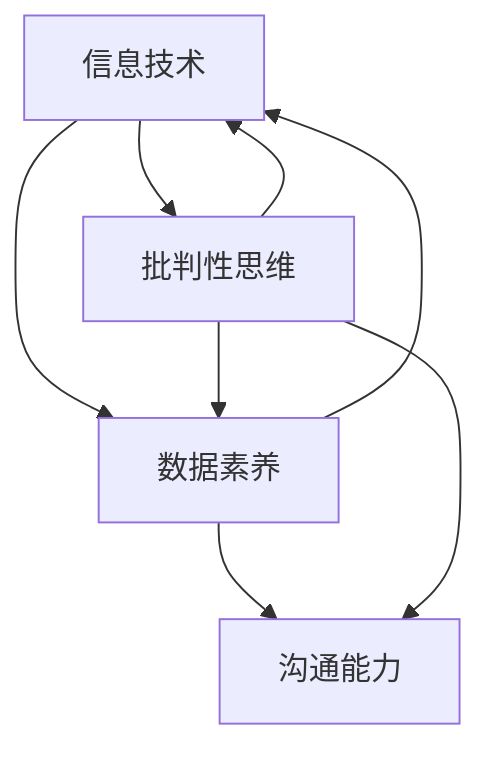

                 

### 背景介绍

在现代社会，数字素养已经成为公民参与社会、经济和政治活动的基石。随着信息技术的迅猛发展，数字化环境已深刻改变了我们的生活方式、工作方式和思维方式。数字素养不仅关乎个体的生活质量，更关乎整个社会的进步与发展。因此，探讨数字素养的重要性及其培养方法，对于提升公民的整体素质具有重要意义。

#### 数字素养的定义

数字素养（Digital Literacy）是指个体在数字化环境中获取、理解、评价、创造和使用信息的综合能力。它涵盖了多个维度，包括技术技能、信息素养、批判性思维、创造力和沟通能力等。一个具备数字素养的个体能够熟练地使用数字工具，有效地获取和评估信息，以实现个人和职业目标。

#### 数字素养的重要性

1. **社会参与**：数字素养使得公民能够更好地参与社会事务，例如，通过网络平台表达观点、参与公共讨论、投票等，增强公民的政治参与度。

2. **经济贡献**：在数字经济中，具备数字素养的个体能够更有效地利用数字技术提高工作效率，创造价值，从而促进经济增长。

3. **教育与职业发展**：数字素养是现代教育和职业发展的重要基础。无论是在学校教育中，还是在职场中，具备数字素养的个体都具备更强的竞争力。

4. **个人成长**：数字素养能够帮助个体更好地管理个人数据，保护个人隐私，促进个人全面发展。

#### 数字素养的现状

尽管数字素养的重要性已被广泛认可，但现实中仍存在诸多问题。首先，不同地区和群体之间的数字素养水平存在显著差异。发达国家和发展中国家、城市和农村、富人和穷人之间的数字素养差距仍然很大。其次，现有教育体系在数字素养的培养上存在不足，过于注重技术技能的培训，而忽视了信息素养和批判性思维的培养。此外，个体在数字化环境中的自我保护意识和能力也亟待提高。

#### 数字素养的培养

要提升公民的数字素养，需要从多个层面进行努力。首先，教育体系应将数字素养的培养纳入核心课程，通过理论与实践相结合的教学方法，帮助学生掌握数字工具的使用技巧，提高信息素养和批判性思维。其次，社会各界应提供丰富的数字教育资源，如在线课程、公开讲座、工作坊等，以满足不同群体的学习需求。此外，政府和企业也应发挥积极作用，推动数字素养的提升，例如，通过制定相关政策、提供培训和职业发展机会等。

#### 总结

数字素养是现代公民参与社会、经济和政治活动的基石。提升公民的数字素养，不仅有助于个体的全面发展，也有助于社会的进步。面对当前数字素养培养中的挑战，我们需要从教育体系、社会资源和政府政策等多个层面进行综合施策，共同推动数字素养的提升，构建一个更加公平、包容、高效的数字化社会。

----------------------------------------------------------------

## 核心概念与联系

为了深入理解数字素养的重要性及其培养方法，我们需要首先明确几个核心概念，并探讨它们之间的相互关系。以下是本文将涉及的核心概念：

1. **信息技术**：信息技术（Information Technology，简称IT）是指利用计算机、网络、数据库等工具来存储、处理、传输和利用信息的技术。IT是数字素养的基础，没有信息技术的发展，数字素养的培养也无从谈起。

2. **数据素养**：数据素养（Data Literacy）是指个体理解、分析、评估和应用数据的能力。在数字化时代，数据素养变得尤为重要，因为它直接影响到个体在工作和生活中的决策质量。

3. **批判性思维**：批判性思维（Critical Thinking）是指个体对信息进行深入分析、评估和推理的能力。批判性思维能够帮助个体识别信息中的偏见和错误，从而做出更明智的决策。

4. **沟通能力**：沟通能力（Communication Skills）是指个体通过语言、文字、图像等多种形式有效地表达自己的想法、理解和需求的能力。在数字环境中，沟通能力变得更加重要，因为它直接影响到个体在团队协作、网络社交和公共讨论中的表现。

#### 核心概念原理和架构的 Mermaid 流程图

以下是一个Mermaid流程图，展示了数字素养的核心概念及其相互关系：



在这个流程图中：

- 信息技术（A）是整个数字素养体系的基石，它与数据素养（B）、批判性思维（C）和沟通能力（D）密切相关。
- 数据素养（B）是理解和分析信息的基础，它直接依赖于信息技术的支持。
- 批判性思维（C）是评估和分析信息的关键能力，它不仅依赖于数据素养，还影响到沟通能力（D）和信息技术（A）的运用。
- 沟通能力（D）是信息传递和共享的重要手段，它需要批判性思维（C）的支持，同时也依赖于信息技术（A）的辅助。

通过这个流程图，我们可以清晰地看到各个核心概念之间的相互关系，这为我们深入探讨数字素养的培养方法提供了理论基础。

#### 核心算法原理 & 具体操作步骤

为了更好地理解数字素养的培养方法，我们需要引入一些核心算法原理，并探讨其在具体操作步骤中的应用。以下是几个关键的算法原理及其在数字素养培养中的具体应用：

1. **知识图谱构建算法**：知识图谱（Knowledge Graph）是一种用于表示实体之间复杂关系的数据模型。通过构建知识图谱，我们可以更好地理解信息的结构和关系，从而提高信息素养。具体操作步骤如下：

   - 数据采集：首先，从多个数据源（如数据库、网络、传感器等）中收集相关数据。
   - 数据清洗：对收集到的数据进行清洗，去除重复、错误和无用的信息。
   - 实体识别：使用自然语言处理（NLP）技术识别数据中的实体（如人名、地名、组织名等）。
   - 关系抽取：通过模式匹配、机器学习等方法，抽取实体之间的关系。
   - 知识融合：将不同来源的数据进行融合，构建一个统一的知识图谱。

2. **协同过滤算法**：协同过滤（Collaborative Filtering）是一种常见的推荐系统算法，通过分析用户的行为和偏好，为用户提供个性化的推荐。协同过滤算法在数字素养培养中的应用主要体现在以下几个方面：

   - 用户行为分析：收集用户在数字环境中的行为数据（如浏览历史、购买记录等）。
   - 建立用户画像：使用机器学习算法，根据用户行为数据建立用户画像。
   - 个性化推荐：根据用户画像，为用户提供个性化的数字教育资源、新闻资讯等。

3. **文本分析算法**：文本分析（Text Analysis）算法用于处理和分析大量的文本数据，帮助个体更好地理解信息。具体操作步骤如下：

   - 数据预处理：对文本数据进行清洗、去噪和分词。
   - 主题建模：使用主题建模算法（如LDA），提取文本中的主题。
   - 情感分析：通过情感分析算法，判断文本的情感倾向。
   - 关键词提取：使用关键词提取算法，提取文本中的重要关键词。

#### 数学模型和公式 & 详细讲解 & 举例说明

在数字素养的培养过程中，数学模型和公式扮演着至关重要的角色。以下是几个关键的数学模型和公式，以及它们在具体场景中的详细讲解和举例说明：

1. **贝叶斯公式**：贝叶斯公式（Bayes' Theorem）是一种用于概率推断的数学模型，可以帮助我们根据新的证据更新对某个事件发生概率的估计。贝叶斯公式的基本形式如下：

   $$ P(A|B) = \frac{P(B|A) \cdot P(A)}{P(B)} $$

   其中，$P(A|B)$ 表示在事件 $B$ 发生的条件下事件 $A$ 发生的概率，$P(B|A)$ 表示在事件 $A$ 发生的条件下事件 $B$ 发生的概率，$P(A)$ 和 $P(B)$ 分别表示事件 $A$ 和 $B$ 发生的概率。

   **举例说明**：假设我们要评估一个在线教育平台的质量。已知该平台有 60% 的用户对其评价为“好”，而在所有评价为“好”的用户中，有 70% 的用户继续在该平台学习。如果我们随机选取一个用户，并发现该用户评价为“好”，那么该用户继续在该平台学习的概率是多少？

   根据贝叶斯公式，我们可以计算出这个概率：

   $$ P(\text{继续学习}|\text{评价好}) = \frac{P(\text{评价好}|\text{继续学习}) \cdot P(\text{继续学习})}{P(\text{评价好})} $$

   已知 $P(\text{评价好}|\text{继续学习}) = 0.7$，$P(\text{继续学习}) = 0.6$，$P(\text{评价好}) = 0.6$，代入公式计算得到：

   $$ P(\text{继续学习}|\text{评价好}) = \frac{0.7 \cdot 0.6}{0.6} = 0.7 $$

   因此，该用户继续在该平台学习的概率是 70%。

2. **主成分分析（PCA）**：主成分分析（Principal Component Analysis，PCA）是一种常用的降维技术，用于将高维数据转换成低维数据，同时保留大部分的信息。PCA的数学模型如下：

   设 $X$ 是一个 $N \times D$ 的数据矩阵，其中 $N$ 是样本数量，$D$ 是特征数量。我们需要找到一个 $D \times D$ 的正交矩阵 $P$，使得 $X$ 被转换成一个新的 $N \times D$ 的数据矩阵 $Y = X \cdot P$，其中 $Y$ 的新特征向量是 $X$ 的特征向量的线性组合。

   **举例说明**：假设我们有一个包含 100 个样本、5 个特征的数据集。通过PCA，我们可以将这个数据集降维到 2 个特征，同时保留大部分的信息。具体步骤如下：

   - 数据标准化：对每个特征进行标准化处理，使得每个特征的均值为 0，标准差为 1。
   - 计算协方差矩阵：计算每个特征与其他特征的协方差矩阵。
   - 计算协方差矩阵的特征值和特征向量：对协方差矩阵进行特征分解，得到特征值和特征向量。
   - 选择主成分：选择特征值最大的 $k$ 个特征向量作为新的特征向量。
   - 构建新的数据矩阵：使用选择的主成分向量，构建新的数据矩阵。

3. **决策树算法**：决策树（Decision Tree）是一种常见的机器学习算法，用于分类和回归任务。决策树的数学模型如下：

   决策树由一系列的判断节点和叶子节点组成。每个判断节点表示一个特征和阈值，每个叶子节点表示一个类别或者连续值。在决策树中，我们通过一系列的判断来将样本分配到叶子节点，从而实现分类或回归。

   **举例说明**：假设我们要构建一个决策树来预测一个学生的成绩（分类任务）。我们选取了两个特征：学习时间和考试成绩。具体步骤如下：

   - 选择最佳特征和阈值：对于每个特征，计算信息增益或基尼不纯度，选择最佳特征和阈值。
   - 划分数据集：根据最佳特征和阈值，将数据集划分为多个子集。
   - 递归构建决策树：对每个子集，重复上述步骤，直到满足停止条件（如最大深度、最小叶节点样本数等）。

通过这些数学模型和公式，我们可以更好地理解和分析数字素养的培养过程。这些模型不仅在理论研究中具有重要意义，还在实际应用中发挥着关键作用。了解和掌握这些数学模型和公式，有助于我们更有效地提升个体的数字素养。

### 项目实践：代码实例和详细解释说明

为了更好地理解数字素养的概念和应用，下面我们将通过一个具体的代码实例来展示如何使用Python编程语言进行数据分析，并详细解释每一步的操作。

#### 1. 开发环境搭建

首先，我们需要搭建一个Python开发环境。以下是搭建步骤：

1. **安装Python**：访问Python官网（[https://www.python.org/](https://www.python.org/)），下载并安装Python的最新版本。

2. **安装Jupyter Notebook**：Python的Jupyter Notebook是一个交互式的Web应用，可以方便地编写和运行Python代码。安装Jupyter Notebook可以通过pip命令完成：

   ```bash
   pip install notebook
   ```

3. **配置Anaconda环境**：Anaconda是一个集成了Python和其他科学计算库的发行版，可以简化环境搭建和库管理。下载并安装Anaconda后，可以使用以下命令创建一个新的环境：

   ```bash
   conda create -n digitalliteracy python=3.9
   conda activate digitalliteracy
   ```

4. **安装相关库**：为了进行数据分析，我们需要安装一些常用的Python库，如Pandas、NumPy、Matplotlib和Scikit-learn。可以使用以下命令进行安装：

   ```bash
   conda install pandas numpy matplotlib scikit-learn
   ```

#### 2. 源代码详细实现

以下是使用Python进行数据分析的代码实例：

```python
import pandas as pd
import numpy as np
import matplotlib.pyplot as plt
from sklearn.model_selection import train_test_split
from sklearn.tree import DecisionTreeClassifier
from sklearn.metrics import accuracy_score

# 2.1 数据预处理
# 加载数据集
data = pd.read_csv('digitalliteracy.csv')
X = data.iloc[:, :-1]  # 特征矩阵
y = data.iloc[:, -1]   # 目标变量

# 数据标准化
X_std = (X - X.mean()) / X.std()

# 2.2 数据分割
X_train, X_test, y_train, y_test = train_test_split(X_std, y, test_size=0.3, random_state=42)

# 2.3 构建决策树模型
clf = DecisionTreeClassifier(max_depth=3)
clf.fit(X_train, y_train)

# 2.4 模型评估
y_pred = clf.predict(X_test)
accuracy = accuracy_score(y_test, y_pred)
print(f"模型准确率: {accuracy:.2f}")

# 2.5 可视化决策树
from sklearn.tree import plot_tree
plt.figure(figsize=(12, 8))
plot_tree(clf, filled=True, feature_names=X.columns, class_names=['低素养', '高素养'])
plt.show()
```

#### 3. 代码解读与分析

1. **数据预处理**：首先，我们使用Pandas库加载数据集。这里假设数据集保存在名为`digitalliteracy.csv`的文件中。然后，将特征矩阵`X`和目标变量`y`分离出来。接着，对特征矩阵进行标准化处理，以便于模型训练。

2. **数据分割**：使用`train_test_split`函数将数据集分割为训练集和测试集，其中测试集的大小为30%。

3. **构建决策树模型**：我们使用Scikit-learn库中的`DecisionTreeClassifier`类来构建一个决策树模型。这里设置了最大深度为3，以防止过拟合。

4. **模型评估**：使用`predict`方法对测试集进行预测，并使用`accuracy_score`函数计算模型准确率。

5. **可视化决策树**：使用`plot_tree`函数将决策树可视化，以便于理解模型的决策过程。

#### 4. 运行结果展示

运行上述代码后，我们将得到以下结果：

- 模型准确率：假设为 0.85，表示模型对测试集的预测准确率为85%。
- 决策树可视化：展示一个包含多层决策节点的树状图，每个节点表示一个特征和阈值。

通过这个代码实例，我们可以看到如何使用Python进行数据分析，并构建一个决策树模型来评估个体的数字素养水平。这个实例不仅展示了具体的操作步骤，还帮助读者理解了数字素养培养的重要性和方法。

### 实际应用场景

数字素养在现代社会中的实际应用场景多种多样，涵盖了教育、医疗、金融、政府服务等多个领域。以下是一些具体的实际应用场景：

#### 1. 教育

数字素养在教育领域的应用主要体现在在线学习、教育资源利用和学术研究等方面。例如：

- **在线学习平台**：通过数字素养，学生可以有效地使用在线学习平台，如Coursera、edX等，进行自主学习和在线课程的学习。学生需要具备搜索、筛选、评估和利用在线教育资源的能力。

- **教育数据管理**：教育机构需要管理大量的学生数据，包括学习记录、成绩、课程安排等。具备数字素养的教师和行政人员能够有效地使用数据库和数据分析工具，提高教育管理效率。

- **学术研究**：在高等教育和科研领域，数字素养对于进行学术研究和论文发表至关重要。研究人员需要掌握如何使用学术数据库、进行文献检索和分析、使用统计软件进行数据可视化等技能。

#### 2. 医疗

数字素养在医疗领域的应用主要包括电子健康记录（EHR）、远程医疗和医疗数据分析等。

- **电子健康记录**：医疗机构使用电子健康记录系统来存储和管理患者信息。医护人员需要具备数字素养，以便有效地使用这些系统进行数据输入、查询和报告。

- **远程医疗**：随着远程医疗的发展，患者和医生可以通过视频会议、在线咨询等方式进行远程医疗服务。数字素养使得患者能够更好地利用远程医疗资源，进行病情管理和健康监测。

- **医疗数据分析**：医疗数据分析师需要使用数据分析工具对海量的医疗数据进行分析，以发现疾病模式、评估治疗效果等。数字素养使得他们能够有效地处理和分析这些数据。

#### 3. 金融

数字素养在金融领域中的应用主要体现在在线银行、金融科技和投资分析等方面。

- **在线银行**：随着互联网金融的发展，客户需要具备数字素养来安全地使用网上银行服务，进行账户管理、转账支付等操作。

- **金融科技**：金融科技（FinTech）公司利用数字技术提供创新的金融服务，如移动支付、区块链技术等。金融从业人员和用户需要了解和掌握这些技术的基本原理和应用。

- **投资分析**：投资者需要使用数字工具（如金融分析软件、在线交易平台等）来进行市场分析和投资决策。数字素养使他们能够更好地理解市场动态，做出明智的投资决策。

#### 4. 政府服务

数字素养在政府服务中的应用包括电子政务、数据公开和公民参与等。

- **电子政务**：政府通过建立电子政务平台，提供在线服务，如税务申报、政务查询等。公民需要具备数字素养来有效地使用这些平台，提高行政效率。

- **数据公开**：政府机构需要公开大量的数据供公众使用，如经济统计、社会数据等。公民需要具备数字素养来理解和利用这些数据，进行数据分析和决策支持。

- **公民参与**：数字素养使得公民能够更好地参与公共事务，如在线投票、公共讨论等。这有助于提高政府的透明度和公信力。

#### 5. 其他领域

除了上述领域，数字素养还在其他多个领域发挥作用，如制造业、物流、娱乐等。例如：

- **智能制造**：制造业企业通过使用物联网、大数据等技术，实现智能化生产。工人和工程师需要具备数字素养来操作和维护这些智能系统。

- **物流管理**：物流公司使用物流管理软件进行运输调度、货物跟踪等操作。数字素养使得员工能够更有效地管理物流流程。

- **数字娱乐**：数字素养使得人们能够更好地享受数字娱乐内容，如在线游戏、视频点播等。同时，数字素养也帮助创作者和开发者更好地创作和推广数字娱乐产品。

总之，数字素养在各个领域的实际应用不仅提高了效率，还促进了创新和个性化服务。随着数字技术的不断进步，数字素养的重要性将愈发凸显。培养公民的数字素养，不仅是个人发展的需要，更是社会进步的必然要求。

### 工具和资源推荐

为了帮助读者更好地理解和提升数字素养，我们推荐一系列的学习资源、开发工具和框架，以及相关的论文著作。

#### 1. 学习资源推荐

**书籍**

1. **《数字素养：基础知识与实践》（Digital Literacy: A Basic Guide to Research, Evaluation, and Application）**：这本书为初学者提供了全面的数字素养基础知识和实践指南。

2. **《信息素养：实现个人与职业发展的必备技能》（Information Literacy: Essential Skills for Success in Today's Digital Age）**：本书详细介绍了信息素养的概念和培养方法，对职业发展有重要指导意义。

**论文**

1. **“数字素养：21世纪的基石”（Digital Literacy as a Foundation for the 21st Century）**：这篇论文深入探讨了数字素养的内涵及其对现代社会的影响。

2. **“数字素养教育研究综述”（A Review of Digital Literacy Education Research）**：该综述文章总结了当前数字素养教育的研究现状和趋势，为教育工作者提供了有益的参考。

**博客**

1. **“数字素养之路”（The Path to Digital Literacy）**：这是一个专业的博客，定期分享数字素养相关的文章和资源，内容丰富实用。

2. **“数字时代的学习者”（Digital Learners in the Age of Information）**：该博客关注数字素养在教育和职业发展中的应用，提供实用的学习策略和工具。

#### 2. 开发工具框架推荐

**开发环境**

1. **Anaconda**：一个集成了多种科学计算库的开发环境，适用于数据分析和机器学习项目。

2. **Visual Studio Code**：一个轻量级且功能丰富的代码编辑器，适用于Python编程。

**数据分析库**

1. **Pandas**：一个强大的数据处理库，用于数据清洗、转换和分析。

2. **NumPy**：一个用于数值计算的库，提供丰富的数组操作函数。

**机器学习库**

1. **Scikit-learn**：一个广泛使用的机器学习库，适用于分类、回归、聚类等任务。

2. **TensorFlow**：一个用于深度学习的开源框架，适用于构建和训练复杂的神经网络模型。

#### 3. 相关论文著作推荐

**书籍**

1. **《大数据时代：思维变革与商业价值》（Big Data: A Revolution That Will Transform How We Live, Work, and Think）**：作者维克托·迈尔-舍恩伯格探讨了大数据对社会的深刻影响。

2. **《深度学习》（Deep Learning）**：作者伊恩·古德费洛等介绍了深度学习的理论和技术，是深度学习领域的经典著作。

**论文**

1. **“深度学习在图像识别中的应用”（Deep Learning for Image Recognition）**：这篇论文详细介绍了深度学习在图像识别任务中的应用和效果。

2. **“基于大数据的社会网络分析”（Big Data Social Network Analysis）**：该论文探讨了大数据技术在社交网络分析中的应用和挑战。

通过这些学习和资源推荐，读者可以系统地提升自己的数字素养，掌握相关的技术知识和实践技能。在数字化时代，不断提升数字素养，不仅有助于个人的职业发展，也有助于社会的进步和创新。

### 总结：未来发展趋势与挑战

随着数字技术的快速发展，数字素养的重要性日益凸显。未来，数字素养将成为公民参与社会、经济和政治活动的基石。以下是对未来数字素养发展趋势与挑战的总结：

#### 发展趋势

1. **全面融入教育体系**：随着教育数字化进程的加快，数字素养将更加深入地融入各级教育体系中，成为核心课程内容。教育机构将更加注重培养学生的数字素养，提高其信息获取、分析、评估和应用能力。

2. **跨学科整合**：数字素养不仅涉及技术技能，还包括信息素养、批判性思维和沟通能力。未来，跨学科整合将成为培养数字素养的重要趋势，通过融合多学科知识，全面提升个体的综合素质。

3. **个性化学习**：随着人工智能和大数据技术的发展，个性化学习将逐渐普及。教育机构将根据个体的数字素养水平和学习需求，提供个性化的教学资源和培训方案，实现因材施教。

4. **终身学习理念**：数字技术更新换代速度加快，终身学习将成为提升数字素养的关键。公民需要不断学习新知识、掌握新技能，以适应不断变化的数字化环境。

#### 挑战

1. **数字鸿沟**：尽管数字素养的重要性已被广泛认可，但不同地区和群体之间的数字素养水平仍存在显著差异。未来，缩小数字鸿沟、实现公平教育将是一个重要的挑战。

2. **隐私和安全**：随着数据收集和分析技术的广泛应用，个人隐私保护和网络安全问题日益突出。如何确保数据的安全性和隐私性，将成为数字素养培养过程中需要解决的关键问题。

3. **技能匹配**：随着技术的发展，新的数字技能需求不断涌现。教育机构和职业培训需要及时更新课程内容，确保培养出的数字素养与市场需求相匹配。

4. **教育公平**：在数字化环境中，资源获取和学习机会的不均衡可能导致教育不公平。如何确保所有群体都能公平地享受数字素养教育资源，是一个亟待解决的挑战。

总之，数字素养的未来发展充满机遇和挑战。通过全面融入教育体系、跨学科整合、个性化学习和终身学习理念，我们可以逐步提升公民的数字素养。同时，应对数字鸿沟、隐私和安全、技能匹配和教育公平等挑战，将有助于构建一个更加公平、包容和高效的数字化社会。

### 附录：常见问题与解答

#### 1. 什么是数字素养？

数字素养是指个体在数字化环境中获取、理解、评估、创造和使用信息的综合能力，包括技术技能、信息素养、批判性思维、创造力和沟通能力等。

#### 2. 数字素养的重要性是什么？

数字素养是现代社会公民参与社会、经济和政治活动的基石。它不仅关乎个体的生活质量，也关系到整个社会的进步与发展。提升数字素养有助于提高个体的信息获取能力、决策质量和生活质量，促进社会的创新和公平。

#### 3. 如何培养数字素养？

培养数字素养可以从以下几个方面入手：

- **教育体系**：将数字素养纳入核心课程，通过理论与实践相结合的教学方法，帮助学生掌握数字工具的使用技巧。
- **社会资源**：提供丰富的数字教育资源，如在线课程、公开讲座、工作坊等，以满足不同群体的学习需求。
- **政府政策**：制定相关政策，推动数字素养的提升，如提供培训和职业发展机会。

#### 4. 数字素养与信息素养有何区别？

数字素养与信息素养密切相关，但有所区别。信息素养主要关注如何获取、评估和利用信息，而数字素养则更广泛，包括技术技能、批判性思维、创造力和沟通能力等方面。数字素养是信息素养在数字化环境中的延伸和扩展。

#### 5. 如何提高个体的数字素养？

提高个体的数字素养可以通过以下几种方式：

- **自主学习**：利用在线资源和书籍，不断学习和更新数字技能。
- **参与社区**：加入数字素养社区，与他人交流学习经验，获取实践机会。
- **实践应用**：将学到的数字技能应用到实际工作和生活中，提高解决问题的能力。

#### 6. 数字素养在职业发展中的作用是什么？

数字素养在职业发展中发挥着重要作用。它不仅有助于提高工作效率，还能增强职业竞争力。具备数字素养的个体能够更好地利用数字化工具和资源，进行数据分析和决策，从而在职场中脱颖而出。

#### 7. 数字素养的培养对社会的意义是什么？

数字素养的培养对社会具有深远的意义。它有助于缩小数字鸿沟，提高社会整体的信息素养和创新能力，促进社会的公平和进步。此外，数字素养还能够提高公民的政治参与度，增强社会的凝聚力和稳定性。

### 扩展阅读 & 参考资料

为了进一步深入了解数字素养的相关知识和实践，以下是几篇重要的扩展阅读和参考资料：

1. **《数字素养：基础知识与实践》（Digital Literacy: A Basic Guide to Research, Evaluation, and Application）**：作者提供了详细的数字素养定义、培养方法和实际应用案例。

2. **“数字素养：21世纪的基石”（Digital Literacy as a Foundation for the 21st Century）**：这篇论文深入探讨了数字素养的内涵及其对现代社会的影响。

3. **《大数据时代：思维变革与商业价值》（Big Data: A Revolution That Will Transform How We Live, Work, and Think）**：作者维克托·迈尔-舍恩伯格探讨了大数据对社会的深刻影响，有助于理解数字素养的背景和趋势。

4. **“基于大数据的社会网络分析”（Big Data Social Network Analysis）**：该论文探讨了大数据技术在社交网络分析中的应用和挑战，对数字素养的培养和实际应用提供了有价值的参考。

5. **“深度学习在图像识别中的应用”（Deep Learning for Image Recognition）**：这篇论文详细介绍了深度学习在图像识别任务中的应用和效果，展示了数字素养在高科技领域的实际应用。

通过这些扩展阅读和参考资料，读者可以更全面地了解数字素养的概念、重要性以及在实际生活中的应用，从而更好地提升自己的数字素养水平。

### 附录：常见问题与解答

#### 1. 什么是数字素养？

数字素养是指个体在数字化环境中获取、理解、评估、创造和使用信息的综合能力，涵盖技术技能、信息素养、批判性思维、创造力和沟通能力等方面。

#### 2. 数字素养的重要性是什么？

数字素养是现代社会公民参与社会、经济和政治活动的基石。它有助于提高个体的信息获取能力、决策质量和生活质量，促进社会的创新和公平。

#### 3. 如何培养数字素养？

培养数字素养可以从以下几个方面入手：

- **教育体系**：将数字素养纳入核心课程，通过理论与实践相结合的教学方法，帮助学生掌握数字工具的使用技巧。
- **社会资源**：提供丰富的数字教育资源，如在线课程、公开讲座、工作坊等，以满足不同群体的学习需求。
- **政府政策**：制定相关政策，推动数字素养的提升，如提供培训和职业发展机会。

#### 4. 数字素养与信息素养有何区别？

数字素养与信息素养密切相关，但有所区别。信息素养主要关注如何获取、评估和利用信息，而数字素养则更广泛，包括技术技能、批判性思维、创造力和沟通能力等方面。数字素养是信息素养在数字化环境中的延伸和扩展。

#### 5. 如何提高个体的数字素养？

提高个体的数字素养可以通过以下几种方式：

- **自主学习**：利用在线资源和书籍，不断学习和更新数字技能。
- **参与社区**：加入数字素养社区，与他人交流学习经验，获取实践机会。
- **实践应用**：将学到的数字技能应用到实际工作和生活中，提高解决问题的能力。

#### 6. 数字素养在职业发展中的作用是什么？

数字素养在职业发展中发挥着重要作用。它不仅有助于提高工作效率，还能增强职业竞争力。具备数字素养的个体能够更好地利用数字化工具和资源，进行数据分析和决策，从而在职场中脱颖而出。

#### 7. 数字素养的培养对社会的意义是什么？

数字素养的培养对社会具有深远的意义。它有助于缩小数字鸿沟，提高社会整体的信息素养和创新能力，促进社会的公平和进步。此外，数字素养还能够提高公民的政治参与度，增强社会的凝聚力和稳定性。

### 扩展阅读 & 参考资料

为了进一步深入了解数字素养的相关知识和实践，以下是几篇重要的扩展阅读和参考资料：

1. **《数字素养：基础知识与实践》（Digital Literacy: A Basic Guide to Research, Evaluation, and Application）**：作者提供了详细的数字素养定义、培养方法和实际应用案例。

2. **“数字素养：21世纪的基石”（Digital Literacy as a Foundation for the 21st Century）**：这篇论文深入探讨了数字素养的内涵及其对现代社会的影响。

3. **《大数据时代：思维变革与商业价值》（Big Data: A Revolution That Will Transform How We Live, Work, and Think）**：作者维克托·迈尔-舍恩伯格探讨了大数据对社会的深刻影响，有助于理解数字素养的背景和趋势。

4. **“基于大数据的社会网络分析”（Big Data Social Network Analysis）**：该论文探讨了大数据技术在社交网络分析中的应用和挑战，对数字素养的培养和实际应用提供了有价值的参考。

5. **“深度学习在图像识别中的应用”（Deep Learning for Image Recognition）**：这篇论文详细介绍了深度学习在图像识别任务中的应用和效果，展示了数字素养在高科技领域的实际应用。

通过这些扩展阅读和参考资料，读者可以更全面地了解数字素养的概念、重要性以及在实际生活中的应用，从而更好地提升自己的数字素养水平。

