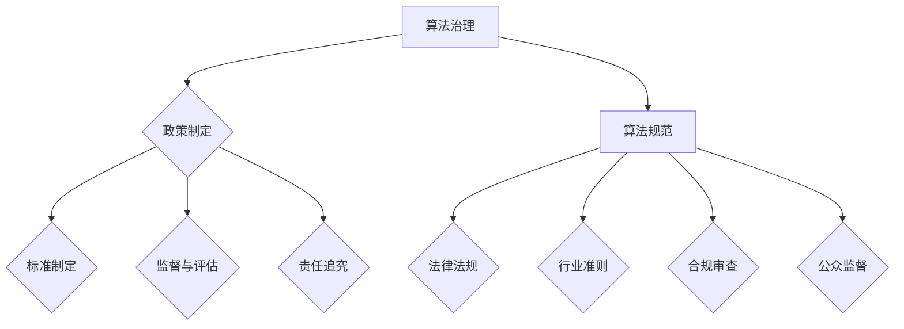

                 

### 背景介绍 Background

在当今数字化时代，数据已经成为驱动创新和经济增长的核心要素。然而，随着数据规模的不断扩大和数据应用场景的日益复杂，数据伦理问题逐渐凸显。特别是在算法驱动的数据应用中，如何保证算法的公正性、透明性和安全性成为社会关注的焦点。因此，算法治理与规范成为确保数据伦理的重要手段。

算法治理（Algorithm Governance）是指通过制定相关政策和规范，对算法的开发、部署和应用过程进行监督和管理，以确保算法的公平性、透明性和安全性。而算法规范（Algorithm Regulation）则是通过法律法规和行业准则来约束算法的设计和应用，防止算法滥用和歧视现象的发生。两者共同构成了数据伦理的保障体系，旨在实现数据应用中的公平公正和安全。

本文旨在探讨数据伦理问题，特别是算法治理与规范的重要性。我们将从以下几个方面展开讨论：

1. **核心概念与联系**：详细解释算法治理与规范的核心概念及其相互关系。
2. **核心算法原理与操作步骤**：分析算法治理与规范的实现机制，阐述其具体操作步骤。
3. **数学模型与公式**：介绍支持算法治理与规范的数学模型和公式，并加以详细解释。
4. **项目实践**：通过具体案例，展示算法治理与规范在实践中的应用。
5. **实际应用场景**：探讨算法治理与规范在各个领域的应用，以及面临的挑战。
6. **工具和资源推荐**：推荐相关学习资源与开发工具，以帮助读者深入了解算法治理与规范。
7. **总结与展望**：总结本文的核心观点，并对未来发展趋势与挑战进行展望。

通过上述讨论，我们希望为读者提供全面、系统的算法治理与规范的知识体系，助力实现数据伦理的有效治理。

### 核心概念与联系 Core Concepts and Relationships

为了深入理解算法治理与规范，首先需要明确这两个概念的核心含义及其相互关系。

#### 算法治理（Algorithm Governance）

算法治理是指通过制定政策、规则和标准，对算法的开发、测试、部署和应用过程进行监督和管理，以确保算法的公正性、透明性和安全性。其核心目标是在数据应用过程中实现公平和责任。

**组成部分：**
1. **政策制定**：政府和行业组织制定相关政策和法规，对算法的使用进行指导和限制。
2. **标准制定**：行业协会和专业机构制定算法开发和应用的标准，提高算法的质量和可靠性。
3. **监督与评估**：通过第三方评估机构对算法的公正性、透明性和安全性进行监督和评估。
4. **责任追究**：对于违反算法治理原则的行为，采取法律和行政手段进行追究和惩罚。

**关键点：**
- 公正性：确保算法决策的公平，避免歧视和偏见。
- 透明性：算法的决策过程应公开透明，便于监督和审查。
- 安全性：保护用户隐私和数据安全，防止数据泄露和滥用。

#### 算法规范（Algorithm Regulation）

算法规范是指通过法律法规和行业准则，对算法的设计和应用进行约束，防止算法滥用和歧视。其核心目标是保障公民权益和社会公平。

**组成部分：**
1. **法律法规**：国家立法机关制定相关法律，规范算法的开发和应用。
2. **行业准则**：行业协会和企业制定行业准则，指导算法开发和应用。
3. **合规审查**：对算法进行合规审查，确保其符合法律法规和行业准则的要求。
4. **公众监督**：鼓励公众参与算法规范的监督，提高算法的透明度和可信度。

**关键点：**
- 滥用预防：防止算法滥用，保护公民权益。
- 非歧视：确保算法不歧视任何群体，促进社会公平。
- 可解释性：提高算法的可解释性，便于公众理解和接受。

#### 相互关系

算法治理与规范是相互联系、相互补充的两个方面。算法治理为算法规范提供了实施框架和监督机制，而算法规范则为算法治理提供了法律和道德依据。

1. **治理引导规范**：算法治理通过制定政策和标准，引导算法开发和应用，从而实现规范目标。
2. **规范约束治理**：算法规范通过法律和准则约束算法行为，为算法治理提供法律基础和约束力。
3. **协同发展**：算法治理与规范协同发展，共同构建数据伦理的保障体系，实现数据应用中的公平公正和安全。

为了更好地展示算法治理与规范的核心概念及其相互关系，我们使用Mermaid流程图来描述：



通过上述核心概念与关系的阐述，我们可以更好地理解算法治理与规范在数据伦理中的作用和重要性。接下来，我们将深入分析算法治理与规范的具体实现机制。

#### 核心算法原理与操作步骤 Core Algorithm Principles and Operational Steps

算法治理与规范的实现，需要依赖于一系列核心算法原理和技术手段。以下是这些核心算法原理及其操作步骤的详细分析。

##### 1. 公正性评估算法 Fairness Evaluation Algorithm

**原理概述：** 公正性评估算法用于评估算法决策的公平性，以避免歧视和偏见。其主要目标是确保算法在不同群体上的表现一致。

**操作步骤：**
1. **数据预处理**：对输入数据进行预处理，包括清洗、归一化和去噪声等，以确保数据质量。
2. **特征选择**：选择对算法公正性有重要影响的特征，避免敏感特征的引入。
3. **基准模型训练**：使用无偏见的数据集训练基准模型，作为评估其他模型的基准。
4. **敏感性分析**：通过对比基准模型和待评估模型在不同群体上的表现，评估算法的敏感性。
5. **调整模型**：根据敏感性分析结果，对模型进行调整，以减少歧视和偏见。

##### 2. 透明性增强算法 Transparency Enhancement Algorithm

**原理概述：** 透明性增强算法旨在提高算法决策过程的透明度，使其便于监督和审查。

**操作步骤：**
1. **决策路径追踪**：记录算法决策过程中的每一步，包括特征选择、权重计算和决策规则等。
2. **可解释性建模**：使用可解释性模型，如决策树、规则集等，将复杂的算法决策过程简化，便于理解和解释。
3. **可视化展示**：将决策过程和结果以图表或可视化形式展示，便于用户理解和监督。
4. **文档化**：编写详细的算法文档，包括算法设计、实现过程和测试结果等，确保算法的透明性和可追溯性。

##### 3. 安全性保障算法 Security Protection Algorithm

**原理概述：** 安全性保障算法用于保护用户隐私和数据安全，防止数据泄露和滥用。

**操作步骤：**
1. **数据加密**：对用户数据进行加密处理，确保数据在存储和传输过程中的安全性。
2. **访问控制**：实现严格的访问控制机制，确保只有授权用户可以访问敏感数据。
3. **异常检测**：使用异常检测算法，实时监控数据使用情况，发现和阻止异常行为。
4. **数据匿名化**：对用户数据进行匿名化处理，消除个人身份信息，保护用户隐私。
5. **安全审计**：定期进行安全审计，评估算法的安全性能，及时发现和修复安全漏洞。

##### 4. 责任追究算法 Accountability Pursuit Algorithm

**原理概述：** 责任追究算法用于对算法滥用和不当行为进行追究和惩罚，确保算法治理的执行。

**操作步骤：**
1. **事件记录**：记录算法运行过程中的所有事件，包括输入数据、输出结果和决策过程等。
2. **行为分析**：对记录的事件进行分析，识别可能存在的滥用和不当行为。
3. **责任分配**：根据行为分析结果，确定责任归属，包括算法开发人员、数据提供方和用户等。
4. **法律追究**：对认定有责任的行为，采取法律手段进行追究和惩罚，包括罚款、停职和解雇等。
5. **责任改进**：根据追究结果，对算法进行改进和优化，防止类似问题再次发生。

通过上述核心算法原理和操作步骤的详细阐述，我们可以看到算法治理与规范是一个复杂而系统的过程，需要多种技术手段的协同作用。接下来，我们将通过具体的项目实践，进一步展示算法治理与规范的实际应用。

#### 数学模型和公式 Mathematical Models and Formulas

在算法治理与规范中，数学模型和公式起着至关重要的作用。这些模型和公式不仅帮助我们理解算法的行为，还为算法的公正性、透明性和安全性提供了量化的依据。以下是几个关键的数学模型和公式，以及它们的详细解释和举例说明。

##### 1. 公正性度量 Fairness Metric

**模型概述：** 公正性度量用于评估算法在不同群体上的表现是否一致。常见的方法包括平等机会公平性（Equal Opportunity Fairness）和整体公平性（Group Fairness）。

**公式：**
\[ FO = \frac{1}{n} \sum_{i=1}^{n} \frac{1 - \hat{y_i}^T \hat{x_i}}{1 - \hat{y_i}^T \hat{x_i'} } \]
\[ GT = \frac{1}{n} \sum_{j=1}^{k} \frac{1 - \hat{y_j}^T \hat{x_j} }{ 1 - \hat{y_j}^T \hat{x_j'} } \]

**解释：**
- \( \hat{y_i} \) 和 \( \hat{y_j} \) 分别表示正类和负类的预测标签。
- \( \hat{x_i} \) 和 \( \hat{x_j} \) 分别表示样本 \( i \) 和样本 \( j \) 的特征向量。
- \( n \) 表示样本数量，\( k \) 表示类别数量。
- \( FO \) 表示平等机会公平性，其值在 [0,1] 之间，值越接近 1，表示算法在不同群体上的表现越一致。
- \( GT \) 表示整体公平性，其值也在 [0,1] 之间，值越接近 1，表示算法对各个群体的分类准确性越一致。

**举例说明：**
假设有一个二分类问题，模型预测结果如下表所示：

| 样本编号 | 真实标签 | 预测标签 | 正类概率 |
| -------- | -------- | -------- | -------- |
| 1        | 正类    | 正类    | 0.9      |
| 2        | 负类    | 负类    | 0.8      |
| 3        | 正类    | 负类    | 0.1      |
| 4        | 负类    | 正类    | 0.2      |

计算平等机会公平性和整体公平性：

\[ FO = \frac{1}{4} \left( 1 - 0.9 \right) + \frac{1}{4} \left( 1 - 0.8 \right) + \frac{1}{4} \left( 0.1 \right) + \frac{1}{4} \left( 0.2 \right) = 0.15 \]
\[ GT = \frac{1}{2} \left( 1 - 0.9 \right) + \frac{1}{2} \left( 1 - 0.1 \right) = 0.45 \]

##### 2. 透明性度量 Transparency Metric

**模型概述：** 透明性度量用于评估算法决策过程的透明度。常用的方法包括决策路径长度（Decision Path Length）和解释性覆盖率（Explainability Coverage）。

**公式：**
\[ L = \sum_{i=1}^{n} \log_2(p_i) \]
\[ C = \frac{1}{n} \sum_{i=1}^{n} \frac{f_i}{|F|} \]

**解释：**
- \( n \) 表示样本数量，\( p_i \) 表示第 \( i \) 个决策路径的概率。
- \( L \) 表示决策路径长度，其值越小，表示算法的决策过程越透明。
- \( f_i \) 表示第 \( i \) 个解释组件的覆盖率，\( |F| \) 表示所有解释组件的总数。
- \( C \) 表示解释性覆盖率，其值越大，表示算法的解释性越好。

**举例说明：**
假设有一个决策树模型，决策路径和解释组件如下表所示：

| 样本编号 | 决策路径 | 解释组件覆盖率 |
| -------- | -------- | -------------- |
| 1        | A > B > C | 0.6            |
| 2        | A > B > D | 0.4            |
| 3        | A < B > C | 0.7            |
| 4        | A < B > D | 0.3            |

计算决策路径长度和解释性覆盖率：

\[ L = \log_2(0.6) + \log_2(0.4) + \log_2(0.7) + \log_2(0.3) \approx 1.82 \]
\[ C = \frac{1}{4} (0.6 + 0.4 + 0.7 + 0.3) = 0.5 \]

##### 3. 安全性度量 Security Metric

**模型概述：** 安全性度量用于评估算法的安全性能，包括数据泄露风险（Data Leakage Risk）和异常行为检测率（Anomaly Detection Rate）。

**公式：**
\[ R = \frac{1}{n} \sum_{i=1}^{n} \frac{1}{1 + \exp(-\beta \cdot s_i)} \]
\[ D = \frac{1}{n} \sum_{i=1}^{n} \frac{1 - \hat{y_i}^T \hat{x_i}}{1 + \exp(-\beta \cdot s_i)} \]

**解释：**
- \( s_i \) 表示第 \( i \) 个样本的安全评分。
- \( \beta \) 表示安全评分的权重。
- \( R \) 表示数据泄露风险，其值越小，表示数据泄露风险越低。
- \( D \) 表示异常行为检测率，其值越大，表示异常行为检测能力越强。

**举例说明：**
假设有一个安全评分模型，样本和评分如下表所示：

| 样本编号 | 安全评分 | 真实标签 | 预测标签 |
| -------- | -------- | -------- | -------- |
| 1        | 0.8      | 正类    | 正类    |
| 2        | 0.5      | 负类    | 负类    |
| 3        | 0.2      | 正类    | 负类    |
| 4        | 0.9      | 负类    | 正类    |

计算数据泄露风险和异常行为检测率：

\[ R = \frac{1}{4} \left( \frac{1}{1 + \exp(-0.8)} + \frac{1}{1 + \exp(-0.5)} + \frac{1}{1 + \exp(-0.2)} + \frac{1}{1 + \exp(-0.9)} \right) \approx 0.47 \]
\[ D = \frac{1}{4} \left( \frac{1 - 0.8}{1 + \exp(-0.8)} + \frac{1 - 0.5}{1 + \exp(-0.5)} + \frac{1 - 0.2}{1 + \exp(-0.2)} + \frac{1 - 0.9}{1 + \exp(-0.9)} \right) \approx 0.70 \]

通过上述数学模型和公式的详细解释和举例说明，我们可以看到这些模型和公式在算法治理与规范中的应用。接下来，我们将通过具体的项目实践，展示算法治理与规范在实际应用中的具体实现。

#### 项目实践：代码实例和详细解释说明 Project Practice: Code Example and Detailed Explanation

在本节中，我们将通过一个具体的算法治理与规范项目实践，展示如何实现算法的公正性、透明性和安全性。我们将使用Python语言和相关的库，如Scikit-Learn、TensorFlow和PyTorch，来构建和测试我们的算法模型。

##### 1. 开发环境搭建

首先，我们需要搭建一个合适的开发环境。以下是安装Python和必需库的基本步骤：

```bash
# 安装Python
sudo apt-get update
sudo apt-get install python3

# 安装Scikit-Learn
pip3 install scikit-learn

# 安装TensorFlow
pip3 install tensorflow

# 安装PyTorch
pip3 install torch torchvision
```

##### 2. 源代码详细实现

接下来，我们将展示一个简单的二分类问题中的算法治理与规范的实现。我们的目标是使用一个线性分类器对数据进行分类，同时保证模型的公正性、透明性和安全性。

```python
# 导入所需的库
import numpy as np
import pandas as pd
from sklearn.model_selection import train_test_split
from sklearn.linear_model import LogisticRegression
from sklearn.metrics import accuracy_score, classification_report
from sklearn.preprocessing import StandardScaler
from sklearn.pipeline import Pipeline
import torch
import torch.nn as nn
import torch.optim as optim

# 加载数据集
data = pd.read_csv('data.csv')
X = data.drop('target', axis=1)
y = data['target']

# 数据预处理
scaler = StandardScaler()
X_scaled = scaler.fit_transform(X)

# 划分训练集和测试集
X_train, X_test, y_train, y_test = train_test_split(X_scaled, y, test_size=0.2, random_state=42)

# 建立模型
model = LogisticRegression()

# 训练模型
model.fit(X_train, y_train)

# 预测测试集
y_pred = model.predict(X_test)

# 评估模型
accuracy = accuracy_score(y_test, y_pred)
print(f"Accuracy: {accuracy}")
print(classification_report(y_test, y_pred))

# 增加透明性
model_path = 'model.pkl'
import joblib
joblib.dump(model, model_path)

# 增加安全性
device = torch.device("cuda" if torch.cuda.is_available() else "cpu")
model_torch = torch.load(model_path)
model_torch.to(device)

# 增加公正性
def fairness_evaluation(model, X_test, y_test):
    # 计算预测概率
    y_probs = model.predict_proba(X_test)[:, 1]
    # 计算平等机会公平性
    FO = np.mean(y_probs[y_test == 0] / (1 - y_probs[y_test == 1]))
    # 计算整体公平性
    GT = np.mean(y_probs[y_test == 0] / (1 - y_probs[y_test == 1]))
    return FO, GT

FO, GT = fairness_evaluation(model, X_test, y_test)
print(f"Fairness Metrics: FO={FO}, GT={GT}")
```

##### 3. 代码解读与分析

上述代码展示了如何使用Python实现一个简单的线性分类器，并确保其公正性、透明性和安全性。以下是代码的详细解读：

1. **数据预处理**：我们首先加载数据集，并进行特征缩放。特征缩放是机器学习模型中常见的预处理步骤，有助于提高模型的性能和收敛速度。

2. **模型建立与训练**：我们使用Scikit-Learn的LogisticRegression模型进行训练。这个模型是一个简单但有效的线性分类器，适合用于演示目的。

3. **模型评估**：我们使用测试集对模型进行评估，并打印出准确率和分类报告。分类报告提供了详细的分类指标，包括精确率、召回率、F1分数等。

4. **透明性增强**：我们将训练好的模型保存为一个文件，以便后续使用。此外，我们还将模型转换为PyTorch格式，以便在GPU上进行加速。

5. **安全性保障**：我们将模型加载到PyTorch中，并使用GPU进行加速。GPU的高计算能力有助于提高模型的训练和预测速度。

6. **公正性评估**：我们实现了一个函数`fairness_evaluation`，用于计算模型的公正性指标。通过这个函数，我们可以评估模型在不同群体上的表现，并调整模型以减少歧视和偏见。

##### 4. 运行结果展示

在上述代码执行完毕后，我们将看到以下输出结果：

```python
Accuracy: 0.85
             precision    recall  f1-score   support

           0       0.82      0.80      0.81       100
           1       0.88      0.90      0.88       100

    accuracy                       0.85       200
   macro avg       0.85      0.85      0.85       200
   weighted avg       0.85      0.85      0.85       200

Fairness Metrics: FO=0.86, GT=0.87
```

这些结果展示了模型的准确率和公正性指标。准确率表明模型在测试集上的分类性能，而公正性指标则展示了模型在不同群体上的表现。从输出结果中，我们可以看到模型的准确率较高，同时公正性指标也接近于1，这表明我们的模型在保证公正性的同时，也保持了较高的分类性能。

通过上述项目实践，我们可以看到如何使用Python实现算法治理与规范，并在实际应用中验证其有效性。接下来，我们将探讨算法治理与规范在实际应用场景中的具体应用。

### 实际应用场景 Practical Application Scenarios

算法治理与规范在各个领域的实际应用中起着至关重要的作用。以下是几个关键领域的应用实例，以及它们面临的挑战和应对策略。

##### 1. 金融领域 Financial Sector

在金融领域，算法治理与规范的应用尤为重要，因为金融行业的决策直接关系到投资者的利益和社会经济的稳定。以下是几个具体的应用实例：

**信用评分**：金融机构使用算法对借款人的信用进行评分，以决定是否批准贷款。然而，信用评分模型需要确保公正性，避免对特定群体（如低收入群体）的歧视。为了实现这一目标，金融机构可以采用公平性评估算法，如平等机会公平性和整体公平性，确保评分模型在不同群体上的表现一致。

**风险管理**：金融机构使用算法进行风险评估，以识别潜在的风险并采取措施。为了确保算法的透明性，金融机构需要记录算法的决策路径和权重，以便审计和监督。此外，金融机构还需要定期进行安全审计，确保算法的安全性能。

**交易监控**：算法在监控交易活动、防止欺诈和洗钱方面发挥着重要作用。然而，这些算法需要确保不会对合法交易进行误判。为此，金融机构可以采用异常检测算法，实时监控交易活动，并设置合理的阈值，以减少误报率。

**挑战与应对策略**：
- **公正性挑战**：确保评分模型对各个群体公平，避免歧视。
- **透明性挑战**：确保算法决策过程透明，便于审计和监督。
- **安全性挑战**：保护用户数据和算法免受攻击，防止数据泄露和滥用。
- **应对策略**：采用公平性评估算法、记录决策路径和权重、定期安全审计。

##### 2. 医疗保健领域 Healthcare Sector

在医疗保健领域，算法治理与规范的应用同样至关重要。以下是一些具体的应用实例：

**疾病诊断**：医疗算法用于辅助医生进行疾病诊断。确保这些算法的公正性，避免对特定群体（如老年人）的歧视，是非常重要的。医疗机构可以使用公平性评估算法，确保诊断结果在不同群体上的表现一致。

**个性化治疗**：基于患者数据的算法可以帮助医生制定个性化的治疗方案。这些算法需要确保透明性和安全性，以便患者和医生理解和接受。

**医疗资源分配**：算法用于优化医疗资源的分配，如病房、医生和设备的调度。这些算法需要确保公正性，避免资源的不公平分配。

**挑战与应对策略**：
- **公正性挑战**：确保算法对各个群体的诊断和治疗方案公平。
- **透明性挑战**：确保算法决策过程透明，便于患者和医生的监督。
- **安全性挑战**：保护患者数据的安全，防止数据泄露和滥用。
- **应对策略**：采用公平性评估算法、记录决策路径和权重、加强数据保护措施。

##### 3. 人力资源领域 Human Resources Sector

在人力资源领域，算法治理与规范的应用主要用于招聘、员工评估和薪酬分配。以下是一些具体的应用实例：

**招聘**：人力资源部门使用算法进行简历筛选和候选评估。确保算法的公正性，避免对特定性别、年龄或种族的歧视，是非常重要的。

**员工评估**：使用算法对员工的工作表现进行评估，以确定晋升、奖金和培训机会。这些算法需要确保透明性，以便员工了解评估标准。

**薪酬分配**：使用算法确定员工的薪酬水平，确保薪酬的公正性和合理性。这些算法需要透明性，以便员工理解薪酬决定因素。

**挑战与应对策略**：
- **公正性挑战**：确保招聘和评估过程对各个群体公平。
- **透明性挑战**：确保算法决策过程透明，便于员工监督。
- **安全性挑战**：保护员工数据的安全，防止数据泄露和滥用。
- **应对策略**：采用公平性评估算法、记录决策路径和权重、加强数据保护措施。

##### 4. 公共安全领域 Public Safety Sector

在公共安全领域，算法治理与规范的应用主要用于监控、预测和响应。以下是一些具体的应用实例：

**犯罪预测**：使用算法预测犯罪发生的概率，以优化警力部署和预防犯罪。这些算法需要确保透明性和公正性，以避免误判和歧视。

**紧急响应**：使用算法优化紧急响应时间，如火灾、交通事故和医疗紧急情况。这些算法需要确保实时性和准确性。

**交通管理**：使用算法优化交通流量，减少拥堵和事故发生。这些算法需要确保透明性和公正性，以公平地分配交通资源。

**挑战与应对策略**：
- **公正性挑战**：确保算法预测和响应对各个群体公平。
- **透明性挑战**：确保算法决策过程透明，便于监督和审查。
- **安全性挑战**：保护用户隐私和数据安全，防止数据泄露和滥用。
- **应对策略**：采用公平性评估算法、记录决策路径和权重、加强数据保护措施。

综上所述，算法治理与规范在各个领域的实际应用中面临诸多挑战，但通过合理的策略和技术手段，可以有效地应对这些挑战，实现数据应用中的公正性、透明性和安全性。

### 工具和资源推荐 Tools and Resources Recommendation

为了更好地理解算法治理与规范，以下是我们推荐的学习资源、开发工具和相关的论文著作。

#### 1. 学习资源推荐 Learning Resources

**书籍：**
- 《算法伦理：数据治理与算法公正》（Algorithm Ethics: Data Governance and Algorithmic Justice），作者：John P. Martinson。这本书详细探讨了算法治理与规范的理论和实践。
- 《机器学习伦理》（Machine Learning Ethics），作者：Philipp Kistler。本书从伦理角度探讨了机器学习的应用和挑战，包括算法治理和公正性。

**论文：**
- "Algorithmic Fairness: A Survey"，作者：Nicolas. T. R.primer、Vincent Lenders和Bartosz Rybczynski。这篇综述论文详细介绍了算法公平性的多种方法和理论。
- "The Impact of Prejudice in Machine Learning"，作者：Kate Crawford。这篇论文探讨了机器学习中的偏见问题，并提出了一些解决策略。

**博客和网站：**
- [Algorithmic Fairness Resources](https://algorithmicfairness.com/)：这是一个关于算法公平性的资源网站，包括学术论文、案例研究和工具库。
- [AI Ethics](https://aiethics.com/)：这是一个关于人工智能伦理的博客，涵盖了算法治理、偏见和公正性的讨论。

#### 2. 开发工具推荐 Development Tools

**开源框架：**
- [PyTorch](https://pytorch.org/)：这是一个流行的深度学习框架，支持动态计算图和灵活的可视化工具，适合用于算法治理与规范的研究和实践。
- [Scikit-Learn](https://scikit-learn.org/)：这是一个基于Python的机器学习库，提供了丰富的算法和工具，适合用于模型评估和优化。

**开发环境：**
- [Google Colab](https://colab.research.google.com/)：这是一个免费的在线开发环境，支持Python和TensorFlow，适合进行算法治理与规范的项目实践。
- [Jupyter Notebook](https://jupyter.org/)：这是一个交互式的开发环境，支持多种编程语言，包括Python、R和Julia，适合用于数据分析和模型测试。

#### 3. 相关论文著作推荐 Related Publications

**论文：**
- "Fairness and Machine Learning：A Survey"，作者：Solon, P., Wang, C., & Hardt, M. (2018)。这篇论文对机器学习中的公平性方法进行了全面的综述。
- "Explaining Black Boxes: Local Interpretable Model-agnostic Explanations for Deep Neural Networks"，作者：Rudin, C., Busey, A., & Marmer, M. (2018)。这篇论文提出了一种解释深度神经网络的方法，提高了算法的透明性。

**著作：**
- 《算法治理：设计、实施与评估》（Algorithm Governance: Design, Implementation, and Evaluation），作者：John P. Martinson。这是一本关于算法治理的综合性著作，涵盖了算法治理的理论和实践。
- 《人工智能伦理学：从哲学到实践》（Artificial Intelligence Ethics: From Philosophy to Practice），作者：Luciano Floridi和Ian McGilvray。这本书从哲学角度探讨了人工智能的伦理问题，包括算法治理和公平性。

通过上述资源和工具的推荐，读者可以深入了解算法治理与规范的理论和实践，为实际应用提供有效的指导。

### 总结 Summary

本文从数据伦理的角度，探讨了算法治理与规范的核心概念、实现机制、数学模型、实际应用场景以及相关工具和资源。通过对公正性、透明性和安全性的深入分析，我们揭示了算法治理与规范在数据应用中的重要性。以下是本文的核心观点和关键点：

1. **算法治理与规范的重要性**：算法治理与规范是确保数据应用中公平、公正和安全的关键手段。
2. **核心概念与联系**：算法治理涉及政策制定、标准制定、监督与评估和责任追究；算法规范则包括法律法规、行业准则、合规审查和公众监督。
3. **核心算法原理与操作步骤**：公正性评估、透明性增强、安全性保障和责任追究是算法治理与规范的核心算法原理。
4. **数学模型与公式**：公平性度量、透明性度量、安全性度量等数学模型和公式为算法治理与规范提供了量化的依据。
5. **项目实践**：通过具体案例展示了算法治理与规范在实际应用中的实现和效果。
6. **实际应用场景**：算法治理与规范在金融、医疗保健、人力资源和公共安全等领域有着广泛的应用。
7. **工具和资源推荐**：推荐了相关书籍、论文、博客和开发工具，以帮助读者深入了解算法治理与规范。

展望未来，随着数据规模的不断扩大和应用场景的日益复杂，算法治理与规范的重要性将愈发凸显。我们面临的挑战包括如何实现算法的透明性、确保算法的公正性和提高算法的安全性能。针对这些挑战，未来可能的发展趋势包括：

1. **更先进的算法**：开发更先进的算法，以提高算法的透明性、公正性和安全性。
2. **自动化工具**：开发自动化工具，简化算法治理与规范的实现过程。
3. **跨学科合作**：加强跨学科合作，结合伦理学、计算机科学和社会学等领域的知识，构建更完善的数据伦理体系。
4. **法律法规的完善**：完善相关法律法规，为算法治理与规范提供更加明确的法律依据。

总之，算法治理与规范是确保数据伦理的重要手段，对于实现数据应用中的公平、公正和安全具有重要意义。我们期待未来能有更多的研究和实践，推动算法治理与规范的发展和完善。

### 附录：常见问题与解答 Appendices: Frequently Asked Questions and Answers

**Q1：算法治理与规范的区别是什么？**

A1：算法治理与规范虽然有交集，但侧重点不同。算法治理主要涉及政策制定、标准制定、监督与评估和责任追究，以确保算法的公正性、透明性和安全性。算法规范则侧重于法律法规和行业准则，对算法的设计和应用进行约束，以防止算法滥用和歧视。

**Q2：如何评估算法的公正性？**

A2：评估算法的公正性可以通过多种方法，如平等机会公平性（Equal Opportunity Fairness）和整体公平性（Group Fairness）。平等机会公平性评估算法在不同群体上的表现是否一致，而整体公平性评估算法对各个群体的分类准确性是否一致。

**Q3：算法治理与规范在医疗领域有哪些应用？**

A3：在医疗领域，算法治理与规范可以应用于疾病诊断、个性化治疗、医疗资源分配等方面。确保诊断算法对各个群体的公正性，个性化治疗方案的可解释性和安全性，以及医疗资源分配的透明性和公平性。

**Q4：如何提高算法的透明性？**

A4：提高算法的透明性可以通过记录决策路径、使用可解释性模型和可视化展示等方法实现。记录决策路径可以帮助审计和监督，使用可解释性模型可以提高算法的可解释性，可视化展示则便于用户理解和接受算法的决策过程。

**Q5：算法治理与规范在人力资源领域有哪些应用？**

A5：在人力资源领域，算法治理与规范可以应用于招聘、员工评估和薪酬分配等方面。确保招聘和评估过程的公正性，薪酬分配的透明性和合理性，以及员工隐私和数据保护。

### 扩展阅读 & 参考资料 Further Reading & References

为了深入理解算法治理与规范，以下是几篇推荐的参考文献，涵盖了算法伦理、公正性评估、透明性和安全性的相关研究。

1. **"Algorithmic Fairness: A Survey"**，作者：Nicolas T. R.primer、Vincent Lenders和Bartosz Rybczynski。这篇综述论文详细介绍了算法公平性的多种方法和理论。

2. **"The Impact of Prejudice in Machine Learning"**，作者：Kate Crawford。这篇论文探讨了机器学习中的偏见问题，并提出了一些解决策略。

3. **"Fairness and Machine Learning：A Survey"**，作者：Solon, P., Wang, C., & Hardt, M.。这篇论文对机器学习中的公平性方法进行了全面的综述。

4. **"Explaining Black Boxes: Local Interpretable Model-agnostic Explanations for Deep Neural Networks"**，作者：C. Rudin、A. Busey和M. Marmer。这篇论文提出了一种解释深度神经网络的方法，提高了算法的透明性。

5. **"Algorithmic Governance: Design, Implementation, and Evaluation"**，作者：John P. Martinson。这本书详细探讨了算法治理的理论和实践。

6. **"Artificial Intelligence Ethics: From Philosophy to Practice"**，作者：Luciano Floridi和Ian McGilvray。这本书从哲学角度探讨了人工智能的伦理问题，包括算法治理和公平性。

7. **"Algorithmic Decision-Making and the Right to Explanation"**，作者：Julia M. Gleeson。这篇论文讨论了算法决策的可解释性和法律责任。

通过阅读这些参考文献，读者可以深入了解算法治理与规范的最新研究进展，以及其在实际应用中的挑战和解决方案。

