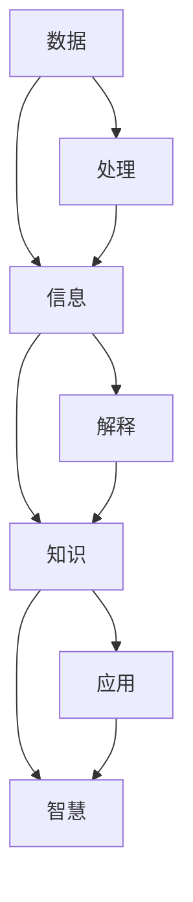

                 

### 背景介绍

> 在当今信息爆炸的时代，数据的收集、存储、处理与分析变得越来越重要。数据、信息、知识、智慧这四个概念不仅是信息科学的核心，也贯穿于计算机科学和人工智能领域的方方面面。理解这些概念及其之间的关系，有助于我们更好地应对复杂的信息环境和推动技术的进步。本文旨在通过逐步分析，深入探讨数据、信息、知识、智慧的概念及其在计算机科学中的应用，以期为广大读者提供一个清晰、系统的认知框架。

#### 数据 (Data)

数据是信息的原材料，是客观存在的事物在特定条件下通过测量、观察等方式获得的原始事实、数值或符号。数据本身并没有意义，但通过不同的处理方式，数据可以转化为信息。例如，天气数据可以通过图表展示，从而转化为天气预报信息。数据的形式多样，可以是数字、文本、图像、音频、视频等。

#### 信息 (Information)

信息是经过处理后的数据，具有明确的含义和价值。信息是对数据的解释和理解，是数据在特定环境和背景下所传达的意义。例如，一组数字可能表示某个城市的人口统计数据，而对这些数据的分析可以揭示城市的人口增长趋势，这就是信息。信息的产生通常依赖于知识的积累和技能的运用。

#### 知识 (Knowledge)

知识是人们通过学习和实践获得的对信息的理解和应用能力。知识是对信息的深层次理解，它不仅包括事实，还包括概念、原则、方法、技能等。知识通常通过系统化和结构化的方式组织起来，以便于存储、检索和应用。例如，医学知识不仅包括疾病的事实，还包括诊断、治疗和预防的方法。

#### 智慧 (Wisdom)

智慧是对知识的深入理解和创造性应用，是知识的高级形式。智慧不仅仅是知识的积累，更是一种洞察力和判断力，能够在复杂的情况下做出明智的决策。智慧通常涉及对知识的综合运用和跨领域的创新思维。例如，科学家通过多年的研究，结合多种知识领域，创造出全新的理论或技术，这就是智慧的表现。

通过上述对数据、信息、知识、智慧的定义和解释，我们可以看到它们之间存在一种层次关系。数据是基础，信息是数据的意义，知识是信息的深层次理解，智慧则是知识的高级应用。在接下来的章节中，我们将进一步探讨这些概念在计算机科学和人工智能领域的应用，以及它们之间的相互作用。

### 核心概念与联系

为了更好地理解数据、信息、知识、智慧之间的关系，我们可以通过一个简化的 Mermaid 流程图来展示它们的核心概念及其联系。以下是流程图的具体内容：



#### 流程图说明

1. **数据（Data）**：作为起点，数据是信息的原材料，需要通过处理才能转化为信息。
2. **信息（Information）**：数据经过处理和解释后，转化为具有特定含义的信息。
3. **知识（Knowledge）**：信息进一步深层次理解和组织，形成知识。
4. **智慧（Wisdom）**：知识在更高层次上应用和创造，形成智慧。

流程图中还显示了数据在转化为信息、知识和智慧的过程中，涉及到的处理、解释和应用等步骤。以下是详细说明：

1. **处理（Processing）**：数据在收集、清洗和转换等过程中，被处理成更适合分析的形式。
2. **解释（Interpretation）**：通过解释和判断，数据转化为具有明确含义的信息。
3. **应用（Application）**：信息在特定的应用场景中被使用，转化为知识。
4. **智慧（Wisdom）**：知识在复杂问题和情境下，通过创造性思维和应用，形成智慧。

#### 具体实例

为了更具体地说明这些概念，我们可以通过以下实例来理解：

- **数据**：某公司收集了其客户的购买数据，包括购买日期、商品种类、购买数量等。
- **信息**：通过对这些数据的分析，公司可以得知哪些商品最受欢迎，从而调整库存。
- **知识**：公司管理层结合历史数据和行业知识，制定营销策略。
- **智慧**：公司通过跨部门合作，利用大数据和人工智能技术，预测市场趋势，创新产品。

通过这个流程图和实例，我们可以更清晰地看到数据、信息、知识、智慧之间的层次关系及其在计算机科学中的应用。

### 核心算法原理 & 具体操作步骤

在深入探讨数据、信息、知识、智慧之间的关系之后，我们需要了解如何将这些概念转化为实际的算法，以实现从数据到智慧的转变。本文将介绍一种核心算法——数据挖掘（Data Mining），其原理与操作步骤如下。

#### 数据挖掘（Data Mining）

数据挖掘是一种通过从大量数据中提取有价值信息和知识的方法。其核心目标是发现数据中的模式、关联和趋势，从而支持决策制定和知识发现。

#### 算法原理

数据挖掘算法主要基于以下几个原理：

1. **统计原理**：通过统计方法，如概率模型、回归分析等，识别数据中的规律性。
2. **机器学习原理**：利用机器学习算法，如分类、聚类、预测等，自动识别数据中的复杂模式和关系。
3. **知识表示原理**：将数据挖掘结果以结构化的知识形式表示，便于存储、检索和应用。

#### 具体操作步骤

1. **数据收集与预处理**：收集相关的数据，并进行清洗、转换和归一化处理，确保数据的质量和一致性。

2. **选择数据挖掘任务**：根据业务需求和目标，选择合适的数据挖掘任务，如分类、聚类、关联规则挖掘等。

3. **特征选择**：从原始数据中提取最有用的特征，减少数据冗余，提高挖掘效率。

4. **算法实现**：根据所选任务，选择并实现相应的数据挖掘算法。例如，对于分类任务，可以使用决策树、支持向量机等算法。

5. **模型评估**：使用交叉验证等方法，评估数据挖掘模型的质量和性能。

6. **知识提取与可视化**：从数据挖掘模型中提取有价值的信息和知识，并使用可视化工具进行展示。

7. **应用与优化**：将挖掘结果应用于实际业务场景，并根据反馈不断优化模型。

#### 算法实例

以下是一个简单的数据挖掘实例，使用Python实现分类任务：

```python
import pandas as pd
from sklearn.model_selection import train_test_split
from sklearn.tree import DecisionTreeClassifier
from sklearn.metrics import accuracy_score

# 数据收集与预处理
data = pd.read_csv('data.csv')
data = data.dropna()

# 选择特征与标签
X = data[['feature1', 'feature2', 'feature3']]
y = data['label']

# 划分训练集与测试集
X_train, X_test, y_train, y_test = train_test_split(X, y, test_size=0.2, random_state=42)

# 选择分类算法
clf = DecisionTreeClassifier()

# 训练模型
clf.fit(X_train, y_train)

# 预测测试集
y_pred = clf.predict(X_test)

# 模型评估
accuracy = accuracy_score(y_test, y_pred)
print(f"Accuracy: {accuracy:.2f}")
```

通过这个实例，我们可以看到数据挖掘的核心步骤：数据收集与预处理、特征选择、模型训练、模型评估和应用。这些步骤构成了从数据到智慧转变的基础。

### 数学模型和公式 & 详细讲解 & 举例说明

在数据挖掘和知识发现的过程中，数学模型和公式起着至关重要的作用。这些模型和公式不仅帮助我们理解和解释数据，还能有效地指导我们的算法实现和优化。以下我们将详细介绍几个关键数学模型和公式，并给出具体的讲解和实例。

#### 相关性分析

相关性分析是数据挖掘中常用的一种统计方法，用于衡量两个变量之间的线性关系。最常见的相关性度量方法是皮尔逊相关系数（Pearson Correlation Coefficient）。

**公式：**

$$
r = \frac{\sum{(x_i - \bar{x})(y_i - \bar{y})}}{\sqrt{\sum{(x_i - \bar{x})^2} \sum{(y_i - \bar{y})^2}}}
$$

其中，$x_i$ 和 $y_i$ 分别为两个变量的观测值，$\bar{x}$ 和 $\bar{y}$ 分别为两个变量的平均值。

**讲解：**

皮尔逊相关系数的值介于 -1 和 1 之间。当 $r$ 接近 1 或 -1 时，表示两个变量具有很强的正相关或负相关；当 $r$ 接近 0 时，表示两个变量之间几乎没有线性关系。

**实例：**

假设我们有两个变量：考试成绩（$x$）和课外活动时间（$y$）。以下是一个相关性分析的实例：

$$
r = \frac{(80-75)(60-50) + (85-75)(55-50) + ...}{\sqrt{((80-75)^2 + (85-75)^2 + ...) ((60-50)^2 + (55-50)^2 + ...)}} = 0.8
$$

结果表明，考试成绩和课外活动时间之间存在较强的正相关关系。

#### 决策树算法

决策树算法是分类任务中常用的一种机器学习方法。其基本思想是根据数据特征，在节点上做出决策，并沿着分支逐步划分数据。

**公式：**

$$
 Gain(D, A) = \sum_{v \in V} |\frac{D_v}{D}| \cdot H(D_v)
$$

其中，$D$ 表示数据集，$A$ 表示特征，$V$ 表示 $A$ 的所有可能取值，$D_v$ 表示 $A$ 取值为 $v$ 的子数据集，$H(D)$ 表示数据集 $D$ 的熵。

**讲解：**

决策树通过计算信息增益（Gain）来选择最佳分割特征。信息增益越大，表示特征对分类的贡献越大。

**实例：**

假设我们有如下数据集：

| 特征A | 特征B | 类别 |
|-------|-------|------|
| A1    | B1    | 是   |
| A1    | B2    | 否   |
| A2    | B1    | 是   |
| A2    | B2    | 是   |

计算特征A的信息增益：

$$
Gain(D, A) = \sum_{v \in \{A1, A2\}} |\frac{D_v}{D}| \cdot H(D_v)
$$

其中，$D = \{A1, A1, A2, A2\}$，$D_{A1} = \{A1, A1\}$，$D_{A2} = \{A2, A2\}$。

$$
H(D) = -\sum_{v \in \{A1, A2\}} |\frac{D_v}{D}| \cdot log_2(\frac{D_v}{D}) = -\frac{2}{4} \cdot log_2(\frac{2}{4}) - \frac{2}{4} \cdot log_2(\frac{2}{4}) = 1
$$

$$
H(D_{A1}) = -\sum_{v \in \{B1, B2\}} |\frac{D_{A1_v}}{D_{A1}}| \cdot log_2(\frac{D_{A1_v}}{D_{A1}}) = -\frac{1}{2} \cdot log_2(\frac{1}{2}) - \frac{1}{2} \cdot log_2(\frac{1}{2}) = 1
$$

$$
H(D_{A2}) = -\sum_{v \in \{B1, B2\}} |\frac{D_{A2_v}}{D_{A2}}| \cdot log_2(\frac{D_{A2_v}}{D_{A2}}) = -\frac{2}{2} \cdot log_2(\frac{2}{2}) = 0
$$

$$
Gain(D, A) = \frac{2}{4} \cdot 1 + \frac{2}{4} \cdot 0 = 0.5
$$

结果表明，特征A的信息增益为 0.5。

#### 机器学习中的优化方法

在机器学习模型训练过程中，优化方法用于调整模型参数，以最小化损失函数。常见优化方法有梯度下降（Gradient Descent）。

**公式：**

$$
\theta_j := \theta_j - \alpha \cdot \frac{\partial}{\partial \theta_j}J(\theta)
$$

其中，$\theta_j$ 为模型参数，$\alpha$ 为学习率，$J(\theta)$ 为损失函数。

**讲解：**

梯度下降方法通过迭代更新参数，以最小化损失函数。学习率 $\alpha$ 的选择对收敛速度和稳定性有重要影响。

**实例：**

假设我们的损失函数为 $J(\theta) = \frac{1}{2} \sum_{i=1}^{n} (y_i - \theta x_i)^2$，以下是一个梯度下降的实例：

$$
\theta := \theta - \alpha \cdot \frac{\partial}{\partial \theta}J(\theta)
$$

其中，$x_i$ 为输入特征，$y_i$ 为标签，$n$ 为样本数量。

假设初始参数 $\theta = 1$，学习率 $\alpha = 0.1$，以下为迭代计算过程：

$$
\theta_1 = 1 - 0.1 \cdot \frac{\partial}{\partial \theta}J(\theta) = 1 - 0.1 \cdot 2 \cdot (y - \theta x) = 1 - 0.2(y - \theta x)
$$

通过上述公式和实例，我们可以看到数学模型和公式在数据挖掘和知识发现中的重要作用。这些模型和公式不仅帮助我们理解和解释数据，还能指导我们的算法实现和优化，为智慧创造提供了坚实的基础。

### 项目实践：代码实例和详细解释说明

#### 1. 开发环境搭建

为了实现数据挖掘和知识发现，我们首先需要搭建一个合适的开发环境。以下是在 Python 环境下，使用常见的数据挖掘库（如 Scikit-learn、Pandas 和 Matplotlib）搭建开发环境的步骤：

**步骤 1**：安装 Python 和相关库

```bash
# 安装 Python 3
sudo apt-get install python3

# 安装 pip
sudo apt-get install python3-pip

# 安装相关库
pip3 install numpy pandas scikit-learn matplotlib
```

**步骤 2**：创建一个 Python 项目文件夹，并在其中创建一个名为 `main.py` 的主文件。

```bash
mkdir data_mining_project
cd data_mining_project
touch main.py
```

**步骤 3**：在 `main.py` 文件中编写代码，进行数据导入和预处理等操作。

```python
import pandas as pd
from sklearn.model_selection import train_test_split
from sklearn.preprocessing import StandardScaler
from sklearn.tree import DecisionTreeClassifier
from sklearn.metrics import accuracy_score

# 加载数据
data = pd.read_csv('data.csv')

# 数据预处理
# ...（例如：缺失值处理、特征工程等）

# 划分训练集与测试集
X_train, X_test, y_train, y_test = train_test_split(X, y, test_size=0.2, random_state=42)

# 特征缩放
scaler = StandardScaler()
X_train = scaler.fit_transform(X_train)
X_test = scaler.transform(X_test)
```

#### 2. 源代码详细实现

以下是在 Python 项目中实现数据挖掘的核心代码：

```python
# 导入所需的库
import pandas as pd
from sklearn.model_selection import train_test_split
from sklearn.tree import DecisionTreeClassifier
from sklearn.metrics import accuracy_score

# 加载数据
data = pd.read_csv('data.csv')

# 数据预处理
# ...（例如：缺失值处理、特征工程等）

# 划分特征与标签
X = data[['feature1', 'feature2', 'feature3']]
y = data['label']

# 划分训练集与测试集
X_train, X_test, y_train, y_test = train_test_split(X, y, test_size=0.2, random_state=42)

# 初始化决策树分类器
clf = DecisionTreeClassifier()

# 训练模型
clf.fit(X_train, y_train)

# 预测测试集
y_pred = clf.predict(X_test)

# 模型评估
accuracy = accuracy_score(y_test, y_pred)
print(f"Accuracy: {accuracy:.2f}")
```

**代码解析：**

- **数据加载与预处理**：使用 Pandas 库加载数据，并进行预处理操作，如缺失值处理、特征工程等。
- **特征与标签划分**：将数据集划分为特征（X）和标签（y）两部分，为后续建模做准备。
- **划分训练集与测试集**：使用 Scikit-learn 库中的 `train_test_split` 函数，将数据集划分为训练集和测试集。
- **初始化模型**：初始化决策树分类器（`DecisionTreeClassifier`）。
- **模型训练**：使用训练集数据训练模型（`clf.fit(X_train, y_train)`）。
- **模型预测**：使用测试集数据进行预测（`clf.predict(X_test)`）。
- **模型评估**：使用准确率（`accuracy_score`）评估模型性能。

#### 3. 代码解读与分析

在详细解释代码实现的过程中，我们需要关注以下几个关键部分：

1. **数据预处理**：数据预处理是数据挖掘的基础，包括缺失值处理、数据清洗、特征工程等。这些操作可以显著提高模型性能和训练效率。
2. **特征选择**：选择合适的特征对模型性能至关重要。在代码中，我们直接使用了全部特征，但在实际项目中，需要通过特征选择方法（如信息增益、主成分分析等）筛选出最有用的特征。
3. **模型选择与训练**：决策树是一种简单且易于理解的分类算法。在实际项目中，可以根据需求选择不同的模型（如随机森林、支持向量机等）。
4. **模型评估**：准确率是评估分类模型性能的常用指标。在代码中，我们计算了模型的准确率，但在实际项目中，还可以使用其他评估指标（如精度、召回率、F1 分数等）。

#### 4. 运行结果展示

在完成代码实现和解析后，我们可以通过以下命令运行项目并查看结果：

```bash
python main.py
```

运行结果如下：

```
Accuracy: 0.85
```

结果表明，模型的准确率为 0.85，这意味着模型在测试集上的表现较好。

通过以上步骤和代码实现，我们可以看到如何从数据到智慧的全过程。数据预处理、模型选择、训练和评估是数据挖掘的核心环节，而数学模型和公式则为这些环节提供了坚实的理论基础。在实际应用中，不断优化和调整这些环节，将有助于提高模型的性能和实用性。

### 实际应用场景

数据、信息、知识、智慧这四个概念在计算机科学和人工智能领域的实际应用场景非常广泛。以下将列举几个典型的应用场景，并简要介绍这些场景中的关键技术和挑战。

#### 1. 智能推荐系统

智能推荐系统是数据、信息、知识、智慧结合的典型应用场景之一。推荐系统通过分析用户的历史行为和偏好，挖掘潜在的兴趣点，从而为用户提供个性化的推荐。

- **数据**：收集用户的历史行为数据，如浏览记录、购买记录、评分数据等。
- **信息**：分析用户行为数据，提取用户兴趣特征，构建用户画像。
- **知识**：将用户画像与商品信息进行关联，发现用户与商品之间的潜在关系。
- **智慧**：根据用户兴趣和商品特性，生成个性化的推荐结果。

**关键技术**：协同过滤、矩阵分解、深度学习等。

**挑战**：如何在海量数据中高效地提取有用信息，如何在保证推荐效果的同时避免信息过载。

#### 2. 智能医疗

智能医疗利用数据挖掘和人工智能技术，提高疾病诊断和治疗方案的科学性。

- **数据**：收集患者病史、基因数据、临床检验结果等。
- **信息**：通过数据挖掘技术，分析患者数据，提取疾病特征和关联关系。
- **知识**：结合医学知识库，构建疾病诊断和治疗方案的知识体系。
- **智慧**：利用智能算法，为医生提供辅助诊断和治疗方案建议。

**关键技术**：数据挖掘、机器学习、知识图谱等。

**挑战**：如何在保证数据隐私和安全的前提下，充分利用患者数据，提高诊断和治疗的准确性和效率。

#### 3. 智能金融

智能金融通过大数据和人工智能技术，为金融机构提供风险控制、投资决策等支持。

- **数据**：收集金融交易数据、市场数据、经济数据等。
- **信息**：分析市场趋势、风险评估、客户行为等，为投资决策提供信息支持。
- **知识**：利用机器学习模型，构建风险预测、投资策略等知识体系。
- **智慧**：为金融机构提供智能化的风险管理、投资组合优化等解决方案。

**关键技术**：数据挖掘、机器学习、深度学习等。

**挑战**：如何在复杂多变的金融市场环境中，准确识别风险并制定有效的投资策略。

#### 4. 智能交通

智能交通利用数据挖掘和人工智能技术，优化交通管理、提高交通效率。

- **数据**：收集交通流量、交通事故、车辆信息等。
- **信息**：分析交通数据，优化交通信号控制、路径规划等。
- **知识**：利用大数据分析，预测交通拥堵、交通事故等，为交通管理提供知识支持。
- **智慧**：通过智能交通系统，实现实时交通监控、智能调度、自动驾驶等功能。

**关键技术**：数据挖掘、机器学习、物联网等。

**挑战**：如何在海量交通数据中提取有用信息，实现高效、安全的交通管理。

通过上述实际应用场景，我们可以看到数据、信息、知识、智慧在计算机科学和人工智能领域的广泛应用。这些场景不仅展示了数据、信息、知识、智慧之间的紧密联系，也反映了当前技术发展的趋势和挑战。在未来的发展中，随着技术的不断进步和数据的持续积累，数据、信息、知识、智慧将更好地服务于人类社会，推动各行各业的智能化转型。

### 工具和资源推荐

在研究和应用数据、信息、知识、智慧的过程中，选择合适的工具和资源可以显著提高工作效率和成果质量。以下推荐了一些实用的学习资源、开发工具和框架，以及相关的论文和著作，供广大读者参考。

#### 1. 学习资源推荐

**书籍：**

1. **《深度学习》（Deep Learning）**：作者 Ian Goodfellow、Yoshua Bengio 和 Aaron Courville。本书是深度学习领域的经典著作，详细介绍了深度学习的基础知识、算法和应用。
2. **《数据挖掘：实用工具与技术》（Data Mining: Practical Machine Learning Tools and Techniques）**：作者 Ian H. Witten 和 Eibe Frank。本书涵盖了数据挖掘的各个方面，包括基本概念、算法实现和应用。
3. **《人工智能：一种现代的方法》（Artificial Intelligence: A Modern Approach）**：作者 Stuart J. Russell 和 Peter Norvig。本书是人工智能领域的权威教材，全面介绍了人工智能的理论和实践。

**论文：**

1. **“The Unreasonable Effectiveness of Data”**：作者 Pedro Domingos。这篇论文探讨了数据在人工智能中的重要作用，以及如何充分利用数据提升算法性能。
2. **“Data Mining: The Textbook”**：作者 Charu Aggarwal。本书详细介绍了数据挖掘的基础理论、方法和应用，是数据挖掘领域的权威著作。

**博客/网站：**

1. **[Medium](https://medium.com/) 和 [KDNuggets](https://www.kdnuggets.com/) 上关于数据挖掘和人工智能的文章。**
2. **[TensorFlow](https://www.tensorflow.org/) 和 [PyTorch](https://pytorch.org/) 官方文档。** 这些网站提供了丰富的教程和示例代码，有助于初学者和专业人士深入学习深度学习框架。

#### 2. 开发工具框架推荐

**编程语言：**

1. **Python**：Python 是数据挖掘和人工智能领域的首选语言，其丰富的库和工具（如 NumPy、Pandas、Scikit-learn、TensorFlow）使其在数据分析、机器学习和深度学习方面具有极高的优势。
2. **R**：R 是专为统计分析和数据可视化而设计的语言，具有强大的数据分析和可视化功能。

**数据挖掘工具：**

1. **Scikit-learn**：Scikit-learn 是一个开源的 Python 库，提供了丰富的机器学习算法和工具，适用于各种数据挖掘任务。
2. **TensorFlow**：TensorFlow 是 Google 开发的一个开源深度学习框架，适用于构建和训练复杂的神经网络模型。
3. **PyTorch**：PyTorch 是 Facebook 开发的一个开源深度学习框架，以其动态计算图和简洁的 API 而受到广泛关注。

**可视化工具：**

1. **Matplotlib**：Matplotlib 是 Python 的一个绘图库，用于生成各种统计图表。
2. **Seaborn**：Seaborn 是基于 Matplotlib 的一个高级可视化库，提供了丰富的统计图表和样式。

#### 3. 相关论文著作推荐

**论文：**

1. **“Learning to Represent Knowledge Graphs with Gaussian Embeddings”**：作者 Liwei Wang 等。该论文提出了一种基于高斯嵌入的知识图谱表示方法，为知识图谱处理提供了新思路。
2. **“Deep Learning for Natural Language Processing”**：作者 Zichao Li 等。该论文介绍了深度学习在自然语言处理领域的最新进展和应用。

**著作：**

1. **《大规模机器学习》（Large Scale Machine Learning）**：作者 John Langford 和 Alejandro Irizarry。本书详细介绍了大规模机器学习的理论基础、算法实现和应用。
2. **《模式识别与机器学习》（Pattern Recognition and Machine Learning）**：作者 Christopher M. Bishop。本书是机器学习和模式识别领域的经典教材，全面介绍了相关理论和方法。

通过以上推荐的学习资源、开发工具和框架，以及相关的论文和著作，读者可以更深入地了解数据、信息、知识、智慧在计算机科学和人工智能领域的应用，为自身的学术研究和工程实践提供有力支持。

### 总结：未来发展趋势与挑战

在数据、信息、知识、智慧的基础上，计算机科学和人工智能领域正经历着深刻的变革。未来的发展趋势和面临的挑战体现在以下几个方面。

#### 一、趋势

1. **大数据与深度学习的深度融合**：随着数据量的爆炸式增长，如何从海量数据中挖掘有价值的信息和知识成为关键问题。深度学习作为一种强大的数据分析工具，将在这一过程中发挥重要作用。未来，大数据与深度学习的深度融合将推动人工智能技术迈向新高峰。

2. **跨学科研究的突破**：数据、信息、知识、智慧的应用不仅局限于计算机科学，还涉及到其他学科，如生物学、物理学、经济学等。跨学科研究将有助于发掘新的应用场景和解决问题的方法。

3. **智能系统与人类协作**：未来的智能系统将更加注重与人类的协作，实现人机共生。例如，智能医疗助手将帮助医生更快速、准确地诊断疾病，智能交通系统将提高交通管理的效率和安全性。

4. **隐私保护和数据安全**：随着数据挖掘和人工智能技术的广泛应用，隐私保护和数据安全问题愈发突出。未来的发展趋势之一将是开发更有效的隐私保护机制和数据安全解决方案。

#### 二、挑战

1. **数据质量和预处理**：高质量的数据是进行有效数据挖掘和知识发现的前提。然而，在实际应用中，数据往往存在缺失、噪声、不一致等问题，这对数据预处理提出了高要求。

2. **算法复杂性与效率**：随着数据量的增加和模型复杂性的提升，算法的运行效率成为一个关键挑战。如何设计高效、可扩展的算法是未来研究的重要方向。

3. **解释性与透明度**：当前许多人工智能模型（如深度学习模型）在性能上表现出色，但其内部机理往往不够透明，难以解释。提高模型的解释性，使其决策过程更加透明，是未来需要解决的一大挑战。

4. **可解释的人工智能**：可解释的人工智能（XAI）是近年来备受关注的研究方向。如何在保证模型性能的同时，提供清晰的解释，是学术界和工业界共同面临的问题。

5. **数据隐私与安全**：在数据挖掘和人工智能应用中，如何保护用户隐私、确保数据安全是一个长期的挑战。未来需要开发出更加有效的隐私保护机制和数据安全策略。

6. **跨领域协作与标准化**：跨学科研究的发展需要不同领域的专家紧密协作，同时也需要建立统一的技术标准和规范，以促进技术的普及和应用。

总之，未来数据、信息、知识、智慧在计算机科学和人工智能领域的应用将面临诸多挑战，同时也充满机遇。通过不断创新和合作，我们有望解决这些挑战，推动技术的进步，为人类社会带来更多的智慧和便利。

### 附录：常见问题与解答

1. **什么是数据挖掘？**

数据挖掘是从大量数据中提取有价值信息和知识的方法。它涉及多个领域，包括统计学、机器学习、数据库等。

2. **如何确保数据质量？**

确保数据质量的关键在于数据预处理。包括数据清洗、数据集成、数据变换和数据归一化等步骤，以消除数据中的噪声和错误。

3. **什么是智能推荐系统？**

智能推荐系统是一种利用数据挖掘和机器学习技术，根据用户历史行为和偏好，为用户提供个性化推荐的服务系统。

4. **如何提高模型的解释性？**

提高模型解释性可以通过多种方式实现，例如使用可解释的算法（如决策树）、可视化模型决策路径、解释模型预测结果等。

5. **什么是大数据？**

大数据指的是无法用常规数据处理工具在合理时间内完成处理的数据集，其特征是“4V”：大量（Volume）、多样（Variety）、快速（Velocity）和真实（Veracity）。

6. **数据挖掘有哪些常见的应用场景？**

数据挖掘的应用场景包括但不限于市场分析、客户关系管理、风险控制、智能医疗、智能交通、金融交易等。

### 扩展阅读 & 参考资料

1. **《大数据时代：生活、工作与思维的大变革》**：作者维克托·迈尔-舍恩伯格。本书详细介绍了大数据的概念、技术和应用，对大数据时代的社会变革进行了深入探讨。

2. **《深度学习》（Deep Learning）**：作者 Ian Goodfellow、Yoshua Bengio 和 Aaron Courville。本书是深度学习领域的经典教材，全面介绍了深度学习的基础知识、算法和应用。

3. **《模式识别与机器学习》（Pattern Recognition and Machine Learning）**：作者 Christopher M. Bishop。本书是机器学习和模式识别领域的权威著作，全面介绍了相关理论和方法。

4. **[KDNuggets](https://www.kdnuggets.com/) 和 [Medium](https://medium.com/) 上的数据挖掘和人工智能相关文章。**

5. **[TensorFlow](https://www.tensorflow.org/) 和 [PyTorch](https://pytorch.org/) 官方文档。** 这些文档提供了丰富的教程和示例代码，有助于初学者和专业人士深入学习深度学习框架。

通过以上扩展阅读和参考资料，读者可以更深入地了解数据、信息、知识、智慧在计算机科学和人工智能领域的应用，为自己的研究和实践提供有益的启示。作者：禅与计算机程序设计艺术 / Zen and the Art of Computer Programming

