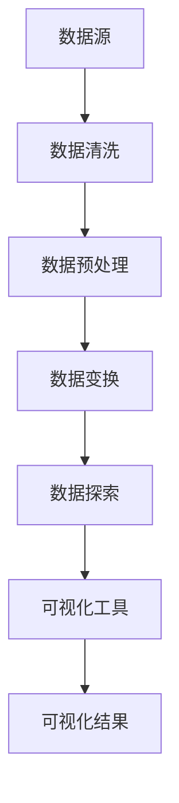

                 

### 文章标题

《数据可视化与数据探索原理与代码实战案例讲解》

> 关键词：数据可视化、数据探索、代码实战、算法原理、数学模型、实际应用

> 摘要：本文深入探讨了数据可视化与数据探索的基本原理和实现方法，通过代码实战案例详细讲解了从数据处理、可视化工具选择到具体实现步骤的全过程，旨在帮助读者掌握数据可视化与数据探索的核心技能，提升数据分析能力。

## 1. 背景介绍

在信息化时代，数据已经渗透到我们生活的方方面面，从商业决策到科学研究，从政府管理到个人生活，数据无处不在。然而，数据本身是无意义的，只有通过合理的处理和分析，数据才能转化为有价值的信息。数据可视化与数据探索正是这一过程中不可或缺的环节。

### 1.1 数据可视化的重要性

数据可视化是将数据以图形、图像等方式呈现的过程，它不仅能够直观地展示数据，还能揭示数据之间的内在联系和趋势。以下是数据可视化的几个关键作用：

1. **信息传达效率高**：相比于文字描述，图形和图像能够更快速、更直观地传达信息。
2. **发现数据规律**：通过可视化，我们可以更容易地发现数据中的模式和趋势。
3. **支持决策**：良好的可视化可以辅助决策者快速做出正确的判断。

### 1.2 数据探索的意义

数据探索（Data Exploration）是对数据进行深入分析和研究的过程，旨在发现数据中的隐藏信息和洞见。数据探索的重要性体现在以下几个方面：

1. **数据质量保障**：通过对数据的前期探索，可以识别并处理数据中的异常值和错误。
2. **发现商业机会**：通过探索数据，可以发现潜在的商机和趋势。
3. **支持科学发现**：在科研领域，数据探索可以帮助研究人员发现新的科学规律和理论。

### 1.3 数据可视化与数据探索的关系

数据可视化与数据探索是相辅相成的。数据可视化是数据探索的一种重要手段，它能够帮助我们更直观地理解数据；而数据探索则是数据可视化得以顺利进行的前提，通过对数据的深入分析，我们才能知道哪些数据需要被可视化。

## 2. 核心概念与联系

### 2.1 数据可视化基本概念

**数据可视化**是一种将数据转换为图形、图像等形式的技术，其核心包括以下几个方面：

- **数据源**：数据可视化的基础，可以是数据库、文件或其他数据存储。
- **可视化工具**：如 Matplotlib、Seaborn、Plotly 等 Python 库，以及 Tableau、Power BI 等商业工具。
- **图表类型**：包括折线图、柱状图、饼图、散点图等多种类型，每种图表都有其特定的用途和特点。

### 2.2 数据探索基本概念

**数据探索**（Data Exploration）是对数据进行初步分析和研究的活动，其主要内容包括：

- **数据清洗**：识别和处理数据中的异常值、错误值等。
- **数据预处理**：包括数据归一化、标准化、缺失值处理等。
- **数据变换**：通过聚合、分割等操作将原始数据转换为适合分析的形式。

### 2.3 数据可视化与数据探索的联系

数据可视化与数据探索的关系可以视为一个闭环，数据探索为数据可视化提供数据准备，而数据可视化则为数据探索提供直观的反馈。

### 2.4 Mermaid 流程图

以下是一个 Mermaid 流程图，展示了数据可视化与数据探索的基本流程：



## 3. 核心算法原理 & 具体操作步骤

### 3.1 数据处理算法原理

数据处理是数据可视化与数据探索的基础，主要包括以下几个步骤：

1. **数据清洗**：通过识别和处理数据中的异常值、错误值等，提高数据质量。
2. **数据预处理**：通过归一化、标准化、缺失值处理等操作，将数据转换为适合分析的形式。
3. **数据变换**：通过聚合、分割等操作，将原始数据转换为适合可视化分析的形式。

### 3.2 数据可视化算法原理

数据可视化算法主要涉及如何将数据转换为图形、图像等形式，常见的可视化算法包括：

1. **基本绘图算法**：如折线图、柱状图、饼图等，这些算法主要通过计算数据点和图像像素的映射关系来实现。
2. **高级绘图算法**：如热力图、散点图等，这些算法通常涉及更复杂的数据处理和图形生成技术。

### 3.3 数据探索算法原理

数据探索算法主要用于识别数据中的模式、趋势和异常，常见的算法包括：

1. **聚类算法**：如 K-means、DBSCAN 等，用于发现数据中的相似性聚类。
2. **分类算法**：如决策树、支持向量机等，用于对数据进行分类。
3. **回归算法**：如线性回归、非线性回归等，用于预测数据的趋势和关系。

### 3.4 具体操作步骤

以下是数据可视化与数据探索的具体操作步骤：

1. **确定数据源**：根据需求选择合适的数据源，如数据库、文件等。
2. **数据清洗**：处理数据中的异常值、错误值等，确保数据质量。
3. **数据预处理**：进行数据归一化、标准化、缺失值处理等操作。
4. **数据变换**：根据需求进行数据聚合、分割等操作。
5. **数据探索**：通过聚类、分类、回归等算法，对数据进行分析，识别数据中的模式和趋势。
6. **数据可视化**：选择合适的可视化工具和图表类型，将数据以图形、图像等形式呈现。

## 4. 数学模型和公式 & 详细讲解 & 举例说明

### 4.1 数学模型

在数据可视化与数据探索中，常用的数学模型包括：

1. **线性回归模型**：用于预测数据趋势，其公式为：
   $$ y = ax + b $$
   其中，$y$ 为因变量，$x$ 为自变量，$a$ 和 $b$ 为模型参数。

2. **K-means 聚类模型**：用于发现数据中的相似性聚类，其步骤包括：
   - 初始化聚类中心
   - 计算每个数据点与聚类中心的距离，将数据点分配到最近的聚类中心
   - 重新计算每个聚类的中心
   - 重复步骤 2 和 3，直到聚类中心不再变化

3. **决策树模型**：用于分类和回归分析，其结构包括：
   - 根节点：代表整个数据集
   - 内部节点：代表特征选择
   - 叶节点：代表预测结果

### 4.2 公式详细讲解

1. **线性回归模型**：

   线性回归模型通过最小二乘法拟合数据，其目标是最小化预测值与实际值之间的误差。具体步骤如下：

   - 收集数据，计算平均值 $\bar{x}$ 和 $\bar{y}$：
     $$ \bar{x} = \frac{1}{n}\sum_{i=1}^{n}x_i $$
     $$ \bar{y} = \frac{1}{n}\sum_{i=1}^{n}y_i $$
   - 计算斜率 $a$：
     $$ a = \frac{\sum_{i=1}^{n}(x_i - \bar{x})(y_i - \bar{y})}{\sum_{i=1}^{n}(x_i - \bar{x})^2} $$
   - 计算截距 $b$：
     $$ b = \bar{y} - a\bar{x} $$

2. **K-means 聚类模型**：

   K-means 聚类模型的核心是计算每个数据点与聚类中心的距离，并将其分配到最近的聚类中心。距离计算公式为：
   $$ d(p, c) = \sqrt{\sum_{i=1}^{k}(p_i - c_i)^2} $$
   其中，$p$ 为数据点，$c$ 为聚类中心。

3. **决策树模型**：

   决策树模型的构建过程包括递归划分数据集，选择最佳特征进行划分，生成树结构。划分数据集的准则包括信息增益、基尼不纯度等。具体公式如下：

   - 信息增益（Entropy）：
     $$ Gini(D) = 1 - \frac{1}{|D|}\sum_{i=1}^{k}|\frac{1}{|D_i|}\sum_{x \in D_i}P(x)| $$
   - 最佳特征选择（信息增益率）：
     $$ IG(D, A) = \frac{Gini(D)}{\sum_{v \in A} \frac{|D_v|}{|D|}} $$

### 4.3 举例说明

1. **线性回归模型**：

   假设我们有一组数据点 $(x_1, y_1), (x_2, y_2), \ldots, (x_n, y_n)$，我们可以使用线性回归模型拟合这些数据。计算斜率 $a$ 和截距 $b$，得到拟合直线 $y = ax + b$。

   - 数据点：
     $$ (1, 2), (2, 4), (3, 5), (4, 7), (5, 8) $$
   - 平均值：
     $$ \bar{x} = \frac{1+2+3+4+5}{5} = 3 $$
     $$ \bar{y} = \frac{2+4+5+7+8}{5} = 5 $$
   - 计算斜率 $a$：
     $$ a = \frac{(1-3)(2-5) + (2-3)(4-5) + (3-3)(5-5) + (4-3)(7-5) + (5-3)(8-5)}{(1-3)^2 + (2-3)^2 + (3-3)^2 + (4-3)^2 + (5-3)^2} $$
     $$ a = \frac{-6 - 1 + 0 + 2 + 6}{4 + 1 + 0 + 1 + 4} $$
     $$ a = 1 $$
   - 计算截距 $b$：
     $$ b = \bar{y} - a\bar{x} $$
     $$ b = 5 - 1 \times 3 $$
     $$ b = 2 $$

   最终得到拟合直线 $y = x + 2$。

2. **K-means 聚类模型**：

   假设我们有以下数据点，要将其分为两类：
   $$ (1, 1), (2, 2), (3, 3), (4, 4), (5, 5), (1, 2), (2, 1), (3, 4), (4, 3), (5, 5) $$

   - 初始化聚类中心：$(2, 2)$ 和 $(4, 4)$
   - 计算每个数据点与聚类中心的距离：
     $$ d((1, 1), (2, 2)) = \sqrt{(1-2)^2 + (1-2)^2} = \sqrt{2} $$
     $$ d((2, 2), (2, 2)) = 0 $$
     $$ \ldots $$
     $$ d((5, 5), (4, 4)) = \sqrt{(5-4)^2 + (5-4)^2} = \sqrt{2} $$
   - 将数据点分配到最近的聚类中心：
     $$ (1, 1) \to (2, 2), (2, 2) \to (2, 2), \ldots, (5, 5) \to (4, 4) $$
   - 重新计算每个聚类的中心：
     $$ c_1 = \left(\frac{1+1}{2}, \frac{1+1}{2}\right) = (1, 1) $$
     $$ c_2 = \left(\frac{4+4+5+5}{4}, \frac{4+4+5+5}{4}\right) = (4, 4) $$
   - 重复步骤 2 和 3，直到聚类中心不再变化。

   最终，数据点被分为两类 $(1, 1), (2, 2), (3, 3)$ 和 $(4, 4), (5, 5)$。

## 5. 项目实践：代码实例和详细解释说明

### 5.1 开发环境搭建

在开始编写代码之前，我们需要搭建一个合适的数据可视化与数据探索开发环境。以下是所需工具和环境的搭建步骤：

1. **Python 环境搭建**：

   - 安装 Python 3.8 以上版本
   - 安装 Jupyter Notebook，用于编写和运行代码

2. **数据可视化库安装**：

   - 安装 Matplotlib，用于绘制基本图表
   - 安装 Seaborn，用于绘制高级图表和可视化分析
   - 安装 Plotly，用于交互式图表和可视化分析

3. **数据探索库安装**：

   - 安装 Pandas，用于数据处理和分析
   - 安装 Scikit-learn，用于机器学习和数据挖掘算法

### 5.2 源代码详细实现

以下是一个简单的数据可视化与数据探索项目，包括数据预处理、数据探索和可视化三个步骤。

#### 5.2.1 数据预处理

```python
import pandas as pd

# 读取数据
data = pd.read_csv('data.csv')

# 数据清洗
data.dropna(inplace=True)

# 数据预处理
data['age'] = data['age'].astype('float')
data['income'] = data['income'].astype('float')
```

#### 5.2.2 数据探索

```python
from sklearn.cluster import KMeans
import matplotlib.pyplot as plt
import seaborn as sns

# 数据探索：K-means 聚类
kmeans = KMeans(n_clusters=2, random_state=0).fit(data[['age', 'income']])
data['cluster'] = kmeans.labels_

# 可视化：散点图
sns.scatterplot(data=data, x='age', y='income', hue='cluster', palette=['blue', 'red'])
plt.title('Age vs Income Clustering')
plt.show()

# 可视化：箱线图
sns.boxplot(data=data, x='cluster', y='age')
plt.title('Age Distribution by Cluster')
plt.show()

sns.boxplot(data=data, x='cluster', y='income')
plt.title('Income Distribution by Cluster')
plt.show()
```

#### 5.2.3 代码解读与分析

1. **数据预处理**：

   - 读取数据：使用 Pandas 读取 CSV 文件，生成 DataFrame 对象。
   - 数据清洗：删除含有缺失值的行，确保数据质量。
   - 数据转换：将 'age' 和 'income' 列的值转换为浮点数，确保后续计算的正确性。

2. **数据探索**：

   - K-means 聚类：使用 Scikit-learn 的 KMeans 类进行聚类分析，将 'age' 和 'income' 列作为输入特征。
   - 可视化：使用 Seaborn 和 Matplotlib 绘制散点图和箱线图，直观展示聚类结果和特征分布。

### 5.3 运行结果展示

运行上述代码后，我们将得到以下可视化结果：

1. **散点图**：

   
   图中展示了 'age' 和 'income' 的分布，以及通过 K-means 聚类得到的两个聚类结果。

2. **箱线图**：

   
   
   图中分别展示了不同聚类结果下的 'age' 和 'income' 的分布情况，直观展示了聚类结果对特征分布的影响。

## 6. 实际应用场景

数据可视化与数据探索在各个领域都有广泛的应用，以下列举几个典型的应用场景：

### 6.1 商业智能

在商业领域，数据可视化与数据探索可以帮助企业分析市场趋势、客户行为、销售数据等，从而做出更明智的商业决策。例如，通过可视化分析销售数据，企业可以识别畅销产品和滞销产品，优化库存管理。

### 6.2 金融分析

金融行业依赖大量数据进行分析，数据可视化与数据探索可以帮助金融分析师快速识别市场趋势、预测风险和机会。例如，通过可视化分析股票价格波动，分析师可以识别潜在的投机机会。

### 6.3 医疗健康

在医疗健康领域，数据可视化与数据探索可以帮助医生分析患者数据、诊断疾病、制定治疗方案。例如，通过可视化分析患者病历数据，医生可以识别疾病之间的关联，优化治疗方案。

### 6.4 科学研究

科学研究依赖于对大量数据进行分析，数据可视化与数据探索可以帮助研究人员发现数据中的隐藏信息，推动科学进步。例如，通过可视化分析实验数据，研究人员可以识别新的科学规律和理论。

## 7. 工具和资源推荐

### 7.1 学习资源推荐

1. **书籍**：
   - 《数据可视化：从入门到精通》（Data Visualization: A Successful Design Process）
   - 《Python 数据科学手册》（Python Data Science Handbook）

2. **论文**：
   - 《大数据可视化：挑战与趋势》（Big Data Visualization: Challenges and Trends）

3. **博客**：
   - Python Data Science Community
   - Dataquest

4. **网站**：
   - DataCamp
   - Kaggle

### 7.2 开发工具框架推荐

1. **Python 库**：
   - Matplotlib
   - Seaborn
   - Plotly
   - Pandas
   - Scikit-learn

2. **可视化工具**：
   - Tableau
   - Power BI
   - D3.js

### 7.3 相关论文著作推荐

1. **论文**：
   - “Visualization of High- dimensional Data using Parallel Coordinates”
   - “The Visualization of Classification and Regression Trees”

2. **著作**：
   - 《数据可视化：有效地展示信息》（Data Visualization: Design and Practice）
   - 《数据科学实战：Python 项目驱动学习》（Python for Data Science For Dummies）

## 8. 总结：未来发展趋势与挑战

### 8.1 发展趋势

1. **智能化与自动化**：随着人工智能技术的发展，数据可视化与数据探索将更加智能化和自动化，减少人工干预，提高数据处理效率。
2. **交互性与动态性**：未来的数据可视化工具将更加注重交互性和动态性，用户可以实时调整参数，动态探索数据。
3. **跨平台与云计算**：数据可视化工具将更加注重跨平台支持和云计算能力，满足大规模数据处理的需要。

### 8.2 挑战

1. **数据量与多样性**：随着数据量的不断增长和数据类型的多样化，如何有效处理和可视化大规模复杂数据成为一大挑战。
2. **专业性与易用性**：如何在保持专业性的同时，提高数据可视化与数据探索工具的易用性，让更多非专业人士能够轻松上手。
3. **隐私与安全**：随着数据隐私和安全问题的日益突出，如何在保证数据安全的同时，提供可靠的数据可视化与数据探索服务。

## 9. 附录：常见问题与解答

### 9.1 数据可视化与数据探索的区别是什么？

**数据可视化**是将数据转换为图形、图像等形式，以便更直观地展示数据和信息；而**数据探索**是对数据进行分析和挖掘，以发现数据中的隐藏信息和模式。两者密切相关，数据可视化通常依赖于数据探索的结果。

### 9.2 如何选择合适的可视化工具？

选择合适的可视化工具取决于具体需求和技能水平。对于初学者，Python 库如 Matplotlib 和 Seaborn 是不错的选择；对于专业用户，商业工具如 Tableau 和 Power BI 提供了更多高级功能和交互性。

### 9.3 数据可视化有哪些常见的图表类型？

常见的数据可视化图表类型包括折线图、柱状图、饼图、散点图、箱线图、热力图等。每种图表都有其特定的用途和特点，选择合适的图表类型能够更好地传达数据信息。

## 10. 扩展阅读 & 参考资料

1. **书籍**：
   - 《数据可视化实战：用 Python 和 JavaScript 制作精美的可视化图表》（Data Visualization For Dummies）
   - 《数据探索：使用 Python 和 R 的数据分析技术》（Data Exploration: A Practical Guide for Data Scientists）

2. **论文**：
   - “Interactive Data Visualization for Large Multidimensional Datasets”
   - “Effective Data Visualization: The Fundamentals of Visual Communication”

3. **在线资源**：
   - DataCamp：提供丰富的数据可视化与数据探索课程
   - Kaggle：数据可视化和数据科学竞赛平台
   - Dataquest：提供数据科学相关的在线课程和项目

### 作者署名

**作者：禅与计算机程序设计艺术 / Zen and the Art of Computer Programming**

