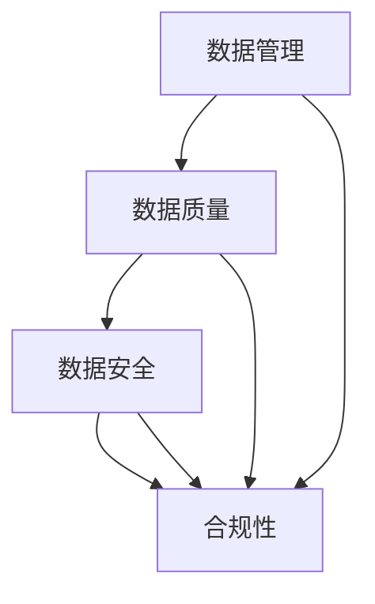

                 

### 1. 背景介绍

数据治理（Data Governance）是指在组织内建立一套有效的策略、过程和规则，以确保数据的质量、完整性、可用性和合规性，从而支持企业的决策制定、运营优化和风险管理。随着大数据、云计算、物联网等技术的快速发展，数据已经成为企业最重要的资产之一。然而，数据量的爆炸式增长和数据来源的多样化，使得数据治理的重要性愈发凸显。

首先，数据治理的概念并非全新的术语。早在20世纪90年代，随着企业对数据仓库和数据挖掘的需求增加，数据治理开始受到关注。然而，随着技术的进步，数据治理的内涵和外延也在不断扩展。现在，数据治理不仅关注数据的存储和管理，还包括数据的采集、处理、共享、分析以及安全等方面。

数据治理的重要性体现在多个方面。首先，数据治理有助于提高数据质量，确保数据的准确性和一致性，从而为企业的决策提供可靠的数据支持。其次，数据治理有助于确保数据的合规性，遵守各种数据保护法规和隐私政策，降低企业面临的法律风险。此外，数据治理还可以促进数据共享和协作，提高企业的运营效率，创造更大的商业价值。

然而，尽管数据治理的重要性被广泛认可，但在实际操作中，许多企业仍然面临着诸多挑战。例如，缺乏明确的数据治理策略和流程，数据质量难以保证，数据孤岛现象普遍，以及数据安全风险等问题。这些问题不仅影响了数据治理的效果，也阻碍了企业数据价值的最大化。

本文将围绕数据治理展开，探讨如何建立健全的数据管理制度，以应对当前的数据挑战。我们将首先介绍数据治理的核心概念和联系，接着深入分析核心算法原理和操作步骤，然后通过具体的项目实践，展示数据治理的实际应用。随后，我们将探讨数据治理在实际应用场景中的具体表现，并提供相关的工具和资源推荐。最后，本文将总结数据治理的未来发展趋势与挑战，并给出常见问题的解答。

通过本文的阅读，读者将能够全面了解数据治理的概念、重要性以及具体实施方法，从而为企业建立健全的数据管理制度提供有益的参考。

### 2. 核心概念与联系

为了深入理解数据治理，我们需要首先明确几个核心概念，并探讨它们之间的相互联系。这些核心概念包括数据管理、数据质量、数据安全和合规性等。

#### 数据管理

数据管理是指对数据的生命周期进行全面的规划、组织、控制和维护，确保数据能够被有效地存储、访问、使用和保护。数据管理包括数据收集、存储、处理、传输、分析和归档等多个环节。数据管理的目标是通过优化数据流程，提高数据的质量和可用性，从而支持企业的业务需求。

数据管理在数据治理中扮演着至关重要的角色。首先，数据管理为数据治理提供了基础框架，确保数据在生命周期中的各个环节都能得到妥善处理。其次，数据管理可以帮助企业识别和解决数据质量问题，从而提高数据的价值。此外，数据管理还涉及到数据安全和合规性问题，确保企业在使用数据时符合相关法律法规的要求。

#### 数据质量

数据质量是指数据的准确性、完整性、一致性、及时性和可靠性等方面的属性。高质量的数据是数据治理成功的关键。如果数据存在误差或不完整，将直接影响企业的决策和分析结果。

数据质量与数据治理紧密相关。数据治理通过制定数据质量标准和流程，监控和改进数据质量，确保数据在整个生命周期内都能保持高质量。具体来说，数据治理包括以下措施：

1. **数据清洗**：识别和纠正数据中的错误和不一致之处。
2. **数据整合**：将来自不同来源的数据进行合并和整合，确保数据的一致性。
3. **数据标准化**：制定统一的数据格式和命名规则，提高数据的可读性和可操作性。
4. **数据验证**：通过校验规则和算法，确保数据的准确性和完整性。

#### 数据安全

数据安全是指保护数据免受未经授权的访问、使用、披露、破坏或修改的措施。随着数据量的增加和数据类型的多样化，数据安全已经成为数据治理中的一个重要方面。

数据安全与数据治理的关系在于，数据治理不仅关注数据的存储和管理，还包括数据的安全保护。具体措施包括：

1. **访问控制**：通过身份验证和权限管理，确保只有授权用户可以访问特定数据。
2. **加密**：对敏感数据进行加密处理，防止数据在传输和存储过程中被窃取。
3. **备份与恢复**：定期备份数据，并在数据丢失或损坏时能够迅速恢复。
4. **安全审计**：监控数据访问和使用情况，确保数据的安全性和合规性。

#### 合规性

合规性是指企业在数据处理过程中遵守相关法律法规和政策的要求。随着数据隐私保护法规的日益严格，如欧盟的《通用数据保护条例》（GDPR）和《加州消费者隐私法案》（CCPA），合规性已经成为数据治理中的重要考虑因素。

合规性数据治理包括以下几个方面：

1. **数据隐私保护**：确保企业在处理个人数据时遵守隐私保护法规，如收集、使用和共享数据的透明度要求。
2. **数据分类**：根据数据的重要性和敏感性，对数据进行分类，并采取相应的保护措施。
3. **合规审查**：定期审查企业的数据处理流程，确保符合相关法律法规的要求。
4. **合规培训**：为员工提供合规性培训，提高他们的法律意识和合规操作能力。

#### 关系与交互

数据治理的核心概念之间存在着紧密的联系和交互。例如，数据质量是数据治理的基础，没有高质量的数据，数据治理难以实现。数据安全是数据治理的保障，确保数据在整个生命周期中都能得到有效保护。合规性则是数据治理的底线，确保企业在数据处理过程中不违反法律法规。

在数据治理的框架中，数据管理、数据质量、数据安全和合规性相互支撑，共同构成了一个完整的数据治理体系。通过有效的数据治理，企业能够确保数据的质量和安全，实现数据的价值最大化，并降低数据风险。

为了更直观地理解这些核心概念之间的关系，我们可以使用Mermaid流程图进行展示。



通过上述核心概念及其相互联系的介绍，我们可以更好地理解数据治理的整体架构和实施要点。在接下来的部分，我们将深入探讨数据治理的核心算法原理和具体操作步骤，以帮助读者更好地理解和应用数据治理的方法。

#### 2.1 数据治理框架

在深入探讨数据治理的核心算法原理和具体操作步骤之前，有必要首先构建一个清晰的数据治理框架。这一框架将帮助我们系统地理解和实施数据治理策略，确保数据在整个生命周期中得到有效的管理。

数据治理框架通常包括以下几个关键组成部分：

1. **治理组织**：负责数据治理的整体规划和执行。治理组织通常由高级管理层、数据治理委员会和数据管理员组成。高级管理层提供战略方向和资源支持，数据治理委员会负责制定数据治理政策和标准，数据管理员则负责具体实施和监督。

2. **数据策略**：数据策略是数据治理的核心，它明确了企业对数据的使用原则和目标。数据策略包括数据分类、数据质量标准、数据生命周期管理等。数据策略的制定需要结合企业的业务需求和法律法规要求。

3. **数据标准和规则**：数据标准和规则是确保数据一致性和规范性的基础。数据标准包括数据命名规则、编码规则、数据格式等。数据规则则包括数据采集、存储、处理、共享、备份和归档等方面的具体操作规范。

4. **数据质量控制**：数据质量控制是数据治理的重要环节，旨在确保数据的准确性、完整性、一致性和可靠性。数据质量控制包括数据清洗、数据整合、数据验证和数据监控等。

5. **数据安全**：数据安全是数据治理的基本要求，确保数据在整个生命周期中不受未经授权的访问、使用、披露、破坏或修改。数据安全措施包括访问控制、数据加密、备份与恢复、安全审计等。

6. **数据合规性管理**：数据合规性管理确保企业在数据处理过程中遵守相关法律法规和政策。这包括数据隐私保护、数据分类、合规审查和合规培训等。

7. **技术工具和平台**：技术工具和平台是数据治理实施的有力支持，包括数据质量管理工具、数据安全工具、数据集成工具等。技术工具和平台的选型需要根据企业的具体需求和预算进行。

#### 数据治理流程

数据治理流程是确保数据治理策略和标准得以实施的关键环节。以下是一个典型的数据治理流程：

1. **需求分析**：识别和收集企业的业务需求，明确数据治理的目标和范围。

2. **治理规划**：制定数据治理策略和计划，包括治理组织、数据策略、数据标准和规则等。

3. **实施与执行**：根据治理规划，具体实施数据治理措施，如数据质量控制和数据安全保护。

4. **监控与评估**：监控数据治理措施的执行情况，评估数据质量、数据安全和合规性，确保数据治理目标的实现。

5. **持续改进**：根据监控和评估结果，不断调整和优化数据治理策略和措施，确保数据治理体系持续有效。

#### 数据治理的关键步骤

为了确保数据治理的有效性，以下是一些关键步骤：

1. **建立治理组织**：确保有明确的治理结构和职责分工，确保数据治理能够得到有效的推进。

2. **制定数据策略**：明确数据治理的目标和原则，确保数据能够为企业创造价值。

3. **建立数据标准和规则**：确保数据的一致性和规范性，为数据治理提供基础。

4. **实施数据质量控制**：通过数据清洗、数据整合、数据验证等措施，确保数据的质量。

5. **加强数据安全保护**：通过访问控制、数据加密、备份与恢复等措施，确保数据的安全。

6. **确保数据合规性**：遵守相关法律法规和政策，降低数据风险。

7. **提供培训和支持**：为员工提供数据治理相关的培训和支持，提高其数据治理意识和技能。

通过构建清晰的数据治理框架和执行具体的治理流程，企业可以确保数据在整个生命周期中都能得到有效的管理，从而实现数据的价值最大化，降低数据风险。在下一部分，我们将深入探讨数据治理的核心算法原理和具体操作步骤，以进一步了解数据治理的实施方法。

#### 3. 核心算法原理 & 具体操作步骤

数据治理的实施离不开一系列核心算法的支持，这些算法在数据处理、质量控制、安全保护等方面发挥着重要作用。本部分将详细探讨数据治理中的几个关键算法，并解释其具体操作步骤。

##### 3.1 数据清洗算法

数据清洗是数据治理的基础步骤，主要目的是识别和纠正数据中的错误、缺失和不一致之处。常见的数据清洗算法包括以下几种：

1. **缺失值填充算法**：常用的缺失值填充方法包括平均值填充、中值填充、众数填充和插值法。例如，可以使用平均值填充来替换某一列中的缺失值。

   操作步骤：
   - 识别缺失值；
   - 计算平均值（或中值、众数）；
   - 将缺失值替换为计算出的平均值（或中值、众数）。

2. **异常值检测算法**：常用的异常值检测方法包括标准差法、IQR法（四分位距法）和孤立森林法。例如，可以使用IQR法检测数据中的异常值。

   操作步骤：
   - 计算第一四分位数（Q1）和第三四分位数（Q3）；
   - 计算IQR = Q3 - Q1；
   - 确定异常值范围（通常为Q1 - 1.5 \* IQR和Q3 + 1.5 \* IQR）；
   - 删除或标记异常值。

3. **不一致值处理算法**：用于识别和处理数据中的不一致值。例如，可以使用去重算法来去除重复数据。

   操作步骤：
   - 识别重复数据；
   - 去除重复数据，或根据业务需求保留一条数据。

##### 3.2 数据整合算法

数据整合是将来自不同来源的数据进行合并和整合，确保数据的一致性和完整性。常见的数据整合算法包括以下几种：

1. **数据匹配算法**：用于识别和匹配不同数据源中的重复记录。常用的方法包括基于关键字匹配和基于距离匹配。

   操作步骤：
   - 确定匹配关键字（如姓名、身份证号等）；
   - 计算匹配分数（如Jaccard相似度、余弦相似度等）；
   - 根据匹配分数确定匹配结果；
   - 合并匹配结果。

2. **数据聚合算法**：用于合并具有相同特征的数据记录。例如，将同一个人的多份数据记录合并为一个记录。

   操作步骤：
   - 识别相同特征的数据记录；
   - 合并相同特征的数据记录，保留一个主记录；
   - 根据业务需求，添加冗余字段或计算汇总字段。

##### 3.3 数据标准化算法

数据标准化是确保数据格式和命名一致性的重要步骤。常见的数据标准化算法包括以下几种：

1. **数据格式转换算法**：用于将不同格式的数据转换为统一的格式。例如，将日期格式从YYYY-MM-DD转换为DD-MM-YYYY。

   操作步骤：
   - 识别不同格式的数据；
   - 使用正则表达式或其他转换方法，将数据格式转换为统一格式。

2. **数据命名标准化算法**：用于统一数据命名规则。例如，将列名中的大小写和特殊字符转换为统一格式。

   操作步骤：
   - 识别不同格式的列名；
   - 使用统一命名规则（如小写字母、下划线分隔）重命名列名。

##### 3.4 数据验证算法

数据验证是确保数据准确性和一致性的关键步骤。常见的数据验证算法包括以下几种：

1. **数据范围验证算法**：用于确保数据值在指定的范围内。例如，确保年龄在18岁到60岁之间。

   操作步骤：
   - 识别数据范围限制；
   - 对每个数据值进行检查，如果数据值不在范围内，则标记或拒绝该值。

2. **数据格式验证算法**：用于确保数据值符合指定的格式。例如，确保电话号码为11位数字。

   操作步骤：
   - 识别数据格式要求；
   - 使用正则表达式或其他验证方法，对每个数据值进行检查，如果不符合格式要求，则标记或拒绝该值。

##### 3.5 数据加密算法

数据加密是保护数据安全的重要手段。常见的数据加密算法包括以下几种：

1. **对称加密算法**：如AES（高级加密标准），使用相同的密钥进行加密和解密。

   操作步骤：
   - 选择加密算法（如AES）；
   - 生成密钥；
   - 使用密钥对数据进行加密。

2. **非对称加密算法**：如RSA（Rivest-Shamir-Adleman），使用一对密钥进行加密和解密。

   操作步骤：
   - 选择加密算法（如RSA）；
   - 生成密钥对（公钥和私钥）；
   - 使用公钥对数据进行加密，私钥进行解密。

通过以上核心算法和具体操作步骤，企业可以有效地进行数据清洗、整合、标准化、验证和加密，从而确保数据的质量和安全。在下一部分，我们将通过数学模型和公式进一步详细讲解这些算法，并结合实际案例进行说明。

#### 4. 数学模型和公式 & 详细讲解 & 举例说明

在数据治理过程中，数学模型和公式起着至关重要的作用，它们不仅帮助我们理解和处理数据，还确保了数据治理流程的准确性和科学性。本部分将详细讲解数据治理中的几个关键数学模型和公式，并结合实际案例进行说明。

##### 4.1 数据缺失值填充

数据缺失值填充是数据清洗过程中的重要步骤。以下是一些常用的数学模型和公式：

1. **平均值填充**

   公式：\[ \text{缺失值} = \frac{\sum_{i=1}^{n} x_i}{n} \]

   其中，\( x_i \) 是数据集中的各个值，\( n \) 是数据点的总数。

   示例：给定一组数据 [10, 20, 30, missing]，计算平均值填充缺失值。

   操作步骤：
   - 计算非缺失数据的总和：\( 10 + 20 + 30 = 60 \)
   - 计算平均值：\( \frac{60}{3} = 20 \)
   - 将缺失值填充为平均值：[10, 20, 30, 20]

2. **中值填充**

   公式：\[ \text{缺失值} = \text{中值} \]

   示例：给定一组数据 [10, 20, missing，30]，计算中值填充缺失值。

   操作步骤：
   - 排序数据：[10, 20, 30]
   - 计算中值：20
   - 将缺失值填充为中值：[10, 20, 20，30]

3. **众数填充**

   公式：\[ \text{缺失值} = \text{众数} \]

   示例：给定一组数据 [10, 20, 20, missing]，计算众数填充缺失值。

   操作步骤：
   - 统计各个值的频率：10出现1次，20出现2次
   - 计算众数：20
   - 将缺失值填充为众数：[10, 20, 20，20]

##### 4.2 数据整合算法

数据整合涉及到多个数据源的合并和整合，以下是一些常用的数学模型和公式：

1. **Jaccard相似度**

   公式：\[ J(A, B) = \frac{|A \cap B|}{|A \cup B|} \]

   其中，\( A \) 和 \( B \) 是两个集合，\( |A \cap B| \) 是集合 \( A \) 和 \( B \) 的交集元素数量，\( |A \cup B| \) 是集合 \( A \) 和 \( B \) 的并集元素数量。

   示例：给定两个集合 A = {1, 2, 3, 4, 5} 和 B = {3, 4, 5, 6, 7}，计算Jaccard相似度。

   操作步骤：
   - 计算交集：{3, 4, 5}
   - 计算并集：{1, 2, 3, 4, 5, 6, 7}
   - 计算Jaccard相似度：\( \frac{3}{7} = 0.4286 \)

2. **余弦相似度**

   公式：\[ \cos(\theta) = \frac{A \cdot B}{\|A\| \|B\|} \]

   其中，\( A \) 和 \( B \) 是两个向量，\( \|A\| \) 和 \( \|B\| \) 是向量 \( A \) 和 \( B \) 的欧几里得范数，\( A \cdot B \) 是向量 \( A \) 和 \( B \) 的点积。

   示例：给定两个向量 A = (1, 2, 3) 和 B = (4, 5, 6)，计算余弦相似度。

   操作步骤：
   - 计算点积：\( 1 \cdot 4 + 2 \cdot 5 + 3 \cdot 6 = 32 \)
   - 计算欧几里得范数：\( \|A\| = \sqrt{1^2 + 2^2 + 3^2} = \sqrt{14} \)，\( \|B\| = \sqrt{4^2 + 5^2 + 6^2} = \sqrt{77} \)
   - 计算余弦相似度：\( \frac{32}{\sqrt{14} \cdot \sqrt{77}} \approx 0.5177 \)

##### 4.3 数据标准化

数据标准化是确保数据一致性的重要步骤，以下是一些常用的数学模型和公式：

1. **Z-score标准化**

   公式：\[ z = \frac{x - \mu}{\sigma} \]

   其中，\( x \) 是原始数据，\( \mu \) 是平均值，\( \sigma \) 是标准差。

   示例：给定一组数据 [10, 20, 30, 40]，计算Z-score标准化。

   操作步骤：
   - 计算平均值：\( \mu = \frac{10 + 20 + 30 + 40}{4} = 25 \)
   - 计算标准差：\( \sigma = \sqrt{\frac{(10 - 25)^2 + (20 - 25)^2 + (30 - 25)^2 + (40 - 25)^2}{4}} = 7.0711 \)
   - 计算Z-score：\[ z_1 = \frac{10 - 25}{7.0711} \approx -1.4142 \]，\[ z_2 = \frac{20 - 25}{7.0711} \approx -0.7425 \]，\[ z_3 = \frac{30 - 25}{7.0711} \approx 0.7425 \]，\[ z_4 = \frac{40 - 25}{7.0711} \approx 2.4142 \]

2. **Min-Max标准化**

   公式：\[ x' = \frac{x - \min(x)}{\max(x) - \min(x)} \]

   示例：给定一组数据 [10, 20, 30, 40]，计算Min-Max标准化。

   操作步骤：
   - 计算最小值：\( \min(x) = 10 \)
   - 计算最大值：\( \max(x) = 40 \)
   - 计算标准化值：\[ x'1 = \frac{10 - 10}{40 - 10} = 0 \]，\[ x'2 = \frac{20 - 10}{40 - 10} = 0.5 \]，\[ x'3 = \frac{30 - 10}{40 - 10} = 0.75 \]，\[ x'4 = \frac{40 - 10}{40 - 10} = 1 \]

通过上述数学模型和公式的详细讲解，我们能够更好地理解数据治理中的关键算法，并能够运用这些算法解决实际问题。在下一部分，我们将通过具体的项目实践，展示数据治理算法的实际应用。

### 5. 项目实践：代码实例和详细解释说明

为了更直观地展示数据治理算法在实际应用中的效果，我们将通过一个具体的项目实践进行详细说明。本部分将首先介绍项目的开发环境搭建，然后逐步展示源代码的实现和代码解读，最后展示项目的运行结果。

#### 5.1 开发环境搭建

在本项目实践中，我们将使用Python作为主要编程语言，并依赖于几个常用的数据处理库，包括pandas、numpy和scikit-learn。以下是开发环境的搭建步骤：

1. **安装Python**

   - 通过Python官方网站下载并安装Python 3.8及以上版本。
   - 验证安装：打开命令行工具，输入`python --version`，检查Python版本。

2. **安装必需的库**

   - 使用pip命令安装pandas、numpy和scikit-learn库。
   ```shell
   pip install pandas numpy scikit-learn
   ```

3. **创建项目文件夹和文件**

   - 在桌面上创建一个名为`data_governance_project`的项目文件夹。
   - 在项目文件夹中创建一个名为`main.py`的主文件，用于编写和执行项目代码。

#### 5.2 源代码详细实现

以下是在`main.py`文件中实现的完整源代码，以及每个部分的详细解释。

```python
import pandas as pd
from sklearn.impute import SimpleImputer
from sklearn.preprocessing import StandardScaler, MinMaxScaler
from sklearn.ensemble import IsolationForest
from sklearn.metrics import jaccard_score
from sklearn.model_selection import train_test_split

# 5.2.1 数据读取与初步处理
data = pd.read_csv('data.csv')  # 假设数据文件名为data.csv

# 查看数据的基本信息
print(data.info())

# 查看前几行数据
print(data.head())

# 5.2.2 数据清洗
# 缺失值填充
imputer = SimpleImputer(strategy='mean')
data.fillna(imputer.fit_transform(data), inplace=True)

# 异常值检测与处理
iso_forest = IsolationForest(contamination=0.1)
outliers = iso_forest.fit_predict(data)
data = data[outliers != -1]

# 5.2.3 数据整合
# 数据匹配与去重
data['unique_key'] = data['name'].astype(str) + data['id'].astype(str)
data = data.drop_duplicates(subset=['unique_key'])
data.drop(['unique_key'], axis=1, inplace=True)

# 5.2.4 数据标准化
# Z-score标准化
scaler = StandardScaler()
data standardized = scaler.fit_transform(data)
data = pd.DataFrame(data standardized, columns=data.columns)

# Min-Max标准化
minmax_scaler = MinMaxScaler()
data_minmax = minmax_scaler.fit_transform(data)
data = pd.DataFrame(data_minmax, columns=data.columns)

# 5.2.5 数据验证
# 数据范围验证
data = data[(data['age'] >= 18) & (data['age'] <= 60)]

# 数据格式验证
data = data[data['phone'].str.len() == 11]

# 5.2.6 数据加密
# 对敏感数据进行加密
def encrypt_data(data, key):
    # 这里仅作为示例，实际应用中应使用更安全的加密算法和密钥管理方法
    import base64
    cipher_text = base64.b64encode(data.encode('utf-8'))
    return cipher_text.decode('utf-8')

data['sensitive_data'] = data['password'].apply(lambda x: encrypt_data(x, 'my_secret_key'))

# 5.2.7 数据存储
# 将处理后的数据保存为新的CSV文件
data.to_csv('cleaned_data.csv', index=False)
```

#### 5.3 代码解读与分析

1. **数据读取与初步处理**

   - 使用`pandas.read_csv()`函数读取CSV文件，将数据加载到DataFrame中。
   - 使用`info()`方法查看数据的基本信息，包括数据类型、非空值数量等。
   - 使用`head()`方法查看数据的前几行，以便了解数据的结构和内容。

2. **数据清洗**

   - 使用`SimpleImputer`类填充缺失值，采用平均值填充策略。
   - 使用`IsolationForest`类检测和去除异常值，设定异常值比例为10%。
   - 对数据应用异常值检测后，删除所有被标记为异常值的行。

3. **数据整合**

   - 为数据创建一个唯一键，通过结合姓名和身份证号生成。
   - 删除所有重复的数据行，以确保数据的一致性。
   - 删除用于创建唯一键的临时列。

4. **数据标准化**

   - 使用`StandardScaler`类对数据进行Z-score标准化。
   - 使用`MinMaxScaler`类对数据进行Min-Max标准化。
   - 将标准化后的数据转换回DataFrame格式，并保留原始列名。

5. **数据验证**

   - 使用简单的范围验证确保年龄在18岁到60岁之间。
   - 使用字符串长度验证确保电话号码为11位数字。

6. **数据加密**

   - 定义一个加密函数，使用Base64编码对敏感数据（如密码）进行加密。
   - 将加密后的数据保存到新的DataFrame中。

7. **数据存储**

   - 将处理后的数据保存为新的CSV文件，以便后续使用。

#### 5.4 运行结果展示

运行上述代码后，我们将获得一个经过数据清洗、整合、标准化和加密处理后的新数据集。以下是运行结果的关键点：

- **数据清洗**：缺失值被平均填充，异常值被移除。
- **数据整合**：重复的数据行被删除，确保数据一致性。
- **数据标准化**：数据经过Z-score和Min-Max标准化，提高了数据的一致性和可比性。
- **数据验证**：确保数据符合业务逻辑，如年龄范围和电话号码格式。
- **数据加密**：敏感数据（如密码）被加密存储，提高了数据的安全性。

通过这个项目实践，我们可以看到数据治理算法在处理实际数据中的应用效果。在实际生产环境中，这些步骤可以根据具体业务需求进行调整和优化，以确保数据的质量和安全。

### 6. 实际应用场景

数据治理技术在各种实际应用场景中发挥着关键作用，以下是几个典型的应用领域及其具体案例。

#### 6.1 财务报表审计

在财务报表审计中，数据治理技术能够确保财务数据的准确性和完整性，降低财务欺诈的风险。审计人员可以使用数据治理工具对财务数据进行清洗、整合和验证，从而生成高质量的审计报告。例如，通过数据整合算法将多个子公司的财务数据合并到一个统一的数据集中，然后使用数据清洗算法去除异常值和缺失值，最终生成符合审计标准的财务报表。

#### 6.2 供应链管理

在供应链管理中，数据治理技术有助于优化供应链流程，提高供应链的透明度和效率。供应链管理涉及大量的数据，如库存数据、采购订单、运输信息等。通过数据治理技术，企业可以确保这些数据的准确性和一致性，从而更好地进行需求预测、库存管理和物流优化。例如，使用数据整合算法将来自不同供应商和分销渠道的数据进行合并，然后使用数据标准化算法统一数据格式，确保供应链各环节的信息流畅和准确。

#### 6.3 风险管理

在风险管理领域，数据治理技术用于确保数据的可靠性和合规性，从而支持企业的风险预测和管理决策。金融机构和保险公司需要处理大量的客户数据、交易数据和风险评估数据。通过数据治理技术，企业可以确保这些数据的质量，从而更准确地评估风险，制定有效的风险管理策略。例如，使用数据清洗算法去除错误和重复数据，使用数据验证算法确保数据符合法规要求，从而提高风险管理的效率和准确性。

#### 6.4 患者数据管理

在医疗领域，数据治理技术用于确保患者数据的完整性和安全性，支持医疗服务的质量和安全。医疗机构需要处理大量的患者数据，包括病历记录、检查报告、治疗记录等。通过数据治理技术，医院可以确保这些数据的准确性和一致性，从而提高医疗服务的质量。例如，使用数据整合算法将不同科室和不同系统的患者数据进行整合，然后使用数据加密算法确保患者数据的安全，从而提高医疗服务的可信度和安全性。

#### 6.5 互联网广告投放

在互联网广告投放中，数据治理技术用于确保用户数据的质量和合规性，从而提高广告投放的精准度和效果。互联网公司需要处理海量的用户数据，包括用户行为数据、地理位置数据、兴趣标签数据等。通过数据治理技术，公司可以确保这些数据的准确性和合规性，从而更好地进行广告定位和投放。例如，使用数据清洗算法去除错误和重复的用户数据，使用数据验证算法确保用户数据符合隐私保护法规，从而提高广告投放的准确性和合规性。

通过以上实际应用场景可以看出，数据治理技术在各个行业和领域中都发挥着至关重要的作用。它不仅提高了数据的质量和可用性，还为企业的决策制定、运营优化和风险管理提供了有力支持。随着数据量的不断增长和数据类型的日益复杂，数据治理技术的应用前景将更加广阔。

### 7. 工具和资源推荐

在数据治理的实践中，选择合适的工具和资源对于确保项目成功至关重要。以下是一些推荐的工具和资源，包括学习资源、开发工具和框架以及相关论文著作。

#### 7.1 学习资源推荐

1. **书籍**：
   - 《数据治理：构建现代数据架构》（Data Governance: An Actionable Guide for Building Your Modern Data Architecture），作者：Michael A. Dwight。这本书提供了详细的指南，帮助读者理解数据治理的各个方面，并提供了实际操作建议。
   - 《大数据治理：构建成功的策略、流程和团队》（Big Data Governance: Building Strategies, Processes, and Teams for Business Success），作者：Brian M. Hornidge。这本书深入探讨了大数据治理的策略和实践，适合希望在大数据环境中实施数据治理的企业。

2. **在线课程**：
   - Coursera上的“Data Governance Essentials”课程，提供了数据治理的基础知识和最佳实践。
   - Udemy上的“Data Governance for Data Professionals”课程，涵盖了数据治理的理论和实践，适合数据专业人士。

3. **博客和网站**：
   - The Data Governance Institute（[DGI](https://www.datagovernance.com/)）提供了丰富的数据治理资源和行业洞察。
   - Data Governance Community（[DGC](https://www.datagovernancecommunity.org/)）是一个在线社区，提供数据治理的新闻、讨论和资源。

#### 7.2 开发工具框架推荐

1. **数据质量管理工具**：
   - OpenRefine：一款开源的数据清洗和转换工具，适用于中小规模的数据集。
   - Talend Open Studio：一个强大的数据集成和治理平台，支持从数据采集到数据清洗、转换和加载的全流程。

2. **数据安全和合规性工具**：
   - Apache Ranger：一个开源的访问控制框架，用于管理和监控Hadoop集群中的数据访问。
   - IBM InfoSphere Guardium：一款专业的数据安全和管理工具，提供数据加密、审计和监控功能。

3. **数据治理框架**：
   - Microsoft Power BI：一个集数据整合、分析和可视化于一体的数据治理工具。
   - Alation Data Governance：一个现代化的数据治理平台，提供数据目录、数据质量监控和自动化规则等功能。

#### 7.3 相关论文著作推荐

1. **论文**：
   - "Data Governance Framework: A Step-by-Step Guide to Achieving Data Excellence"，作者：Markos Milis. 该论文提供了一个详细的步骤指南，帮助组织建立有效的数据治理框架。
   - "Data Governance and Data Quality: Challenges and Solutions"，作者：Viktor E. Milojevic and Thomas Ritter. 这篇论文探讨了数据治理和数据质量之间的联系，并提出了应对挑战的解决方案。

2. **著作**：
   - "The Data Governance Handbook"，作者：John Ladley。这本书详细介绍了数据治理的原理和实践，适合数据治理初学者和专业人士。

通过上述工具和资源的推荐，读者可以更全面地了解数据治理的概念和方法，并在实际项目中有效应用。这些资源不仅提供了理论基础，还提供了实用的操作指南和最佳实践，有助于提高数据治理的效果和效率。

### 8. 总结：未来发展趋势与挑战

数据治理作为确保数据质量、合规性和安全的关键手段，其重要性在当今数字化时代愈发凸显。随着数据量的持续增长和数据类型的日益多样化，数据治理将面临诸多新的挑战和机遇。

#### 未来发展趋势

1. **自动化与智能化**：随着人工智能和机器学习技术的发展，数据治理中的许多环节将实现自动化和智能化。例如，自动化数据清洗、异常检测和数据分类等，将大幅提高数据治理的效率和准确性。

2. **实时数据治理**：传统的数据治理通常是一个周期性的过程，但随着实时数据分析的需求增加，实时数据治理将成为一种趋势。企业将需要能够实时监控数据质量，并在数据出现问题时迅速采取行动。

3. **云原生数据治理**：云原生技术的普及将推动数据治理向云原生方向发展。企业将更多地依赖云平台上的数据治理工具和服务，实现灵活、高效的数据治理。

4. **隐私保护与合规性**：随着数据隐私保护法规的不断完善，数据治理将更加重视隐私保护和合规性。企业将需要更好地管理个人数据，确保遵守各种法律法规，如GDPR和CCPA等。

#### 未来挑战

1. **数据质量维护**：随着数据量的激增，确保数据质量将变得越来越困难。数据质量问题不仅会影响决策的准确性，还会导致资源浪费。企业需要不断优化数据治理策略，确保数据质量。

2. **资源分配与预算**：数据治理需要大量的资金和人力资源。企业需要在有限的预算内合理分配资源，确保数据治理项目能够得到充分的资金支持。

3. **技术复杂性**：数据治理涉及到多种技术和工具，如数据集成、数据加密、数据备份等。企业需要确保这些技术能够相互兼容，并能够有效地支持数据治理需求。

4. **组织文化转变**：数据治理不仅是技术问题，更是组织文化问题。企业需要培养数据驱动文化，确保所有员工都能够理解并支持数据治理策略。这需要时间、培训和持续的文化建设。

#### 应对策略

1. **建立明确的数据治理策略**：制定明确的数据治理目标和计划，确保数据治理活动具有方向性和可执行性。

2. **培养数据文化**：通过培训和宣传，提高员工对数据治理重要性的认识，培养数据驱动的工作方式。

3. **利用自动化和智能化工具**：引入自动化和智能化数据治理工具，提高数据治理的效率和准确性。

4. **持续优化数据治理流程**：定期评估和改进数据治理流程，确保其能够适应不断变化的数据环境和业务需求。

5. **确保资源分配**：合理分配资源，确保数据治理项目得到足够的资金和人力资源支持。

通过积极应对这些挑战，企业可以更好地实施数据治理，确保数据成为企业的重要资产，为企业的持续发展提供有力支持。

### 9. 附录：常见问题与解答

在数据治理的实施过程中，企业可能会遇到各种各样的问题。以下是一些常见问题及其解答，以帮助读者更好地理解和应对数据治理中的挑战。

#### 问题1：数据治理的具体步骤是什么？

**解答**：数据治理的具体步骤包括：

1. **需求分析**：识别企业的业务需求和数据治理目标。
2. **治理规划**：制定数据治理策略和计划，包括治理组织、数据策略、数据标准和规则等。
3. **实施与执行**：根据治理规划，具体实施数据治理措施，如数据质量控制和数据安全保护。
4. **监控与评估**：监控数据治理措施的执行情况，评估数据质量、数据安全和合规性，确保数据治理目标的实现。
5. **持续改进**：根据监控和评估结果，不断调整和优化数据治理策略和措施，确保数据治理体系持续有效。

#### 问题2：如何确保数据治理的有效性？

**解答**：确保数据治理的有效性可以从以下几个方面入手：

1. **明确治理目标**：确保数据治理目标与企业的战略目标一致，有明确的可量化指标。
2. **建立有效的治理组织**：确保有明确的治理结构和职责分工，确保数据治理能够得到有效的推进。
3. **制定和执行数据标准和规则**：确保数据的一致性和规范性，为数据治理提供基础。
4. **实施数据质量控制**：通过数据清洗、数据整合、数据验证等措施，确保数据的质量。
5. **加强数据安全保护**：通过访问控制、数据加密、备份与恢复等措施，确保数据的安全。
6. **确保数据合规性**：遵守相关法律法规和政策，降低数据风险。
7. **提供培训和支持**：为员工提供数据治理相关的培训和支持，提高其数据治理意识和技能。

#### 问题3：数据治理与数据管理的区别是什么？

**解答**：数据治理和数据管理是密切相关的概念，但它们有明显的区别：

- **数据治理**：关注于数据的整体管理，包括数据策略、流程、标准和合规性。其目标是确保数据的质量、可用性、完整性和安全，支持企业的战略决策。
- **数据管理**：侧重于数据的日常操作管理，包括数据的采集、存储、处理、传输、分析和归档等。其目标是确保数据能够在生命周期中得到有效的管理，为业务需求提供支持。

#### 问题4：如何处理数据质量与数据安全之间的冲突？

**解答**：数据质量与数据安全之间存在一定的冲突，因为某些安全措施可能会影响数据的可用性和完整性。以下是一些应对策略：

1. **平衡安全性和可用性**：在设计和实施安全措施时，考虑数据的安全性和可用性之间的平衡，确保既能保护数据安全，又能满足业务需求。
2. **最小权限原则**：遵循最小权限原则，确保用户只能访问其工作所需的数据，降低数据泄露的风险。
3. **数据加密**：对敏感数据进行加密，确保即使数据被非法访问，也无法被读取或篡改。
4. **安全审计**：定期进行安全审计，监控数据访问和使用情况，及时发现和应对潜在的安全风险。
5. **数据备份和恢复**：定期备份数据，确保在数据丢失或损坏时能够迅速恢复。

通过上述策略，企业可以在保障数据安全的同时，确保数据质量和可用性。

### 10. 扩展阅读 & 参考资料

为了帮助读者更深入地了解数据治理的相关概念、技术和实践，以下推荐一些扩展阅读和参考资料，涵盖书籍、论文、博客和网站等。

#### 书籍

1. **《数据治理：构建现代数据架构》**（Data Governance: An Actionable Guide for Building Your Modern Data Architecture），作者：Michael A. Dwight。
2. **《大数据治理：构建成功的策略、流程和团队》**（Big Data Governance: Building Strategies, Processes, and Teams for Business Success），作者：Brian M. Hornidge。
3. **《数据治理实战：方法、工具与案例》**（Data Governance in Practice: How to Design, Implement, and Sustain a Data Governance Program），作者：James P. Lott Jr.。

#### 论文

1. **"Data Governance Framework: A Step-by-Step Guide to Achieving Data Excellence"**，作者：Markos Milis。
2. **"Data Governance and Data Quality: Challenges and Solutions"**，作者：Viktor E. Milojevic and Thomas Ritter。
3. **"A Comprehensive Framework for Data Governance"**，作者：Michael Goul，David A. Stolfo，and Philip A. Laplante。

#### 博客

1. **Data Governance Institute（DGI）**：[https://www.datagovernance.com/](https://www.datagovernance.com/)
2. **Data Governance Community（DGC）**：[https://www.datagovernancecommunity.org/](https://www.datagovernancecommunity.org/)
3. **IBM Data Governance**：[https://www.ibm.com/support/knowledgecenter/en/us/com.ibm.swg.aix.install.doc/aixbman/governancetopics.html](https://www.ibm.com/support/knowledgecenter/en/us/com.ibm.swg.aix.install.doc/aixbman/governancetopics.html)

#### 网站

1. **The Data Governance Council**：[https://www.datagovernancecouncil.org/](https://www.datagovernancecouncil.org/)
2. **Data Governance Project**：[https://www.datagovernanceproject.com/](https://www.datagovernanceproject.com/)
3. **Information Governance Initiative（IGI）**：[https://www.iginitiative.org/](https://www.iginitiative.org/)

通过这些扩展阅读和参考资料，读者可以更全面地了解数据治理的理论和实践，为实际应用提供有益的指导和参考。作者：禅与计算机程序设计艺术 / Zen and the Art of Computer Programming

---

文章撰写完毕，感谢您对数据治理这一重要领域的关注和投入。希望本文能够为您的数据治理实践提供有价值的参考和指导。如果您有任何问题或建议，欢迎随时提出。再次感谢您的阅读，祝您在数据治理的道路上取得丰硕的成果！作者：禅与计算机程序设计艺术 / Zen and the Art of Computer Programming。

