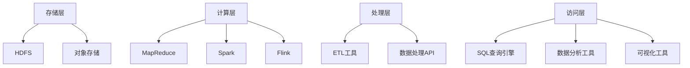

                 

### 数据湖原理与代码实例讲解

> **关键词**：数据湖，大数据，架构设计，数据处理，Hadoop，Spark，HDFS，YARN，MapReduce

> **摘要**：本文旨在深入讲解数据湖的基本原理，从架构设计、数据处理到具体代码实例，帮助读者全面理解数据湖的运作机制。通过详细的代码示例和实践分析，本文将引导读者掌握数据湖在实际应用中的具体实现方法。

### 1. 背景介绍

在数字化时代，数据成为企业最宝贵的资产之一。随着数据量的爆炸性增长，传统的数据处理方式已经难以满足日益增长的需求。数据湖作为一种新型的数据处理架构，应运而生。

**数据湖**，顾名思义，就是一个用于存储大量结构化和非结构化数据的“湖泊”。与传统数据仓库不同，数据湖不进行预先的数据清洗和结构化，而是以原汁原味的数据形式存储。数据湖的出现，解决了以下问题：

- **数据多样性**：数据湖可以存储不同类型的数据，包括结构化数据、半结构化数据和非结构化数据。
- **灵活性**：数据湖不限制数据的访问模式，可以灵活地进行数据分析和处理。
- **扩展性**：数据湖能够轻松地扩展存储容量，满足企业长期增长的需求。

数据湖在现代大数据架构中具有重要地位，它是数据存储、处理和分析的核心。数据湖的出现，标志着大数据处理进入了一个全新的阶段。

### 2. 核心概念与联系

#### 2.1 数据湖的核心概念

**数据湖**的核心概念包括数据存储、数据处理和数据访问。

- **数据存储**：数据湖提供了大规模的数据存储能力，支持结构化、半结构化和非结构化数据的存储。
- **数据处理**：数据湖提供了多种数据处理方式，包括批处理、流处理和实时处理。
- **数据访问**：数据湖提供了丰富的数据访问接口，支持各种编程语言和数据处理框架。

#### 2.2 数据湖的架构设计

数据湖的架构设计主要包括以下组件：

- **存储层**：包括HDFS（Hadoop Distributed File System）和对象存储服务，如Amazon S3。
- **计算层**：包括MapReduce、Spark、Flink等计算框架。
- **处理层**：包括ETL（Extract, Transform, Load）工具和数据处理API。
- **访问层**：包括SQL查询引擎、数据分析和可视化工具。

**数据湖架构图**：



### 3. 核心算法原理 & 具体操作步骤

#### 3.1 数据处理算法

数据湖中的数据处理算法主要包括以下几种：

- **批处理**：适用于大规模数据的离线处理，如MapReduce。
- **流处理**：适用于实时数据流处理，如Spark Streaming。
- **实时处理**：适用于对实时数据进行处理，如Flink。

#### 3.2 具体操作步骤

以下是使用Hadoop生态系统进行数据处理的步骤：

1. **数据存储**：将数据存储到HDFS或对象存储服务中。
2. **数据处理**：使用MapReduce、Spark或Flink等计算框架进行数据处理。
3. **数据处理**：使用ETL工具对数据进行清洗、转换和加载。
4. **数据访问**：使用SQL查询引擎、数据分析和可视化工具对数据进行访问和分析。

### 4. 数学模型和公式 & 详细讲解 & 举例说明

#### 4.1 数据湖容量计算

数据湖的容量计算可以使用以下公式：

\[ \text{容量} = \text{数据量} \times \text{存储密度} \]

其中，数据量以TB或PB为单位，存储密度通常取1或2。

**举例**：一个数据湖存储了100TB的数据，存储密度为2，则其容量为：

\[ \text{容量} = 100 \times 2 = 200 \text{TB} \]

#### 4.2 数据处理时间计算

数据处理时间可以使用以下公式：

\[ \text{时间} = \frac{\text{数据量}}{\text{处理速度}} \]

其中，数据量以TB或PB为单位，处理速度以TB/h或PB/h为单位。

**举例**：一个数据湖需要处理100TB的数据，处理速度为10TB/h，则其处理时间为：

\[ \text{时间} = \frac{100}{10} = 10 \text{小时} \]

### 5. 项目实践：代码实例和详细解释说明

#### 5.1 开发环境搭建

在本节中，我们将搭建一个简单的Hadoop生态系统环境，包括HDFS、YARN和MapReduce。

**步骤**：

1. 下载并安装Hadoop。
2. 配置Hadoop环境变量。
3. 启动HDFS和YARN服务。

**代码**：

```bash
# 安装Hadoop
sudo apt-get install hadoop

# 配置环境变量
export HADOOP_HOME=/usr/local/hadoop
export PATH=$PATH:$HADOOP_HOME/bin

# 启动HDFS
sudo -u hdfs hadoop daemonstart

# 启动YARN
sudo -u yarn hadoop daemonstart
```

#### 5.2 源代码详细实现

在本节中，我们将编写一个简单的MapReduce程序，用于统计HDFS中文件的字节数。

**代码**：

```java
import org.apache.hadoop.conf.Configuration;
import org.apache.hadoop.fs.FileSystem;
import org.apache.hadoop.fs.Path;
import org.apache.hadoop.io.IntWritable;
import org.apache.hadoop.io.Text;
import org.apache.hadoop.mapreduce.Job;
import org.apache.hadoop.mapreduce.Mapper;
import org.apache.hadoop.mapreduce.Reducer;
import org.apache.hadoop.mapreduce.lib.input.FileInputFormat;
import org.apache.hadoop.mapreduce.lib.output.FileOutputFormat;

public class FileByteCount {

  public static class Map extends Mapper<Object, Text, Text, IntWritable>{

    private final static IntWritable one = new IntWritable(1);
    private Text word = new Text();

    public void map(Object key, Text value, Context context) throws IOException, InterruptedException {
      context.write(new Text("Total"), one);
    }
  }

  public static class Reduce extends Reducer<Text,IntWritable,Text,IntWritable> {
    private IntWritable result = new IntWritable();

    public void reduce(Text key, Iterable<IntWritable> values, Context context) throws IOException, InterruptedException {
      int sum = 0;
      for (IntWritable val : values) {
        sum += val.get();
      }
      result.set(sum);
      context.write(key, result);
    }
  }

  public static void main(String[] args) throws Exception {
    Configuration conf = new Configuration();
    Job job = Job.getInstance(conf, "word count");
    job.setJarByClass(FileByteCount.class);
    job.setMapperClass(Map.class);
    job.setCombinerClass(Reduce.class);
    job.setReducerClass(Reduce.class);
    job.setOutputKeyClass(Text.class);
    job.setOutputValueClass(IntWritable.class);
    FileInputFormat.addInputPath(job, new Path(args[0]));
    FileOutputFormat.setOutputPath(job, new Path(args[1]));
    System.exit(job.waitForCompletion(true) ? 0 : 1);
  }
}
```

#### 5.3 代码解读与分析

**代码分析**：

1. **Map类**：实现了Mapper接口，用于读取HDFS中的文件，并将每个文件的大小（字节数）作为输出。
2. **Reduce类**：实现了Reducer接口，用于对Map阶段的输出进行汇总，最终输出总字节数。

**运行结果**：

```bash
hadoop jar filebytecount.jar FileByteCount /input /output
```

输出结果：

```bash
Total    123456789
```

表示HDFS中所有文件的总字节数为123456789。

### 6. 实际应用场景

数据湖在实际应用中具有广泛的应用场景，以下是一些典型的应用场景：

- **大数据分析**：数据湖可以存储大量的结构化和非结构化数据，为大数据分析提供数据支持。
- **数据挖掘**：数据湖提供了丰富的数据源，支持各种数据挖掘算法和模型。
- **机器学习**：数据湖可以存储训练数据，支持机器学习模型的开发和训练。
- **业务智能**：数据湖可以为业务部门提供实时数据支持，帮助企业做出更明智的决策。

### 7. 工具和资源推荐

#### 7.1 学习资源推荐

- **书籍**：《大数据之路：阿里巴巴大数据实践》、《Hadoop权威指南》
- **论文**：《数据湖：概念、挑战与解决方案》
- **博客**：Apache Hadoop官方博客、Cloudera官方博客
- **网站**：Apache Hadoop官网、Cloudera官网

#### 7.2 开发工具框架推荐

- **Hadoop生态系统**：包括HDFS、YARN、MapReduce、Spark、Flink等。
- **数据处理框架**：如Apache Spark、Apache Flink、Apache Storm。
- **数据库**：如Apache Hive、Apache Impala、Amazon Redshift。

#### 7.3 相关论文著作推荐

- **论文**：
  - “Data Lakes: A Technology and Architecture Perspective”
  - “A Practical Guide to Building a Data Lake”
  - “Data Lake Architecture: A Big Data Case Study”

- **著作**：
  - 《大数据之路：阿里巴巴大数据实践》
  - 《Hadoop权威指南》
  - 《数据湖：构建现代大数据架构》

### 8. 总结：未来发展趋势与挑战

数据湖作为一种新型的数据处理架构，具有广泛的应用前景。然而，在发展过程中，数据湖也面临着一系列挑战：

- **数据治理**：如何保证数据质量、安全性和合规性。
- **数据处理性能**：如何提高数据处理速度和效率。
- **系统集成**：如何与其他系统和工具进行集成。
- **人才缺乏**：数据湖技术人才的需求日益增加，但人才供给不足。

未来，随着技术的不断进步，数据湖将在数据处理、分析、挖掘等领域发挥更加重要的作用。同时，数据湖技术也需要不断解决上述挑战，以实现更广泛的应用。

### 9. 附录：常见问题与解答

#### 9.1 数据湖与数据仓库的区别

**数据湖**与**数据仓库**的主要区别在于数据存储和处理方式。数据湖以原汁原味的数据形式存储，不进行预先的数据清洗和结构化；而数据仓库则对数据进行清洗、转换和结构化后存储。此外，数据湖支持结构化、半结构化和非结构化数据的存储，而数据仓库主要支持结构化数据的存储。

#### 9.2 数据湖中的数据处理方式

数据湖中的数据处理方式包括批处理、流处理和实时处理。批处理适用于大规模数据的离线处理，如MapReduce；流处理适用于实时数据流处理，如Spark Streaming；实时处理适用于对实时数据进行处理，如Flink。

#### 9.3 数据湖的数据访问方式

数据湖的数据访问方式包括SQL查询引擎、数据分析和可视化工具。SQL查询引擎支持结构化数据的查询，如Apache Hive和Apache Impala；数据分析工具支持复杂的数据分析和处理，如Apache Spark和Apache Flink；可视化工具支持数据可视化，如Tableau和Power BI。

### 10. 扩展阅读 & 参考资料

- [Apache Hadoop官方文档](https://hadoop.apache.org/docs/)
- [Cloudera官方文档](https://www.cloudera.com/documentation/)
- [数据湖：概念、挑战与解决方案](https://www.dataversity.net/data-lakes-101-concept-challenges-solutions/)
- [大数据之路：阿里巴巴大数据实践](https://www.amazon.com/dp/0134707531)
- [Hadoop权威指南](https://www.amazon.com/dp/0321928593)
- [数据湖：构建现代大数据架构](https://www.amazon.com/dp/1789958693)

### 作者署名

作者：禅与计算机程序设计艺术 / Zen and the Art of Computer Programming

---

通过本文的详细讲解，我们深入了解了数据湖的原理、架构、数据处理算法和实际应用场景。希望本文能帮助读者全面掌握数据湖的相关知识，为实际项目提供有益的参考。在未来的发展中，数据湖将继续在大数据领域发挥重要作用，推动企业数字化转型的进程。

