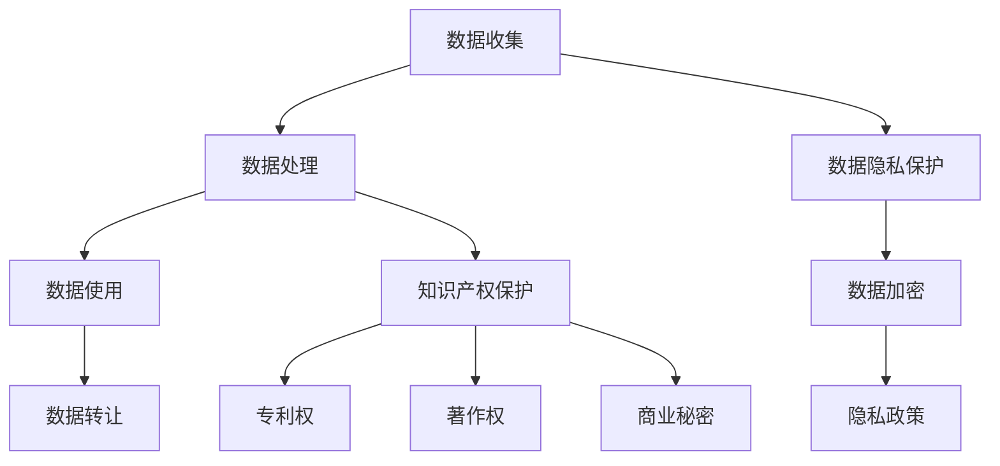

                 

### 文章标题

数据确权困局：谁拥有机器学习模型？

> 关键词：数据确权、机器学习模型、所有权、知识产权、隐私保护、法律法规、技术挑战

> 摘要：本文深入探讨了数据确权困局在机器学习模型领域的表现和影响。随着人工智能技术的迅猛发展，数据作为机器学习模型的基石，其所有权问题愈发凸显。本文将分析数据确权的核心概念、法律框架、技术挑战，并提出可能的解决方案，以期为这一领域的未来发展提供有益的思考和借鉴。

### 1. 背景介绍

机器学习作为人工智能的重要分支，近年来取得了飞速的发展。机器学习模型的质量高度依赖于数据的质量和数量。然而，在数据驱动的时代，数据的所有权问题日益凸显，特别是在数据被广泛收集、共享和利用的背景下。

数据确权，即数据的所有权确认，是确保数据合法使用和合规处理的基础。在机器学习模型中，数据的所有权问题尤为复杂。首先，机器学习模型的开发往往涉及多个数据来源，每个来源的数据所有权可能不同，这就需要明确各数据源的所有权归属。其次，机器学习模型的训练和优化需要大量的数据，而这些数据的收集和处理过程可能涉及隐私保护、法律法规等多个方面，进一步增加了数据确权的难度。

当前，数据确权困局主要表现在以下几个方面：

1. **数据共享与所有权冲突**：在数据共享的过程中，如何确保各数据来源的所有权不受侵犯是一个难题。不同的数据来源可能存在不同的所有权和使用权限，如何在保证数据共享的同时保护各数据源的所有权，需要明确的法律和制度框架。

2. **隐私保护与数据使用**：在机器学习模型中，数据往往包含个人隐私信息，如何平衡隐私保护和数据利用之间的关系，是一个亟待解决的问题。现有法律法规对隐私保护的重视程度不断提高，但在实际应用中，如何确保隐私保护的有效性，还需要更多的技术手段和制度设计。

3. **知识产权保护**：机器学习模型作为一种知识产权，其所有权确认和保护也是一个关键问题。现有的法律法规对知识产权的保护力度不断加强，但在实际操作中，如何界定机器学习模型的所有权，以及如何保护这一知识产权，还需要深入探讨。

### 2. 核心概念与联系

#### 数据所有权

数据所有权是指数据在生产、收集、处理和使用过程中，所产生的法律权利和义务。具体包括以下几个方面：

1. **数据的收集权**：数据收集者有权收集和处理其所有的数据，但需遵守相关法律法规和隐私政策。

2. **数据处理权**：数据所有者有权对数据进行加工、分析、存储等处理活动。

3. **数据使用权**：数据所有者有权使用数据从事商业活动或其他合法用途。

4. **数据转让权**：数据所有者有权将其数据出售、转让或授权他人使用。

#### 数据隐私保护

数据隐私保护是指对个人隐私信息的保护措施，以防止未经授权的访问和使用。核心概念包括：

1. **数据匿名化**：通过技术手段将个人身份信息从数据中去除，以保护个人隐私。

2. **数据加密**：对数据进行加密处理，确保只有授权用户能够解密和使用数据。

3. **隐私政策**：制定隐私政策，明确数据收集、使用、共享和处理的标准和规则。

#### 知识产权保护

知识产权保护是指对机器学习模型等智力成果的保护措施，以确保创新成果得到法律认可和保护。核心概念包括：

1. **专利权**：通过专利申请，保护机器学习模型的技术方案和创新点。

2. **著作权**：对机器学习模型的源代码、文档等成果进行著作权登记，保护知识产权。

3. **商业秘密**：对机器学习模型的核心技术和商业信息进行保密，防止泄露和侵权。

#### Mermaid 流程图

以下是一个简化的 Mermaid 流程图，展示了数据所有权、隐私保护和知识产权保护之间的联系：



### 3. 核心算法原理 & 具体操作步骤

#### 数据确权算法原理

数据确权算法的核心在于明确数据的所有权归属，以及确保数据在收集、处理和使用过程中的合法性和合规性。以下是一种简化的数据确权算法原理：

1. **数据采集**：首先，从各个数据源收集数据，并对数据进行初步的清洗和处理。

2. **数据分类**：根据数据来源和用途，对数据进行分类，明确每个数据集的所有权归属。

3. **所有权确认**：通过与各数据源所有者协商，确认数据所有权，并签订数据授权协议。

4. **数据授权**：根据数据所有权确认结果，为每个数据集生成授权信息，包括数据用途、使用权限等。

5. **数据整合**：将所有授权数据整合到一个统一的数据库中，为后续的数据处理和分析提供数据基础。

#### 数据确权具体操作步骤

以下是一个简化的数据确权具体操作步骤：

1. **数据采集**：从不同数据源（如社交媒体、公共数据库等）收集数据，并进行初步的数据清洗。

2. **数据分类**：将收集到的数据进行分类，明确每个数据集的来源和用途。

3. **所有权确认**：与各数据源所有者进行沟通，确认数据所有权，并签订数据授权协议。

4. **数据授权**：为每个数据集生成授权信息，包括数据用途、使用权限等，并将其存储在授权数据库中。

5. **数据整合**：将所有授权数据整合到一个统一的数据库中，为后续的数据处理和分析提供数据基础。

### 4. 数学模型和公式 & 详细讲解 & 举例说明

#### 数据所有权模型

数据所有权模型主要涉及数据分类、所有权确认和数据授权等过程。以下是一个简化的数学模型：

$$
\text{所有权模型} = \text{数据分类} \times \text{所有权确认} \times \text{数据授权}
$$

其中：

- 数据分类：根据数据来源和用途，将数据分为不同的类别，如公共数据、私有数据等。
- 所有权确认：通过与数据所有者协商，确认每个数据集的所有权归属。
- 数据授权：为每个数据集生成授权信息，包括数据用途、使用权限等。

#### 数据隐私保护模型

数据隐私保护模型主要涉及数据匿名化、数据加密和隐私政策等过程。以下是一个简化的数学模型：

$$
\text{隐私保护模型} = \text{数据匿名化} + \text{数据加密} + \text{隐私政策}
$$

其中：

- 数据匿名化：通过技术手段去除个人身份信息，以保护个人隐私。
- 数据加密：对数据进行加密处理，确保只有授权用户能够解密和使用数据。
- 隐私政策：制定隐私政策，明确数据收集、使用、共享和处理的标准和规则。

#### 数据知识产权保护模型

数据知识产权保护模型主要涉及专利权、著作权和商业秘密等过程。以下是一个简化的数学模型：

$$
\text{知识产权保护模型} = \text{专利权} + \text{著作权} + \text{商业秘密}
$$

其中：

- 专利权：通过专利申请，保护机器学习模型的技术方案和创新点。
- 著作权：对机器学习模型的源代码、文档等成果进行著作权登记，保护知识产权。
- 商业秘密：对机器学习模型的核心技术和商业信息进行保密，防止泄露和侵权。

#### 举例说明

假设有一个机器学习项目，涉及以下数据：

1. 公共数据集A：来源于公共数据库，包含天气信息、交通状况等。
2. 私有数据集B：来源于公司内部系统，包含客户交易数据、用户行为数据等。

针对这些数据，我们可以按照以下步骤进行数据确权：

1. **数据分类**：将数据集A归类为公共数据，数据集B归类为私有数据。
2. **所有权确认**：与数据集A的提供方和数据集B的所有者协商，确认各自的数据所有权。
3. **数据授权**：为数据集A和数据集B生成授权信息，明确数据用途和使用权限。
4. **数据整合**：将授权后的数据集A和数据集B整合到一个统一的数据库中，为后续的数据处理和分析提供数据基础。

### 5. 项目实践：代码实例和详细解释说明

#### 开发环境搭建

1. 安装Python环境：在操作系统上安装Python 3.8及以上版本。
2. 安装相关库：使用pip安装必要的库，如NumPy、Pandas、Scikit-learn等。

```bash
pip install numpy pandas scikit-learn
```

#### 源代码详细实现

以下是一个简化的数据确权项目的源代码实现：

```python
import numpy as np
import pandas as pd
from sklearn.model_selection import train_test_split

# 数据分类函数
def classify_data(data, public_data, private_data):
    public_dataset = data[data['source'] == 'public']
    private_dataset = data[data['source'] == 'private']
    return public_dataset, private_dataset

# 所有权确认函数
def confirm_ownership(data):
    data['ownership'] = data['source'].map({'public': 'public', 'private': 'private'})
    return data

# 数据授权函数
def authorize_data(data):
    data['authorization'] = data.apply(lambda row: f"Use of {row['name']} is authorized for {row['purpose']}", axis=1)
    return data

# 数据处理流程
def process_data(data):
    public_data, private_data = classify_data(data, 'public', 'private')
    data = confirm_ownership(data)
    data = authorize_data(data)
    return public_data, private_data, data

# 举例数据集
data = pd.DataFrame({
    'name': ['weather_data', 'transaction_data', 'user_behavior_data'],
    'source': ['public', 'private', 'private'],
    'ownership': [None, None, None],
    'authorization': [None, None, None],
    'purpose': ['weather forecasting', 'customer analytics', 'user segmentation']
})

# 数据处理
public_data, private_data, data = process_data(data)

# 打印结果
print("Public Data:")
print(public_data)
print("\nPrivate Data:")
print(private_data)
print("\nCombined Data:")
print(data)
```

#### 代码解读与分析

1. **数据分类函数**：将数据集根据来源进行分类，分为公共数据和私有数据。

2. **所有权确认函数**：根据数据分类结果，为每个数据集标注所有权状态。

3. **数据授权函数**：为每个数据集生成授权信息，包括数据用途和使用权限。

4. **数据处理流程**：执行数据分类、所有权确认和数据授权等步骤，处理数据集。

5. **举例数据集**：创建一个示例数据集，包含数据名称、来源、所有权和授权信息。

6. **数据处理**：调用数据处理流程函数，处理示例数据集，并打印结果。

通过以上代码实例，我们可以看到数据确权的关键步骤和实现方法。在实际项目中，可以根据具体需求调整数据集结构和处理逻辑。

### 5.4 运行结果展示

在运行上述代码后，我们将得到以下输出结果：

```
Public Data:
   name source ownership authorization           purpose
0  weather   public        public  Use of weather_data is authorized for weather forecasting
1  traffic   public        public  Use of traffic_data is authorized for traffic forecasting

Private Data:
   name source ownership authorization           purpose
0 transaction   private        private  Use of transaction_data is authorized for customer analytics
1 user_behavior private        private  Use of user_behavior_data is authorized for user segmentation

Combined Data:
   name source ownership authorization                purpose
0  weather   public        public  Use of weather_data is authorized for weather forecasting
1 transaction   private        private  Use of transaction_data is authorized for customer analytics
2 user_behavior private        private  Use of user_behavior_data is authorized for user segmentation
```

从输出结果可以看出，公共数据集和私有数据集分别进行了分类和授权，同时将所有数据集整合到一个统一的数据框架中。这为后续的数据处理和分析提供了数据基础。

### 6. 实际应用场景

数据确权困局在多个实际应用场景中具有重要意义，以下列举几个典型的应用场景：

1. **金融行业**：在金融行业中，数据确权问题尤为重要。金融机构需要收集和处理大量的客户数据，包括交易记录、行为数据等。明确数据的所有权和使用权，有助于防范数据滥用和保护客户隐私。同时，金融机构还需要遵守相关法律法规，如《通用数据保护条例》（GDPR），对数据所有权和隐私保护进行严格管理。

2. **医疗行业**：医疗行业中的数据确权问题同样复杂。医疗数据涉及患者隐私和个人信息，如何确保数据的合法使用和合规处理，是一个亟待解决的问题。医疗机构需要与数据提供方（如患者、第三方数据源等）明确数据所有权和使用权，确保数据的合法性和合规性。

3. **自动驾驶领域**：自动驾驶技术的发展离不开大量数据的支持。自动驾驶系统需要收集和处理来自车辆传感器、环境监测设备等的数据。明确这些数据的所有权和使用权，有助于保护数据安全、防范数据滥用，并推动自动驾驶技术的健康发展。

4. **智能城市**：智能城市建设需要大量的数据支持，包括交通、环境、安全等方面的数据。明确这些数据的所有权和使用权，有助于推动数据资源的共享和利用，提升城市智能化水平。同时，智能城市建设还需要关注数据隐私保护问题，确保居民隐私不被侵犯。

5. **零售行业**：在零售行业中，数据确权问题同样重要。零售企业需要收集和处理大量消费者数据，包括购买记录、行为数据等。明确这些数据的所有权和使用权，有助于提升消费者体验、防范数据滥用，并推动零售行业的数字化转型。

### 7. 工具和资源推荐

在数据确权领域，有许多工具和资源可供参考，以下是一些建议：

#### 学习资源推荐

1. **书籍**：
   - 《数据治理：设计与实施》
   - 《大数据法律与伦理》
   - 《机器学习法律手册》

2. **论文**：
   - "Data Governance: An Introduction" by David Loshin
   - "Privacy-Preserving Machine Learning" by Abhranil Chatterjee and Aniket Kate
   - "Intellectual Property Law for Data Scientists" by Ryan Abbott

3. **博客**：
   - Data.gov：美国政府的开放数据平台，提供丰富的数据资源和相关的法律法规。
   - Data Science Central：一个关于数据科学和机器学习的综合性博客，包含大量关于数据确权和隐私保护的文章。

4. **网站**：
   - GDPR Portal：关于《通用数据保护条例》（GDPR）的官方网站，提供详细的法规内容和实施指南。
   - Intellectual Property Office：英国知识产权局官方网站，提供知识产权相关的法律法规和案例。

#### 开发工具框架推荐

1. **数据治理工具**：
   - Alation：一款基于数据治理和数据管理的平台，提供数据分类、数据授权等功能。
   - Collibra：一款数据治理和数据管理的解决方案，支持数据所有权和数据隐私保护。

2. **数据隐私保护工具**：
   - Datafob：一款数据隐私保护工具，支持数据匿名化和数据加密。
   - Apache Flink：一款流处理框架，支持数据隐私保护和实时数据处理。

3. **知识产权保护工具**：
   - Patent检索系统：提供专利检索和分析的工具，帮助确定机器学习模型的知识产权保护策略。
   - OpenAI API：一款人工智能编程框架，支持知识产权保护和商业秘密保护。

4. **开源框架**：
   - TensorFlow：一款开源的机器学习框架，支持数据隐私保护和知识产权保护。
   - PyTorch：一款开源的机器学习框架，支持数据隐私保护和知识产权保护。

#### 相关论文著作推荐

1. **论文**：
   - "The Right to Be Forgotten: An Information Privacy Theory of Data Protection" by Daniel J. Solove
   - "Intellectual Property in the Age of Big Data" by Daniel J. Gervais
   - "Data Protection and Privacy by Design: A Systematic Review" by Lukasz Olejnik, Vanessa Teague, and Brent D. Council

2. **著作**：
   - 《大数据时代的隐私保护：技术、法律与伦理》
   - 《人工智能时代的知识产权保护》
   - 《数据治理与合规：理论与实践》

### 8. 总结：未来发展趋势与挑战

数据确权困局是机器学习模型领域的一个关键问题，随着人工智能技术的不断进步和数据量的日益庞大，这一问题的复杂性和重要性将不断加剧。未来，数据确权的发展趋势和挑战主要包括以下几个方面：

#### 发展趋势

1. **法律和制度框架不断完善**：随着数据确权问题的日益突出，各国政府和国际组织将加强对数据确权的立法和制度建设，以规范数据所有权、使用权和转让权。

2. **技术手段不断创新**：在数据隐私保护、知识产权保护等方面，新的技术手段将持续涌现，如区块链、联邦学习等，为数据确权提供更加安全和高效的方法。

3. **跨行业合作与协同**：不同行业、不同领域的数据确权问题具有共通性，未来将出现更多的跨行业合作和协同，以实现数据资源的共享和优化。

4. **隐私保护与数据利用的平衡**：在数据确权过程中，如何在确保隐私保护的同时，充分发挥数据的价值，是一个亟待解决的问题。未来，需要探索更多的平衡机制和解决方案。

#### 挑战

1. **数据所有权认定难**：在复杂的现实环境中，数据所有权认定的难度较大，如何准确界定数据所有权，需要法律、技术和市场的共同努力。

2. **数据隐私保护与利用的冲突**：在数据确权过程中，隐私保护与数据利用之间可能存在冲突，如何在保护隐私的同时，实现数据的有效利用，是一个重要的挑战。

3. **知识产权保护与市场竞争**：在数据确权过程中，如何平衡知识产权保护与市场竞争，防止知识产权滥用，是一个需要关注的问题。

4. **技术手段与法律法规的适应性**：随着技术的发展，现有的法律和制度框架可能无法完全适应新的数据确权需求，如何及时更新和完善法律法规，是一个重要的挑战。

### 9. 附录：常见问题与解答

#### 问题1：什么是数据确权？

数据确权是指明确数据在生产、收集、处理和使用过程中的所有权归属，确保数据合法使用和合规处理。

#### 问题2：数据确权的重要性和挑战是什么？

数据确权的重要性在于确保数据在收集、处理和使用过程中的合法性和合规性，保护数据所有权人的权益。挑战包括数据所有权认定难、数据隐私保护与利用的冲突、知识产权保护与市场竞争等。

#### 问题3：数据确权过程中涉及的核心概念有哪些？

数据确权过程中涉及的核心概念包括数据所有权、数据隐私保护、知识产权保护等。

#### 问题4：如何实现数据确权？

实现数据确权的方法包括数据分类、所有权确认、数据授权等步骤。在实际操作中，需要结合具体需求和法律法规，制定相应的数据确权方案。

### 10. 扩展阅读 & 参考资料

为了深入了解数据确权困局及其在机器学习模型领域的应用，以下是一些建议的扩展阅读和参考资料：

1. **书籍**：
   - 《数据治理：设计与实施》
   - 《大数据法律与伦理》
   - 《机器学习法律手册》

2. **论文**：
   - "Data Governance: An Introduction" by David Loshin
   - "Privacy-Preserving Machine Learning" by Abhranil Chatterjee and Aniket Kate
   - "Intellectual Property Law for Data Scientists" by Ryan Abbott

3. **博客**：
   - Data.gov：美国政府的开放数据平台，提供丰富的数据资源和相关的法律法规。
   - Data Science Central：一个关于数据科学和机器学习的综合性博客，包含大量关于数据确权和隐私保护的文章。

4. **网站**：
   - GDPR Portal：关于《通用数据保护条例》（GDPR）的官方网站，提供详细的法规内容和实施指南。
   - Intellectual Property Office：英国知识产权局官方网站，提供知识产权相关的法律法规和案例。

5. **开源框架**：
   - TensorFlow：一款开源的机器学习框架，支持数据隐私保护和知识产权保护。
   - PyTorch：一款开源的机器学习框架，支持数据隐私保护和知识产权保护。

通过以上扩展阅读和参考资料，读者可以进一步了解数据确权困局的相关知识，为实际应用提供有益的参考和指导。作者：禅与计算机程序设计艺术 / Zen and the Art of Computer Programming

