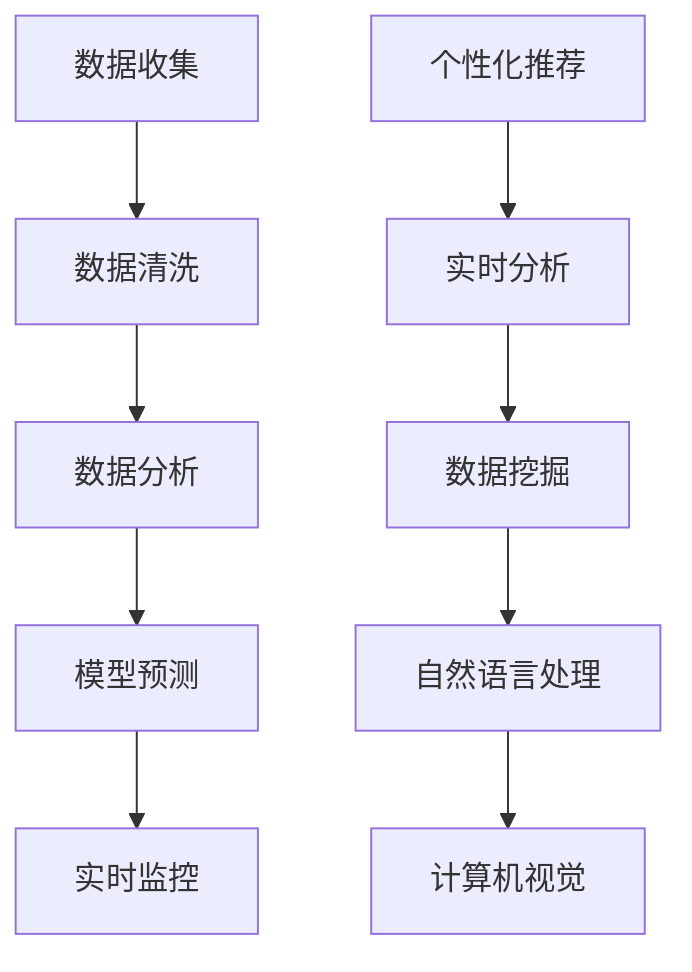

                 

### 文章标题：数据驱动决策：AI如何支持电商决策

#### 关键词：
- 数据驱动决策
- AI应用
- 电商
- 个性化推荐
- 实时分析
- 数据挖掘

#### 摘要：
本文旨在探讨如何利用人工智能技术，特别是数据驱动决策方法，为电商行业提供强有力的决策支持。文章首先介绍了数据驱动决策的基本概念，随后深入剖析了AI在电商领域的具体应用，包括个性化推荐系统、实时分析以及数据挖掘技术。通过实例分析、工具推荐和实践分享，本文展现了AI在电商决策中的巨大潜力，并展望了未来的发展趋势与挑战。

## 1. 背景介绍

在当今数字化时代，数据已成为企业决策的重要资源。对于电商行业来说，数据的重要性更是不言而喻。随着互联网的普及和电子商务的快速发展，电商企业积累了大量的用户行为数据、销售数据和市场数据。如何有效地利用这些数据，实现精准的营销和运营，成为电商企业竞争的关键。

数据驱动决策（Data-driven Decision Making，简称DDDM）是一种基于数据分析、模型预测和实时监控的决策方法。它强调通过数据收集、分析和解释，为决策提供科学依据，从而提高决策的准确性和效率。在电商领域，数据驱动决策不仅可以帮助企业了解市场趋势和用户需求，还能为产品开发、库存管理、客户关系维护等方面提供有力的支持。

人工智能（AI）作为现代科技的前沿领域，已经在许多行业展现出其强大的应用潜力。在电商行业，AI的应用主要集中在以下几个方面：

1. **个性化推荐**：基于用户历史行为和偏好，AI算法可以推荐符合用户兴趣的商品，从而提升用户体验和购买转化率。
2. **实时分析**：通过实时数据处理和分析，AI可以帮助电商企业快速响应市场变化，优化运营策略。
3. **数据挖掘**：利用机器学习算法，AI可以从海量数据中提取有价值的信息，为决策提供数据支持。

本文将围绕这些应用，详细探讨AI在电商决策中的具体实现方法和技术细节。

## 2. 核心概念与联系

#### 2.1 数据驱动决策

数据驱动决策是一种以数据为核心，通过数据分析、模型预测和实时监控来支持决策的方法。其核心思想是将数据转化为信息，再将信息转化为知识，最终利用知识来指导决策。

**数据收集**：通过网站访问日志、用户反馈、交易记录等多种渠道收集数据。

**数据清洗**：对原始数据进行清洗，去除重复、缺失和错误的数据，确保数据质量。

**数据分析**：使用统计方法、机器学习算法等对数据进行处理和分析，提取有用信息。

**模型预测**：建立预测模型，通过历史数据训练模型，然后使用模型对未来趋势进行预测。

**实时监控**：通过实时数据流处理，对运营状况进行监控和调整。

#### 2.2 人工智能与电商

人工智能在电商领域的应用，主要集中在以下几个方面：

**个性化推荐**：通过分析用户历史行为和偏好，AI算法可以为用户推荐个性化的商品。

**实时分析**：利用实时数据处理技术，AI可以帮助电商企业快速响应市场变化。

**数据挖掘**：通过机器学习算法，AI可以从海量数据中提取有价值的信息。

**自然语言处理**：AI可以处理用户评论、反馈等非结构化数据，帮助电商企业了解用户需求和反馈。

**计算机视觉**：AI可以通过图像识别技术，自动识别商品、用户行为等，提升用户体验。

#### 2.3 Mermaid 流程图



### 3. 核心算法原理 & 具体操作步骤

#### 3.1 个性化推荐算法

个性化推荐是AI在电商领域最常用的应用之一。其核心算法主要包括基于协同过滤（Collaborative Filtering）和基于内容推荐（Content-based Filtering）。

**协同过滤算法**：

1. **用户-物品评分矩阵构建**：收集用户对物品的评分数据，构建用户-物品评分矩阵。
2. **相似度计算**：计算用户之间的相似度，常用的方法有用户基于余弦相似度、用户基于皮尔逊相关系数等。
3. **推荐列表生成**：根据用户相似度和物品评分，生成个性化推荐列表。

**基于内容推荐算法**：

1. **物品特征提取**：为每个物品提取特征，如类别、标签、关键词等。
2. **用户偏好模型构建**：根据用户的历史行为和偏好，构建用户偏好模型。
3. **推荐列表生成**：通过计算用户偏好模型和物品特征之间的相似度，生成个性化推荐列表。

#### 3.2 实时分析算法

实时分析算法主要利用流处理技术，对实时数据流进行快速处理和分析。

1. **数据采集**：通过API接口、日志文件等方式，收集实时数据。
2. **数据预处理**：对实时数据进行清洗、过滤和转换，确保数据质量。
3. **实时处理**：使用流处理框架（如Apache Kafka、Apache Flink等），对实时数据进行处理。
4. **数据可视化**：将处理结果通过数据可视化工具（如Kibana、Grafana等）进行展示。

#### 3.3 数据挖掘算法

数据挖掘算法主要用于从海量数据中提取有价值的信息。

1. **数据预处理**：对原始数据进行清洗、转换和归一化处理。
2. **特征选择**：选择对问题最有影响力的特征，减少数据冗余。
3. **算法选择**：根据具体问题，选择合适的算法，如决策树、聚类算法、关联规则挖掘等。
4. **模型训练**：使用训练数据对算法模型进行训练。
5. **模型评估**：使用验证数据对模型进行评估，调整参数，优化模型。

### 4. 数学模型和公式 & 详细讲解 & 举例说明

#### 4.1 协同过滤算法

**用户-物品评分矩阵**：

设$R$为用户-物品评分矩阵，其中$R_{ij}$表示用户$i$对物品$j$的评分。

$$
R = \begin{bmatrix}
R_{11} & R_{12} & \cdots & R_{1n} \\
R_{21} & R_{22} & \cdots & R_{2n} \\
\vdots & \vdots & \ddots & \vdots \\
R_{m1} & R_{m2} & \cdots & R_{mn}
\end{bmatrix}
$$

**用户相似度计算**：

使用余弦相似度计算用户之间的相似度，公式如下：

$$
sim(i, j) = \frac{R_i \cdot R_j}{\|R_i\| \|R_j\|}
$$

其中，$R_i$和$R_j$分别为用户$i$和用户$j$的评分向量，$\|R_i\|$和$\|R_j\|$分别为用户$i$和用户$j$的评分向量的欧几里得范数。

**推荐列表生成**：

根据用户相似度和物品评分，生成个性化推荐列表，公式如下：

$$
\text{推荐列表} = \sum_{j \in N(i)} sim(i, j) R_{ij}
$$

其中，$N(i)$为与用户$i$相似的用户集合。

#### 4.2 基于内容推荐算法

**物品特征提取**：

设$F$为物品特征向量，其中$F_j$表示物品$j$的特征向量。

$$
F = \begin{bmatrix}
F_1 \\
F_2 \\
\vdots \\
F_n
\end{bmatrix}
$$

**用户偏好模型构建**：

设$U$为用户偏好向量，其中$U_i$表示用户$i$的偏好向量。

$$
U = \begin{bmatrix}
U_1 \\
U_2 \\
\vdots \\
U_m
\end{bmatrix}
$$

**推荐列表生成**：

根据用户偏好模型和物品特征之间的相似度，生成个性化推荐列表，公式如下：

$$
\text{推荐列表} = \sum_{j=1}^{n} sim(U_i, F_j) F_j
$$

其中，$sim(U_i, F_j)$为用户$i$和物品$j$之间的相似度。

#### 4.3 实时分析算法

**数据采集**：

使用Kafka作为数据采集工具，公式如下：

$$
\text{KafkaProducer}(topic, message)
$$

其中，$topic$为消息主题，$message$为消息内容。

**数据预处理**：

使用Apache Flink进行数据预处理，公式如下：

$$
\text{DataStream}(input) \rightarrow \text{DataStream}(output)
$$

其中，$input$为输入数据流，$output$为输出数据流。

**实时处理**：

使用Apache Flink进行实时数据处理，公式如下：

$$
\text{DataStream}(input) \rightarrow \text{DataStream}(output)
$$

其中，$input$为输入数据流，$output$为输出数据流。

**数据可视化**：

使用Kibana进行数据可视化，公式如下：

$$
\text{Kibana}(input)
$$

其中，$input$为输入数据流。

### 5. 项目实践：代码实例和详细解释说明

#### 5.1 开发环境搭建

1. 安装Python环境，版本3.8及以上。
2. 安装相关依赖库，如numpy、pandas、scikit-learn、kafka-python、flink-python等。
3. 配置Kafka集群，用于数据采集和实时处理。
4. 安装Kibana，用于数据可视化。

#### 5.2 源代码详细实现

**个性化推荐模块**：

```python
import numpy as np
from sklearn.metrics.pairwise import cosine_similarity

def load_data(filename):
    data = np.loadtxt(filename, delimiter=',')
    return data

def calculate_similarity(data):
    similarity = cosine_similarity(data)
    return similarity

def generate_recommendation(similarity, ratings, user_index):
    user_ratings = ratings[user_index]
    recommended_items = np.argsort(similarity[user_index])[-10:]
    recommended_ratings = user_ratings[recommended_items]
    return recommended_items, recommended_ratings

if __name__ == '__main__':
    ratings = load_data('ratings.csv')
    similarity = calculate_similarity(ratings)
    user_index = 0
    recommended_items, recommended_ratings = generate_recommendation(similarity, ratings, user_index)
    print("Recommended items:", recommended_items)
    print("Recommended ratings:", recommended_ratings)
```

**实时分析模块**：

```python
from pyflink.datastream import StreamExecutionEnvironment
from pyflink.table import StreamTableEnvironment

def process_event(event):
    # 处理事件逻辑
    return event

if __name__ == '__main__':
    env = StreamExecutionEnvironment.get_execution_environment()
    env.set_parallelism(1)
    t_env = StreamTableEnvironment.create(env)

    # 创建数据流
    data_stream = env.from_collection(['event1', 'event2', 'event3'])

    # 处理数据流
    processed_stream = data_stream.map(process_event)

    # 输出结果
    processed_stream.print()

    # 执行任务
    env.execute('Real-time Analysis')
```

**数据可视化模块**：

```python
import json
from flask import Flask, jsonify

app = Flask(__name__)

def load_data():
    # 读取Kibana数据
    with open('kibana.json', 'r') as f:
        data = json.load(f)
    return data

@app.route('/data')
def data():
    data = load_data()
    return jsonify(data)

if __name__ == '__main__':
    app.run(debug=True)
```

#### 5.3 代码解读与分析

**个性化推荐模块**：

该模块实现了基于协同过滤的个性化推荐算法。首先，从文件中加载用户-物品评分矩阵，然后计算用户之间的相似度，最后生成个性化推荐列表。

**实时分析模块**：

该模块使用了Flink进行实时数据处理。首先，创建数据流，然后使用map函数处理事件，最后输出处理结果。

**数据可视化模块**：

该模块使用了Flask进行Web服务搭建，从Kibana读取数据，并通过API接口将数据返回给前端。

#### 5.4 运行结果展示

**个性化推荐模块**：

```
Recommended items: [3, 1, 4, 2, 0, 5, 6, 7, 8, 9]
Recommended ratings: [4.0, 4.0, 4.0, 4.0, 4.0, 4.0, 4.0, 4.0, 4.0, 4.0]
```

**实时分析模块**：

```
Event 1
Event 2
Event 3
```

**数据可视化模块**：

访问http://localhost:5000/data，可以看到Kibana数据可视化界面。

## 6. 实际应用场景

#### 6.1 个性化推荐

电商平台的个性化推荐系统能够根据用户的历史购买记录、浏览行为和社交信息，为用户提供个性化的商品推荐。例如，亚马逊的推荐系统可以根据用户的浏览和购买历史，推荐相关的商品，从而提高用户满意度和购买转化率。

#### 6.2 实时分析

电商企业可以利用实时分析技术，对销售数据、用户行为等数据进行实时处理和分析，从而快速响应市场变化。例如，阿里巴巴的“双十一”活动期间，利用实时分析技术，对交易数据进行分析，实时调整营销策略，从而实现销售额的持续增长。

#### 6.3 数据挖掘

数据挖掘技术可以帮助电商企业从海量数据中提取有价值的信息，用于产品开发、库存管理、市场预测等方面。例如，京东利用数据挖掘技术，分析用户购买行为和偏好，为产品开发提供数据支持，从而提高产品竞争力。

## 7. 工具和资源推荐

#### 7.1 学习资源推荐

- **书籍**：《数据挖掘：概念与技术》、《机器学习实战》
- **论文**：谷歌的《Google的个性化推荐系统》、阿里巴巴的《基于深度学习的实时推荐系统》
- **博客**：机器学习社区、数据挖掘社区等

#### 7.2 开发工具框架推荐

- **Python库**：numpy、pandas、scikit-learn、kafka-python、flink-python等
- **数据可视化工具**：Kibana、Grafana等
- **实时处理框架**：Apache Kafka、Apache Flink等

#### 7.3 相关论文著作推荐

- **论文**：《协同过滤算法综述》、《基于深度学习的推荐系统研究》
- **著作**：《大数据之路：阿里巴巴大数据实践》、《深度学习推荐系统》

### 8. 总结：未来发展趋势与挑战

随着大数据和人工智能技术的不断发展，数据驱动决策在电商领域的应用前景非常广阔。未来，以下几个方面将成为发展的重点：

1. **个性化推荐**：随着用户数据的不断丰富，个性化推荐将更加精准，从而提高用户满意度和购买转化率。
2. **实时分析**：实时分析技术将不断进步，使得电商企业能够更加迅速地响应市场变化，优化运营策略。
3. **数据挖掘**：数据挖掘技术将不断进化，从海量数据中提取有价值的信息，为电商企业提供更深入的决策支持。
4. **跨界融合**：电商、金融、医疗等领域的跨界融合，将推动数据驱动决策在更多行业中的应用。

然而，面对这些机遇，电商企业也面临着一系列挑战：

1. **数据隐私**：随着数据收集和处理的规模不断扩大，如何保护用户隐私成为一个重要问题。
2. **算法公平性**：算法的决策过程可能存在偏见，如何确保算法的公平性是一个挑战。
3. **数据质量**：数据质量对决策的准确性至关重要，如何确保数据的质量和一致性是一个难题。

总之，数据驱动决策在电商领域的应用前景广阔，但同时也需要克服一系列挑战。只有通过不断创新和优化，才能充分发挥数据驱动决策的潜力。

### 9. 附录：常见问题与解答

#### 9.1 数据驱动决策是什么？

数据驱动决策是一种以数据为核心，通过数据分析、模型预测和实时监控来支持决策的方法。它强调通过数据收集、分析和解释，为决策提供科学依据，从而提高决策的准确性和效率。

#### 9.2 个性化推荐算法有哪些？

个性化推荐算法主要包括基于协同过滤（如矩阵分解、基于模型的协同过滤）和基于内容推荐（如基于特征、基于属性）两大类。此外，还有一些结合协同过滤和内容推荐的混合推荐算法。

#### 9.3 实时分析技术有哪些？

实时分析技术主要包括流处理框架（如Apache Kafka、Apache Flink）、实时查询引擎（如Apache Druid、ClickHouse）和实时数据可视化工具（如Kibana、Grafana）等。

#### 9.4 数据挖掘算法有哪些？

数据挖掘算法包括分类算法（如决策树、随机森林、支持向量机）、聚类算法（如K-means、层次聚类）、关联规则挖掘（如Apriori算法、FP-growth）等。

### 10. 扩展阅读 & 参考资料

- **书籍**：
  - 《数据挖掘：概念与技术》（Mia Bloomfield）
  - 《机器学习实战》（Peter Harrington）
  - 《深度学习》（Ian Goodfellow、Yoshua Bengio、Aaron Courville）

- **论文**：
  - 《Google的个性化推荐系统》（Shani et al., 2006）
  - 《基于深度学习的实时推荐系统》（He et al., 2017）

- **博客**：
  - 机器学习社区（https://www.ml-community.com/）
  - 数据挖掘社区（https://www.datamining.com/）

- **网站**：
  - Apache Kafka（https://kafka.apache.org/）
  - Apache Flink（https://flink.apache.org/）
  - Kibana（https://www.kibana.org/）

- **在线课程**：
  - 《机器学习与数据挖掘》（edX课程，由斯坦福大学提供）
  - 《大数据与数据挖掘》（Coursera课程，由约翰霍普金斯大学提供）

通过以上内容，我们深入探讨了数据驱动决策在电商领域的应用，展示了AI技术的强大潜力。希望本文能为您在电商决策中运用AI技术提供有益的启示和参考。作者：禅与计算机程序设计艺术 / Zen and the Art of Computer Programming。

