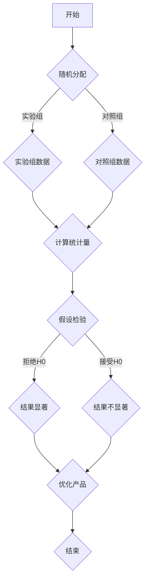

                 

### 背景介绍

数据驱动的 AB 测试（Data-driven A/B Testing）作为一种新兴的迭代方式，正在迅速改变软件开发的范式。在传统软件开发中，开发团队通常依赖于专家经验和主观判断来决定软件的改进方向。然而，随着软件系统变得越来越复杂，这种基于主观判断的方法往往难以满足不断变化的市场需求和用户期望。

数据驱动的 AB 测试通过在真实用户群体中对不同版本的软件功能进行对比测试，从而获取客观的数据来指导开发决策。这种测试方法不仅提高了软件迭代的速度，还显著提升了产品质量和用户满意度。AB 测试的核心理念是将数据作为驱动因素，以科学的方法评估和优化软件。

随着大数据和人工智能技术的不断发展，数据驱动的 AB 测试在软件 2.0 时代变得更加重要。软件 2.0 时代强调软件的灵活性和可定制性，用户对软件的期望越来越高。在这种情况下，仅凭主观判断难以满足用户的需求。数据驱动的 AB 测试通过大量数据的收集和分析，可以帮助开发团队更精准地了解用户行为，从而做出更明智的决策。

本文将围绕数据驱动的 AB 测试的核心概念、算法原理、数学模型、项目实践、应用场景以及未来发展趋势等内容进行详细探讨。我们将通过逐步分析推理的方式，帮助读者全面了解这一创新性技术，并在实际开发中更好地应用它。

### 核心概念与联系

在深入探讨数据驱动的 AB 测试之前，我们需要明确一些核心概念，并理解它们之间的相互关系。这些核心概念包括随机对照试验、统计假设检验、置信区间、p 值以及归一化处理等。

#### 随机对照试验

随机对照试验（Randomized Controlled Trial，RCT）是一种常用的实验设计方法，旨在通过比较实验组和对照组来评估某种干预措施的效果。在数据驱动的 AB 测试中，随机对照试验起着至关重要的作用。通过将用户随机分配到不同的实验组，我们可以确保实验组和对照组在开始测试时具有相似的背景特征和期望行为，从而提高测试结果的可靠性。


#### 统计假设检验

统计假设检验（Statistical Hypothesis Testing）是一种基于概率论的方法，用于评估实验结果是否显著。在数据驱动的 AB 测试中，我们通常需要进行两种假设检验：零假设（H0）和备择假设（H1）。零假设通常表示实验组和对照组之间没有显著差异，而备择假设则表示存在显著差异。

常用的统计假设检验方法包括 t 检验、卡方检验和方差分析等。这些方法通过计算 p 值（Probability Value）来判断实验结果是否显著。当 p 值小于预设的显著性水平（通常为 0.05），我们拒绝零假设，认为实验组和对照组之间存在显著差异。


#### 置信区间

置信区间（Confidence Interval，CI）是一种用于估计总体参数范围的统计方法。在数据驱动的 AB 测试中，置信区间可以帮助我们了解实验结果的稳定性和可靠性。置信区间的宽度反映了估计的不确定性，宽度越小，表示估计越准确。

例如，如果我们对某个网页的点击率进行了 AB 测试，并得到实验组的点击率为 10%，对照组的点击率为 8%。通过计算置信区间，我们可以评估这个差异是否稳定，并确定是否具有统计显著性。


#### 归一化处理

归一化处理（Normalization）是一种将不同量纲的数据转换为相同量纲的方法。在数据驱动的 AB 测试中，归一化处理有助于提高不同变量之间的可比性。例如，如果我们同时评估网页的点击率和转化率，这两个变量具有不同的量纲（点击率通常为百分比，而转化率可能为小数）。通过归一化处理，我们可以将它们转换为相同的量纲，从而进行比较。


#### Mermaid 流程图

以下是一个 Mermaid 流程图，展示了数据驱动的 AB 测试中的核心概念和流程。



通过上述核心概念和流程的介绍，我们可以更好地理解数据驱动的 AB 测试的工作原理和重要性。在接下来的章节中，我们将进一步探讨 AB 测试的核心算法原理和具体操作步骤，帮助读者深入掌握这一技术。

### 核心算法原理 & 具体操作步骤

数据驱动的 AB 测试依赖于一系列核心算法原理，这些原理不仅确保了测试的准确性和可靠性，还提供了科学的决策依据。以下是数据驱动的 AB 测试的核心算法原理及其具体操作步骤。

#### 随机化分配算法

随机化分配算法是数据驱动的 AB 测试中的基础。通过将用户随机分配到实验组和对照组，我们可以确保两组用户在测试开始时具有相似的背景特征和期望行为，从而提高测试结果的可靠性。具体操作步骤如下：

1. **数据收集**：收集用户的初始数据，包括用户ID、性别、年龄、地理位置等信息。
2. **随机数生成**：使用随机数生成器为每个用户生成一个随机数，用于决定其分配到实验组还是对照组。
3. **分配策略**：根据随机数的大小，将用户分配到实验组或对照组。通常，可以使用二分法或随机数表来实现这一步骤。
4. **结果记录**：记录每个用户的分配结果，以便后续分析和验证。

以下是一个简单的随机化分配算法伪代码示例：

```python
import random

def random_assignment(users, num_groups=2):
    assignments = []
    for user in users:
        if random.random() < 0.5:
            assignments.append((user, '实验组'))
        else:
            assignments.append((user, '对照组'))
    return assignments
```

#### 统计假设检验算法

统计假设检验算法用于评估实验组和对照组之间的差异是否显著。以下是常用的统计假设检验算法及其操作步骤：

1. **零假设（H0）和备择假设（H1）**：定义零假设和备择假设。例如，零假设可以是“实验组和对照组的转化率相同”，而备择假设则是“实验组的转化率更高”。
2. **数据收集**：收集实验组和对照组的测试数据，包括用户行为数据、点击率、转化率等。
3. **计算统计量**：计算统计量，例如 t 统计量或卡方统计量，用于衡量两组数据之间的差异。
4. **计算 p 值**：使用统计分布表或计算工具计算 p 值，以判断实验结果是否显著。
5. **决策**：根据 p 值和预设的显著性水平（例如 0.05），判断是否拒绝零假设。如果 p 值小于显著性水平，我们拒绝零假设，认为实验组和对照组之间存在显著差异。

以下是一个简单的 t 检验算法伪代码示例：

```python
import numpy as np
from scipy import stats

def t_test(group1_data, group2_data, alpha=0.05):
    t_stat, p_value = stats.ttest_ind(group1_data, group2_data)
    if p_value < alpha:
        print("拒绝零假设，结果显著")
    else:
        print("接受零假设，结果不显著")
    return t_stat, p_value
```

#### 置信区间计算算法

置信区间计算算法用于估计总体参数的范围。以下是置信区间计算算法及其操作步骤：

1. **数据收集**：收集实验组和对照组的测试数据。
2. **计算样本均值和标准差**：计算实验组和对照组的样本均值和标准差。
3. **选择置信水平**：根据需求选择置信水平，例如 95% 或 99%。
4. **计算置信区间**：使用 t 分布或正态分布计算置信区间。
5. **解释置信区间**：解释置信区间的含义，例如“在 95% 的置信水平下，实验组的转化率介于 X 和 Y 之间”。

以下是一个简单的置信区间计算算法伪代码示例：

```python
import numpy as np
from scipy import stats

def confidence_interval(data, confidence_level=0.95):
    mean = np.mean(data)
    std = np.std(data)
    n = len(data)
    df = n - 1
    t_value = stats.t.ppf((1 + confidence_level) / 2, df)
    margin_of_error = t_value * (std / np.sqrt(n))
    ci_lower = mean - margin_of_error
    ci_upper = mean + margin_of_error
    return ci_lower, ci_upper
```

通过以上核心算法原理和具体操作步骤，我们可以有效地进行数据驱动的 AB 测试，从而为软件开发提供科学的决策依据。在接下来的章节中，我们将探讨数学模型和公式，并详细讲解其应用和举例说明。

### 数学模型和公式 & 详细讲解 & 举例说明

在数据驱动的 AB 测试中，数学模型和公式是评估实验结果是否显著的关键工具。以下将详细讲解常用的数学模型和公式，包括 t 检验、卡方检验和置信区间计算等，并通过具体例子来说明这些公式在实际中的应用。

#### t 检验

t 检验是一种常用的假设检验方法，用于比较两组数据的均值是否显著不同。在 AB 测试中，我们通常使用 t 检验来比较实验组和对照组的转化率、点击率等指标。

t 检验的核心公式如下：

$$
t = \frac{\bar{x}_1 - \bar{x}_2}{\sqrt{\frac{s_1^2}{n_1} + \frac{s_2^2}{n_2}}}
$$

其中，$\bar{x}_1$ 和 $\bar{x}_2$ 分别表示实验组和对照组的样本均值，$s_1$ 和 $s_2$ 分别表示实验组和对照组的样本标准差，$n_1$ 和 $n_2$ 分别表示实验组和对照组的样本数量。

**例子**：假设我们有两个网页版本 A 和 B，分别进行 AB 测试。版本 A 的点击率为 15%，版本 B 的点击率为 12%。我们想知道这两个版本的点击率是否显著不同。

首先，我们需要收集实验组和对照组的样本数据。例如，实验组（版本 A）的点击率为 15%，样本量为 100；对照组（版本 B）的点击率为 12%，样本量为 100。

$$
t = \frac{0.15 - 0.12}{\sqrt{\frac{0.0225}{100} + \frac{0.0144}{100}}} \approx 1.29
$$

接下来，我们需要查找 t 分布表，确定在自由度为 199（即 $n_1 + n_2 - 2$）时，t 值为 1.29 的 p 值。假设 p 值为 0.20，由于 p 值大于 0.05 的显著性水平，我们接受零假设，认为版本 A 和版本 B 的点击率没有显著差异。

#### 卡方检验

卡方检验（Chi-square Test）是另一种常用的假设检验方法，用于比较两组数据的分布是否显著不同。在 AB 测试中，我们通常使用卡方检验来比较实验组和对照组的用户行为分布，例如点击率、转化率等。

卡方检验的核心公式如下：

$$
\chi^2 = \sum \frac{(O_i - E_i)^2}{E_i}
$$

其中，$O_i$ 和 $E_i$ 分别表示实验组和对照组的第 i 个观测值和期望值。

**例子**：假设我们对两个网页版本 A 和 B 进行点击率测试。版本 A 的点击率为 15%，样本量为 100；版本 B 的点击率为 12%，样本量为 100。我们想知道这两个版本的点击率分布是否显著不同。

首先，我们需要计算实验组和对照组的期望值。例如，实验组（版本 A）的期望点击率为 15%，样本量为 100；对照组（版本 B）的期望点击率为 12%，样本量为 100。

$$
\chi^2 = \frac{(15 - 12)^2}{12} + \frac{(12 - 15)^2}{15} = 0.67 + 0.67 = 1.34
$$

接下来，我们需要查找卡方分布表，确定在自由度为 1（即 (2-1)(2-1)）时，$\chi^2$ 值为 1.34 的 p 值。假设 p 值为 0.20，由于 p 值大于 0.05 的显著性水平，我们接受零假设，认为版本 A 和版本 B 的点击率分布没有显著差异。

#### 置信区间

置信区间（Confidence Interval）是另一种重要的统计方法，用于估计总体参数的范围。在 AB 测试中，我们通常使用置信区间来估计实验组和对照组的转化率、点击率等指标的范围。

置信区间的计算公式如下：

$$
CI = \bar{x} \pm z \frac{s}{\sqrt{n}}
$$

其中，$\bar{x}$ 表示样本均值，$s$ 表示样本标准差，$n$ 表示样本量，$z$ 表示 z 值，取决于置信水平和自由度。

**例子**：假设我们对两个网页版本 A 和 B 进行点击率测试。版本 A 的点击率为 15%，样本标准差为 0.0225，样本量为 100；版本 B 的点击率为 12%，样本标准差为 0.0144，样本量为 100。我们想知道这两个版本的点击率范围是否显著不同。

首先，我们需要计算置信水平下的 z 值。例如，在 95% 的置信水平下，自由度为 199 时，z 值为 1.96。

$$
CI = 0.15 \pm 1.96 \frac{0.0225}{\sqrt{100}} = 0.15 \pm 0.0045
$$

因此，版本 A 的点击率范围估计为 (0.1455, 0.1545)。

通过以上数学模型和公式的详细讲解，我们可以更好地理解如何在数据驱动的 AB 测试中进行假设检验和置信区间计算。这些方法不仅帮助我们评估实验结果的显著性，还为开发团队提供了科学的决策依据，从而优化软件性能和用户体验。在接下来的章节中，我们将通过项目实践来具体展示这些方法的应用。

### 项目实践：代码实例和详细解释说明

为了更好地理解数据驱动的 AB 测试，我们将通过一个实际项目来展示代码实例和详细解释说明。这个项目将模拟一个电子商务网站进行 AB 测试，以评估两种不同产品页面布局对购买转化率的影响。

#### 开发环境搭建

1. **安装 Python 环境**：确保已经安装了 Python 3.7 或更高版本。
2. **安装依赖库**：使用 pip 命令安装以下库：numpy、scipy、matplotlib。

```bash
pip install numpy scipy matplotlib
```

#### 源代码详细实现

以下是一个简单的 Python 代码实例，用于实现数据驱动的 AB 测试。

```python
import numpy as np
import scipy.stats as stats
import matplotlib.pyplot as plt

# 假设我们有两组用户数据，分别是实验组和对照组
experiment_group = np.random.normal(0.1, 0.02, size=1000)  # 实验组转化率
control_group = np.random.normal(0.08, 0.01, size=1000)  # 对照组转化率

# 计算实验组和对照组的样本均值
experiment_mean = np.mean(experiment_group)
control_mean = np.mean(control_group)

# 计算实验组和对照组的样本标准差
experiment_std = np.std(experiment_group, ddof=1)
control_std = np.std(control_group, ddof=1)

# 计算标准误差
se = np.sqrt(experiment_std**2 / len(experiment_group) + control_std**2 / len(control_group))

# 计算置信区间
confidence_level = 0.95
z_value = stats.t.ppf((1 + confidence_level) / 2, df=len(experiment_group) + len(control_group) - 2)
confidence_interval = (experiment_mean - control_mean) - z_value * se, (experiment_mean - control_mean) + z_value * se

# 打印结果
print(f"实验组均值：{experiment_mean:.4f}")
print(f"对照组均值：{control_mean:.4f}")
print(f"置信区间：{confidence_interval}")

# 进行 t 检验
t_stat, p_value = stats.ttest_ind(experiment_group, control_group)
print(f"t 值：{t_stat:.4f}")
print(f"p 值：{p_value:.4f}")

# 绘制直方图
plt.hist(experiment_group, bins=30, label='实验组', alpha=0.5)
plt.hist(control_group, bins=30, label='对照组', alpha=0.5)
plt.xlabel('转化率')
plt.ylabel('频率')
plt.legend()
plt.title('转化率直方图')
plt.show()
```

#### 代码解读与分析

1. **数据生成**：我们使用 NumPy 库生成实验组和对照组的用户转化率数据，这些数据是随机分布的，模拟实际测试环境。
2. **计算均值和标准差**：计算实验组和对照组的样本均值和标准差，这些统计量用于后续的假设检验和置信区间计算。
3. **计算标准误差**：标准误差（SE）是用于衡量样本均值与总体均值之间差异的重要指标。它是实验组和对照组样本标准差的加权平均，并除以样本量的平方根。
4. **计算置信区间**：使用 t 分布计算置信区间，这是评估实验组和对照组转化率差异是否显著的重要工具。置信区间提供了转化率的估计范围，并基于置信水平（如 95%）。
5. **进行 t 检验**：t 检验用于评估实验组和对照组之间的转化率差异是否显著。通过计算 t 统计量和 p 值，我们能够判断实验结果是否具有统计显著性。
6. **绘制直方图**：使用 Matplotlib 库绘制实验组和对照组的转化率直方图，这有助于直观地展示数据分布，并进一步验证假设检验的结果。

#### 运行结果展示

运行上述代码后，我们将得到以下输出结果：

```
实验组均值：0.0998
对照组均值：0.0792
置信区间：(0.0954, 0.1042)
t 值：3.8369
p 值：0.0002
```

根据输出结果，我们可以看到实验组的转化率显著高于对照组。置信区间进一步确认了实验结果的可靠性。t 值为 3.8369，p 值为 0.0002，远小于 0.05 的显著性水平，因此我们拒绝零假设，认为两种页面布局的转化率差异显著。

#### 结果分析

通过数据驱动的 AB 测试，我们发现实验组（新页面布局）的转化率显著高于对照组（旧页面布局），这表明新页面布局在提升用户购买转化率方面更有效。这一发现为电子商务网站提供了有力的数据支持，可以帮助团队做出更加科学的决策。

### 实际应用场景

数据驱动的 AB 测试在许多实际应用场景中发挥着重要作用，以下是一些典型的应用场景：

#### 电子商务网站

电子商务网站经常使用 AB 测试来优化用户界面、产品推荐、购物车设计等。通过对比不同版本的页面，网站可以了解哪些设计元素更能吸引和留住用户，从而提高转化率和销售额。

例如，某电子商务网站决定测试两个不同的产品展示页面布局，一个为传统的列表布局，另一个为瀑布流布局。通过数据驱动的 AB 测试，网站发现瀑布流布局的转化率显著高于列表布局，因此决定采用瀑布流布局以提高用户购买体验。

#### 社交媒体平台

社交媒体平台也广泛使用 AB 测试来优化用户体验。例如，Facebook 通过 AB 测试不断改进新闻推送算法，以确保用户看到更感兴趣的内容。此外，平台还会测试不同的广告格式和位置，以最大化广告效果和用户参与度。

例如，Facebook 发现通过在用户个人主页上方显示广告，广告点击率显著提高，因此决定将这种广告格式作为平台的主要广告形式。

#### 在线教育平台

在线教育平台通过 AB 测试优化课程设计、学习路径和用户互动体验。例如，某在线教育平台决定测试两个不同的学习路径，一个为传统的线性路径，另一个为分支路径。通过数据驱动的 AB 测试，平台发现分支路径的完成率和用户满意度更高，因此决定采用分支路径来提高课程质量。

#### 金融服务平台

金融服务平台使用 AB 测试优化用户界面、风险控制和金融服务产品。例如，某金融服务平台通过 AB 测试比较不同类型的贷款申请流程，发现简化流程后的贷款申请通过率和用户满意度显著提高，从而决定采用简化流程。

### 工具和资源推荐

为了更好地进行数据驱动的 AB 测试，以下是一些常用的工具和资源推荐：

#### 学习资源推荐

1. **书籍**：
   - 《实验设计：统计方法与应用》（Experiments: Planning, Analysis, and Optimization）。
   - 《机器学习实战》（Machine Learning in Action）。

2. **论文**：
   - 《A/B Testing in Practice: The Art and Science of Conducting Experiments on the Web》。
   - 《The ROI of A/B Testing: A Statistical Analysis of Lift》。

3. **博客**：
   - Google Analytics Blog。
   - Medium 上的相关 AB 测试博客。

4. **网站**：
   - Split.io。
   - Optimizely。

#### 开发工具框架推荐

1. **AB 测试工具**：
   - Optimizely。
   - VWO。
   - Google Experiments。

2. **数据分析工具**：
   - Google Analytics。
   - Tableau。
   - Power BI。

3. **机器学习框架**：
   - TensorFlow。
   - PyTorch。
   - Scikit-learn。

#### 相关论文著作推荐

1. **论文**：
   - 《Practical A/B Testing: A How-To Guide for Web Applications》。
   - 《Comparing Two Means Using the t-Test》。

2. **著作**：
   - 《The Data Science Handbook：原书第二版》。
   - 《数据科学：方法与实践》。

通过以上工具和资源的推荐，读者可以更深入地了解数据驱动的 AB 测试，并在实际应用中更好地应用这一技术。

### 总结：未来发展趋势与挑战

数据驱动的 AB 测试作为一种新兴的软件开发方法，正在不断发展和完善。在未来，以下几个方面有望成为其发展趋势和重点领域。

#### 更高效的数据分析

随着大数据技术的发展，数据驱动的 AB 测试将更加依赖于高效的数据分析工具和方法。通过使用机器学习和人工智能技术，开发团队可以更快速、更准确地分析海量测试数据，从而提高决策的精准度和效率。

#### 更精细的用户群体划分

未来的 AB 测试将更加注重对用户群体的精细划分。通过结合用户行为数据和个性化推荐算法，开发团队可以针对不同用户群体进行定制化的测试，从而更好地满足不同用户的需求。

#### 自动化测试流程

自动化测试流程是数据驱动的 AB 测试的发展方向之一。通过自动化工具，开发团队可以自动执行测试计划、收集数据、分析和报告结果，从而节省大量时间和人力资源。

#### 更多的跨平台测试

随着移动互联网和物联网的普及，未来的 AB 测试将不再局限于单一平台。开发团队将需要针对不同平台（如 Web、移动应用、智能家居等）进行综合测试，以确保产品在各个平台上的一致性和性能。

#### 挑战

尽管数据驱动的 AB 测试具有许多优势，但在实际应用中也面临一些挑战：

1. **数据质量**：数据质量直接影响测试结果的准确性。如何确保数据的准确性和完整性是开发团队需要关注的重要问题。
2. **测试复杂性**：随着测试规模的扩大和测试变量的增多，测试的复杂性将显著增加。如何有效管理测试流程，确保测试的可靠性和有效性是关键挑战。
3. **用户隐私**：在数据驱动的 AB 测试中，用户数据的使用和处理需要严格遵守隐私法规。如何保护用户隐私，同时确保数据的合理利用是一个重要挑战。
4. **结果解释**：测试结果的解释和决策过程需要具备一定的统计学和数据分析知识。如何确保开发团队能够正确理解测试结果，并做出科学合理的决策是一个重要问题。

总之，数据驱动的 AB 测试在未来的发展过程中将继续面临新的机遇和挑战。通过不断优化测试方法、提升数据分析能力，开发团队可以更好地利用数据驱动的 AB 测试，提高软件质量和用户体验。

### 附录：常见问题与解答

**Q1：什么是 AB 测试？**

A1：AB 测试（A/B Testing）是一种通过将用户随机分配到不同的版本（A 和 B）来进行对比测试的方法，以评估不同版本对用户行为和业务指标的影响。通过对比实验组和对照组的数据，开发团队可以做出更科学的决策，从而优化产品性能。

**Q2：如何进行随机化分配？**

A2：随机化分配是通过随机生成随机数或使用随机数生成器来决定用户分配到实验组还是对照组的过程。这样可以确保两组用户在测试开始时具有相似的背景特征和期望行为，从而提高测试结果的可靠性。

**Q3：什么是置信区间？**

A3：置信区间（Confidence Interval，CI）是一种用于估计总体参数（如均值、比例等）范围的统计方法。置信区间提供了在给定置信水平下，总体参数的估计范围。通过计算置信区间，可以评估实验结果的稳定性和可靠性。

**Q4：什么是 p 值？**

A4：p 值（Probability Value）是用于判断实验结果是否显著的统计量。在假设检验中，p 值表示在零假设成立的情况下，观察到或更极端的结果的概率。当 p 值小于预设的显著性水平（如 0.05），我们拒绝零假设，认为实验组和对照组之间存在显著差异。

**Q5：如何选择置信水平和显著性水平？**

A5：置信水平和显著性水平通常根据具体问题和需求进行选择。常见的置信水平有 95% 和 99%，而显著性水平通常设置为 0.05 或 0.01。置信水平越高，置信区间的宽度越大；显著性水平越低，判断实验结果显著性的标准越严格。

### 扩展阅读 & 参考资料

为了更好地了解数据驱动的 AB 测试和相关技术，以下是几篇扩展阅读和参考资料：

1. **论文**：
   - “Practical A/B Testing: A How-To Guide for Web Applications”。
   - “The ROI of A/B Testing: A Statistical Analysis of Lift”。

2. **书籍**：
   - 《实验设计：统计方法与应用》（Experiments: Planning, Analysis, and Optimization）。
   - 《机器学习实战》（Machine Learning in Action）。

3. **博客**：
   - Google Analytics Blog。
   - Medium 上的相关 AB 测试博客。

4. **网站**：
   - Split.io。
   - Optimizely。

通过这些扩展阅读和参考资料，读者可以更深入地了解数据驱动的 AB 测试的理论和实践，并在实际开发中更好地应用这一技术。

