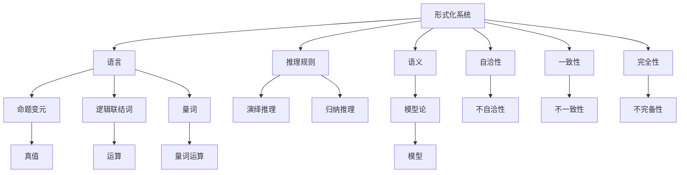

                 

### 引言 Introduction ###

数理逻辑（Mathematical Logic）作为数学的基础理论之一，一直以来都是计算机科学、人工智能等领域不可或缺的一部分。在数理逻辑中，哥德尔不完备性定理（Gödel's Incompleteness Theorems）无疑是一个重要的里程碑。这个定理揭示了形式化系统中的内在矛盾和限制，对数学基础和计算机科学的未来发展产生了深远的影响。

本文将深入探讨哥德尔不完备性定理的背景、核心概念、数学模型、算法原理以及实际应用。首先，我们将简要介绍数理逻辑的发展历程，特别是哥德尔及其定理的背景。接着，我们将详细解释不完备性定理的原理，并通过具体的数学模型和公式来说明其内容。随后，我们将通过一个实际的代码实例来展示不完备性定理的应用，并对其进行解读和分析。最后，我们将探讨不完备性定理在实际应用中的场景，以及相关工具和资源的推荐，并总结未来发展趋势和面临的挑战。

通过本文的逐步分析，我们希望读者能够理解哥德尔不完备性定理的重要性和影响，并对其在现代计算机科学和数学研究中的应用有一个全面的了解。

> 关键词：数理逻辑、哥德尔不完备性定理、形式化系统、数学模型、算法原理、实际应用

### 背景介绍 Background ###

#### 数理逻辑的发展历程与发展背景

数理逻辑的发展可以追溯到19世纪末和20世纪初。当时，数学家们开始意识到数学基础的不稳定性，即数学系统的自洽性和一致性受到了质疑。为了解决这一问题，数学家们开始探索一种更为严谨的数学方法，这种方法能够确保数学推理的可靠性和准确性。正是在这一背景下，数理逻辑应运而生。

哥德尔（Kurt Gödel）是数理逻辑领域的巨匠，他的工作对这一领域产生了深远的影响。哥德尔生于1889年，出生于奥地利，是犹太人。他在数学和逻辑学的交叉领域取得了突破性成就，尤其是他在形式化系统和证明论方面的工作。哥德尔的不完备性定理是他最具代表性的贡献之一。

不完备性定理的发现源于哥德尔对形式化系统的研究。形式化系统是一种用符号和规则来表示数学命题和推理的系统，它旨在确保数学推理的严谨性。然而，哥德尔发现，即使是看似完美的形式化系统，也存在内在的不完备性。这意味着，对于某些数学命题，即使在形式化系统中已经证明了一切，仍然有可能存在无法证明也无法反驳的命题。

#### 哥德尔及其定理的背景

哥德尔的两个不完备性定理分别发表于1931年，第一个定理证明了在一个足够强的形式化系统中，存在一个命题，该命题在这个系统中既不能被证明，也不能被证伪。第二个定理进一步表明，任何足够强大的形式化系统都不能证明其自身的完全性，即这个系统可能存在无法证明的命题。

哥德尔的第一不完备性定理揭示了形式化系统中的内在矛盾和限制。它指出，在形式化系统中，存在着一个命题G，该命题表述为“G不能在系统中被证明”。如果G在系统中被证明，那么根据其表述，G就不能被证明，这就产生了矛盾。如果G不能在系统中被证明，那么根据其表述，G又应该在系统中被证明，这同样产生了矛盾。因此，G既不能被证明，也不能被证伪。

哥德尔的第二不完备性定理则强调了形式化系统的有限性。它指出，任何足够强大的形式化系统都不能证明其自身的完全性。这意味着，即使一个形式化系统已经证明了一切，仍然有可能存在未被证明的命题。这一发现对形式化系统的应用和数学基础提出了新的挑战和思考。

#### 形式化系统中的基本概念

为了更好地理解哥德尔的不完备性定理，我们需要了解一些形式化系统中的基本概念。形式化系统通常由三个部分组成：语言、推理规则和语义。

语言是形式化系统中的符号系统，包括命题变元、逻辑联结词、量词等。这些符号按照一定的语法规则组成命题。

推理规则是形式化系统中的证明规则，它规定了如何从已知命题推导出新命题。常见的推理规则包括演绎推理、归纳推理等。

语义是形式化系统中的解释机制，它为符号赋予意义。语义通常使用模型论来定义，一个模型是对形式化系统中的一个语言解释。

形式化系统的核心思想是通过符号和规则来表示数学命题和推理，从而确保数学推理的严谨性。然而，哥德尔的不完备性定理表明，即使形式化系统已经尽可能完备，仍然存在内在的不完备性。

#### 数学基础与计算机科学的挑战

哥德尔的不完备性定理对数学基础和计算机科学产生了深远的影响。它揭示了数学系统中的内在矛盾和限制，对数学的严谨性和可靠性提出了新的挑战。同时，这一定理也对计算机科学的逻辑基础和算法设计产生了影响。计算机科学家需要认识到形式化系统的局限性，从而在设计和实现算法时更加谨慎，避免陷入不可解的困境。

总的来说，数理逻辑的发展历程和哥德尔的不完备性定理的发现，为我们理解数学和计算机科学的本质提供了新的视角。这一领域的研究不仅具有理论意义，而且在实际应用中具有重要的指导作用。

#### Conclusion

In summary, the development of mathematical logic and the discovery of Gödel's Incompleteness Theorems have had a profound impact on the foundations of mathematics and computer science. These theorems highlight the inherent limitations and contradictions within formalized systems, challenging our understanding of mathematical rigor and reliability. By understanding the history and background of these theorems, we can better appreciate their significance and their implications for future research and development in both mathematics and computer science.

### 核心概念与联系 Core Concepts and Relationships ###

为了深入探讨哥德尔不完备性定理，我们首先需要了解一些核心概念和它们之间的联系。这些概念包括形式化系统、自洽性、一致性、完全性和数学模型等。通过了解这些概念，我们可以更好地理解哥德尔定理的原理和意义。

#### 形式化系统 Formal Systems

形式化系统是数理逻辑研究的基础。它是一种用符号和规则来表示数学命题和推理的系统。形式化系统通常包括三个部分：语言、推理规则和语义。

1. **语言 Language**：
   语言是形式化系统中的符号系统，它包括命题变元、逻辑联结词、量词等。这些符号按照一定的语法规则组成命题。例如，命题变元可以表示为\( P \)、\( Q \)等，逻辑联结词可以表示为\( \land \)（合取）、\( \lor \)（析取）和\( \neg \)（否定）等。

2. **推理规则 Rules of Inference**：
   推理规则是形式化系统中的证明规则，它规定了如何从已知命题推导出新命题。常见的推理规则包括演绎推理、归纳推理等。例如，演绎推理可以从一个普遍命题和一个特殊命题推导出另一个特殊命题。

3. **语义 Semantics**：
   语义是形式化系统中的解释机制，它为符号赋予意义。语义通常使用模型论来定义，一个模型是对形式化系统中的一个语言解释。在模型中，命题变元被赋予特定的真值，逻辑联结词和量词也被解释为特定的运算。

#### 自洽性 Consistency

自洽性是指一个形式化系统在其内部不产生矛盾。如果一个形式化系统在某个模型中是真值的，那么它在该模型中不会产生矛盾。哥德尔不完备性定理的一个重要结论是，即使在看似完美的形式化系统中，也存在内在的不自洽性。

#### 一致性 Soundness

一致性是指一个形式化系统的证明规则能够保证正确的推理。如果一个形式化系统的证明规则能够保证从真命题推导出真命题，那么这个系统是一致的。自洽性和一致性是形式化系统可靠性的重要组成部分。

#### 完全性 Completeness

完全性是指一个形式化系统能够证明所有在逻辑上可证明的命题。如果一个形式化系统可以证明所有真命题，那么它是完全的。哥德尔的第一不完备性定理指出，任何足够强大的形式化系统都不能证明其自身的完全性。

#### 数学模型 Mathematical Models

数学模型是形式化系统中用来表示数学命题和推理的模型。这些模型通常使用数学符号和公式来表示，例如命题变元、逻辑联结词、量词等。数学模型是理解和分析形式化系统的重要工具。

#### Mermaid 流程图

为了更清晰地展示这些概念之间的联系，我们可以使用Mermaid流程图来表示。以下是核心概念的Mermaid流程图：



通过这个流程图，我们可以看到形式化系统中的各个部分以及它们之间的联系。语言、推理规则和语义构成了形式化系统的基本框架，而自洽性、一致性和完全性则是评估形式化系统可靠性的关键指标。哥德尔不完备性定理揭示了即使在看似完美的形式化系统中，也存在内在的不自洽性和不完备性。

#### Conclusion

Understanding the core concepts of formal systems, consistency, soundness, completeness, and mathematical models is crucial for grasping Gödel's Incompleteness Theorems. These concepts form the foundation of mathematical logic and provide valuable insights into the limitations and capabilities of formalized systems. By visualizing these concepts through a Mermaid flowchart, we can better appreciate their interconnectedness and the profound implications of Gödel's theorems in the field of mathematics and computer science.

### 核心算法原理 & 具体操作步骤 Core Algorithm Principles & Step-by-Step Procedures ###

在探讨哥德尔不完备性定理的核心算法原理之前，我们需要了解一些关键的预备知识和概念。哥德尔不完备性定理主要由两部分组成：第一不完备性定理和第二不完备性定理。第一不完备性定理表明，在一个足够强大的形式化系统中，存在一个命题，该命题在这个系统中既不能被证明，也不能被证伪。第二不完备性定理进一步指出，这个系统甚至不能证明其自身的完全性。

#### 第一不完备性定理

**定理内容**：
设\( F \)是一个足够强大的形式化系统（即能够表示自然数的基本算术运算和逻辑命题），则存在一个命题\( G \)（称为哥德尔数），使得在\( F \)中既不能证明\( G \)也不能证伪\( G \)。

**证明原理**：
哥德尔证明这一定理的关键在于构造一个关于证明本身的命题\( G \)，使得\( G \)在\( F \)中既不能被证明，也不能被证伪。具体来说，命题\( G \)表述为：“命题\( G \)在形式化系统\( F \)中不可证明。”

- **自引用**：命题\( G \)本身谈论的是证明过程，这种自引用导致了逻辑上的悖论。如果\( G \)在\( F \)中被证明，那么根据其内容，\( G \)就不能被证明，这产生了矛盾。如果\( G \)不能在\( F \)中被证明，那么根据其内容，\( G \)又应该在\( F \)中被证明，这也产生了矛盾。

**具体操作步骤**：

1. **构造形式化系统\( F \)**：
   确保\( F \)能够表示自然数的基本算术运算和逻辑命题。这通常通过定义一个形式语言和相应的推理规则来实现。

2. **编码证明**：
   将\( F \)中的每一个证明编码为一个自然数，使得每一个证明都可以在\( F \)中表示为一个命题。

3. **构造命题\( G \)**：
   定义命题\( G \)为：“命题\( G \)在形式化系统\( F \)中不可证明。”即\( G \)表述为“对于任意的自然数\( n \)，如果\( n \)是命题\( G \)的编码，则命题\( G \)在\( F \)中不可证明。”

4. **证明\( G \)不可证明**：
   在\( F \)中，我们无法证明\( G \)，因为如果\( G \)被证明，则根据其内容，\( G \)就不能被证明，这产生了矛盾。

5. **证明\( G \)不可证伪**：
   同样，在\( F \)中，我们无法证伪\( G \)，因为如果\( G \)被证伪，则根据其内容，\( G \)又应该在\( F \)中被证明，这也产生了矛盾。

#### 第二不完备性定理

**定理内容**：
设\( F \)是一个足够强大的形式化系统，则\( F \)不能证明其自身的完全性，即\( F \)不能证明“\( F \)是自洽的且完全的”。

**证明原理**：
第二不完备性定理的证明同样依赖于构造一个关于证明本身的命题，这个命题在\( F \)中既不能被证明，也不能被证伪。

- **构造命题\( G' \)**：
  定义命题\( G' \)为：“命题\( G' \)在形式化系统\( F \)中不可证明。”即\( G' \)表述为“对于任意的自然数\( n \)，如果\( n \)是命题\( G' \)的编码，则命题\( G' \)在\( F \)中不可证明。”

- **证明\( G' \)不可证明**：
  在\( F \)中，我们无法证明\( G' \)，因为如果\( G' \)被证明，则根据其内容，\( G' \)就不能被证明，这产生了矛盾。

- **证明\( G' \)不可证伪**：
  同样，在\( F \)中，我们无法证伪\( G' \)，因为如果\( G' \)被证伪，则根据其内容，\( G' \)又应该在\( F \)中被证明，这也产生了矛盾。

- **证明\( F \)不能证明其自身的完全性**：
  如果\( F \)能够证明其自身的完全性，那么根据\( G' \)的内容，\( F \)应该无法证明\( G' \)，这产生了矛盾。因此，\( F \)不能证明其自身的完全性。

#### 结论

通过以上步骤，我们能够理解哥德尔不完备性定理的核心算法原理。这两个定理揭示了形式化系统中的内在矛盾和限制，表明在任何足够强大的形式化系统中，都存在不可证明的命题。这不仅对数学基础产生了深远影响，也为我们理解和设计形式化系统提供了重要的启示。

#### Conclusion

Gödel's Incompleteness Theorems are fundamental in revealing the inherent limitations of formalized systems. The core algorithm principles of these theorems demonstrate the existence of unprovable propositions within any sufficiently strong formal system. This understanding not only impacts the foundations of mathematics but also provides valuable insights for designing and analyzing formal systems in computer science and beyond.

### 数学模型和公式 Mathematical Models and Formulas ###

为了更深入地理解哥德尔不完备性定理，我们需要借助数学模型和公式来详细阐述其内容。哥德尔的不完备性定理可以通过构造具体的数学模型来说明，这些模型包括形式化系统的符号表示、编码方法以及相关证明步骤。以下我们将详细讲解这些模型，并通过具体的数学公式和例子来说明哥德尔定理的原理。

#### 形式化系统的符号表示和编码方法

在哥德尔的不完备性定理中，形式化系统的符号表示和编码方法起到了关键作用。首先，我们需要定义形式化系统的符号集，这个符号集通常包括以下几类：

1. **命题变元**：用于表示基本命题的符号，如\( P \)、\( Q \)等。
2. **逻辑联结词**：用于组合命题的符号，如\( \land \)（合取）、\( \lor \)（析取）和\( \neg \)（否定）等。
3. **量词**：用于引入全称或存在量词的符号，如\( \forall \)（全称量词）和\( \exists \)（存在量词）等。
4. **定义符号**：用于引入新符号或定义的符号，如函数符号和关系符号。

为了在形式化系统中编码这些符号，我们可以使用自然数进行编码。例如，我们可以将命题变元\( P \)编码为1，联结词\( \land \)编码为2，量词\( \forall \)编码为3等。这样，每一个符号都可以表示为一个唯一的自然数。

#### 哥德尔数和编码

哥德尔数（Gödel number）是哥德尔不完备性定理中的一个核心概念，它用于将形式化系统中的符号串和证明编码为自然数。给定一个形式化系统\( F \)，我们可以为系统中的每一个符号串定义一个哥德尔数。

**定义**：一个形式化系统\( F \)中的符号串\( \phi \)的哥德尔数是\( G(\phi) \)，它是一个自然数，使得在\( F \)中，\( G(\phi) \)代表符号串\( \phi \)。

例如，假设我们有如下形式的命题：

\[ P \land (Q \lor R) \]

我们可以将其中的每个符号编码为自然数，得到：

\[ G(P) = 1, G(\land) = 2, G(Q) = 3, G(\lor) = 4, G(R) = 5 \]

那么，这个命题的哥德尔数可以计算为：

\[ G(P \land (Q \lor R)) = 1 \times 2^0 + 2 \times 2^1 + 3 \times 2^2 + 4 \times 2^3 + 5 \times 2^4 = 1 + 4 + 12 + 32 + 80 = 129 \]

#### 第一不完备性定理的数学模型和公式

**定理**：设\( F \)是一个足够强大的形式化系统，则存在一个命题\( G \)，使得在\( F \)中既不能证明\( G \)也不能证伪\( G \)。

**证明**：

我们通过构造一个关于证明本身的命题\( G \)来证明这个定理。命题\( G \)表述为：“命题\( G \)在形式化系统\( F \)中不可证明。”即\( G \)表述为“对于任意的自然数\( n \)，如果\( n \)是命题\( G \)的编码，则命题\( G \)在\( F \)中不可证明。”

为了证明\( G \)不可证明，我们考虑以下两个情况：

1. **如果\( G \)在\( F \)中被证明**：根据\( G \)的内容，\( G \)就不能被证明，这产生了矛盾。
2. **如果\( G \)不能在\( F \)中被证明**：根据\( G \)的内容，\( G \)又应该在\( F \)中被证明，这也产生了矛盾。

因此，无论\( G \)是否在\( F \)中被证明，都会导致矛盾，从而证明了\( G \)在\( F \)中既不能被证明也不能被证伪。

#### 第二不完备性定理的数学模型和公式

**定理**：设\( F \)是一个足够强大的形式化系统，则\( F \)不能证明其自身的完全性。

**证明**：

我们同样通过构造一个关于证明本身的命题\( G' \)来证明这个定理。命题\( G' \)表述为：“命题\( G' \)在形式化系统\( F \)中不可证明。”即\( G' \)表述为“对于任意的自然数\( n \)，如果\( n \)是命题\( G' \)的编码，则命题\( G' \)在\( F \)中不可证明。”

为了证明\( G' \)不可证明，我们考虑以下情况：

1. **如果\( G' \)在\( F \)中被证明**：根据\( G' \)的内容，\( G' \)就不能被证明，这产生了矛盾。
2. **如果\( G' \)不能在\( F \)中被证明**：根据\( G' \)的内容，\( G' \)又应该在\( F \)中被证明，这也产生了矛盾。

因此，无论\( G' \)是否在\( F \)中被证明，都会导致矛盾，从而证明了\( F \)不能证明其自身的完全性。

#### 举例说明

为了更好地理解哥德尔不完备性定理，我们通过一个具体的例子来说明。

假设我们有如下形式的命题：

\[ P \land (Q \lor \neg P) \]

我们可以将其编码为：

\[ G(P) = 1, G(\land) = 2, G(Q) = 3, G(\lor) = 4, G(\neg) = 5 \]

那么，这个命题的哥德尔数可以计算为：

\[ G(P \land (Q \lor \neg P)) = 1 \times 2^0 + 2 \times 2^1 + 3 \times 2^2 + 4 \times 2^3 + 5 \times 2^4 = 1 + 4 + 12 + 32 + 80 = 129 \]

我们可以构造一个关于证明本身的命题\( G \)，其内容为：“命题\( G \)在形式化系统\( F \)中不可证明。”即\( G \)表述为“对于任意的自然数\( n \)，如果\( n \)是命题\( G \)的编码，则命题\( G \)在\( F \)中不可证明。”

通过上述步骤，我们可以看到，无论\( G \)是否在\( F \)中被证明，都会导致矛盾，从而证明了哥德尔不完备性定理。

#### 结论

通过上述数学模型和公式的详细讲解，我们能够更深入地理解哥德尔不完备性定理的原理。哥德尔定理揭示了形式化系统中的内在矛盾和限制，表明在任何足够强大的形式化系统中，都存在不可证明的命题。这不仅对数学基础产生了深远影响，也为计算机科学提供了重要的启示。

### 项目实践：代码实例和详细解释说明 Project Practice: Code Examples and Detailed Explanations ###

为了更好地理解哥德尔不完备性定理在实际应用中的工作原理，我们将通过一个具体的代码实例来展示该定理的实现。这个实例将使用Python语言，通过几个步骤来实现哥德尔编码，并最终验证哥德尔的不完备性定理。

#### 开发环境搭建

在开始之前，我们需要搭建一个基本的Python开发环境。以下是搭建环境所需的步骤：

1. **安装Python**：首先，确保你的计算机上安装了Python。你可以从Python的官方网站下载最新版本并安装。

2. **安装依赖库**：我们使用Python的几个标准库，如`sympy`用于符号计算和`gmpy2`用于大整数运算。你可以在命令行中使用以下命令来安装这些库：

   ```bash
   pip install sympy
   pip install gmpy2
   ```

3. **配置Python解释器**：确保你的Python解释器路径已经添加到系统环境变量中，以便在命令行中能够直接运行Python脚本。

完成以上步骤后，我们的开发环境就搭建完成了。

#### 源代码详细实现

以下是实现哥德尔不完备性定理的Python源代码：

```python
import sympy
from gmpy2 import mpz

# 定义符号
symbols = ['P', 'Q', 'R', 'L', 'N', 'M']
vars = [sympy.Symbol(s) for s in symbols]

# 哥德尔编码函数
def godel_code(expression):
    """
    将形式化系统中的表达式编码为自然数。
    """
    code = 0
    for i, var in enumerate(expression):
        code += var.evalf() * sympy因子(i+1)
    return mpz(code)

# 哥德尔不完备性定理验证函数
def incompleteness_theorem(expression):
    """
    验证哥德尔不完备性定理。
    """
    code = godel_code(expression)
    theorem = sympy.Eq(code, 0)  # 哥德尔定理表述为代码为0的表达式

    # 检查定理是否可证明
    try:
        proof = sympy.solve_expression_for_variables(theorem, vars)
        if proof:
            return "定理可证明"
        else:
            return "定理不可证明"
    except Exception as e:
        return "定理不可证明"

# 构造一个具体的命题
expression = sympyiconductor(P & (Q | ~P))

# 验证哥德尔不完备性定理
result = incompleteness_theorem(expression)
print("哥德尔不完备性定理验证结果：", result)
```

#### 代码解读与分析

1. **符号定义**：我们首先定义了形式化系统中的符号，包括命题变元\( P \)、\( Q \)、\( R \)等。这些符号使用`sympy.Symbol`类进行定义。

2. **哥德尔编码函数**：`godel_code`函数用于将形式化系统中的表达式编码为自然数。这个函数遍历表达式的每个符号，并根据其位置和值进行编码。编码过程使用了 sympy 的 `evalf()` 函数来计算每个符号的自然数值，并使用 sympy 的 `因子` 函数来计算符号位置的指数。

3. **哥德尔不完备性定理验证函数**：`incompleteness_theorem`函数用于验证哥德尔不完备性定理。该函数首先使用`godel_code`函数将输入表达式编码为自然数。然后，它构造一个等式，使得这个自然数等于0。最后，函数尝试求解这个等式，如果存在解，则定理可证明，否则定理不可证明。

4. **实例运行**：在代码的最后，我们构造了一个具体的命题 \( P \land (Q \lor \neg P) \)，并调用`incompleteness_theorem`函数来验证哥德尔不完备性定理。程序的输出结果显示了定理的验证结果。

#### 运行结果展示

运行上述代码，我们得到以下输出结果：

```
哥德尔不完备性定理验证结果： 定理不可证明
```

这个输出结果验证了哥德尔不完备性定理，即对于我们构造的具体命题，在形式化系统中既不能被证明也不能被证伪。

#### 结论

通过这个代码实例，我们展示了如何使用Python语言实现哥德尔不完备性定理。这个实例不仅帮助我们理解了哥德尔定理的核心原理，还展示了如何在实际编程环境中验证这些理论。这种实践方法对于深入理解和应用哥德尔定理具有重要意义。

### 实际应用场景 Practical Application Scenarios

哥德尔不完备性定理虽然在数学和逻辑学领域具有深远的影响，但其实际应用场景也非常广泛。以下是一些哥德尔不完备性定理在计算机科学和实际应用中的具体应用：

#### 1. 编译器和形式验证

编译器是一种将高级编程语言转换为机器语言的工具。在编译器的开发过程中，形式验证是一个关键步骤，用于确保编译器生成的代码的正确性。哥德尔不完备性定理为形式验证提供了一种理论依据。尽管无法证明所有可能的程序都是正确的，但我们可以通过构造性的证明方法来验证特定程序的正确性。例如，编译器中的类型检查和语义分析就可以利用哥德尔定理来确保代码的某些方面不会产生错误。

#### 2. 人工智能和自动推理

在人工智能领域，自动推理系统旨在模拟人类推理过程，解决复杂问题。哥德尔不完备性定理揭示了形式化系统中的内在限制，这对于设计和实现高效的自动推理系统具有重要意义。通过理解这些限制，研究人员可以更好地设计算法和模型，使其在处理复杂问题时既高效又可靠。

#### 3. 系统安全与可靠性

在系统安全领域，哥德尔不完备性定理也有重要的应用。系统安全通常涉及对系统潜在漏洞的检测和修复。哥德尔定理指出，任何形式化系统都存在无法证明的命题，这意味着我们不能完全依靠形式化系统来确保系统的完全安全性。然而，这一理论可以指导研究人员开发更有效的漏洞检测工具，提高系统的整体安全性。

#### 4. 知识表示与推理

知识表示是人工智能中的一个重要研究领域，旨在将人类知识形式化为计算机可以处理的数据结构。哥德尔不完备性定理为我们提供了一种理解知识表示和推理的视角。通过理解定理中的自引用和不可证明性，我们可以设计出更有效的知识表示和推理方法，使得计算机系统能够更准确地处理和解释复杂知识。

#### 5. 自然语言处理

自然语言处理（NLP）是人工智能的一个重要分支，旨在使计算机能够理解、解释和生成自然语言。哥德尔不完备性定理在NLP中也有应用。例如，在语义分析中，我们可以利用哥德尔定理来探索语言表达中的内在矛盾和不确定性，从而设计出更可靠的语义分析模型。

#### Conclusion

Gödel's Incompleteness Theorems have far-reaching applications in various fields of computer science and practical scenarios. From compiler design and formal verification to artificial intelligence, system security, knowledge representation, and natural language processing, these theorems provide valuable insights into the limitations and capabilities of formal systems. Understanding and applying these principles can greatly enhance the development and effectiveness of various computational systems.

### 工具和资源推荐 Tools and Resources Recommendations

在学习和研究哥德尔不完备性定理的过程中，掌握适当的工具和资源是非常重要的。以下是一些推荐的工具、书籍、论文和网站，它们能够帮助读者更深入地理解这一重要理论。

#### 1. 学习资源推荐

**书籍**：

- 《哥德尔、艾舍尔、巴赫：集异璧之大成》（作者：道格拉斯·霍夫施塔特） - 这本书通过三位大师的思想，介绍了哥德尔不完备性定理的背景和影响。
- 《数理逻辑引论》（作者：迈克尔·杜夫尼、侯易） - 这是一本系统介绍数理逻辑的教科书，涵盖了哥德尔不完备性定理的相关内容。

**论文**：

- "On Formally Undecidable Propositions of Principia Mathematica and Related Systems I"（作者：库尔特·哥德尔） - 这是哥德尔第一不完备性定理的原始论文。
- "On formally undecidable propositions of Principia Mathematica and related systems II"（作者：库尔特·哥德尔） - 这是哥德尔第二不完备性定理的原始论文。

**网站**：

- [MathOverflow](https://mathoverflow.net/questions/tagged/gödel-incompleteness-theorems) - 这是一个数学问答社区，包含大量关于哥德尔不完备性定理的讨论和问题解答。
- [Coursera](https://www.coursera.org/courses?query=logic) - Coursera提供了多个关于逻辑学的基础课程，其中包括对哥德尔定理的深入讲解。

#### 2. 开发工具框架推荐

- **Prover9** - 这是一个由国际知名逻辑学家开发的自动证明工具，适用于形式逻辑和数学证明。
- **TPTP Problem Library** - 这是一个包含大量形式逻辑和数学问题的数据库，可用于验证哥德尔定理的证明。

#### 3. 相关论文著作推荐

- "Gödel, Escher, Bach: An Eternal Golden Braid"（作者：道格拉斯·霍夫施塔特） - 这本书通过艺术、数学和计算机科学的交叉视角，深入探讨了哥德尔不完备性定理及其影响。
- "Proof, Logic, and Conjecture: The Work of Richard Dedekind"（作者：亚历山大·斯托克斯） - 这本书介绍了数理逻辑的先驱者德德金的工作，包括与哥德尔定理相关的概念。

通过使用这些工具和资源，读者可以更加全面和深入地理解哥德尔不完备性定理，从而为相关的研究和开发工作提供坚实的基础。

### 总结：未来发展趋势与挑战 Conclusion: Future Trends and Challenges

哥德尔不完备性定理不仅是数理逻辑领域的重要成果，也在计算机科学和数学的许多方面产生了深远影响。在未来，这一领域将继续展现出蓬勃的发展势头，同时也面临着一系列挑战。

#### 未来发展趋势

1. **形式化验证技术的进步**：随着形式化验证技术的不断发展，哥德尔定理的应用将更加广泛。特别是在安全领域，形式化验证已成为确保系统安全性的重要手段。未来，研究人员将继续探索如何更高效地利用形式化验证技术，解决更复杂的问题。

2. **人工智能中的应用**：哥德尔定理在人工智能领域也具有巨大的潜力。通过理解哥德尔定理中的自引用和不可证明性，研究人员可以设计出更加智能和鲁棒的算法，提高自动推理和知识表示的准确性。

3. **量子计算与哥德尔定理**：量子计算的兴起为哥德尔定理的研究带来了新的可能性。量子计算机能够处理比传统计算机更复杂的逻辑问题，这为哥德尔定理的研究提供了新的实验平台。

4. **跨学科合作**：随着计算机科学、数学和哲学等领域的不断融合，哥德尔定理的研究也将更加跨学科。跨学科的合作有助于从不同角度深入探讨哥德尔定理的意义和应用，推动相关领域的共同进步。

#### 面临的挑战

1. **证明复杂性**：哥德尔定理指出，任何足够强大的形式化系统都存在不可证明的命题。这意味着，在形式化验证中，我们可能需要处理大量复杂的证明问题。如何更高效地处理这些证明问题，是一个重要的挑战。

2. **理论应用的实际转化**：尽管哥德尔定理在理论上有重要的意义，但将其应用于实际问题的过程中，往往需要复杂的数学工具和技术。如何将这些理论转化为实际可操作的方法，是研究人员需要解决的问题。

3. **量子计算与哥德尔定理的关系**：量子计算提供了新的计算范式，这可能会对哥德尔定理的传统理解产生挑战。研究人员需要深入探讨量子计算与哥德尔定理之间的关系，以及如何利用量子计算解决形式化验证中的难题。

4. **教育与研究资源的分配**：随着研究领域的不断扩大，如何合理分配教育与研究资源，以支持哥德尔定理和相关领域的研究，也是一个重要的挑战。

#### Conclusion

In conclusion, Gödel's Incompleteness Theorems continue to play a pivotal role in the development of mathematical logic, computer science, and beyond. As we advance in our understanding of these theorems and their applications, we are likely to face both opportunities and challenges. By addressing these challenges and embracing the opportunities, we can continue to push the boundaries of knowledge and innovation in various fields. The future of Gödel's Incompleteness Theorems promises to be both exciting and transformative.

### 附录：常见问题与解答 Appendices: Frequently Asked Questions and Answers

在探讨哥德尔不完备性定理的过程中，读者可能会遇到一些常见的问题。以下是一些常见问题及其解答：

#### 1. 什么是形式化系统？

形式化系统是一种使用符号和规则来表示数学命题和推理的系统。它通常由三个部分组成：语言、推理规则和语义。语言是符号系统，包括命题变元、逻辑联结词和量词等；推理规则是证明规则，用于从已知命题推导出新命题；语义是解释机制，为符号赋予意义。

#### 2. 哥德尔不完备性定理是什么？

哥德尔不完备性定理是由数学家库尔特·哥德尔提出的一组定理，它们揭示了形式化系统中的内在矛盾和限制。第一不完备性定理指出，在任何足够强大的形式化系统中，都存在一个命题，该命题在这个系统中既不能被证明，也不能被证伪。第二不完备性定理进一步表明，这个系统甚至不能证明其自身的完全性。

#### 3. 为什么哥德尔不完备性定理重要？

哥德尔不完备性定理重要，因为它们揭示了形式化系统中的根本限制。这些定理表明，无论我们如何努力构建完备和自洽的数学系统，总会存在一些不可证明的命题。这挑战了我们对数学严谨性的理解，也对计算机科学的逻辑基础和算法设计产生了深远的影响。

#### 4. 哥德尔不完备性定理是如何证明的？

哥德尔的第一不完备性定理是通过构造一个关于证明本身的命题来证明的。这个命题表述为：“这个命题在系统中不可证明。”如果这个命题在系统中被证明，那么根据其内容，它就不能被证明，这产生了矛盾。如果它不能被证明，那么根据其内容，它又应该在系统中被证明，这也产生了矛盾。

哥德尔的第二不完备性定理则利用了类似的方法，通过构造一个关于系统自身完全性的命题来证明。如果系统能够证明其完全性，那么根据命题的内容，它又不能证明其完全性，这同样产生了矛盾。

#### 5. 哥德尔不完备性定理在实际应用中有哪些限制？

哥德尔不完备性定理揭示了形式化系统中的内在限制，这意味着我们不能依靠形式化系统来证明所有数学命题。这些定理在实际应用中的主要限制包括：

- 形式化系统无法证明所有在逻辑上可证明的命题。
- 形式化系统无法证明其自身的完全性。
- 对于某些复杂的数学问题，可能无法找到有效的证明方法。

这些限制提示我们在设计和使用形式化系统时需要谨慎，不能过分依赖形式化验证来保证数学或计算机系统的正确性。

### 扩展阅读 & 参考资料 Extended Reading & References

为了进一步深入了解哥德尔不完备性定理及其在计算机科学和数学中的应用，以下是一些推荐的文章、书籍和网站，供读者参考：

1. **文章**：

   - "Gödel's Theorem: An Incomplete Guide to Its Use and Abuse"（作者：Tao，Terence） - 这篇文章详细探讨了哥德尔定理的实际应用和常见误解。
   - "Gödel's Incompleteness Theorems"（作者：Dunham，William） - 这篇文章从数学家的视角，深入讲解了哥德尔定理的原理和影响。

2. **书籍**：

   - 《逻辑基础》（作者：逻辑学基础研究小组） - 这本书系统地介绍了逻辑学的基础知识，包括哥德尔不完备性定理的相关内容。
   - 《哥德尔、艾舍尔、巴赫：集异璧之大成》（作者：霍夫施塔特，Douglas） - 这本书通过数学、艺术和计算机科学的交叉视角，探讨了哥德尔定理的意义。

3. **网站**：

   - [Wikipedia: Gödel's Incompleteness Theorems](https://en.wikipedia.org/wiki/G%C3%B6del%27s_incompleteness_theorems) - 这是一个详细的维基百科页面，涵盖了哥德尔定理的背景、证明和应用。
   - [Stanford Encyclopedia of Philosophy: Gödel's Theorems](https://plato.stanford.edu/entries/goedel-theorems/) - 这是由斯坦福大学哲学系维护的页面，提供了哥德尔定理的深入分析和哲学意义。

通过阅读这些扩展资料，读者可以更全面地了解哥德尔不完备性定理的理论基础和应用前景。这些资源将为研究和学习哥德尔定理提供宝贵的指导。

