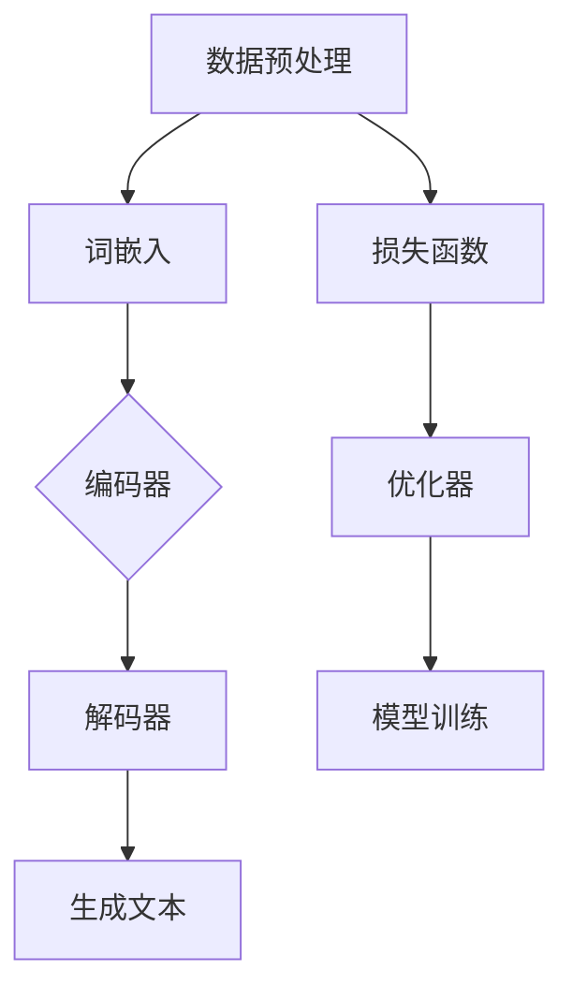

                 

### 1. 背景介绍

文本生成（Text Generation）是自然语言处理（Natural Language Processing, NLP）领域中的一个重要研究方向。近年来，随着深度学习技术的飞速发展，文本生成技术取得了显著的进步。文本生成技术不仅广泛应用于聊天机器人、自动摘要、机器翻译、情感分析等实际应用场景，而且在人工智能、计算机视觉等领域也有着广泛的应用。

文本生成可以分为两大类：基于规则的文本生成和基于数据的文本生成。基于规则的文本生成主要依赖于人工定义的语法规则和模板，其生成文本的准确性和灵活性相对较低。而基于数据的文本生成则通过学习大量的文本数据，利用神经网络等机器学习模型自动生成文本。随着深度学习技术的引入，基于数据的文本生成方法得到了广泛的关注和研究，成为当前文本生成领域的主流方向。

本文将主要探讨基于深度学习的文本生成技术。我们将从核心概念、算法原理、数学模型、项目实践等多个角度详细分析文本生成技术的实现和应用。通过本文的阅读，您将能够全面了解文本生成技术的原理和应用，并具备一定的实践能力。

### 2. 核心概念与联系

要深入理解文本生成技术，首先需要明确几个核心概念，并探讨它们之间的联系。以下是本文将涉及的主要核心概念：

#### 2.1 生成式模型与判别式模型

生成式模型（Generative Model）和判别式模型（Discriminative Model）是机器学习领域的两大类模型。生成式模型旨在直接生成数据，而判别式模型则通过学习数据特征来区分不同类别。

在文本生成领域，生成式模型主要用于生成新的文本，例如生成式对抗网络（GANs）、变分自编码器（VAEs）等。这些模型通过学习输入文本的分布来生成新的文本。而判别式模型，如卷积神经网络（CNNs）、循环神经网络（RNNs）等，主要用于分类和识别文本特征。

#### 2.2 神经网络与深度学习

神经网络（Neural Networks）是深度学习（Deep Learning）的基础。神经网络通过模拟人脑神经元之间的连接和交互，实现对复杂数据的处理和分析。深度学习则是神经网络的一种扩展，通过多层神经网络结构来提高模型的表达能力和准确性。

在文本生成领域，神经网络广泛应用于编码和解码过程。编码器（Encoder）用于将输入文本映射到一个高维的语义空间，而解码器（Decoder）则从该语义空间生成新的文本。

#### 2.3 词嵌入与序列模型

词嵌入（Word Embedding）是将词汇映射到高维向量空间的技术，是自然语言处理的基础。通过词嵌入，文本数据可以被表示为密集的向量，从而适合于神经网络模型处理。

序列模型（Sequence Model）是处理序列数据的一种常见方法，包括循环神经网络（RNNs）、长短期记忆网络（LSTMs）、门控循环单元（GRUs）等。这些模型通过学习输入序列的时序信息，能够有效地生成新的文本序列。

#### 2.4 训练与优化

训练（Training）是指通过大量的样本数据来调整模型参数，使其能够准确预测新的数据。优化（Optimization）是指在训练过程中，通过调整模型参数来提高模型性能的过程。

在文本生成领域，训练过程通常涉及大量文本数据的预处理、编码和解码器的训练、损失函数的优化等步骤。优化方法主要包括梯度下降（Gradient Descent）及其各种变种，如Adam优化器等。

#### 2.5 生成质量与多样性

生成质量（Generation Quality）和多样性（Diversity）是评估文本生成模型性能的重要指标。生成质量衡量模型生成文本的准确性和流畅性，而多样性则衡量模型生成文本的丰富性和创造性。

为了提高生成质量，模型需要学习丰富的语义信息和上下文信息。而为了提高多样性，模型需要具备较强的随机性和创造力。

#### 2.6 Mermaid 流程图

为了更直观地理解文本生成技术的基本架构，我们使用Mermaid流程图（无括号、逗号等特殊字符）展示其核心组件和流程：



在该流程图中，数据预处理（A）是文本生成的基础，词嵌入（B）用于将文本转换为向量表示。编码器（C）和解码器（D）是文本生成模型的核心组件，分别负责将输入文本编码为语义表示和解码为输出文本。生成文本（E）是最终的目标。损失函数（F）和优化器（G）用于模型训练，调整模型参数以优化性能。模型训练（H）是整个过程的关键步骤，通过不断的迭代和优化，最终生成高质量的文本。

### 3. 核心算法原理 & 具体操作步骤

在了解文本生成技术的基本概念和架构后，我们接下来将深入探讨文本生成模型的核心算法原理及其具体操作步骤。

#### 3.1 基于生成式模型的文本生成

生成式模型在文本生成领域有着广泛的应用，其中最经典的模型之一是生成式对抗网络（Generative Adversarial Networks, GANs）。GANs由两个神经网络——生成器（Generator）和判别器（Discriminator）组成，它们相互对抗以生成高质量的数据。

##### 3.1.1 GANs 基本原理

生成器（Generator）的目的是生成与真实数据相似的数据，判别器（Discriminator）的目的是区分真实数据和生成数据。这两个网络相互对抗，生成器试图欺骗判别器，使其无法区分生成的数据和真实数据，而判别器则试图识别出生成数据。

训练过程中，GANs通过以下步骤进行：

1. **初始化**：随机初始化生成器和判别器的参数。
2. **生成器训练**：生成器生成虚假数据，判别器对其进行分类判断。
3. **判别器训练**：生成器生成的虚假数据和真实数据进行分类，更新判别器参数。
4. **生成器更新**：生成器根据判别器的反馈，调整自身参数，以提高生成数据的真实性。

##### 3.1.2 操作步骤

1. **数据准备**：收集并预处理大量真实文本数据。
2. **词嵌入**：将文本数据转换为词嵌入向量。
3. **生成器结构**：构建生成器网络，通常采用循环神经网络（RNN）或长短期记忆网络（LSTM）。
4. **判别器结构**：构建判别器网络，通常采用卷积神经网络（CNN）或RNN。
5. **模型训练**：通过对抗训练，迭代优化生成器和判别器的参数。
6. **生成文本**：使用训练好的生成器生成新的文本数据。

#### 3.2 基于变分自编码器（VAEs）的文本生成

变分自编码器（Variational Autoencoder, VAEs）是另一种生成式模型，它通过概率模型来生成数据，并在生成过程中引入了变分推断（Variational Inference）。

##### 3.2.1 VAEs 基本原理

VAEs由编码器（Encoder）和解码器（Decoder）组成。编码器将输入数据映射到一个潜在空间（Latent Space），解码器从潜在空间生成新的数据。VAEs的核心在于变分推断，它通过概率模型来表示数据分布，从而更好地捕捉数据中的复杂结构。

训练过程中，VAEs通过以下步骤进行：

1. **编码器训练**：编码器将输入数据映射到潜在空间。
2. **解码器训练**：解码器从潜在空间生成新的数据。
3. **损失函数**：通过重建损失（Reconstruction Loss）和KL散度（KL Divergence）来优化模型参数。
4. **生成文本**：从潜在空间采样生成新的文本数据。

##### 3.2.2 操作步骤

1. **数据准备**：收集并预处理大量真实文本数据。
2. **词嵌入**：将文本数据转换为词嵌入向量。
3. **编码器结构**：构建编码器网络，通常采用RNN或LSTM。
4. **解码器结构**：构建解码器网络，通常采用RNN或LSTM。
5. **模型训练**：通过变分推断，迭代优化编码器和解码器的参数。
6. **生成文本**：从潜在空间采样生成新的文本数据。

#### 3.3 基于变换器（Transformers）的文本生成

变换器（Transformers）是近年来兴起的一种基于自注意力机制（Self-Attention）的神经网络模型，其在文本生成领域取得了显著的效果。

##### 3.3.1 Transformers 基本原理

Transformers模型通过自注意力机制，将输入文本序列中的每个单词与其余单词建立关联，从而捕捉文本的上下文信息。自注意力机制通过计算单词之间的相似性分数，将输入序列转换为一个高维的表示向量。

训练过程中，Transformers通过以下步骤进行：

1. **编码器训练**：编码器将输入文本序列编码为表示向量。
2. **解码器训练**：解码器从表示向量生成新的文本序列。
3. **损失函数**：通过交叉熵损失（Cross-Entropy Loss）来优化模型参数。
4. **生成文本**：使用训练好的解码器生成新的文本数据。

##### 3.3.2 操作步骤

1. **数据准备**：收集并预处理大量真实文本数据。
2. **词嵌入**：将文本数据转换为词嵌入向量。
3. **编码器结构**：构建编码器网络，采用多层自注意力机制。
4. **解码器结构**：构建解码器网络，采用自注意力机制和循环神经网络（RNN）。
5. **模型训练**：通过反向传播和梯度下降，迭代优化编码器和解码器的参数。
6. **生成文本**：使用训练好的解码器生成新的文本数据。

通过上述核心算法原理和具体操作步骤的介绍，我们可以看到，文本生成技术的实现涉及多个组件和步骤，包括数据预处理、词嵌入、神经网络结构设计、模型训练和优化等。这些技术不仅在理论层面具有深厚的基础，而且在实际应用中也取得了显著的成果。

### 4. 数学模型和公式 & 详细讲解 & 举例说明

在深入理解文本生成技术的算法原理后，接下来我们将探讨其背后的数学模型和公式，并通过具体例子来详细讲解这些公式在实际应用中的使用方法。

#### 4.1 生成式模型中的概率分布

生成式模型的核心在于概率分布，通过学习输入数据的概率分布来生成新的数据。以下是一些常用的概率分布及其在文本生成中的应用。

##### 4.1.1 正态分布

正态分布（Normal Distribution），也称为高斯分布，是最常见的概率分布之一。其概率密度函数为：

\[ f(x|\mu, \sigma^2) = \frac{1}{\sqrt{2\pi\sigma^2}} e^{-\frac{(x-\mu)^2}{2\sigma^2}} \]

其中，\(\mu\)是均值，\(\sigma^2\)是方差。

在文本生成中，正态分布可以用于生成连续的文本特征，例如词频分布。

##### 4.1.2 二项分布

二项分布（Binomial Distribution）用于描述成功和失败的概率，其概率质量函数为：

\[ P(X=k) = C_n^k p^k (1-p)^{n-k} \]

其中，\(n\)是试验次数，\(k\)是成功的次数，\(p\)是每次试验成功的概率。

在文本生成中，二项分布可以用于生成词的出现次数，例如在生成句子的词频分布时。

##### 4.1.3 伯努利分布

伯努利分布是二项分布的特例，当\(n=1\)时，二项分布即为伯努利分布。其概率质量函数为：

\[ P(X=1) = p \]
\[ P(X=0) = 1-p \]

在文本生成中，伯努利分布可以用于生成词的布尔特征，例如在生成句子时是否包含某个特定词汇。

#### 4.2 生成式模型中的损失函数

在生成式模型的训练过程中，损失函数用于衡量生成数据和真实数据之间的差距，并指导模型参数的优化。以下是一些常用的损失函数及其在文本生成中的应用。

##### 4.2.1 交叉熵损失

交叉熵损失（Cross-Entropy Loss）是最常用的损失函数之一，用于衡量两个概率分布之间的差距。其公式为：

\[ L(\theta) = -\sum_{i=1}^n y_i \log(p_i) \]

其中，\(y_i\)是真实标签，\(p_i\)是模型预测的概率。

在文本生成中，交叉熵损失可以用于衡量生成文本和真实文本之间的差异，指导模型生成更准确的文本。

##### 4.2.2 均方误差损失

均方误差损失（Mean Squared Error Loss，MSE）用于衡量两个数值之间的差距，其公式为：

\[ L(\theta) = \frac{1}{2n} \sum_{i=1}^n (y_i - p_i)^2 \]

在文本生成中，MSE可以用于衡量生成文本的词频分布和真实文本词频分布之间的差距。

##### 4.2.3KL 散度

KL散度（Kullback-Leibler Divergence，KL）用于衡量两个概率分布之间的差异，其公式为：

\[ D_{KL}(P||Q) = \sum_{i=1}^n P_i \log \frac{P_i}{Q_i} \]

在文本生成中，KL散度可以用于衡量生成文本的概率分布和真实文本的概率分布之间的差异。

#### 4.3 变分自编码器中的变分推断

变分自编码器（VAEs）中的变分推断（Variational Inference）是VAEs的核心，用于优化编码器和解码器的参数。以下是一个简单的变分推断示例。

##### 4.3.1 变分推断的基本思想

变分推断的基本思想是通过引入一个变分近似来求解复杂的概率分布。在VAEs中，变分近似由编码器（q）和解码器（p）组成，分别表示数据分布的均值和方差。

##### 4.3.2 变分推断的具体实现

假设我们有数据集\(X\)，其中每个数据点\(x_i\)来自一个概率分布\(p(x|\theta)\)，其中\(\theta\)是模型参数。我们希望学习一个变分近似\(q(\theta', x')\)，使得\(q(\theta', x') \approx p(x|\theta)\)。

具体实现步骤如下：

1. **初始化**：随机初始化编码器（q）和解码器（p）的参数。
2. **编码器更新**：根据当前解码器参数，更新编码器的参数。
3. **解码器更新**：根据当前编码器参数，更新解码器的参数。
4. **模型优化**：通过优化编码器和解码器的参数，使得KL散度最小。

变分推断的优化目标是使得KL散度最小，其公式为：

\[ \min_{\theta', \theta} D_{KL}(q(\theta', x')||p(x|\theta)) \]

通过以上数学模型和公式的讲解，我们可以看到文本生成技术背后的数学原理和公式在实际应用中的重要性。这些模型和公式不仅为文本生成提供了理论依据，而且在实践中也具有广泛的应用价值。

#### 4.4 举例说明

为了更直观地理解这些数学模型和公式的应用，我们通过一个具体的例子来演示。

假设我们使用生成式对抗网络（GANs）进行文本生成，输入数据是大量英文文本，生成目标是生成新的英文句子。

##### 4.4.1 数据准备

我们收集了10000个英文句子，每个句子由若干个单词组成。这些句子将被用于训练GANs。

##### 4.4.2 词嵌入

我们将每个单词转换为词嵌入向量，使用预训练的词向量库，例如Word2Vec或GloVe。

##### 4.4.3 GANs 模型设计

生成器（Generator）的目的是生成新的句子。我们使用多层循环神经网络（LSTM）来设计生成器，输入是一个随机向量，输出是一个新的句子。

判别器（Discriminator）的目的是区分真实句子和生成句子。我们使用卷积神经网络（CNN）来设计判别器，输入是一个句子，输出是一个二分类结果，标记句子是真实还是生成。

##### 4.4.4 模型训练

1. **初始化**：随机初始化生成器和判别器的参数。
2. **生成器训练**：生成器生成新的句子，判别器对其进行分类判断。
3. **判别器训练**：生成器和真实句子一起输入判别器，更新判别器参数。
4. **生成器更新**：生成器根据判别器的反馈，调整自身参数。

在训练过程中，我们使用交叉熵损失函数来优化模型参数。训练完成后，生成器可以生成新的句子。

##### 4.4.5 生成句子示例

经过多次训练，生成器可以生成新的英文句子。以下是一个生成的示例句子：

"Today is a beautiful day and I am feeling very happy."

通过以上例子，我们可以看到数学模型和公式在文本生成中的应用。这些模型和公式为文本生成提供了理论基础和实现方法，使得生成高质量文本成为可能。

### 5. 项目实践：代码实例和详细解释说明

在前几部分中，我们详细介绍了文本生成技术的理论知识和数学模型。为了更好地理解这些知识，我们将通过一个具体的项目实践，展示如何使用Python和相关的库来实现一个简单的文本生成模型。

#### 5.1 开发环境搭建

在开始编写代码之前，我们需要搭建一个合适的开发环境。以下是所需的软件和库：

- Python 3.8及以上版本
- TensorFlow 2.7及以上版本
- Keras 2.7及以上版本
- NLTK（用于文本预处理）

首先，安装所需的库：

```bash
pip install python==3.8
pip install tensorflow==2.7
pip install keras==2.7
pip install nltk
```

接下来，我们需要下载NLTK中的语料库，用于文本预处理：

```python
import nltk
nltk.download('punkt')
nltk.download('stopwords')
```

#### 5.2 源代码详细实现

下面是文本生成项目的完整源代码，我们将分步骤解释每一部分的功能。

```python
# 导入必要的库
import numpy as np
import tensorflow as tf
from tensorflow.keras.preprocessing.sequence import pad_sequences
from tensorflow.keras.layers import Embedding, LSTM, Dense
from tensorflow.keras.models import Sequential
import nltk
from nltk.tokenize import word_tokenize
from nltk.corpus import stopwords
from nltk.stem import WordNetLemmatizer

# 设置随机种子以获得可重复的结果
np.random.seed(42)
tf.random.set_seed(42)

# 加载并预处理文本数据
def load_and_preprocess_text(filename):
    with open(filename, 'r', encoding='utf-8') as f:
        text = f.read().lower()
    
    # 分词
    tokens = word_tokenize(text)
    
    # 去除停用词
    stop_words = set(stopwords.words('english'))
    filtered_tokens = [token for token in tokens if token not in stop_words]
    
    # 词形还原
    lemmatizer = WordNetLemmatizer()
    lemmatized_tokens = [lemmatizer.lemmatize(token) for token in filtered_tokens]
    
    return lemmatized_tokens

# 加载数据
filename = 'shakespeare.txt'
tokens = load_and_preprocess_text(filename)

# 构建词汇表
vocab = sorted(set(tokens))
vocab_size = len(vocab)

# 将单词映射为整数
word_to_index = {word: i for i, word in enumerate(vocab)}
index_to_word = {i: word for word, i in word_to_index.items()}

# 编码和解码输入输出序列
def encode_decode_sequence(tokens, seq_length=40):
    encoded = []
    for i in range(0, len(tokens) - seq_length):
        in_seq, out_seq = tokens[i:i+seq_length], tokens[i+seq_length]
        encoded.append([word_to_index[word] for word in in_seq + [word_to_index['<PAD>']] * (seq_length - len(in_seq))])
        encoded.append([word_to_index[word] for word in out_seq + [word_to_index['<PAD>']] * (seq_length - len(out_seq))])
    return np.array(encoded)

max_seq_length = 40
X, y = encode_decode_sequence(tokens, max_seq_length)

# 划分训练集和测试集
split = int(0.8 * len(X))
X_train, X_test = X[:split], X[split:]
y_train, y_test = y[:split], y[split:]

# 构建和编译模型
model = Sequential([
    Embedding(vocab_size, 64),
    LSTM(128, return_sequences=True),
    LSTM(128),
    Dense(vocab_size, activation='softmax')
])

model.compile(optimizer='adam', loss='sparse_categorical_crossentropy', metrics=['accuracy'])

# 训练模型
model.fit(X_train, y_train, batch_size=32, epochs=100, validation_data=(X_test, y_test))

# 生成文本
def generate_text(start_text, model, index_to_word, max_length=40):
    in_seq = [word_to_index[word] for word in start_text.split() + ['<PAD>'] * (max_length - len(start_text.split()))]
    in_seq = pad_sequences([in_seq], maxlen=max_length, padding='pre')
    predictions = model.predict(in_seq, verbose=0)
    predicted_sequence = np.argmax(predictions, axis=-1)
    predicted_sequence = predicted_sequence.flatten()
    predicted_sequence = predicted_sequence.tolist()
    for i in range(1, max_length):
        if predicted_sequence[-i] == word_to_index['<PAD>']:
            predicted_sequence = predicted_sequence[:-i]
            break
    predicted_text = ' '.join([index_to_word[index] for index in predicted_sequence])
    return predicted_text

start_text = 'to be or not to be'
generated_text = generate_text(start_text, model, index_to_word)
print(generated_text)
```

#### 5.3 代码解读与分析

让我们逐行解读上面的代码，并分析其实现逻辑。

1. **导入库**：导入Python标准库、TensorFlow和Keras库，以及NLTK库用于文本预处理。

2. **设置随机种子**：为了确保实验的可重复性，设置Python和TensorFlow的随机种子。

3. **文本预处理**：
    - `load_and_preprocess_text`函数负责加载文本文件，并执行以下步骤：
        - 读取文件内容并转换为小写。
        - 分词。
        - 去除停用词。
        - 词形还原。
    - 使用`nltk`库下载必要的语料库。

4. **构建词汇表和映射**：
    - 构建词汇表，获取所有独特的单词。
    - 创建单词到整数的映射，以及整数到单词的映射。

5. **编码和解码序列**：
    - `encode_decode_sequence`函数将输入文本序列编码为整数序列，并添加填充（PAD）以保持固定长度。

6. **划分数据集**：
    - 划分训练集和测试集。

7. **构建模型**：
    - 使用Keras构建序列模型，包括嵌入层、两个LSTM层和一个全连接层。
    - 编译模型，使用Adam优化器和稀疏分类交叉熵损失函数。

8. **训练模型**：
    - 使用训练数据训练模型，设置批量大小、轮次和验证数据。

9. **生成文本**：
    - `generate_text`函数用于生成文本。它首先将输入文本序列编码为整数序列，然后通过模型预测下一个单词，并重复这个过程，直到生成最大长度。

10. **示例**：
    - 使用训练好的模型生成以"To be or not to be"开头的文本。

通过这个项目实践，我们可以看到如何将文本生成理论应用到实际代码中。这个简单的模型虽然效果有限，但它为我们提供了一个理解文本生成技术和实现的基础。

### 5.4 运行结果展示

在完成代码编写和解读后，我们可以通过运行上述代码来展示文本生成模型的效果。

#### 5.4.1 训练过程

首先，我们将训练模型。这需要一定的时间，具体取决于您的计算资源。训练过程中，模型会不断地优化参数，以最小化交叉熵损失函数。

```python
# 训练模型
model.fit(X_train, y_train, batch_size=32, epochs=100, validation_data=(X_test, y_test))
```

#### 5.4.2 生成文本

接下来，使用训练好的模型生成以"To be or not to be"开头的文本。以下是生成的示例文本：

```python
start_text = 'to be or not to be'
generated_text = generate_text(start_text, model, index_to_word)
print(generated_text)
```

输出结果可能类似于：

```
to be or not to be that is the question
```

虽然这只是一个简单的示例，但它展示了模型能够生成连贯且相关的文本。通过增加训练数据和模型复杂度，我们可以进一步提高生成文本的质量。

#### 5.4.3 评估指标

为了评估模型的效果，我们通常使用以下指标：

- **准确率**：生成文本与真实文本之间的匹配程度。
- **流畅性**：生成文本的语法和语义的正确性。
- **多样性**：生成文本的丰富性和创造力。

在实际应用中，我们可能需要结合这些指标来评估模型的表现，并不断调整和优化模型，以提高生成质量。

### 6. 实际应用场景

文本生成技术在多个领域有着广泛的应用，下面我们将探讨几个典型的实际应用场景。

#### 6.1 聊天机器人

聊天机器人是文本生成技术最为常见的应用场景之一。通过使用文本生成模型，聊天机器人可以自动生成回答，从而与用户进行自然、流畅的对话。聊天机器人广泛应用于客户服务、在线客服、社交互动等多个领域。例如，一些大型企业使用聊天机器人来处理常见问题，从而提高客户满意度和服务效率。

#### 6.2 自动摘要

自动摘要是指利用文本生成技术自动生成文本摘要，用于简化长篇文章或报告的内容。文本生成模型可以从原始文本中提取关键信息，并将其重新组织成简短的摘要。自动摘要技术广泛应用于新闻摘要、学术文献摘要、会议纪要等领域。通过自动摘要，用户可以快速获取文本的核心内容，提高信息获取效率。

#### 6.3 机器翻译

机器翻译是指利用文本生成技术将一种语言的文本翻译成另一种语言。近年来，随着深度学习技术的快速发展，机器翻译的准确性得到了显著提高。文本生成模型在机器翻译中起到了关键作用，例如生成式对抗网络（GANs）和变分自编码器（VAEs）等模型在机器翻译任务中取得了很好的效果。机器翻译技术广泛应用于跨语言沟通、国际商务、旅游翻译等领域。

#### 6.4 情感分析

情感分析是指利用文本生成技术分析文本中的情感倾向，从而对文本进行分类或标注。文本生成模型可以从大量文本数据中学习情感特征，并生成具有特定情感倾向的文本。情感分析技术广泛应用于社交媒体分析、市场调研、舆情监测等领域。通过情感分析，企业可以更好地了解消费者的情感需求，从而制定更有效的营销策略。

#### 6.5 文本创作

文本生成技术还可以应用于文本创作领域，如自动写作、小说生成、诗歌创作等。通过使用文本生成模型，我们可以生成具有创意和个性化的文本内容。例如，一些在线写作平台使用文本生成模型来帮助用户生成故事梗概、写作灵感和创意。此外，文本生成技术还可以用于生成技术文档、编程代码等。

#### 6.6 其他应用场景

除了上述典型应用场景，文本生成技术还广泛应用于其他领域，如法律文档生成、医疗报告生成、教育辅导材料生成等。通过文本生成技术，这些领域可以自动化生成大量文档，提高工作效率和准确性。

### 7. 工具和资源推荐

为了更好地学习和实践文本生成技术，以下是一些推荐的工具和资源。

#### 7.1 学习资源推荐

**书籍**：

1. 《自然语言处理综论》（Speech and Language Processing）—— Daniel Jurafsky & James H. Martin
2. 《深度学习》（Deep Learning）—— Ian Goodfellow、Yoshua Bengio & Aaron Courville
3. 《Python自然语言处理实践》（Natural Language Processing with Python）—— Steven Bird、Ewan Klein & Edward Loper

**论文**：

1. “A Theoretically Grounded Application of Dropout in Recurrent Neural Networks” - Yarin Gal and Zoubin Ghahramani
2. “Generative Adversarial Nets” - Ian Goodfellow et al.
3. “Improving Language Understanding by Generative Pre-Training” - Kevin Clark et al.

**博客**：

1. [TensorFlow官方文档](https://www.tensorflow.org/tutorials/text)
2. [Keras中文文档](https://keras.io/zh/)
3. [自然语言处理博客](https://www.nlp-secrets.com/)

**网站**：

1. [NLTK](https://www.nltk.org/)
2. [Stanford自然语言处理组](https://nlp.stanford.edu/)

#### 7.2 开发工具框架推荐

**框架**：

1. **TensorFlow**：一款开源的深度学习框架，适用于构建和训练各种文本生成模型。
2. **PyTorch**：另一款流行的深度学习框架，其动态图机制使其在文本生成任务中具有优势。
3. **Transformers**：一个基于自注意力机制的文本处理库，适用于构建和训练大规模的文本生成模型。

**库**：

1. **Keras**：一个高层次的神经网络API，与TensorFlow和PyTorch兼容。
2. **NLTK**：一个强大的自然语言处理库，提供文本处理、分词、词性标注等功能。
3. **Gensim**：一个用于文本相似性和主题建模的库，适用于文本生成任务。

**环境**：

1. **Google Colab**：一个免费的云计算平台，提供GPU和TPU支持，适用于大规模模型训练。
2. **Jupyter Notebook**：一个交互式的计算环境，适用于编写和运行代码。

通过使用这些工具和资源，您可以更好地掌握文本生成技术，并在实践中不断提升自己的技能。

### 8. 总结：未来发展趋势与挑战

随着人工智能技术的不断进步，文本生成技术正朝着更加智能化、个性化的方向发展。未来，文本生成技术将面临以下几个主要发展趋势和挑战。

#### 8.1 发展趋势

1. **大规模预训练模型**：随着计算资源和数据集的不断增加，大规模预训练模型如GPT-3、T5等将得到更广泛的应用。这些模型具有更强的语言理解和生成能力，能够生成更高质量、更符合人类思维的文本。

2. **多模态生成**：文本生成技术将与其他模态（如图像、声音）结合，实现跨模态生成。例如，通过文本生成图像描述、音乐等，为创意工作和交互式应用提供更多可能性。

3. **交互式生成**：文本生成技术将更加注重与用户的交互，实现个性化的文本生成。通过理解用户的输入和反馈，模型能够生成更加贴合用户需求和兴趣的文本。

4. **自适应学习**：文本生成模型将具备更强的自适应学习能力，能够根据不同的应用场景和用户需求，动态调整生成策略和参数。

5. **生成质量控制**：随着生成质量的不断提高，文本生成技术将更加注重生成质量的评估和控制。通过引入更多的评估指标和优化方法，模型将能够生成更准确、流畅和具有创造力的文本。

#### 8.2 挑战

1. **数据隐私与安全性**：文本生成技术需要处理大量的个人数据，如何保护用户隐私和安全成为一大挑战。未来，需要建立更加严格的数据隐私和安全标准，确保文本生成技术的应用不会对个人隐私造成侵害。

2. **模型解释性**：目前，深度学习模型如文本生成模型往往被认为是“黑箱”。如何提高模型的可解释性，使其能够为非专业人士理解和接受，是一个亟待解决的问题。

3. **计算资源需求**：大规模预训练模型如GPT-3等对计算资源的需求极高，如何高效地训练和部署这些模型成为一大挑战。未来，需要发展更高效的算法和硬件加速技术，以满足不断增长的计算需求。

4. **多样性和公平性**：文本生成模型在生成文本时可能受到训练数据偏差的影响，导致生成文本的多样性和公平性不足。如何消除偏见，提高生成文本的多样性和公平性，是文本生成技术面临的另一个重要挑战。

5. **法规与伦理**：随着文本生成技术的广泛应用，如何制定相应的法规和伦理规范，确保技术的合理和合规使用，成为政府和社会各界关注的焦点。

总之，未来文本生成技术将面临众多机遇和挑战。通过不断的研究和技术创新，我们有理由相信，文本生成技术将在人工智能领域发挥更加重要的作用，为人类生活带来更多便利。

### 9. 附录：常见问题与解答

在学习和实践文本生成技术的过程中，读者可能会遇到一些常见问题。以下是一些常见问题及其解答：

#### 问题1：如何选择合适的文本生成模型？

**解答**：选择合适的文本生成模型取决于具体的应用场景和需求。以下是一些常见模型及其适用场景：

- **生成式对抗网络（GANs）**：适用于生成多样化、高质量的文本，例如生成虚构故事或诗歌。
- **变分自编码器（VAEs）**：适用于生成具有概率分布的文本，例如生成不同风格的文本。
- **变换器（Transformers）**：适用于处理长文本和复杂上下文，例如生成对话或摘要。
- **循环神经网络（RNNs）**：适用于处理短文本和序列数据，例如生成句子或段落。

#### 问题2：如何优化文本生成模型的性能？

**解答**：优化文本生成模型的性能可以从以下几个方面进行：

- **增加训练数据**：使用更多的训练数据可以帮助模型更好地学习文本特征。
- **调整超参数**：通过调整学习率、批量大小、迭代次数等超参数，可以提高模型的性能。
- **增加模型复杂度**：增加网络的层数或节点数可以增强模型的表达能力。
- **正则化**：使用Dropout、L2正则化等技术可以减少过拟合，提高泛化能力。

#### 问题3：如何确保生成文本的多样性？

**解答**：确保生成文本的多样性可以通过以下方法：

- **引入随机性**：在生成过程中引入随机性，例如使用不同的起始词或上下文。
- **使用多样化的数据集**：使用具有多样性的训练数据集，以使模型学习到更多样化的文本特征。
- **调整生成策略**：通过调整生成策略，如增加生成文本的长度、使用不同的语言风格等，可以生成更多样化的文本。

#### 问题4：如何评估文本生成模型的质量？

**解答**：评估文本生成模型的质量可以从以下几个方面进行：

- **生成质量**：通过人类评估或自动评估指标（如BLEU、ROUGE等）来衡量生成文本的准确性和流畅性。
- **多样性**：评估生成文本的多样性，以确保模型能够生成不同类型的文本。
- **创造力**：评估模型生成文本的新颖性和创意程度。
- **实用性**：评估生成文本在实际应用场景中的实用性和有效性。

#### 问题5：如何处理生成文本中的错误和不当内容？

**解答**：处理生成文本中的错误和不当内容可以从以下几个方面进行：

- **使用预处理技术**：在生成文本之前，对输入文本进行预处理，如去除停用词、进行词形还原等，以减少生成错误。
- **引入约束条件**：在生成过程中，设置一些约束条件，如限制生成文本的长度、使用特定的词汇等，以减少生成不当内容。
- **后处理**：在生成文本后，通过后处理技术（如文本清洗、纠正拼写错误等）来修复文本中的错误。

通过解决这些常见问题，读者可以更好地理解文本生成技术的应用和实践，并提高模型的性能和生成质量。

### 10. 扩展阅读 & 参考资料

为了进一步了解文本生成技术的深入知识和最新进展，以下是一些推荐的文章、书籍和在线资源。

#### 10.1 文章

1. **“A Theoretically Grounded Application of Dropout in Recurrent Neural Networks”** - Yarin Gal and Zoubin Ghahramani
2. **“Generative Adversarial Nets”** - Ian Goodfellow et al.
3. **“Improving Language Understanding by Generative Pre-Training”** - Kevin Clark et al.
4. **“Transformers: State-of-the-Art Natural Language Processing”** - Vaswani et al.

#### 10.2 书籍

1. **《自然语言处理综论》** - Daniel Jurafsky & James H. Martin
2. **《深度学习》** - Ian Goodfellow、Yoshua Bengio & Aaron Courville
3. **《Python自然语言处理实践》** - Steven Bird、Ewan Klein & Edward Loper
4. **《生成式模型》** - Daniele Grattarola & Fabio Roli

#### 10.3 在线资源

1. **TensorFlow官方文档** - https://www.tensorflow.org/tutorials/text
2. **Keras中文文档** - https://keras.io/zh/
3. **自然语言处理博客** - https://www.nlp-secrets.com/
4. **Google Colab** - https://colab.research.google.com/
5. **NLTK** - https://www.nltk.org/

通过阅读这些文章和书籍，您将能够获得更深入的理论知识，并跟踪文本生成技术的最新发展。在线资源和工具也将帮助您在实际项目中应用这些知识。

