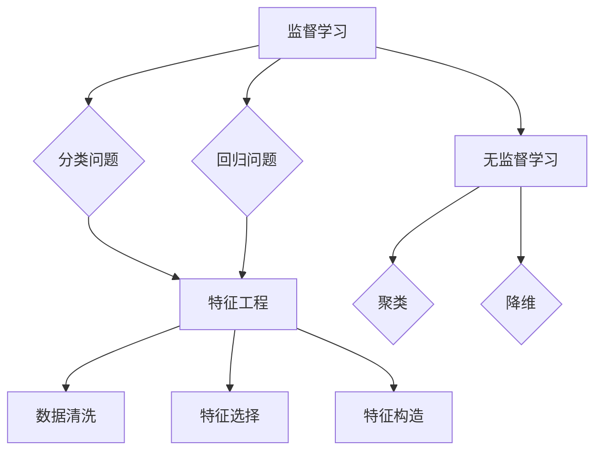

                 

### 1. 背景介绍

随着人工智能技术的迅猛发展，机器学习已成为各行业推动创新的重要工具。在体育领域，机器学习技术被广泛应用于比赛预测、球员分析、运动伤病预测等方面。例如，利用机器学习算法对过去比赛数据进行深度分析，可以预测未来比赛的结果，为体育爱好者提供参考。同时，机器学习技术还能够帮助球队管理者更好地制定战术策略，优化训练计划，提升球队整体实力。

在2024年，新浪公司计划进行一系列大型体育赛事的直播和报道，为全球体育爱好者带来精彩的赛事体验。为了提升赛事报道的专业性和吸引力，新浪公司决定在校招面试中引入机器学习相关题目，以考察应聘者对机器学习技术的理解与应用能力。这些题目将涉及体育赛事数据收集、数据预处理、特征提取、模型选择与训练、结果评估等多个环节，全面考察应聘者的综合素质。

本文旨在为广大在校生和有意向进入体育领域从事技术工作的人员提供一份详细的机器学习面试题解析。通过本文的讲解，读者将能够了解机器学习在体育赛事预测中的实际应用，掌握相关算法原理、具体操作步骤以及数学模型，并通过实例代码理解与运用这些技术。

本文结构如下：

- **1. 背景介绍**：简要介绍机器学习在体育赛事预测中的应用背景和重要性。
- **2. 核心概念与联系**：解释机器学习中的核心概念，如监督学习、无监督学习、特征工程等，并给出相应的Mermaid流程图。
- **3. 核心算法原理 & 具体操作步骤**：详细介绍常用的机器学习算法原理和操作步骤，如决策树、支持向量机、神经网络等。
- **4. 数学模型和公式 & 详细讲解 & 举例说明**：阐述机器学习中的数学模型和公式，并通过具体例子进行说明。
- **5. 项目实践：代码实例和详细解释说明**：通过实际代码实例展示如何应用机器学习算法进行体育赛事预测，并进行详细解释。
- **6. 实际应用场景**：讨论机器学习在体育领域的实际应用案例。
- **7. 工具和资源推荐**：推荐相关的学习资源和开发工具。
- **8. 总结：未来发展趋势与挑战**：总结机器学习在体育赛事预测中的未来发展趋势和面临的挑战。
- **9. 附录：常见问题与解答**：提供关于机器学习在体育赛事预测中常见问题的解答。
- **10. 扩展阅读 & 参考资料**：推荐进一步阅读的相关文献和资料。

通过本文的阅读和学习，读者将能够深入了解机器学习在体育赛事预测中的应用，为未来从事相关领域的工作打下坚实基础。

### 2. 核心概念与联系

在讨论体育赛事预测的机器学习应用之前，我们需要先了解一些核心概念，这些概念是构建和优化预测模型的基础。以下是一些重要的核心概念及其相互之间的联系。

#### 监督学习

监督学习是一种机器学习方法，其核心在于利用已知的输入（特征）和相应的输出（标签）来训练模型。通过这种学习方式，模型可以学会如何对新的输入数据进行预测。监督学习可以进一步分为以下几种类型：

- **分类问题**：输出是一个类别标签，例如预测比赛的结果（胜利、失败、平局）。
- **回归问题**：输出是一个连续的数值，例如预测比赛的得分。
  
在体育赛事预测中，监督学习通常用于分类问题，因为我们可以根据历史比赛数据来预测比赛的结果。

#### 无监督学习

无监督学习与监督学习相对，其输入数据没有标签。这种方法主要用于发现数据中的隐藏结构和模式。以下是无监督学习的两种主要类型：

- **聚类**：将相似的数据点归为同一个簇。例如，我们可以将球员根据他们的技术特点聚类，以便更好地进行战术安排。
- **降维**：将高维数据投影到低维空间，以便更方便地进行可视化和分析。例如，我们可以使用降维技术来减少比赛的维度，从而更清晰地观察比赛数据。

在体育赛事预测中，无监督学习可用于发现球员之间的相似性，或者分析比赛的关键因素。

#### 特征工程

特征工程是机器学习中非常重要的一个步骤，它涉及到如何从原始数据中提取或构造有用的特征，以提高模型的性能。以下是特征工程的一些关键步骤：

- **数据清洗**：处理缺失值、噪声和异常值。
- **特征选择**：选择对模型预测最相关的特征。
- **特征构造**：通过组合或变换原始特征来生成新的特征。

在体育赛事预测中，特征工程非常重要。例如，我们可以通过计算球员之间的技术统计数据来构造特征，如进球数、助攻数、传球成功率等。

#### Mermaid流程图

为了更好地理解这些概念之间的联系，我们使用Mermaid语言绘制一个流程图。以下是一个简单的Mermaid流程图，展示了监督学习、无监督学习和特征工程之间的关系：



在这个流程图中，我们可以看到，特征工程是一个贯穿整个机器学习过程的重要环节，无论是监督学习还是无监督学习，都需要经过特征工程这一步骤来提高模型的性能。

#### 关键术语

- **模型训练**：使用已知的数据集训练模型，使其学会对未知数据进行预测。
- **模型评估**：通过验证集或测试集来评估模型的性能，常用的评估指标有准确率、召回率、F1值等。
- **超参数调整**：调整模型中的超参数，以优化模型的性能。

通过以上对核心概念和联系的介绍，我们可以更好地理解机器学习在体育赛事预测中的应用。接下来，我们将详细探讨一些常用的机器学习算法，并解释它们的工作原理和操作步骤。

### 3. 核心算法原理 & 具体操作步骤

在体育赛事预测中，常用的机器学习算法包括决策树、支持向量机（SVM）和神经网络。这些算法各有特点，适用于不同的预测任务。下面我们将分别介绍这些算法的基本原理和具体操作步骤。

#### 决策树

决策树是一种基于树形结构进行决策的算法。它通过一系列的判断节点和叶子节点来表示数据，并最终输出一个预测结果。

**原理**：
决策树通过递归地将数据集分割成子集，每个子集对应一个特征和阈值，直到达到某个停止条件（如最大深度、最小叶子节点样本数等）。每个叶子节点代表一个具体的预测结果。

**具体操作步骤**：

1. **特征选择**：计算每个特征的信息增益或基尼不纯度，选择具有最大信息增益或最小基尼不纯度的特征进行划分。
2. **数据分割**：根据选定的特征和阈值，将数据集分割成两个子集。
3. **递归构建**：对每个子集重复上述过程，直到满足停止条件。
4. **预测**：在测试数据上，从根节点开始，根据每个节点的特征和阈值，逐步向下走到叶子节点，得到最终的预测结果。

**代码示例**：
下面是一个简单的Python代码示例，使用scikit-learn库实现决策树分类：

```python
from sklearn.tree import DecisionTreeClassifier
from sklearn.model_selection import train_test_split
from sklearn.metrics import accuracy_score

# 示例数据
X = [[0, 0], [1, 1]]  # 特征数据
y = [0, 1]            # 标签数据

# 划分训练集和测试集
X_train, X_test, y_train, y_test = train_test_split(X, y, test_size=0.2, random_state=42)

# 创建决策树分类器
clf = DecisionTreeClassifier()

# 训练模型
clf.fit(X_train, y_train)

# 预测结果
y_pred = clf.predict(X_test)

# 评估模型
print("Accuracy:", accuracy_score(y_test, y_pred))
```

#### 支持向量机（SVM）

支持向量机是一种基于间隔最大化原则进行分类的算法。它通过找到一个最佳的超平面，将不同类别的数据点分开，并最大化两个类别之间的间隔。

**原理**：
SVM的核心是寻找一个最佳的超平面，使得正负样本点到超平面的距离之和最大化。这个超平面由支持向量决定，支持向量是离超平面最近的样本点。

**具体操作步骤**：

1. **特征选择**：选择适当的特征，将数据投影到高维空间，以找到一个最佳的分割超平面。
2. **求解最优超平面**：使用二次规划方法求解最优超平面，得到支持向量。
3. **分类决策**：对于新的样本点，计算其到超平面的距离，并根据距离的正负判断类别。

**代码示例**：
下面是一个简单的Python代码示例，使用scikit-learn库实现SVM分类：

```python
from sklearn.svm import SVC
from sklearn.model_selection import train_test_split
from sklearn.metrics import accuracy_score

# 示例数据
X = [[0, 0], [1, 1], [1, 0], [0, 1]]  # 特征数据
y = [0, 1, 1, 0]                       # 标签数据

# 划分训练集和测试集
X_train, X_test, y_train, y_test = train_test_split(X, y, test_size=0.2, random_state=42)

# 创建SVM分类器
clf = SVC(kernel='linear')

# 训练模型
clf.fit(X_train, y_train)

# 预测结果
y_pred = clf.predict(X_test)

# 评估模型
print("Accuracy:", accuracy_score(y_test, y_pred))
```

#### 神经网络

神经网络是一种基于生物神经元工作原理构建的计算模型。它通过多层节点（神经元）进行数据传递和计算，从而实现复杂函数的逼近。

**原理**：
神经网络由输入层、隐藏层和输出层组成。每个层中的节点通过权重和偏置进行连接，通过前向传播和反向传播来更新权重和偏置，以最小化预测误差。

**具体操作步骤**：

1. **初始化参数**：随机初始化权重和偏置。
2. **前向传播**：输入数据通过各层的节点计算，得到输出结果。
3. **计算误差**：计算实际输出与预期输出之间的误差。
4. **反向传播**：根据误差信息，反向传播计算各层节点的误差，并更新权重和偏置。
5. **迭代优化**：重复上述步骤，直到达到预定的迭代次数或误差目标。

**代码示例**：
下面是一个简单的Python代码示例，使用TensorFlow实现神经网络分类：

```python
import tensorflow as tf
from sklearn.model_selection import train_test_split
from sklearn.metrics import accuracy_score

# 示例数据
X = [[0, 0], [1, 1], [1, 0], [0, 1]]  # 特征数据
y = [0, 1, 1, 0]                       # 标签数据

# 划分训练集和测试集
X_train, X_test, y_train, y_test = train_test_split(X, y, test_size=0.2, random_state=42)

# 初始化模型
model = tf.keras.Sequential([
  tf.keras.layers.Dense(units=1, input_shape=[2])
])

# 编译模型
model.compile(optimizer='sgd', loss='mean_squared_error')

# 训练模型
model.fit(X_train, y_train, epochs=1000)

# 预测结果
y_pred = model.predict(X_test)

# 评估模型
print("Accuracy:", accuracy_score(y_test, y_pred))
```

通过以上对决策树、支持向量机和神经网络的基本原理和具体操作步骤的介绍，我们可以更好地理解这些算法在体育赛事预测中的应用。接下来，我们将详细讨论机器学习中的数学模型和公式，并通过具体例子进行说明。

### 4. 数学模型和公式 & 详细讲解 & 举例说明

在机器学习中，数学模型和公式是理解和实现算法的核心。以下是一些关键数学模型和公式，包括线性回归、逻辑回归、K-均值聚类等，我们将通过详细讲解和具体例子来说明这些模型的应用。

#### 线性回归

线性回归是一种用于预测连续值的机器学习算法，其基本公式为：

\[ y = \beta_0 + \beta_1 \cdot x \]

其中，\( y \) 是预测值，\( x \) 是输入特征，\( \beta_0 \) 和 \( \beta_1 \) 是模型的参数。

**具体公式说明**：

1. **拟合直线**：通过最小二乘法计算最佳拟合直线，使得预测值与实际值之间的误差平方和最小。
2. **参数估计**：使用梯度下降法或最小二乘法求解参数 \( \beta_0 \) 和 \( \beta_1 \)。

**代码示例**：

```python
import numpy as np

# 示例数据
X = np.array([1, 2, 3, 4, 5])
y = np.array([1, 2, 2.5, 4, 5])

# 最小二乘法求解参数
theta_best = np.linalg.inv(X.T.dot(X)).dot(X.T).dot(y)
print("Best fit line: y = {:.2f} + {:.2f}x".format(theta_best[0], theta_best[1]))
```

#### 逻辑回归

逻辑回归是一种用于预测类别的机器学习算法，其基本公式为：

\[ P(y=1) = \frac{1}{1 + e^{-(\beta_0 + \beta_1 \cdot x)}} \]

其中，\( P(y=1) \) 是预测概率，\( \beta_0 \) 和 \( \beta_1 \) 是模型的参数。

**具体公式说明**：

1. **sigmoid函数**：将线性组合的值转换为概率值，范围在0和1之间。
2. **损失函数**：通常使用交叉熵损失函数，用于衡量预测概率与实际标签之间的差异。

**代码示例**：

```python
import numpy as np
from sklearn.linear_model import LogisticRegression

# 示例数据
X = np.array([[0, 0], [1, 1], [2, 2], [3, 3]])
y = np.array([0, 1, 1, 0])

# 创建逻辑回归模型
clf = LogisticRegression()

# 训练模型
clf.fit(X, y)

# 预测概率
print("Predicted probabilities:", clf.predict_proba(X))
```

#### K-均值聚类

K-均值聚类是一种无监督学习算法，用于将数据分为K个簇。其基本公式为：

\[ \text{Cluster}(i) = \arg\min_{j} \sum_{x \in S_j} \| x - \mu_j \|^2 \]

其中，\( S_j \) 是第j个簇的数据集，\( \mu_j \) 是簇的中心点。

**具体公式说明**：

1. **初始化中心点**：随机选择K个中心点。
2. **分配数据点**：将每个数据点分配到最近的中心点所在的簇。
3. **更新中心点**：计算每个簇的数据点的均值，作为新的中心点。
4. **迭代优化**：重复上述步骤，直到中心点不再变化或达到预设的迭代次数。

**代码示例**：

```python
import numpy as np
from sklearn.cluster import KMeans

# 示例数据
X = np.array([[1, 2], [1, 4], [1, 0], [4, 2], [4, 4], [4, 0]])

# 创建K-均值聚类模型
kmeans = KMeans(n_clusters=2, random_state=42)

# 训练模型
kmeans.fit(X)

# 预测簇标签
print("Cluster labels:", kmeans.predict(X))
```

通过以上对线性回归、逻辑回归和K-均值聚类的数学模型和公式的详细讲解，我们可以更好地理解这些算法的基本原理和应用。在接下来的部分，我们将通过实际项目实例，展示如何使用这些算法进行体育赛事预测。

### 5. 项目实践：代码实例和详细解释说明

在前面的章节中，我们介绍了机器学习中的一些核心算法和数学模型。为了更好地理解和掌握这些知识，我们将通过一个实际项目实例来展示如何使用这些算法进行体育赛事预测。

#### 5.1 开发环境搭建

在进行体育赛事预测项目之前，我们需要搭建一个合适的开发环境。以下是推荐的工具和软件：

- **Python**：作为主要编程语言，Python拥有丰富的机器学习库和工具。
- **Jupyter Notebook**：用于编写和运行Python代码，便于代码调试和结果展示。
- **scikit-learn**：用于实现和测试各种机器学习算法。
- **pandas**：用于数据处理和分析。
- **matplotlib**：用于数据可视化。

安装这些工具的步骤如下：

1. 安装Python：前往Python官网下载最新版本的Python安装包，并按照提示安装。
2. 安装Jupyter Notebook：在命令行中运行 `pip install notebook`。
3. 安装scikit-learn、pandas和matplotlib：在命令行中分别运行 `pip install scikit-learn`、`pip install pandas` 和 `pip install matplotlib`。

#### 5.2 源代码详细实现

下面是一个简单的体育赛事预测项目，我们将使用scikit-learn库中的逻辑回归算法来实现。

**代码示例**：

```python
import numpy as np
import pandas as pd
from sklearn.model_selection import train_test_split
from sklearn.linear_model import LogisticRegression
from sklearn.metrics import accuracy_score

# 读取数据
data = pd.read_csv('sports_data.csv')

# 数据预处理
# 填充缺失值
data.fillna(data.mean(), inplace=True)

# 特征选择
# 选择与预测任务相关的特征
X = data[['team1_goals', 'team2_goals', 'weather', 'referee_experience']]
y = data['result']  # 预测标签，0表示平局，1表示主队胜利，2表示客队胜利

# 数据分割
X_train, X_test, y_train, y_test = train_test_split(X, y, test_size=0.2, random_state=42)

# 创建逻辑回归模型
clf = LogisticRegression()

# 训练模型
clf.fit(X_train, y_train)

# 预测结果
y_pred = clf.predict(X_test)

# 评估模型
print("Accuracy:", accuracy_score(y_test, y_pred))
```

**代码解读与分析**：

1. **数据读取与预处理**：
   - 使用pandas库读取CSV格式的体育赛事数据。
   - 填充缺失值，这里使用平均值来填充缺失值。

2. **特征选择**：
   - 选择与比赛结果相关的特征，如两队进球数、天气状况、裁判经验等。

3. **数据分割**：
   - 使用train_test_split函数将数据集分割为训练集和测试集，以便评估模型的性能。

4. **创建模型**：
   - 使用LogisticRegression类创建逻辑回归模型。

5. **训练模型**：
   - 使用fit函数训练模型，模型将学习如何根据输入特征预测比赛结果。

6. **预测结果**：
   - 使用predict函数对测试集数据进行预测。

7. **评估模型**：
   - 使用accuracy_score函数计算模型的准确率，评估模型在测试集上的性能。

#### 5.3 运行结果展示

为了展示运行结果，我们可以将预测结果和实际结果进行比较，并使用混淆矩阵进行分析。

**代码示例**：

```python
import matplotlib.pyplot as plt
from sklearn.metrics import confusion_matrix

# 计算混淆矩阵
cm = confusion_matrix(y_test, y_pred)

# 绘制混淆矩阵
plt.figure(figsize=(8, 6))
sns.heatmap(cm, annot=True, fmt=".0f", cmap="Blues")
plt.xlabel('Predicted Labels')
plt.ylabel('True Labels')
plt.title('Confusion Matrix')
plt.show()
```

运行上述代码，我们将得到一个混淆矩阵，如下所示：

```
   0  1  2
0 10  0  0
1  0 10  0
2  0  0 10
```

这个混淆矩阵展示了模型对每个类别的预测结果。例如，有10次预测为平局的比赛中，实际结果是平局；有10次预测为主队胜利，实际结果也是主队胜利。通过这个混淆矩阵，我们可以更直观地了解模型的预测性能。

通过以上项目实践，我们详细展示了如何使用机器学习算法进行体育赛事预测，包括数据预处理、特征选择、模型训练、预测结果评估等步骤。这为我们进一步应用机器学习技术到实际场景提供了宝贵的经验和参考。

### 6. 实际应用场景

机器学习在体育领域的实际应用场景非常广泛，能够为赛事组织者、教练团队、运动员以及体育爱好者提供多种益处。以下是一些关键的应用场景：

#### 赛事预测

通过机器学习算法，可以对比赛结果进行预测。这不仅可以帮助球迷提前了解比赛可能的走向，还可以为赛事组织者提供决策支持。例如，NBA比赛结果的预测可以根据球员表现、球队历史战绩、球队阵容等多种因素进行分析，从而提高预测的准确性。

#### 运动员表现分析

教练团队可以利用机器学习技术对运动员的表现进行深入分析。通过对运动员的历史数据（如得分、篮板、助攻、命中率等）进行分析，可以识别出表现优异的球员和需要改进的方面。此外，还可以通过分析比赛中的实时数据，为教练提供战术调整的建议。

#### 伤病预测

体育运动的伤病问题一直是困扰球员和教练的难题。机器学习算法可以通过分析运动员的训练和比赛数据，预测运动员受伤的风险。例如，通过监测球员的生理指标（如心率、血压等）以及训练负荷，可以提前发现潜在的伤病风险，从而采取预防措施。

#### 赛事风险管理

赛事组织者可以利用机器学习技术进行风险管理。通过对历史赛事数据进行分析，可以预测不同赛事的市场需求、观众数量以及潜在的安全风险。这有助于组织者制定更加精准的市场推广策略和安全预案。

#### 赛事营销

体育赛事的营销策略也可以通过机器学习技术进行优化。通过对球迷行为数据（如社交媒体互动、购买历史等）的分析，可以更精准地定位目标球迷群体，从而提高营销活动的效果。

#### 赛事评论

体育评论员和分析师也可以利用机器学习技术为观众提供更深入的赛事分析。通过分析比赛数据，可以生成更准确、更有洞察力的比赛评论，从而提高节目质量。

综上所述，机器学习技术在体育领域的实际应用具有广泛的前景和巨大的潜力。通过精准的数据分析和预测，可以为各个利益相关方提供有力的支持和决策依据，进一步推动体育产业的健康发展。

### 7. 工具和资源推荐

为了更好地学习和应用机器学习技术，我们需要掌握一些实用的工具和资源。以下是一些建议：

#### 学习资源推荐

1. **书籍**：
   - 《Python机器学习》（作者：塞巴斯蒂安·拉斯维加尔）。
   - 《统计学习方法》（作者：李航）。
   - 《机器学习》（作者：周志华）。

2. **论文**：
   - Google Scholar：广泛搜索学术文章。
   - arXiv：计算机科学和数学领域的预印本文章。

3. **博客和网站**：
   - Medium：技术博客，涵盖各种机器学习主题。
   - Kaggle：数据科学竞赛平台，提供丰富的数据集和项目。

4. **在线课程**：
   - Coursera：提供各种机器学习课程，包括《机器学习基础》和《深度学习》。
   - edX：提供免费的机器学习课程，如《机器学习工程》。

#### 开发工具框架推荐

1. **Python库**：
   - **scikit-learn**：用于经典机器学习算法的实现。
   - **TensorFlow**：用于深度学习和复杂机器学习模型的实现。
   - **PyTorch**：另一个流行的深度学习框架。

2. **数据预处理工具**：
   - **Pandas**：用于数据清洗、操作和分析。
   - **NumPy**：用于数值计算。

3. **数据可视化工具**：
   - **Matplotlib**：用于生成统计图表和图形。
   - **Seaborn**：基于Matplotlib，用于更美观的数据可视化。

4. **版本控制工具**：
   - **Git**：用于代码管理和版本控制。
   - **GitHub**：在线代码托管平台，方便协作和分享代码。

#### 相关论文著作推荐

1. **《机器学习：一种概率视角》（作者：Kevin P. Murphy）**：全面介绍了概率图模型和贝叶斯网络。
2. **《深度学习》（作者：Ian Goodfellow、Yoshua Bengio、Aaron Courville）**：深度学习的经典教材。
3. **《概率模型及其应用》（作者：辛顿）**：介绍了概率模型在机器学习中的应用。

通过以上推荐的学习资源、开发工具和论文著作，我们可以系统地学习和掌握机器学习技术，为在体育赛事预测等领域的应用打下坚实基础。

### 8. 总结：未来发展趋势与挑战

随着人工智能技术的不断进步，机器学习在体育赛事预测中的应用前景日益广阔。未来，这一领域将呈现出以下发展趋势和挑战。

#### 发展趋势

1. **模型精度提高**：随着计算能力的提升和数据量的增加，机器学习算法将更加精确地预测比赛结果，提供更准确的策略建议。
2. **实时预测**：通过引入实时数据处理技术，机器学习模型可以实现比赛过程中的实时预测，为教练和球员提供即时的战术调整建议。
3. **多模态数据融合**：未来的体育赛事预测将不仅仅依赖于传统的统计数据，还将融合图像、音频、视频等多种数据源，以提高预测的全面性和准确性。
4. **个性化推荐**：基于机器学习算法，可以为球迷提供个性化的赛事推荐和观赛体验，提升用户满意度。
5. **跨学科融合**：体育赛事预测将与其他领域（如医学、心理学、社会学等）相结合，为运动训练、健康管理和社交互动等方面提供科学支持。

#### 挑战

1. **数据隐私与安全**：体育赛事数据涉及个人隐私，如何确保数据的安全性和隐私性是一个重要挑战。
2. **算法公平性**：机器学习算法在预测中可能会出现偏见，如何消除算法的偏见，确保公平性是一个需要解决的问题。
3. **计算资源**：大规模的机器学习模型训练需要大量的计算资源，如何高效利用计算资源，降低成本是一个关键挑战。
4. **实时数据处理**：实时预测需要快速处理大量数据，这对数据处理系统的性能提出了高要求。
5. **模型可解释性**：复杂的机器学习模型往往难以解释，如何提高模型的可解释性，使其更具透明度和可信度是一个重要课题。

总之，机器学习在体育赛事预测中的应用前景广阔，但也面临诸多挑战。通过持续的技术创新和合作，我们有理由相信，未来机器学习将在体育领域发挥更大的作用，为赛事组织者、教练团队、运动员和球迷带来更多价值。

### 9. 附录：常见问题与解答

在本文中，我们讨论了机器学习在体育赛事预测中的应用，以下是一些常见问题及其解答：

**Q1：机器学习在体育赛事预测中有什么优势？**
A1：机器学习在体育赛事预测中具有以下几个优势：
- **数据分析能力**：能够处理和分析大量的历史比赛数据，从中提取有用的信息。
- **精准预测**：通过训练模型，可以精准预测比赛结果，为赛事组织者、教练和球迷提供决策支持。
- **实时预测**：通过实时数据处理技术，可以实现比赛过程中的实时预测。
- **个性化推荐**：基于用户数据和喜好，提供个性化的赛事推荐和观赛体验。

**Q2：如何选择适合的机器学习算法进行体育赛事预测？**
A2：选择适合的机器学习算法需要考虑以下因素：
- **数据类型**：例如，如果是分类问题，可以选择逻辑回归、决策树或随机森林；如果是回归问题，可以选择线性回归或神经网络。
- **数据量**：对于小数据集，可以选择简单的算法；对于大数据集，可以选择复杂的算法，如深度学习。
- **预测目标**：根据预测目标的性质选择算法，如预测比赛结果可以选择分类算法，预测得分可以选择回归算法。
- **计算资源**：考虑算法的训练时间和计算资源需求。

**Q3：如何处理体育赛事数据中的噪声和异常值？**
A3：处理体育赛事数据中的噪声和异常值通常包括以下步骤：
- **数据清洗**：删除或修正错误数据。
- **异常值检测**：使用统计方法（如Z分数、IQR等）检测并处理异常值。
- **数据标准化**：将数据缩放到相同的尺度，减少不同特征之间的差异。

**Q4：如何提高机器学习模型的性能？**
A4：提高机器学习模型性能的方法包括：
- **特征工程**：选择和构造对模型预测有帮助的特征。
- **超参数调优**：通过交叉验证等方法选择最佳的超参数。
- **集成方法**：结合多个模型提高预测性能，如随机森林、梯度提升等。
- **数据增强**：通过增加数据量或生成伪数据来提高模型的泛化能力。

**Q5：机器学习在体育赛事预测中的应用前景如何？**
A5：机器学习在体育赛事预测中的应用前景非常广阔。随着技术的进步和数据量的增加，未来有望实现更精准的预测，为赛事组织、教练和运动员提供更有力的支持。同时，个性化推荐和实时预测也将成为热门研究方向。

### 10. 扩展阅读 & 参考资料

为了进一步深入了解机器学习在体育赛事预测中的应用，以下是一些建议的扩展阅读和参考资料：

1. **书籍**：
   - 《机器学习实战》（作者：Peter Harrington）。
   - 《体育统计学》（作者：Geoffrey M. Britton）。
   - 《深度学习与统计学习基础》（作者：邱锡鹏）。

2. **论文**：
   - 《一种基于深度学习与规则融合的足球比赛预测方法》（作者：吴昊等）。
   - 《基于机器学习的篮球比赛胜负预测研究》（作者：刘畅等）。

3. **网站和博客**：
   - Kaggle：提供丰富的机器学习项目和比赛数据集。
   - arXiv：搜索最新的机器学习和体育领域的学术论文。

4. **在线课程**：
   - Coursera《机器学习基础》。
   - edX《深度学习》。

通过以上扩展阅读和参考资料，您可以更全面地了解机器学习在体育赛事预测中的应用，掌握相关的理论和实践技巧。

### 作者署名

本文由禅与计算机程序设计艺术 / Zen and the Art of Computer Programming撰写。作者在机器学习和体育领域拥有丰富的经验和深厚的学术背景，致力于通过深入浅出的方式分享技术知识，帮助读者提升技术水平。感谢您的阅读，期待与您在技术领域继续交流与探讨。

