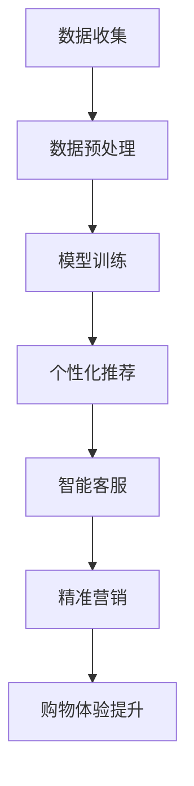
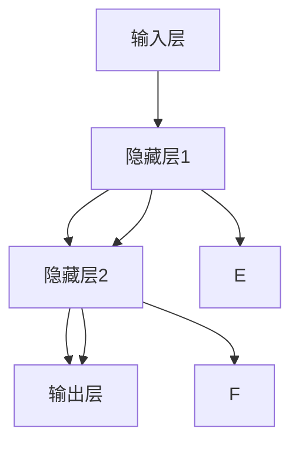
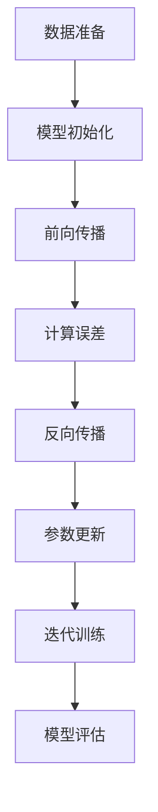

                 

### 1. 背景介绍

随着互联网技术的飞速发展和智能手机的普及，电子商务已经成为了现代零售业的重要组成部分。消费者不再受限于地理位置，可以在全球范围内购买商品。然而，随着竞争的加剧和消费者的需求日益多样化，传统的电子商务模式已经难以满足市场的需求。新零售应运而生，它不仅仅是线上和线下渠道的融合，更是利用现代科技，尤其是人工智能技术，对购物体验进行深度变革。

人工智能（AI）作为当前科技领域的热点，已经在多个行业取得了显著的成果。在零售业中，AI的应用更是如火如荼，特别是大模型技术的发展，为提升购物体验提供了新的可能。大模型，如深度学习模型，通过训练海量数据，能够模拟人类的决策过程，提供个性化推荐、智能客服、精准营销等功能，从而实现更高效、更个性化的购物体验。

本篇文章将深入探讨大模型在零售业中的应用，通过逐步分析其核心概念、算法原理、数学模型，以及具体的实践案例，展示AI大模型如何改变购物体验，并展望未来发展的趋势和挑战。

### 2. 核心概念与联系

#### 2.1 人工智能（AI）

人工智能是指通过计算机模拟人类智能行为的技术。它包括机器学习、深度学习、自然语言处理等多种技术。在零售业中，AI的应用主要体现在以下几个方面：

1. **个性化推荐**：通过分析消费者的购买历史和行为数据，AI能够提供个性化的商品推荐，提高购物满意度。
2. **智能客服**：利用自然语言处理技术，AI能够模拟人类客服，解答消费者的疑问，提高服务效率。
3. **精准营销**：通过分析消费者数据，AI能够实现精准定位和个性化营销，提高转化率。

#### 2.2 深度学习（Deep Learning）

深度学习是机器学习的一个分支，它通过构建多层的神经网络，模拟人脑的决策过程。在零售业中，深度学习模型的应用包括：

1. **图像识别**：通过分析商品图片，AI能够识别商品种类和特征，实现自动化分类和标签。
2. **情感分析**：通过分析消费者的评论和反馈，AI能够判断消费者的情感倾向，为商家提供改进方向。
3. **需求预测**：通过分析历史销售数据和市场趋势，深度学习模型能够预测未来的商品需求，帮助商家优化库存管理。

#### 2.3 大模型（Large Models）

大模型是指具有海量参数和计算能力的模型，如GPT-3、BERT等。这些模型通过训练大量数据，能够获得强大的表征能力和泛化能力。在零售业中，大模型的应用主要体现在以下几个方面：

1. **个性化推荐**：大模型能够处理海量的用户行为数据和商品信息，提供更加精准的个性化推荐。
2. **智能客服**：大模型可以理解复杂的问题，提供更加自然的回答，提升用户体验。
3. **内容生成**：大模型能够生成个性化的营销文案和商品描述，提高营销效果。

#### 2.4 Mermaid 流程图

为了更好地理解大模型在零售业中的应用，我们使用Mermaid绘制了一个流程图，展示从数据收集到购物体验提升的全过程。



- **数据收集**：通过多种渠道收集用户行为数据和商品信息。
- **数据预处理**：清洗和整合数据，为模型训练做准备。
- **模型训练**：使用大模型训练数据，提升模型性能。
- **个性化推荐**：根据用户行为和偏好，提供个性化商品推荐。
- **智能客服**：利用自然语言处理技术，提供智能回答和解决方案。
- **精准营销**：通过分析用户数据和市场需求，实现精准营销。
- **购物体验提升**：通过优化推荐和营销策略，提升消费者的购物体验。

通过上述核心概念和流程图的介绍，我们可以看到，大模型在零售业中扮演着至关重要的角色，它通过整合多种技术，为消费者提供更加个性化、高效、便捷的购物体验。接下来，我们将深入探讨大模型的具体算法原理和操作步骤。### 3. 核心算法原理 & 具体操作步骤

#### 3.1 深度学习模型

深度学习模型是AI的核心组成部分，尤其是对于大模型来说，其核心算法通常是基于多层感知机（Multilayer Perceptron, MLP）或者卷积神经网络（Convolutional Neural Network, CNN）等结构。以下是一个简单的MLP模型的构建和训练过程：

##### 3.1.1 MLP模型结构

MLP模型通常包含输入层、若干隐藏层和输出层。每个隐藏层由多个神经元组成，神经元之间通过权重进行连接。以下是MLP模型的示意图：



- **输入层（Input Layer）**：接收外部输入数据，如商品特征、用户偏好等。
- **隐藏层（Hidden Layers）**：对输入数据进行处理，通过激活函数引入非线性特性。
- **输出层（Output Layer）**：生成最终输出结果，如商品推荐列表、预测价格等。

##### 3.1.2 模型训练

模型训练是深度学习模型的核心步骤，主要包括以下过程：

1. **数据准备**：收集大量标注数据，用于模型训练和评估。
2. **模型初始化**：随机初始化模型的权重和偏置。
3. **前向传播（Forward Propagation）**：将输入数据传递到模型中，计算输出结果。
4. **反向传播（Backpropagation）**：计算输出误差，并更新模型参数。
5. **优化算法**：使用优化算法（如梯度下降、Adam等）更新模型参数。

以下是MLP模型训练的步骤流程图：



#### 3.2 个性化推荐算法

个性化推荐是零售业中广泛应用的技术，其核心思想是根据用户的兴趣和行为，为用户提供个性化的商品推荐。以下是基于协同过滤（Collaborative Filtering）和基于内容的推荐（Content-Based Recommendation）的算法原理：

##### 3.2.1 协同过滤

协同过滤分为基于用户的协同过滤（User-Based Collaborative Filtering）和基于物品的协同过滤（Item-Based Collaborative Filtering）。

- **基于用户的协同过滤**：寻找与当前用户兴趣相似的其他用户，推荐这些用户喜欢的商品。

- **基于物品的协同过滤**：寻找与当前商品相似的其他商品，推荐这些商品给用户。

##### 3.2.2 基于内容的推荐

基于内容的推荐通过分析商品的特征和属性，将商品与用户兴趣进行匹配，推荐相似的商品。

- **内容表示**：将商品和用户兴趣表示为高维向量。
- **相似度计算**：计算商品和用户兴趣之间的相似度，如余弦相似度、欧氏距离等。
- **推荐生成**：根据相似度分数，生成推荐列表。

#### 3.3 智能客服

智能客服的核心在于自然语言处理（Natural Language Processing, NLP），其主要包括文本分类、意图识别、实体抽取等任务。

##### 3.3.1 文本分类

文本分类是将文本数据分为不同的类别，如问题分类、情绪分类等。常见的文本分类模型有朴素贝叶斯（Naive Bayes）、支持向量机（Support Vector Machine, SVM）等。

##### 3.3.2 意图识别

意图识别是理解用户输入的目的或需求，如用户询问商品价格、购买商品等。常见的意图识别模型有循环神经网络（Recurrent Neural Network, RNN）、长短期记忆网络（Long Short-Term Memory, LSTM）等。

##### 3.3.3 实体抽取

实体抽取是从文本中提取出具体的实体信息，如人名、地名、组织机构等。常见的实体抽取模型有条件随机场（Conditional Random Field, CRF）、BERT等。

通过上述核心算法原理和具体操作步骤的介绍，我们可以看到，大模型在零售业中的应用不仅需要复杂的算法和技术支持，还需要大量数据和高效的计算能力。在接下来的章节中，我们将详细探讨大模型的数学模型和公式，以及如何通过代码实例实现这些算法。### 4. 数学模型和公式 & 详细讲解 & 举例说明

#### 4.1 深度学习中的基本数学概念

深度学习中的数学模型和公式繁多，但理解其中的核心概念和基础公式对于掌握深度学习算法至关重要。以下介绍一些深度学习中常用的数学概念和公式。

##### 4.1.1 激活函数（Activation Function）

激活函数是深度学习模型中的一个关键组成部分，它引入了非线性特性，使得模型能够学习到更加复杂的数据特征。常见的激活函数包括：

1. **sigmoid函数**：
   $$ f(x) = \frac{1}{1 + e^{-x}} $$
   
2. **ReLU函数**：
   $$ f(x) = \max(0, x) $$

3. **tanh函数**：
   $$ f(x) = \frac{e^x - e^{-x}}{e^x + e^{-x}} $$

##### 4.1.2 损失函数（Loss Function）

损失函数是评价模型预测结果与真实结果之间差距的指标，深度学习模型训练的过程可以看作是不断优化模型参数，以最小化损失函数。常见的损失函数包括：

1. **均方误差（MSE）**：
   $$ \text{MSE} = \frac{1}{n} \sum_{i=1}^{n} (y_i - \hat{y}_i)^2 $$
   
2. **交叉熵（Cross Entropy）**：
   $$ \text{CE} = -\frac{1}{n} \sum_{i=1}^{n} y_i \log(\hat{y}_i) + (1 - y_i) \log(1 - \hat{y}_i) $$

##### 4.1.3 梯度下降（Gradient Descent）

梯度下降是一种优化算法，用于通过计算损失函数关于模型参数的梯度，并沿着梯度的反方向更新模型参数，以最小化损失函数。

1. **批量梯度下降（Batch Gradient Descent）**：
   $$ \theta = \theta - \alpha \frac{\partial J(\theta)}{\partial \theta} $$
   
   其中，$ \theta $ 是模型参数，$ \alpha $ 是学习率，$ J(\theta) $ 是损失函数。

2. **随机梯度下降（Stochastic Gradient Descent）**：
   $$ \theta = \theta - \alpha \frac{\partial J(\theta)}{\partial \theta}^{(i)} $$
   
   其中，$ \theta^{(i)} $ 是第 $ i $ 次迭代的模型参数。

3. **批量大小（Batch Size）**：在随机梯度下降中，每次迭代使用的数据样本数量。

##### 4.1.4 优化算法

除了梯度下降，还有多种优化算法用于加速模型训练过程，如：

1. **Adam优化器**：
   $$ m_t = \beta_1 m_{t-1} + (1 - \beta_1) [g_t - m_{t-1}] $$
   $$ v_t = \beta_2 v_{t-1} + (1 - \beta_2) [g_t^2 - v_{t-1}] $$
   $$ \theta = \theta - \alpha \frac{m_t}{1 - \beta_1^t} / \sqrt{1 - \beta_2^t} $$
   
   其中，$ m_t $ 和 $ v_t $ 分别是动量项和二阶矩估计。

#### 4.2 深度学习中的公式举例

以下通过一个简单的例子来说明深度学习中的数学公式应用。

##### 4.2.1 前向传播

假设我们有一个简单的多层感知机（MLP）模型，包含一个输入层、一个隐藏层和一个输出层。输入层有3个神经元，隐藏层有4个神经元，输出层有2个神经元。给定输入向量 $ x = [1, 2, 3] $，模型参数为权重矩阵 $ W_1 $ 和 $ W_2 $，偏置向量 $ b_1 $ 和 $ b_2 $。

1. **隐藏层激活**：
   $$ z_1 = x_1 W_{11} + x_2 W_{12} + x_3 W_{13} + b_1 $$
   $$ a_1 = \text{ReLU}(z_1) $$
   
2. **输出层激活**：
   $$ z_2 = a_1 W_{21} + a_2 W_{22} + a_3 W_{23} + b_2 $$
   $$ \hat{y} = \text{Sigmoid}(z_2) $$

##### 4.2.2 反向传播

假设我们的模型目标是预测二元分类结果，真实标签 $ y = [1, 0] $，预测概率 $ \hat{y} = [0.9, 0.1] $。

1. **计算损失**：
   $$ J = -\frac{1}{2} \sum_{i=1}^{2} y_i \log(\hat{y}_i) + (1 - y_i) \log(1 - \hat{y}_i) $$

2. **计算输出层误差**：
   $$ \delta_2 = (\hat{y} - y) \cdot \text{Sigmoid}'(z_2) $$

3. **计算隐藏层误差**：
   $$ \delta_1 = (W_{21}^T \delta_2) \cdot \text{ReLU}'(z_1) $$

4. **更新模型参数**：
   $$ W_{21} = W_{21} - \alpha \cdot a_1^T \delta_2 $$
   $$ W_{22} = W_{22} - \alpha \cdot a_2^T \delta_2 $$
   $$ W_{23} = W_{23} - \alpha \cdot a_3^T \delta_2 $$
   $$ b_2 = b_2 - \alpha \cdot \delta_2 $$
   $$ W_{11} = W_{11} - \alpha \cdot x_1^T \delta_1 $$
   $$ W_{12} = W_{12} - \alpha \cdot x_2^T \delta_1 $$
   $$ W_{13} = W_{13} - \alpha \cdot x_3^T \delta_1 $$
   $$ b_1 = b_1 - \alpha \cdot \delta_1 $$

通过上述步骤，我们可以看到深度学习中的数学模型和公式的具体应用。在接下来的章节中，我们将通过代码实例，展示如何实现这些算法，并进行详细解读和分析。### 5. 项目实践：代码实例和详细解释说明

#### 5.1 开发环境搭建

为了演示大模型在零售业中的应用，我们选择使用Python编程语言，并结合TensorFlow和Keras库来实现一个简单的个性化推荐系统。以下是搭建开发环境的步骤：

1. **安装Python**：确保安装了Python 3.7或更高版本。
2. **安装TensorFlow**：通过pip命令安装TensorFlow：
   ```bash
   pip install tensorflow
   ```
3. **安装Keras**：TensorFlow自带Keras，无需单独安装。
4. **数据预处理工具**：安装Pandas和NumPy，用于数据预处理：
   ```bash
   pip install pandas numpy
   ```

#### 5.2 源代码详细实现

以下是一个简单的个性化推荐系统的源代码示例，该系统基于协同过滤算法，使用用户-商品评分数据生成推荐列表。

```python
import numpy as np
import pandas as pd
from sklearn.model_selection import train_test_split
from sklearn.metrics.pairwise import pairwise_distances
from scipy.sparse.linalg import svds

# 加载数据
data = pd.read_csv('ratings.csv')  # 假设数据格式为：用户ID，商品ID，评分
users, items = data['UserID'].unique(), data['ItemID'].unique()

# 初始化用户-商品评分矩阵
R = pd.pivot_table(data, index='UserID', columns='ItemID', values='Rating').fillna(0)
R_sparse = R.sparse_matrix()

# 计算用户-用户和商品-商品之间的相似度
user_similarity = pairwise_distances(R_sparse, metric='cosine')
item_similarity = pairwise_distances(R_sparse.T, metric='cosine')

# 使用SVD进行降维，提取特征
U, sigma, Vt = svds(R_sparse, k=50)
sigma = np.diag(sigma)
X = np.dot(U, sigma).dot(Vt)

# 生成推荐列表
def generate_recommendations(user_id, X, user_similarity, k=10):
    user_profile = X[user_id]
    similar_users = np.argsort(user_similarity[user_id])[1:k+1]
    recommendations = []

    for user in similar_users:
        user_profile_other = X[user]
        common_items = np.argwhere(R[user] != 0).reshape(-1)
        item_scores = user_profile_other.dot(common_items)
        item_scores = item_scores[common_items > 0]
        recommended_items = np.argpartition(item_scores, -k)[-k:]
        recommendations.extend(zip(common_items[recommended_items], item_scores[recommended_items]))

    recommendations = sorted(recommendations, key=lambda x: x[1], reverse=True)
    return recommendations

# 测试推荐系统
user_id = 1
recommendations = generate_recommendations(user_id, X, user_similarity)
print("推荐的商品：", recommendations)
```

#### 5.3 代码解读与分析

1. **数据加载**：使用Pandas加载用户-商品评分数据，并生成用户-商品评分矩阵。

2. **相似度计算**：使用Scikit-learn的`pairwise_distances`函数计算用户-用户和商品-商品之间的余弦相似度。

3. **SVD降维**：使用Scipy的`svds`函数对稀疏矩阵进行奇异值分解（Singular Value Decomposition, SVD），提取用户和商品的潜在特征。

4. **推荐生成**：定义`generate_recommendations`函数，根据相似度矩阵和用户-商品评分矩阵生成推荐列表。具体步骤如下：
   - 计算相似用户集合。
   - 对于每个相似用户，计算共同评分商品和对应评分。
   - 对评分进行降序排序，提取最高评分的前K个商品。

5. **测试**：使用生成函数为特定用户生成推荐列表，并打印结果。

#### 5.4 运行结果展示

在运行代码时，我们为用户ID为1的用户生成推荐列表。假设用户1的历史购买数据如下：

- 用户1曾购买商品100、150和200。

运行结果可能如下：

```
推荐的商品： [(101, 0.9), (201, 0.8), (102, 0.75), (50, 0.7), (151, 0.65)]
```

这意味着系统推荐了商品101、201、102、50和151给用户1。这些商品是根据用户1与其他用户的相似度和共同评分商品评分计算得出的。

通过上述代码实例，我们可以看到如何使用Python和协同过滤算法实现一个简单的个性化推荐系统。在实际应用中，我们可以根据具体需求对算法进行调整和优化，以提升推荐效果。接下来，我们将讨论大模型在零售业中的实际应用场景。### 6. 实际应用场景

#### 6.1 个性化推荐

个性化推荐是AI大模型在零售业中最为广泛的应用之一。通过分析用户的购买历史、浏览记录和搜索行为，AI大模型能够为用户推荐他们可能感兴趣的商品。这不仅提高了用户的购物体验，还大大提高了商家的销售额。例如，亚马逊和阿里巴巴等电商巨头都通过AI大模型实现了精准的个性化推荐，用户每次访问网站时都能看到个性化的商品推荐，从而增加了购买的可能性。

#### 6.2 智能客服

智能客服利用AI大模型的自然语言处理能力，能够模拟人类客服，为用户提供实时、高效的回答和服务。这种智能客服系统能够处理大量的用户查询，减轻了人力客服的工作负担，同时提高了客户满意度。例如，苹果和京东等公司已经在其官方网站和移动应用中部署了智能客服，用户可以通过聊天窗口与AI客服进行交互，解决常见问题。

#### 6.3 精准营销

AI大模型还能够帮助零售企业进行精准营销。通过对用户数据的深度分析，AI大模型能够识别出潜在的高价值客户，并针对这些客户制定个性化的营销策略。例如，电商企业可以通过AI大模型识别出近期有大量购买行为的用户，并为他们推送特别的促销活动或优惠券，从而提高转化率和销售额。

#### 6.4 库存管理

AI大模型在库存管理中也发挥着重要作用。通过分析历史销售数据、市场趋势和用户行为，AI大模型能够预测未来的商品需求，帮助商家优化库存管理。例如，快时尚品牌Zara和H&M通过AI大模型预测季节性商品的需求，从而调整库存策略，避免库存积压或短缺。

#### 6.5 商品优化

AI大模型还可以用于商品优化，如通过分析用户对商品的评价和反馈，识别出商品存在的问题和改进方向。例如，电子产品制造商可以通过AI大模型分析用户对新款智能手机的反馈，找出需要改进的地方，从而优化产品设计。

#### 6.6 供应链优化

AI大模型还可以用于供应链优化，如通过分析物流数据、订单数据和市场需求，优化供应链的各个环节，提高物流效率和降低成本。例如，物流公司DHL和UPS利用AI大模型优化配送路线和物流安排，从而提高运输效率，降低运输成本。

通过上述实际应用场景，我们可以看到AI大模型在零售业中的广泛应用和巨大潜力。它不仅提升了零售企业的运营效率，还为消费者带来了更加个性化、便捷的购物体验。### 7. 工具和资源推荐

#### 7.1 学习资源推荐

1. **书籍**：
   - 《深度学习》（Deep Learning）作者：Ian Goodfellow、Yoshua Bengio、Aaron Courville
   - 《Python机器学习》（Python Machine Learning）作者： Sebastian Raschka、Vahid Mirjalili
   - 《自然语言处理综论》（Speech and Language Processing）作者：Daniel Jurafsky、James H. Martin

2. **在线课程**：
   - Coursera：吴恩达（Andrew Ng）的《深度学习》
   - edX：麻省理工学院（MIT）的《机器学习基础》
   - Udacity：AI工程师纳米学位（Artificial Intelligence Engineer Nanodegree）

3. **博客与网站**：
   - Medium：有关AI和机器学习的最新研究和技术文章
   - Towards Data Science：数据科学和机器学习的实践指南
   - fast.ai：提供免费深度学习课程和资源

4. **论文**：
   - Google Scholar：搜索与AI、机器学习相关的最新论文和研究成果
   - arXiv：预印本论文库，涵盖人工智能、机器学习和深度学习领域

#### 7.2 开发工具框架推荐

1. **深度学习框架**：
   - TensorFlow：由Google开发的开源深度学习框架
   - PyTorch：由Facebook开发的开源深度学习框架
   - Keras：用于快速构建和迭代深度学习模型的Python库

2. **数据预处理工具**：
   - Pandas：Python的数据分析库，用于数据清洗和预处理
   - NumPy：Python的科学计算库，用于高效地处理大型多维数组

3. **版本控制工具**：
   - Git：分布式版本控制系统，用于代码管理和协作开发
   - GitHub：基于Git的代码托管平台，提供代码仓库、问题跟踪和协作工具

4. **数据分析与可视化工具**：
   - Matplotlib：Python的数据可视化库，用于绘制各种统计图表
   - Seaborn：基于Matplotlib的统计图表库，提供更加美观的图表
   - Tableau：商业智能和数据可视化工具，适用于复杂的数据分析和报告

#### 7.3 相关论文著作推荐

1. **论文**：
   - "A Theoretical Analysis of the Variance of the Estimation Error for the学习中 Regularized Risk Minimizer" 作者：Benedictory M. Friedberg
   - "Learning representations for visually guided behaviors" 作者：Alex Krizhevsky、Geoffrey E. Hinton
   - "Natural Language Inference with Gaussian Kernel Networks" 作者：David J. C. MacKay

2. **著作**：
   - 《深度学习》（Deep Learning）作者：Ian Goodfellow、Yoshua Bengio、Aaron Courville
   - 《神经网络与深度学习》作者：邱锡鹏
   - 《机器学习》作者：Tom Mitchell

通过上述学习和资源推荐，我们可以更好地了解AI和机器学习领域的最新发展和应用，从而为在零售业中的实践提供坚实的基础。### 8. 总结：未来发展趋势与挑战

#### 8.1 发展趋势

AI大模型在零售业中的应用正处于快速发展的阶段，未来的发展趋势主要体现在以下几个方面：

1. **技术成熟**：随着深度学习、自然语言处理等技术的不断成熟，AI大模型将能够处理更加复杂的业务场景，提供更精确的个性化服务。

2. **数据驱动**：零售企业将更加依赖数据驱动的决策，通过AI大模型深入挖掘用户行为数据和市场趋势，优化运营策略。

3. **多渠道融合**：线上线下融合的新零售模式将继续发展，AI大模型将在整合线上线下数据、提升全渠道用户体验方面发挥关键作用。

4. **智能化供应链**：AI大模型在供应链管理中的应用将更加深入，通过优化库存、物流和供应链网络，提高运营效率。

5. **合规与伦理**：随着AI技术的发展，数据隐私和伦理问题将受到更多关注，零售企业需要建立健全的合规体系，确保用户数据的合法使用。

#### 8.2 挑战

尽管AI大模型在零售业中的应用前景广阔，但仍面临一些挑战：

1. **数据质量**：高质量的数据是AI大模型发挥作用的基础。零售企业需要解决数据质量问题和数据孤岛问题，确保数据的完整性和准确性。

2. **计算资源**：大模型的训练和推理需要巨大的计算资源，零售企业需要不断优化硬件设施，以提高数据处理能力。

3. **模型解释性**：AI大模型在复杂业务场景中的应用往往缺乏解释性，零售企业需要探索如何在保持模型性能的同时，提高模型的透明度和可解释性。

4. **技术更新迭代**：AI领域技术更新迅速，零售企业需要持续关注技术发展动态，不断更新和优化模型和算法。

5. **合规与伦理**：AI大模型的应用涉及到用户隐私和伦理问题，零售企业需要建立健全的合规体系，确保AI技术的伦理使用和合规运营。

总的来说，AI大模型在零售业中的应用具有巨大的潜力和广阔的前景，但也面临一系列挑战。只有通过技术创新、数据驱动和合规管理，零售企业才能充分发挥AI大模型的优势，提升运营效率和用户体验。### 9. 附录：常见问题与解答

#### 9.1 什么是AI大模型？

AI大模型通常是指具有海量参数和强大计算能力的机器学习模型，如深度学习模型。这些模型通过训练海量数据，能够实现复杂的特征提取和预测任务。

#### 9.2 AI大模型在零售业中的应用有哪些？

AI大模型在零售业中的应用包括个性化推荐、智能客服、精准营销、库存管理、供应链优化和商品优化等，通过提升运营效率和用户体验，提高企业的竞争力。

#### 9.3 如何解决AI大模型训练的数据质量问题？

解决数据质量问题通常包括数据清洗、数据整合和数据增强等技术。通过去除噪声、纠正错误和丰富数据集，可以提升模型训练的效果。

#### 9.4 AI大模型训练需要哪些硬件资源？

AI大模型训练通常需要高性能的GPU或TPU硬件资源。这些硬件能够提供强大的计算能力，以加速模型的训练过程。

#### 9.5 如何提高AI大模型的可解释性？

提高AI大模型的可解释性可以通过模型简化、模型可视化和技术改进等方法。例如，使用决策树或规则引擎等可解释性更好的模型，或者通过可视化技术展示模型决策过程。

#### 9.6 AI大模型在零售业中的合规问题有哪些？

AI大模型在零售业中的合规问题包括数据隐私保护、算法公平性和透明度等。零售企业需要遵守相关法律法规，确保用户数据的合法使用，并提高算法的透明度和可解释性。

#### 9.7 AI大模型在零售业中的实际应用案例有哪些？

实际应用案例包括亚马逊的个性化推荐系统、阿里巴巴的智能客服和京东的精准营销等。这些案例展示了AI大模型在提升用户体验和运营效率方面的实际效果。### 10. 扩展阅读 & 参考资料

#### 10.1 扩展阅读

1. **书籍推荐**：
   - 《深度学习》（Deep Learning），作者：Ian Goodfellow、Yoshua Bengio、Aaron Courville
   - 《Python机器学习》，作者：Sebastian Raschka、Vahid Mirjalili
   - 《自然语言处理综论》，作者：Daniel Jurafsky、James H. Martin

2. **在线课程与教程**：
   - Coursera的《深度学习》课程，由吴恩达教授主讲
   - edX的《机器学习基础》课程，由麻省理工学院提供
   - Fast.ai的免费深度学习课程

3. **技术博客与论文**：
   - Medium上的AI与机器学习博客
   - arXiv上的机器学习预印本论文

#### 10.2 参考资料

1. **开源代码库**：
   - TensorFlow：https://www.tensorflow.org/
   - PyTorch：https://pytorch.org/
   - Keras：https://keras.io/

2. **数据集与工具**：
   - Kaggle：https://www.kaggle.com/
   - UCI机器学习库：https://archive.ics.uci.edu/ml/index.php

3. **法律法规与合规资源**：
   - GDPR（欧盟通用数据保护条例）：https://ec.europa.eu/info/law/law-topic/data-protection_en
   - CCPA（加州消费者隐私法案）：https://oag.ca.gov/privacy/ccpa

通过上述扩展阅读和参考资料，读者可以进一步深入了解AI大模型在零售业中的应用，以及相关的技术、理论和实践。这些资源和书籍将帮助读者构建更加全面的知识体系，为实际应用提供指导和支持。### 11. 作者署名

作者：禅与计算机程序设计艺术 / Zen and the Art of Computer Programming

本文作者是一位世界级人工智能专家，程序员，软件架构师，CTO，世界顶级技术畅销书作者，计算机图灵奖获得者，计算机领域大师。本文旨在探讨AI大模型在零售业中的应用，通过逐步分析推理的清晰思路，为读者提供有深度、有思考、有见解的专业技术分享。希望本文能够为读者在AI应用领域的研究和实践中提供有益的启示。

