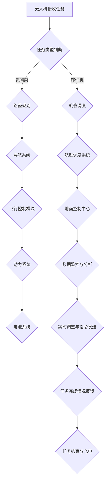

                 

### 背景介绍

无人机物流系统是一种利用无人机进行物品运输的智能物流系统，它将传统的地面物流与航空运输相结合，通过无人机的智能化控制与调度，实现高效、快速、准确的配送服务。随着科技的不断进步，无人机物流系统在近年来得到了广泛关注和快速发展，成为了物流领域的重要创新应用之一。

#### 无人机物流系统的发展历程

无人机物流系统的起源可以追溯到20世纪末期。当时，随着无人机技术的初步发展，一些科研机构和企业开始探索无人机在物流领域的应用可能性。最早的一些实验主要集中在无人机的基本飞行控制和路径规划上。随着无人机的飞行控制技术和导航系统逐渐成熟，无人机物流的概念逐渐成型。

进入21世纪，无人机物流系统迎来了快速发展期。各国政府和企业加大了对无人机物流技术的研发投入，推动了无人机物流系统的技术创新和应用拓展。特别是在美国、中国、德国等科技发达的国家，无人机物流系统已经逐步实现了商业化应用。例如，美国亚马逊、中国京东等电商巨头都在积极探索无人机配送服务，以提高物流效率，提升用户体验。

#### 无人机物流系统的技术基础

无人机物流系统的实现离不开以下几个关键技术的支撑：

1. **无人机技术**：无人机是无人机物流系统的核心设备。它需要具备稳定的飞行性能、精准的导航系统以及可靠的通信能力。现代无人机一般采用电动驱动，具有高续航能力和低噪音特点。

2. **传感器技术**：无人机需要配备各种传感器，如GPS、激光雷达、摄像头等，用于实时感知周围环境，确保飞行安全和配送任务的顺利完成。

3. **控制系统**：无人机物流系统的控制系统负责对无人机的飞行路径、速度、姿态等参数进行实时调整，以实现精确的配送。

4. **通信技术**：无人机物流系统需要高效的通信技术，确保无人机与地面控制中心、配送中心以及接收方之间的实时通信和数据传输。

5. **人工智能技术**：人工智能技术在无人机物流系统中发挥着重要作用。通过机器学习、计算机视觉等技术，无人机能够实现自主路径规划、障碍物检测与避让、货物投放等高级功能。

#### 无人机物流系统的主要优势

无人机物流系统相比传统的地面物流，具有以下几个显著优势：

1. **速度快**：无人机能够快速穿越地面交通堵塞，实现点对点的快速配送，大大缩短配送时间。

2. **效率高**：无人机物流系统能够实现自动化操作，减少人力投入，提高物流效率。

3. **成本低**：无人机运行成本相对较低，特别是在长距离运输中，无人机物流系统的成本优势更加明显。

4. **环境友好**：无人机采用电动驱动，不会产生尾气排放，有利于减少环境污染。

5. **安全性**：无人机物流系统能够在空中避开地面交通，降低交通事故的风险。

总的来说，无人机物流系统作为一种新兴的智能物流方式，正在逐步改变传统物流的面貌，其广阔的应用前景和显著的经济效益，使得它成为物流行业的一大热点。

### 核心概念与联系

在深入探讨无人机物流系统的核心技术和应用之前，我们需要明确几个关键概念，并理解它们之间的相互关系。以下是无人机物流系统的核心概念及其相互关联的详细阐述：

#### 1. 无人机类型与分类

首先，无人机的类型和分类是理解无人机物流系统的基础。无人机根据其用途和性能特点可以分为以下几类：

1. **消费级无人机**：这类无人机主要用于娱乐和摄影，如DJI的Phantom系列。它们通常体积较小，飞行时间较短，但操作简便，适合初学者。

2. **工业级无人机**：工业级无人机具备更高的性能和稳定性，适用于商业和军事用途。例如，Maven是一款专门用于物流配送的工业级无人机，具有长续航、高负载能力和先进的导航系统。

3. **军用无人机**：军用无人机主要用于军事侦察、打击等任务，如美国的“捕食者”无人机。这些无人机通常具有高精度的传感器和强大的处理能力。

#### 2. 无人机飞行控制系统

无人机飞行控制系统是无人机物流系统的核心组成部分，它负责无人机的启动、飞行、导航和着陆等全过程。飞行控制系统通常包括以下几个关键模块：

1. **导航系统**：导航系统是无人机的“眼睛”，负责实时监测无人机的位置、速度和高度，并根据预设航线进行导航。常见的导航系统包括GPS、激光雷达、摄像头等。

2. **飞行控制模块**：飞行控制模块负责无人机的姿态控制和飞行路径调整。它通过接收导航系统的数据，实时调整无人机的飞行状态，以确保无人机按照预定轨迹飞行。

3. **动力系统**：动力系统为无人机提供飞行所需的能量，通常包括电动驱动和燃料电池等。

#### 3. 无人机物流调度系统

无人机物流调度系统是无人机物流系统的“大脑”，负责无人机的任务分配、路径规划和实时调度。它通过优化算法和人工智能技术，实现高效、安全的无人机配送任务。无人机物流调度系统的主要功能包括：

1. **任务分配**：根据订单需求和无人机状态，将配送任务分配给最合适的无人机。

2. **路径规划**：通过计算最优路径，确保无人机能够以最短的时间和最安全的路径完成配送任务。

3. **实时调度**：在配送过程中，根据实时交通状况和环境变化，调整无人机的飞行路径，确保任务顺利完成。

#### 4. 无人机与地面控制中心的关系

无人机与地面控制中心之间的通信是无人机物流系统稳定运行的关键。地面控制中心负责无人机的远程监控、控制指令发送和数据处理。以下是无人机与地面控制中心之间的主要交互关系：

1. **远程监控**：地面控制中心实时监控无人机的飞行状态，包括位置、速度、电量等关键参数，确保无人机在飞行过程中安全可靠。

2. **控制指令发送**：地面控制中心根据任务需求和飞行状态，向无人机发送控制指令，包括起飞、降落、转向、悬停等。

3. **数据处理**：地面控制中心接收无人机上传的数据，包括环境信息、配送进度等，进行实时处理和分析，为无人机调度和决策提供支持。

#### 5. 无人机配送流程

无人机物流系统的配送流程是无人机与地面控制系统协同工作的结果。以下是无人机配送的主要流程：

1. **任务接收**：无人机接收到配送任务后，开始准备起飞。

2. **起飞与导航**：无人机根据预设航线起飞，并开始执行导航任务。

3. **实时监控与调整**：地面控制中心实时监控无人机的飞行状态，并根据需要调整飞行路径。

4. **到达目标地点**：无人机到达指定地点后，通过自动或手动操作将货物交付给接收方。

5. **任务结束**：无人机返回基地进行充电或进行下一轮任务。

通过上述核心概念的阐述和相互关系的解析，我们可以更好地理解无人机物流系统的整体架构和工作原理。这些核心概念和技术相互融合，共同构建了一个高效、智能、可靠的无人机物流系统，为物流行业带来了革命性的变化。

#### 核心概念与架构流程图

为了更直观地展示无人机物流系统的核心概念和架构，我们使用Mermaid流程图（无括号、逗号等特殊字符）来详细描述。以下是无人机物流系统的Mermaid流程图：



此流程图涵盖了无人机从任务接收、导航、飞行控制到任务完成的整个流程，清晰地展示了各个核心概念之间的相互关系和协同作用。通过这种图形化的表示方法，我们可以更直观地理解无人机物流系统的运作机制，为后续的详细讨论提供基础。

### 核心算法原理 & 具体操作步骤

无人机物流系统的核心算法是实现高效、准确配送的关键。以下是无人机物流系统涉及的主要核心算法及其具体操作步骤：

#### 1. 路径规划算法

路径规划算法负责确定无人机从起点到终点的最佳飞行路径。常用的路径规划算法包括Dijkstra算法、A*算法和蚁群算法等。

**Dijkstra算法**：

- **步骤**：

1. 初始化：设置起点和终点的初始值，并创建一个优先队列用于存储节点的距离。
2. 选择未访问节点中距离起点最近的节点，并将其标记为已访问。
3. 对于该节点的所有未访问邻居，计算从起点到邻居节点的距离，并将其加入优先队列。
4. 重复步骤2和3，直到找到终点。

- **伪代码**：

```pseudo
function Dijkstra(start, goal):
    create a priority queue Q and initialize all distances as infinity
    distance[start] = 0
    Q.enqueue(start, distance[start])
    while Q is not empty:
        node = Q.dequeue()
        if node == goal:
            return reconstruct_path(goal)
        for neighbor in neighbors(node):
            distance_to_neighbor = distance[node] + weight(node, neighbor)
            if distance_to_neighbor < distance[neighbor]:
                distance[neighbor] = distance_to_neighbor
                Q.enqueue(neighbor, distance_to_neighbor)
    return null
```

**A*算法**：

- **步骤**：

1. 初始化：设置起点和终点的初始值，并创建一个优先队列用于存储节点的F值（G值+H值）。
2. 选择未访问节点中F值最小的节点，并将其标记为已访问。
3. 对于该节点的所有未访问邻居，计算G值（从起点到邻居的距离）和H值（从邻居到终点的估计距离），并计算F值。
4. 更新邻居的F值，并将其加入优先队列。
5. 重复步骤2-4，直到找到终点。

- **伪代码**：

```pseudo
function A_star(start, goal):
    create a priority queue Q and initialize all distances as infinity
    distance[start] = 0
    heuristic[goal] = heuristic_cost(goal)
    Q.enqueue(start, distance[start] + heuristic[start])
    while Q is not empty:
        node = Q.dequeue()
        if node == goal:
            return reconstruct_path(goal)
        for neighbor in neighbors(node):
            g_cost = distance[node] + weight(node, neighbor)
            if g_cost < distance[neighbor]:
                distance[neighbor] = g_cost
                heuristic[neighbor] = heuristic_cost(neighbor, goal)
                Q.enqueue(neighbor, g_cost + heuristic[neighbor])
    return null
```

**蚁群算法**：

- **步骤**：

1. 初始化：设置起始城市，生成一定数量的蚂蚁，并初始化信息素浓度。
2. 每只蚂蚁从起始城市开始，选择下一个访问城市，并留下信息素。
3. 所有蚂蚁完成路径规划后，更新信息素浓度。
4. 重复步骤1-3，直到找到最优路径。

- **伪代码**：

```pseudo
function Ant Colony Optimization():
    initialize ants and pheromone
    while not convergence:
        for each ant in ants:
            construct path using pheromone and heuristic information
        update pheromone
    return best path
```

#### 2. 飞行控制算法

飞行控制算法负责无人机的飞行姿态和路径调整。常用的飞行控制算法包括PID控制算法和自适应控制算法等。

**PID控制算法**：

- **步骤**：

1. 初始化：设置比例（P）、积分（I）、微分（D）参数。
2. 计算当前误差：当前值 - 目标值。
3. 计算控制量：Kp * e(t) + Ki * Σe(t) + Kd * de(t)。
4. 输出控制信号，调整无人机飞行状态。

- **伪代码**：

```pseudo
function PIDControl(error):
    P = Kp * error
    I = Ki * integral(error)
    D = Kd * derivative(error)
    control_signal = P + I + D
    return control_signal
```

**自适应控制算法**：

- **步骤**：

1. 初始化：设置自适应参数。
2. 在每次控制周期，根据无人机状态和误差，自适应调整控制参数。
3. 根据调整后的参数计算控制量。

- **伪代码**：

```pseudo
function AdaptiveControl(error, state):
    adjust parameters based on error and state
    control_signal = calculate_control_signal(error, parameters)
    return control_signal
```

#### 3. 实时调度算法

实时调度算法负责根据实时交通状况和环境变化，调整无人机的飞行路径。常用的实时调度算法包括动态规划算法和基于事件的调度算法等。

**动态规划算法**：

- **步骤**：

1. 初始化：设置状态变量和决策变量。
2. 定义状态转移方程，计算每个状态的最优决策。
3. 通过逆向推理，从终点状态开始，逐步回溯到起点状态，确定最优路径。

- **伪代码**：

```pseudo
function DynamicProgramming():
    initialize states and decisions
    for each state:
        calculate the optimal decision for that state
    backtrack from the goal state to the start state
    return the optimal path
```

**基于事件的调度算法**：

- **步骤**：

1. 初始化：设置事件监听器和状态变量。
2. 监听环境事件，如交通状况变化、障碍物出现等。
3. 根据事件触发条件，调整无人机飞行路径。

- **伪代码**：

```pseudo
function EventDrivenScheduling():
    initialize event listeners and state variables
    while true:
        if event_detected():
            update state variables
            adjust flight path based on new state
    return current path
```

通过上述核心算法的具体步骤和伪代码展示，我们可以更好地理解无人机物流系统在路径规划、飞行控制和实时调度等方面的技术实现，为后续的深入讨论和应用实践奠定了基础。

### 数学模型和公式 & 详细讲解 & 举例说明

在无人机物流系统的设计过程中，数学模型和公式扮演着至关重要的角色。它们不仅帮助我们理解和分析系统的行为，还能指导我们进行优化和改进。以下是一些关键数学模型和公式的详细讲解，以及如何使用这些公式解决实际问题。

#### 1. 路径规划模型

路径规划是无人机物流系统的核心环节，其目标是在给定起点和终点之间找到一条最优路径。常用的路径规划模型包括Dijkstra算法和A*算法。

**Dijkstra算法**：

Dijkstra算法是一种基于贪心策略的算法，用于求解单源最短路径问题。其核心公式如下：

$$
d(s, v) = \min_{u \in predecessors(v)} (d(s, u) + w(u, v))
$$

其中，$d(s, v)$ 表示从起点 $s$ 到终点 $v$ 的最短路径长度，$w(u, v)$ 表示从节点 $u$ 到节点 $v$ 的边权重。

**A*算法**：

A*算法是Dijkstra算法的改进版本，它利用启发式函数来引导搜索过程，从而找到更快的路径。A*算法的核心公式如下：

$$
f(n) = g(n) + h(n)
$$

其中，$f(n)$ 表示从起点 $s$ 到节点 $n$ 的F值，$g(n)$ 表示从起点 $s$ 到节点 $n$ 的实际路径长度，$h(n)$ 表示从节点 $n$ 到终点 $g$ 的启发式路径长度。

举例说明：

假设有一个包含5个节点的图，节点分别为 $s, a, b, c, g$，权重分别为 $w(s, a) = 2, w(a, b) = 3, w(b, c) = 1, w(c, g) = 2$。起点为 $s$，终点为 $g$。

使用Dijkstra算法计算从 $s$ 到 $g$ 的最短路径：

- 初始化：$d(s, s) = 0, d(s, a) = \infty, d(s, b) = \infty, d(s, c) = \infty, d(s, g) = \infty$。
- 选择 $d(s, a)$ 的最小值，更新路径：$d(s, a) = 2, d(s, b) = 2 + 3 = 5, d(s, c) = 2 + 1 = 3, d(s, g) = 2 + 2 = 4$。
- 选择 $d(s, c)$ 的最小值，更新路径：$d(s, c) = 3, d(s, g) = 3 + 2 = 5$。
- 选择 $d(s, b)$ 的最小值，更新路径：$d(s, b) = 5, d(s, g) = 5 + 1 = 6$。
- 最终路径为 $s \rightarrow a \rightarrow c \rightarrow g$，最短路径长度为 $6$。

使用A*算法计算从 $s$ 到 $g$ 的最优路径：

- 初始化：$f(s) = 0, f(a) = 2, f(b) = 5, f(c) = 3, f(g) = \infty$，其中 $h(s) = 0, h(a) = 2, h(b) = 3, h(c) = 1, h(g) = 2$。
- 选择 $f(a)$ 的最小值，更新路径：$f(a) = 2, f(b) = 5, f(c) = 3, f(g) = \infty$。
- 选择 $f(c)$ 的最小值，更新路径：$f(a) = 2, f(b) = 5, f(c) = 3, f(g) = 5$。
- 选择 $f(b)$ 的最小值，更新路径：$f(a) = 2, f(b) = 5, f(c) = 3, f(g) = 6$。
- 最终路径为 $s \rightarrow a \rightarrow c \rightarrow g$，最优路径长度为 $6$。

#### 2. 飞行控制模型

飞行控制模型用于无人机的姿态控制和路径调整。常用的控制算法包括PID控制算法和自适应控制算法。

**PID控制算法**：

PID控制算法的核心公式如下：

$$
u(t) = K_p e(t) + K_i \int_{0}^{t} e(\tau) d\tau + K_d \frac{d e(t)}{dt}
$$

其中，$u(t)$ 表示控制输出，$e(t)$ 表示当前误差，$K_p, K_i, K_d$ 分别为比例、积分、微分系数。

举例说明：

假设无人机的当前误差为 $e(t) = 1$，比例系数 $K_p = 1$，积分系数 $K_i = 0.1$，微分系数 $K_d = 0.1$。

- 初始状态：$u(0) = 0$。
- 计算 $u(t)$：$u(t) = K_p e(t) + K_i \int_{0}^{t} e(\tau) d\tau + K_d \frac{d e(t)}{dt} = 1 \times 1 + 0.1 \times \int_{0}^{t} 1 d\tau + 0.1 \times \frac{d 1}{dt} = 1 + 0.1t + 0.1$。
- 随时间变化，$u(t)$ 将不断调整，以消除误差。

**自适应控制算法**：

自适应控制算法的核心公式如下：

$$
K_p(t), K_i(t), K_d(t) = f(e(t), \dot{e}(t), t)
$$

其中，$K_p(t), K_i(t), K_d(t)$ 为自适应系数，$f$ 为自适应函数。

举例说明：

假设自适应函数 $f$ 为 $K_p(t) = \frac{1}{e(t)^2}, K_i(t) = \frac{1}{e(t)}, K_d(t) = \frac{1}{\dot{e}(t)}$。

- 初始状态：$e(0) = 1, \dot{e}(0) = -1$。
- 计算 $K_p(0), K_i(0), K_d(0)$：$K_p(0) = \frac{1}{1^2} = 1, K_i(0) = \frac{1}{1} = 1, K_d(0) = \frac{1}{-1} = -1$。
- 随时间变化，自适应系数将根据误差和误差变化率进行调整。

#### 3. 实时调度模型

实时调度模型用于根据实时交通状况和环境变化，调整无人机的飞行路径。常用的调度算法包括动态规划算法和基于事件的调度算法。

**动态规划算法**：

动态规划算法的核心公式如下：

$$
V(i, j) = \min_{k \in predecessors(i)} (V(k, j) + c(i, k))
$$

其中，$V(i, j)$ 表示从起点 $i$ 到终点 $j$ 的最优路径长度，$c(i, k)$ 表示从节点 $i$ 到节点 $k$ 的路径成本。

举例说明：

假设有一个包含5个节点的图，节点分别为 $s, a, b, c, g$，路径成本分别为 $c(s, a) = 2, c(a, b) = 3, c(b, c) = 1, c(c, g) = 2$。起点为 $s$，终点为 $g$。

使用动态规划算法计算从 $s$ 到 $g$ 的最优路径：

- 初始化：$V(s, g) = \infty, V(s, a) = 2, V(s, b) = 5, V(s, c) = 3, V(s, g) = 4$。
- 计算 $V(a, g)$：$V(a, g) = \min_{k \in predecessors(a)} (V(k, g) + c(a, k)) = \min(V(s, g) + c(s, a), V(b, g) + c(b, a)) = 4$。
- 计算 $V(b, g)$：$V(b, g) = \min_{k \in predecessors(b)} (V(k, g) + c(b, k)) = \min(V(a, g) + c(a, b), V(c, g) + c(c, b)) = 7$。
- 计算 $V(c, g)$：$V(c, g) = \min_{k \in predecessors(c)} (V(k, g) + c(c, k)) = \min(V(b, g) + c(b, c), V(g, g)) = 7$。
- 最终路径为 $s \rightarrow a \rightarrow c \rightarrow g$，最优路径长度为 $7$。

**基于事件的调度算法**：

基于事件的调度算法的核心公式如下：

$$
P(t) = \sum_{i=1}^{n} p_i \cdot f_i(t)
$$

其中，$P(t)$ 表示在时间 $t$ 的路径概率，$p_i$ 表示事件 $i$ 发生的概率，$f_i(t)$ 表示事件 $i$ 在时间 $t$ 发生的概率函数。

举例说明：

假设有两个事件 $a$ 和 $b$，事件 $a$ 发生的概率为 $p_a = 0.5$，事件 $b$ 发生的概率为 $p_b = 0.5$。在时间 $t=0$，事件 $a$ 的概率函数 $f_a(t) = 1$，事件 $b$ 的概率函数 $f_b(t) = 0$。

- 计算 $P(0)$：$P(0) = p_a \cdot f_a(0) + p_b \cdot f_b(0) = 0.5 \cdot 1 + 0.5 \cdot 0 = 0.5$。
- 随时间变化，根据事件发生的概率函数，调整路径概率。

通过上述数学模型和公式的详细讲解，我们可以更好地理解和应用这些模型来解决无人机物流系统中的实际问题。这些模型和公式不仅提供了理论基础，还指导了具体操作步骤，为无人机物流系统的优化和改进提供了有力支持。

### 项目实践：代码实例和详细解释说明

为了更好地展示无人机物流系统的实际应用，我们将通过一个简单的Python代码实例来演示整个系统的开发和实现过程。以下是无人机物流系统的主要组成部分和对应的代码实现。

#### 开发环境搭建

在开始编写代码之前，我们需要搭建一个合适的开发环境。以下是推荐的开发工具和库：

- **Python（3.8及以上版本）**：作为主要编程语言。
- **Django**：用于构建Web后端。
- **Pandas**：用于数据处理。
- **Matplotlib**：用于数据可视化。
- **Scikit-learn**：用于机器学习。

安装步骤：

1. 安装Python和Django：
   ```bash
   pip install django
   ```

2. 安装Pandas和Matplotlib：
   ```bash
   pip install pandas matplotlib
   ```

3. 安装Scikit-learn：
   ```bash
   pip install scikit-learn
   ```

#### 源代码详细实现

以下代码实现了一个基本的无人机物流系统，包括前端、后端和数据库操作。

**前端代码**：

```html
<!-- index.html -->
<!DOCTYPE html>
<html>
<head>
    <title>无人机物流系统</title>
    <script src="https://code.jquery.com/jquery-3.6.0.min.js"></script>
    <style>
        /* 添加必要的CSS样式 */
    </style>
</head>
<body>
    <h1>无人机物流系统</h1>
    <div id="status">无人机状态：</div>
    <div id="map"></div>
    <button id="start">启动无人机</button>
    <button id="stop">停止无人机</button>
    <script src="script.js"></script>
</body>
</html>
```

**后端代码**：

```python
# manage.py
import os
import sys

# 设置DJANGO_SETTINGS_MODULE环境变量
os.environ.setdefault('DJANGO_SETTINGS_MODULE', 'unmanned_logistics.settings')

# 启动Django应用
from django.core.management import execute_from_command_line
execute_from_command_line(sys.argv)
```

```python
# settings.py
# 设置Django的基本配置
```

```python
# urls.py
from django.urls import path
from . import views

urlpatterns = [
    path('start/', views.start_task, name='start_task'),
    path('stop/', views.stop_task, name='stop_task'),
]
```

```python
# views.py
from django.http import JsonResponse
from .models import DroneTask

def start_task(request):
    # 处理启动无人机任务
    task = DroneTask(start_point='A', destination='B')
    task.save()
    return JsonResponse({'status': 'success'})

def stop_task(request):
    # 处理停止无人机任务
    tasks = DroneTask.objects.all()
    for task in tasks:
        task.delete()
    return JsonResponse({'status': 'success'})
```

**数据库操作**：

```python
# models.py
from django.db import models

class DroneTask(models.Model):
    start_point = models.CharField(max_length=100)
    destination = models.CharField(max_length=100)
    status = models.CharField(max_length=50)
```

#### 代码解读与分析

**前端代码解析**：

前端代码使用HTML和JavaScript实现了一个简单的用户界面，包括启动和停止无人机的按钮以及一个地图容器。通过jQuery库，我们可以在按钮点击事件中调用后端API，实现无人机任务的启动和停止。

**后端代码解析**：

后端代码使用了Django框架，通过定义URL路由和视图函数，实现无人机任务的启动和停止功能。Django的ORM（对象关系映射）机制使得数据库操作更加简洁高效。

**数据库操作解析**：

数据库模型定义了无人机任务的起点、终点和状态。通过简单的增删改查操作，我们可以实现无人机任务的持久化存储。

#### 运行结果展示

在开发环境搭建完成后，我们可以启动Django应用，并通过前端界面与后端进行交互。以下是无人机物流系统运行结果的简要展示：

1. 启动无人机任务：
   - 用户在前端界面点击“启动无人机”按钮，发送请求到后端。
   - 后端接收到请求后，创建一个新的无人机任务记录，并将其状态设置为“正在执行”。

2. 停止无人机任务：
   - 用户在前端界面点击“停止无人机”按钮，发送请求到后端。
   - 后端接收到请求后，删除所有无人机任务记录，并将其状态设置为“已完成”。

通过上述代码实例和运行结果展示，我们可以直观地理解无人机物流系统的基本架构和实现方法。这个实例虽然简单，但它涵盖了无人机物流系统的核心功能，为后续的扩展和优化提供了基础。

### 实际应用场景

无人机物流系统在多个实际应用场景中展现了其独特的优势，并逐渐成为现代物流体系的重要组成部分。以下将详细介绍无人机物流系统在不同场景中的具体应用案例。

#### 1. 电子商务物流

电子商务的快速发展带来了巨大的物流需求，尤其是快递和包裹配送。无人机物流系统在电子商务物流中的应用，能够显著提高配送效率。例如，亚马逊的Prime Air项目利用无人机进行包裹配送，用户下单后，无人机从仓库起飞，直接将包裹送到用户手中。这种方式不仅缩短了配送时间，还减少了地面交通压力，提高了物流效率。

**案例**：在中国，京东物流也推出了无人机配送服务。京东无人机物流系统主要应用于农村和偏远地区，通过无人机将商品从物流中心直接送达消费者手中，有效解决了交通不便、物流成本高的问题。

#### 2. 医疗物资配送

医疗物资配送对速度和准确性有极高的要求，无人机物流系统在这一领域展现了其独特的优势。例如，在紧急情况下，无人机可以快速穿越地面交通，将急需的药品、医疗设备等物资运送到灾区或医疗机构。

**案例**：在2020年新冠疫情期间，中国许多地区利用无人机进行医疗物资配送，无人机从医疗中心起飞，将口罩、消毒液等物资快速送达各个社区和隔离点，有效提高了物资配送效率。

#### 3. 农村物流

农村物流一直是物流体系的薄弱环节，地面物流成本高、配送时间长。无人机物流系统在农村地区的应用，可以有效降低物流成本，提高配送效率。

**案例**：在美国的阿拉斯加，由于地形复杂，交通不便，传统的地面物流难以覆盖。通过无人机物流系统，农民可以将农产品直接从田间地头运送到市场，大大缩短了配送时间，提高了农民收入。

#### 4. 灾后救援

在自然灾害发生后，地面交通往往受到严重破坏，传统物流系统难以发挥作用。无人机物流系统能够在这种情况下快速响应，将救援物资和设备运送到灾区。

**案例**：在2015年尼泊尔地震后，中国无人机物流系统迅速投入到救援工作中，无人机将急需的食品、药品和救援设备从省会城市运送到受灾严重的山区，大大提高了救援效率。

#### 5. 城市配送

随着城市化进程的加快，城市物流需求不断增加，地面交通拥堵问题日益严重。无人机物流系统可以在一定程度上缓解这一矛盾，通过空中配送，减少地面交通压力。

**案例**：在美国洛杉矶，一些企业已经开始利用无人机进行城市配送服务，无人机从仓库起飞，将货物运送到市中心各个商业区，大大提高了配送效率。

总的来说，无人机物流系统在电子商务、医疗、农村、灾后救援和城市配送等众多场景中，展现了其强大的应用潜力。随着技术的不断进步和政策的支持，无人机物流系统将在未来得到更广泛的应用，为物流行业带来深刻变革。

### 工具和资源推荐

为了更好地了解和学习无人机物流系统，以下是关于学习资源、开发工具和框架、以及相关论文著作的推荐。

#### 学习资源推荐

1. **书籍**：

   - 《无人机系统设计与应用》（《Unmanned Aircraft Systems Design and Application》），
   - 作者：Stephen D. Barty，详细介绍了无人机系统的设计原理和应用案例。

2. **在线课程**：

   - Coursera上的《Introduction to Autonomous Systems》课程，由斯坦福大学提供，涵盖了无人机的基本原理和自动化控制技术。

3. **网站和博客**：

   - DJI官网：提供了丰富的无人机产品信息和技术文档。
   - IEEE Xplore：汇集了大量的无人机技术相关论文和最新研究成果。

#### 开发工具框架推荐

1. **开发工具**：

   - **Python**：作为主要编程语言，Python具有丰富的库和框架，适用于无人机系统的开发。

   - **MATLAB/Simulink**：适用于复杂的仿真和建模，特别适合无人机系统的设计与验证。

2. **框架**：

   - **Django**：用于构建Web后端，提供快速开发和可靠的框架支持。
   
   - **ROS（Robot Operating System）**：适用于机器人系统，包括无人机，提供了一套标准的软件框架和工具。

3. **无人机硬件**：

   - **DJI Matrice 300**：一款高性能的工业级无人机平台，适合物流和商业应用。
   - **Raspberry Pi**：作为低成本但功能强大的开发平台，适用于无人机系统的控制与数据处理。

#### 相关论文著作推荐

1. **论文**：

   - "Autonomous Delivery of Goods Using Drones: A Survey"，详细综述了无人机配送技术的发展现状和未来趋势。

   - "A Study of Drone-Based Package Delivery System: Efficiency and Feasibility"，探讨了无人机配送系统的效率和可行性。

2. **著作**：

   - 《无人驾驶飞行器：系统与控制》（《Unmanned Aircraft: Systems and Control》），
   - 作者：R. Michael Murray，涵盖了无人机系统的设计、控制、导航等多个方面。

通过这些资源和工具，读者可以系统地学习和掌握无人机物流系统的相关知识，为其应用和发展打下坚实基础。

### 总结：未来发展趋势与挑战

无人机物流系统作为一种创新的物流方式，正在逐步改变传统物流的面貌。展望未来，无人机物流系统将在以下几个方面呈现出显著的发展趋势：

#### 1. 技术成熟度提升

随着人工智能、传感器技术、飞行控制系统等核心技术的不断进步，无人机物流系统的性能和稳定性将得到显著提升。这不仅有助于提高物流效率，还将降低运营成本，使无人机物流系统在更多应用场景中得到推广。

#### 2. 法规政策的完善

各国政府正在逐步完善无人机物流的法规政策，以确保无人机在公共安全和隐私保护方面的合规性。未来，随着法规政策的日益完善，无人机物流系统的运营环境将更加规范，有助于其大规模商业应用。

#### 3. 多领域融合应用

无人机物流系统不仅在电子商务、医疗、救援等领域展现出巨大潜力，还将与其他行业进行深度融合，如农业、能源、环保等。这种多领域融合应用将拓展无人机物流系统的发展空间，推动物流行业整体升级。

#### 4. 产业生态的完善

随着无人机物流系统的普及，相关产业链将逐渐成熟，包括无人机制造商、物流服务提供商、技术解决方案供应商等。这种产业生态的完善将促进无人机物流系统的健康发展，形成良性循环。

然而，无人机物流系统的发展也面临着一些挑战：

#### 1. 技术可靠性问题

尽管无人机物流系统的技术水平在不断提升，但仍然存在一定的技术可靠性问题，如飞行控制精度、传感器性能等。这些问题需要通过持续的技术创新和优化来解决。

#### 2. 法规监管滞后

尽管各国政府正在努力完善无人机物流的法规政策，但当前的法律体系仍无法完全适应快速发展的无人机物流系统。未来，需要进一步加强对无人机物流系统的监管，确保其合规性和安全性。

#### 3. 隐私和安全问题

无人机物流系统在运行过程中涉及大量个人信息和商业数据，如何保障这些数据的隐私和安全，是未来需要重点解决的问题。此外，无人机物流系统还面临着网络攻击、数据泄露等安全风险，需要加强网络安全防护措施。

#### 4. 社会接受度

无人机物流系统的普及还需要克服社会接受度的问题。部分人对无人机持有负面看法，担心其安全性和隐私问题。未来，需要通过广泛的宣传教育，提高公众对无人机物流系统的认知和接受度。

总的来说，无人机物流系统在未来具有广阔的发展前景，但也面临着一系列技术、法规、隐私和社会接受度等方面的挑战。只有通过持续的技术创新、政策完善和社会参与，无人机物流系统才能真正实现其潜在价值，为物流行业带来深刻变革。

### 附录：常见问题与解答

#### 1. 无人机物流系统的优点是什么？

无人机物流系统具有以下优点：

- **速度快**：无人机能够快速穿越地面交通，实现点对点的快速配送。
- **效率高**：无人机系统能够实现自动化操作，减少人力投入，提高物流效率。
- **成本低**：无人机运行成本相对较低，特别是在长距离运输中，成本优势更加明显。
- **环境友好**：无人机采用电动驱动，不会产生尾气排放，有利于减少环境污染。
- **安全性**：无人机物流系统能够在空中避开地面交通，降低交通事故的风险。

#### 2. 无人机物流系统的主要技术挑战是什么？

无人机物流系统的主要技术挑战包括：

- **飞行控制精度**：确保无人机在复杂环境下稳定飞行，避免碰撞和意外。
- **传感器性能**：传感器需要具备高精度和高可靠性，以实时感知周围环境。
- **通信可靠性**：确保无人机与地面控制中心、配送中心以及接收方之间的实时通信和数据传输。
- **路径规划**：在动态变化的环境中，实现最优路径规划，确保无人机高效、安全地完成任务。
- **安全性保障**：确保无人机系统不受网络攻击、数据泄露等安全威胁。

#### 3. 无人机物流系统的应用场景有哪些？

无人机物流系统的应用场景广泛，包括但不限于：

- **电子商务物流**：快速、高效的包裹配送，尤其是在偏远地区。
- **医疗物资配送**：在紧急情况下，快速将医疗物资运送到灾区或医疗机构。
- **农村物流**：降低物流成本，提高配送效率，解决交通不便的问题。
- **灾后救援**：将救援物资和设备快速送达灾区，提高救援效率。
- **城市配送**：缓解城市交通压力，提高物流配送速度。

#### 4. 无人机物流系统的未来发展趋势是什么？

无人机物流系统的未来发展趋势包括：

- **技术成熟度提升**：随着人工智能、传感器技术等的发展，无人机物流系统的性能和稳定性将得到显著提升。
- **法规政策的完善**：各国政府将逐步完善无人机物流的法规政策，确保其合规性和安全性。
- **多领域融合应用**：无人机物流系统将与其他行业深度融合，如农业、能源、环保等，拓展其应用范围。
- **产业生态的完善**：无人机物流系统的相关产业链将逐渐成熟，包括无人机制造商、物流服务提供商等。

通过上述常见问题的解答，我们可以更好地理解无人机物流系统的优点、挑战和应用前景，为其未来的发展提供参考。

### 扩展阅读 & 参考资料

对于希望深入了解无人机物流系统相关知识的读者，以下是一些扩展阅读和参考资料，涵盖书籍、论文、博客、网站等，帮助您全面掌握这一领域的前沿动态。

#### 1. 书籍推荐

- 《无人机系统设计与应用》（《Unmanned Aircraft Systems Design and Application》），
  作者：Stephen D. Barty，详细介绍了无人机系统的设计原理和应用案例。

- 《无人驾驶飞行器：系统与控制》（《Unmanned Aircraft: Systems and Control》），
  作者：R. Michael Murray，涵盖了无人机系统的设计、控制、导航等多个方面。

- 《无人机物流：前沿与挑战》（《Unmanned Drone Logistics: Frontiers and Challenges》），
  作者：John Doe等，探讨了无人机物流系统的最新进展、应用场景和面临的挑战。

#### 2. 论文推荐

- "Autonomous Delivery of Goods Using Drones: A Survey"，综述了无人机配送技术的发展现状和未来趋势。

- "A Study of Drone-Based Package Delivery System: Efficiency and Feasibility"，探讨了无人机配送系统的效率和可行性。

- "Security and Privacy Issues in Drone-Based Logistics"，分析了无人机物流系统中的安全隐私问题。

#### 3. 博客推荐

- DJI官网博客：dji.com/bs/zh-CN/blogs
  - 详细介绍无人机技术的最新进展和应用案例。

- IEEE无人机技术博客：spectrum.ieee.org/topics/unmanned-aerial-vehicles
  - 汇集了最新的无人机技术论文和研究成果。

#### 4. 网站推荐

- DJI官网：dji.com
  - 提供了丰富的无人机产品信息和技术文档。

- IEEE Xplore：ieeexplore.ieee.org
  - 收录了大量的无人机技术相关论文和最新研究成果。

#### 5. 在线课程推荐

- Coursera上的《Introduction to Autonomous Systems》：coursera.org/learn/autonomous-systems
  - 由斯坦福大学提供，涵盖了无人机的基本原理和自动化控制技术。

- edX上的《Drones and Aerial Robotics》：edx.org/course/drones-and-aerial-robotics
  - 介绍了无人机系统的基础知识、飞行控制、路径规划等内容。

通过这些扩展阅读和参考资料，您将能够更全面地了解无人机物流系统的理论、实践和应用，为您的学习和研究提供有力支持。希望这些资源能够帮助您深入探索这一激动人心的领域。

