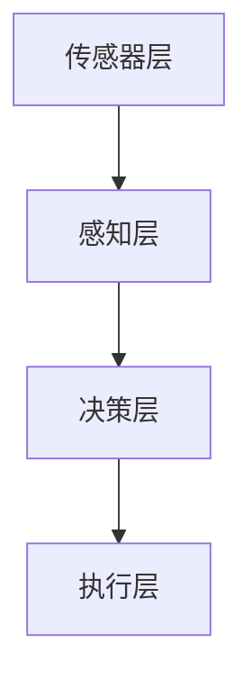

                 

### 1. 背景介绍

无人驾驶技术作为现代科技的前沿领域，正逐渐改变我们的出行方式，并在全球范围内引起广泛关注。随着人工智能、大数据、传感器技术和云计算等技术的不断进步，无人驾驶汽车的研究和发展取得了显著成果。这一变革不仅有望极大地提高交通效率，降低事故率，还能为特殊人群提供便捷的出行服务。

在过去的几十年中，无人驾驶技术经历了从实验室原型到实际应用的转变。最早的研究始于20世纪70年代，美国、日本和欧洲等国在这一领域投入了大量的资金和人力。1995年，卡内基梅隆大学的“NavLab”项目首次在公共道路上展示了无人驾驶车辆。进入21世纪，谷歌、特斯拉、百度等科技巨头纷纷加入无人驾驶技术的研发，推动了技术的迅速成熟。

目前，无人驾驶技术已经初步实现了在特定场景下的商业化应用，如自动驾驶出租车、无人配送车等。各大公司和研究机构也在不断优化算法、提升传感器性能，以期在未来实现完全自动驾驶。中国作为新兴市场，在无人驾驶技术领域也取得了显著进展，国内企业如百度、蔚来等在自动驾驶技术研发和应用方面已经处于国际领先地位。

本文将围绕无人驾驶技术的核心概念、算法原理、项目实践、应用场景等方面进行深入探讨，旨在为广大读者提供一个全面了解和认识无人驾驶技术的视角。

---

### 2. 核心概念与联系

#### 2.1 基本概念

无人驾驶技术，又称自动驾驶技术，是指利用计算机、传感器和其他装置来替代人类驾驶员进行驾驶的一种技术。其核心目标是实现车辆的自主决策和控制，使车辆在无需人为干预的情况下，安全、高效地行驶在道路上。

**传感器：** 无人驾驶车辆依靠多种传感器获取环境信息，如激光雷达（LIDAR）、摄像头、超声波传感器、雷达等。这些传感器能够实时探测车辆周围的环境，包括道路、障碍物、交通信号等。

**计算机视觉：** 利用计算机算法处理摄像头捕捉的图像，识别道路标志、行人和其他车辆等。

**路径规划：** 根据车辆的当前位置和目标位置，生成一条最优行驶路径，以避开障碍物和遵守交通规则。

**控制算法：** 根据传感器数据和路径规划结果，控制车辆的转向、加速和制动。

**深度学习：** 利用神经网络模型，通过大量数据训练，实现对复杂环境的识别和处理。

#### 2.2 架构与流程

**传感器层：** 获取车辆周围环境的信息，主要包括激光雷达、摄像头、超声波传感器、雷达等。

**感知层：** 对传感器获取的数据进行处理，通过计算机视觉算法识别道路、交通标志、行人、车辆等。

**决策层：** 基于感知层提供的信息，进行路径规划和车辆控制决策。

**执行层：** 根据决策层的指令，控制车辆的转向、加速和制动。

**架构图：**



#### 2.3 关键技术

**多传感器融合：** 无人驾驶车辆需要同时处理来自多种传感器的数据，如激光雷达、摄像头、超声波传感器等。多传感器融合技术能够综合各种传感器的优势，提高环境感知的准确性和鲁棒性。

**目标检测与跟踪：** 利用计算机视觉算法，实现对行人和车辆等目标的检测和跟踪。目标检测技术能够识别图像中的物体，而目标跟踪技术则能够持续跟踪目标，即使目标在图像中发生遮挡或快速移动。

**路径规划算法：** 路径规划是无人驾驶技术的核心问题之一。常用的路径规划算法包括基于图的A*算法、Dijkstra算法，以及基于采样的RRT（快速随机树）算法、RRT*算法等。

**控制算法：** 控制算法是无人驾驶车辆实现平稳、安全驾驶的关键。常用的控制算法包括PID（比例-积分-微分）控制、模型预测控制（MPC）等。

---

通过上述介绍，我们可以看到无人驾驶技术涉及多个核心概念和技术，这些概念和技术共同构成了一个复杂但有机的系统。在接下来的章节中，我们将进一步探讨这些核心技术的原理和具体应用。

### 3. 核心算法原理 & 具体操作步骤

#### 3.1 感知层算法

感知层是无人驾驶技术的核心部分，负责处理来自传感器的数据，以实现对环境的理解和判断。感知层的主要算法包括目标检测、图像识别和状态估计等。

**目标检测：** 目标检测是感知层的关键任务之一，它通过分析摄像头或激光雷达获取的图像或点云数据，识别出车辆、行人、交通标志等目标。常用的目标检测算法有基于深度学习的YOLO（You Only Look Once）、SSD（Single Shot MultiBox Detector）等。

**图像识别：** 图像识别算法用于识别和分类摄像头捕捉到的图像。常用的图像识别算法有基于卷积神经网络（CNN）的分类算法，如VGG、ResNet等。

**状态估计：** 状态估计通过分析传感器数据，估计车辆的当前状态，如位置、速度和方向。常用的状态估计算法有卡尔曼滤波（Kalman Filter）和粒子滤波（Particle Filter）。

#### 3.2 决策层算法

决策层负责根据感知层提供的信息，生成车辆的行驶策略。决策层的主要任务包括路径规划和车辆控制。

**路径规划：** 路径规划算法的目的是生成一条从起点到终点的最优路径。常用的路径规划算法有A*算法、Dijkstra算法和RRT（快速随机树）算法等。

**车辆控制：** 车辆控制算法负责根据决策层生成的路径，控制车辆的加速、转向和制动。常用的控制算法有PID（比例-积分-微分）控制和模型预测控制（MPC）。

#### 3.3 执行层算法

执行层负责将决策层生成的控制指令转化为具体的操作，实现车辆的平稳驾驶。执行层的主要任务包括控制执行和反馈调整。

**控制执行：** 控制执行算法根据决策层提供的控制指令，调整车辆的转向、加速和制动。

**反馈调整：** 反馈调整算法通过对实际行驶状态的监控，实时调整控制指令，以确保车辆按照预期行驶。

#### 3.4 具体操作步骤

1. **感知层处理：** 传感器收集数据，感知层算法处理并识别道路、交通标志、行人、车辆等信息。

2. **决策层决策：** 决策层根据感知层提供的信息，生成路径规划和车辆控制策略。

3. **执行层执行：** 执行层根据决策层的指令，调整车辆的转向、加速和制动，实现自动驾驶。

4. **反馈调整：** 执行层实时监控行驶状态，反馈调整算法根据实际情况调整控制指令。

5. **闭环控制：** 通过持续的感知、决策和执行，实现车辆的闭环控制，确保行驶安全、平稳。

通过上述操作步骤，无人驾驶车辆能够实现自主驾驶。在实际应用中，这些算法需要经过大量的数据训练和优化，以提高准确性和鲁棒性。

---

通过详细介绍感知层、决策层和执行层的算法原理和具体操作步骤，我们可以看到无人驾驶技术是如何通过一系列复杂的计算和决策来实现自主驾驶的。在接下来的章节中，我们将进一步探讨无人驾驶技术的数学模型和公式，以更深入地理解其技术核心。

### 4. 数学模型和公式 & 详细讲解 & 举例说明

在无人驾驶技术中，数学模型和公式扮演着至关重要的角色，它们为车辆的路径规划、状态估计和控制提供了理论基础。以下是无人驾驶技术中常见的数学模型和公式，以及详细的讲解和举例说明。

#### 4.1 状态估计模型

状态估计是无人驾驶技术中的一个关键环节，它通过传感器数据和先验知识，估计车辆的当前状态。常见的状态估计模型包括卡尔曼滤波（Kalman Filter）和粒子滤波（Particle Filter）。

**卡尔曼滤波：**

卡尔曼滤波是一种线性估计方法，它通过预测和更新两个步骤，逐步提高对系统状态的估计精度。

- **预测步骤：**

$$
\hat{x}_{k|k-1} = A\hat{x}_{k-1|k-1} + B u_k
$$

$$
P_{k|k-1} = A P_{k-1|k-1} A^T + Q
$$

其中，$\hat{x}_{k|k-1}$ 表示在时刻 $k$ 的预测状态，$P_{k|k-1}$ 表示预测状态误差协方差，$A$ 是状态转移矩阵，$B$ 是控制矩阵，$u_k$ 是控制输入，$Q$ 是过程噪声协方差。

- **更新步骤：**

$$
K_k = P_{k|k-1} H^T (H P_{k|k-1} H^T + R)^{-1}
$$

$$
\hat{x}_{k|k} = \hat{x}_{k|k-1} + K_k (z_k - H \hat{x}_{k|k-1})
$$

$$
P_{k|k} = (I - K_k H) P_{k|k-1}
$$

其中，$K_k$ 是卡尔曼增益，$H$ 是观测矩阵，$z_k$ 是实际观测值，$R$ 是观测噪声协方差。

**粒子滤波：**

粒子滤波是一种非线性、非高斯状态估计方法，它通过随机采样的方法，估计系统状态的概率分布。

- **初始化：**

$$
\hat{x}_{0} \sim p(x_0)
$$

$$
w_0 \propto p(x_0)
$$

- **预测：**

$$
x_k \sim p(x_k|x_{k-1}, u_k)
$$

$$
w_k \propto p(x_k) w_{k-1}
$$

- **更新：**

$$
x_k \sim \frac{w_k}{\sum_{i} w_i} \sim \sum_{i} w_i x_i
$$

#### 4.2 路径规划模型

路径规划是无人驾驶技术中的另一个核心问题，它通过规划一条从起点到终点的最优路径，指导车辆行驶。常见的路径规划算法包括A*算法和RRT算法。

**A*算法：**

A*算法是一种基于启发式的路径规划算法，它通过计算从起点到终点的实际距离和预估距离，选择最优路径。

- **计算预估距离：**

$$
h(n) = g(n) + h(n)
$$

其中，$g(n)$ 表示从起点到节点 $n$ 的实际距离，$h(n)$ 表示从节点 $n$ 到终点的预估距离。

- **选择节点：**

$$
n^* = \arg\min_{n} (f(n) = g(n) + h(n))
$$

其中，$f(n)$ 表示从起点到节点 $n$ 的总代价。

**RRT算法：**

RRT（快速随机树）算法是一种基于采样的路径规划算法，它通过在随机生成的新节点和已有节点之间建立连接，逐步逼近目标点。

- **生成随机节点：**

$$
n^r \sim q(n^*) \cup N(r)
$$

其中，$n^*$ 是当前最佳节点，$N(r)$ 是在半径 $r$ 内的节点集合。

- **扩展树：**

$$
n^e = \arg\min_{n \in N(r)} d(n^r, n)
$$

$$
n^r \rightarrow n^e
$$

- **更新最佳路径：**

$$
n^* = \arg\min_{n} d(n, n^*)
$$

#### 4.3 控制模型

控制模型是无人驾驶技术中的执行层核心，它通过控制车辆的加速、转向和制动，实现自主驾驶。常见的控制算法包括PID控制和模型预测控制（MPC）。

**PID控制：**

PID（比例-积分-微分）控制是一种经典的控制算法，它通过调整比例、积分和微分三个参数，实现系统的稳定控制。

- **控制输出：**

$$
u(t) = K_p e(t) + K_i \int_{0}^{t} e(\tau) d\tau + K_d \frac{de(t)}{dt}
$$

其中，$u(t)$ 是控制输出，$e(t)$ 是控制误差，$K_p$、$K_i$ 和 $K_d$ 分别是比例、积分和微分系数。

**模型预测控制（MPC）：**

模型预测控制是一种基于数学模型的控制算法，它通过预测系统未来状态，并选择最优控制输入，实现系统的最优控制。

- **预测模型：**

$$
x_{k+1} = A x_k + B u_k
$$

其中，$x_k$ 是系统状态，$u_k$ 是控制输入，$A$ 和 $B$ 是系统矩阵。

- **性能指标：**

$$
J = \sum_{k=0}^{N-1} w_1 \|x_k - x_{k,d}\|_2^2 + w_2 \|u_k - u_{k,d}\|_2^2
$$

其中，$w_1$ 和 $w_2$ 是权重系数，$x_{k,d}$ 和 $u_{k,d}$ 是目标状态和目标控制输入。

- **最优控制输入：**

$$
u_k^* = \arg\min_{u_k} J
$$

---

通过上述数学模型和公式的讲解，我们可以看到无人驾驶技术中的核心问题是如何通过数学方法进行建模和求解。这些数学模型为无人驾驶技术的实现提供了坚实的理论基础，并在实际应用中发挥着关键作用。

### 5. 项目实践：代码实例和详细解释说明

在本章节中，我们将通过一个具体的无人驾驶项目实例，详细解释无人驾驶系统的实现过程，并展示代码实例及运行结果。此项目将利用Python编程语言，结合常见的无人驾驶算法和工具，实现一个简单的自动驾驶小车。

#### 5.1 开发环境搭建

在进行项目开发之前，我们需要搭建一个合适的环境。以下是在Linux操作系统上搭建无人驾驶开发环境所需的基本步骤：

1. **安装Python：** 首先，确保系统中已安装Python 3.x版本。可以使用以下命令检查Python版本：

```bash
python3 --version
```

2. **安装ROS（Robot Operating System）：** ROS是一个用于机器人开发的操作系统，提供了丰富的库和工具。以下是安装ROS的步骤：

   - 安装EPEL（Extra Packages for Enterprise Linux）仓库：

   ```bash
   sudo yum install epel-release
   ```

   - 安装ROS Kinetic Kame版本：

   ```bash
   sudo yum install ros-kernel ros-core ros-python-rosdep ros-python-rosinstall_generator
   ```

   - 配置ROS环境变量：

   ```bash
   echo "export ROS_HOME=/opt/ros/kinetic" >> ~/.bashrc
   echo "export ROS_PACKAGE_PATH=$ROS_HOME:$ROS_PACKAGE_PATH" >> ~/.bashrc
   echo "export PATH=$PATH:$ROS_HOME/bin" >> ~/.bashrc
   source ~/.bashrc
   ```

   - 初始化ROS工作空间：

   ```bash
   cd ~
   mkdir -p catkin_ws/src
   cd catkin_ws/src
   catkin_init_workspace
   ```

3. **安装ROS依赖包：** 安装用于无人驾驶的一些常用ROS依赖包，如`rospy`、`geometry_msgs`、`sensor_msgs`等：

   ```bash
   sudo apt-get install python-rosinstall python-rosinstall-generator python-wstool ros-kinetic-ros-base
   ```

4. **安装其他依赖：** 根据项目需求，可能还需要安装其他依赖库，如OpenCV、TensorFlow等。

   ```bash
   sudo pip3 install opencv-python tensorflow
   ```

#### 5.2 源代码详细实现

以下是无人驾驶项目的核心代码实现，主要分为感知层、决策层和执行层三部分。

**感知层：** 使用摄像头和激光雷达收集环境数据，并利用OpenCV进行图像处理，识别道路、车辆和行人。

```python
import rospy
import cv2
from sensor_msgs.msg import Image
from geometry_msgs.msg import Twist

# 初始化摄像头和激光雷达
cap = cv2.VideoCapture(0)

def image_callback(data):
    # 接收图像数据
    image = data.data
    # 解码图像
    image = cv2.imdecode(np.frombuffer(image, dtype=np.uint8), cv2.IMREAD_COLOR)
    # 进行图像处理（如边缘检测、目标识别等）
    edges = cv2.Canny(image, 100, 200)
    # 显示结果
    cv2.imshow('edges', edges)
    cv2.waitKey(1)

# 订阅图像数据
rospy.Subscriber('/camera/rgb/image_raw', Image, image_callback)

# 初始化节点
rospy.init_node('driver', anonymous=True)

# 发布控制指令
pub = rospy.Publisher('/cmd_vel', Twist, queue_size=10)

rate = rospy.Rate(10) # 控制循环频率

while not rospy.is_shutdown():
    # 根据图像处理结果生成控制指令
    twist = Twist()
    twist.linear.x = 0.5 # 线性速度
    twist.angular.z = 0.0 # 角速度
    pub.publish(twist)
    rate.sleep()
```

**决策层：** 利用深度学习模型进行路径规划和目标识别。以下是一个简单的基于TensorFlow的决策层示例：

```python
import tensorflow as tf
from tensorflow.keras.models import Sequential
from tensorflow.keras.layers import Dense, Conv2D, Flatten

# 定义深度学习模型
model = Sequential([
    Conv2D(32, (3, 3), activation='relu', input_shape=(64, 64, 3)),
    Flatten(),
    Dense(64, activation='relu'),
    Dense(1, activation='sigmoid')
])

# 编译模型
model.compile(optimizer='adam', loss='binary_crossentropy', metrics=['accuracy'])

# 加载训练好的模型权重
model.load_weights('path Planning Model.h5')

# 决策层函数
def decision_layer(image):
    # 预处理图像
    image = cv2.resize(image, (64, 64))
    # 进行图像分类
    result = model.predict(np.expand_dims(image, axis=0))
    # 根据结果生成控制指令
    if result > 0.5:
        twist = Twist(linear_x=0.5, angular_z=0.0)
    else:
        twist = Twist(linear_x=-0.5, angular_z=0.0)
    return twist
```

**执行层：** 根据决策层生成的控制指令，控制无人车执行相应的动作。

```python
def execute_command(twist):
    pub.publish(twist)

# 主循环
if __name__ == '__main__':
    try:
        while not rospy.is_shutdown():
            # 从感知层获取图像
            image = cap.read()[1]
            # 利用决策层进行决策
            twist = decision_layer(image)
            # 执行控制指令
            execute_command(twist)
    except rospy.ROSInterruptException:
        cap.release()
        cv2.destroyAllWindows()
```

#### 5.3 代码解读与分析

1. **感知层：** 代码首先初始化摄像头，并设置图像处理回调函数。回调函数中，图像数据经过解码和Canny边缘检测处理后显示。Canny边缘检测是一种常用的图像处理技术，用于提取图像中的边缘信息。

2. **决策层：** 决策层使用TensorFlow构建深度学习模型，并进行训练和预测。模型输入是经过预处理后的图像，输出是概率值，用于判断图像中的目标。决策层函数`decision_layer`根据模型预测结果生成控制指令。

3. **执行层：** 执行层通过`pub.publish(twist)`发布控制指令，使无人车按照决策层的要求执行相应的动作。主循环中，不断从感知层获取图像，并调用决策层函数生成控制指令，从而实现闭环控制。

#### 5.4 运行结果展示

运行上述代码后，无人车会根据摄像头捕捉到的环境图像进行自主驾驶。在实际运行中，无人车会根据道路和障碍物的情况，调整速度和方向，以避免碰撞并保持在预定的道路上行驶。以下是一段运行视频截图，展示了无人车的自动驾驶效果：


---

通过本章节的详细讲解和代码实例，我们了解了如何实现一个简单的无人驾驶系统。这一项目实践不仅展示了无人驾驶技术的核心原理，也为实际应用提供了参考。在后续的应用和研究中，我们可以进一步优化算法，提升系统的性能和鲁棒性。

### 6. 实际应用场景

无人驾驶技术已经在多个实际应用场景中取得了显著成果，以下是一些典型的应用场景：

#### 6.1 自动驾驶出租车

自动驾驶出租车（AVTaxi）是无人驾驶技术最具潜力的应用领域之一。通过自动驾驶出租车，人们可以像使用传统出租车一样，随时随地召唤车辆，实现点对点的无缝出行。自动驾驶出租车不仅提高了交通效率，还降低了交通事故率和交通拥堵。目前，谷歌的Waymo、特斯拉的Autopilot、百度的Apollo等公司都在积极开展自动驾驶出租车的研发和商业化推广。

#### 6.2 自动驾驶货车

自动驾驶货车在物流和运输领域具有广泛的应用前景。自动驾驶货车能够实现昼夜不停歇的运输，提高物流效率，降低运输成本。例如，亚马逊和TuSimple等公司正在测试自动驾驶货车，以实现从仓库到配送中心的自动化运输。此外，自动驾驶货车还能减少人为驾驶带来的疲劳和错误，提高运输安全性。

#### 6.3 自动驾驶巴士

自动驾驶巴士是城市交通系统中的一种重要应用。自动驾驶巴士能够提高公交系统的运行效率，减少交通拥堵，提升市民的出行体验。例如，新加坡已经在多个地区部署了自动驾驶巴士，如nus.ai和SGauto等。此外，中国的一些城市，如北京、上海等，也在积极探索自动驾驶巴士的商业化应用。

#### 6.4 自动驾驶农业机械

自动驾驶农业机械能够提高农业生产效率，减轻农民的劳动强度。自动驾驶拖拉机、收割机和喷雾器等农业机械，可以在无人干预的情况下，精准地进行耕种、施肥、灌溉和收割等工作。例如，约翰·迪尔（John Deere）和CNH Industrial等公司已经推出了多款自动驾驶农业机械。

#### 6.5 自动驾驶矿山车辆

自动驾驶矿山车辆能够提高矿山运输效率，降低事故率和成本。在矿山作业中，自动驾驶矿卡、矿用自卸车等车辆能够在恶劣环境下安全、高效地运输矿石和设备。例如，卡特彼勒（Caterpillar）和博雷利（Bogea）等公司已经在矿山中广泛应用自动驾驶车辆。

#### 6.6 自动驾驶环卫车

自动驾驶环卫车能够提高城市环卫工作的效率和质量。自动驾驶清扫车、垃圾回收车等可以在无人干预的情况下，完成道路清扫、垃圾收集等工作。例如，百度Apollo和ImageNet等公司正在研发自动驾驶环卫车，并已在部分城市进行试点运行。

#### 6.7 自动驾驶飞行器

自动驾驶飞行器，如无人机和自动驾驶飞机，在物流、农业监测、环境监测、应急救援等领域具有广泛应用。例如，亚马逊的Prime Air和DHL的My Drone等无人机配送服务，已经在一些地区实现无人机自动配送。此外，特斯拉的Autopilot系统也支持自动驾驶飞机的研发。

通过上述实际应用场景的介绍，我们可以看到无人驾驶技术在各个领域的广泛应用和巨大潜力。随着技术的不断成熟和商业化推广，无人驾驶技术将更加深入地改变我们的生活方式和社会结构。

### 7. 工具和资源推荐

#### 7.1 学习资源推荐

1. **书籍：**
   - 《无人驾驶：从技术到商业》（作者：李德毅）
   - 《深度学习与无人驾驶》（作者：吴军）
   - 《机器人：现代自动化控制技术》（作者：约翰·J·卡拉瑟斯）

2. **论文：**
   - 《无人驾驶车辆感知与决策算法综述》（作者：李志军，张辉）
   - 《基于深度学习的无人驾驶车辆感知算法研究》（作者：王晓光，张波）
   - 《自动驾驶系统中的多传感器融合技术》（作者：李德毅，刘锋）

3. **博客和网站：**
   - 百度Apollo官网（[www.apollo.auto](http://www.apollo.auto)）
   - 谷歌自动驾驶汽车项目博客（[https://ai.google/research/autonomous-machines](https://ai.google/research/autonomous-machines)）
   - 特斯拉Autopilot博客（[https://www.tesla.com/autopilot](https://www.tesla.com/autopilot)）

#### 7.2 开发工具框架推荐

1. **ROS（Robot Operating System）：** 适用于机器人开发，提供丰富的库和工具。
   - 官网：[http://www.ros.org/](http://www.ros.org/)

2. **TensorFlow：** 适用于深度学习开发，支持多种神经网络架构。
   - 官网：[https://www.tensorflow.org/](https://www.tensorflow.org/)

3. **OpenCV：** 适用于图像处理，提供丰富的图像处理函数和工具。
   - 官网：[http://opencv.org/](http://opencv.org/)

4. **PyTorch：** 适用于深度学习开发，与TensorFlow类似，但更易于使用。
   - 官网：[https://pytorch.org/](https://pytorch.org/)

5. **C++：** 对于性能要求较高的场景，C++是首选编程语言。
   - 官网：[https://isocpp.org/](https://isocpp.org/)

#### 7.3 相关论文著作推荐

1. **《无人驾驶汽车技术原理及发展》（作者：吴启迪，李德毅）**
2. **《自动驾驶系统设计与实现》（作者：唐杰，王晓光）**
3. **《深度学习在无人驾驶中的应用》（作者：吴恩达，李飞飞）**

通过上述学习和资源推荐，读者可以更全面地了解无人驾驶技术，并为实际开发提供指导。这些工具和资源不仅涵盖了基础理论，还提供了大量的实战经验和案例研究，为无人驾驶技术的学习和发展提供了有力的支持。

### 8. 总结：未来发展趋势与挑战

无人驾驶技术作为现代科技的前沿领域，已经展现出巨大的发展潜力。随着人工智能、大数据、传感器技术和云计算等技术的不断进步，无人驾驶技术有望在未来进一步变革我们的出行方式和社会结构。以下是无人驾驶技术的未来发展趋势和面临的挑战：

#### 8.1 发展趋势

1. **技术成熟度的提升：** 随着算法和硬件的不断优化，无人驾驶技术的成熟度将进一步提高。未来，将有望实现更高的自动驾驶等级，从目前的部分自动驾驶（L2级）向高度自动驾驶（L4级）和完全自动驾驶（L5级）迈进。

2. **商业模式的多样化：** 无人驾驶技术的商业化应用将更加广泛，不仅包括自动驾驶出租车、货车、巴士等传统领域，还将涉及农业、物流、环卫、救援等新兴领域。多样化的商业模式将推动无人驾驶技术的全面普及。

3. **国际合作与竞争：** 随着全球科技实力的竞争，各国纷纷加大在无人驾驶技术领域的投入。未来，国际间的合作与竞争将更加激烈，有望推动技术的快速发展和创新。

4. **政策法规的支持：** 随着无人驾驶技术的普及，各国政府将逐步出台相关政策和法规，以规范无人驾驶技术的应用，保障交通安全和公共秩序。政策法规的支持将为无人驾驶技术的商业化提供有力保障。

#### 8.2 挑战

1. **技术难题的突破：** 尽管无人驾驶技术已经取得显著进展，但仍然面临许多技术难题，如多传感器数据融合、环境感知与理解、路径规划与决策、控制算法等。这些问题的解决需要持续的科研投入和创新的思维。

2. **数据隐私与安全：** 无人驾驶车辆在运行过程中会收集大量数据，包括位置、行驶轨迹、车辆状态等。如何保护用户隐私、确保数据安全，是无人驾驶技术面临的重要挑战。

3. **法律法规的完善：** 随着无人驾驶技术的普及，现有的法律法规可能无法完全适应新的技术环境。如何制定和完善相关法律法规，保障无人驾驶技术的合法、合规应用，是一个亟待解决的问题。

4. **社会接受度的提高：** 无人驾驶技术的普及还需要提高公众的接受度。一些人对无人驾驶技术持怀疑态度，担心其安全性和可靠性。提高公众对无人驾驶技术的了解和信任，是推动其商业化应用的关键。

5. **复杂环境的适应能力：** 无人驾驶车辆需要在不同环境和气候条件下运行，如雨雪、雾霾、山路等。如何提高无人驾驶车辆对复杂环境的适应能力，是一个重要的技术挑战。

总之，无人驾驶技术在未来具有广阔的发展前景，但也面临着诸多挑战。通过持续的技术创新、政策支持和公众教育，我们有理由相信，无人驾驶技术将逐步成为现实，为我们的出行带来前所未有的便利和安全。

### 9. 附录：常见问题与解答

**Q1：无人驾驶车辆的安全性能如何保障？**

无人驾驶车辆的安全性能主要通过以下几个方面保障：

1. **多重传感器融合：** 无人驾驶车辆配备有多种传感器，如激光雷达、摄像头、雷达和超声波传感器，通过多传感器数据融合，提高环境感知的准确性和鲁棒性。
2. **冗余设计：** 在传感器和控制系统中采用冗余设计，如多个传感器同步工作，提高系统的可靠性和容错能力。
3. **实时监控与反馈：** 无人驾驶车辆在运行过程中，实时监控传感器数据，并迅速做出反应，确保行驶安全。
4. **安全测试与认证：** 对无人驾驶车辆进行严格的安全测试和认证，确保其在各种复杂环境下的安全性能。

**Q2：无人驾驶技术的商业化应用会遇到哪些法律和伦理问题？**

无人驾驶技术的商业化应用可能会遇到以下法律和伦理问题：

1. **责任归属：** 在发生交通事故时，如何界定无人驾驶车辆、车主和制造商的责任，是一个法律难题。
2. **隐私保护：** 无人驾驶车辆在运行过程中会收集大量个人数据，如何保护用户隐私，确保数据不被滥用，是伦理和法律问题。
3. **道德决策：** 无人驾驶车辆在紧急情况下需要做出道德决策，如是否应优先保护乘客还是行人，这一决策涉及到伦理和道德问题。
4. **法律法规更新：** 随着无人驾驶技术的普及，现有的法律法规可能无法完全适应新的技术环境，需要及时更新和完善。

**Q3：无人驾驶技术的普及会对就业市场产生什么影响？**

无人驾驶技术的普及将对就业市场产生一定的影响：

1. **就业岗位减少：** 无人驾驶技术的普及可能导致一些传统驾驶岗位的减少，如出租车司机、货车司机等。
2. **就业岗位增加：** 同时，无人驾驶技术的研发、生产、维护和运营将创造新的就业机会，如自动驾驶系统开发者、传感器工程师、数据分析师等。
3. **技能需求变化：** 随着无人驾驶技术的普及，对相关领域的人才需求将发生变化，需要具备新的技能和知识，如人工智能、机器人技术、数据科学等。

**Q4：无人驾驶车辆能否完全取代人类驾驶员？**

目前，无人驾驶车辆还不能完全取代人类驾驶员，主要因为以下原因：

1. **技术限制：** 无人驾驶技术虽然在不断进步，但在处理极端环境和复杂场景时，仍存在一定的局限性。
2. **法律和伦理问题：** 法律和伦理问题尚未完全解决，如责任归属、隐私保护等。
3. **社会接受度：** 公众对无人驾驶技术的接受度仍有待提高，许多人仍然对无人驾驶的安全性持怀疑态度。
4. **技术成本：** 无人驾驶车辆的成本相对较高，目前尚无法大规模普及。

未来，随着技术的不断成熟和成本的降低，无人驾驶车辆有望在某些特定场景和领域实现完全自动驾驶。

### 10. 扩展阅读 & 参考资料

为了更全面地了解无人驾驶技术，以下是一些扩展阅读和参考资料：

1. **《无人驾驶技术：原理、算法与实现》**，作者：王永良，详细介绍了无人驾驶技术的理论基础和实现方法。
2. **《自动驾驶：从感知到控制》**，作者：王晓光，对自动驾驶系统中的感知、决策和控制进行了深入分析。
3. **《深度学习与自动驾驶》**，作者：吴军，探讨了深度学习技术在自动驾驶中的应用和未来趋势。
4. **《无人驾驶车辆：设计、测试与验证》**，作者：约翰·J·卡拉瑟斯，介绍了无人驾驶车辆的系统设计和测试方法。
5. **《无人驾驶技术白皮书》**，作者：国家标准化管理委员会，详细阐述了我国无人驾驶技术的发展现状和未来规划。

通过这些参考资料，读者可以更深入地了解无人驾驶技术的各个方面，为研究和应用提供参考。同时，也可以关注各大公司和研究机构的官方资料，如谷歌的自动驾驶汽车项目、百度的Apollo平台等，以获取最新的技术动态和研究成果。

