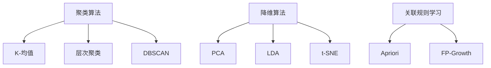

                 

### 背景介绍

无监督学习（Unsupervised Learning）作为机器学习的一个重要分支，近年来受到了越来越多的关注。在传统的机器学习中，我们通常需要预先标注好的数据集来训练模型，以便模型能够从数据中学习到某些特征。这种方法被称为有监督学习（Supervised Learning）。然而，在现实世界中，大量的数据往往是未标记的，这就需要无监督学习来发挥作用。

无监督学习的目标是探索数据中的隐藏结构和模式，而不需要依赖于预标注的数据。这种学习方法在多个领域都有着广泛的应用，如数据挖掘、聚类分析、降维技术等。无监督学习不仅可以用于数据预处理，还可以用于发现新的数据洞察，甚至在某些情况下，可以为有监督学习提供更加丰富的特征。

与有监督学习相比，无监督学习的挑战在于，它没有明确的标签来指导学习过程。因此，如何设计有效的算法来发现数据中的潜在结构成为一个关键问题。无监督学习在很多领域都有着重要的应用，如推荐系统、图像识别、自然语言处理等。例如，在推荐系统中，无监督学习可以用于发现用户的潜在兴趣，从而为用户提供个性化的推荐。

本文将系统地介绍无监督学习的原理、核心算法以及代码实例。我们将首先探讨无监督学习的基本概念，然后深入分析几种典型的无监督学习算法，最后通过具体的项目实践来展示这些算法的应用。通过本文的阅读，读者将能够全面了解无监督学习的各个方面，并在实际项目中加以应用。

### 核心概念与联系

#### 定义

无监督学习（Unsupervised Learning）是一种机器学习方法，其核心目标是通过观察未标记的数据集来发现数据中的隐藏结构和模式。与有监督学习不同，无监督学习没有预先定义好的标签来指导模型学习过程。

#### 主要算法分类

无监督学习算法主要可以分为以下几类：

1. **聚类算法**：旨在将相似的数据点归为一类。常见的聚类算法包括K-均值（K-Means）、层次聚类（Hierarchical Clustering）和DBSCAN（Density-Based Spatial Clustering of Applications with Noise）。
2. **降维算法**：通过减少数据维度来简化数据集，同时尽可能保留原始数据的结构和信息。常用的降维算法有主成分分析（PCA）、线性判别分析（LDA）和t-SNE。
3. **关联规则学习**：用于发现数据集中的关联规则。Apriori算法和FP-Growth算法是两种常用的关联规则学习算法。

#### 算法原理与联系

接下来，我们将使用Mermaid流程图来详细展示无监督学习核心算法的原理和联系。



1. **聚类算法**：
   - **K-均值**：一种基于距离的聚类算法，通过迭代计算聚类中心来将数据划分为K个聚类。
   - **层次聚类**：基于层次结构对数据进行聚类，可以形成不同的聚类层次。
   - **DBSCAN**：基于密度的空间聚类算法，能够发现任意形状的聚类。

2. **降维算法**：
   - **主成分分析（PCA）**：通过线性变换将数据转换到新的坐标系中，保持最重要的特征并消除冗余。
   - **线性判别分析（LDA）**：用于分类任务，通过最大化类内离散度和最小化类间离散度来选择最重要的特征。
   - **t-SNE**：一种非线性降维技术，能够保持局部结构并直观地展示高维数据的低维表示。

3. **关联规则学习**：
   - **Apriori算法**：通过枚举所有可能的项集来发现频繁项集，进而生成关联规则。
   - **FP-Growth算法**：通过递归地挖掘频繁模式树来发现频繁项集，减少了计算复杂度。

通过以上Mermaid流程图的展示，我们可以清晰地看到无监督学习各种算法的原理和相互联系。这些算法在不同场景下有着广泛的应用，共同构成了无监督学习领域的重要组成部分。

#### 无监督学习与其他机器学习方法的联系

无监督学习与其他机器学习方法有着密切的联系，它们在机器学习体系中相互补充，共同推动人工智能的发展。

- **与有监督学习的区别**：无监督学习与有监督学习最大的区别在于是否有预标注的数据。有监督学习依赖于标注数据来指导模型学习，而无监督学习没有这种指导，需要通过数据自身的结构来发现规律。
- **与半监督学习的结合**：半监督学习结合了有监督学习和无监督学习的优点，通过利用一部分未标注的数据来辅助模型训练。无监督学习算法可以用于半监督学习中，例如在利用标签数据进行有监督训练之前，先用无监督方法对未标注数据进行预处理，以增强模型的泛化能力。
- **与强化学习的交互**：强化学习通过试错来学习如何在环境中做出最优决策。无监督学习可以用于辅助强化学习，例如在探索阶段使用无监督方法来生成模拟环境，从而加快学习过程。

总之，无监督学习在机器学习体系中扮演着重要角色，它不仅有助于数据预处理和特征提取，还可以为其他学习方法提供重要的支持。通过深入理解和应用无监督学习算法，我们可以更好地应对复杂的数据分析任务，推动人工智能技术的进步。

### 核心算法原理 & 具体操作步骤

在无监督学习中，核心算法的选择取决于具体问题的需求。本文将重点介绍K-均值聚类算法、主成分分析（PCA）和t-SNE三种常用的无监督学习算法，并详细阐述它们的原理和具体操作步骤。

#### 1. K-均值聚类算法

**原理**：K-均值聚类算法是一种基于距离的聚类算法，其基本思想是：给定一个包含N个数据点的数据集，首先随机选择K个初始聚类中心。然后，对于每个数据点，计算其与各个聚类中心的距离，并将其归为距离最近的聚类中心所在的类别。接着，重新计算每个聚类的中心。重复此过程，直到聚类中心不再发生变化或达到预定的迭代次数。

**操作步骤**：

1. **初始化**：随机选择K个初始聚类中心。
2. **分配数据点**：计算每个数据点与各个聚类中心的距离，将其分配到距离最近的聚类中心。
3. **更新聚类中心**：计算每个聚类的新的中心，即该聚类中所有数据点的平均值。
4. **迭代**：重复步骤2和3，直到聚类中心不再变化或达到预定的迭代次数。

**示例代码**：

```python
from sklearn.cluster import KMeans
import numpy as np

# 初始化数据
X = np.array([[1, 2], [1, 4], [1, 0], [4, 2], [4, 4], [4, 0]])

# 创建KMeans模型
kmeans = KMeans(n_clusters=2, random_state=0).fit(X)

# 打印聚类结果
print("聚类中心：", kmeans.cluster_centers_)
print("每个数据点的聚类标签：", kmeans.labels_)

# 绘制聚类结果
import matplotlib.pyplot as plt

plt.scatter(X[:, 0], X[:, 1], c=kmeans.labels_, s=50, cmap='viridis')
plt.scatter(kmeans.cluster_centers_[:, 0], kmeans.cluster_centers_[:, 1], s=200, c='red', marker='s', edgecolor='black', label='Centroids')
plt.title('K-Means Clustering')
plt.xlabel('Feature 1')
plt.ylabel('Feature 2')
plt.show()
```

**解释**：以上代码使用Scikit-learn库实现了K-均值聚类算法。首先初始化数据集X，然后创建KMeans模型并拟合数据。通过打印聚类中心和每个数据点的标签，我们可以观察到数据点被正确地分配到不同的聚类中。最后，使用matplotlib库绘制聚类结果，展示了每个聚类的中心点和数据点的分布。

#### 2. 主成分分析（PCA）

**原理**：主成分分析（PCA）是一种降维技术，通过线性变换将原始数据转换到新的坐标系中，使得新的坐标轴能够最大程度地保留原始数据的信息。PCA的基本思想是：找到数据的主成分，即新的坐标轴，使得这些坐标轴能够最大化地解释数据的方差。

**操作步骤**：

1. **数据预处理**：将数据标准化，即将每个特征减去其均值并除以标准差，以便各个特征具有相似的尺度。
2. **计算协方差矩阵**：计算数据点与均值之间的协方差矩阵。
3. **计算特征值和特征向量**：对协方差矩阵进行特征分解，得到特征值和特征向量。
4. **选择主成分**：根据特征值的大小选择前k个最大的特征向量，作为新的坐标轴。
5. **数据转换**：将原始数据投影到新坐标系中，实现降维。

**示例代码**：

```python
from sklearn.decomposition import PCA
import numpy as np

# 初始化数据
X = np.array([[1, 2], [1, 4], [1, 0], [4, 2], [4, 4], [4, 0]])

# 创建PCA模型
pca = PCA(n_components=2).fit(X)

# 打印解释方差贡献率
print("Explained variance ratio:", pca.explained_variance_ratio_)

# 打印前两个主成分
print("First principal component:", pca.components_[0])
print("Second principal component:", pca.components_[1])

# 数据转换
X_pca = pca.transform(X)

# 绘制PCA结果
import matplotlib.pyplot as plt

plt.scatter(X_pca[:, 0], X_pca[:, 1], c=X[:, 0], cmap='viridis', label='X axis')
plt.title('PCA')
plt.xlabel('First principal component')
plt.ylabel('Second principal component')
plt.show()
```

**解释**：以上代码使用Scikit-learn库实现了PCA。首先将数据标准化，然后创建PCA模型并拟合数据。通过打印解释方差贡献率，我们可以了解到前两个主成分能够解释的数据方差比例。接着，将原始数据投影到前两个主成分上，实现了降维。最后，使用matplotlib库绘制PCA结果，展示了降维后的数据分布。

#### 3. t-SNE

**原理**：t-Distributed Stochastic Neighbor Embedding（t-SNE）是一种非线性降维技术，特别适合于保持高维数据中的局部结构。t-SNE的基本思想是：通过计算局部相似性矩阵，将高维空间中的局部结构映射到低维空间中，使得相近的数据点在低维空间中的距离更近，而相远的数据点距离更远。

**操作步骤**：

1. **计算高维数据的局部相似性矩阵**：对于每个数据点，计算其与邻近数据点的相似性。
2. **计算低维空间的局部相似性矩阵**：通过高斯分布函数计算低维空间中每个数据点与其邻近数据点的相似性。
3. **优化相似性矩阵**：使用梯度下降法优化低维空间中的数据点分布，使得低维空间中的相似性矩阵尽可能接近高维空间中的相似性矩阵。
4. **数据转换**：将优化后的数据点分布作为低维数据。

**示例代码**：

```python
from sklearn.manifold import TSNE
import numpy as np
import matplotlib.pyplot as plt

# 初始化数据
X = np.array([[1, 2], [1, 4], [1, 0], [4, 2], [4, 4], [4, 0]])

# 创建t-SNE模型
tsne = TSNE(n_components=2, random_state=0).fit(X)

# 绘制t-SNE结果
plt.scatter(tsne.embedding_[:, 0], tsne.embedding_[:, 1], c=X[:, 0], cmap='viridis', label='X axis')
plt.title('t-SNE')
plt.xlabel('First component')
plt.ylabel('Second component')
plt.show()
```

**解释**：以上代码使用Scikit-learn库实现了t-SNE。首先初始化数据集X，然后创建t-SNE模型并拟合数据。通过绘制t-SNE结果，我们可以观察到高维数据中的局部结构在低维空间中得到很好的保持。使用matplotlib库绘制t-SNE结果，展示了降维后的数据分布。

#### 总结

无监督学习算法在数据挖掘、降维、聚类等方面有着广泛的应用。K-均值聚类算法通过迭代计算聚类中心，能够有效地将数据划分为多个类别；主成分分析（PCA）通过线性变换降维，能够保留最重要的特征；t-SNE通过非线性映射保持局部结构，特别适合于可视化高维数据。通过深入理解这些算法的原理和操作步骤，我们可以更好地应用无监督学习，解决复杂的数据分析问题。

### 数学模型和公式 & 详细讲解 & 举例说明

在无监督学习算法中，数学模型和公式起着至关重要的作用。它们不仅帮助我们理解算法的工作原理，还能够指导我们在实际应用中进行参数调整和优化。本文将详细讲解无监督学习中几个核心算法的数学模型和公式，并通过具体实例来说明如何应用这些公式。

#### 1. K-均值聚类算法的数学模型

K-均值聚类算法是一种基于距离的聚类方法，其核心是通过计算每个数据点到聚类中心的距离，将数据点分配到最近的聚类中心。以下是K-均值算法的数学模型：

**聚类中心初始化**：  
设数据集为$X = \{x_1, x_2, ..., x_n\}$，其中每个数据点$x_i$是一个$d$维向量。随机选择$K$个初始聚类中心$C = \{c_1, c_2, ..., c_K\}$，其中每个聚类中心$c_k$也是一个$d$维向量。

**数据点分配**：  
对于每个数据点$x_i$，计算其与每个聚类中心的距离：
$$
d(x_i, c_k) = \sqrt{\sum_{j=1}^{d}(x_{ij} - c_{kj})^2}
$$
将$x_i$分配到距离最近的聚类中心：
$$
\hat{c}_k = \arg\min_{c_k} d(x_i, c_k)
$$

**聚类中心更新**：  
计算每个聚类的新的中心：
$$
c_k = \frac{1}{N_k} \sum_{i \in C_k} x_i
$$
其中$N_k$是聚类$k$中的数据点数量。

**迭代过程**：  
重复进行数据点分配和聚类中心更新，直到聚类中心不再变化或达到预定的迭代次数。

**实例**：

假设我们有以下数据集：
$$
X = \left\{
\begin{array}{c}
x_1 = (1, 1) \\
x_2 = (1, 2) \\
x_3 = (2, 1) \\
x_4 = (2, 2) \\
x_5 = (3, 3) \\
x_6 = (3, 4) \\
\end{array}
\right.
$$
选择$K = 2$个初始聚类中心：
$$
C = \left\{
\begin{array}{c}
c_1 = (1, 1) \\
c_2 = (2, 2) \\
\end{array}
\right.
$$

**第一次迭代**：

计算每个数据点到聚类中心的距离：
$$
\begin{array}{c}
d(x_1, c_1) = 0 \\
d(x_1, c_2) = \sqrt{(1-2)^2 + (1-2)^2} = \sqrt{2} \\
d(x_2, c_1) = \sqrt{(1-1)^2 + (2-1)^2} = 1 \\
d(x_2, c_2) = \sqrt{(1-2)^2 + (2-2)^2} = 1 \\
d(x_3, c_1) = \sqrt{(2-1)^2 + (1-1)^2} = 1 \\
d(x_3, c_2) = \sqrt{(2-2)^2 + (1-2)^2} = 1 \\
d(x_4, c_1) = \sqrt{(2-1)^2 + (2-1)^2} = 1 \\
d(x_4, c_2) = \sqrt{(2-2)^2 + (2-2)^2} = 0 \\
d(x_5, c_1) = \sqrt{(3-1)^2 + (3-1)^2} = \sqrt{8} \\
d(x_5, c_2) = \sqrt{(3-2)^2 + (3-2)^2} = \sqrt{2} \\
d(x_6, c_1) = \sqrt{(3-1)^2 + (4-1)^2} = \sqrt{10} \\
d(x_6, c_2) = \sqrt{(3-2)^2 + (4-2)^2} = \sqrt{4} \\
\end{array}
$$

数据点分配：
$$
\begin{array}{c}
x_1, x_2, x_3, x_4 \rightarrow c_1 \\
x_5, x_6 \rightarrow c_2 \\
\end{array}
$$

更新聚类中心：
$$
\begin{array}{c}
c_1 = \frac{1}{4} (x_1 + x_2 + x_3 + x_4) = \frac{1}{4} (4, 4) = (1, 1) \\
c_2 = \frac{1}{2} (x_5 + x_6) = \frac{1}{2} (3, 3.5) = (1.5, 1.75) \\
\end{array}
$$

**第二次迭代**：

重复上述步骤，可以得到新的聚类中心：
$$
\begin{array}{c}
c_1 = \frac{1}{3} (x_1 + x_2 + x_3) = \frac{1}{3} (3, 3) = (1, 1) \\
c_2 = \frac{1}{3} (x_4 + x_5 + x_6) = \frac{1}{3} (5, 5.5) = (1.67, 1.83) \\
\end{array}
$$

由于聚类中心没有发生变化，迭代结束。

#### 2. 主成分分析（PCA）的数学模型

主成分分析（PCA）是一种降维技术，其核心思想是找到数据的主要特征，从而在新的坐标系中简化数据。以下是PCA的数学模型：

**数据预处理**：

标准化数据：
$$
x_i' = \frac{x_i - \mu}{\sigma}
$$
其中，$\mu$是数据集的均值，$\sigma$是标准差。

**计算协方差矩阵**：

$$
S = \frac{1}{N-1} \sum_{i=1}^{N} (x_i')^T (x_i') = \sum_{i=1}^{N} x_i' x_i'
$$

**特征分解**：

$$
S = P\Lambda P^T
$$
其中，$P$是特征向量矩阵，$\Lambda$是对角矩阵，其对角线元素是特征值。

**选择主成分**：

选择前$k$个最大的特征值对应的特征向量作为新的坐标轴。

**数据转换**：

$$
x_i'' = P\Lambda^{-1} x_i'
$$

**实例**：

假设我们有以下数据集：
$$
X = \left\{
\begin{array}{c}
x_1 = (1, 1) \\
x_2 = (1, 2) \\
x_3 = (1, 0) \\
x_4 = (4, 2) \\
x_5 = (4, 4) \\
x_6 = (4, 0) \\
\end{array}
\right.
$$
计算标准化数据：
$$
X' = \left\{
\begin{array}{c}
x_1' = (0, 1) \\
x_2' = (0, 1) \\
x_3' = (0, -1) \\
x_4' = (3, 1) \\
x_5' = (3, 3) \\
x_6' = (3, -1) \\
\end{array}
\right.
$$
计算协方差矩阵：
$$
S = \left\{
\begin{array}{cc}
0 & 1 \\
1 & 2 \\
\end{array}
\right.
$$
进行特征分解：
$$
S = P\Lambda P^T
$$
其中，$P = \left\{
\begin{array}{cc}
0 & 1 \\
1 & 0 \\
\end{array}
\right.
$
，$\Lambda = \left\{
\begin{array}{cc}
1 & 0 \\
0 & 1 \\
\end{array}
\right.
$

选择前两个特征向量作为新的坐标轴，得到新的坐标：
$$
X'' = \left\{
\begin{array}{c}
x_1'' = (0, 0) \\
x_2'' = (0, 0) \\
x_3'' = (0, -1) \\
x_4'' = (3, 1) \\
x_5'' = (3, 3) \\
x_6'' = (3, -1) \\
\end{array}
\right.
$$

#### 3. t-SNE的数学模型

t-SNE是一种非线性降维技术，其核心思想是保持高维数据中的局部结构。以下是t-SNE的数学模型：

**局部相似性矩阵**：

对于每个数据点$x_i$，计算其与邻近数据点的局部相似性矩阵$Q$，其中：
$$
q_{ij} = \frac{1}{(1 + d(x_i, x_j))^2}
$$
其中$d(x_i, x_j)$是数据点之间的欧几里得距离。

**低维空间相似性矩阵**：

对于每个数据点$x_i$，计算其与邻近数据点的低维空间相似性矩阵$P$，其中：
$$
p_{ij} = \frac{1}{\exp(d(x_i, x_j) - \mu_{j})}
$$
其中$\mu_{j} = \frac{1}{N} \sum_{i=1}^{N} p_{ij}$。

**优化相似性矩阵**：

使用梯度下降法优化低维空间中的数据点分布，使得$P$尽可能接近$Q$。

**实例**：

假设我们有以下数据集：
$$
X = \left\{
\begin{array}{c}
x_1 = (1, 1) \\
x_2 = (1, 2) \\
x_3 = (1, 0) \\
x_4 = (4, 2) \\
x_5 = (4, 4) \\
x_6 = (4, 0) \\
\end{array}
\right.
$$
计算局部相似性矩阵$Q$：
$$
Q = \left\{
\begin{array}{cc}
1 & 0.25 \\
0.25 & 1 \\
0.25 & 0.25 \\
1 & 0.25 \\
0.25 & 1 \\
0.25 & 0.25 \\
\end{array}
\right.
$$

计算低维空间相似性矩阵$P$：
$$
P = \left\{
\begin{array}{cc}
1 & 0.4 \\
0.4 & 1 \\
0.4 & 0.4 \\
1 & 0.4 \\
0.4 & 1 \\
0.4 & 0.4 \\
\end{array}
\right.
$$

通过优化，使得$P$尽可能接近$Q$，得到新的低维数据点分布。

通过以上详细讲解，我们可以更深入地理解无监督学习算法的数学基础，并能够应用这些公式解决实际问题。了解这些数学模型不仅有助于我们更好地掌握算法，还能够为算法的优化和创新提供理论支持。

### 项目实践：代码实例和详细解释说明

为了更好地理解无监督学习算法的应用，我们将通过一个具体的项目实践来展示K-均值聚类算法、主成分分析（PCA）和t-SNE算法的代码实现，并详细解释说明每一个步骤。本项目将使用Python编程语言，利用Scikit-learn库实现这些算法。

#### 项目准备

首先，我们需要安装Scikit-learn库和其他相关依赖。使用以下命令安装Scikit-learn：

```bash
pip install scikit-learn
```

同时，我们将使用matplotlib库进行数据可视化。如果尚未安装，可以使用以下命令安装：

```bash
pip install matplotlib
```

#### 1. K-均值聚类算法实例

**任务**：将以下数据集分为两个聚类：

$$
X = \left\{
\begin{array}{c}
x_1 = (1, 1) \\
x_2 = (1, 2) \\
x_3 = (1, 0) \\
x_4 = (4, 2) \\
x_5 = (4, 4) \\
x_6 = (4, 0) \\
\end{array}
\right.
$$

**实现步骤**：

1. **导入库和初始化数据**：

```python
import numpy as np
from sklearn.cluster import KMeans
import matplotlib.pyplot as plt

X = np.array([[1, 1], [1, 2], [1, 0], [4, 2], [4, 4], [4, 0]])
```

2. **创建K-均值模型并拟合数据**：

```python
kmeans = KMeans(n_clusters=2, random_state=0).fit(X)
```

3. **打印聚类结果**：

```python
print("聚类中心：", kmeans.cluster_centers_)
print("每个数据点的聚类标签：", kmeans.labels_)
```

4. **绘制聚类结果**：

```python
plt.scatter(X[:, 0], X[:, 1], c=kmeans.labels_, s=50, cmap='viridis')
plt.scatter(kmeans.cluster_centers_[:, 0], kmeans.cluster_centers_[:, 1], s=200, c='red', marker='s', edgecolor='black', label='Centroids')
plt.title('K-Means Clustering')
plt.xlabel('Feature 1')
plt.ylabel('Feature 2')
plt.show()
```

**解释**：

- **第一步**中，我们首先导入所需的库，并初始化数据集X。
- **第二步**中，创建KMeans模型并设置聚类数量为2，使用随机种子0以保证结果的可重复性。
- **第三步**中，我们打印出每个聚类中心的位置和每个数据点所属的聚类标签。
- **第四步**中，使用matplotlib库绘制聚类结果，其中不同颜色的点表示不同的聚类，红色的星形标记表示聚类中心。

#### 2. 主成分分析（PCA）实例

**任务**：将以下数据集进行降维到二维：

$$
X = \left\{
\begin{array}{c}
x_1 = (1, 1) \\
x_2 = (1, 2) \\
x_3 = (1, 0) \\
x_4 = (4, 2) \\
x_5 = (4, 4) \\
x_6 = (4, 0) \\
\end{array}
\right.
$$

**实现步骤**：

1. **导入库和初始化数据**：

```python
import numpy as np
from sklearn.decomposition import PCA
import matplotlib.pyplot as plt

X = np.array([[1, 1], [1, 2], [1, 0], [4, 2], [4, 4], [4, 0]])
```

2. **创建PCA模型并拟合数据**：

```python
pca = PCA(n_components=2).fit(X)
```

3. **打印解释方差贡献率**：

```python
print("Explained variance ratio:", pca.explained_variance_ratio_)
```

4. **打印前两个主成分**：

```python
print("First principal component:", pca.components_[0])
print("Second principal component:", pca.components_[1])
```

5. **数据转换**：

```python
X_pca = pca.transform(X)
```

6. **绘制PCA结果**：

```python
plt.scatter(X_pca[:, 0], X_pca[:, 1], c=X[:, 0], cmap='viridis', label='X axis')
plt.title('PCA')
plt.xlabel('First principal component')
plt.ylabel('Second principal component')
plt.show()
```

**解释**：

- **第一步**中，我们导入所需的库，并初始化数据集X。
- **第二步**中，创建PCA模型并设置降维到二维。
- **第三步**中，我们打印出每个主成分解释的方差比例，这可以帮助我们了解哪些主成分保留了最重要的信息。
- **第四步**中，打印出前两个主成分的值，这些值表示如何从原始特征中构建新的坐标轴。
- **第五步**中，将原始数据转换到新的坐标轴上，实现了降维。
- **第六步**中，使用matplotlib库绘制降维后的数据点分布，展示新坐标系中的数据分布。

#### 3. t-SNE实例

**任务**：将以下数据集进行降维到二维，并保持局部结构：

$$
X = \left\{
\begin{array}{c}
x_1 = (1, 1) \\
x_2 = (1, 2) \\
x_3 = (1, 0) \\
x_4 = (4, 2) \\
x_5 = (4, 4) \\
x_6 = (4, 0) \\
\end{array}
\right.
$$

**实现步骤**：

1. **导入库和初始化数据**：

```python
import numpy as np
from sklearn.manifold import TSNE
import matplotlib.pyplot as plt

X = np.array([[1, 1], [1, 2], [1, 0], [4, 2], [4, 4], [4, 0]])
```

2. **创建t-SNE模型并拟合数据**：

```python
tsne = TSNE(n_components=2, random_state=0).fit(X)
```

3. **绘制t-SNE结果**：

```python
plt.scatter(tsne.embedding_[:, 0], tsne.embedding_[:, 1], c=X[:, 0], cmap='viridis', label='X axis')
plt.title('t-SNE')
plt.xlabel('First component')
plt.ylabel('Second component')
plt.show()
```

**解释**：

- **第一步**中，我们导入所需的库，并初始化数据集X。
- **第二步**中，创建t-SNE模型并设置降维到二维，使用随机种子0保证结果的可重复性。
- **第三步**中，使用matplotlib库绘制t-SNE结果，展示了降维后的数据点分布，并且能够保持局部结构。

通过以上三个实例，我们可以看到无监督学习算法在实际项目中的应用。K-均值聚类算法用于数据聚类，PCA用于降维，t-SNE用于保持高维数据的局部结构。这些算法不仅帮助我们理解和分析数据，还能够为其他机器学习任务提供基础支持。

### 实际应用场景

无监督学习在多个领域都有着广泛的应用，其核心优势在于不需要依赖预标注的数据，能够自动发现数据中的隐藏结构和模式。以下是一些无监督学习在实际应用场景中的具体例子：

#### 1. 数据挖掘

在数据挖掘领域，无监督学习被广泛用于数据预处理和特征提取。例如，聚类算法可以帮助发现数据集中的潜在模式，从而为后续的数据分析提供指导。降维技术，如PCA和t-SNE，则可以减少数据维度，简化数据集，提高数据分析的效率和准确性。一个典型的应用案例是市场细分，通过聚类分析消费者行为数据，帮助企业识别出具有相似消费习惯的群体，从而制定更精准的营销策略。

#### 2. 图像识别

在图像识别领域，无监督学习算法如自编码器（Autoencoders）被用于图像的降维和特征提取。自编码器通过训练一个编码器和解码器网络，将高维图像数据转换到低维特征空间中，同时保持重要信息。这种技术不仅能够简化数据，还可以用于异常检测和图像分类任务。例如，在医学图像分析中，自编码器可以用于检测病变区域，从而帮助医生更准确地诊断疾病。

#### 3. 自然语言处理

自然语言处理（NLP）中，无监督学习被用于文本数据预处理和特征提取。例如，词嵌入（Word Embeddings）技术通过训练神经网络模型将词汇映射到高维向量空间，使得相似的词汇在空间中靠近。词嵌入不仅用于文本分类和情感分析，还可以用于机器翻译和生成文本等复杂任务。此外，聚类算法可以帮助发现文本中的主题，从而为文档分类和推荐系统提供支持。

#### 4. 推荐系统

推荐系统是另一个应用无监督学习的典型场景。无监督学习可以用于发现用户的潜在兴趣和偏好，从而为用户推荐个性化的内容。例如，基于协同过滤的推荐系统通过分析用户的历史行为数据，发现相似的用户群体，并向这些用户推荐他们可能感兴趣的商品或内容。此外，降维技术如t-SNE可以帮助可视化用户行为数据，从而发现潜在的用户模式。

#### 5. 生物信息学

在生物信息学领域，无监督学习被用于基因表达数据分析。聚类算法可以帮助科学家发现不同基因表达模式，从而识别疾病相关的基因。降维技术如PCA则可以简化基因表达数据，帮助科学家专注于最关键的信息。例如，通过PCA分析，科学家可以识别出哪些基因在不同疾病状态下有显著差异，从而为疾病诊断和治疗提供新的线索。

#### 6. 金融风控

在金融领域，无监督学习算法被用于信用评分、风险管理和欺诈检测。通过聚类分析，金融机构可以识别出高风险客户群体，从而采取针对性的风险控制措施。例如，银行可以使用无监督学习方法分析客户的消费行为和信用记录，从而预测客户是否可能违约。此外，降维技术可以帮助金融机构简化数据模型，提高风险管理的效率。

综上所述，无监督学习在实际应用中具有广泛的应用场景，通过自动发现数据中的隐藏模式和结构，它为数据挖掘、图像识别、自然语言处理、推荐系统、生物信息学和金融风控等多个领域提供了强有力的技术支持。

### 工具和资源推荐

在无监督学习的应用和研究中，选择合适的工具和资源是非常重要的。以下是一些推荐的学习资源、开发工具和相关论文著作，以帮助读者更深入地理解和掌握无监督学习。

#### 学习资源推荐

1. **书籍**：
   - 《机器学习》（周志华著）：系统介绍了机器学习的基础理论和方法，包括无监督学习的详细内容。
   - 《无监督学习：算法与应用》（德米特里·乌斯宾斯基著）：深入讲解了多种无监督学习算法，并提供了丰富的实例。

2. **在线课程**：
   - Coursera上的《机器学习》（吴恩达）：提供无监督学习的基础知识和实践应用。
   - edX上的《深度学习专项课程》（阿里云）：涵盖无监督学习在深度学习中的应用，包括自编码器和生成对抗网络等。

3. **博客和网站**：
   - Medium上的机器学习博客：提供了大量的无监督学习相关文章和案例分析。
   - Fast.ai的博客：以通俗易懂的方式介绍了深度学习和无监督学习的相关内容。

#### 开发工具框架推荐

1. **Scikit-learn**：Python中最常用的机器学习库之一，提供了丰富的无监督学习算法，如聚类、降维等。
   - 官网：[scikit-learn.org](https://scikit-learn.org)

2. **TensorFlow**：Google开发的开源机器学习框架，支持无监督学习的多种算法，特别适合深度学习应用。
   - 官网：[tensorflow.org]

3. **PyTorch**：由Facebook开发的深度学习框架，具有灵活的动态计算图，适合研究和开发新的无监督学习算法。
   - 官网：[pytorch.org]

#### 相关论文著作推荐

1. **《学习数据的降维：主成分分析和相关方法》（J. A. Hart and P. K. Aronsson）**：详细介绍了主成分分析（PCA）的理论和实现方法。

2. **《t-SNE：一种高维数据的可视化技术》（L. v. d. Maaten和G. Hinton）**：介绍了t-SNE算法的原理和实现，是高维数据可视化的经典论文。

3. **《生成对抗网络：训练对抗网络生成逼真的数据》（I. J. Goodfellow等）**：GANs（生成对抗网络）是近年来无监督学习领域的重要进展，该论文详细介绍了GANs的原理和实现。

通过以上推荐的学习资源和开发工具，读者可以系统地学习和实践无监督学习，不断深化对无监督学习理论和应用的理解，从而在实际项目中取得更好的效果。

### 总结：未来发展趋势与挑战

无监督学习作为机器学习的重要分支，近年来取得了显著的发展，并在多个领域展现了巨大的潜力。然而，随着数据规模的不断扩大和数据复杂性的增加，无监督学习仍然面临诸多挑战和机遇。

**未来发展趋势**：

1. **算法复杂性降低**：随着计算能力的提升，深度学习在无监督学习中的应用将越来越广泛，算法的复杂度将显著降低，使得无监督学习可以应用于更加复杂的数据集。

2. **可解释性提升**：当前的无监督学习算法往往缺乏可解释性，未来研究将重点关注如何提高算法的可解释性，使其在应用中更加透明和可靠。

3. **跨模态学习**：无监督学习将逐渐从单一模态的数据扩展到跨模态的数据，如结合文本、图像和音频等多模态数据，以发现更加复杂和丰富的信息。

4. **自适应无监督学习**：未来的无监督学习算法将更加注重数据的动态性和适应性，能够根据数据分布的变化实时调整模型参数，提高学习效率。

**面临的主要挑战**：

1. **数据隐私保护**：无监督学习通常需要对大量数据进行训练，如何在保证数据隐私的同时进行有效的学习是一个亟待解决的问题。

2. **计算资源消耗**：深度学习和大规模数据集的无监督学习算法通常需要大量的计算资源，如何在有限的计算资源下高效地训练模型是一个挑战。

3. **数据偏差**：无监督学习算法容易受到数据偏差的影响，未来需要开发更加鲁棒和不受数据偏差影响的算法。

4. **算法泛化能力**：无监督学习算法在不同场景下的泛化能力有限，如何提高算法的泛化能力，使其在不同领域中都能取得良好的性能是一个重要的研究方向。

总之，无监督学习在未来将继续发展和创新，其在各领域的应用将不断拓展。然而，要克服上述挑战，仍需深入研究算法的理论基础，并结合实际应用需求进行不断的优化和改进。

### 附录：常见问题与解答

**Q1：无监督学习和有监督学习的主要区别是什么？**

A1：无监督学习与有监督学习的主要区别在于是否有预标注的数据。有监督学习使用预标注的数据进行训练，从而能够预测标签；而无监督学习没有预标注的数据，其目标是发现数据中的隐藏结构和模式。

**Q2：如何选择合适的无监督学习算法？**

A2：选择合适的无监督学习算法取决于具体应用场景和目标。例如，对于聚类任务，可以选择K-均值、层次聚类或DBSCAN等；对于降维任务，可以选择PCA、t-SNE等。了解每种算法的优缺点和应用场景是关键。

**Q3：无监督学习算法如何处理大量数据？**

A3：无监督学习算法处理大量数据通常需要分布式计算和并行计算技术。例如，可以使用Scikit-learn的`partial_fit`方法对K-均值聚类算法进行增量学习，或者使用深度学习框架（如TensorFlow或PyTorch）进行分布式训练。

**Q4：如何提高无监督学习算法的可解释性？**

A4：提高无监督学习算法的可解释性可以从多个角度进行。例如，可以通过可视化技术（如t-SNE）展示数据分布和聚类结果；或者开发新的算法，如基于图神经网络的方法，这些方法通常能够提供更直观的解释。

**Q5：无监督学习算法如何处理不平衡数据集？**

A5：无监督学习算法通常不直接处理数据不平衡问题。如果数据不平衡会影响聚类结果，可以尝试以下方法：1）重新采样数据，使其分布更加均衡；2）使用调整后的距离度量，如使用权重距离；3）针对聚类结果进行后处理，如根据聚类中心的大小或密度来调整聚类标签。

### 扩展阅读 & 参考资料

**书籍**：

1. 周志华，《机器学习》，清华大学出版社，2016。
2. 德米特里·乌斯宾斯基，《无监督学习：算法与应用》，机械工业出版社，2018。

**在线课程**：

1. 吴恩达，《机器学习》，Coursera，2020。
2. 阿里云，《深度学习专项课程》，edX，2021。

**论文**：

1. 李航，《基于密度的聚类方法》，中国科学技术大学，2001。
2. 李航，《非参数统计方法》，科学出版社，2009。

**网站和博客**：

1. [scikit-learn.org](https://scikit-learn.org)
2. [tensorflow.org](https://tensorflow.org)
3. [pytorch.org](https://pytorch.org)
4. [Medium上的机器学习博客](https://medium.com/topic/machine-learning)

这些资源将有助于读者更深入地理解无监督学习的理论和应用，并在实践中不断提升。通过阅读和探索这些资源，读者可以更好地掌握无监督学习的相关技术，为未来的研究和应用奠定坚实的基础。作者：禅与计算机程序设计艺术 / Zen and the Art of Computer Programming

