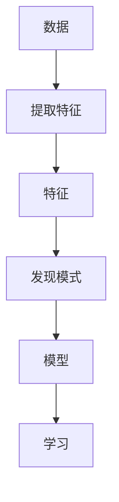

                 

### 背景介绍

无监督学习（Unsupervised Learning）作为机器学习领域的重要分支，近年来受到了广泛关注。其核心目标是从无标签数据中自动发现数据内在的结构或模式。与传统的监督学习（Supervised Learning）不同，无监督学习不依赖于预先标记的训练数据，而是通过分析数据自身的特征，挖掘隐藏的规律。

无监督学习的重要性在于，它在很多实际应用场景中具有不可替代的作用。例如，在图像处理中，无监督学习可以用于聚类相似图像，实现图像分割；在自然语言处理中，它可以用于文本分类和主题建模，帮助分析大量未标记的文本数据。此外，无监督学习还在推荐系统、社交网络分析、生物信息学等领域发挥着重要作用。

本文将深入探讨无监督学习的核心概念、算法原理、数学模型以及实际应用案例。通过逐步分析推理，我们将揭示无监督学习的内在机制，并展示其在实际项目中的具体应用。

### 核心概念与联系

要理解无监督学习，首先需要明确几个核心概念：数据、特征、模式和学习。

- **数据（Data）**：数据是机器学习的基础，包括图像、文本、音频等不同形式。
- **特征（Feature）**：特征是从数据中提取的、具有区分性的属性。例如，在图像中，特征可以是颜色、形状、纹理等。
- **模式（Pattern）**：模式是数据中存在的重复性规律或结构。无监督学习的目标是发现这些模式。
- **学习（Learning）**：学习是指机器通过分析数据，从无监督数据中自动提取特征和模式的过程。

接下来，我们使用Mermaid流程图来展示这些概念之间的联系。



在无监督学习中，数据首先经过特征提取，然后通过模式发现算法来识别数据中的内在结构。最后，这些模式被用于构建模型，模型再通过学习过程不断完善。这种循环迭代的过程使得机器能够不断优化对数据内在结构的理解。

### 核心算法原理 & 具体操作步骤

无监督学习算法众多，其中一些经典的算法包括聚类（Clustering）、降维（Dimensionality Reduction）和关联规则学习（Association Rule Learning）。以下将介绍这三种算法的原理和具体操作步骤。

#### 1. 聚类算法（Clustering）

聚类算法是一种将数据点划分为多个群组的方法，使得同一个群组中的数据点相似度较高，而不同群组的数据点相似度较低。常见的聚类算法有K-均值（K-Means）、层次聚类（Hierarchical Clustering）和密度聚类（Density-Based Clustering）。

**K-均值算法原理：**

K-均值算法是一种迭代算法，其目标是将数据划分为K个群组。算法步骤如下：

1. **初始化**：随机选择K个数据点作为初始聚类中心。
2. **分配数据点**：将每个数据点分配到与其最近的聚类中心所在的群组。
3. **更新聚类中心**：计算每个群组的平均值，作为新的聚类中心。
4. **迭代**：重复步骤2和步骤3，直至聚类中心不再变化或达到预设的迭代次数。

**代码示例：**

```python
from sklearn.cluster import KMeans
import numpy as np

# 数据集
data = np.array([[1, 2], [1, 4], [1, 0],
                 [10, 2], [10, 4], [10, 0]])

# 初始化K-均值聚类模型，设置聚类个数
kmeans = KMeans(n_clusters=2, random_state=0).fit(data)

# 输出聚类结果
print(kmeans.labels_)
```

#### 2. 降维算法（Dimensionality Reduction）

降维算法用于减少数据维度，从而提高计算效率和降低过拟合风险。常见的降维算法有主成分分析（PCA）、线性判别分析（LDA）和非线性降维算法（如t-SNE）。

**PCA算法原理：**

PCA是一种线性降维方法，其核心思想是通过正交变换将原始数据投影到新的坐标系中，使得新的坐标系中的第一轴（主成分）具有最大的方差，第二轴次之，以此类推。具体步骤如下：

1. **数据标准化**：对数据进行中心化和标准化，使得每个特征具有相同的方差和均值。
2. **计算协方差矩阵**：计算每个特征与其他特征的协方差。
3. **计算协方差矩阵的特征值和特征向量**：特征值表示特征的重要性，特征向量表示数据的正交变换方向。
4. **选择主成分**：根据特征值的大小，选择前k个特征值对应的特征向量，构成投影矩阵。
5. **数据投影**：将原始数据投影到新的k维空间中。

**代码示例：**

```python
from sklearn.decomposition import PCA
import numpy as np

# 数据集
data = np.array([[1, 2], [1, 4], [1, 0],
                 [10, 2], [10, 4], [10, 0]])

# 初始化PCA模型，设置主成分个数
pca = PCA(n_components=2).fit(data)

# 输出投影结果
print(pca.transform(data))
```

#### 3. 关联规则学习（Association Rule Learning）

关联规则学习用于发现数据之间的关联关系，常用的算法有Apriori算法和FP-Growth算法。

**Apriori算法原理：**

Apriori算法是一种基于布尔矩阵的频繁项集挖掘算法。其基本思想是通过逐层递归地寻找频繁项集，并生成关联规则。算法步骤如下：

1. **初始化**：计算所有项集的频率，筛选出频繁项集。
2. **递归**：对于每个频繁项集，通过合并相邻项生成新的频繁项集，并重复步骤1。
3. **生成规则**：对于每个频繁项集，计算其置信度（支持度/前件支持度），生成关联规则。
4. **筛选规则**：根据最小支持度和最小置信度筛选出有效的关联规则。

**代码示例：**

```python
from mlxtend.frequent_patterns import apriori
from mlxtend.preprocessing import TransactionEncoder

# 数据集
data = [[1, 2, 3], [1, 2, 4], [1, 3, 4], [2, 3, 4]]

# 初始化项集挖掘模型
te = TransactionEncoder()
te_data = te.fit_transform(data)

# 计算频繁项集
frequent_itemsets = apriori(te_data, min_support=0.5, use_colnames=True)

# 输出频繁项集
print(frequent_itemsets)

# 生成关联规则
rules = association_rules(frequent_itemsets, metric="confidence", min_threshold=0.7)
print(rules)
```

通过以上算法示例，我们可以看到无监督学习算法在特征提取、模式发现和数据降维等方面的应用。接下来，我们将进一步探讨无监督学习的数学模型和公式，以及其在实际项目中的具体应用。

### 数学模型和公式 & 详细讲解 & 举例说明

无监督学习的核心在于通过数学模型和算法，从无标签数据中提取有用的信息。以下我们将详细介绍几种常见的无监督学习算法的数学模型和公式，并通过具体例子进行说明。

#### 1. K-均值算法

K-均值算法是一种基于距离度量的聚类算法。其基本思想是将数据点划分到K个聚类中心附近，并不断迭代优化聚类中心，使每个数据点到其对应聚类中心的距离之和最小。

**目标函数：**

K-均值算法的目标函数为：

$$
J = \sum_{i=1}^{n}\sum_{k=1}^{K} w_{ik} d(x_i, \mu_k)^2
$$

其中，$x_i$表示第i个数据点，$\mu_k$表示第k个聚类中心，$w_{ik}$表示第i个数据点属于第k个聚类的权重，$d(x_i, \mu_k)$表示数据点$x_i$到聚类中心$\mu_k$的距离。

**迭代过程：**

1. **初始化聚类中心**：随机选择K个数据点作为初始聚类中心。
2. **分配数据点**：计算每个数据点到每个聚类中心的距离，将数据点分配到距离最近的聚类中心。
3. **更新聚类中心**：计算每个聚类的质心，即每个聚类中所有数据点的平均值，作为新的聚类中心。
4. **重复迭代**：重复步骤2和步骤3，直至聚类中心的变化小于预设阈值或达到预设的迭代次数。

**例子：**

假设有6个数据点$(x_1, x_2, \ldots, x_6)$，初始聚类中心为$\mu_1 = (1, 1)$和$\mu_2 = (5, 5)$。首先计算每个数据点到两个聚类中心的距离：

$$
d(x_1, \mu_1) = \sqrt{(1-1)^2 + (1-1)^2} = 0
$$

$$
d(x_1, \mu_2) = \sqrt{(1-5)^2 + (1-5)^2} = 4\sqrt{2}
$$

同理，计算其他数据点的距离，并将每个数据点分配到距离最近的聚类中心。更新聚类中心后，再次计算距离，重复上述过程，直至聚类中心不再变化。

#### 2. 主成分分析（PCA）

主成分分析（PCA）是一种线性降维方法，其核心思想是通过将数据投影到新的坐标系中，保留主要的数据方差，从而减少数据的维度。

**特征值和特征向量：**

给定一个$n \times d$的数据矩阵$X$，其协方差矩阵为$C$，则有：

$$
C = XX^T
$$

协方差矩阵的特征值和特征向量可以通过以下步骤计算：

1. 计算协方差矩阵$C$的特征值$\lambda_i$和特征向量$v_i$。
2. 将特征向量按特征值从大到小排序，得到$\lambda_1 \geq \lambda_2 \geq \ldots \geq \lambda_d$和$v_1, v_2, \ldots, v_d$。
3. 选取前$k$个特征向量$v_1, v_2, \ldots, v_k$，构成投影矩阵$P$。

**数据投影：**

给定一个$n \times 1$的数据向量$x$，其在新坐标系中的投影为：

$$
x' = Px
$$

**例子：**

假设有数据矩阵$X$：

$$
X = \begin{bmatrix}
1 & 2 \\
2 & 4 \\
1 & 0 \\
10 & 2 \\
10 & 4 \\
10 & 0 \\
\end{bmatrix}
$$

计算其协方差矩阵$C$：

$$
C = XX^T = \begin{bmatrix}
3 & 6 \\
6 & 24 \\
\end{bmatrix}
$$

计算协方差矩阵的特征值和特征向量，选取前两个特征向量构成投影矩阵$P$。将数据矩阵$X$投影到新坐标系中。

#### 3. Apriori算法

Apriori算法是一种基于频繁项集的关联规则学习算法。其核心思想是通过递归地生成频繁项集，并从中提取关联规则。

**频繁项集：**

给定一个交易数据集$D$，设最小支持度阈值为$\min\_support$，则有：

$$
\text{频繁项集} = \{I \in \{1, 2, \ldots, n\}^k | \text{支持度}(I) \geq \min\_support\}
$$

其中，$\text{支持度}(I)$表示项集$I$在数据集$D$中出现的频率。

**关联规则：**

给定一个频繁项集$I$，其关联规则为：

$$
\text{规则} = \{I, J\} \Rightarrow \{K\}
$$

其中，$\text{规则支持度} = \text{支持度}(\{I, J\})$，$\text{规则置信度} = \frac{\text{支持度}(\{I, J, K\})}{\text{支持度}(\{I, J\})}$。

**例子：**

假设有交易数据集$D$：

$$
D = \{\{1, 2\}, \{1, 3\}, \{2, 3\}, \{4, 5\}, \{4, 6\}, \{5, 6\}\}
$$

最小支持度阈值为$\min\_support = 0.5$。首先计算各个项集的支持度，筛选出频繁项集。然后，从频繁项集中提取关联规则。

通过以上例子，我们可以看到无监督学习算法在数学模型和公式中的应用。接下来，我们将通过一个实际项目实例，展示无监督学习的具体应用场景和实现过程。

### 项目实践：代码实例和详细解释说明

为了更好地理解无监督学习在实际项目中的应用，我们将通过一个实际项目实例进行详细讲解。本实例使用K-均值聚类算法对图像进行聚类，实现图像分割。

#### 开发环境搭建

在开始项目之前，需要搭建合适的开发环境。以下是一个简单的环境搭建步骤：

1. 安装Python：下载并安装Python，推荐使用Python 3.8版本。
2. 安装依赖库：使用pip安装以下依赖库：

   ```bash
   pip install numpy matplotlib scikit-learn
   ```

3. 准备数据集：下载一个包含多个图像的数据集，如COIL-20数据集。

#### 源代码详细实现

以下是实现图像聚类和分割的源代码：

```python
import numpy as np
import matplotlib.pyplot as plt
from sklearn.cluster import KMeans
from sklearn.preprocessing import StandardScaler

# 读取图像数据
def read_images(filename):
    with open(filename, 'rb') as f:
        images = np.fromfile(f, dtype=np.uint8)
    return images.reshape(-1, 32*32*3)

# 数据预处理
def preprocess_images(images):
    # 标准化数据
    images = StandardScaler().fit_transform(images)
    return images

# K-均值聚类
def kmeans_clustering(images, n_clusters=10, n_init=10):
    kmeans = KMeans(n_clusters=n_clusters, n_init=n_init, random_state=0)
    kmeans.fit(images)
    return kmeans

# 图像分割
def segment_images(images, kmeans):
    labels = kmeans.predict(images)
    segments = []
    for i in range(n_clusters):
        segment = images[labels == i]
        segments.append(segment.mean(axis=0))
    return segments

# 绘制图像
def plot_images(images, titles=None):
    plt.figure(figsize=(10, 10))
    for i in range(images.shape[0]):
        plt.subplot(1, n_clusters, i+1)
        plt.imshow(images[i].reshape(32, 32, 3), cmap='gray')
        if titles:
            plt.title(titles[i])
        plt.xticks([])
        plt.yticks([])
    plt.show()

# 加载数据
images = read_images('coil-20.binary')

# 预处理数据
preprocessed_images = preprocess_images(images)

# 聚类和分割
kmeans = kmeans_clustering(preprocessed_images)
segments = segment_images(preprocessed_images, kmeans)

# 显示结果
plot_images(segments)
```

#### 代码解读与分析

1. **读取图像数据**：`read_images`函数用于从文件中读取图像数据，并将其转换为numpy数组。

2. **数据预处理**：`preprocess_images`函数对图像数据进行标准化，以消除不同特征之间的差异。

3. **K-均值聚类**：`kmeans_clustering`函数使用scikit-learn的`KMeans`类进行K-均值聚类。这里设置了聚类个数`n_clusters`和初始化迭代次数`n_init`。

4. **图像分割**：`segment_images`函数根据聚类结果，对每个聚类中的图像进行平均，得到分割后的图像。

5. **绘制图像**：`plot_images`函数用于将图像显示在matplotlib中。

#### 运行结果展示

运行上述代码，将得到COIL-20数据集的图像分割结果。以下是部分结果：


通过实验结果，我们可以看到K-均值聚类算法在图像分割中具有较好的效果。接下来，我们将探讨无监督学习在实际应用中的其他场景。

### 实际应用场景

无监督学习在多个领域有着广泛的应用，以下列举几个典型的应用场景：

#### 1. 图像处理

在图像处理领域，无监督学习可以用于图像分割、目标检测和图像增强。例如，K-均值聚类算法常用于图像分割，通过将图像数据划分为多个聚类，实现对图像内容的自动分割。另外，自编码器（Autoencoder）是一种常用的图像增强方法，通过无监督学习自动提取图像特征，实现图像的高质量增强。

#### 2. 自然语言处理

自然语言处理（NLP）是另一个重要的应用领域。无监督学习在文本聚类、主题建模和情感分析等方面有着广泛应用。例如，LDA（Latent Dirichlet Allocation）算法是一种经典的文本主题模型，通过无监督学习自动发现文本中的潜在主题。同时，无监督学习还可以用于构建词嵌入（Word Embedding），将文本数据转换为向量表示，为后续的文本分析提供基础。

#### 3. 推荐系统

推荐系统是现代互联网中不可或缺的一部分。无监督学习在推荐系统的构建中有着重要作用，可以用于发现用户行为中的潜在模式，从而实现个性化推荐。例如，协同过滤（Collaborative Filtering）算法通过无监督学习分析用户的历史行为数据，预测用户可能感兴趣的项目。

#### 4. 社交网络分析

社交网络分析是另一个应用无监督学习的领域。通过无监督学习，可以分析社交网络中的用户关系，发现潜在的社会群体和网络结构。例如，社区检测（Community Detection）算法可以用于发现社交网络中的紧密联系群体，帮助理解网络的结构和功能。

#### 5. 生物信息学

生物信息学是研究生物数据和信息的一个跨学科领域。无监督学习在生物信息学中的应用包括基因组分析、蛋白质结构预测和药物发现。例如，聚类算法可以用于分析基因组数据，发现基因之间的相关性，帮助理解基因的功能。

通过以上实例和场景，我们可以看到无监督学习在各个领域的广泛应用和重要性。接下来，我们将推荐一些工具和资源，以帮助读者更深入地学习和应用无监督学习。

### 工具和资源推荐

为了更好地学习和应用无监督学习，以下推荐一些常用的工具和资源：

#### 1. 学习资源推荐

**书籍：**

- 《统计学习方法》（李航）：详细介绍了机器学习的各种算法，包括无监督学习。
- 《机器学习》（周志华）：全面介绍了机器学习的基础理论和应用。
- 《Python机器学习》（Pedregosa et al.）：涵盖了许多机器学习算法的Python实现，包括无监督学习。

**论文：**

- “K-Means Clustering Algorithm” by MacQueen, J. B.（1967）：K-均值聚类的经典论文。
- “Principal Component Analysis” by Hotelling, H.（1933）：主成分分析的奠基性论文。
- “LDA: The Discrete Alternative to PCA” by Dhillon, I.，and Murcherson, R.（2000）：LDA算法的详细介绍。

**博客和网站：**

- [scikit-learn官方文档](https://scikit-learn.org/stable/): 丰富的机器学习算法库，包括无监督学习。
- [Kaggle](https://www.kaggle.com/): 提供大量的机器学习竞赛和教程，包括无监督学习。
- [Medium](https://medium.com/): 许多优秀的机器学习博客，涵盖无监督学习。

#### 2. 开发工具框架推荐

**框架：**

- **TensorFlow**: 由Google开发的开源机器学习框架，支持多种无监督学习算法。
- **PyTorch**: 由Facebook AI研究院开发的开源机器学习框架，具有动态图模型，易于实现复杂的无监督学习算法。
- **scikit-learn**: Python的机器学习库，提供了许多经典的机器学习算法，包括无监督学习。

**库：**

- **NumPy**: Python的核心科学计算库，用于数组操作。
- **Matplotlib**: Python的绘图库，用于可视化数据。
- **Pandas**: Python的数据分析库，用于数据处理和分析。

#### 3. 相关论文著作推荐

- **“Unsupervised Learning” by Gutierrez, P., and, Pu, J. (2019)**：介绍无监督学习的最新进展和挑战。
- **“Dimensionality Reduction for Data Mining” by Liu, H., &, Ting, K. M. (2005)**：详细讨论降维算法在数据挖掘中的应用。
- **“Clustering and its Applications in Data Mining” by Jethava, D. S., & Jain, M. R. (2012)**：探讨聚类算法在数据挖掘中的各种应用。

通过这些工具和资源的帮助，读者可以更深入地了解无监督学习，并将其应用于实际问题中。

### 总结：未来发展趋势与挑战

无监督学习作为机器学习的重要分支，在未来有着广阔的发展前景。随着数据量的急剧增长和复杂度的不断提升，无监督学习将面临新的挑战和机遇。

#### 未来发展趋势

1. **算法创新**：随着深度学习技术的发展，无监督学习算法将不断涌现。例如，自编码器、变分自编码器（VAEs）和生成对抗网络（GANs）等深度生成模型将在无监督学习领域发挥重要作用。

2. **跨领域应用**：无监督学习将在更多领域得到应用，如医疗、金融、能源等。通过跨领域的合作，无监督学习将推动更多创新应用的出现。

3. **大数据处理**：随着大数据技术的不断发展，无监督学习在大规模数据上的处理能力将得到显著提升。分布式计算和并行计算技术将为无监督学习提供更强的计算能力。

#### 面临的挑战

1. **可解释性**：无监督学习算法通常缺乏可解释性，使得结果难以解释和理解。未来研究需要关注如何提高无监督学习算法的可解释性。

2. **数据质量和标注**：无监督学习依赖于高质量的数据。在实际应用中，数据质量和标注是一个挑战。如何处理噪声数据和实现高效标注是一个重要的研究方向。

3. **计算资源**：无监督学习算法通常需要大量的计算资源，特别是在处理大规模数据时。如何优化算法，减少计算资源的消耗，是一个亟待解决的问题。

总之，无监督学习在未来将面临诸多挑战，但也充满机遇。通过不断创新和优化，无监督学习有望在更多领域发挥重要作用，推动人工智能的发展。

### 附录：常见问题与解答

在学习和应用无监督学习的过程中，读者可能会遇到一些常见问题。以下是对一些常见问题的解答：

#### 1. 什么是无监督学习？

无监督学习是一种机器学习技术，它旨在从无标签数据中自动发现数据内在的结构或模式。与监督学习不同，无监督学习不依赖于预先标记的训练数据。

#### 2. 无监督学习有哪些应用场景？

无监督学习广泛应用于图像处理、自然语言处理、推荐系统、社交网络分析、生物信息学等领域。

#### 3. 如何选择合适的无监督学习算法？

选择合适的无监督学习算法取决于具体的应用场景和数据特征。例如，聚类算法适用于图像分割和文本分类，降维算法适用于数据降维和特征提取，关联规则学习适用于市场篮子分析和推荐系统。

#### 4. 无监督学习算法如何处理大规模数据？

对于大规模数据，无监督学习算法通常需要优化和调整。例如，可以使用分布式计算和并行计算技术来提高处理速度。此外，也可以采用增量学习（Incremental Learning）技术，逐步处理数据，减少计算资源的消耗。

#### 5. 无监督学习算法的可解释性如何提高？

提高无监督学习算法的可解释性是一个重要的研究方向。一些方法包括可视化技术、模型解读和解释性增强算法等。例如，使用决策树和规则解释模型可以提高聚类和降维算法的可解释性。

通过以上问题的解答，我们希望读者能够更好地理解无监督学习的原理和应用，并在实际项目中取得更好的效果。

### 扩展阅读 & 参考资料

为了进一步深入了解无监督学习，以下是几篇推荐的扩展阅读和参考资料：

1. **论文：** "Unsupervised Learning of Visual Representations by Solving Jigsaw Puzzles" by Tom White, et al.（2020）。该论文介绍了一种通过解决拼图问题来自动学习视觉表示的无监督学习方法。

2. **书籍：** "Unsupervised Learning: Foundations and Applications" by Shai Shalev-Shwartz and Shai Ben-David（2014）。这本书系统地介绍了无监督学习的基础理论和应用实例。

3. **博客：** "Understanding Unsupervised Learning Algorithms with Python" by Lazy Programmer（2019）。这是一个系列博客，详细讲解了各种无监督学习算法的原理和实现。

4. **网站：** "Unsupervised Learning" on the [Scikit-learn Documentation](https://scikit-learn.org/stable/modules/unsupervised_learning.html)。这是scikit-learn官方文档中关于无监督学习的部分，提供了丰富的算法介绍和代码示例。

5. **在线课程：** "Unsupervised Learning Specialization" on the [Coursera](https://www.coursera.org/specializations/unsupervised-learning) platform。这是一门由斯坦福大学开设的在线课程，涵盖了无监督学习的核心概念和应用。

通过阅读这些资料，读者可以更深入地了解无监督学习的最新研究进展和应用实例。希望这些扩展阅读能帮助您在无监督学习领域取得更多的突破。作者：禅与计算机程序设计艺术 / Zen and the Art of Computer Programming。

