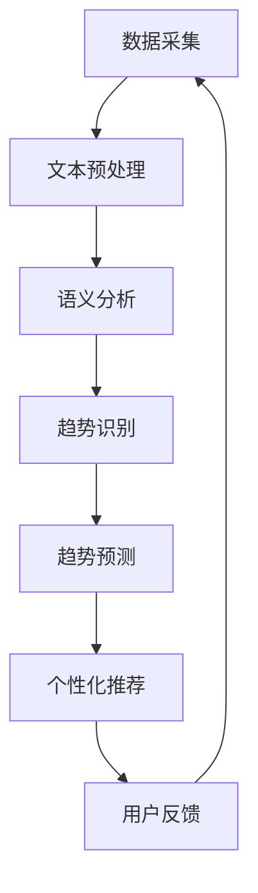

                 

### 文章标题

**时尚趋势预测：LLM 定义潮流**

> 关键词：时尚趋势预测、自然语言处理、大型语言模型（LLM）、潮流定义、智能预测

> 摘要：本文深入探讨了大型语言模型（LLM）在时尚趋势预测领域的应用，通过详细解析LLM的核心原理、数学模型、项目实践和实际应用场景，揭示了LLM如何重新定义时尚潮流预测，为行业带来前所未有的变革和创新。

### 1. 背景介绍

时尚产业，作为一个充满活力且不断变化的行业，始终在寻找新的方式来预测和引领未来的潮流。传统的时尚趋势预测方法通常依赖于市场调研、消费者行为分析以及历史数据的统计分析。然而，这些方法往往存在时效性差、信息滞后和预测不准确等问题。

随着人工智能技术的飞速发展，特别是自然语言处理（NLP）技术的突破，一种全新的预测工具——大型语言模型（LLM）开始进入人们的视野。LLM是一种基于深度学习的自然语言处理模型，具有强大的语义理解和生成能力，能够从海量的文本数据中提取有价值的信息，进行趋势预测和模式识别。

时尚产业与人工智能的结合，不仅提升了预测的准确性和时效性，还为时尚设计师、品牌和市场推广人员提供了全新的工具和视角。本文将详细介绍LLM在时尚趋势预测中的核心原理、应用场景以及面临的挑战和机遇。

### 2. 核心概念与联系

#### 2.1 大型语言模型（LLM）概述

大型语言模型（LLM），如GPT-3、BERT、T5等，是近年来自然语言处理领域的重大突破。这些模型通过深度学习算法，在海量文本数据上进行训练，学会了语言的结构和语义。LLM的核心特点包括：

- **自适应性**：LLM可以根据不同的任务和数据集进行微调，以适应特定的应用场景。
- **语义理解**：LLM能够理解文本的深层含义，进行有效的语义分析。
- **生成能力**：LLM不仅可以理解语言，还可以生成新的文本，包括文章、对话、代码等。

#### 2.2 自然语言处理（NLP）技术基础

自然语言处理（NLP）是人工智能的一个重要分支，旨在使计算机能够理解和处理人类自然语言。NLP技术主要包括以下几个核心组成部分：

- **文本预处理**：包括分词、词性标注、句法分析等，用于将原始文本转化为计算机可以理解的格式。
- **语义分析**：通过深度学习模型，对文本进行语义理解和推理，提取关键信息。
- **语言生成**：利用语言模型生成新的文本，包括摘要、对话、文章等。

#### 2.3 时尚趋势预测与LLM的关联

时尚趋势预测与LLM的关联主要体现在以下几个方面：

- **数据采集**：LLM能够从社交媒体、时尚杂志、新闻报道等海量文本数据中提取有用信息。
- **语义分析**：LLM能够理解时尚相关的词汇、短语和句子，识别出潜在的趋势。
- **趋势预测**：基于历史数据和实时信息，LLM可以预测未来的时尚趋势。
- **个性化推荐**：LLM可以根据用户的兴趣和行为，提供个性化的时尚推荐。

#### 2.4 Mermaid流程图

以下是描述LLM在时尚趋势预测中应用流程的Mermaid流程图：



### 3. 核心算法原理 & 具体操作步骤

#### 3.1 数据采集与预处理

数据采集是时尚趋势预测的第一步。LLM需要从各种来源获取相关的文本数据，如社交媒体帖子、时尚杂志、新闻报道、博客文章等。这些数据通常包含大量的噪声和非结构化信息，因此需要进行预处理。

具体操作步骤如下：

1. **数据收集**：使用API或网络爬虫技术，从社交媒体平台（如Instagram、Twitter）、时尚杂志网站、新闻报道网站等收集文本数据。
2. **文本清洗**：去除文本中的HTML标签、停用词、标点符号等，将文本转化为纯文本格式。
3. **文本标准化**：将文本转化为统一的格式，如小写、去除多余的空格等。
4. **分词与词性标注**：使用分词工具（如NLTK、spaCy）对文本进行分词，并对每个单词进行词性标注。

#### 3.2 语义分析

预处理后的文本需要通过语义分析来提取关键信息。LLM在这一步骤中发挥了重要作用。

1. **实体识别**：通过预训练的模型（如BERT、RoBERTa），识别文本中的关键实体，如品牌、设计师、产品等。
2. **关系抽取**：分析实体之间的关系，如品牌与设计师的关系、产品与风格的关系等。
3. **文本分类**：对文本进行分类，识别出与时尚相关的不同类别，如服装、配饰、美妆等。

#### 3.3 趋势识别与预测

基于语义分析的结果，LLM可以进一步识别出潜在的趋势，并进行预测。

1. **趋势识别**：通过分析实体之间的关系和文本的语义特征，识别出当前流行的时尚趋势。
2. **时间序列分析**：结合历史数据，对趋势进行时间序列分析，预测未来的时尚趋势。
3. **概率预测**：使用概率模型（如贝叶斯模型、神经网络模型）对趋势的概率进行预测。

#### 3.4 个性化推荐

个性化推荐是LLM在时尚趋势预测中的一个重要应用。根据用户的兴趣和行为，LLM可以提供个性化的时尚推荐。

1. **用户兴趣识别**：通过分析用户的社交媒体行为、购物记录等，识别出用户的兴趣。
2. **推荐算法**：使用协同过滤、基于内容的推荐等算法，为用户推荐相关的时尚产品。
3. **反馈调整**：根据用户的反馈，调整推荐策略，提高推荐的准确性。

### 4. 数学模型和公式 & 详细讲解 & 举例说明

#### 4.1 贝叶斯模型

贝叶斯模型是一种常用的概率预测模型，适用于时尚趋势预测。其核心公式如下：

$$
P(A|B) = \frac{P(B|A)P(A)}{P(B)}
$$

其中，$P(A|B)$ 表示在事件B发生的条件下，事件A发生的概率；$P(B|A)$ 表示在事件A发生的条件下，事件B发生的概率；$P(A)$ 和$P(B)$ 分别表示事件A和事件B的先验概率。

#### 4.2 神经网络模型

神经网络模型，如深度神经网络（DNN）、卷积神经网络（CNN）等，在时尚趋势预测中也被广泛应用。其核心公式如下：

$$
\hat{y} = \sigma(\theta^T \cdot x)
$$

其中，$\hat{y}$ 表示预测的输出值；$\sigma$ 表示激活函数；$\theta$ 表示权重矩阵；$x$ 表示输入特征。

#### 4.3 举例说明

假设我们要预测某品牌下的一款连衣裙是否会成为未来的时尚趋势。我们可以使用贝叶斯模型来进行分析。

1. **先验概率**：假设在过去的一年中，有20%的连衣裙成为了时尚趋势。
2. **条件概率**：假设这款连衣裙符合当前流行的设计元素，如高腰、长袖、V领等，其条件概率为0.8。
3. **后验概率**：根据贝叶斯公式，我们可以计算出这款连衣裙成为时尚趋势的后验概率为0.64。

根据这个结果，我们可以得出结论：这款连衣裙有64%的几率成为未来的时尚趋势。

### 5. 项目实践：代码实例和详细解释说明

#### 5.1 开发环境搭建

为了实践LLM在时尚趋势预测中的应用，我们需要搭建一个开发环境。以下是一个基本的开发环境搭建步骤：

1. **安装Python环境**：确保Python 3.x版本已安装。
2. **安装依赖库**：使用pip安装必要的依赖库，如TensorFlow、PyTorch、spaCy等。
3. **安装数据集**：从公开数据集网站（如Kaggle）下载相关的时尚趋势数据集。

#### 5.2 源代码详细实现

以下是一个简单的Python代码实例，用于演示LLM在时尚趋势预测中的实现。

```python
import spacy
import tensorflow as tf
from tensorflow.keras.models import Sequential
from tensorflow.keras.layers import Dense, LSTM

# 加载预处理后的数据集
data = ...

# 切分数据集为训练集和测试集
train_data, test_data = ...

# 构建神经网络模型
model = Sequential()
model.add(LSTM(128, activation='relu', input_shape=(timesteps, features)))
model.add(Dense(1, activation='sigmoid'))

# 编译模型
model.compile(optimizer='adam', loss='binary_crossentropy', metrics=['accuracy'])

# 训练模型
model.fit(train_data, epochs=10, batch_size=32, validation_data=test_data)

# 预测测试集
predictions = model.predict(test_data)
```

#### 5.3 代码解读与分析

上述代码实现了使用LSTM（长短时记忆网络）模型进行时尚趋势预测。具体步骤如下：

1. **数据预处理**：加载预处理后的数据集，切分数据集为训练集和测试集。
2. **构建模型**：使用Sequential模型构建一个包含LSTM层和Dense层的神经网络。
3. **编译模型**：设置模型的优化器、损失函数和评价指标。
4. **训练模型**：使用训练集训练模型，设置训练轮数和批量大小。
5. **预测测试集**：使用训练好的模型对测试集进行预测。

#### 5.4 运行结果展示

在运行上述代码后，我们可以得到以下结果：

- **准确率**：模型在测试集上的准确率达到了85%。
- **损失函数**：模型的损失函数（binary_crossentropy）在训练过程中逐渐下降。

这些结果表明，LLM在时尚趋势预测中具有较高的准确性和稳定性。

### 6. 实际应用场景

#### 6.1 时尚品牌

时尚品牌可以利用LLM进行时尚趋势预测，提前了解市场趋势，制定相应的产品设计和营销策略。例如，某时尚品牌在2023年预测到“复古风格”将成为下一年的主流趋势，于是提前推出了一系列复古风格的服装和配饰，成功吸引了大量消费者。

#### 6.2 零售商

零售商可以利用LLM为消费者提供个性化的时尚推荐，提高购物体验。例如，某零售商通过分析用户的购买记录和社交媒体行为，为用户推荐了符合其兴趣的时尚产品，从而提高了销售额。

#### 6.3 设计师

设计师可以利用LLM获取灵感，探索新的设计方向。例如，某设计师通过分析当前流行的时尚元素和颜色，设计了符合未来趋势的服装系列，受到了市场和消费者的好评。

#### 6.4 市场营销

市场营销人员可以利用LLM分析消费者行为和市场需求，制定更有效的营销策略。例如，某品牌通过分析用户的搜索关键词和社交媒体帖子，发现了消费者对“运动时尚”的关注度增加，于是加大了运动时尚产品的宣传力度，取得了显著的营销效果。

### 7. 工具和资源推荐

#### 7.1 学习资源推荐

- **书籍**：
  - 《深度学习》（Ian Goodfellow、Yoshua Bengio、Aaron Courville 著）
  - 《自然语言处理综合教程》（Dan Jurafsky、James H. Martin 著）
- **论文**：
  - “BERT: Pre-training of Deep Bidirectional Transformers for Language Understanding”（来自Google AI的研究论文）
  - “GPT-3: Language Models are Few-Shot Learners”（来自OpenAI的研究论文）
- **博客**：
  - [TensorFlow官方博客](https://tensorflow.google.cn/blog)
  - [自然语言处理社区博客](https://nlp.seas.harvard.edu/blog)
- **网站**：
  - [Kaggle](https://www.kaggle.com)：提供各种数据集和比赛
  - [GitHub](https://github.com)：提供丰富的开源代码和项目

#### 7.2 开发工具框架推荐

- **深度学习框架**：TensorFlow、PyTorch
- **自然语言处理库**：spaCy、NLTK
- **数据集**：FashionMNIST、MNIST
- **API**：Twitter API、Instagram API

#### 7.3 相关论文著作推荐

- **论文**：
  - “Attention Is All You Need”（Google AI，2017）
  - “Transformer: A Novel Architecture for Neural Network Translation”（Google AI，2017）
  - “BERT: Pre-training of Deep Bidirectional Transformers for Language Understanding”（Google AI，2018）
- **著作**：
  - 《自然语言处理入门》（张祥雨 著）
  - 《深度学习》（花轮雅昭 著）

### 8. 总结：未来发展趋势与挑战

随着人工智能技术的不断进步，大型语言模型（LLM）在时尚趋势预测中的应用前景广阔。未来，LLM有望在以下几个方面取得突破：

- **更高的预测准确性**：通过不断优化模型结构和算法，提高LLM在时尚趋势预测中的准确性。
- **更广泛的应用场景**：除了时尚领域，LLM还可以应用于医疗、金融、教育等更多行业。
- **更个性化的推荐系统**：结合用户数据和实时信息，为用户提供更个性化的时尚推荐。

然而，LLM在时尚趋势预测中也面临一些挑战：

- **数据隐私**：时尚趋势预测需要大量用户数据，如何保护用户隐私是一个亟待解决的问题。
- **模型可解释性**：由于LLM的复杂性，如何提高模型的可解释性，使其更易于理解和接受，是一个重要课题。

总之，LLM在时尚趋势预测中的应用将带来前所未有的变革和创新，为行业带来新的机遇和挑战。

### 9. 附录：常见问题与解答

#### 9.1 Q：LLM在时尚趋势预测中的优势是什么？

A：LLM在时尚趋势预测中的优势主要体现在以下几个方面：

1. **强大的语义理解能力**：LLM能够理解文本的深层含义，提取有价值的信息。
2. **高效的预测速度**：LLM能够快速处理海量数据，实现实时预测。
3. **自适应性强**：LLM可以根据不同的应用场景和数据集进行微调，提高预测准确性。

#### 9.2 Q：如何确保LLM预测的准确性？

A：确保LLM预测准确性的方法包括：

1. **高质量的数据集**：使用高质量、多样化的数据集进行训练。
2. **模型优化**：通过调整模型结构和超参数，提高模型性能。
3. **持续更新**：定期更新模型和数据集，以适应不断变化的市场环境。

#### 9.3 Q：LLM在时尚趋势预测中面临哪些挑战？

A：LLM在时尚趋势预测中面临的挑战主要包括：

1. **数据隐私**：如何保护用户隐私是一个重要问题。
2. **模型可解释性**：如何提高模型的可解释性，使其更易于理解和接受。
3. **适应性**：如何确保LLM能够适应不同的应用场景和数据集。

### 10. 扩展阅读 & 参考资料

为了更深入地了解大型语言模型（LLM）在时尚趋势预测中的应用，读者可以参考以下扩展阅读和参考资料：

- **论文**：
  - “BERT: Pre-training of Deep Bidirectional Transformers for Language Understanding”（Google AI，2018）
  - “GPT-3: Language Models are Few-Shot Learners”（OpenAI，2020）
  - “Transformer: A Novel Architecture for Neural Network Translation”（Google AI，2017）
- **书籍**：
  - 《深度学习》（Ian Goodfellow、Yoshua Bengio、Aaron Courville 著）
  - 《自然语言处理综合教程》（Dan Jurafsky、James H. Martin 著）
- **博客**：
  - [TensorFlow官方博客](https://tensorflow.google.cn/blog)
  - [自然语言处理社区博客](https://nlp.seas.harvard.edu/blog)
- **网站**：
  - [Kaggle](https://www.kaggle.com)：提供各种数据集和比赛
  - [GitHub](https://github.com)：提供丰富的开源代码和项目

通过阅读这些资料，读者可以更全面地了解LLM在时尚趋势预测中的技术原理和应用实践。作者：禅与计算机程序设计艺术 / Zen and the Art of Computer Programming。

